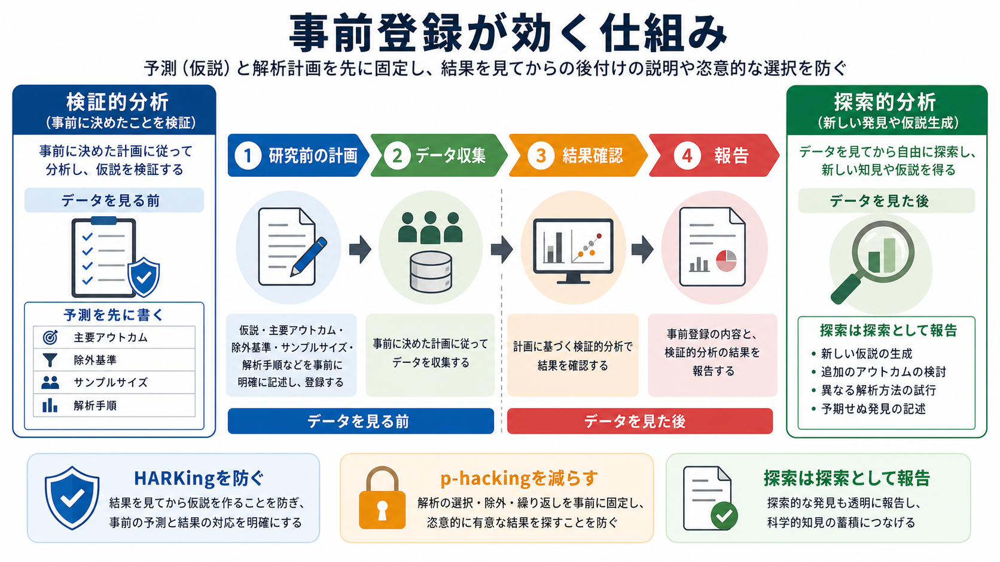

# 事前登録とは何か

## 要点

- 事前登録とは、研究を始める前、または少なくともデータを見て仮説や解析を調整する前に、研究の問い、仮説、方法、除外基準、主要アウトカム、解析計画を時刻付きで公開・保存する仕組みである[1]。
- 目的は、研究者の自由度をゼロにすることではなく、「何を事前に決めて検証したのか」と「結果を見てから探索したこと」を読者が区別できるようにすることである[1][2]。
- 事前登録は、HARKing、すなわち結果を見てから仮説を作ったのに、最初から予測していたように書く実践への対抗策になる[3]。
- また、分析方法、除外基準、アウトカム、サブグループを試行錯誤して有意な結果を探す p-hacking や研究者自由度の問題を見えやすくする[4]。
- 臨床試験では、登録制度は倫理・透明性・出版要件と結びついて発展してきた。心理学では、再現性危機とオープンサイエンスの文脈で広く議論されるようになった[5][6]。

## この記事で答える問い

1. 事前登録では、何を、いつ、どこに登録するのか。
2. 事前登録は、HARKing や p-hacking をどのように抑えるのか。
3. 事前登録と、登録済み報告、臨床試験登録、通常の論文報告は何が違うのか。
4. 事前登録には、どのような限界と誤解があるのか。

## まず結論

事前登録は、研究を「硬直した手続き」に変えるためのものではない。むしろ、研究のなかで生じる二つの活動、すなわち事前の予測を検証する活動と、データから新しい仮説を見つける活動を、後から読める形で分けるための透明化ツールである[1]。

心理学や[[心理測定とは何か|心理測定]]では、測定指標、除外基準、サンプルサイズ、主要仮説、分析モデルの選び方によって結論が変わりやすい。そのため、[[心理学研究法とは何か|心理学研究法]]や[[実験研究とは何か|実験研究]]の設計では、どの判断が事前に定まっていたのかを示すことが、結果の解釈に直接関わる。

## 背景

心理学・認知科学・医学研究では、同じデータでも、外れ値処理、共変量、サブグループ、停止時点、尺度得点の作り方、主要アウトカムの選び方によって、結論が大きく変わることがある。こうした選択の余地は、研究者自由度と呼ばれる。研究者自由度自体は悪ではない。問題は、その選択が結果を見た後に行われたのに、論文上では最初から決まっていたように見える場合である[4]。

この問題は、再現性危機とも結びつく。個々の研究が統計的に有意でも、探索的な選択が積み重なっていると、後続研究で同じ結果が再現されにくくなる。事前登録は、研究の「意思決定の履歴」を外部から確認できる形にすることで、結果の信頼性を評価しやすくする[1]。

臨床試験では、試験の存在を公的レジストリに登録し、主要アウトカムや試験計画を事前に明らかにする制度が整備されてきた。これは、都合の悪い結果が公表されない出版バイアスや、アウトカムの後出し変更を抑えるためにも重要である[5][6]。心理学の事前登録は、この臨床試験登録の発想を、実験、調査、二次分析、心理尺度研究などに広げたものとして理解できる。

## 基本概念

### 何を登録するのか

事前登録で登録する内容は研究領域によって異なるが、典型的には次の項目を含む。

| 項目 | 内容 | なぜ重要か |
|---|---|---|
| 研究の問い | 何を明らかにしたいのか | 解釈の焦点を定める |
| 仮説 | どの方向の効果や関連を予測するか | 結果後の後付け説明と区別する |
| 対象・サンプルサイズ | 誰を何人調べるか | 停止規則や検出力に関わる |
| 主要アウトカム | 主要な従属変数・評価指標 | アウトカムの後出し選択を防ぐ |
| 除外基準 | どのデータを除くか | 恣意的な除外を見えやすくする |
| 解析計画 | モデル、共変量、検定、補正方法 | p-hacking の余地を減らす |
| 探索的分析の扱い | 事前仮説以外に何を探索するか | 検証と探索を分ける |

### どこに登録するのか

心理学や社会科学では、OSF Registries、AsPredicted、各学会・出版社の登録システムなどが使われる。OSFのようなレジストリでは、登録内容に時刻が付き、公開範囲を設定できる。研究者は、データ収集前、または二次データの場合にはデータを確認する前に登録するのが原則である[7]。

臨床試験では、ClinicalTrials.gov や WHO International Clinical Trials Registry Platform など、臨床試験登録用の公的レジストリが使われる。医学雑誌では、前向き登録を投稿・出版の条件にする方針も採用されてきた[6]。

### 何が「事前」なのか

もっとも強い形は、参加者募集やデータ収集の前に登録することである。ただし、既存データの再解析、公開データ、縦断データの一部利用では、「どの時点で研究者がデータを見たのか」が問題になる。この場合は、登録時点で研究者がどの変数、分布、結果を知っていたのかを明記する必要がある。

## 仕組み

事前登録の中心的な働きは、研究後に次の比較を可能にすることである。

1. 研究前に何を予測したか。
2. 研究前にどの方法を使うと決めたか。
3. 実際の論文では何を報告したか。
4. 事前計画から逸脱した場合、その理由は妥当か。

この比較が可能になると、読者は「仮説が検証された」のか、「データから興味深いパターンが見つかった」のかを区別できる。探索的発見は価値が低いわけではない。しかし、探索から得られた仮説は、同じデータで検証された仮説とはみなせない。独立したデータや追試によって検証される必要がある[1]。

## 図解

事前登録、登録済み報告、通常報告は似ているが、固定する時点と査読の位置が異なる。

| 形式 | 計画の固定 | 査読の時点 | 主な強み | 注意点 |
|---|---|---|---|---|
| 事前登録 | 研究前に登録 | 通常は結果後 | 検証と探索を分けやすい | 登録の質が低いと効果が弱い |
| 登録済み報告 | 計画段階で査読 | 結果前に Stage 1 査読 | 結果の有意性に依存しない出版判断を促す | 時間と手間がかかる |
| 通常報告 | 結果後に論文化 | 結果後 | 柔軟な探索を記述しやすい | 出版バイアスや後付け説明が見えにくい |

登録済み報告では、研究計画と解析計画が結果を得る前に査読され、原則として方法が妥当なら、結果が有意かどうかに依存せず出版が約束される。このため、出版バイアスや結果依存の物語化をさらに強く抑える仕組みとして位置づけられる[8]。

## 臨床・研究との接続

### 心理学研究との接続

心理学では、実験課題、質問紙、尺度得点、除外基準、反応時間の処理、共変量の扱いなど、分析前に決めるべき判断が多い。たとえば[[反応バイアスとは何か|反応バイアス]]や[[社会的望ましさバイアスとは何か|社会的望ましさバイアス]]を扱う調査では、どの尺度を主要アウトカムとするか、欠測や不注意回答をどう扱うかによって結果が変わる。

[[心理尺度はどのように作られるのか|心理尺度の作成]]や[[因子分析とは何か|因子分析]]では、探索的因子分析と確認的因子分析の区別も重要である。探索的因子分析で得た構造を同じデータで確認的に検証したように報告すると、証拠の強さを過大評価しやすい。事前登録は、探索的分析と確認的分析を明示的に分ける助けになる。

### 臨床研究との接続

臨床試験登録では、介入、対象者、主要アウトカム、比較条件、登録開始日などを事前に公開する。これは、参加者に関わる研究の倫理性を高めるだけでなく、試験が実施されたのに結果が公表されない問題や、主要アウトカムが後から変更される問題を検出しやすくする[5][6]。

ただし、事前登録は臨床判断そのものではない。精神医学・臨床心理学の知見を読むときには、事前登録の有無を、サンプル、測定、盲検化、脱落、効果量、信頼区間、利益相反などと合わせて評価する必要がある。

## よくある誤解

### 誤解1: 事前登録すれば研究は正しくなる

事前登録は、研究デザインの欠陥を自動的に直すものではない。仮説が曖昧、サンプルサイズが不十分、測定の[[信頼性とは何か|信頼性]]や[[妥当性とは何か|妥当性]]が弱い、解析計画が不明瞭であれば、登録しても証拠の質は高まらない。

### 誤解2: 事前登録すると探索的分析ができなくなる

探索的分析はできる。重要なのは、探索を検証として報告しないことである。事前登録後に予想外の分析を追加した場合は、その分析を探索的分析として明記すればよい[1]。

### 誤解3: 登録から少しでも逸脱したら研究は無効になる

逸脱そのものが問題なのではなく、逸脱が説明されないことが問題である。データの質、装置トラブル、倫理的理由、分布の想定違いなどにより、計画変更が妥当な場合もある。その場合は、何を、なぜ、いつ変更したのかを報告する。

### 誤解4: 事前登録は質的研究や探索研究には不要である

質的研究や探索研究でも、研究の問い、対象、サンプリング、コーディング方針、分析の進め方、研究者の立場性を事前に記述することは、透明性を高める。ただし、質的研究では仮説検証型のテンプレートを機械的に当てはめるより、研究デザインに合った登録様式を選ぶ必要がある。

## 実践のチェックリスト

事前登録を書くときは、少なくとも次を確認する。

- データを見る前に登録したか。
- 主要仮説と探索的問いを分けたか。
- 主要アウトカムと副次アウトカムを分けたか。
- サンプルサイズ、停止規則、除外基準を書いたか。
- 解析モデル、共変量、補正方法、効果量を明記したか。
- 登録後の変更を、論文内で説明できる形に残したか。
- 登録内容を読めば、第三者が同じ主要分析を再現できるか。

## 関連ノート

- [[心理学研究法とは何か]]
- [[実験研究とは何か]]
- [[実験計画における統制とは何か]]
- [[観察研究とは何か]]
- [[心理測定とは何か]]
- [[心理尺度はどのように作られるのか]]
- [[探索的因子分析と確認的因子分析は何が違うのか]]
- [[信頼性とは何か]]
- [[妥当性とは何か]]

MOC更新候補: `content/00_MOC/` 配下の心理学研究法、心理測定、オープンサイエンス関連MOCに追加候補。並列ジョブとの競合を避けるため、本記事ではMOC本体を更新しない。

## 理解チェック

1. 事前登録は、研究のどの時点で行うのがもっとも望ましいか。
2. 「探索的分析」と「検証的分析」を分けることは、なぜ重要か。
3. HARKing と p-hacking は、それぞれどのような問題を指すか。
4. 事前登録と登録済み報告の違いは何か。
5. 事前登録済みの研究でも、結果を読むときに確認すべき点は何か。

## 参考文献

[1] Nosek, B. A., Ebersole, C. R., DeHaven, A. C., & Mellor, D. T. (2018). The preregistration revolution. *Proceedings of the National Academy of Sciences, 115*(11), 2600-2606. https://doi.org/10.1073/pnas.1708274114

[2] Center for Open Science. (n.d.). *Preregistration*. OSF Guides. https://www.cos.io/initiatives/prereg

[3] Kerr, N. L. (1998). HARKing: Hypothesizing after the results are known. *Personality and Social Psychology Review, 2*(3), 196-217. https://doi.org/10.1207/s15327957pspr0203_4

[4] Simmons, J. P., Nelson, L. D., & Simonsohn, U. (2011). False-positive psychology: Undisclosed flexibility in data collection and analysis allows presenting anything as significant. *Psychological Science, 22*(11), 1359-1366. https://doi.org/10.1177/0956797611417632

[5] Zarin, D. A., Tse, T., Williams, R. J., & Carr, S. (2016). Trial reporting in ClinicalTrials.gov: The final rule. *New England Journal of Medicine, 375*, 1998-2004. https://doi.org/10.1056/NEJMsr1611785

[6] International Committee of Medical Journal Editors. (2024). Clinical trials registration. *Recommendations for the Conduct, Reporting, Editing, and Publication of Scholarly Work in Medical Journals*. https://www.icmje.org/recommendations/browse/publishing-and-editorial-issues/clinical-trial-registration.html

[7] OSF Support. (n.d.). *Create a preregistration*. https://help.osf.io/article/158-create-a-preregistration

[8] Chambers, C. D., & Tzavella, L. (2022). The past, present and future of Registered Reports. *Nature Human Behaviour, 6*, 29-42. https://doi.org/10.1038/s41562-021-01193-7

## 未解決問題

- 事前登録の質をどう評価するか。形式的な登録だけでは、曖昧な計画や過度に広い分析選択を防げない。
- 探索的研究、質的研究、機械学習研究に適した事前登録テンプレートをどう設計するか。
- 登録内容と論文報告の不一致を、査読や読者がどの程度体系的に確認できるか。
- 研究者に過度な事務負担をかけず、透明性を高める実務フローをどう作るか。
