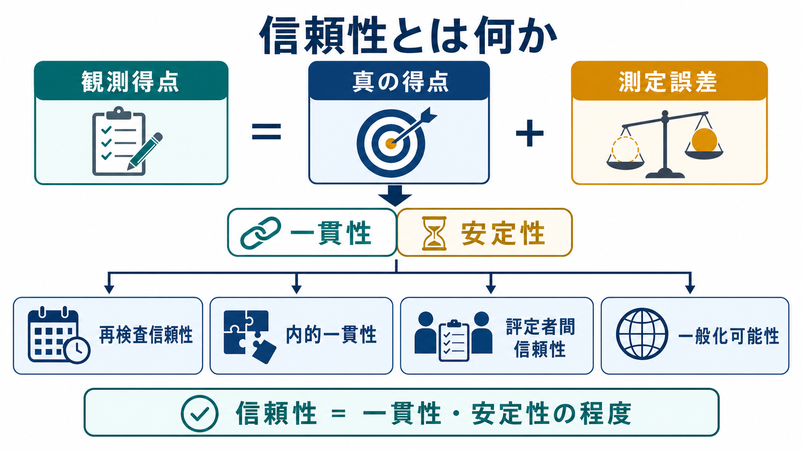
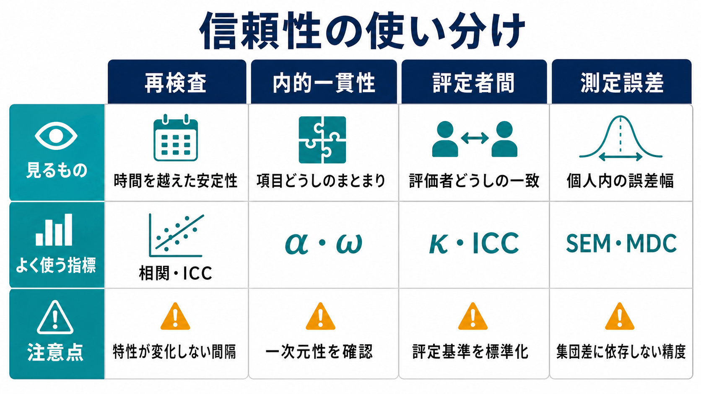

# 信頼性とは何か

## 要点

- 信頼性とは、測定値がどれだけ一貫して安定しているかを表す概念である。心理尺度、認知課題、臨床評価、教育テストでは、同じ対象を測ったときに得点がどれくらい再現されるかが問題になる[1]。
- 古典的テスト理論では、観測得点は「真の得点」と「測定誤差」からなると考える。信頼性は、観測得点のばらつきのうち、どれだけが安定した個人差に由来するかを表す[2]。
- 信頼性には、再検査信頼性、内的一貫性、評定者間信頼性、測定誤差の小ささなど複数の側面がある。どれを報告すべきかは、測定の目的とデザインで決まる[1][6]。
- Cronbach の α はよく使われるが、「尺度が一次元である」「妥当性がある」「すべての誤差が小さい」ことを自動的に保証しない[3][4]。
- 臨床・研究では、信頼性だけで判断せず、測定したい構成概念、対象集団、時間間隔、評定手続き、妥当性、変化量の意味を合わせて読む必要がある[1][7]。

## この記事で答える問い

1. 信頼性は、心理測定で何を意味するのか。
2. 「観測得点」「真の得点」「測定誤差」はどう関係するのか。
3. 再検査信頼性、内的一貫性、評定者間信頼性は何が違うのか。
4. α係数や ICC を読むとき、どこに注意すべきか。
5. 研究・臨床で、信頼性をどう使い、どう使いすぎないようにするか。

## まず結論

信頼性は「この測定値をどれくらい信用してよいか」ではなく、より限定して言えば「同じ測定対象について、どれくらい一貫した得点が得られるか」である。たとえば、同じ特性を持つ人が短い間隔で同じ尺度に答えたとき、得点が大きく揺れすぎるなら、その尺度は時間的に安定していない。複数の評定者が同じ面接を採点して大きく食い違うなら、評定手続きの信頼性に問題がある。複数項目からなる尺度で項目どうしがほとんど関連しないなら、合計得点としてまとめる根拠が弱い。

ただし、信頼性が高いことは「正しいものを測っている」ことと同じではない。毎回ほぼ同じ値を出す体重計でも、常に 3 kg 重く表示されるなら妥当ではない。同じように、ある心理尺度が毎回安定した得点を出しても、それが本当に抑うつ、不安、自己効力感、注意機能などを測っているとは限らない。信頼性は妥当性の十分条件ではないが、得点が不安定すぎる場合、細かな個人差や変化を解釈することは難しくなる[1]。

## 背景

心理学や精神医学で扱う多くの対象は、身長や体温のように直接測れる量ではない。抑うつ、注意、ワーキングメモリ、自己効力感、生活機能、治療同盟、発達特性などは、質問紙、面接、行動課題、観察、神経心理検査などを通じて間接的に推定される。

このとき問題になるのは、得点が「対象の安定した特徴」を反映しているのか、それとも疲労、理解のずれ、偶然の反応、採点者の違い、項目の偏り、環境ノイズを強く含んでいるのかである。[[認知機能検査は何を測っているのか]]や[[認知機能低下はどのように評価するのか]]で扱うように、検査得点は単一の脳機能をそのまま読む窓ではなく、課題要求、測定条件、対象者の状態、基準集団に依存する。

教育・心理テストの標準文書である *Standards for Educational and Psychological Testing* は、テスト得点の解釈には、信頼性・精度・測定誤差についての証拠が必要だと整理している[1]。つまり、信頼性は付録的な統計量ではなく、「その得点をどの範囲で解釈してよいか」を決める基礎情報である。

## 基本概念

### 観測得点、真の得点、誤差

古典的テスト理論では、ある人の観測得点 $X$ を、真の得点 $T$ と誤差 $E$ の和として考える。

$$
X = T + E
$$

ここでいう真の得点は、「本当の人格」や「脳内に固定された実体」を意味しない。同じ測定手続きが無数に繰り返されたと仮定したときの期待値、つまり偶然誤差を平均化した測定上の安定成分である[2]。この枠組みでは、得点のばらつきが安定した個人差に由来するほど信頼性は高く、偶然誤差や状況依存の揺れに由来するほど信頼性は低い。

分散で書けば、理想化された条件では次のように表せる。

$$
\rho_{XX'} = \frac{\sigma_T^2}{\sigma_X^2}
$$

これは、観測得点の分散 $\sigma_X^2$ のうち、真の得点の分散 $\sigma_T^2$ が占める割合を表す。実際の研究では真の得点を直接観察できないため、再検査、項目間共分散、評定者間一致、一般化可能性理論などを使って、目的に応じた信頼性係数を推定する。

### 信頼性は「集団」と「用途」に依存する

信頼性係数は測定器そのものに固定された属性ではない。同じ尺度でも、対象集団の個人差が大きいサンプルでは信頼性が高く見え、個人差が狭いサンプルでは低く見えることがある。したがって、「この尺度の信頼性は .80 である」という言い方は不十分で、「どの対象集団で、どの条件で、どの目的の得点解釈について .80 なのか」を合わせて書く必要がある[1][6]。

たとえば、大学生集団で作られた自己報告尺度を、臨床群、高齢者、児童、異文化集団にそのまま使うと、項目理解、回答範囲、症状分布、社会的望ましさが変わる。信頼性は、尺度の品質だけでなく、使われる文脈の性質も反映する。

### 信頼性と妥当性の違い

信頼性は一貫性、妥当性は解釈の適切さに関わる。信頼性が低い測定では、得点が揺れすぎるため、構成概念との関係を安定して示しにくい。一方で、信頼性が高くても、測るべき構成概念からずれていれば妥当とはいえない。

たとえば、[[自己効力感とは何か]]を測る尺度が、実際には「楽観性」や「自己評価の高さ」を主に反映している場合、得点が安定していても、自己効力感の尺度としての妥当性には疑問が残る。[[自己評価はどのように形成されるのか]]のような近接概念と区別するには、信頼性だけでなく、内容、因子構造、外的基準、理論的予測との対応を検討する必要がある。

## 仕組み

### 1. 再検査信頼性

再検査信頼性は、同じ対象に同じ測定を時間をおいて実施し、得点がどれくらい一致するかを見る。安定した特性を測る尺度では重要だが、間隔の選び方が難しい。短すぎると記憶や練習効果が残り、長すぎると本当に対象特性が変化してしまう。

不安症状、睡眠、疼痛、疲労、気分など、短期間でも変わりやすい状態を測る場合、再検査相関が低いからといって必ずしも尺度が悪いとは限らない。測定対象が状態なのか特性なのかを先に決める必要がある。

### 2. 内的一貫性

内的一貫性は、複数項目が同じ得点としてまとめられる程度を見る。代表的な指標が Cronbach の α である。Cronbach は α を、項目集合の内部構造や分割半信頼性に関わる係数として定式化した[3]。

しかし、α は万能ではない。α は項目数が多いと上がりやすく、項目が似すぎていても高くなる。また、α が高いことは一次元性を保証しない。Sijtsma は、α が信頼性推定値や内的一貫性指標として広く使われすぎており、解釈には強い注意が必要だと論じている[4]。McDonald の ω など、因子モデルに基づく指標が適している場面も多い[5]。

### 3. 評定者間信頼性

評定者間信頼性は、複数の評価者が同じ対象を評価したときの一致を扱う。面接評価、行動観察、診断補助尺度、質的コーディングでは特に重要である。

連続得点では ICC、カテゴリ判断では κ 係数などが使われる。Shrout と Fleiss は、ICC には複数の形式があり、評価者を固定効果として扱うのか、ランダム効果として扱うのか、単一評定者の得点を使うのか、平均評定を使うのかによって選ぶべき係数が変わると整理した[6]。したがって、「ICC を報告した」だけでは不十分で、モデル、単位、信頼区間、評定手続きも必要である。

### 4. 測定誤差、SEM、MDC

臨床や介入研究では、相関係数としての信頼性だけでなく、測定誤差の大きさそのものが重要になる。標準誤差測定（standard error of measurement; SEM）は、個人得点にどれくらい誤差幅があるかを表す。最小検出変化量（minimal detectable change; MDC）は、偶然誤差を超えた変化とみなすために必要な変化量を示す。

これは、治療前後で得点が 2 点改善したとき、その変化が本人の臨床的改善を示すのか、測定誤差の範囲なのかを判断するために重要である。COSMIN は、患者報告アウトカムなどの測定特性を評価する枠組みの中で、信頼性と測定誤差を区別して扱う必要を強調している[7][8]。

## 図解

図1は、信頼性を「観測得点 = 真の得点 + 測定誤差」という考え方から整理している。下段には、再検査信頼性、内的一貫性、評定者間信頼性、一般化可能性という主要な見方を置いた。

図2は、信頼性の中核を分散の分解として示している。観測値のばらつきのうち、安定した個人差が大きく、誤差が小さいほど、得点は一貫して解釈しやすい。

図3は、実務上の使い分けをまとめている。研究計画では、「尺度の合計得点を使うから α」「面接だから ICC」と機械的に選ぶのではなく、何を一貫させたいのかを先に決める。

## 臨床・研究との接続

### 臨床評価

臨床場面で信頼性は、尺度得点や面接評定を安定して解釈するための前提になる。ただし、信頼性係数だけで個別診断や治療方針を決めることはできない。得点は、主訴、生活機能、経過、身体疾患、薬剤、睡眠、環境、面接情報と合わせて読む必要がある。

特に精神医学や臨床心理学では、尺度得点が「研究用の測定値」なのか、「スクリーニングの手がかり」なのか、「治療経過のモニタリング」なのかを区別する必要がある。[[精神疾患の次元的理解とは何か]]で扱うように、次元的尺度は有用だが、診断面接や生活背景の評価を置き換えるものではない。

### 研究デザイン

研究では、信頼性が低い測定を使うと、効果量が過小評価されたり、群間差や相関が不安定になったりする。介入研究では、変化得点の信頼性が重要である。横断研究では、個人差を安定して測れているかが重要である。縦断研究では、尺度が時間を通じて同じ構成概念を測っているか、つまり測定不変性も問題になる。

研究報告では、少なくとも次を明示したい。

| 確認点 | なぜ必要か |
|---|---|
| 対象集団 | 信頼性はサンプルの分散に依存する |
| 測定目的 | 個人差、群間差、変化量で必要な精度が違う |
| 信頼性の種類 | 再検査、内的一貫性、評定者間一致は別物 |
| 推定方法 | α、ω、ICC、SEM、MDC などで意味が違う |
| 信頼区間 | 点推定だけでは不確実性が見えない |
| 妥当性との関係 | 一貫していても、測りたいものを測っているとは限らない |

## よくある誤解

### 誤解1: αが .80 以上なら良い尺度である

α が高いことは、項目が似た反応を引き出していることを示す場合がある。しかし、それだけで尺度が一次元である、妥当である、臨床的に有用であるとは言えない。項目数が多いだけで α が上がることもあるため、因子分析、項目内容、ω、外的基準との関係も見る必要がある[4][5]。

### 誤解2: 信頼性は一度報告されていれば十分である

信頼性は、対象集団、言語、文化、年齢、測定条件、得点範囲に依存する。別の国、別の疾患群、別の年齢層、オンライン調査、短縮版尺度で使うなら、その文脈での証拠が必要になる[1][7]。

### 誤解3: 信頼性が高ければ妥当性も高い

信頼性は妥当性の土台にはなるが、妥当性そのものではない。毎回同じようにずれた測定値を出す検査は、信頼性が高くても妥当ではない。心理測定では、得点の安定性と、得点解釈の正しさを分けて評価する必要がある[1]。

### 誤解4: 変化量があれば改善または悪化といえる

尺度得点が変わっても、その変化が測定誤差を超えているとは限らない。臨床的に意味のある変化を扱うには、SEM、MDC、最小重要差、本人の生活上の変化を合わせて考える必要がある[7][8]。

## 関連ノート

- [[MOC｜認知科学・心理学]]
- [[MOC｜研究方法]]
- [[MOC｜統計・医療統計]]
- [[認知機能検査は何を測っているのか]]
- [[認知機能低下はどのように評価するのか]]
- [[自己効力感とは何か]]
- [[自己評価はどのように形成されるのか]]
- [[精神疾患の次元的理解とは何か]]

### MOC更新候補

- [[MOC｜認知科学・心理学]] の `心理測定・心理学研究` 配下に本記事を追加。
- [[MOC｜研究方法]] または [[MOC｜統計・医療統計]] に、測定誤差・尺度評価の入口として本記事を追加。

## 理解チェック

1. 信頼性と妥当性は、それぞれ何を評価する概念か。
2. 古典的テスト理論で、観測得点はどのように分解されるか。
3. 再検査信頼性と内的一貫性は、どのような問いに答える指標か。
4. α係数が高いだけでは不十分な理由は何か。
5. 臨床で尺度得点の変化を読むとき、SEM や MDC が重要になるのはなぜか。

## 参考文献

[1] American Educational Research Association, American Psychological Association, & National Council on Measurement in Education. (2014). *Standards for Educational and Psychological Testing*. AERA. https://www.aera.net/Publications/Books/Standards-for-Educational-Psychological-Testing-2014-Edition

[2] Lord, F. M., & Novick, M. R. (1968). *Statistical Theories of Mental Test Scores*. Addison-Wesley.

[3] Cronbach, L. J. (1951). Coefficient alpha and the internal structure of tests. *Psychometrika, 16*, 297-334. https://doi.org/10.1007/BF02310555

[4] Sijtsma, K. (2009). On the use, the misuse, and the very limited usefulness of Cronbach's alpha. *Psychometrika, 74*, 107-120. https://doi.org/10.1007/s11336-008-9101-0

[5] McDonald, R. P. (1999). *Test Theory: A Unified Treatment*. Lawrence Erlbaum Associates. https://doi.org/10.4324/9781410601087

[6] Shrout, P. E., & Fleiss, J. L. (1979). Intraclass correlations: Uses in assessing rater reliability. *Psychological Bulletin, 86*(2), 420-428. https://doi.org/10.1037/0033-2909.86.2.420

[7] Mokkink, L. B., Terwee, C. B., Knol, D. L., Stratford, P. W., Alonso, J., Patrick, D. L., Bouter, L. M., & de Vet, H. C. W. (2010). The COSMIN checklist for evaluating the methodological quality of studies on measurement properties: A clarification of its content. *BMC Medical Research Methodology, 10*, 22. https://doi.org/10.1186/1471-2288-10-22

[8] Mokkink, L. B., Boers, M., van der Vleuten, C. P. M., Bouter, L. M., Alonso, J., Patrick, D. L., de Vet, H. C. W., & Terwee, C. B. (2020). COSMIN Risk of Bias tool to assess the quality of studies on reliability or measurement error of outcome measurement instruments: A Delphi study. *BMC Medical Research Methodology, 20*, 293. https://doi.org/10.1186/s12874-020-01179-5

## 未解決問題

- α、ω、階層的ω、一般化可能性理論、項目反応理論を、初学者向けにどう使い分けて教えるのがよいか。
- 状態として変化しやすい心理現象について、「信頼性の低さ」と「本当の変動」をどう分けるか。
- 臨床で使いやすい短縮尺度において、測定精度、回答負担、文化的妥当性をどう両立するか。
- 個人内変動を扱うスマートフォン測定や経験サンプリング法では、従来の信頼性概念をどう拡張すべきか。
