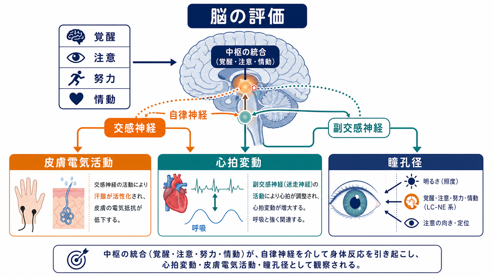
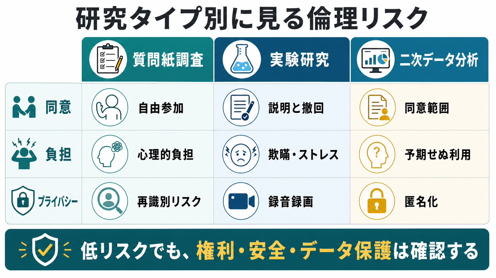
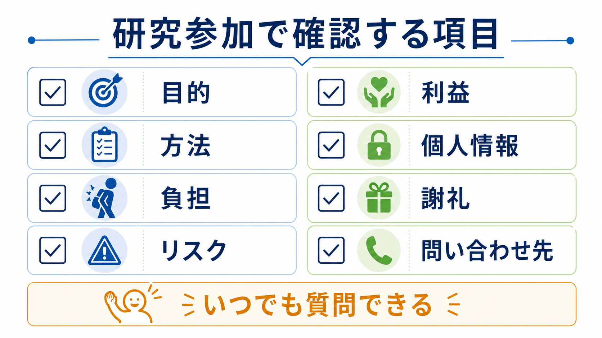

# 倫理審査は心理学研究でなぜ必要なのか

## 要点

- 倫理審査は、研究者を縛る事務手続きではなく、参加者の権利・安全・プライバシーを研究計画の段階で守るための仕組みである。
- 心理学研究では、身体侵襲が小さくても、心理的負担、欺瞞、録音録画、成績・職場評価との関係、個人情報の再識別などのリスクが生じる。
- 倫理審査は、同意説明、リスクと利益の比較、弱い立場に置かれうる人への配慮、データ管理、研究の科学的妥当性を第三者的に確認する。
- 低リスク研究でも、同意の範囲、撤回の自由、匿名化、データ保管、公開方法を明確にしなければ、参加者への不利益と研究への不信を招く。
- 倫理審査は、[[心理学研究法とは何か|心理学研究法]]、[[実験研究とは何か|実験研究]]、[[観察研究とは何か|観察研究]]、[[心理測定とは何か|心理測定]]を社会の中で実施可能にする基盤である。

## この記事で答える問い

1. 心理学研究では、なぜ倫理審査が必要なのか。
2. 倫理審査は、参加者のどのような権利や利益を守るのか。
3. 質問紙・実験・面接・二次データ分析では、どのような倫理リスクがあるのか。
4. 倫理審査を通すことは、研究の科学的妥当性や社会的信頼とどう関係するのか。

## まず結論

倫理審査が必要なのは、心理学研究が「人の内面・行動・生活史・対人関係・健康・学業・職場・臨床的困難」に接近する営みだからである。心理学研究はしばしば採血や投薬を伴わないが、だからといって無害ではない。質問紙の一項目が過去のつらい経験を想起させることがあり、実験の欺瞞が参加者の自己理解を揺さぶることがあり、面接記録や録画が個人を特定する情報を含むこともある。

ベルモント・レポートは、人を対象とする研究の基本原則を「人格の尊重」「善行」「正義」と整理した[1]。心理学研究の倫理審査は、この三原則を実際の研究計画に落とし込む作業である。つまり、参加は自由意思に基づくか、負担は最小化されているか、研究の利益とリスクは釣り合っているか、特定の集団に不当に負担が偏っていないか、個人情報は守られるかを、研究開始前に確認する。

## 背景

研究倫理は、過去の深刻な人権侵害への反省から発展してきた。ベルモント・レポートは、研究参加者が十分な情報を得て自発的に参加すること、リスクと利益を評価すること、参加者選定の公平性を確保することを、人を対象とする研究の中心課題として位置づけた[1]。ヘルシンキ宣言も、医学研究を中心に発展した文書ではあるが、参加者の尊厳、自律性、プライバシー、守秘、インフォームド・コンセント、研究倫理委員会の独立性を重視している[2]。

心理学研究では、研究者と参加者の関係が日常的な権力関係と重なりやすい。たとえば、学生が授業の単位や追加点のために研究へ参加する場合、職場調査で上司や組織が関与する場合、臨床場面で相談者や患者に研究協力を依頼する場合には、形式上は同意していても、断りにくさが生じる。APA の倫理規程は、学生・クライエント・部下を参加者とする研究では、参加しないことや途中でやめることによる不利益から保護する必要を明記している[3]。

日本の文脈でも、生命科学・医学系研究の倫理指針は、研究対象者の人権保護、研究計画の倫理審査、インフォームド・コンセント、個人情報保護を中核に置いている[4]。また日本心理学会は、2026年4月以降の機関誌投稿において、ヒトを対象とする新規データ取得研究では、原則としてインフォームド・コンセントと研究開始前の倫理審査承認を求める方針を示している[5]。これは、心理学研究でも倫理審査が投稿・公開・社会的説明責任の一部になっていることを示す。

## 基本概念

### インフォームド・コンセント

インフォームド・コンセントとは、参加者が研究の目的、方法、所要時間、予測される負担や利益、個人情報の扱い、参加を断る権利、途中撤回の権利、問い合わせ先を理解したうえで、自由に参加を決める手続きである。APA の倫理規程は、研究目的、期間、手続き、撤回権、リスク、不利益、利益、守秘の限界、謝礼、問い合わせ先を説明し、質問の機会を与えることを求めている[3]。

重要なのは、同意書に署名を集めること自体ではない。同意は、参加者が自分に関わる情報とリスクを理解し、断る自由を実際に持てる状況で成立する。研究者が授業担当者、臨床家、上司、支援者である場合には、断っても成績・支援・評価に影響しないことを明確にし、代替課題や第三者による募集などを検討する必要がある。

### リスクと利益

心理学研究のリスクには、身体的リスクだけでなく、心理的負担、羞恥、疲労、ストレス、対人関係上の不利益、成績・雇用・評判への影響、個人情報漏えい、再識別、録音録画の不適切利用が含まれる。ベルモント・レポートの「善行」は、害を避け、可能な利益を最大化し、可能な害を最小化する原則として説明される[1]。

倫理審査では、研究の科学的価値が低いのに参加者へ負担をかけていないかも確認する。設計が不十分で答えが出ない研究は、たとえ手続きが穏やかでも、参加者の時間とデータを無駄に使う点で倫理的に問題を含む。したがって、倫理審査は[[妥当性とは何か|妥当性]]やサンプルサイズ設計、測定の適切さとも関係する。

### プライバシーと守秘

心理学研究では、氏名を収集しなくても、自由記述、音声、映像、所属、年齢、希少な経験、臨床歴、SNS利用履歴などの組み合わせで個人が特定されることがある。個人情報を匿名化するだけでなく、誰がアクセスできるか、どこに保管するか、いつ廃棄するか、二次利用やデータ共有をするかを事前に決める必要がある。

国内の生命科学・医学系研究指針でも、個人情報保護法制との整合、インフォームド・コンセント手続、既存試料・情報の利用や提供が重要な論点として扱われている[4]。心理学の二次データ分析やオープンデータ利用でも、同意範囲、再識別可能性、センシティブな属性の扱いを確認する必要がある。

### 欺瞞とデブリーフィング

心理学実験では、研究目的を事前に完全に説明すると結果が歪むため、欺瞞やカバーストーリーを使う場合がある。しかし欺瞞は、参加者の自律的判断を制限する。APA の倫理規程は、欺瞞を用いる研究について、科学的・教育的・応用的価値があり、欺瞞を用いない代替手続きが実行困難な場合に限定し、身体的苦痛や強い情動的苦痛が予測される研究での欺瞞を禁じている[3]。

欺瞞を用いた場合には、できるだけ早い時点でデブリーフィングを行い、研究の本当の目的、欺瞞を使った理由、データ撤回の可否、質問先を説明する必要がある[3]。倫理審査は、欺瞞を「面白い実験技法」としてではなく、参加者の自律性への制限として評価する。

## 仕組み

倫理審査は、研究開始前に研究計画書、説明文書、同意書、質問項目、募集文、謝礼、データ管理計画などを確認する。中心になるのは、次のような問いである。

| 審査で確認する点 | 心理学研究での具体例 | 関係する原則 |
|---|---|---|
| 参加は自由か | 授業・職場・臨床場面で断りにくさがないか | 自律性、人格の尊重 |
| 説明は十分か | 目的、手続き、時間、撤回、謝礼、問い合わせ先が明確か | インフォームド・コンセント |
| リスクは最小化されているか | トラウマ想起、ストレス課題、疲労、羞恥を減らしているか | 善行、無危害 |
| 科学的に妥当か | 測定、サンプル、解析計画が問いに合っているか | 研究の正当化 |
| 公平か | 特定の集団だけに負担を押しつけていないか | 正義 |
| データは守られるか | 匿名化、アクセス権限、保管期間、廃棄、共有範囲が明確か | プライバシー、守秘 |
| 承認後の変更に対応できるか | 逸脱、予期しない有害事象、計画変更を報告できるか | 継続的保護 |

米国の Common Rule は、IRB、インフォームド・コンセント、リスク水準、弱い立場にある集団への追加保護などを制度化している[6]。日本の制度や各大学の研究倫理審査委員会は必ずしも同一ではないが、第三者的な委員会が研究計画を事前に確認するという考え方は共通している。

## 図解

心理学研究の倫理リスクは、研究タイプごとに見え方が異なる。質問紙調査では「低リスク」と見なされやすいが、設問内容がセンシティブであれば心理的負担や社会的不利益が生じる。実験研究では、欺瞞、ストレス誘導、録音録画、ランダム化、報酬の扱いが問題になる。二次データ分析では、同意範囲、匿名化、再識別、目的外利用が焦点になる。

## 臨床・研究との接続

臨床心理学や精神医学に近い研究では、参加者が支援を求めている人、治療中の人、未成年者、災害やトラウマを経験した人であることがある。この場合、研究参加と支援・治療・評価が混同されやすい。研究で示される説明は、個別の診断や治療指示ではなく、研究目的の情報であることを明確にしなければならない。

また、臨床場面で得られた事例や面接記録を研究に用いる場合、通常業務の記録と研究データの境界が曖昧になりやすい。参加者本人の同意、匿名化、記述の改変による臨床的意味の損失、第三者情報の混入、発表後の再識別可能性を確認する必要がある。ヘルシンキ宣言が強調するように、研究倫理委員会には独立性、権限、十分な資源、多様な視点、研究の停止や承認撤回を判断できる力が求められる[2]。

一方、倫理審査は研究を止めるためだけの仕組みではない。研究計画を明確にし、説明文書を読みやすくし、データ管理を堅牢にし、[[事前登録とは何か|事前登録]]や[[ランダム化はなぜ重要なのか|ランダム化]]、[[プラセボ効果とは何か|プラセボ効果]]の扱いを整理することで、研究の信頼性を高める。参加者保護と科学的妥当性は対立するものではなく、互いを支える。

## よくある誤解

### 「質問紙だけなら倫理審査はいらない」

質問紙だけでも、抑うつ、自傷、虐待、差別経験、性的経験、職場評価、違法行為、家族関係などを尋ねる場合には心理的・社会的リスクがある。匿名質問紙でも、属性の組み合わせや自由記述で再識別される可能性がある。研究のリスクは、方法の見た目ではなく、尋ねる内容、対象者、利用方法、公開方法で評価する。

### 「同意書があれば倫理的に問題ない」

同意書は必要な場合が多いが、同意書だけでは不十分である。説明が理解しにくい、断ると不利益がある、謝礼が過大で事実上の強制になる、撤回方法がない、データ利用範囲が曖昧である場合、同意は倫理的に弱い。倫理審査は、同意の形式ではなく、同意が実質的に自由で理解に基づいているかを確認する。

### 「倫理審査は研究の自由を妨げる」

倫理審査は研究の自由を否定するものではなく、人を対象とする研究が社会的に許容される条件を整える仕組みである。参加者を保護しない研究は、短期的には実施できても、長期的には心理学への信頼を損なう。研究の自由は、説明責任、透明性、参加者保護とともに成り立つ。

### 「公開データなら何をしてもよい」

公開データや既存データでも、利用規約、同意範囲、再識別リスク、センシティブ属性、集団へのスティグマ化を確認する必要がある。SNS投稿や公開掲示板のデータは、技術的に閲覧可能であっても、研究利用や再公開を本人が予期しているとは限らない。二次利用ほど、データの文脈を丁寧に扱う必要がある。

## 関連ノート

- [[心理学研究法とは何か]]
- [[実験研究とは何か]]
- [[観察研究とは何か]]
- [[横断研究と縦断研究は何が違うのか]]
- [[事前登録とは何か]]
- [[心理測定とは何か]]
- [[妥当性とは何か]]
- [[社会的望ましさバイアスとは何か]]

## 関連ノート候補

- 研究倫理とは何か
- インフォームド・コンセントとは何か
- デブリーフィングとは何か
- 個人情報保護と研究データ管理
- 研究参加者の脆弱性とは何か
- 二次データ分析の研究倫理

## MOC更新候補

- `content/00_MOC/MOC｜研究方法.md`
- `content/00_MOC/MOC｜認知科学・心理学.md`
- `content/00_MOC/MOC｜倫理・哲学・社会.md`

## 理解チェック

1. 倫理審査が守ろうとしているものは、研究者の手続き上の責任だけではなく、参加者のどのような権利や利益か。
2. 心理学研究で、身体侵襲がなくても倫理リスクが生じる例を三つ挙げられるか。
3. 欺瞞を用いる研究では、なぜデブリーフィングが重要なのか。
4. 匿名データであっても、再識別リスクが問題になるのはどのような場合か。
5. 科学的に答えが出ない研究が、なぜ倫理的にも問題になりうるのか。

## 未解決問題

- オンライン調査プラットフォームやSNSデータを用いる研究で、参加者がどの程度まで研究利用を予期していると見なせるか。
- AIによる音声・画像・自由記述の解析で、匿名化後にも残る再識別リスクをどのように評価するか。
- 低リスク研究の迅速審査と、形式的な審査漏れを防ぐ仕組みをどう両立させるか。
- オープンサイエンスのデータ共有と、参加者のプライバシー保護をどのように調整するか。

## 参考文献

[1] National Commission for the Protection of Human Subjects of Biomedical and Behavioral Research. (1979). *The Belmont Report: Ethical Principles and Guidelines for the Protection of Human Subjects of Research*. U.S. Department of Health and Human Services. https://www.hhs.gov/ohrp/regulations-and-policy/belmont-report/read-the-belmont-report/index.html

[2] World Medical Association. (2024). *WMA Declaration of Helsinki: Ethical Principles for Medical Research Involving Human Participants*. https://www.wma.net/what-we-do/medical-ethics/declaration-of-helsinki/

[3] American Psychological Association. (2017). *Ethical Principles of Psychologists and Code of Conduct*, Standards 8.01-8.08. https://www.apa.org/ethics/code

[4] 文部科学省・厚生労働省・経済産業省. (2023). *人を対象とする生命科学・医学系研究に関する倫理指針*（令和5年3月27日一部改正）およびガイダンス. https://www.mext.go.jp/a_menu/lifescience/bioethics/seimeikagaku_igaku.html

[5] 日本心理学会. (2026). *日本心理学会機関誌への投稿論文に求める倫理的配慮についての判断方針*. https://psych.or.jp/publication/Ethical_review/

[6] Office for Human Research Protections, U.S. Department of Health and Human Services. (2018). *45 CFR 46: Protection of Human Subjects; Common Rule FAQs and Informed Consent Requirements*. https://www.hhs.gov/ohrp/regulations-and-policy/guidance/faq/45-cfr-46/index.html
