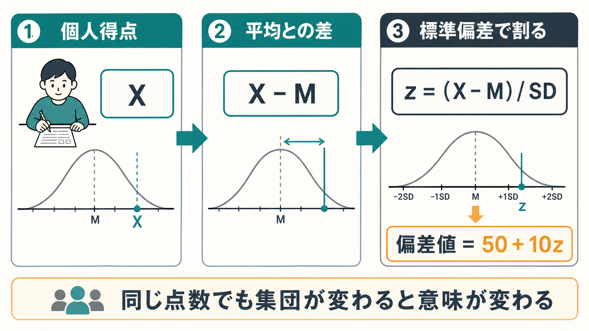
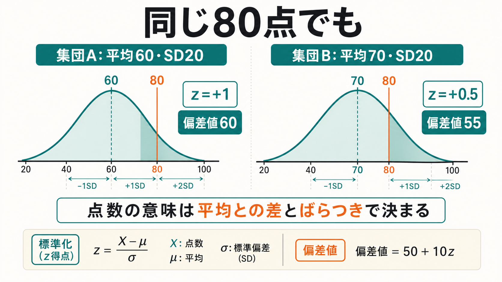
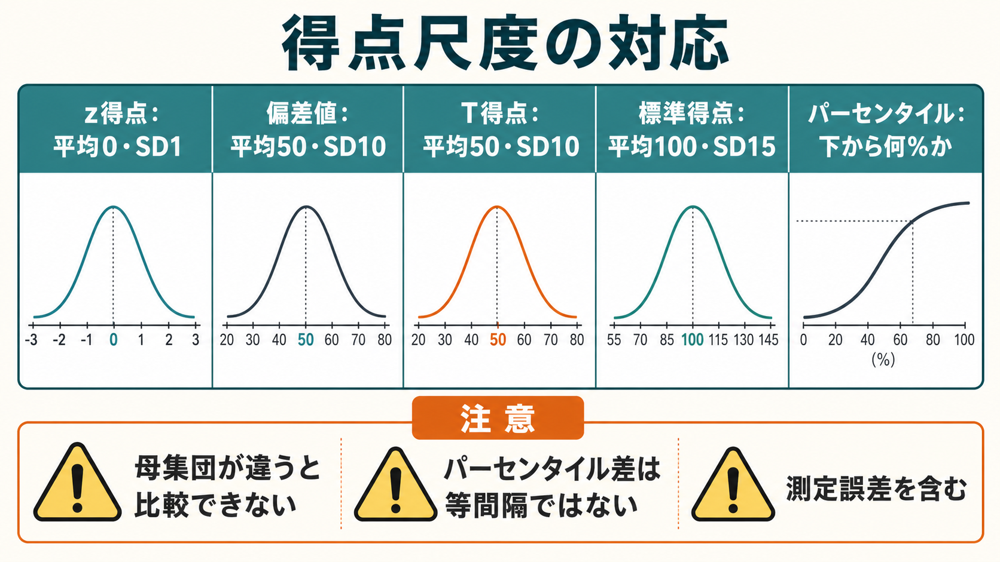

# 偏差値と標準得点は何を意味するのか

## 要点

- 標準得点は、個人得点が平均から標準偏差何個分だけ離れているかを表す相対指標である。
- 偏差値は、z 得点を「平均50、標準偏差10」に変換した尺度で、式は $\text{偏差値}=50+10z$ である。
- 同じ80点でも、平均点と標準偏差が違えば意味は変わる。偏差値は「点数の高さ」ではなく「その集団内での位置」を表す。
- パーセンタイルは「下から何%に位置するか」を表すが、偏差値の1点差とパーセンタイルの1点差は同じ意味ではない。
- 心理検査や臨床尺度では、規準集団、測定誤差、信頼性、妥当性を確認せずに標準得点を個人判断へ直結させてはいけない。

## この記事で答える問い

1. 標準得点、z 得点、偏差値はどのように計算されるのか。
2. 偏差値50、60、70は何を意味するのか。
3. パーセンタイルやT得点とは何が違うのか。
4. 心理検査、教育評価、臨床尺度で解釈するとき、どこに注意すべきか。

## まず結論

偏差値とは、個人の得点を、その人が属する比較集団の平均とばらつきに照らして読み替えた標準得点である。最初に

$$
z=\frac{X-M}{SD}
$$

を計算する。ここで $X$ は個人得点、$M$ は平均、$SD$ は標準偏差である。z 得点は「平均から何標準偏差分だけ上または下にあるか」を表す。偏差値はこれを

$$
\text{偏差値}=50+10z
$$

に変換したものである。平均と同じ得点なら $z=0$ なので偏差値50、平均より1標準偏差高ければ $z=1$ なので偏差値60、2標準偏差高ければ偏差値70になる。これは、標準正規分布の z 得点が平均0、標準偏差1の尺度であることに基づく[1]。

ただし、偏差値は「能力そのもの」を直接測る値ではない。あくまで、あるテスト、ある時点、ある規準集団における相対的位置である。テスト標準の観点では、得点解釈は目的、対象集団、規準集団、信頼性、妥当性の証拠と結びつけて扱う必要がある[2]。この点は、[[心理測定とは何か]]、[[信頼性とは何か]]、[[妥当性とは何か]]で扱う問題と直結している。

## 背景

素点だけでは、異なるテストや異なる集団を比べにくい。たとえば80点という素点は、平均60点の難しいテストでは高い位置を意味するが、平均78点の易しいテストでは平均より少し上にすぎないかもしれない。そこで、個人得点を「平均からの差」と「集団内のばらつき」で割り直す。

標準化の発想は、単位の違う変数を比較するためにも使われる。OpenStax の統計学教材では、z 得点は値が平均より何標準偏差上か下かを示し、異なる尺度の値を比較できると説明されている[1]。心理測定では、これに加えて「どの集団を基準にしたか」が重要になる。AERA・APA・NCME の *Standards for Educational and Psychological Testing* は、規準参照的な解釈の妥当性は、比較対象となる規準集団が適切に定義・記述されているかに依存すると整理している[2]。

## 基本概念

### 素点

素点は、テストや尺度で直接得られた得点である。100点満点の80点、質問紙の合計32点、反応時間450 msなどが素点に当たる。素点は直感的だが、テストの難易度、項目数、採点範囲、対象集団の違いを含んでいる。

### 平均と標準偏差

平均は集団の中心を表し、標準偏差は得点が平均の周りにどれくらい散らばっているかを表す。標準偏差が大きい集団では、平均から10点離れていても珍しくない。標準偏差が小さい集団では、同じ10点差が大きな違いを意味する。

### z 得点

z 得点は、平均との差を標準偏差で割った値である。平均より高ければ正、低ければ負になる。

$$
z=\frac{X-M}{SD}
$$

たとえば平均60、標準偏差20、個人得点80なら、

$$
z=\frac{80-60}{20}=1
$$

であり、その人は平均より1標準偏差高い位置にいる。z 得点の尺度では、平均は0、標準偏差は1である[1]。

### 偏差値

偏差値は、z 得点を平均50、標準偏差10に変換した得点である。心理測定や教育測定でよく使われる T 得点と同じ線形変換の考え方で、T 得点は一般に平均50、標準偏差10の標準得点として定義される[3]。日本の教育文脈で「偏差値」と呼ばれるものも、基本的にはこの変換で理解できる。

$$
\text{偏差値}=50+10z
$$

z 得点が $-1,0,+1,+2$ なら、偏差値はそれぞれ40、50、60、70になる。負の z 得点を避け、平均を50に置くことで、教育場面では直感的に扱いやすい尺度になる。

### パーセンタイル

パーセンタイルは、その得点以下の人が何%いるかを表す。たとえば90パーセンタイルは、その得点以下の人が約90%いるという意味である。標準正規分布では、z 得点から累積確率を求めることでパーセンタイルに変換できる[1]。

ただし、パーセンタイルは等間隔尺度ではない。50パーセンタイルから60パーセンタイルへの差と、90パーセンタイルから99パーセンタイルへの差は、同じ「10ポイント差」でも得点上の距離が同じとは限らない。

## 仕組み

### 同じ80点でも意味が変わる

次の2つの集団を考える。

| 条件 | 個人得点 | 平均 | 標準偏差 | z 得点 | 偏差値 |
|---|---:|---:|---:|---:|---:|
| 集団A | 80 | 60 | 20 | +1.0 | 60 |
| 集団B | 80 | 70 | 20 | +0.5 | 55 |

どちらも素点は80点だが、集団Aでは平均より1標準偏差上、集団Bでは平均より0.5標準偏差上である。したがって偏差値は60と55になる。偏差値は個人の素点だけでは決まらず、平均と標準偏差を含む集団情報から決まる。

### 線形変換として見る

偏差値は z 得点に10を掛けて50を足しただけなので、順位関係は変わらない。z が大きい人ほど偏差値も大きい。重要なのは、尺度の見た目を変えているだけで、元のテストが測っている構成概念や測定誤差が消えるわけではないことである。

この点は [[心理尺度はどのように作られるのか]] と関係する。標準化された得点が整っていても、項目内容が構成概念を適切に表していなければ、得点の意味は弱くなる。テスト仕様には、測定する領域、対象者、意図した解釈、採点・報告手続きが含まれるべきだとされる[2]。

### 正規分布を仮定するときとしないとき

偏差値の計算式そのものは、必ずしも得点分布が完全な正規分布であることを要求しない。平均と標準偏差が計算できれば、z 得点や偏差値は計算できる。しかし、「偏差値60は上位約16%」「偏差値70は上位約2.3%」のように割合へ変換する場合は、得点分布が正規分布に近いという仮定が入る。

分布が大きく歪んでいる、天井効果や床効果が強い、得点がカテゴリ化されている、サンプルサイズが小さい場合には、偏差値から順位や希少性を読む精度は落ちる。これは [[天井効果と床効果とは何か]] や [[因子分析とは何か]] とも接続する問題である。

## 図解

この記事の図は次のように読む。

| 図 | 読み方 |
|---|---|
| 図1 | 素点から z 得点、偏差値へ変換する全体像。個人得点は平均との差と標準偏差によって相対化される。 |
| 図2 | 同じ80点でも、平均と標準偏差が違う集団では偏差値が変わることを示す。 |
| 図3 | z 得点、偏差値、T得点、標準得点100/15、パーセンタイルの違いと注意点を比較する。 |

## 臨床・研究との接続

### 心理検査では「規準集団」が中心になる

知能検査、神経心理検査、症状尺度、発達検査では、素点を年齢、学年、性別、文化的背景、臨床群などの規準集団に照らして解釈することが多い。AERA・APA・NCME の標準は、規準を用いる場合、規準集団が明確に記述され、利用者が自分の対象者と比較できる集団か判断できる情報を示すべきだとしている[2]。

したがって、同じ標準得点でも「一般人口を基準にした得点」なのか、「臨床群を基準にした得点」なのかで意味は違う。患者報告アウトカムの PROMIS では、T 得点50が関連する参照集団の平均、10点が1標準偏差として設計され、得点が高いほど測定概念が多いことを意味する[4]。ただし、疲労や抑うつのような概念では高い得点が重い症状を表す一方、身体機能では高い得点が良好な機能を表す。得点方向を確認する必要がある[4]。

### 測定誤差を含めて読む

個人の観察得点は、古典的テスト理論では真の得点と誤差の和として表される。

$$
X=T+E
$$

患者報告アウトカム尺度の開発に関するレビューでも、古典的テスト理論は観察得点 $X$ を真の得点 $T$ とランダム誤差 $E$ の組み合わせとして扱うと説明されている[5]。したがって、偏差値やT得点が1回得られても、それは誤差を含む観察値である。臨床・研究では、標準誤差、信頼区間、再検査信頼性、内的一貫性を含めて判断する。

PROMIS のような臨床尺度では、T 得点と標準誤差を併記し、95%信頼区間を構成できる。これは「得点が1点違う」ことを過大解釈しないために重要である[6]。さらに、PROMIS の T-score Map の研究では、数値得点を患者の具体的な回答内容に対応させる解釈支援図を作成し、臨床データとの対応を検証している[7]。標準得点は、数字だけでなく、その得点域でどのような症状・機能水準が想定されるかと結びつけて読むほど有用になる。

### 研究では群比較と個人解釈を分ける

研究では、標準得点は尺度間比較、共変量調整、プロフィール表示に役立つ。しかし、群平均の差を個人の臨床的差と混同してはいけない。個人の解釈には、その尺度がその集団で十分な信頼性と妥当性を持つか、カットオフ周辺の誤分類リスクがどの程度あるか、分布が想定に合うかを確認する必要がある。テスト標準では、カットスコア付近では誤分類の可能性が相対的に高いことにも注意が促されている[2]。

## よくある誤解

### 誤解1: 偏差値は絶対的な能力を表す

偏差値は絶対値ではなく、比較集団内の相対的位置である。別の模試、別の年度、別の年齢集団、別の臨床群で算出された偏差値を、そのまま同じ意味として比較することはできない。

### 誤解2: 偏差値50は「悪い」

偏差値50は、その比較集団の平均付近を意味する。平均が高い集団での50と、平均が低い集団での50は同じ素点を意味しない。50は「普通」ではなく、「その規準集団の中心」に近いという意味である。

### 誤解3: 偏差値70なら必ず上位2.3%

得点分布が正規分布に近い場合、偏差値70は平均より2標準偏差上なので、上側約2.3%と対応する。しかし分布が歪んでいる場合、実際の順位割合はずれる。正確な順位を知りたいなら、実データからパーセンタイルを計算する方が直接的である。

### 誤解4: 標準得点にすればテストの質の問題は消える

標準化は、素点を読みやすい尺度へ変換するだけである。項目が測りたい構成概念を表していない、信頼性が低い、規準集団が不適切、文化的バイアスがある、といった問題は標準化では解決しない。これは反応バイアス、社会的望ましさバイアス、心理検査の限界とも関係する。

## 関連ノート

- [[心理測定とは何か]]
- [[心理尺度はどのように作られるのか]]
- [[信頼性とは何か]]
- [[妥当性とは何か]]
- [[古典的テスト理論とは何か]]
- [[因子分析とは何か]]
- [[天井効果と床効果とは何か]]
- [[標準化とは何か]]
- 今後の作成候補: 項目反応理論とは何か、カットオフ値はどのように決めるのか、反応バイアスとは何か

## MOC更新候補

- `content/00_MOC/` 配下の心理測定・統計・研究法系 MOC に、バッチ統合時に本記事へのリンクを追加する候補。
- 並列ジョブとの競合を避けるため、本タスクでは MOC ファイルは更新しない。

## 理解チェック

1. 平均60、標準偏差10、個人得点75のとき、z 得点と偏差値はいくつか。
2. 偏差値60の人は、平均から何標準偏差上にいるか。
3. 同じ偏差値55でも、別の模試どうしで単純比較できない理由は何か。
4. パーセンタイルと偏差値の違いは何か。
5. 臨床尺度のT得点を読むとき、規準集団と標準誤差を確認する理由は何か。

解答例: 1. $z=1.5$、偏差値65。2. 1標準偏差上。3. 比較集団、平均、標準偏差、出題内容が異なるため。4. 偏差値は平均50・標準偏差10の標準得点、パーセンタイルはその得点以下の割合。5. 得点の意味は参照集団に依存し、観察得点には測定誤差が含まれるため。

## 未解決問題

- 非正規分布の尺度で、線形の偏差値と正規化標準得点のどちらを使うべきか。
- 年齢、性別、文化、言語、臨床群の違いをどこまで規準化に含めるべきか。
- 個人フィードバックで、標準得点をどの程度まで直感的に説明できるか。
- AIを用いた適応型検査で、得点尺度と標準誤差を利用者にどう提示するべきか。

## 参考文献

[1] Illowsky, B., & Dean, S. (2013). *Introductory Statistics*, 6.1 The Standard Normal Distribution. OpenStax. https://openstax.org/books/introductory-statistics/pages/6-1-the-standard-normal-distribution

[2] American Educational Research Association, American Psychological Association, & National Council on Measurement in Education. (2014). *Standards for Educational and Psychological Testing*. https://www.testingstandards.net/uploads/7/6/6/4/76643089/standards_2014edition.pdf

[3] Salkind, N. J. (Ed.). (2007). T Scores. In *Encyclopedia of Measurement and Statistics*. SAGE. https://doi.org/10.4135/9781412952644.n450

[4] HealthMeasures. (n.d.). PROMIS: Interpret Scores. https://www.healthmeasures.net/score-and-interpret/interpret-scores/promis

[5] Cappelleri, J. C., Lundy, J. J., & Hays, R. D. (2014). Overview of Classical Test Theory and Item Response Theory for Quantitative Assessment of Items in Developing Patient-Reported Outcomes Measures. *Clinical Therapeutics*, 36(5), 648-662. https://pmc.ncbi.nlm.nih.gov/articles/PMC4096146/

[6] HealthMeasures. (2024). *PROMIS Adult Profile Instruments Scoring Manual*. https://www.healthmeasures.net/images/PROMIS/manuals/Scoring_Manual_Only/PROMIS_Adult_Profile_Scoring_Manual_16Sept2024.pdf

[7] Rothrock, N. E., Amtmann, D., Cook, K. F., et al. (2020). Development and validation of an interpretive guide for PROMIS scores. *Journal of Patient-Reported Outcomes*, 4, 16. https://pmc.ncbi.nlm.nih.gov/articles/PMC7048882/
