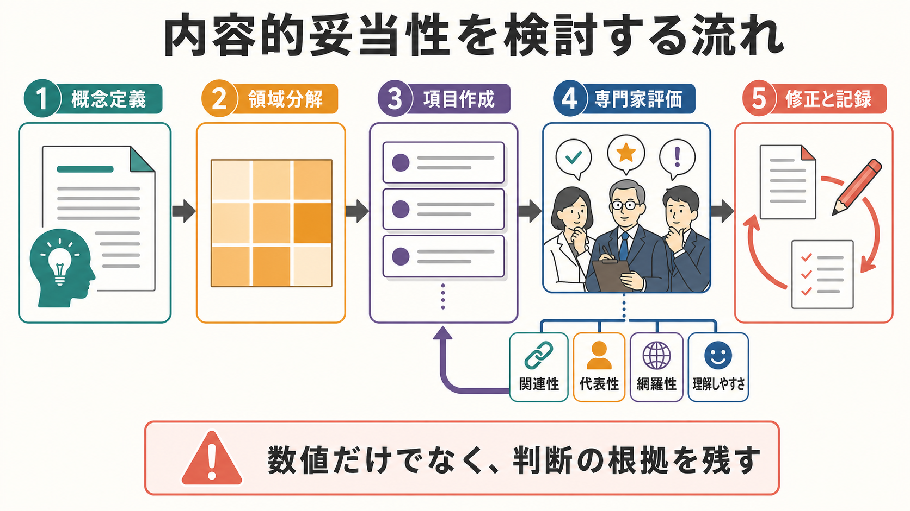
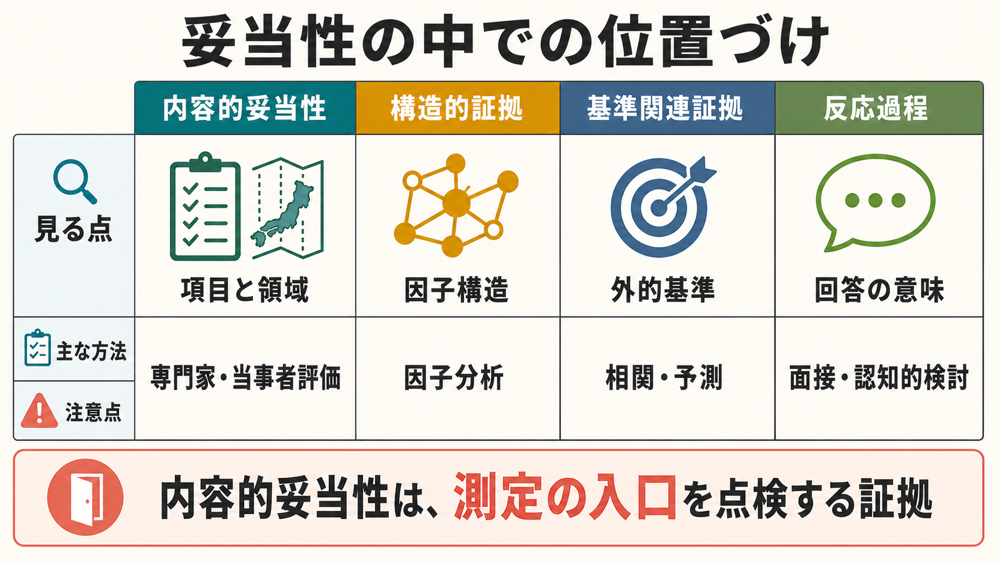

# 内容的妥当性とは何か

## 要点

- 内容的妥当性とは、尺度・検査・質問項目が、測ろうとしている対象概念の内容領域を十分に代表しているかを検討する考え方である[1][2]。
- 現代的な[[妥当性とは何か|妥当性]]論では、内容的妥当性は「妥当性の種類」というより、得点解釈を支える「内容面の証拠」として扱う方が正確である[1][3]。
- 重要なのは、項目が多いことではなく、概念定義、対象集団、使用目的、項目内容、回答形式が整合していることである[2][4]。
- 専門家評価、当事者評価、認知的インタビュー、CVI や CVR などの指標は有用だが、数値だけで内容的妥当性が保証されるわけではない[5][6][7]。
- 臨床・研究では、尺度得点を解釈する前に「その項目群で本当にその概念の範囲を見ているのか」を点検する入口になる。

## この記事で答える問い

1. 内容的妥当性とは何を確認する考え方か。
2. 構成概念妥当性、基準関連妥当性、信頼性とはどう違うか。
3. 内容的妥当性はどのような手順で検討するか。
4. 専門家評価、CVI、CVR をどう読めばよいか。
5. 研究・臨床で内容的妥当性が弱いと何が起こるか。

## まず結論

内容的妥当性は、「この項目群は、測りたい概念の範囲をきちんと覆っているか」という問いに答えるための証拠である。たとえば「不安」を測る尺度が、心配だけを尋ね、身体症状、回避行動、緊張、状況依存性をほとんど含まないなら、その尺度は不安の一部だけを測っている可能性がある。

ただし、内容的妥当性は「専門家がよいと言ったから十分」という単純なものではない。測定内容は、対象概念の定義、対象者、文化・言語、使用目的、解釈する得点の単位に依存する。Haynes らは、内容的妥当性を条件依存的で動的なものとして扱い、心理アセスメントでは目的と文脈に応じた検討が必要だと論じている[2]。

そのため、内容的妥当性の検討では、最初に概念を定義し、内容領域を分け、各領域に対応する項目を作り、専門家や当事者に関連性・代表性・網羅性・理解しやすさを評価してもらう。COSMIN の患者報告アウトカム測定の枠組みでも、内容的妥当性は relevance、comprehensiveness、comprehensibility という観点から評価される[4]。

## 背景

心理測定では、見えない心理特性を項目への回答として観察する。これは便利だが、同時に危うい。項目が概念を十分に代表していなければ、統計的にきれいな因子構造が出ても、得点が意味するものはずれてしまう。

[[心理測定とは何か|心理測定]]や[[心理尺度はどのように作られるのか|心理尺度作成]]では、項目作成の初期段階で内容面の検討が必要になる。ここを曖昧にすると、後から信頼性係数や因子分析で整えても、尺度の中心的な欠陥は残る。Rubio らは、複雑な構成概念を測る尺度を作るとき、心理測定的検討の最初の段階として内容妥当性研究を行う意義を強調している[5]。

一方で、現代的な妥当性論では、内容的妥当性・基準関連妥当性・構成概念妥当性を完全に別々の「種類」として足し合わせる見方は弱くなっている。Messick は、妥当性を得点解釈と使用を支える統合的判断として位置づけ、内容、基準、結果、社会的帰結を構成概念妥当性の枠組みに統合して考える必要を示した[3]。この立場では、内容的妥当性は「内容に基づく証拠」として、妥当性判断全体の一部になる。

## 基本概念

### 内容的妥当性

内容的妥当性は、測定項目、課題、刺激、回答選択肢、採点基準などが、測定したい概念の範囲とどれだけ対応しているかを検討する。Educational and Psychological Testing の Standards でも、妥当性証拠の一つとして「テスト内容に基づく証拠」が位置づけられている[1]。

内容的妥当性で見る点は、少なくとも次の4つである。

- 関連性: 各項目が対象概念に関係しているか。
- 代表性: 項目群が概念領域の重要な部分を偏りなく含むか。
- 網羅性: 重要な側面が抜け落ちていないか。
- 明瞭性: 対象者が項目を意図どおり理解できるか。

### 内容領域

内容領域とは、測定したい概念を構成する下位領域の地図である。たとえば抑うつ尺度なら、悲哀感、興味・喜びの低下、睡眠、食欲、疲労、罪責感、集中困難、希死念慮などが候補になる。ただし、尺度の目的が「スクリーニング」なのか「症状重症度の追跡」なのか「研究用の構成概念測定」なのかで、含めるべき領域は変わる。

### 表面的妥当性との違い

表面的妥当性は、項目が一見して測りたいものを測っていそうに見えるかという印象に近い。内容的妥当性はそれより広く、概念定義と項目範囲の対応を体系的に検討する。表面的に自然な項目でも、概念領域の一部だけに偏っていれば内容的妥当性は弱い。

### 信頼性との違い

[[信頼性とは何か|信頼性]]は、測定がどれだけ一貫しているかを表す。内容的妥当性は、その一貫した得点が何を意味するのかを問う。したがって、信頼性が高い尺度でも、項目内容が概念からずれていれば妥当な解釈はできない。

## 仕組み

### 1. 概念を定義する

最初に、何を測るのかを文章で定義する。ここで「不安」「ストレス」「レジリエンス」などの一般語をそのまま使うと、後の項目作成が曖昧になる。概念定義では、理論的背景、対象集団、時間幅、測定単位を明確にする。

例として「試験不安」を測るなら、「試験場面に関連して生じる認知的心配、身体的覚醒、回避傾向、遂行妨害を含む状態」といった定義が考えられる。定義が明確になるほど、どの項目が必要で、どの項目が外れるかを判断しやすくなる。

### 2. 内容領域を分解する

次に、概念を下位領域に分ける。Sireci は、内容妥当性データの収集と分析では、項目と目標・領域の一致度、関連性、類似性評価などを用いて、項目が意図した内容構造を反映しているか検討する方法を整理している[8]。

この段階では、文献レビュー、既存尺度、臨床的観察、当事者の語りを使う。専門家だけでなく、対象者本人の理解や経験を含めることが重要である。特に患者報告アウトカムや主観的経験を測る尺度では、当事者にとって重要な領域が抜けていないかを確認する必要がある[4]。

### 3. 項目を作る

項目は、内容領域の地図からサンプリングされる。良い項目は、1つの項目で複数の意味を混ぜず、対象者が実際に答えられる形になっている。抽象的すぎる項目、文化依存的な表現、二重否定、専門用語、極端な頻度語は、理解のずれを生みやすい。

項目作成では、項目数を増やせばよいわけではない。領域の重要度に応じた配分が必要である。重要な領域が1項目しかなく、周辺的な領域が多数の項目で占められていれば、合計得点は本来の概念からずれる。

### 4. 専門家・当事者が評価する

内容的妥当性研究では、専門家パネルが項目の関連性、明瞭性、代表性を評価することが多い。Rubio らは、専門家から具体的な評価データを引き出し、Content Validity Index、Factorial Validity Index、評定者間一致の指標を組み合わせて検討する手順を示している[5]。

一方、専門家評価だけでは、対象者が実際にどう読んだかは分からない。認知的インタビューや予備調査を使い、「この項目は何を尋ねていると思ったか」「回答選択肢は答えやすいか」「不快・曖昧な表現はないか」を確認する。COSMIN でも、内容的妥当性には理解しやすさの評価が含まれる[4]。

### 5. CVI と CVR を補助的に使う

CVI は、専門家が項目を「関連している」と評価した割合をもとにする指標である。項目単位の I-CVI、尺度全体の S-CVI などがある。Polit と Beck は、S-CVI には全員一致を重く見る方法と、I-CVI の平均を用いる方法があり、同じ「CVI」でも計算方法を明記しないと解釈が不安定になると指摘した[6]。

CVR は Lawshe が提案した内容妥当性比で、専門家のうち「必須」と判断した人数を使う[7]。

$$
CVR = \frac{n_e - N/2}{N/2}
$$

ここで $n_e$ は「必須」と判断した専門家数、$N$ は専門家総数である。CVR は項目の必要性を数値化できるが、専門家の構成、評価基準、概念定義が弱いと、数値だけが独り歩きする。

## 図解

図1は、対象概念、内容領域、測定項目の関係を示している。内容的妥当性では、項目が単に概念名と関係しているかではなく、概念領域の重要な部分を代表しているかを点検する。

図2は、内容的妥当性を検討する流れである。概念定義から項目作成、専門家評価、修正と記録へ進むが、評価結果によって項目作成や領域分解に戻ることがある。

図3は、内容的妥当性と他の妥当性証拠の違いを示している。内容的妥当性は「測定の入口」を点検する証拠であり、構造的証拠、基準関連証拠、反応過程の証拠と組み合わせて読む必要がある。

## 臨床・研究との接続

臨床では、尺度得点が診断や支援方針に影響することがある。このとき内容的妥当性が弱いと、重要な症状や生活上の困難を見落とす可能性がある。たとえば高齢者の抑うつを測る尺度が若年成人の表現を前提にしていれば、身体症状、喪失体験、認知機能、社会的孤立との関係を十分に拾えないかもしれない。

研究では、内容的妥当性が弱い尺度を使うと、仮説検証そのものが曖昧になる。測定しているつもりの概念と、実際の項目内容がずれていれば、群間差や相関が出ても、その解釈は不安定になる。特に翻訳尺度、短縮版尺度、文化横断研究では、元の項目が新しい文脈でも同じ内容領域を代表しているかを再確認する必要がある。

内容的妥当性の記録は、査読や再利用にも役立つ。概念定義、項目生成の根拠、専門家パネルの構成、当事者参加の有無、削除・修正した項目、その理由を残しておくと、読者は得点解釈の強さを判断しやすくなる。

## よくある誤解

### 誤解1: 専門家が確認すれば内容的妥当性は十分である

専門家評価は重要だが、十分条件ではない。専門家の専門領域が偏っていれば、評価も偏る。対象者が項目を意図どおり理解できるか、文化・言語のずれがないか、使用目的に合っているかも確認する必要がある[2][4]。

### 誤解2: CVI が高ければ内容的妥当性は証明された

CVI は便利な要約指標だが、評価者数、計算方法、評定尺度、合意基準によって値が変わる。Polit と Beck が指摘したように、S-CVI の計算方法が異なれば同じデータでも解釈が変わりうる[6]。数値は判断の代替ではなく、判断を透明化する補助である。

### 誤解3: 因子分析で構造が出れば内容的妥当性は十分である

因子分析は内部構造の証拠であり、項目が概念領域を十分に代表しているかを直接示すものではない。偏った項目群でも、統計的には整った因子構造を示すことがある。

### 誤解4: 短縮版は元尺度と同じ概念を測る

短縮版は回答負担を下げるが、削除された項目が特定の内容領域に偏っていると、測定内容が変わる。短縮版を作るときは、信頼性や因子構造だけでなく、残った項目が概念領域を代表しているかを再検討する必要がある。

## 関連ノート

- [[心理測定とは何か]]
- [[心理尺度はどのように作られるのか]]
- [[妥当性とは何か]]
- [[信頼性とは何か]]

### 関連ノート候補

- 構成概念妥当性とは何か
- 基準関連妥当性とは何か
- 反応過程に基づく妥当性証拠とは何か
- CVIとCVRとは何か
- 尺度翻訳と文化的適応とは何か

### MOC更新候補

- `content/00_MOC/MOC｜認知科学・心理学.md` の心理測定・心理学研究セクションに追加候補。
- 並列ジョブとの衝突を避けるため、このタスクでは MOC 本体は更新しない。

## 理解チェック

1. 内容的妥当性は、項目数の多さではなく何との対応を確認する考え方か。
2. 信頼性が高くても内容的妥当性が弱い尺度の例を1つ説明できるか。
3. CVI や CVR を報告するとき、どのような情報を併記すべきか。
4. 翻訳尺度や短縮版尺度で内容的妥当性を再確認すべき理由は何か。
5. 専門家評価と当事者評価は、それぞれ何を補うか。

## 参考文献

[1] American Educational Research Association, American Psychological Association, & National Council on Measurement in Education. (2014). *Standards for Educational and Psychological Testing*. American Educational Research Association. https://www.aera.net/Publications/Books/Standards-for-Educational-Psychological-Testing-2014-Edition

[2] Haynes, S. N., Richard, D. C. S., & Kubany, E. S. (1995). Content validity in psychological assessment: A functional approach to concepts and methods. *Psychological Assessment, 7*(3), 238-247. https://doi.org/10.1037/1040-3590.7.3.238

[3] Messick, S. (1995). Validity of psychological assessment: Validation of inferences from persons' responses and performances as scientific inquiry into score meaning. *American Psychologist, 50*(9), 741-749. https://doi.org/10.1037/0003-066X.50.9.741

[4] Terwee, C. B., Prinsen, C. A. C., Chiarotto, A., Westerman, M. J., Patrick, D. L., Alonso, J., Bouter, L. M., de Vet, H. C. W., & Mokkink, L. B. (2018). COSMIN methodology for evaluating the content validity of patient-reported outcome measures: A Delphi study. *Quality of Life Research, 27*, 1159-1170. https://doi.org/10.1007/s11136-018-1829-0

[5] Rubio, D. M., Berg-Weger, M., Tebb, S. S., Lee, E. S., & Rauch, S. (2003). Objectifying content validity: Conducting a content validity study in social work research. *Social Work Research, 27*(2), 94-104. https://doi.org/10.1093/swr/27.2.94

[6] Polit, D. F., & Beck, C. T. (2006). The content validity index: Are you sure you know what's being reported? Critique and recommendations. *Research in Nursing & Health, 29*(5), 489-497. https://doi.org/10.1002/nur.20147

[7] Lawshe, C. H. (1975). A quantitative approach to content validity. *Personnel Psychology, 28*(4), 563-575. https://doi.org/10.1111/j.1744-6570.1975.tb01393.x

[8] Sireci, S. G. (1998). Gathering and analyzing content validity data. *Educational Assessment, 5*(4), 299-321. https://doi.org/10.1207/s15326977ea0504_2

## 未解決問題

- 当事者評価と専門家評価が食い違う場合、どのような重みづけで項目を残すべきか。
- 文化横断研究で、概念領域そのものが文化によって異なる場合、どこまでを翻訳・適応、どこからを新尺度開発と見なすべきか。
- 短縮尺度で回答負担を下げることと、内容領域を十分に保つことをどう両立するか。
- 大規模言語モデルを用いた項目生成や項目レビューを、内容的妥当性研究の中でどのように透明に記録すべきか。
