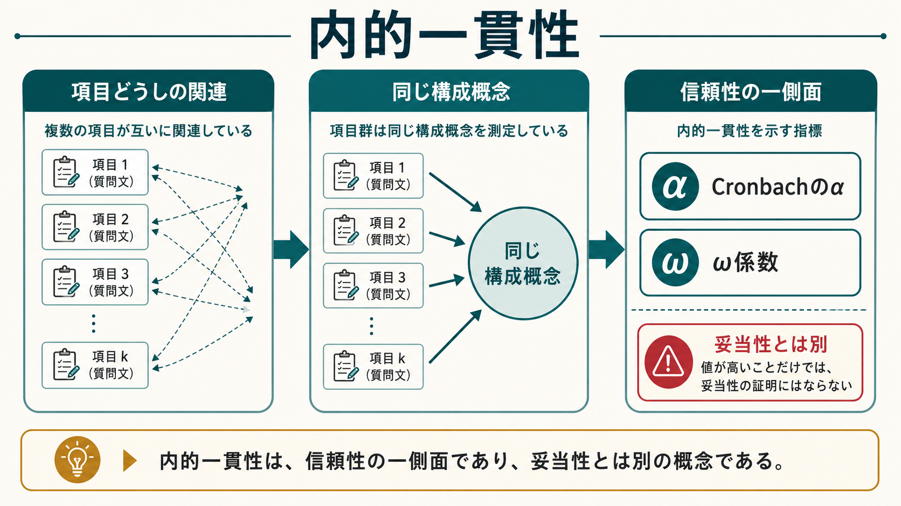
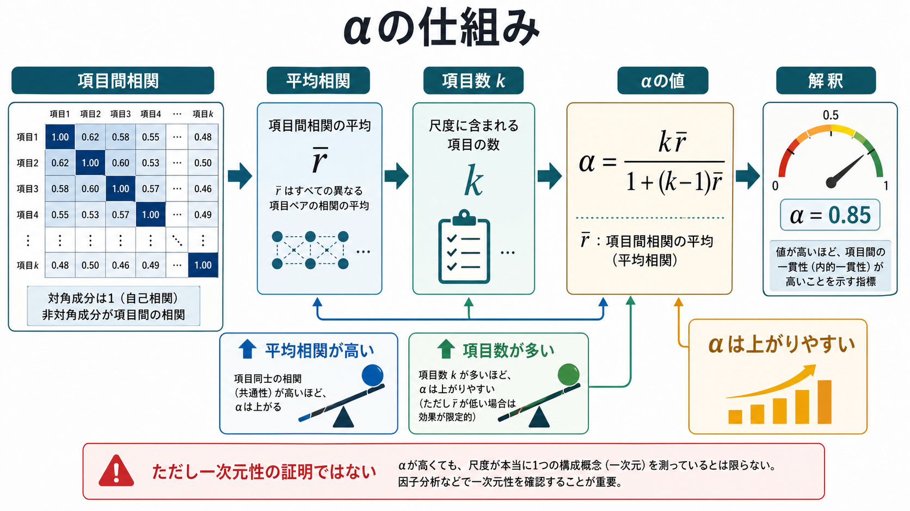
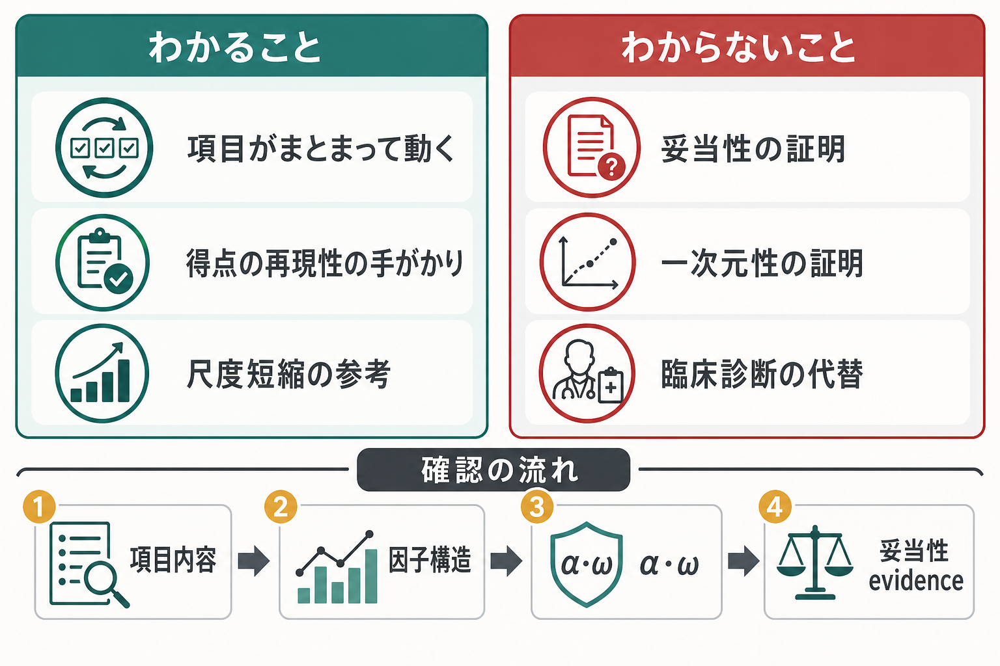

# 内的一貫性とは何か

## 要点

- 内的一貫性とは、尺度内の複数項目が互いに関連し、同じ構成概念を測っていると考えられる程度である。[[信頼性とは何か]]の一側面だが、尺度の正しさ全体を保証するものではない[1][2]。
- Cronbachの $\alpha$ は内的一貫性の代表的指標で、項目間の共分散や平均項目間相関、項目数に依存する[1][3]。
- $\alpha$ が高いことは、項目がまとまって動いている手がかりにはなるが、[[妥当性とは何か]]、一次元性、臨床診断の妥当性を単独で証明しない[2][4]。
- 近年は、項目の因子負荷が等しいという強い仮定に依存しにくい $\omega$ 係数なども併記することが推奨される場面が多い[5][6]。
- 尺度研究では、内的一貫性を「報告すればよい数値」として扱わず、項目内容、因子構造、対象集団、利用目的、妥当性 evidence と一緒に解釈する必要がある[7]。

## この記事で答える問い

1. 内的一貫性は、心理尺度や質問紙で何を意味するのか。
2. Cronbachの $\alpha$ は何を使って計算され、なぜ項目数に影響されるのか。
3. $\alpha$ が高いとき、何が言えて、何が言えないのか。
4. $\omega$ 係数や因子分析は、内的一貫性の理解にどう関わるのか。
5. 研究・臨床で尺度得点を読むとき、どこに注意すべきか。

## まず結論

内的一貫性は、「同じ尺度に入っている項目群が、どれくらい同じ方向に動くか」を見る考え方である。たとえば不安を測る質問紙で、「落ち着かない」「心配が止まらない」「緊張しやすい」といった項目への回答が互いに関連していれば、その項目群は不安という同じ構成概念にまとまっている可能性がある。

ただし、内的一貫性はあくまで信頼性の一側面である。項目がよくまとまっていても、測っているものが本当に不安なのか、抑うつや一般的苦痛を混ぜていないか、臨床判断に使えるほどの根拠があるかは別問題である[2][7]。したがって内的一貫性は、[[心理測定とは何か]]や[[心理尺度はどのように作られるのか]]の中で、内容的検討、因子分析、外的基準との関連、利用場面の検討と組み合わせて読む必要がある。

## 背景

心理学や精神医学では、知能、注意、不安、抑うつ、自己効力感、生活機能のように、直接は観察できない構成概念を扱うことが多い。こうした概念を測るために、複数の項目からなる質問紙や尺度が使われる。

複数項目を使う理由は、単一項目だけでは偶然誤差、表現の偏り、回答者の一時的状態に左右されやすいからである。複数の項目を集めて合計点や平均点にすることで、個々の項目に含まれるノイズをならし、構成概念の安定した側面を捉えようとする。このとき、「それらの項目を本当に足し合わせてよいのか」を点検する入口が内的一貫性である。

Cronbachは1951年の論文で、後に広く使われる係数 $\alpha$ を、テスト内部の構造や分割法による信頼性と関連づけて定式化した[1]。その後、$\alpha$ は心理学・教育測定・医療教育などで最もよく報告される信頼性指標の一つになった[3][5]。一方で、$\alpha$ の意味を「尺度の良さ」「一次元性」「妥当性」と混同する誤用も繰り返し指摘されてきた[4][6]。

## 基本概念

### 内的一貫性

内的一貫性とは、同じ尺度に含まれる項目どうしが、どれくらい共通した情報を持つかを表す。直感的には、同じ構成概念を測る複数項目が「同じ方向にまとまって反応されるか」を見る。

内的一貫性が高い場合、項目群を合計点として扱う根拠が少し強くなる。内的一貫性が低い場合、項目が異なる下位概念を混ぜている、逆転項目が誤解されている、項目表現が曖昧である、対象集団に合っていない、といった可能性を疑う。

### Cronbachのα

Cronbachの $\alpha$ は、項目数 $k$ と項目間の平均相関 $\bar{r}$ によって、次のように表せる。

$$
\alpha = \frac{k\bar{r}}{1 + (k - 1)\bar{r}}
$$

この式から、$\alpha$ は項目どうしの平均的な関連が高いほど上がり、項目数が多いほど上がりやすいことがわかる[1][3]。つまり、$\alpha$ は「項目群がまとまって動く程度」を表す便利な指標だが、項目数を増やすだけでも値が上がるため、数値だけを独立に解釈してはいけない。

### 信頼性と妥当性との違い

[[信頼性とは何か]]は、測定値がどれくらい一貫しているかに関わる。内的一貫性は、そのうち「同じ時点の項目群がどれくらいまとまっているか」を見る側面である。[[再検査信頼性とは何か]]は時間をおいた安定性を扱い、評価者どうしの一致を扱う信頼性とは問いが異なる。

一方、[[妥当性とは何か]]は、その得点解釈と利用がどれくらい適切かに関わる。内的一貫性が高い尺度でも、項目内容が構成概念からずれていれば妥当とはいえない。たとえば「不安尺度」に睡眠不足や疲労だけを問う項目が多く含まれていれば、項目同士はまとまっていても、不安の尺度としての解釈には限界がある。

## 仕組み

### 項目間相関を見る

内的一貫性の出発点は、項目どうしの関連である。全項目が同じ構成概念を反映しているなら、項目間相関はある程度正になるはずである。ただし、相関が高すぎる場合は、同じことを言い換えただけの冗長な項目が多い可能性もある。

項目間相関が低い場合は、次の点を確認する。

- 逆転項目の符号化が正しいか。
- 項目が別の下位概念を測っていないか。
- 項目文が曖昧、二重質問、文化的に不自然な表現になっていないか。
- 対象集団にとって項目の難易度や頻度が極端でないか。

### 項目数の影響

$\alpha$ は項目数に影響される。項目間相関が同じなら、項目数が多いほど $\alpha$ は高くなりやすい。これは、短い尺度の $\alpha$ が低めに出やすいこと、逆に長い尺度では項目がやや雑多でも $\alpha$ が高く見えることを意味する。

したがって、$\alpha = .80$ という値だけを見て「良い尺度」と判断するのは不十分である。尺度が短いのか長いのか、項目内容は重複していないか、下位尺度に分けるべき構造がないかを確認する必要がある[3][4]。

### 一次元性との関係

内的一貫性は一次元性と関係するが、同じではない。一次元性とは、項目群が主に一つの潜在因子を反映しているという構造的な主張である。$\alpha$ が高くても、複数の下位因子が強く相関している場合や、項目数が多い場合には、見かけ上高い値になりうる[4]。

そのため、尺度得点を一つの合計点として使うなら、探索的因子分析や確認的因子分析を使って、項目群の構造を確認することが重要である。これは尺度の内部構造を確認するうえで中心的な論点である。

### ω係数

$\omega$ 係数は、因子分析モデルに基づいて、共通因子が得点分散をどれくらい説明するかを推定する信頼性指標である。$\alpha$ は項目の因子負荷が等しいという強い仮定に近い条件で解釈しやすいが、実際の心理尺度では項目ごとに構成概念への寄与が異なることが多い[5][6]。

このため、近年の方法論的議論では、$\alpha$ だけでなく $\omega$ を併記し、尺度の因子構造に応じて信頼性を評価することが勧められる場面が増えている[5][6]。

## 図解

図1は、内的一貫性を「項目どうしの関連」「同じ構成概念」「信頼性指標」に分けて整理した概念地図である。重要なのは、右下の注意書きのとおり、内的一貫性が高いことは妥当性の証明ではないという点である。

図2は、$\alpha$ が項目間相関と項目数から影響を受けることを示している。平均相関が高いほど $\alpha$ は上がりやすく、項目数が多いほど同じ平均相関でも高い値になりやすい。

図3は、研究・臨床での読み方を「わかること」と「わからないこと」に分けたものである。内的一貫性は得点の再現性の手がかりだが、診断や妥当性判断の代替にはならない。

## 臨床・研究との接続

研究では、尺度得点を群間比較、相関、回帰、媒介分析、介入効果の評価に使うことが多い。尺度の内的一貫性が低いと、測定誤差が大きくなり、効果量や相関が弱く見えることがある。したがって、尺度を使う研究では、対象サンプルにおける $\alpha$ や $\omega$ を報告し、既存研究の値をそのまま借りないことが望ましい。

臨床では、質問紙得点は面接、行動観察、生活歴、身体疾患、文化的背景と合わせて読む補助情報である。内的一貫性が高い尺度でも、個別診断や治療方針を単独で決めるものではない。教育・研究目的で尺度を読むときも、カットオフ、感度・特異度、反応性、翻訳版の検証、対象集団での妥当性 evidence を確認する必要がある。

尺度開発では、内的一貫性の前に、まず項目内容を丁寧に検討する。項目が構成概念の重要な側面を含んでいるか、表現が対象者に理解可能か、逆転項目が混乱を生まないかを確認する。そのうえで、項目分析、因子分析、$\alpha$・$\omega$、外的基準との関連を組み合わせる。

## よくある誤解

### 誤解1：αが.70以上なら十分である

.70 や .80 は便利な目安として使われることがあるが、普遍的な合格基準ではない。探索的研究、個人の判定、集団平均の比較、臨床スクリーニングでは、求められる精度が異なる。目的が厳密な個人判断に近いほど、より高い信頼性と妥当性 evidence が必要になる。

### 誤解2：αが高いほど必ず良い

高すぎる $\alpha$ は、項目が冗長で、同じ内容を繰り返している可能性を示すことがある。尺度は短ければよいわけでも、長ければよいわけでもない。必要な構成概念の幅を保ちながら、不要な重複を避けることが重要である。

### 誤解3：αは一次元性を証明する

$\alpha$ は一次元性の証明ではない。一次元性を主張するには、項目内容の理論的検討と因子構造の検証が必要である[4]。複数の下位尺度があるなら、全体得点だけでなく下位尺度ごとの信頼性を報告する方が適切な場合がある。

### 誤解4：αは妥当性の証拠である

内的一貫性は信頼性の一部であり、妥当性そのものではない。妥当性は、得点解釈と使用目的を支える証拠の総体である[7]。したがって、$\alpha$ が高いというだけで「この尺度は目的の構成概念を測っている」とは言えない。

## 関連ノート

- [[信頼性とは何か]]
- [[妥当性とは何か]]
- [[心理測定とは何か]]
- [[心理尺度はどのように作られるのか]]
- [[再検査信頼性とは何か]]

MOC更新候補: [[MOC｜研究方法]]、[[MOC｜統計・医療統計]]

今後の作成候補: 因子分析とは何か、項目反応理論とは何か、リッカート尺度とは何か、評価者間信頼性とは何か

## 理解チェック

1. 内的一貫性は、信頼性のどの側面を見ているか。
2. Cronbachの $\alpha$ が項目数に影響されるのはなぜか。
3. $\alpha$ が高いのに妥当性が低い尺度の例を考えると、どのような尺度がありうるか。
4. 一次元性を確認するには、$\alpha$ 以外にどのような分析が必要か。
5. 研究論文で尺度の $\alpha$ を見たとき、対象集団や利用目的について何を確認すべきか。

## 未解決問題

- 短縮版尺度では、内容の幅を保つことと内的一貫性を高めることがしばしばトレードオフになる。
- 多次元尺度で全体得点を使うべきか、下位尺度得点を使うべきかは、理論と利用目的によって変わる。
- $\omega$ や階層的 $\omega$ は有用だが、因子モデルの適合、サンプルサイズ、推定方法に依存する。
- 臨床場面では、統計的に信頼できる尺度得点を、個別ケースの文脈でどう解釈するかが残る課題である。

## 参考文献

[1] Cronbach, L. J. (1951). Coefficient alpha and the internal structure of tests. *Psychometrika, 16*, 297-334. https://doi.org/10.1007/BF02310555

[2] Tavakol, M., & Dennick, R. (2011). Making sense of Cronbach's alpha. *International Journal of Medical Education, 2*, 53-55. https://doi.org/10.5116/ijme.4dfb.8dfd

[3] Cortina, J. M. (1993). What is coefficient alpha? An examination of theory and applications. *Journal of Applied Psychology, 78*(1), 98-104. https://doi.org/10.1037/0021-9010.78.1.98

[4] Sijtsma, K. (2009). On the use, the misuse, and the very limited usefulness of Cronbach's alpha. *Psychometrika, 74*, 107-120. https://doi.org/10.1007/s11336-008-9101-0

[5] Revelle, W., & Zinbarg, R. E. (2009). Coefficients alpha, beta, omega, and the glb: Comments on Sijtsma. *Psychometrika, 74*, 145-154. https://doi.org/10.1007/s11336-008-9102-z

[6] Dunn, T. J., Baguley, T., & Brunsden, V. (2014). From alpha to omega: A practical solution to the pervasive problem of internal consistency estimation. *British Journal of Psychology, 105*(3), 399-412. https://doi.org/10.1111/bjop.12046

[7] American Educational Research Association, American Psychological Association, & National Council on Measurement in Education. (2014). *Standards for Educational and Psychological Testing*. American Educational Research Association. https://www.ncme.org/resources-publications/books/testing-standards
