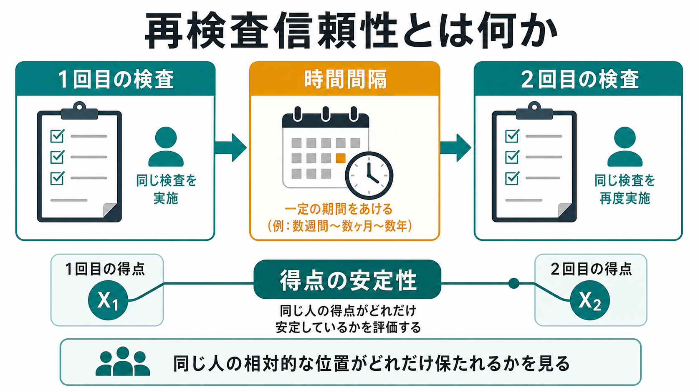
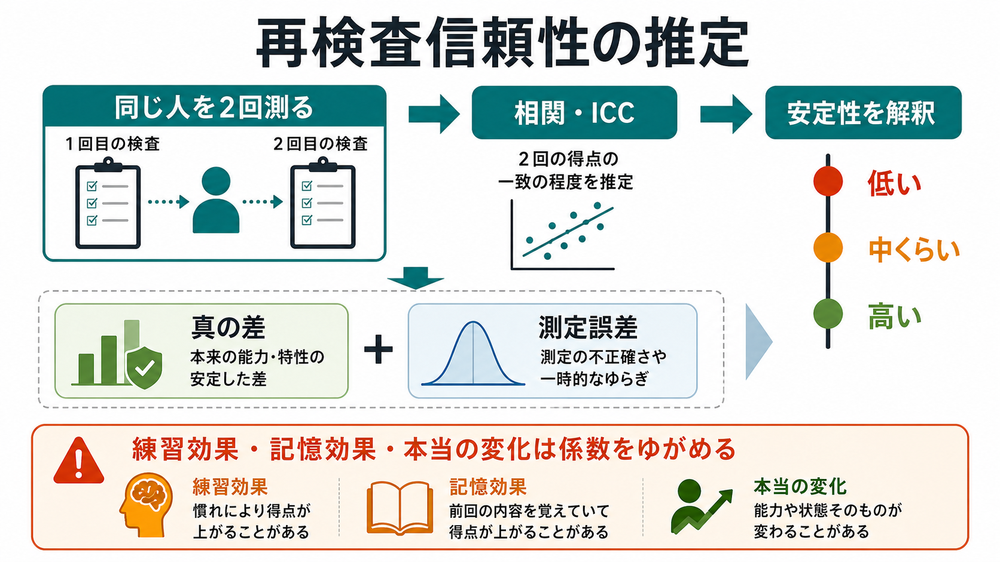
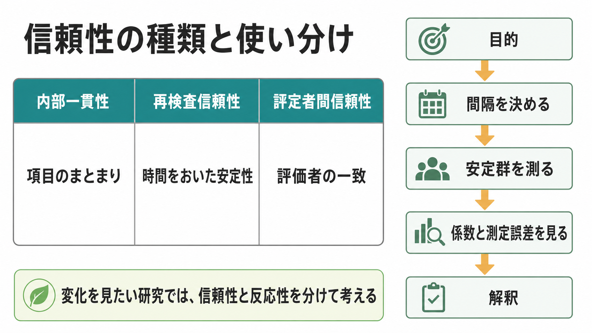

# 再検査信頼性とは何か

## 要点

- 再検査信頼性とは、同じ人に同じ検査を時間をおいて実施したとき、得点の相対的位置がどれだけ安定しているかを表す[[信頼性とは何か|信頼性]]の一種である[1][2]。
- 典型的には、1回目と2回目の得点の相関や級内相関係数（intraclass correlation coefficient; ICC）で推定する。ただし、どの ICC モデルを選んだか、信頼区間、標準誤差測定（SEM）も併記しないと解釈が不十分になりやすい[3][4]。
- 再検査信頼性が高いことは「時間をおいても似た得点が出る」ことを意味するが、それだけで[[妥当性とは何か|妥当性]]は保証されない。安定して誤った構成概念を測っている検査もありうる[1]。
- 検査間隔が短すぎると記憶効果や練習効果が入り、長すぎると本当の変化が入る。したがって、間隔は測りたい構成概念の時間的安定性に合わせて設計する必要がある[2][5]。
- 臨床や縦断研究では、再検査信頼性は「変化を検出できるか」と直結する。個人の変化を読むときは、信頼性だけでなく測定誤差、練習効果、信頼できる変化指標を合わせて考える[6][7]。

## この記事で答える問い

1. 再検査信頼性は何を表す指標なのか。
2. 相関係数や ICC は、何を見ているのか。
3. 検査間隔、練習効果、記憶効果、本当の変化はどう影響するのか。
4. 研究・臨床で再検査信頼性をどう読むべきか。

## まず結論

再検査信頼性は、「同じ検査をもう一度行ったとき、同じ人が集団内でほぼ同じ位置にいるか」を見る指標である。たとえば、不安尺度を今日と2週間後に実施したとき、今日高得点だった人が2週間後にも相対的に高得点で、今日低得点だった人が2週間後にも相対的に低得点なら、再検査信頼性は高くなる。

重要なのは、再検査信頼性が「完全に同じ点数になること」を求める指標ではない点である。心理尺度や認知検査には、疲労、注意、気分、検査環境、採点誤差などの揺らぎが入る。再検査信頼性は、その揺らぎを含んでもなお、個人差の並びがどれだけ保たれるかを評価する。

ただし、変化しやすい状態を測る検査では、再検査信頼性が低いこと自体が必ずしも悪いとは限らない。睡眠不足、急性ストレス、治療反応、学習効果のように、本当に変化する対象では、時間をおいた安定性よりも変化への反応性が重要になる場合がある[5][6]。

## 背景

心理測定では、観察された得点を「測りたいもの」と「誤差」が混ざったものとして扱う。古典的テスト理論では、観察得点 $X$ を真の得点 $T$ と誤差 $E$ の和として考える。

$$
X = T + E
$$

この見方では、信頼性は観察得点のばらつきのうち、安定した個人差に由来する部分がどれくらいあるかを表す。再検査信頼性は、この「安定した個人差」を、同じ手続きの反復測定を使って推定する方法である[1][4]。

教育・心理検査の標準である *Standards for Educational and Psychological Testing* は、信頼性・精度・測定誤差を、得点解釈の前提として文書化すべき情報として位置づけている[1]。つまり、再検査信頼性は単なる付録的な統計値ではなく、「この得点を時間をまたいでどう読んでよいか」を判断するための基礎情報である。

## 基本概念

### 何を測っているのか

再検査信頼性が高いとは、2時点の得点がよく対応していることを意味する。個人Aが1回目に高く、個人Bが1回目に低く、2回目でも同じ相対的な並びが保たれていれば、係数は高くなる。

一方、全員の平均点が少し上がったとしても、個人の順位がほぼ保たれていれば相関は高くなることがある。したがって、再検査信頼性は「平均的に変化したか」ではなく、「個人差の並びが安定しているか」を主に見る。

### 相関と ICC

もっとも単純には、1回目得点と2回目得点の Pearson 相関を計算する。しかし、連続得点の信頼性研究では ICC がよく使われる。ICC は、対象者間の真の差と、測定時点・採点者・誤差などによるばらつきを分けて扱えるためである[3][4]。

ただし、ICC には複数のモデルがある。1要因か2要因か、固定効果かランダム効果か、単一測定か平均測定か、一致性をみるか整合性をみるかによって、値と意味が変わる[3]。そのため、論文や尺度マニュアルでは「ICC = .82」とだけ書くのではなく、モデル、信頼区間、測定条件、検査間隔を明記する必要がある。

### SEM と MDC

再検査信頼性は相対的な安定性を表すが、個人の得点がどの程度の誤差幅をもつかは別に考える必要がある。そこで使われるのが標準誤差測定（standard error of measurement; SEM）である[4]。

SEM は、ある人の観察得点の周囲にどれくらいの測定誤差がありうるかを示す。さらに、最小検出可能変化（minimal detectable change; MDC）は、測定誤差を超えた変化とみなすために必要な差の大きさを示す。臨床や縦断研究では、係数の高さだけでなく「何点以上変われば意味があるのか」を示すことが重要である[4][6]。

## 仕組み

再検査信頼性の研究では、基本的に次の流れをとる。

1. 測りたい構成概念が、一定期間は比較的安定していると仮定できるかを決める。
2. 同じ対象者に同じ検査を2回実施する。
3. 2回の得点を相関または ICC で対応づける。
4. 係数だけでなく、信頼区間、SEM、可能なら MDC を報告する。
5. 練習効果、記憶効果、疲労、症状変化、介入効果を解釈に入れる。

検査間隔は、とくに重要である。短すぎると、回答者が前回の項目や正答を覚えている可能性がある。認知検査では、同じ課題を経験したこと自体が2回目の成績を上げる練習効果を生む。逆に長すぎると、症状、能力、環境、治療、学習による本当の変化が入りやすくなる[5][6]。

したがって、再検査信頼性の「よい間隔」は固定された日数ではない。性格特性のように安定しやすい構成概念と、気分状態や痛みのように変動しやすい構成概念では、妥当な間隔が異なる。[[心理尺度はどのように作られるのか|心理尺度の開発]]では、構成概念の理論、対象集団、使用場面に合わせて間隔を設計する。

## 図解

再検査信頼性は、内部一貫性や評定者間信頼性と混同されやすい。内部一貫性は、同じ尺度内の項目がどれだけまとまっているかを見る。評定者間信頼性は、複数の評価者が同じ対象にどれだけ一致した判断をするかを見る。再検査信頼性は、同じ測定を時間をおいて繰り返したときの安定性を見る。

| 種類 | 主な問い | 典型的な指標 |
|---|---|---|
| 内部一貫性 | 項目は同じ構成概念をまとまって測っているか | Cronbach の $\alpha$、McDonald の $\omega$ |
| 再検査信頼性 | 時間をおいても得点の相対的位置は安定するか | Pearson 相関、ICC、SEM |
| 評定者間信頼性 | 評価者が変わっても判断は一致するか | ICC、Cohen の $\kappa$ |

## 臨床・研究との接続

### 尺度選択

研究で尺度を選ぶとき、再検査信頼性は「一度測れば、その構成概念の比較的安定した個人差をどれくらい拾えるか」を判断する材料になる。COSMIN では、測定特性の評価において、信頼性と測定誤差を区別して検討することが重視されている[2]。そのため、尺度選択では、係数の大きさだけでなく、対象者、検査間隔、測定条件、欠測、サンプルサイズ、信頼区間も確認する。

### 縦断研究

縦断研究では、再検査信頼性が低いと、時点間の変化を検出しにくくなる。測定誤差が大きいと、本当は変化していない人が変化したように見えたり、本当は変化している人の変化が誤差に埋もれたりする。

ただし、変化を見たい研究では、安定性が高ければよいわけでもない。介入や学習によって変わることが期待される尺度では、再検査信頼性と反応性を分けて評価する必要がある[5][6]。

### 臨床評価

臨床では、同じ検査を再実施して「改善した」「悪化した」と判断することがある。このとき、単純に2回の点差だけを見ると、測定誤差や練習効果を本当の変化と誤認しやすい。

神経心理検査の反復評価では、信頼性、練習効果、代替版、標準化された変化指標、回帰に基づく変化推定などを考える必要がある[6]。心理療法研究や臨床アウトカム評価では、信頼できる変化指標（reliable change index; RCI）が、個人の変化が測定誤差を超えているかを判断する考え方として使われてきた[7]。

このため、個別の診断や治療方針を再検査信頼性だけで決めるべきではない。得点変化は、面接、生活状況、治療経過、他の尺度、観察情報と合わせて教育・研究目的で慎重に解釈する。

## よくある誤解

### 誤解1：再検査信頼性が高ければ妥当な検査である

再検査信頼性が高いことは、得点が安定していることを示す。しかし、安定していても、測りたい構成概念を測っているとは限らない。たとえば、不安を測るつもりの尺度が、実際には社会的望ましさや反応スタイルを安定して測っている可能性もある。したがって、再検査信頼性は[[妥当性とは何か|妥当性]]の代替ではない[1]。

### 誤解2：係数が低い尺度は必ず悪い

測る対象が本当に変わりやすいなら、時間をおいた安定性は低くなりうる。急性の気分、痛み、疲労、眠気、治療直後の症状などでは、低い再検査信頼性が対象の変動性を反映している可能性がある。問題は「何を、どの間隔で、何の目的で測ったか」である。

### 誤解3：相関が高ければ個人の点差は小さい

相関や ICC が高くても、全体の平均が2回目で大きく上がることはありうる。順位が保たれていれば相関は高くなるからである。個人の変化を読むには、平均差、SEM、MDC、RCI などを合わせて見る必要がある[4][7]。

### 誤解4：検査間隔は長いほどよい

長い間隔は記憶効果を減らすが、本当の変化を増やす。短い間隔は本当の変化を減らすが、記憶効果や練習効果を増やす。したがって、最適な間隔は、構成概念の変動速度、検査の内容、対象者の状態、研究目的によって決まる[5][6]。

## 関連ノート

- [[信頼性とは何か]]
- [[妥当性とは何か]]
- [[心理尺度はどのように作られるのか]]
- [[自己効力感とは何か]]

### 関連ノート候補

- 内部一貫性とは何か
- 評定者間信頼性とは何か
- 標準誤差測定とは何か
- 最小検出可能変化とは何か
- 信頼できる変化指標とは何か

### MOC更新候補

- `content/00_MOC/` 配下の心理測定・研究法系 MOC に、本記事 `[[再検査信頼性とは何か]]` を追加候補として残す。
- 並列ジョブとの競合を避けるため、本タスクでは MOC ファイルを直接編集しない。

## 理解チェック

1. 再検査信頼性は、同じ検査を2回行ったときの「平均点の同一性」と「個人差の相対的安定性」のどちらを主に見るか。
2. 検査間隔が短すぎると、どのような効果が係数を高く見せる可能性があるか。
3. ICC を報告するとき、係数以外に何を併記すべきか。
4. 再検査信頼性が高くても妥当性が保証されないのはなぜか。
5. 臨床で2回の得点差を読むとき、SEM や RCI が必要になるのはなぜか。

## 未解決問題

- 心理状態のように短期変動が本質的な構成概念では、どの時間幅を「安定性」とみなすべきか。
- スマートフォンやウェアラブルによる高頻度測定では、従来の2時点再検査信頼性をどのように拡張すべきか。
- 文化差、翻訳、検査環境、デジタル実施形式が再検査信頼性に与える影響を、どの程度まで標準的に報告すべきか。

## 参考文献

[1] American Educational Research Association, American Psychological Association, & National Council on Measurement in Education. (2014). *Standards for Educational and Psychological Testing*. AERA. https://www.aera.net/publications/books/standards-for-educational-psychological-testing-2014-edition

[2] Mokkink, L. B., Boers, M., van der Vleuten, C. P. M., Bouter, L. M., Alonso, J., Patrick, D. L., de Vet, H. C. W., & Terwee, C. B. (2020). COSMIN Risk of Bias tool to assess the quality of studies on reliability or measurement error of outcome measurement instruments: A Delphi study. *BMC Medical Research Methodology, 20*, 293. https://doi.org/10.1186/s12874-020-01179-5

[3] Koo, T. K., & Li, M. Y. (2016). A guideline of selecting and reporting intraclass correlation coefficients for reliability research. *Journal of Chiropractic Medicine, 15*(2), 155-163. https://doi.org/10.1016/j.jcm.2016.02.012

[4] Weir, J. P. (2005). Quantifying test-retest reliability using the intraclass correlation coefficient and the SEM. *Journal of Strength and Conditioning Research, 19*(1), 231-240. https://doi.org/10.1519/00124278-200502000-00038

[5] Terwee, C. B., Bot, S. D. M., de Boer, M. R., van der Windt, D. A. W. M., Knol, D. L., Dekker, J., Bouter, L. M., & de Vet, H. C. W. (2007). Quality criteria were proposed for measurement properties of health status questionnaires. *Journal of Clinical Epidemiology, 60*(1), 34-42. https://doi.org/10.1016/j.jclinepi.2006.03.012

[6] Duff, K. (2012). Evidence-based indicators of neuropsychological change in the individual patient: Relevant concepts and methods. *Archives of Clinical Neuropsychology, 27*(3), 248-261. https://doi.org/10.1093/arclin/acr120

[7] Jacobson, N. S., & Truax, P. (1991). Clinical significance: A statistical approach to defining meaningful change in psychotherapy research. *Journal of Consulting and Clinical Psychology, 59*(1), 12-19. https://doi.org/10.1037/0022-006X.59.1.12
