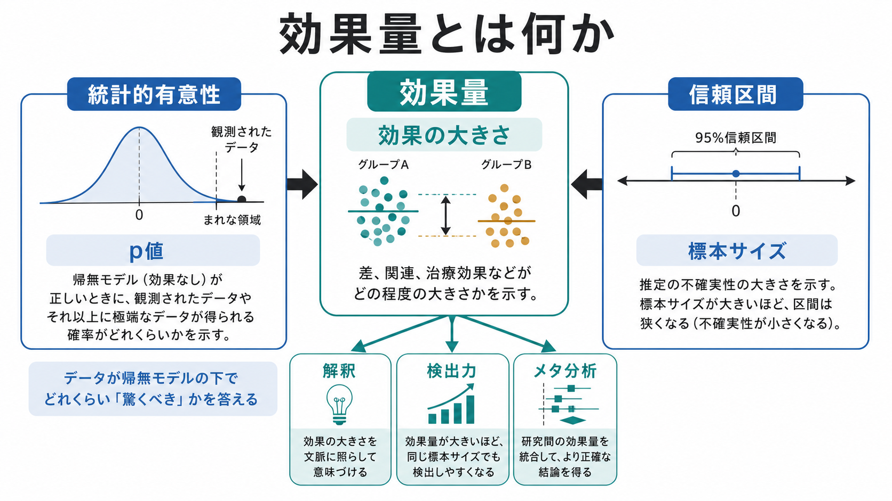
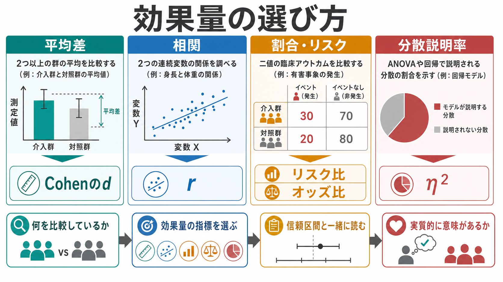

# 効果量とは何か

## 要点

- 効果量とは、群間差、関連、介入効果、リスク差などの「大きさ」を表す統計的指標である。
- p値が主に「帰無仮説のもとで、観測結果以上に極端な結果がどれくらい起こりにくいか」を扱うのに対し、効果量は「どれくらい違うのか」「どれくらい関係しているのか」を扱う[1][3]。
- 効果量は、[[実験研究とは何か]]、[[観察研究とは何か]]、[[心理測定とは何か]]で得られた結果を、理論的・実質的に解釈するための橋渡しになる。
- 効果量は単独で読まず、信頼区間、研究デザイン、測定の[[信頼性とは何か]]、[[妥当性とは何か]]、標本サイズ、先行研究との比較と一緒に読む[2][4][5]。
- 「小・中・大」という目安は便利だが、研究領域、測定単位、介入コスト、累積的影響によって意味が変わる[7]。

## この記事で答える問い

1. 効果量は、統計的有意性と何が違うのか。
2. Cohenのd、相関係数r、リスク比、オッズ比、η²は何を表すのか。
3. なぜ効果量は信頼区間と一緒に読む必要があるのか。
4. 心理学研究や臨床研究で、効果量をどう解釈すればよいのか。
5. 効果量について、どのような誤解が起こりやすいのか。

## まず結論

効果量とは、研究で見つかった差や関連を「大きさ」として表すための指標である。たとえば、介入群と対照群の平均得点が違うとき、その差が統計的に有意かどうかだけでは、差が実質的に大きいのか、小さいのかはわからない。大規模な標本ではごく小さな差でも有意になりうるし、小規模な標本では実質的に重要な差でも有意にならないことがある[3][8]。

したがって、研究結果を読むときは「p < .05 か」だけで止まらず、「どの指標で、どれくらいの大きさか」「信頼区間はどれくらい広いか」「その大きさは研究文脈で意味があるか」を確認する必要がある。効果量は、[[心理学研究法とは何か]]における結果解釈の中心部にある。

## 背景

長いあいだ心理学や生物医学では、帰無仮説有意性検定に基づく「有意か、有意でないか」が研究結果の読み方を支配してきた。しかし、p値は効果の大きさそのものを表さない。ASAの声明も、p値は仮説が正しい確率や効果の大きさを直接与えるものではなく、研究結論を単一の閾値で機械的に決めるべきではないと整理している[3]。

この問題意識から、心理学では効果量、信頼区間、メタ分析を重視する「新しい統計」の考え方が広がってきた[4]。APAの量的研究報告基準も、研究デザイン、測定、分析、推定値、効果量、信頼区間を透明に報告することを求めている[5]。臨床試験の報告基準であるCONSORTも、介入の結果を読者が評価できるよう、推定値と精度を明確に示す報告を重視する[6]。

## 基本概念

### 効果量の最小定義

効果量は、研究上の問いに対応した「差・関連・比・説明率」を数値化したものである。主な問いと指標は次のように対応する。

| 研究上の問い | 典型的な場面 | 代表的な効果量 |
|---|---|---|
| 2つの群の平均はどれくらい違うか | 介入群と対照群の平均得点 | 平均差、標準化平均差、Cohenのd |
| 2つの変数はどれくらい関連するか | 尺度得点と症状得点の関連 | 相関係数r |
| ある出来事の発生確率はどれくらい違うか | 有害事象、再発、寛解 | リスク差、リスク比、オッズ比 |
| モデルは分散をどれくらい説明するか | ANOVA、回帰、[[因子分析とは何か]] | η²、partial η²、R² |

重要なのは、効果量が「研究デザインと測定の問いに依存する」ことである。同じデータでも、平均差を見るのか、相関を見るのか、リスクを見るのかによって、適切な指標は変わる[1][2]。

### p値との違い

p値は、帰無仮説と統計モデルを前提にしたとき、観測されたデータまたはそれ以上に極端なデータが得られる確率に関する指標である。効果量は、観測された差や関連の大きさを表す指標である[3]。

たとえば、ある心理教育プログラムで介入群の平均得点が対照群より2点高かったとする。p値は「この程度の差が偶然変動だけでどれくらい起こりにくいか」を評価する。一方、効果量は「2点という差は、尺度のばらつきや臨床的意味から見てどれくらい大きいか」を評価する。

### 生の効果量と標準化効果量

効果量には、生の単位を保つものと、標準化されたものがある。

- 生の平均差: 例として「抑うつ尺度が平均3点低下した」。単位が意味を持つ場合に解釈しやすい。
- 標準化平均差: 例としてCohenのd。測定尺度が異なる研究を比較しやすい。
- 相関係数r: 変数間の線形関連の強さと向きを表す。
- リスク比・オッズ比: 二値アウトカムの発生しやすさの比を表す。

標準化は、異なる尺度や研究を比較しやすくする一方で、実際の単位感を薄める。したがって、可能なら生の平均差と標準化効果量を併記するとよい[7]。この点は[[標準化とは何か]]ともつながる。

## 仕組み

### Cohenのd

Cohenのdは、2群の平均差を標準偏差で割った標準化平均差である。単純化して書けば、次のようになる。

$$
d = \frac{\bar{X}_1 - \bar{X}_2}{s}
$$

ここで $\bar{X}_1 - \bar{X}_2$ は平均差、$s$ は群内のばらつきを表す標準偏差である。同じ平均差でも、ばらつきが小さい集団ではdは大きくなり、ばらつきが大きい集団ではdは小さくなる[1][2]。

Cohenのdは、介入研究や実験研究で「群間差の大きさ」を比べるときに便利である。ただし、独立群か対応ありデザインか、どの標準偏差で割るか、事前事後差をどう扱うかによって値の意味が変わる。Lakensは、t検定やANOVAで効果量を報告するとき、デザインに合った標準化方法を選ぶ必要があると整理している[1]。

### 相関係数r

相関係数rは、2つの連続変数の線形関連を -1 から 1 の範囲で表す。rが正なら一方が高いほど他方も高い傾向、負なら一方が高いほど他方が低い傾向を示す。

ただし、相関は因果を意味しない。相関が大きく見えても、第三の変数、測定バイアス、選択バイアス、共通原因が関係しているかもしれない。効果量としてrを読むときも、研究デザインと交絡の可能性を確認する必要がある。

### リスク比・オッズ比

臨床研究や公衆衛生研究では、アウトカムが「発生した / しない」のような二値で表されることが多い。この場合、平均差よりもリスク差、リスク比、オッズ比が使われる。

- リスク差: 介入群と対照群の発生割合の差。
- リスク比: 介入群のリスクが対照群の何倍か。
- オッズ比: 発生オッズの比。症例対照研究やロジスティック回帰でよく使われる。

たとえば、再発率が20%から10%に下がる場合、リスク差は10ポイント、リスク比は0.5である。どちらも同じデータを表すが、読み手に与える直感は異なる。臨床的解釈では、絶対差と相対比の両方を確認することが重要である。

### η²とR²

η²やR²は、分散のうちモデルや要因がどれくらい説明しているかを表す。ANOVAではη²やpartial η²、回帰分析ではR²が使われる。

注意すべき点は、partial η²が要因ごとの「部分的な説明率」を表すため、研究デザインやモデル構造によって値が変わりやすいことである。ソフトウェアが出力した数値をそのまま比較するのではなく、何を分母にしているかを確認する必要がある[1][2]。

## 図解

効果量の選び方は、最初に「何を比較しているのか」を決めると整理しやすい。平均を比べるのか、変数間の関連を見るのか、二値アウトカムの発生を比べるのか、モデルの説明力を見るのかで、指標は変わる。

実務上は、次の順序で読むと混乱しにくい。

1. 研究上の問いを確認する。
2. 問いに合った効果量指標かを確認する。
3. 点推定値だけでなく信頼区間を見る。
4. 測定尺度、研究デザイン、先行研究、臨床・教育・社会的コストを踏まえて解釈する。

## 臨床・研究との接続

### 心理学研究での意味

心理学では、測定対象が潜在概念であることが多い。たとえば注意、記憶、抑うつ、不安、動機づけ、自己効力感などは、直接観察できる物理量ではなく、尺度や課題を通じて推定される。このため、効果量の解釈は測定の[[信頼性とは何か]]や[[妥当性とは何か]]に依存する。

信頼性が低い測定では、真の関連が弱く見えることがある。妥当性が不十分な尺度では、大きな効果量が出ても、そもそも何を測っているのかが曖昧になる。効果量は「統計的な大きさ」であると同時に、「測定された構成概念の大きさ」でもある。

### メタ分析と累積的科学

効果量は、単一研究だけでなく、研究の蓄積を統合するために重要である。メタ分析では、異なる研究で得られた効果量を共通の尺度に変換し、平均的な効果や研究間の異質性を評価する。Lakensは、効果量が後続研究の検出力分析やメタ分析に使えるため、累積的科学にとって中心的だと述べている[1]。

この意味で、効果量を報告しない研究は、後から統合しにくい。Fritzらの調査では、実験心理学の代表的雑誌でも効果量や効果量の信頼区間の報告が十分ではなかったことが示されており、報告実践の改善が課題になっている[2]。

### 臨床研究での意味

臨床研究では、統計的に有意な差があっても、それが患者や支援対象者にとって意味のある変化かは別問題である。たとえば症状尺度が平均1点改善しても、その変化が日常生活、再発率、副作用、費用、負担の観点から意味を持つかは文脈に依存する。

したがって、臨床・教育・支援への接続では、効果量を「個別診断や治療指示」として読むのではなく、集団レベルの研究知見として読む必要がある。[[カットオフ値はどのように決めるのか]]と同様に、統計的閾値だけで判断せず、利益、不利益、測定誤差、対象集団を合わせて考える。

## よくある誤解

### 誤解1: 有意なら効果は大きい

有意性と効果の大きさは別である。標本サイズが大きければ、ごく小さな効果でも有意になりやすい。逆に標本サイズが小さければ、実質的に重要な効果でも有意にならないことがある[3][8]。

### 誤解2: 有意でなければ効果はない

有意でない結果は、「効果が存在しない」と同じではない。推定値の信頼区間が広ければ、データが不十分で、重要な効果もほぼゼロの効果も両方ありうる。非有意結果を読むときも、効果量と信頼区間を見る必要がある[4][8]。

### 誤解3: 小さい効果量は無意味である

小さい効果量が常に無意味とは限らない。多くの人に繰り返し作用する介入、低コストで副作用が少ない介入、長期間にわたり累積する心理・社会的要因では、小さな効果でも実質的に重要になりうる[7]。

### 誤解4: Cohenの小・中・大を機械的に使えばよい

Cohenのdやrには、しばしば小・中・大の目安が示される。しかし、その目安は文脈がないと粗い。FunderとOzerは、効果量を抽象的なラベルだけで読むのではなく、よく理解されたベンチマークや具体的な帰結と比較して評価することを勧めている[7]。

### 誤解5: 標準化効果量だけで十分である

標準化効果量は研究間比較に便利だが、単位を失う。臨床尺度、教育得点、反応時間、収入、再発率など、単位が解釈可能な場合には、生の差や絶対リスク差も併記するほうが読み手に伝わりやすい。

## 関連ノート

- [[心理学研究法とは何か]]
- [[実験研究とは何か]]
- [[観察研究とは何か]]
- [[心理測定とは何か]]
- [[標準化とは何か]]
- [[信頼性とは何か]]
- [[妥当性とは何か]]
- [[カットオフ値はどのように決めるのか]]
- [[因子分析とは何か]]

## MOC更新候補

- `content/00_MOC/` 配下の心理学研究法・心理測定・統計関連MOCに、この記事へのリンクを追加する候補。
- 並列ジョブとの競合を避けるため、本タスクではMOCファイル自体は更新しない。

## 理解チェック

1. p値と効果量は、それぞれ何を答える指標か。
2. 同じ平均差でも、標準偏差が大きい場合と小さい場合でCohenのdはどう変わるか。
3. 効果量を信頼区間と一緒に読むべき理由は何か。
4. 「小さい効果量」が実質的に重要になるのは、どのような場合か。
5. 生の平均差と標準化平均差を併記する利点は何か。

## 未解決問題

- 心理学の各領域で、効果量の現実的なベンチマークをどのように整備するか。
- 小さいが累積的に重要な効果を、理論・実践・政策判断の中でどう扱うか。
- 効果量の報告を、事前登録、検出力分析、メタ分析、再現性評価とどう接続するか。
- 臨床的に意味のある最小差と、統計的な効果量指標をどう対応づけるか。

## 参考文献

[1] Lakens, D. (2013). Calculating and reporting effect sizes to facilitate cumulative science: A practical primer for t-tests and ANOVAs. *Frontiers in Psychology, 4*, 863. https://doi.org/10.3389/fpsyg.2013.00863

[2] Fritz, C. O., Morris, P. E., & Richler, J. J. (2012). Effect size estimates: Current use, calculations, and interpretation. *Journal of Experimental Psychology: General, 141*(1), 2-18. https://doi.org/10.1037/a0024338

[3] Wasserstein, R. L., & Lazar, N. A. (2016). The ASA's statement on p-values: Context, process, and purpose. *The American Statistician, 70*(2), 129-133. https://doi.org/10.1080/00031305.2016.1154108

[4] Cumming, G. (2014). The new statistics: Why and how. *Psychological Science, 25*(1), 7-29. https://doi.org/10.1177/0956797613504966

[5] Appelbaum, M., Cooper, H., Kline, R. B., Mayo-Wilson, E., Nezu, A. M., & Rao, S. M. (2018). Journal article reporting standards for quantitative research in psychology: The APA Publications and Communications Board Task Force report. *American Psychologist, 73*(1), 3-25. https://doi.org/10.1037/amp0000191

[6] Schulz, K. F., Altman, D. G., Moher, D., & the CONSORT Group. (2010). CONSORT 2010 statement: Updated guidelines for reporting parallel group randomised trials. *BMJ, 340*, c332. https://doi.org/10.1136/bmj.c332

[7] Funder, D. C., & Ozer, D. J. (2019). Evaluating effect size in psychological research: Sense and nonsense. *Advances in Methods and Practices in Psychological Science, 2*(2), 156-168. https://doi.org/10.1177/2515245919847202

[8] Nakagawa, S., & Cuthill, I. C. (2007). Effect size, confidence interval and statistical significance: A practical guide for biologists. *Biological Reviews, 82*(4), 591-605. https://doi.org/10.1111/j.1469-185X.2007.00027.x
