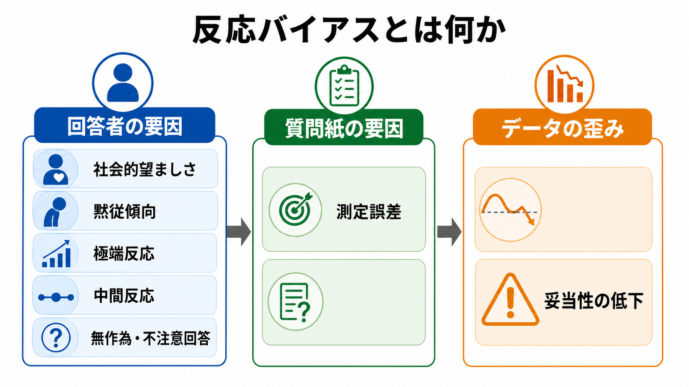
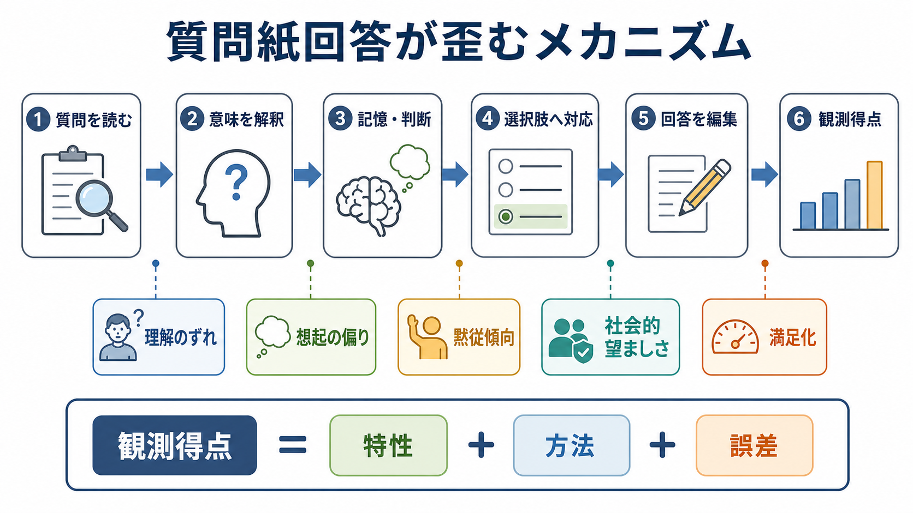
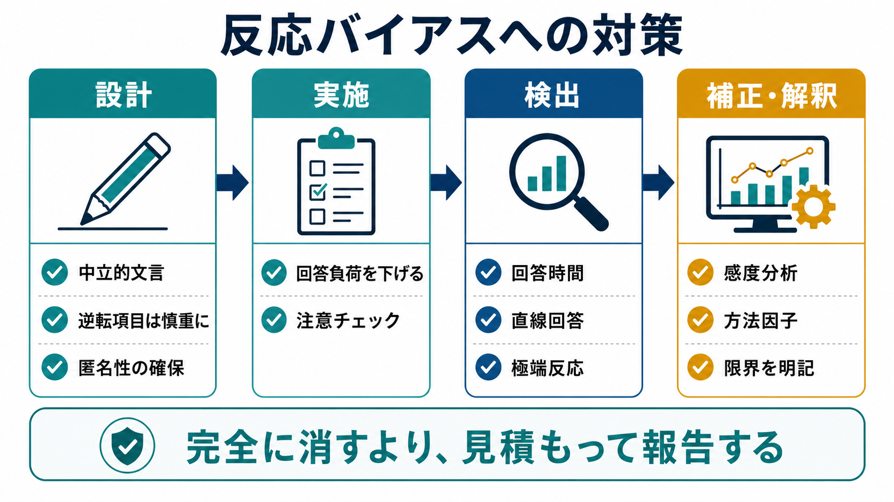

# 反応バイアスとは何か

## 要点

- 反応バイアスとは、質問紙の内容そのものではなく、回答者の動機、認知的負荷、回答形式、調査状況などによって回答が一定方向へ歪むことである。
- 代表例には、社会的に望ましく見える回答を選ぶ社会的望ましさ、内容にかかわらず同意しやすい黙従傾向、端の選択肢を選びやすい極端反応、中央を選びやすい中間反応、深く考えず十分そうな回答で済ませる満足化がある。
- 反応バイアスは、平均値、分散、相関、因子構造、群間比較を歪め、[[妥当性とは何か]]や[[信頼性とは何か]]の解釈を難しくする。
- 完全に消すことは難しい。重要なのは、設計段階で減らし、実施段階で監視し、解析段階で感度分析や方法因子として扱い、報告段階で限界を明記することである。

## この記事で答える問い

1. 反応バイアスと反応スタイルは何が違うのか。
2. 社会的望ましさや黙従傾向は、どのように回答を歪めるのか。
3. 反応バイアスは、心理尺度の妥当性・信頼性・因子構造にどのような影響を与えるのか。
4. 研究計画、質問紙設計、データ解析では、どのように対策できるのか。

## まず結論

反応バイアスは「回答者が何を思っているか」と「質問紙上で何を選ぶか」のあいだに入り込む系統的なずれである。質問紙回答は、質問の理解、記憶検索、判断、選択肢への対応づけ、最終的な回答編集という複数の段階を通る。Tourangeau らの調査回答モデルは、回答を単なる内面の読み出しではなく、理解・想起・判断・回答編集から成る認知過程として捉える[1]。そのため、回答値には対象特性だけでなく、方法、文脈、社会的期待、注意、疲労、項目形式の影響が混ざる。

特に質問紙研究では、反応スタイルが重要である。反応スタイルとは、項目内容にかかわらず特定の回答カテゴリを選びやすい傾向を指す。Van Vaerenbergh と Thomas は、反応スタイルを系統的誤差の一種として整理し、単変量分布だけでなく多変量関係や研究結果の代替説明になりうると論じている[2]。したがって、反応バイアスは「面倒なノイズ」ではなく、測定が何を捉えているかを左右する心理測定上の中核問題である。

## 背景

質問紙は、態度、症状、性格、生活習慣、価値観、職場行動など、直接観察しにくい構成概念を扱うために広く使われる。しかし、質問紙の得点は対象特性だけを反映するわけではない。回答者は、質問文を解釈し、記憶や経験を参照し、選択肢の意味を判断し、最後に「この場でどの回答を出すか」を決める[1]。

この過程では、少なくとも三つの力が働く。第一に、認知的負荷である。項目数が多い、文が難しい、似た項目が続く、回答形式が複雑であると、回答者は最適な判断ではなく、十分に見える簡略化された回答を選びやすくなる。Krosnick はこれを満足化として整理し、同意、最初に見えた選択肢の選択、差をつけない回答、わからない回答、ランダム回答などにつながりうると述べた[3]。第二に、社会的評価への配慮である。違法行為、偏見、攻撃性、依存、性的行動、精神症状などの敏感な内容では、回答者は自分をよく見せる方向に回答を編集しやすい[1][4]。第三に、回答形式そのものがもつ誘導である。リッカート尺度の端点、中央点、同意文、逆転項目、同じ選択肢配置は、回答スタイルを誘発しうる。

## 基本概念

### 反応バイアス

反応バイアスとは、回答内容とは別の要因によって、回答が一定方向に系統的にずれることである。ランダム誤差が得点をばらつかせるのに対して、反応バイアスは平均、分散、相関、群間差を一定方向へ押しやすい。心理測定でいえば、観測得点は次のように分解して考えられる。

$$
X = T + M + E
$$

ここで $X$ は観測得点、$T$ は測りたい特性、$M$ は回答形式や調査状況などの方法成分、$E$ は偶然誤差である。反応バイアスの多くは $M$ に入る。したがって、ある尺度の平均が高いとき、それが本当に特性の高さを示すのか、同意しやすさや社会的望ましさを示すのかを区別する必要がある。

### 反応スタイル

反応スタイルは、反応バイアスの中でも、項目内容にかかわらず特定の回答パターンを選びやすい傾向を指す[2]。代表的には次のものがある。

| 種類 | 典型的な表れ | 主なリスク |
|---|---|---|
| 黙従傾向 | 内容にかかわらず「そう思う」を選ぶ | 正方向項目だけの尺度で得点が過大になる |
| 反黙従傾向 | 内容にかかわらず「そう思わない」を選ぶ | 低得点が特性の低さと混同される |
| 極端反応 | 「非常にそう思う」「まったくそう思わない」を選びやすい | 分散や群間差が過大に見える |
| 中間反応 | 中央カテゴリを選びやすい | 分散や関連が過小に見える |
| 無作為・不注意回答 | 同じ選択肢、短すぎる回答時間、矛盾回答 | 信頼性と因子構造が崩れる |

Baumgartner と Steenkamp は、黙従、反黙従、極端反応、反応範囲、中間反応、内容に依存しない回答などが、尺度得点や尺度間相関を上げる場合も下げる場合もあることを示した[5]。これは、反応バイアスが単に「誤差を増やす」だけでなく、研究仮説を支持しているようにも、否定しているようにも見せうることを意味する。

### 社会的望ましさ

社会的望ましさとは、自分が社会的に好ましく見えるように回答を調整する傾向である。Crowne と Marlowe は、精神病理と独立した社会的望ましさを測る尺度を提案し、以後の質問紙研究で広く参照されてきた[4]。Paulhus はさらに、社会的望ましさを単なる「嘘」ではなく、印象操作と自己欺瞞的な肯定性に分けて考える必要を示した[6]。

重要なのは、社会的望ましさが常に意図的な虚偽回答とは限らない点である。回答者は、調査者によく思われたい、組織内で不利益を避けたい、望ましい自己像を保ちたい、あるいは自分でも否認している側面を見ないようにしたいことがある。敏感な質問では、この回答編集の段階が特に強くなる[1]。

## 仕組み

反応バイアスは、回答プロセスのどこか一箇所で起こるというより、複数段階で入り込む。

### 1. 質問理解の段階

質問文が曖昧、二重否定、専門用語を含む、文化的前提を含む、期間指定が曖昧である場合、回答者は研究者の意図とは違う意味で項目を読む。これは[[内容的妥当性とは何か]]や[[構成概念妥当性とは何か]]に直結する。たとえば「人前で不安になる」という項目は、講演、雑談、面接、SNS投稿など、回答者ごとに異なる場面を想起させる。

### 2. 想起と判断の段階

過去の行動頻度や症状を尋ねる項目では、記憶検索の容易さ、最近の出来事、感情状態が判断に影響する。調査回答研究では、記憶に頼る質問ほど、想起の手がかり、期間、回答カテゴリの幅が重要になる[1]。この段階の偏りは、特性そのものではなく「思い出しやすさ」を得点に混ぜる。

### 3. 選択肢への対応づけ

回答者は、自分の判断を「1から5」「まったくないから非常に多い」などの選択肢へ変換する。このとき、端点をどれだけ強い意味で読むか、中央点を「中立」と読むか「わからない」と読むか、同意文にどれだけ乗りやすいかが影響する。極端反応や中間反応はこの段階で目立つ。

### 4. 回答編集の段階

最終的な回答は、社会的評価、匿名性、調査者との関係、所属組織、臨床場面の利害に影響される。たとえば、アルコール使用、攻撃性、希死念慮、差別的態度、職場不正などは、実際より低く報告されやすい。一方、努力、共感性、遵守、健康行動などは高く報告されやすい。これは社会的望ましさの典型例である[4][6]。

### 5. 満足化

回答負荷が高いと、回答者は項目ごとに丁寧に判断せず、十分そうな回答で済ませることがある。Krosnick の満足化モデルでは、認知的努力を節約するために、浅い情報検索、同意、現状維持、差をつけない回答、ランダム選択などが起こりうる[3]。この問題はオンライン調査、長い尺度、似た項目が続く調査で特に注意が必要である。

## 図解

以下の図は、反応バイアスを減らすための実践フローである。研究計画の早い段階ほど、バイアスを小さくする余地が大きい。

| 段階 | 具体策 | 注意点 |
|---|---|---|
| 設計 | 中立的な文言、明確な期間、回答カテゴリの定義、匿名性の確保 | 逆転項目は不注意回答検出に役立つこともあるが、理解負荷や方法因子を増やすことがある |
| 実施 | 回答時間の確保、項目数の抑制、注意チェック、調査目的の説明 | 注意チェックを多用すると、回答者を疑う調査になり負荷が増える |
| 検出 | 回答時間、直線回答、矛盾項目、極端反応、中間反応、欠測パターン | 機械的除外はサンプル偏りを生むため、除外基準を事前に決める |
| 補正・解釈 | 感度分析、方法因子、社会的望ましさ尺度、ロバスト性確認 | 統計補正だけで問題が消えたとは考えない |

## 臨床・研究との接続

研究では、反応バイアスは群間差や相関の解釈を左右する。たとえば、ある群で不安尺度得点が低いとしても、本当に不安が低いのか、症状を認めにくい文化的・組織的文脈があるのか、中央反応が強いのかを考える必要がある。反応スタイルは文化差研究でも重要であり、国や集団によって極端反応や黙従傾向が異なると、平均値比較が構成概念の差ではなく回答形式への反応差を反映してしまう[2][5]。

臨床では、質問紙得点を個別診断や治療方針として単独で扱うことは避ける。症状尺度は面接、行動観察、生活史、身体疾患、薬物、環境要因などと合わせて解釈する必要がある。特に、社会的望ましさが高い場面では、リスク行動や困りごとが過小報告される可能性がある。逆に、援助を求める文脈では、苦痛が強調される可能性もある。どちらも「嘘」と決めつけるのではなく、回答が置かれた文脈を読むことが重要である。

組織心理学や教育研究では、同じ回答者から同じ時点に同じ形式で複数の変数を測ると、共通方法バイアスが生じやすい。Podsakoff らは、共通方法バイアスの発生源、認知過程、手続き的対策、統計的対策をレビューし、研究設計の段階から方法の影響を減らす必要を指摘している[7]。たとえば、予測変数と結果変数を別時点・別情報源で測る、匿名性を高める、尺度形式を工夫する、方法因子を検討する、といった対策がある。

## よくある誤解

### 誤解1: 反応バイアスは不誠実な回答者だけの問題である

反応バイアスは不正回答だけではない。質問理解、記憶、判断、社会的期待、疲労、選択肢形式など、通常の回答過程そのものから生じる[1][3]。誠実に回答していても、社会的望ましさや黙従傾向は生じうる。

### 誤解2: 逆転項目を入れれば黙従傾向は解決する

逆転項目は黙従傾向の検出や相殺に役立つことがある。しかし、逆転項目は理解負荷を高め、別の方法因子を作り、因子構造を歪めることもある。逆転項目は万能な対策ではなく、項目の明瞭性や回答者の負荷と合わせて判断する必要がある。

### 誤解3: 社会的望ましさ尺度で補正すればよい

社会的望ましさ尺度は有用だが、補正変数として機械的に入れると、測りたい特性の一部まで除去する可能性がある。たとえば、協調性や規範遵守が研究対象である場合、社会的望ましさと構成概念が実質的に重なることがある。Paulhus が示したように、印象操作と自己欺瞞的な肯定性を区別して読む必要がある[6]。

### 誤解4: 信頼性が高ければ反応バイアスは小さい

[[内的一貫性とは何か]]が高い尺度でも、同じ回答スタイルを一貫して拾っているだけの可能性がある。信頼性は一貫性の指標であり、測りたい構成概念を正しく測っていることを保証しない。反応バイアスの問題は、[[妥当性とは何か]]の問題として評価する必要がある。

## 関連ノート

- [[心理測定とは何か]]
- [[心理尺度はどのように作られるのか]]
- [[妥当性とは何か]]
- [[構成概念妥当性とは何か]]
- [[内容的妥当性とは何か]]
- [[信頼性とは何か]]
- [[内的一貫性とは何か]]
- [[再検査信頼性とは何か]]

MOC更新候補: `content/00_MOC/` 配下の心理測定・研究法関連MOCに、バッチ統合時に本記事 `[[反応バイアスとは何か]]` を追加する。

## 理解チェック

1. 黙従傾向と社会的望ましさは、どちらも回答を歪めるが、何が違うか。
2. 極端反応が強い集団と中間反応が強い集団を比較すると、平均値や分散の解釈にどのような問題が起こるか。
3. 「観測得点 = 特性 + 方法 + 誤差」と考えると、質問紙研究の解析計画はどう変わるか。
4. 社会的望ましさ尺度を統制変数に入れることの利点と危険は何か。
5. あなたが新しい心理尺度を作るなら、設計・実施・検出・解釈の各段階でどの対策を入れるか。

## 未解決問題

- 反応スタイルを個人特性として扱うべきか、調査文脈に依存する方法効果として扱うべきかは、研究目的によって判断が分かれる。
- 文化差研究では、反応スタイルの補正が本来の文化差まで削る可能性がある。
- オンライン調査では回答時間や直線回答を検出しやすい一方、除外基準の恣意性やサンプル偏りが問題になる。
- 大規模データでは統計的補正が容易になるが、質問文の曖昧さや社会的文脈の問題は設計段階でしか十分に減らせない。

## 参考文献

[1] Tourangeau, R., Rips, L. J., & Rasinski, K. (2000). *The Psychology of Survey Response*. Cambridge University Press. https://doi.org/10.1017/CBO9780511819322

[2] Van Vaerenbergh, Y., & Thomas, T. D. (2013). Response Styles in Survey Research: A Literature Review of Antecedents, Consequences, and Remedies. *International Journal of Public Opinion Research, 25*(2), 195-217. https://doi.org/10.1093/ijpor/eds021

[3] Krosnick, J. A. (1991). Response Strategies for Coping with the Cognitive Demands of Attitude Measures in Surveys. *Applied Cognitive Psychology, 5*(3), 213-236. https://doi.org/10.1002/acp.2350050305

[4] Crowne, D. P., & Marlowe, D. (1960). A new scale of social desirability independent of psychopathology. *Journal of Consulting Psychology, 24*, 349-354. https://doi.org/10.1037/h0047358

[5] Baumgartner, H., & Steenkamp, J.-B. E. M. (2001). Response Styles in Marketing Research: A Cross-National Investigation. *Journal of Marketing Research, 38*(2), 143-156. https://doi.org/10.1509/jmkr.38.2.143.18840

[6] Paulhus, D. L. (1991). Measurement and Control of Response Bias. In J. P. Robinson, P. R. Shaver, & L. S. Wrightsman (Eds.), *Measures of Personality and Social Psychological Attitudes* (pp. 17-59). Academic Press. https://doi.org/10.1016/B978-0-12-590241-0.50006-X

[7] Podsakoff, P. M., MacKenzie, S. B., Lee, J.-Y., & Podsakoff, N. P. (2003). Common Method Biases in Behavioral Research: A Critical Review of the Literature and Recommended Remedies. *Journal of Applied Psychology, 88*(5), 879-903. https://doi.org/10.1037/0021-9010.88.5.879

[8] Cronbach, L. J. (1946). Response Sets and Test Validity. *Educational and Psychological Measurement, 6*(4), 475-494. https://doi.org/10.1177/001316444600600405
