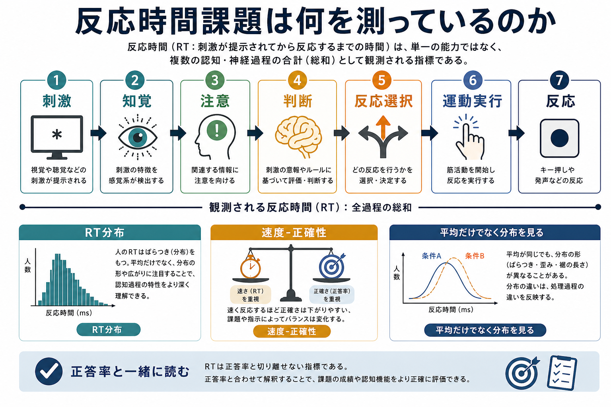
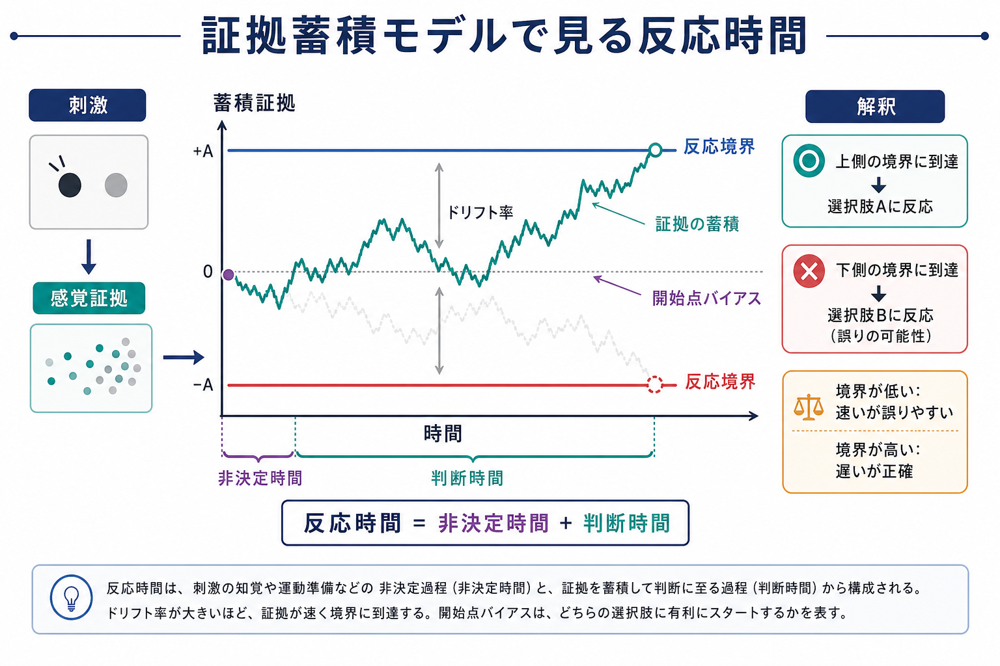
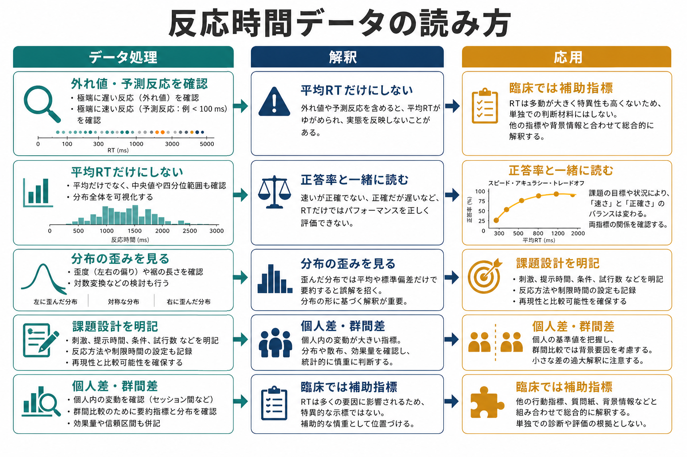

# 反応時間課題は何を測っているのか

## 要点

- 反応時間課題は、刺激が出てから反応が記録されるまでの時間を使い、知覚、注意、判断、反応選択、運動実行などの処理過程を間接的に推定する方法である。
- 反応時間は「処理速度そのもの」ではなく、課題設計、速度と正確性の方略、反応基準、予測、疲労、外れ値、測定環境を含んだ複合指標である。
- 平均反応時間だけを見ると、分布の遅い裾、エラー反応、予測反応、個人差を見落としやすい。正答率、反応時間分布、試行内変動を同時に読む必要がある。
- 拡散決定モデルのような証拠蓄積モデルを使うと、反応時間と正答率を、情報の質、判断基準、開始点バイアス、非決定時間に分けて解釈しやすくなる。
- 臨床研究では反応時間や反応時間変動が注意、認知制御、処理効率の補助指標になるが、単独で診断や治療方針を決める指標ではない。

## この記事で答える問い

1. 反応時間課題は、認知処理のどの部分を測っているのか。
2. 単純反応時間、選択反応時間、弁別課題、干渉課題では、何が違うのか。
3. 反応時間から「処理段階」を推定するには、どのような仮定が必要なのか。
4. 平均反応時間、正答率、反応時間分布、反応時間変動をどう読み分けるのか。
5. 研究・臨床で使うとき、どこまで言えて、どこから言いすぎになるのか。

## まず結論

反応時間課題が測っているのは、「刺激を見てからボタンを押すまでの秒数」そのものではなく、その秒数に影響する認知・運動・方略・測定環境の総和である。刺激が提示されると、参加者は刺激を検出し、特徴を符号化し、課題ルールに照らして判断し、反応を選び、実際に運動反応を出す。記録される反応時間は、この一連の過程の合成値である。

そのため、反応時間課題を使うときの中心問題は「何ミリ秒だったか」ではなく、「条件差や個人差が、どの処理成分の差として解釈できるように設計されているか」である。Sternberg の加法因子法は、条件操作が平均反応時間に加法的に効くか交互作用的に効くかを手がかりに、処理段階を推定しようとした代表的な方法である[1]。また、Hick の選択反応時間研究は、選択肢数や不確実性が反応時間に関係することを示し、反応時間を情報処理の指標として扱う流れを強めた[2]。

ただし、反応時間は単独では曖昧である。速い反応は、処理が効率的だから速い場合もあれば、正確性を犠牲にして反応基準を低くしただけの場合もある。遅い反応は、知覚が難しい、判断が難しい、注意が途切れた、運動反応が遅い、慎重に答えた、外れ値が混じった、など複数の理由で起こる。したがって反応時間課題は、[[心理測定とは何か]]、[[実験研究とは何か]]、[[妥当性とは何か]]の問題と切り離せない。

## 背景

反応時間を認知過程の窓として使う発想は、しばしば「心的時間測定」と呼ばれる。心の処理は直接観察しにくいが、課題条件を少し変えたときに反応が何ミリ秒遅くなるかを測れば、処理過程の構造を推定できるかもしれない。この発想は、現代の認知心理学、心理物理学、認知神経科学、計算論的精神医学に広く残っている。

古典的には、単純反応時間、弁別反応時間、選択反応時間を比べることで、刺激検出、弁別、反応選択のような段階を推定しようとした。後の研究では、この単純な差分法だけでは不十分であることが明らかになり、複数の実験因子を組み合わせ、反応時間への効果が加算的か相互作用的かを見る方法が発展した[1]。これは、反応時間を「一つの速度」ではなく、複数段階の時間が足し合わさった観測値として扱う考え方である。

一方で、反応時間研究は平均値だけでは足りないことも早くから指摘されてきた。Luce は反応時間を確率変数として扱い、分布、ハザード関数、判断成分と残余成分の分解を体系的に論じた[3]。現在でも、反応時間データは右に歪んだ分布を取りやすく、平均値が遅い裾に強く影響されるため、分布全体を読む必要がある[6]。

## 基本概念

### 反応時間

反応時間とは、刺激提示、合図、ターゲット出現などの基準時点から、ボタン押し、キー入力、発話開始、眼球運動開始などの反応が記録されるまでの時間である。典型的にはミリ秒単位で記録される。

ただし、反応時間には少なくとも次の成分が混ざる。

| 成分 | 何を表すか | 典型的な影響因 |
|---|---|---|
| 感覚・知覚 | 刺激を検出し特徴を符号化する時間 | 刺激強度、視認性、ノイズ、提示時間 |
| 注意 | 課題関連刺激に資源を向ける過程 | 注意喚起、妨害刺激、疲労、覚醒 |
| 判断 | 刺激がどのカテゴリかを決める過程 | 弁別難度、選択肢数、不確実性 |
| 反応選択 | どの反応を出すかを決める過程 | 刺激反応対応、反応数、競合 |
| 運動実行 | 実際にキーやボタンを押す過程 | 運動準備、利き手、装置遅延 |
| 方略 | 速さと正確性の重みづけ | 教示、報酬、罰、反応基準 |

このように、反応時間は認知処理の純粋な速度計ではない。むしろ、課題とモデルを通して「どの成分が変わったと考えるのがもっとも妥当か」を推定するための観測値である。

### 単純反応時間と選択反応時間

単純反応時間課題では、刺激が出たらできるだけ速く反応する。ここでは主に、刺激検出、覚醒、運動準備が関わる。判断や反応選択は比較的少ない。

選択反応時間課題では、刺激の種類に応じて異なる反応を選ぶ。たとえば、赤なら左キー、青なら右キーを押す。この場合、刺激弁別、ルール検索、反応選択が加わる。Hick の研究が示したように、選択肢数や不確実性が増えると、反応時間は長くなりやすい[2]。ただし、この関係は刺激反応対応、練習、系列依存性などにも影響される。

### 正答率と速度-正確性トレードオフ

反応時間は正答率と一緒に読む必要がある。速く答えるように教示すると平均反応時間は短くなるが、エラーが増えるかもしれない。逆に正確に答えるように教示すると、反応は遅くなるが正答率は上がるかもしれない。

この関係を速度-正確性トレードオフという。反応時間だけを見て「速いほど能力が高い」と解釈すると、慎重さや反応基準の差を能力差と誤読する危険がある。これは [[反応バイアスとは何か]] ともつながる問題である。

## 仕組み

### 処理段階として見る

反応時間課題の第一の読み方は、処理を段階に分けることである。たとえば、文字判断課題で刺激の見やすさを変え、同時に反応選択の難しさも変える。もし刺激の見やすさの効果と反応選択の効果が平均反応時間上で加算的なら、別々の段階に作用している可能性がある。もし交互作用するなら、同じ段階、または相互依存する段階に作用している可能性がある[1]。

この考え方は強力だが、仮定も強い。平均反応時間の加法性が、必ず独立した心的段階を意味するわけではない。課題方略、分布形状、正答率、試行順序、学習効果が混ざることもある。したがって、処理段階の推定は、実験操作と統計モデルと理論仮説をセットで読む必要がある。

### 証拠蓄積として見る

第二の読み方は、判断を「証拠が時間とともに蓄積し、ある基準に達したら反応する過程」として見ることである。拡散決定モデルは、二択判断課題において、正答率、平均反応時間、反応時間分布を同時に説明する代表的なモデルである[4]。

このモデルでは、観測された反応時間と正答率を、主に次の成分に分けて考える。

| モデル成分 | 認知的な意味 | 例 |
|---|---|---|
| ドリフト率 | 判断に使える情報の質 | 刺激が見やすいほど高い |
| 境界分離 | どれだけ証拠を集めてから答えるか | 正確性重視で高くなる |
| 開始点 | どちらの選択肢に寄って始めるか | 事前確率や期待の偏り |
| 非決定時間 | 知覚符号化と運動実行など、判断以外の時間 | 感覚・運動成分 |

拡散決定モデルの利点は、「遅いから判断が悪い」といった粗い解釈を避けられる点にある。ある人の反応が遅いのは、情報の質が低いからかもしれないし、慎重な境界を置いているからかもしれないし、非決定時間が長いからかもしれない。反応時間と正答率を同時にモデル化することで、これらを分けて推定しやすくなる[4][5]。

### 分布として見る

第三の読み方は、平均反応時間ではなく反応時間分布を見ることである。反応時間分布は、多くの場合、正規分布ではなく右に長い裾をもつ。平均値が遅くなったとき、それは分布全体が右にずれたのか、一部の極端に遅い反応が増えたのか、速い反応は変わらず遅い裾だけが伸びたのかで意味が異なる[6]。

たとえば、注意の途切れがあると、ほとんどの試行は通常どおり速いが、ときどき非常に遅い反応が混じるかもしれない。この場合、平均反応時間だけを見ると「全体的に遅い」と見えるが、実際には「まれな遅延反応が増えた」可能性がある。これは [[認知負荷とは何か]] や [[認知的柔軟性とは何か]] を測る課題でも重要である。

## 図解

図1は、反応時間課題を「刺激から反応までの一本の時間」ではなく、知覚、注意、判断、反応選択、運動実行、方略、分布が重なった観測値として整理している。

図2は、二択判断を証拠蓄積として捉える見方を示している。反応時間は、非決定時間と判断時間の和として扱われ、判断時間は証拠が境界に達するまでの時間として表現される。

図3は、反応時間データを読むときの実務的なチェックポイントをまとめている。外れ値処理、予測反応の除外、正答率との同時解釈、分布の歪み、課題設計の明記が中心になる。

## 臨床・研究との接続

### 認知機能評価との関係

反応時間課題は、[[認知機能検査は何を測っているのか]] で扱うような認知機能評価と密接に関係する。注意、処理速度、実行機能、抑制、認知制御の課題では、正答率だけでなく反応時間が重要な従属変数になる。

ただし、反応時間課題は、質問紙尺度や面接評価とは違う種類の測定である。質問紙は自己報告を測り、反応時間課題は課題中の行動を測る。どちらが「本物」かではなく、どの構成概念のどの側面を測っているかを区別する必要がある。これは [[構成概念妥当性とは何か]] と [[信頼性とは何か]] の問題である。

### 認知神経科学との関係

反応時間課題は、fMRI、EEG、MEG、眼球運動、計算モデルと組み合わせられることが多い。たとえば、同じ課題で反応時間が遅い試行と速い試行を比べることで、注意や認知制御に関わる神経活動を調べることができる。[[前頭頭頂ネットワークは認知制御をどう支えるのか]]、[[大脳基底核ループとは何か]] のような神経回路の議論でも、課題成績として反応時間が使われる。

ただし、脳活動と反応時間の対応は一対一ではない。反応時間が長い試行では、処理が難しい、注意が逸れた、反応抑制が働いた、迷いが大きい、など複数の説明がありうる。神経データを読むときも、課題設計と行動モデルが必要になる。

### 臨床研究との関係

臨床研究では、反応時間変動が注意機能や状態調整の指標として使われることがある。ADHD 研究では、反応時間のばらつきが大きいことが繰り返し報告され、メタ分析でも反応時間変動が安定した特徴として検討されている[8]。この点は [[ADHDは前頭線条体回路の障害として説明できるのか]] とも接続する。

ただし、反応時間変動は ADHD に固有の診断マーカーではない。睡眠不足、疲労、抑うつ、不安、薬物、動機づけ、課題理解、測定装置、年齢などでも変化しうる。したがって、臨床文脈では「研究上の補助指標」「認知機能の一側面」として扱い、個別診断や治療指示として単独で断定しない。

## よくある誤解

### 誤解1: 反応時間が短いほど認知能力が高い

短い反応時間は、処理が速いことを示す場合もある。しかし、正確性を犠牲にした早押し、予測反応、課題ルールの無視、反応基準の低さを示す場合もある。反応時間は必ず正答率と一緒に読む。

### 誤解2: 平均反応時間だけ見ればよい

平均反応時間は便利だが、分布の情報を潰す。反応時間分布は右に歪みやすく、遅い裾の変化が平均値を大きく動かすことがある。Balota と Yap は、平均値だけでは、分布全体のシフト、遅い裾の伸長、両者の組み合わせを区別できないと指摘している[6]。

### 誤解3: 外れ値を機械的に削ればよい

非常に速い反応や遅い反応には、予測反応、キー押しミス、注意の途切れ、装置エラーなどが混ざる。Whelan は、反応時間データでは一般的な平均値ベースの分析が不適切になりうること、外れ値処理や分布特性への配慮が必要であることを論じている[7]。除外基準は、結果を見てから都合よく決めるのではなく、事前に明記するのが望ましい。

### 誤解4: 反応時間差はそのまま処理段階の差である

条件Aと条件Bで 50 ms の差があっても、それが特定の処理段階の差だとは限らない。課題難度、反応基準、刺激反応対応、練習、疲労、速度-正確性トレードオフが関わる。処理段階を主張するには、実験操作、正答率、分布、モデル、代替説明の検討が必要である。

### 誤解5: 反応時間課題は客観的だから妥当性の問題が少ない

反応時間はミリ秒単位で記録できるため、客観的に見える。しかし、何を測っているかは課題設計に依存する。たとえば「注意課題」と呼ばれる課題でも、知覚難度、反応選択、動機づけ、運動速度が混ざる。測定値が精密でも、構成概念の対応が曖昧なら妥当性は高くならない。

## 研究で使うときの最小チェックリスト

| 観点 | 確認すること |
|---|---|
| 課題設計 | 刺激、反応、教示、試行数、練習、ランダム化を明記する |
| 測定環境 | 表示遅延、入力装置、オンライン実験か実験室実験かを確認する |
| データ除外 | 予測反応、極端な遅延、エラー試行の扱いを事前に決める |
| 正答率 | 反応時間差が正確性低下の結果でないか見る |
| 分布 | 平均だけでなく中央値、分位点、ばらつき、遅い裾を見る |
| モデル | 必要に応じて証拠蓄積モデルなどで成分分解する |
| 解釈 | 「処理速度」だけでなく方略、反応基準、非決定時間を検討する |

## 関連ノート

- [[心理測定とは何か]]
- [[実験研究とは何か]]
- [[妥当性とは何か]]
- [[信頼性とは何か]]
- [[反応バイアスとは何か]]
- [[認知機能検査は何を測っているのか]]
- [[認知負荷とは何か]]
- [[認知的柔軟性とは何か]]
- [[前頭頭頂ネットワークは認知制御をどう支えるのか]]
- [[ADHDは前頭線条体回路の障害として説明できるのか]]

### MOC更新候補

- `content/00_MOC/MOC｜認知科学・心理学.md`
- `content/00_MOC/MOC｜研究方法.md`
- `content/00_MOC/MOC｜認知機能.md`

並列生成ジョブとの衝突を避けるため、本記事作成時点では MOC ファイルは更新しない。

## 理解チェック

1. 単純反応時間課題と選択反応時間課題では、反応時間に混ざる処理成分がどう違うか。
2. 反応時間が短いのに正答率が低い場合、どのような解釈が考えられるか。
3. 平均反応時間が長くなったとき、分布のどの部分が変化した可能性があるか。
4. 拡散決定モデルでは、反応時間と正答率をどのような成分に分けて考えるか。
5. 臨床研究で反応時間変動を使うとき、なぜ単独の診断指標として扱うべきではないのか。

## 未解決問題

- 反応時間課題から推定される「処理速度」「注意」「認知制御」は、日常生活上の機能とどの程度対応するのか。
- オンライン実験では、表示装置や入力装置の遅延をどこまで補正・統制できるのか。
- 反応時間分布モデルや証拠蓄積モデルのパラメータは、個人内でどの程度安定しているのか。
- 臨床群の反応時間変動は、疾患特異的な特徴なのか、睡眠、疲労、動機づけ、薬物、併存症を含む横断的な状態指標なのか。

## 参考文献

[1] Sternberg, S. (1969). The discovery of processing stages: Extensions of Donders' method. *Acta Psychologica*, 30, 276-315. https://doi.org/10.1016/0001-6918(69)90055-9

[2] Hick, W. E. (1952). On the rate of gain of information. *Quarterly Journal of Experimental Psychology*, 4(1), 11-26. https://doi.org/10.1080/17470215208416600

[3] Luce, R. D. (1986/1991). *Response Times: Their Role in Inferring Elementary Mental Organization*. Oxford University Press. https://doi.org/10.1093/acprof:oso/9780195070019.001.0001

[4] Ratcliff, R., & McKoon, G. (2008). The diffusion decision model: Theory and data for two-choice decision tasks. *Neural Computation*, 20(4), 873-922. https://doi.org/10.1162/neco.2008.12-06-420

[5] Ratcliff, R., Smith, P. L., & McKoon, G. (2015). Modeling regularities in response time and accuracy data with the diffusion model. *Current Directions in Psychological Science*, 24(6), 458-470. https://doi.org/10.1177/0963721415596228

[6] Balota, D. A., & Yap, M. J. (2011). Moving beyond the mean in studies of mental chronometry: The power of response time distributional analyses. *Current Directions in Psychological Science*, 20(3), 160-166. https://doi.org/10.1177/0963721411408885

[7] Whelan, R. (2008). Effective analysis of reaction time data. *The Psychological Record*, 58, 475-482. https://doi.org/10.1007/BF03395630

[8] Kofler, M. J., Rapport, M. D., Sarver, D. E., Raiker, J. S., Orban, S. A., Friedman, L. M., & Kolomeyer, E. G. (2013). Reaction time variability in ADHD: A meta-analytic review of 319 studies. *Clinical Psychology Review*, 33(6), 795-811. https://doi.org/10.1016/j.cpr.2013.06.001
