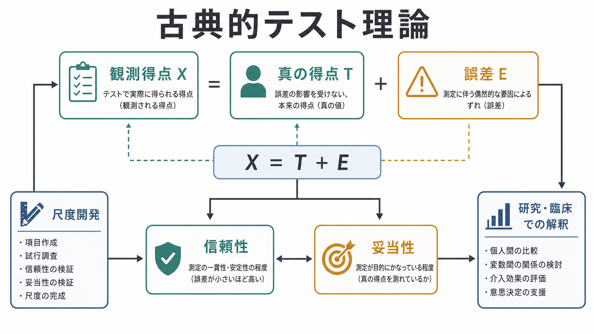
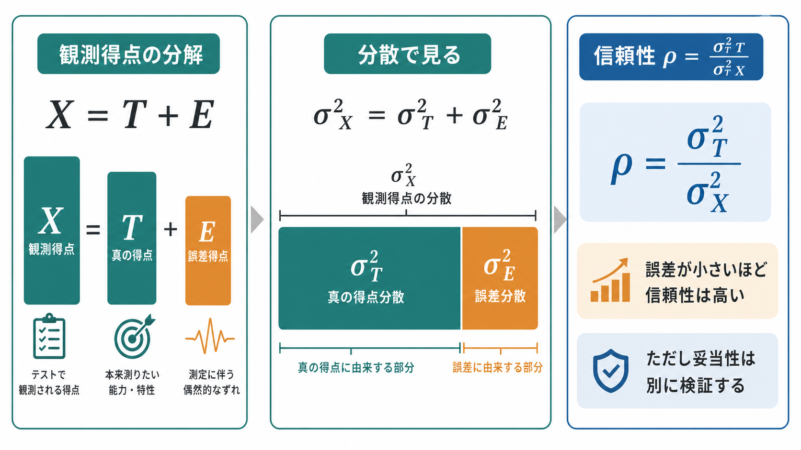
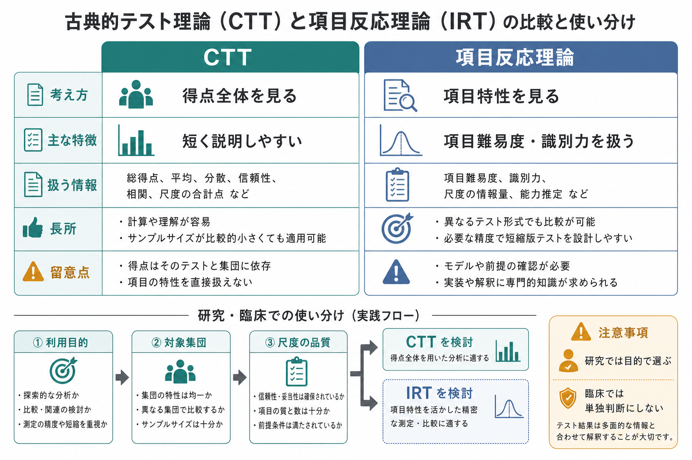

# 古典的テスト理論とは何か

## 要点

- 古典的テスト理論（classical test theory; CTT）は、観測されたテスト得点を「真の得点」と「測定誤差」に分けて考える測定理論である。
- 基本式は $X = T + E$ で、$X$ は観測得点、$T$ は真の得点、$E$ は誤差を表す[1][2]。
- 信頼性は、観測得点の分散のうち、安定した個人差である真の得点分散が占める割合として理解できる[1][2]。
- CTTは計算と説明が比較的容易で、尺度開発、教育テスト、臨床尺度、研究用質問紙で広く使われる。
- ただし、信頼性が高いことは、測りたい構成概念を正しく測っていること、つまり[[妥当性とは何か|妥当性]]が高いことを意味しない[3][4]。

## この記事で答える問い

1. 古典的テスト理論は、心理測定で何を説明する理論なのか。
2. 観測得点、真の得点、誤差はどのように関係するのか。
3. 信頼性係数、標準誤差、Cronbachの $\alpha$ はどう読めばよいのか。
4. CTTは[[心理尺度はどのように作られるのか|心理尺度の作成]]や臨床・研究でどのように使われるのか。
5. 項目反応理論（IRT）と比べたとき、CTTの強みと限界はどこにあるのか。

## まず結論

古典的テスト理論は、「1回のテスト得点を、その人の安定した特性そのものとして読まない」ための理論である。ある人が不安尺度で20点を取ったとしても、その20点は、その人の不安傾向を完全に表すわけではない。項目の選ばれ方、その日の状態、読解のずれ、回答環境、採点の揺れなどが混ざる。CTTは、この混ざりを

$$
X = T + E
$$

という単純な式で表す。ここで $X$ は観測得点、$T$ は理論上の真の得点、$E$ は測定誤差である[1][2]。

重要なのは、CTTの「真の得点」が、心の中に固定された実体を直接指すわけではないことである。典型的には、同じ条件で無数回測定したときの期待値として定義される理論的な量であり、直接観察できない[1]。したがってCTTは、「得点の中にどれくらい測定誤差が含まれるか」「どの程度なら安定した個人差として読めるか」を考えるための枠組みである。

## 背景

[[心理測定とは何か|心理測定]]では、不安、抑うつ、知能、注意、パーソナリティ、学力、生活機能のような、直接目で見えない特徴を扱う。これらは構成概念と呼ばれ、質問紙、テスト課題、面接評価、行動指標などを通じて間接的に推定される。

このとき問題になるのは、観測された点数がどれほど安定した情報を含んでいるかである。身長計であっても多少の誤差はあるが、心理測定では回答者の解釈、疲労、気分、社会的望ましさ、項目の曖昧さ、文化的背景などが得点に入り込みやすい。CTTは、こうした誤差を「なくせるもの」としてではなく、「測定に必ず含まれるもの」として扱う。

教育・心理テストの標準的文書である *Standards for Educational and Psychological Testing* でも、テスト得点の解釈には信頼性、測定誤差、妥当性、利用目的、対象集団に関する証拠が必要だと整理されている[3]。CTTはその中でも、特に得点の安定性と誤差を定量化する基礎を与える。

## 基本概念

### 観測得点

観測得点 $X$ は、実際に得られた点数である。質問紙の合計点、テストの正答数、下位尺度得点、標準得点などがこれにあたる。研究や臨床で手元にあるのは、まずこの観測得点である。

ただし観測得点は、そのまま構成概念そのものではない。たとえば不安尺度の合計点は、不安傾向を反映するかもしれないが、同時に読解力、回答スタイル、疲労、質問項目の偏り、測定状況も反映する。CTTでは、この観測得点を真の得点と誤差に分けて考える。

### 真の得点

真の得点 $T$ は、同じ測定を理想的に反復したときの平均的な得点として考えられる[1][2]。つまり、偶然の誤差が平均化されたときに残る、安定した得点成分である。

ここで注意したいのは、真の得点は「本人の本質」や「本当の人格」を意味しないことである。CTTの真の得点は、特定のテスト、特定の対象集団、特定の測定条件に依存する理論的期待値である。別の尺度を使えば、別の真の得点が想定される。

### 測定誤差

測定誤差 $E$ は、観測得点と真の得点の差である。

$$
E = X - T
$$

CTTでは、理想化された条件のもとで誤差の期待値は0であり、誤差は真の得点と相関しないと仮定される[1][2]。この仮定により、集団レベルでは観測得点の分散を、真の得点分散と誤差分散に分けて考えられる。

$$
\sigma_X^2 = \sigma_T^2 + \sigma_E^2
$$

この式は、個人の1回の得点を「正しい」「間違い」と判定するための式ではない。得点のばらつきのうち、どの程度が安定した個人差で、どの程度が誤差なのかを考えるための式である。

### 信頼性

[[信頼性とは何か|信頼性]]は、観測得点の分散のうち、真の得点分散が占める割合として表せる。

$$
\rho_{XX'} = \frac{\sigma_T^2}{\sigma_X^2}
$$

信頼性が高いほど、観測得点のばらつきは安定した個人差を多く含む。信頼性が低いほど、得点のばらつきには誤差が多く含まれる。信頼性係数は、再検査信頼性、平行検査信頼性、内的一貫性、評定者間信頼性など、測定目的に応じて異なる方法で推定される[3][5]。

### 標準誤差

標準誤差（standard error of measurement; SEM）は、個人の観測得点のまわりにどの程度の誤差幅を見込むべきかを表す。代表的には、得点の標準偏差を $SD_X$、信頼性係数を $r_{xx}$ として、次のように表される。

$$
SEM = SD_X\sqrt{1-r_{xx}}
$$

たとえば信頼性が高い尺度では、同じ人を同じ条件で測ったときの得点の揺れは比較的小さいと考えられる。逆に信頼性が低い尺度では、1点や2点の差を細かく解釈するのは危険である。

## 仕組み

### 1. テスト得点を合計点として扱う

CTTでは、多くの場合、複数の項目への反応を合計または平均して尺度得点を作る。たとえば10項目の不安尺度なら、各項目の得点を足して合計点を作る。合計点が高いほど不安傾向が高い、という解釈をする。

この単純さはCTTの強みである。尺度の説明がしやすく、少数の統計量で項目の平均、分散、項目-合計相関、内的一貫性、再検査相関などを確認できる。

### 2. 項目が同じ構成概念を反映しているかを見る

CTTの実務では、項目ごとの性質も確認する。典型的には、項目の平均、分散、床効果・天井効果、項目-合計相関、項目削除時の $\alpha$ などを見る。これにより、ある項目が尺度全体と大きくずれていないか、ほとんど全員が同じ回答をしていないか、逆転項目が誤解を生んでいないかを確認する。

ただし、これらの統計量だけで尺度が妥当だと判断してはいけない。項目内容が構成概念を代表しているか、対象者が項目をどう理解するか、外部基準や理論的予測と整合するかも検討する必要がある[3][4]。

### 3. 内的一貫性を推定する

Cronbachの $\alpha$ は、CTTの文脈でよく使われる内的一貫性の指標である。Cronbachは、$\alpha$ を分割半信頼性の一般化として定式化し、項目集合がどの程度共通した情報を含むかを評価する指標として示した[5]。

しかし、$\alpha$ は万能ではない。項目数が増えると高くなりやすく、項目が似すぎていても高くなる。また、$\alpha$ が高いことは、尺度が一次元であることや、妥当性が高いことを自動的には示さない[6]。そのため、必要に応じて因子分析、McDonaldの $\omega$、再検査信頼性、外部基準との関連を併せて見る。

### 4. 得点解釈の誤差幅を示す

CTTの実践的な価値は、得点を一点で断定しないことにある。たとえば、ある尺度でカットオフを超えたとしても、その得点には測定誤差がある。教育・臨床・産業場面で得点を使う場合、信頼区間、SEM、測定条件、対象集団、カットオフの根拠を合わせて示す必要がある[3]。

特に臨床尺度では、得点は面接、観察、生活史、身体疾患、薬物、文化的背景、本人の語りと合わせて読む補助情報である。個別診断や治療方針を、尺度得点だけで決めるべきではない。

## 図解

この記事の3枚の図は、次のように読むとよい。

| 図 | 読み方 |
|---|---|
| 図1 | CTTの全体像を、観測得点、真の得点、誤差、信頼性、妥当性、利用場面の関係として見る。 |
| 図2 | $X=T+E$ と分散分解から、信頼性が「真の得点分散の割合」として理解できることを見る。 |
| 図3 | CTTと項目反応理論を、研究目的・尺度品質・対象集団・利用目的に応じて使い分ける視点で見る。 |

## 臨床・研究との接続

### 研究での接続

心理学・認知科学・精神医学研究では、尺度得点が説明変数、目的変数、共変量、群分け基準として使われる。CTTを理解していないと、測定誤差を無視して効果量や相関を解釈してしまいやすい。信頼性が低い尺度を使うと、真の関連が過小評価されたり、群分けが不安定になったりする。

研究報告では、少なくとも次を明示したい。

- 尺度が何を測る想定なのか。
- 対象集団と測定条件は何か。
- 合計点、下位尺度得点、標準得点のどれを使ったのか。
- 信頼性係数はどの種類で、どのサンプルで推定されたのか。
- 妥当性証拠はどの範囲まで確認されているのか。

近年は、心理学研究における測定実践そのものへの批判も強い。Flake and Friedは、研究者が尺度の測定特性を十分に確認しないまま解析に進むことを「questionable measurement practices」として問題化している[7]。CTTは、この問題を避けるための最低限の読み書き能力でもある。

### 臨床での接続

臨床では、抑うつ、不安、注意、生活機能、痛み、QOLなどの尺度がよく使われる。CTTの観点では、得点は「測定誤差を含む観測値」であり、本人の状態を完全に示すものではない。症状の変化を追うときも、観測得点の差がSEMや最小検出変化量を超えているかを考える必要がある[8]。

また、カットオフは便利だが、境界付近の得点を過度に断定的に読むと危険である。尺度はスクリーニング、経過観察、面接で扱う論点の整理には役立つが、個別診断や治療指示は総合的な臨床判断にもとづくべきである。

### CTTと項目反応理論

CTTはテスト全体の得点と信頼性を扱いやすい。一方、項目反応理論（item response theory; IRT）は、項目の難易度、識別力、潜在特性の水準ごとの測定精度をモデル化できる[2]。CTTでは、信頼性はしばしば尺度全体に対する1つの係数として報告されるが、IRTではどの特性水準で情報量が高いかを検討できる。

ただし、IRTが常にCTTより優れているわけではない。IRTはモデル仮定、サンプルサイズ、項目数、推定手続きの負担が大きい。短い尺度の初期検討、実務での説明、既存尺度の基本的な品質確認ではCTTが有用である。研究目的が項目レベルの精密な推定や適応型テストであればIRTが有利になる。

## よくある誤解

### 誤解1: 真の得点は、その人の本当の内面を表す

CTTの真の得点は、理想的な反復測定の期待値である。個人の本質や人格の実体ではない。尺度、対象集団、測定条件が変われば、想定される真の得点も変わる。

### 誤解2: 信頼性が高ければ妥当性も高い

信頼性は、得点が一貫しているかを表す。妥当性は、その得点解釈と利用が目的に合っているかを問う。毎回同じようにずれた体重計が信頼性は高くても妥当ではないように、心理尺度でも安定して誤った構成概念を測ることがある[3][4]。

### 誤解3: Cronbachの $\alpha$ が .80 を超えれば十分である

$\alpha$ は便利な指標だが、項目数、項目の類似性、一次元性の仮定に影響される[5][6]。値だけを見て「良い尺度」と判断せず、項目内容、因子構造、再検査信頼性、外部基準との関連も確認する。

### 誤解4: CTTは古いので使うべきではない

CTTは古典的だが、現在でも教育・心理・臨床研究で重要である。問題は古いか新しいかではなく、目的に合うかである。合計点の安定性や誤差幅を説明したいならCTTは有用であり、項目特性や特性水準ごとの精度を知りたいならIRTが適している。

### 誤解5: 得点差はそのまま心理的変化を意味する

観測得点の差には誤差が含まれる。小さな変化は、真の変化ではなく測定誤差かもしれない。研究では信頼性による減衰、臨床ではSEMや最小検出変化量を考える必要がある[8]。

## 関連ノート

既存ノートとしては、以下と接続できる。

- [[心理測定とは何か]]
- [[信頼性とは何か]]
- [[妥当性とは何か]]
- [[心理尺度はどのように作られるのか]]

今後の作成候補:

- 項目反応理論とは何か
- Cronbachのアルファとは何か
- 標準誤差とは何か
- 測定不変性とは何か
- 項目分析とは何か

MOC更新候補:

- `content/00_MOC/` 配下の認知科学・心理学系MOC
- `content/00_MOC/` 配下の研究方法・統計系MOC
- `content/00_MOC/` 配下の心理測定・尺度開発系MOCがある場合、その心理測定セクション

## 理解チェック

1. 古典的テスト理論の基本式 $X=T+E$ で、$X$、$T$、$E$ はそれぞれ何を表すか。
2. 「真の得点」は、なぜ個人の本質そのものとは言えないのか。
3. 信頼性を $\sigma_T^2/\sigma_X^2$ と表すとき、分子と分母は何を意味するか。
4. Cronbachの $\alpha$ が高いだけでは、なぜ妥当性を保証できないのか。
5. CTTとIRTは、どのような研究目的で使い分けるとよいか。

## 未解決問題

- スマートフォンやウェアラブルデバイスから得られる連続的な行動データに、CTTの「反復測定された観測得点」という考え方をどこまで拡張できるか。
- 状態変化が大きい臨床群で、安定した真の得点と真の変化をどのように区別するか。
- 短縮尺度で回答負担を減らしつつ、信頼性・妥当性・測定不変性をどこまで保てるか。
- 機械学習モデルの予測スコアを、心理測定の得点として扱う場合、CTTやIRTの概念をどのように接続できるか。

## 参考文献

[1] Lord, F. M., & Novick, M. R. (1968). *Statistical Theories of Mental Test Scores*. Addison-Wesley. https://www.ets.org/research/policy_research_reports/publications/book/1968/awej.html

[2] McDonald, R. P. (1999). *Test Theory: A Unified Treatment*. Psychology Press. https://doi.org/10.4324/9781410601087

[3] American Educational Research Association, American Psychological Association, & National Council on Measurement in Education. (2014). *Standards for Educational and Psychological Testing*. American Educational Research Association. https://www.aera.net/publications/books/standards-for-educational-psychological-testing-2014-edition

[4] Kane, M. T. (2013). Validating the interpretations and uses of test scores. *Journal of Educational Measurement, 50*(1), 1-73. https://doi.org/10.1111/jedm.12000

[5] Cronbach, L. J. (1951). Coefficient alpha and the internal structure of tests. *Psychometrika, 16*(3), 297-334. https://doi.org/10.1007/BF02310555

[6] Sijtsma, K. (2009). On the use, the misuse, and the very limited usefulness of Cronbach's alpha. *Psychometrika, 74*, 107-120. https://doi.org/10.1007/s11336-008-9101-0

[7] Flake, J. K., & Fried, E. I. (2020). Measurement schmeasurement: Questionable measurement practices and how to avoid them. *Advances in Methods and Practices in Psychological Science, 3*(4), 456-465. https://doi.org/10.1177/2515245920952393

[8] Mokkink, L. B., Boers, M., van der Vleuten, C. P. M., Bouter, L. M., Alonso, J., Patrick, D. L., de Vet, H. C. W., & Terwee, C. B. (2020). COSMIN Risk of Bias tool to assess the quality of studies on reliability or measurement error of outcome measurement instruments: A Delphi study. *BMC Medical Research Methodology, 20*, 293. https://doi.org/10.1186/s12874-020-01179-5
