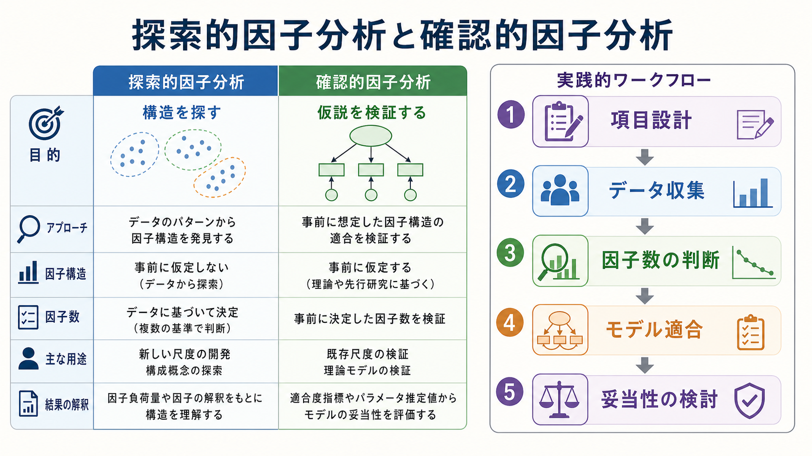

# 因子分析とは何か

## 要点

- 因子分析は、複数の観測項目の相関を、より少数の見えない変数である潜在因子によって説明しようとする統計手法である[1]。
- 心理尺度では、「不安」「抑うつ」「自己効力感」「注意制御」のような直接観察できない[[構成概念妥当性とは何か|構成概念]]を、複数項目の反応パターンから推定するために使われる。
- 因子分析で重要なのは、因子数、抽出法、回転、因子負荷量、共通性、独自性、標本サイズ、再現性であり、どれも結果の解釈を大きく変える[2][3][4]。
- 探索的因子分析は「どのような構造がありそうか」を探す方法であり、確認的因子分析は「事前に仮定した構造がデータに合うか」を検証する方法である[5][6]。
- 因子分析の結果は、尺度の完成証明ではない。[[信頼性とは何か|信頼性]]、[[妥当性とは何か|妥当性]]、外的基準との関係、別サンプルでの再現性と合わせて読む必要がある。

## この記事で答える問い

1. 因子分析は、何を推定しているのか。
2. 因子、因子負荷量、共通性、独自性とは何か。
3. 探索的因子分析と確認的因子分析はどう違うのか。
4. 主成分分析と因子分析は、どこが違うのか。
5. 心理尺度や臨床研究で使うとき、どのような誤解を避けるべきか。

## まず結論

因子分析とは、観測された項目間の相関を「少数の共通因子」と「項目ごとの独自な成分」に分けて理解する方法である。たとえば、10個の不安質問項目に似た反応パターンが見られるとき、因子分析は「これらの項目は、背後にある全般的不安因子、身体症状因子、心配因子などをどの程度反映しているのか」を推定する。

ただし、因子分析は「潜在因子が実在する」と自動的に証明する手続きではない。因子は、理論、項目内容、データ構造、推定方法、研究目的に依存して解釈される。したがって、因子分析は[[心理測定とは何か|心理測定]]の中核的な道具である一方、結果の読み方を誤ると「統計的にまとまった項目群」を「心理学的に妥当な構成概念」と取り違える危険がある[1][2]。

## 背景

心理学や認知科学では、観察したい対象が直接見えないことが多い。知能、気分、不安、衝動性、注意、社会的信頼、学習動機づけなどは、身長や反応時間のように単一の測定器で直接測るものではなく、質問項目、課題成績、行動指標、生理指標などの反応から推定される。

このとき、複数の項目が互いに相関するなら、その背後に共通の要因があるかもしれない。因子分析は、この「共通して変動している部分」を抽出し、項目群をより少数の潜在因子として整理する。Watkins は探索的因子分析を、観測変数の共変動を説明する少数の仮説的構成概念を見いだす方法として位置づけている[1]。

尺度開発では、因子分析は[[心理尺度はどのように作られるのか|心理尺度作成]]の途中でよく用いられる。たとえば、最初に30項目の候補を作り、データを集め、因子分析によって項目がどの下位尺度にまとまるかを調べる。その後、項目内容、信頼性、外的基準との関係、別サンプルでの確認を通して、尺度として使えるかを判断する。

## 基本概念

### 観測項目と潜在因子

観測項目とは、実際に得られる測定値である。質問紙なら「最近、緊張しやすい」「心配が頭から離れない」のような各項目への回答である。潜在因子とは、それらの回答パターンを生み出していると仮定される見えない変数である。

因子分析の基本的な考え方は、各観測項目を次のように分けることである。

$$
x_i = \lambda_{i1} f_1 + \lambda_{i2} f_2 + \cdots + \epsilon_i
$$

ここで、$x_i$ は項目 $i$ の得点、$f_1, f_2$ は潜在因子、$\lambda$ は因子負荷量、$\epsilon_i$ はその項目に固有の成分や測定誤差である。

### 因子負荷量

因子負荷量は、項目が因子とどれくらい強く関係しているかを表す係数である。ある項目が「心配」因子に高く負荷するなら、その項目は心配という潜在因子をよく反映していると解釈される。複数の因子に高く負荷する項目は、解釈が難しいことがある。

ただし、因子負荷量の大きさだけで項目の良し悪しを決めるのは危険である。項目文が理論的に重要か、対象者に理解されるか、他の項目と重複しすぎていないか、文化や臨床群で同じ意味を持つかも検討する必要がある[2]。

### 共通性と独自性

共通性は、ある項目の分散のうち、共通因子によって説明される割合である。共通性が高い項目は、因子構造の中でよく説明されている。独自性は、その項目に固有の成分と誤差を合わせた部分である。

心理尺度では、すべての項目が高い共通性を持てばよいとは限らない。高すぎる共通性は、項目がほとんど同じことを聞いている可能性も示す。逆に低すぎる共通性は、項目が想定した構成概念から外れている可能性を示す。

### 回転

因子分析では、抽出された因子を解釈しやすくするために回転を行うことが多い。直交回転は因子間相関をゼロと仮定し、斜交回転は因子間の相関を許す。心理学的構成概念では、不安、抑うつ、ストレスのように因子同士が相関することが多いため、斜交回転が理論的に自然な場合が多い[2][8]。

## 仕組み

因子分析の実務は、単にソフトウェアでボタンを押す作業ではない。少なくとも次の判断が必要になる。

1. どの項目や変数を分析に入れるか。
2. 相関行列をどう作るか。
3. 何因子を残すか。
4. どの抽出法を使うか。
5. 回転をどう選ぶか。
6. 因子をどう命名し、どの項目を残すか。
7. 別サンプルや確認的因子分析で再現するか。

### 因子数の判断

因子数は、因子分析で最も重要な判断の一つである。因子数を少なくしすぎると異なる構成概念を一つに混ぜてしまい、多くしすぎると偶然の揺らぎや項目表現の癖まで因子として解釈してしまう。

古くから使われる基準には、固有値1以上、スクリープロット、解釈可能性がある。しかし、固有値1以上だけに頼る方法はしばしば不安定である。Horn の並行分析は、ランダムデータから期待される固有値と実データの固有値を比較して因子数を判断する方法であり、因子数決定の重要な選択肢として広く扱われている[3]。実務では、並行分析、スクリープロット、理論、項目内容、解釈可能性を組み合わせるのが現実的である。

### 標本サイズ

因子分析には十分な標本サイズが必要だが、「項目数の何倍なら必ずよい」という単純な規則は成立しにくい。MacCallum らは、必要な標本サイズが共通性、因子ごとの指標数、因子負荷量の強さ、モデルの明瞭さによって変わることを示している[4]。つまり、項目が明瞭に因子を反映し、各因子に十分な数の項目があり、共通性が高いなら比較的小さい標本でも安定しやすい。一方、負荷量が弱く、因子あたりの項目数が少なく、交差負荷が多い場合には大きな標本が必要になる。

### 探索的因子分析

探索的因子分析は、項目群の背後にどのような因子構造がありそうかを調べる方法である。新しい尺度を作る初期段階や、既存尺度を別文化・別年齢層・臨床群に適用する段階でよく使われる。

探索的因子分析では、研究者がすべての項目と因子の関係を事前に固定しない。そのため、データから予想外の構造が見つかることがある。しかし自由度が高い分、因子数、回転、項目削除の判断によって結果が変わりやすい。Fabrigar らは、心理学研究で探索的因子分析が頻繁に用いられる一方、分析上の判断が不適切だと問題のある結論につながると指摘している[2]。

### 確認的因子分析

確認的因子分析は、あらかじめ仮定した因子構造を、共分散構造モデルとして検証する方法である。Jöreskog の確認的最尤因子分析は、特定のパラメータを固定し、残りを推定し、モデルの適合を検定する一般的手続きを示した[5]。現在の確認的因子分析では、どの項目がどの因子に負荷するか、因子間相関を許すか、誤差相関を入れるかなどを明示したうえで、モデル適合度とパラメータ推定値を評価する[6]。

確認的因子分析では、カイ二乗検定、RMSEA、CFI、TLI、SRMR などの指標が使われる。Browne と Cudeck は、モデルが母集団共分散行列にどの程度近似しているかという観点から適合度を論じ、近似誤差を評価する考え方を発展させた[7]。ただし、適合度指標が良いことは、尺度が妥当であることの十分条件ではない。モデルがよく合っても、項目内容が狭すぎる、外的基準との関係が弱い、重要な下位概念を落としている、といった問題は残りうる。

## 図解

この記事の3枚の図は、次のように読むとよい。

| 図 | 読み方 |
|---|---|
| 図1 | 観測項目の相関を、潜在因子、因子負荷量、共通性、独自性という概念で整理する。 |
| 図2 | 相関行列から因子を抽出し、回転と因子負荷量の解釈を通して構造を読む流れを示す。 |
| 図3 | 探索的因子分析と確認的因子分析の役割を分け、尺度研究の実務フローに接続する。 |

図は理解の足場であり、実際の分析では数値表、因子負荷量行列、因子相関、適合度指標、項目内容を合わせて読む。

## 臨床・研究との接続

### 心理尺度開発

心理尺度開発では、因子分析は項目群が想定した下位尺度にまとまるかを調べるために使われる。たとえば、不安尺度で「身体症状」「心配」「回避」という下位構造を想定するなら、各項目がどの因子に負荷するかを見る。新規尺度では探索的因子分析で候補構造を得て、別サンプルで確認的因子分析を行う流れが望ましい。

ただし、因子分析だけで尺度は完成しない。内部一貫性、再検査信頼性、[[基準関連妥当性とは何か|基準関連妥当性]]、収束的妥当性、弁別的妥当性、反応性、測定不変性などを段階的に検討する必要がある。

### 臨床研究

臨床研究では、症状評価尺度や患者報告アウトカムの構造を調べるために因子分析が使われる。たとえば、抑うつ尺度の項目が「気分」「認知」「身体症状」に分かれるか、慢性痛尺度が「痛み強度」「生活障害」「情動的苦痛」に分かれるかを検討する。

ここで注意すべきなのは、因子が診断カテゴリそのものを意味するわけではないことである。臨床尺度の因子は、症状記述や評価の構造を示すものであり、個別患者への診断や治療方針を単独で決めるものではない。教育・研究目的の記述として、面接、生活史、身体疾患、社会的文脈、他の評価指標と合わせて解釈する必要がある。

### 認知科学・神経科学

認知科学では、複数課題の成績を因子分析し、作業記憶、処理速度、実行機能、注意制御などの共通構造を検討することがある。神経科学では、症状項目、認知課題、脳画像指標、行動指標を組み合わせて潜在次元を探す研究もある。ただし、指標の種類が異なるほど、測定誤差、方法因子、課題特異性が混入しやすくなる。因子名は、データだけでなく理論と測定手続きに基づいて慎重に付ける必要がある。

## よくある誤解

### 誤解1: 因子分析をすれば本当の心理構造が自動的に分かる

因子分析が示すのは、特定の項目セット、特定のサンプル、特定の推定条件における共分散構造である。項目が偏っていれば、因子も偏る。したがって、因子構造は心理構造そのものではなく、心理構造を推定するためのモデルである。

### 誤解2: 因子負荷量が高い項目だけを残せばよい

因子負荷量は重要だが、項目内容の幅、回答しやすさ、臨床的意味、文化的妥当性、尺度の利用目的も重要である。負荷量の高い類似項目だけを残すと、尺度は一見きれいになるが、構成概念の範囲が狭くなることがある。

### 誤解3: 主成分分析と因子分析は同じである

主成分分析は、観測変数の分散を少数の成分で要約するデータ縮約の方法である。因子分析は、観測変数の共通分散を潜在因子で説明するモデルである。実務上は似た表が出ることもあるが、目的と仮定が異なる。心理測定で潜在構成概念を扱うなら、主成分分析を因子分析の代わりに使う理由を明示する必要がある[2][8]。

### 誤解4: 適合度指標がよければ妥当性は十分である

確認的因子分析で適合度がよくても、項目内容が狭い、理論と合わない、外的基準との関係が弱い、別集団で再現しない、といった問題はありうる。適合度は妥当性証拠の一部であり、妥当性全体ではない。

### 誤解5: 因子数はソフトウェアが決めてくれる

ソフトウェアは固有値、並行分析、適合度指標などを出せるが、最終判断は研究目的、理論、項目内容、再現性と合わせて行う必要がある。因子数は統計的問題であると同時に、測定したい構成概念をどう定義するかという理論的問題でもある。

## 関連ノート

- [[心理測定とは何か]]
- [[心理尺度はどのように作られるのか]]
- [[信頼性とは何か]]
- [[妥当性とは何か]]
- [[構成概念妥当性とは何か]]
- [[基準関連妥当性とは何か]]

## 関連ノート候補

- 項目反応理論とは何か
- 構造方程式モデリングとは何か
- 測定不変性とは何か
- 主成分分析とは何か
- 潜在変数モデルとは何か

## MOC更新候補

- `content/00_MOC/` 配下の心理測定、研究法、統計モデル関連MOCに、この記事へのリンク `[[因子分析とは何か]]` を追加する候補。
- 並列生成ジョブとの衝突を避けるため、本タスクではMOC本体は更新しない。

## 理解チェック

1. 因子分析は、観測項目の何を潜在因子で説明しようとする方法か。
2. 因子負荷量、共通性、独自性の違いを説明できるか。
3. 探索的因子分析と確認的因子分析は、研究プロセスのどの段階で使い分けるか。
4. 主成分分析と因子分析の目的の違いを説明できるか。
5. 因子分析の結果を尺度の妥当性証拠として使うとき、他にどのような証拠が必要か。

## 参考文献

[1] Watkins, M. W. (2018). Exploratory factor analysis: A guide to best practice. *Journal of Black Psychology, 44*(3), 219-246. https://doi.org/10.1177/0095798418771807

[2] Fabrigar, L. R., Wegener, D. T., MacCallum, R. C., & Strahan, E. J. (1999). Evaluating the use of exploratory factor analysis in psychological research. *Psychological Methods, 4*(3), 272-299. https://doi.org/10.1037/1082-989X.4.3.272

[3] Horn, J. L. (1965). A rationale and test for the number of factors in factor analysis. *Psychometrika, 30*(2), 179-185. https://doi.org/10.1007/BF02289447

[4] MacCallum, R. C., Widaman, K. F., Zhang, S., & Hong, S. (1999). Sample size in factor analysis. *Psychological Methods, 4*(1), 84-99. https://doi.org/10.1037/1082-989X.4.1.84

[5] Jöreskog, K. G. (1969). A general approach to confirmatory maximum likelihood factor analysis. *Psychometrika, 34*(2), 183-202. https://doi.org/10.1007/BF02289343

[6] Brown, T. A. (2015). *Confirmatory factor analysis for applied research* (2nd ed.). Guilford Press. https://www.guilford.com/books/Confirmatory-Factor-Analysis-for-Applied-Research/Timothy-Brown/9781462515363

[7] Browne, M. W., & Cudeck, R. (1992). Alternative ways of assessing model fit. *Sociological Methods & Research, 21*(2), 230-258. https://doi.org/10.1177/0049124192021002005

[8] Schmitt, T. A. (2011). Current methodological considerations in exploratory and confirmatory factor analysis. *Journal of Psychoeducational Assessment, 29*(4), 304-321. https://doi.org/10.1177/0734282911406653
