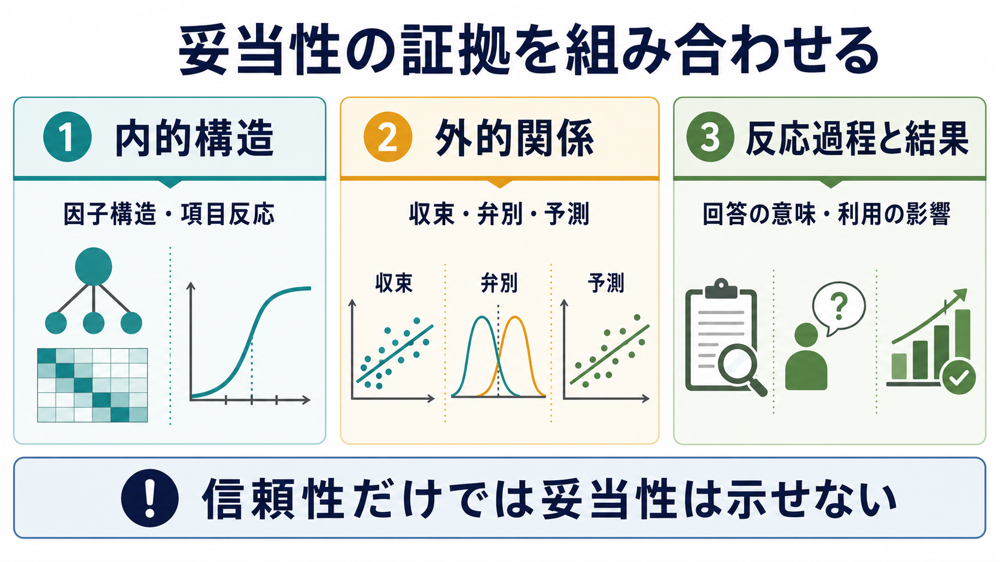
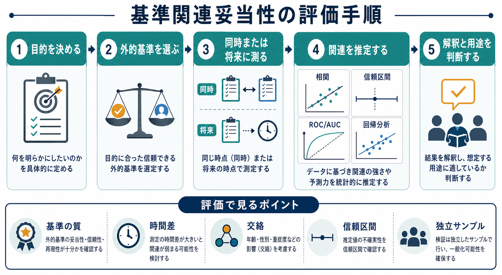
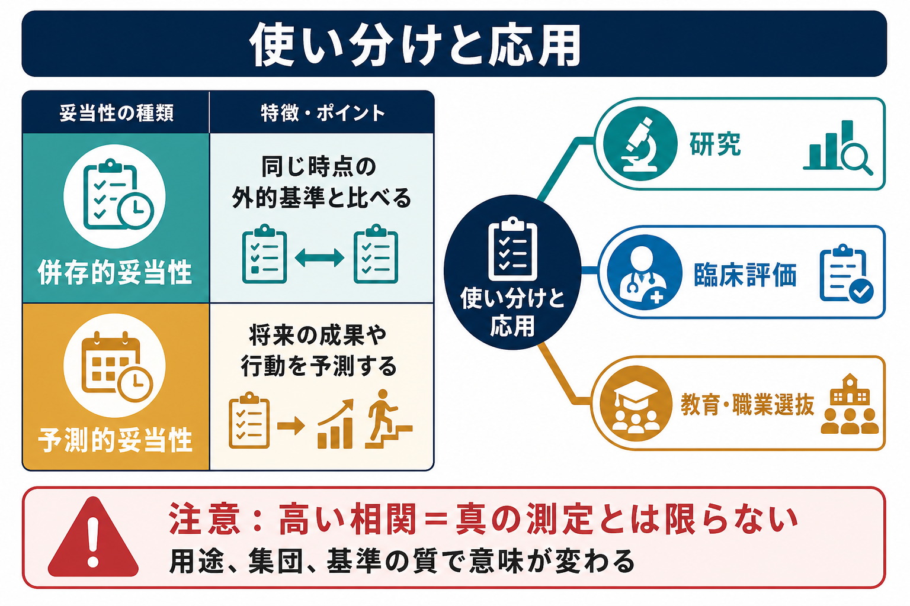

# 基準関連妥当性とは何か

## 要点

- 基準関連妥当性とは、尺度得点が外的基準、すなわち尺度の外にある行動、診断、成績、臨床評価、既存検査などと、理論どおりに関連するかを調べる妥当性証拠である[1][2]。
- 現代の心理測定では、「テストそのものが妥当である」とは言わず、「ある得点解釈と用途が、どの証拠で支えられているか」を問う[1][3]。
- 代表的には、同じ時点の基準と比べる併存的妥当性、将来の成果を予測する予測的妥当性、既存情報にどれだけ上乗せして説明するかを見る増分妥当性がある[1][4]。
- 高い相関は重要な証拠になりうるが、それだけで尺度が「真の構成概念」を測っているとは言えない。基準そのものの信頼性、妥当性、時間差、交絡、対象集団が解釈を左右する[1][5]。
- 臨床・教育・研究では、基準関連妥当性を「診断や選抜を自動化する根拠」としてではなく、得点をどの範囲で判断材料にできるかを限定するために使う。

## この記事で答える問い

1. 基準関連妥当性とは、[[心理測定とは何か|心理測定]]の中で何を評価しているのか。
2. 併存的妥当性、予測的妥当性、増分妥当性は何が違うのか。
3. 相関係数、回帰分析、ROC/AUC、カットオフはどのように読めばよいのか。
4. [[妥当性とは何か|妥当性]]や信頼性、構成概念妥当性とどう関係するのか。
5. 臨床・研究で尺度得点を使うとき、どこで解釈を止めるべきか。

## まず結論

基準関連妥当性は、「尺度得点が、尺度の外にある重要な基準とどの程度つながるか」を調べる方法である。たとえば、不安尺度の得点が臨床面接による不安症状評価と関連する、学習方略尺度が後の成績を予測する、職業適性検査が入職後の業績評価と関連する、といった場合に問題になる。

ただし、重要なのは「相関があるか」だけではない。基準関連妥当性は、尺度得点にもとづく解釈や意思決定が、その用途に対して十分に支えられているかを見る証拠の一部である[1][3]。基準が粗い、対象集団が違う、交絡が大きい、信頼区間が広い、基準測定が尺度と同じ自己報告に依存している、という場合には、相関が有意でも解釈は限定される。

## 背景

古典的には、妥当性は内容的妥当性、基準関連妥当性、構成概念妥当性のように種類分けされることが多かった。しかし、現在の Standards for Educational and Psychological Testing では、妥当性を分割された属性ではなく、得点解釈と用途を支える証拠の総体として扱う[1]。この枠組みでは、基準関連妥当性は「他の変数との関係にもとづく証拠」の一部である。

Cronbach と Meehl は、心理検査が単に外的基準と相関するだけでなく、構成概念をめぐる理論的ネットワークの中で検証される必要があると論じた[2]。Messick も、妥当性を得点意味と使用結果を含む統合的な評価として捉え、単一の係数だけで妥当性を判断する考えを退けた[3]。この流れを踏まえると、基準関連妥当性は便利な経験的証拠である一方、構成概念、測定手続き、使用場面から切り離して読むべきではない。

## 基本概念

### 外的基準

外的基準とは、尺度得点と照合される尺度外の変数である。例として、臨床面接、観察評価、診断分類、学業成績、職務成績、行動ログ、生理指標、既存の標準検査などがある。基準は「尺度より真実に近いもの」とは限らない。基準にも測定誤差、バイアス、文化差、評価者差、範囲制限があるため、基準の質を検討しなければならない[1]。

### 併存的妥当性

併存的妥当性は、尺度得点と外的基準を同じ時点、またはほぼ同じ時期に測り、両者が理論どおりに関連するかを見る。たとえば、新しい抑うつ尺度の得点が、同時期の臨床評価や既存尺度と関連するかを調べる。現在状態の把握、スクリーニング、既存検査との比較に向いている。

### 予測的妥当性

予測的妥当性は、尺度得点が将来の成果や行動をどの程度予測するかを見る。入学時の尺度得点が後の成績を予測する、初回評価の症状尺度が再発リスクや治療反応を予測する、といった例である。予測的妥当性では、測定時点の順序が重要であり、未来の基準をどれだけ正確に、どの範囲で予測できるかを問う[1]。

### 増分妥当性

増分妥当性は、新しい尺度得点が、既存情報に上乗せしてどれだけ説明力・予測力を加えるかを問う。たとえば、年齢、性別、既往歴、既存尺度を入れたモデルに新尺度を加えたとき、予測性能が実質的に改善するかを見る。臨床や選抜では、単に相関があるだけでなく、「追加で測るコストに見合う情報を加えるか」が重要になる。

## 仕組み

基準関連妥当性の評価は、次の順に進む。

1. 何を判断したいのかを決める。
2. その判断に関係する外的基準を選ぶ。
3. 尺度得点と基準を同時点または将来時点で測る。
4. 相関、回帰、分類性能、信頼区間、交差検証などで関連を推定する。
5. 関連の強さだけでなく、基準の質、対象集団、測定誤差、交絡、用途上の利益と不利益を解釈する。

よく使われる指標には、ピアソン相関、スピアマン相関、回帰係数、決定係数、オッズ比、ROC曲線下面積（AUC）、感度、特異度、陽性的中率、陰性的中率がある。連続的な外的基準なら相関や回帰が使われやすい。診断の有無のような二値基準なら、ROC/AUCやカットオフごとの感度・特異度が問題になる。

ただし、カットオフは統計だけで決められない。スクリーニングでは見逃しを減らすために感度を重視することがあるが、その分、偽陽性が増える。診断補助や選抜では、偽陽性と偽陰性のコスト、介入可能性、対象者への影響を考える必要がある。したがって、基準関連妥当性は統計的関連と実践的判断の接点にある。

## 図解

図1は、妥当性証拠の中で基準関連妥当性が占める位置を示している。尺度の内的構造だけではなく、外的基準との関係、反応過程、使用結果を組み合わせて読む必要がある。

図2は、基準関連妥当性の評価手順である。先に用途を決め、外的基準を選び、時間関係を設計し、統計的関連を推定し、最後に用途に照らして解釈する。

図3は、併存的妥当性と予測的妥当性の使い分けを示す。臨床評価、研究、教育・職業選抜では、同じ相関係数でも意味が変わる。

## 臨床・研究との接続

臨床では、尺度得点は面接、観察、生活機能、発達歴、身体疾患、薬物、文化的背景と合わせて解釈される。基準関連妥当性が示されている尺度でも、単独で診断や治療方針を決める根拠にはならない。得点が外的基準と関連することは、「その用途で判断材料になりうる」という証拠であって、「得点がその人の状態を完全に表す」という意味ではない。

研究では、尺度を使う前に、その尺度が研究対象、言語、文化、年齢層、臨床群に合っているかを確認する必要がある。既存尺度を別集団にそのまま使うと、基準関連妥当性が弱くなることがある。さらに、尺度得点と外的基準がどちらも自己報告である場合、共通方法バイアスによって関連が高く見える可能性がある。Campbell と Fiske の多特性多方法行列は、同じ構成概念なら収束し、異なる構成概念なら弁別されるべきだという考えを示した古典的枠組みである[5]。

健康アウトカム測定では、COSMIN が測定特性の分類と評価方法を整備している。COSMIN では、基準妥当性を、測定得点が「ゴールドスタンダード」をどの程度反映するかとして定義するが、患者報告アウトカムでは真のゴールドスタンダードが存在しないことも多い。その場合、単純な基準妥当性ではなく、仮説検証にもとづく構成概念妥当性として扱うのが適切なことがある[6]。

## よくある誤解

### 誤解1: 外的基準と相関すれば妥当性は証明された

相関は重要な証拠だが、証明ではない。基準の質が低い、サンプルが偏っている、範囲制限がある、交絡が調整されていない、同じ方法で測ったために関連が膨らんでいる、という可能性がある。妥当性は累積的な論証であり、単一研究の単一係数では完結しない[1][3]。

### 誤解2: 併存的妥当性があれば予測的妥当性もある

同じ時点の基準と関連することは、将来の成果を予測できることとは違う。現在の症状尺度が現在の面接評価と関連しても、半年後の再発や治療反応を同じ精度で予測するとは限らない。予測を主張するなら、時間的に先行する得点と後の基準を用いた検証が必要である。

### 誤解3: AUCが高ければ臨床的に有用である

AUCは分類性能の要約指標だが、カットオフ、対象集団の有病率、偽陽性と偽陰性のコスト、介入可能性を直接示すわけではない。スクリーニングでは感度を高くする設計が望ましい場合がある一方、偽陽性が多いと不要な不安や追加評価を生む。臨床的有用性は、統計的性能と実践上の帰結を合わせて判断する。

### 誤解4: 基準関連妥当性は構成概念妥当性と別物である

歴史的には別分類として扱われたが、現在は、外的基準との関係も構成概念に関する証拠の一部として読むのが自然である[1][3]。尺度得点が外的基準と関連する理由を、理論、項目内容、反応過程、内的構造とつなげて説明できるほど、解釈は強くなる。

## 関連ノート

- [[心理測定とは何か]]
- [[妥当性とは何か]]
- [[心理尺度はどのように作られるのか]]
- [[MOC｜認知科学・心理学]]
- [[MOC｜研究方法]]
- [[MOC｜統計・医療統計]]

### 関連ノート候補

- 信頼性とは何か
- 構成概念妥当性とは何か
- 内容的妥当性とは何か
- 併存的妥当性とは何か
- 予測的妥当性とは何か
- ROC曲線とは何か
- 心理尺度のカットオフとは何か

### MOC更新候補

- `content/00_MOC/MOC｜認知科学・心理学.md` の心理測定・心理学研究カテゴリに追加
- `content/00_MOC/MOC｜研究方法.md` の測定・尺度開発カテゴリに追加
- `content/00_MOC/MOC｜統計・医療統計.md` の診断性能・予測評価カテゴリに関連リンクとして追加

## 理解チェック

1. 基準関連妥当性でいう「基準」は、なぜ常にゴールドスタンダードとは限らないのか。
2. 併存的妥当性と予測的妥当性は、測定時点と用途の点でどう違うか。
3. 新しい尺度が既存尺度と相関していても、増分妥当性が弱い場合があるのはなぜか。
4. カットオフを決めるとき、感度と特異度だけでなく何を考える必要があるか。
5. 基準関連妥当性を構成概念妥当性の一部として読むとは、具体的にどういう意味か。

## 参考文献

[1] American Educational Research Association, American Psychological Association, & National Council on Measurement in Education. (2014). *Standards for Educational and Psychological Testing*. American Educational Research Association. https://www.aera.net/publications/books/standards-for-educational-psychological-testing-2014-edition

[2] Cronbach, L. J., & Meehl, P. E. (1955). Construct validity in psychological tests. *Psychological Bulletin, 52*(4), 281-302. https://doi.org/10.1037/h0040957

[3] Messick, S. (1995). Validity of psychological assessment: Validation of inferences from persons' responses and performances as scientific inquiry into score meaning. *American Psychologist, 50*(9), 741-749. https://doi.org/10.1037/0003-066X.50.9.741

[4] Kane, M. T. (2013). Validating the interpretations and uses of test scores. *Journal of Educational Measurement, 50*(1), 1-73. https://doi.org/10.1111/jedm.12000

[5] Campbell, D. T., & Fiske, D. W. (1959). Convergent and discriminant validation by the multitrait-multimethod matrix. *Psychological Bulletin, 56*(2), 81-105. https://doi.org/10.1037/h0046016

[6] Mokkink, L. B., Terwee, C. B., Patrick, D. L., Alonso, J., Stratford, P. W., Knol, D. L., Bouter, L. M., & de Vet, H. C. W. (2010). The COSMIN checklist for evaluating the methodological quality of studies on measurement properties: A clarification of its content. *BMC Medical Research Methodology, 10*, 22. https://doi.org/10.1186/1471-2288-10-22

[7] Clark, L. A., & Watson, D. (1995). Constructing validity: Basic issues in objective scale development. *Psychological Assessment, 7*(3), 309-319. https://doi.org/10.1037/1040-3590.7.3.309

[8] Flake, J. K., & Fried, E. I. (2020). Measurement schmeasurement: Questionable measurement practices and how to avoid them. *Advances in Methods and Practices in Psychological Science, 3*(4), 456-465. https://doi.org/10.1177/2515245920952393

## 未解決問題

- 日本語尺度で、翻訳・文化適応後の基準関連妥当性をどこまで再検証すべきか。
- 臨床スクリーニングで、見逃しと過剰判定のバランスをどのように決めるべきか。
- デジタル行動ログやウェアラブル指標を外的基準として使う場合、その基準自体の妥当性をどう評価するか。
- 機械学習モデルのリスクスコアを、心理尺度の基準関連妥当性の枠組みでどこまで評価できるか。
