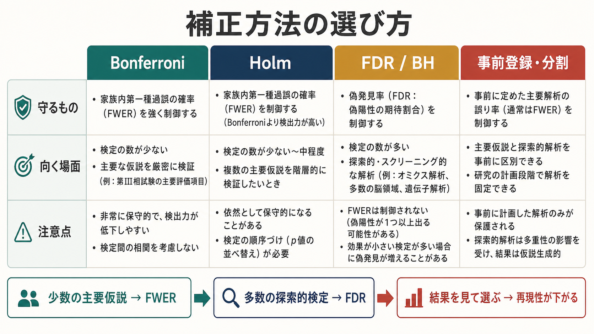
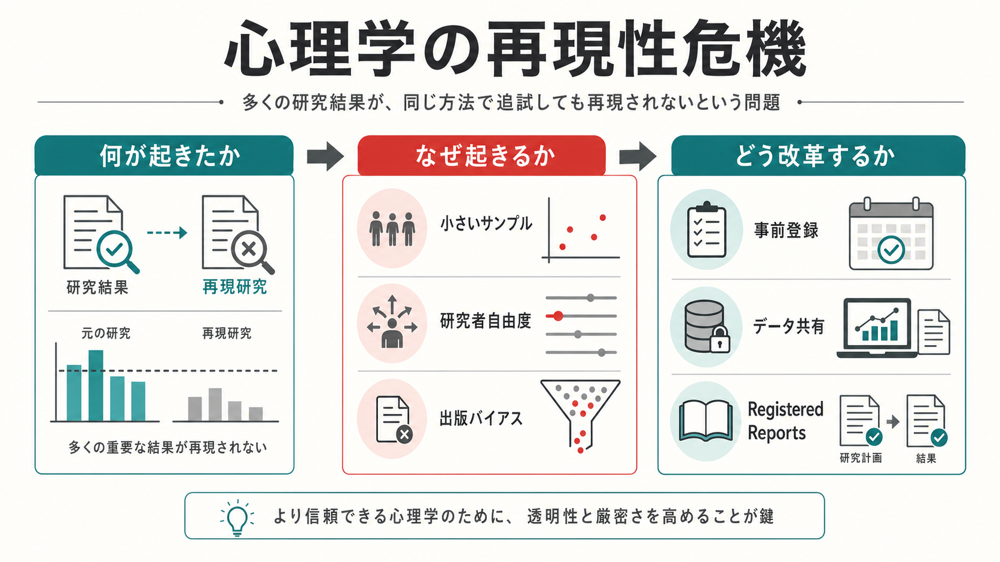
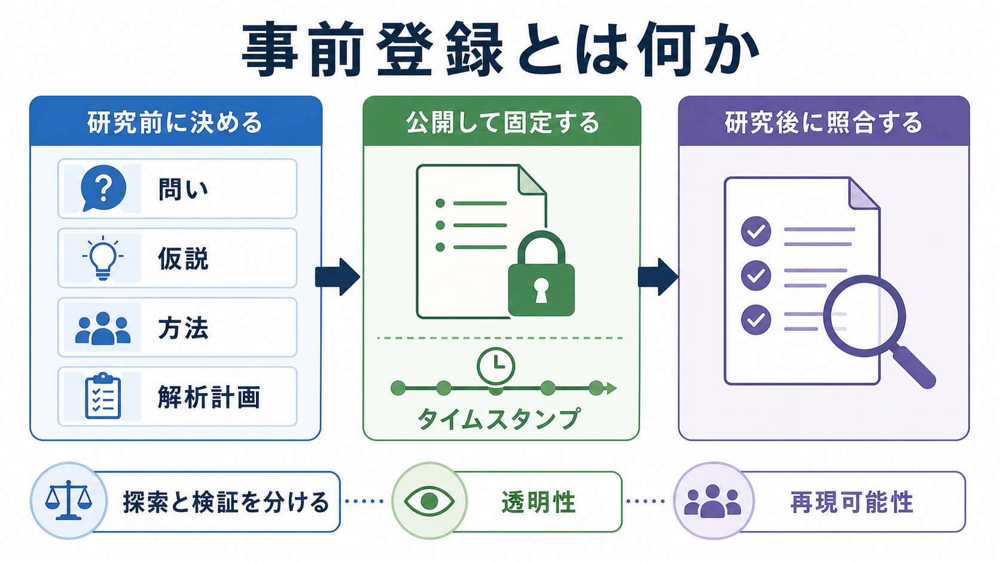

# 多重比較問題とは何か

## 要点

- 多重比較問題とは、複数の仮説検定を同じ研究・同じ解析計画の中で行うほど、偶然に「有意」と出る結果が増える問題である。
- 1回の検定で \(\alpha = .05\) を使うと、帰無仮説が正しいときに偽陽性を出す確率は5%である。しかし20回の独立した検定を行うと、少なくとも1つ偽陽性が出る確率は約64%になる。
- 補正方法には、少なくとも1つの偽陽性を抑える FWER 系の方法と、発見された結果の中に含まれる偽陽性割合を抑える FDR 系の方法がある。
- 補正は機械的に厳しくすればよいわけではない。主要仮説、探索的解析、結果変数の数、事前登録、効果量、信頼区間、再現性確認を合わせて読む必要がある。

## この記事で答える問い

1. 多重比較問題は、なぜ偶然の有意差を増やすのか。
2. FWER、Bonferroni、Holm、FDR は何を守る方法なのか。
3. 心理学研究や心理測定では、どのような場面で多重比較が生じやすいのか。
4. 補正後に有意でない結果を、どう解釈すればよいのか。

## まず結論

多重比較問題の核心は、「1回あたり5%なら、研究全体でも5%だろう」と誤解しやすい点にある。1回の検定では \(\alpha = .05\) でも、同じ基準を多数の検定に繰り返し使えば、研究全体としては偶然の有意差を拾う機会が増える。これは [[心理学研究法とは何か]]、[[実験研究とは何か]]、[[観察研究とは何か]]、[[心理測定とは何か]] のいずれにも関わる基礎的な統計問題である。

ただし、多重比較補正は「有意差を消すための罰」ではない。研究でどの主張をどの程度強く言いたいのか、どの検定群を同じファミリーとして扱うのか、主要仮説と探索的仮説を分けているのかを明示するための推論上の設計である。ASA の p値声明も、p値だけで科学的結論や実質的重要性を決めるべきではなく、研究デザイン、測定、仮説、解析過程とともに解釈すべきだと強調している[1]。

## 背景

心理学研究では、多重比較はごく自然に生じる。たとえば、3群を比較する、複数のアウトカムを測る、質問紙の下位尺度ごとに群差を見る、複数時点の変化を調べる、性別や年齢層でサブグループ解析を行う、探索的に多くの相関を眺める、といった場面である。1つ1つの検定は妥当に見えても、全体としては偶然の発見が混ざりやすくなる。

Shaffer は心理学における多重仮説検定を整理し、単に「検定数が多い」ことだけでなく、仮説同士の関係、研究者がどの結論集合を主張したいのか、誤りをどの単位で制御するのかが重要だと述べている[2]。これは [[妥当性とは何か]] や [[信頼性とは何か]] と同じく、統計手続きだけでなく、測定と解釈の単位を問う問題である。

## 基本概念

### 偽陽性と第一種過誤

偽陽性とは、実際には効果や差がないのに「ある」と判断する誤りである。仮説検定では第一種過誤とも呼ばれる。1回の検定で \(\alpha = .05\) を使うとは、帰無仮説が正しいときに、その検定で誤って棄却する確率を5%に設定するという意味である。

### ファミリー

多重比較で難しいのは、何を1つの「ファミリー」とみなすかである。ファミリーとは、同じ研究上の主張を支える検定群である。たとえば「介入は抑うつ、不安、睡眠、生活機能のどれかに効果がある」と主張したいなら、それら複数アウトカムの検定は同じファミリーとして扱う理由がある。一方、明確に事前登録された主要アウトカムと、補助的な探索アウトカムを同じ重みで一括補正する必要があるとは限らない。

### FWER

FWER（family-wise error rate）は、1つのファミリー内で少なくとも1つ偽陽性を出す確率である。主要仮説を強く主張したい研究、臨床試験の主要評価項目、少数の事前仮説を確認する場面では、FWER を抑える設計が向いている。

### FDR

FDR（false discovery rate）は、発見された結果の中に含まれる偽陽性の期待割合を制御する考え方である。多数の遺伝子、脳部位、項目、相関、特徴量を探索するような場面では、1つでも偽陽性を許さない FWER より、発見集合全体の信頼性を管理する FDR が有用なことがある[4]。

## 仕組み

検定が互いに独立で、すべての帰無仮説が正しいと単純化すると、1回の検定で偽陽性を出さない確率は \(1-\alpha\) である。\(m\) 回すべてで偽陽性を出さない確率は \((1-\alpha)^m\) なので、少なくとも1つ偽陽性が出る確率は次のようになる。

$$
\mathrm{FWER} = 1 - (1-\alpha)^m
$$

\(\alpha = .05\) のとき、検定数が1なら5%、5なら約23%、10なら約40%、20なら約64%、50なら約92%である。実際の研究では検定同士が独立でないことも多いが、「検定機会が増えるほど、偶然の極端な値を拾いやすくなる」という直観は変わらない。

## 図解

1枚目は、多重比較問題を「検定が増える」「偶然の有意差が増える」「補正や事前計画で制御する」という流れとして示している。

2枚目は、検定数 \(m\) が増えると、未補正の \(p < .05\) では研究全体の偽陽性確率が急速に上がることを示している。

3枚目は、補正方法の選び方を比較している。少数の主要仮説を強く確認するなら FWER 系、多数の探索的検定から候補を拾うなら FDR 系が候補になる。

## 代表的な補正方法

### Bonferroni補正

Bonferroni補正は、全体の有意水準 \(\alpha\) を検定数 \(m\) で割り、各検定の閾値を \(\alpha/m\) にする方法である。たとえば20回の検定で全体の FWER を .05 に抑えたいなら、各検定の閾値は \(.05/20 = .0025\) になる。

利点は単純で、検定同士が独立でなくても FWER を保守的に制御しやすいことである。欠点は、検定数が多いとかなり厳しくなり、真の効果を見逃しやすいことである。

### Holm法

Holm法は、p値を小さい順に並べ、段階的に Bonferroni 型の基準と比較する方法である。Holm はこの逐次棄却法を提案し、単純な Bonferroni より一様に強力な FWER 制御法として示した[3]。公衆衛生研究向けの解説でも、Bonferroni より Holm 法を広く使う価値があると整理されている[6]。

実務上は、少数から中程度の検定で FWER を抑えたい場合、単純 Bonferroni より Holm 法を第一候補にしやすい。

### Benjamini-Hochberg法

Benjamini-Hochberg法（BH法）は、FDR を制御する代表的な手続きである。Benjamini と Hochberg は、多数の検定で発見力を保ちながら、発見集合に含まれる偽発見の割合を制御する方法として提案した[4]。

BH法は、探索的研究、オミックス、脳画像、質問紙項目群、大規模特徴量選択のように、発見候補を広く拾いたい場面で使われやすい。ただし、FDR は「個々の発見が95%正しい」ことを保証するものではない。発見集合全体に対する制御である。

実装上は、R の `p.adjust` などで Bonferroni、Holm、BH、BY などの代表的な補正済みp値を計算できる[8]。ただし、関数を使えることと、その補正方法が研究目的に合っていることは別問題である。

### 補正しない、または限定して補正する場合

すべての解析で機械的に補正すればよいわけではない。Bender と Lange は、主要仮説が明確な確認的研究と、多数の仮説を調べる探索的研究を分け、いつ・なぜ・どの単位で補正するかを明示する必要があると論じている[5]。Perneger も、Bonferroni補正を無批判に適用すると、解釈したい仮説構造を歪めたり、重要なシグナルを過度に見逃したりする可能性を指摘している[7]。

したがって、適切な対応は「常に補正」でも「補正は不要」でもない。主要仮説、探索範囲、検定ファミリー、事前登録、効果量、再現性確認を合わせて判断する。

## 臨床・研究との接続

心理測定では、1つの尺度に複数の下位尺度があることが多い。群差、相関、因子負荷、項目反応、カットオフ値を多数調べれば、多重比較問題はすぐに生じる。[[カットオフ値はどのように決めるのか]] で扱うように、閾値設定や分類の研究でも、複数の候補閾値を試して最も都合のよい点だけを報告すると、性能が過大評価されやすい。

脳画像解析では、ボクセル、領域、ネットワーク接続を大量に検定するため、多重比較問題はさらに大きくなる。この点は [[多重比較補正は脳画像解析でなぜ重要なのか]] と接続する。心理学研究でも、反応時間、正答率、複数尺度、複数条件、複数群を同時に扱う場合、同じ構造の問題が生じる。

臨床・教育場面に近い研究では、補正後有意という結果を個別判断に直結させてはいけない。統計的有意性は、効果量、信頼区間、測定の信頼性、対象集団、外的妥当性、害と利益の判断と合わせて読む必要がある。

## よくある誤解

### 「p < .05 が1つでもあれば発見である」

探索した検定の数を無視すると危険である。多数の検定から1つだけ小さいp値を取り出すと、偶然の結果を強い証拠のように見せやすい。

### 「補正後に有意でなければ効果はない」

補正後に有意でないことは、「このデータとこの検定ファミリーでは、指定した誤り率を制御したうえで強く主張するには証拠が足りない」という意味である。効果がゼロであることの証明ではない。

### 「Bonferroniは厳しいから常に悪い」

Bonferroni は保守的だが、少数の主要仮説を強く守りたい場合には有用である。検定数が多い場合や相関した検定が多い場合は、Holm 法、FDR、階層的仮説、事前登録、独立データでの再現などを検討する。

### 「FDRは甘い補正である」

FDR は FWER と守る対象が違う。個別の1発見を強く主張するより、多数の候補発見の集合を管理したい探索的研究に向く。目的が違う方法を、単に厳しい・甘いで比較しないほうがよい。

### 「補正方法を後から都合よく選べばよい」

結果を見てから補正方法や検定ファミリーを選ぶと、補正自体が探索の一部になり、誤検出率の解釈が崩れる。主要解析は事前に決め、探索的解析は探索的と明記することが重要である。

## 実務での読み方

論文や解析結果を読むときは、次を確認するとよい。

| 確認点 | 読み方 |
|---|---|
| 主要仮説 | 事前に決めた主要アウトカムか、探索的に見つけた結果か |
| 検定ファミリー | どの検定群を同じ誤り率制御の対象にしたか |
| 補正方法 | Bonferroni、Holm、BH/FDR、階層的検定などのどれか |
| 検定数 | 実際に何回の比較・相関・下位尺度・時点を調べたか |
| 効果量 | p値だけでなく、差の大きさと不確実性が示されているか |
| 再現性 | 独立データ、事前登録、追試、感度分析があるか |

## 関連ノート

既存の関連ノート:

- [[心理学研究法とは何か]]
- [[実験研究とは何か]]
- [[観察研究とは何か]]
- [[心理測定とは何か]]
- [[信頼性とは何か]]
- [[妥当性とは何か]]
- [[カットオフ値はどのように決めるのか]]
- [[多重比較補正は脳画像解析でなぜ重要なのか]]

MOC更新候補:

- `content/00_MOC/MOC｜認知科学・心理学.md` の心理測定・心理学研究セクション
- `content/00_MOC/MOC｜研究方法.md` の統計的推論・研究デザイン関連項目
- `content/00_MOC/MOC｜統計・医療統計.md` の多重検定・p値・補正方法関連項目

今後の作成候補:

- 偽陽性と偽陰性の違い
- FWERとは何か
- FDRとは何か
- p値とは何か
- 事前登録とは何か
- 探索的解析と確認的解析は何が違うのか

## 理解チェック

1. \(\alpha = .05\) の検定を20回行うと、すべての帰無仮説が正しい場合、少なくとも1つ偽陽性が出る確率はおよそ何%か。
2. FWER と FDR は、それぞれ何を制御する考え方か。
3. Bonferroni補正と Holm 法は、どちらも何を抑える方法か。Holm 法の利点は何か。
4. 多数の下位尺度を探索的に調べる研究で、未補正の \(p < .05\) だけを報告すると何が問題になるか。
5. 補正後に有意でない結果を「効果がない」と断定してはいけないのはなぜか。

## 未解決問題

- 心理学研究では、主要仮説と探索的仮説が同じ論文内で混在しやすい。どの範囲を1つのファミリーとするかは、研究目的と報告の透明性に依存する。
- 補正方法を厳しくすると偽陽性は減るが、偽陰性は増えやすい。効果量、測定精度、サンプルサイズ、事前仮説の質を含めて設計する必要がある。
- 大規模データ解析では FDR が有用だが、発見集合の意味づけや個別発見の再現性確認は別途必要である。

## 参考文献

[1] Wasserstein, R. L., & Lazar, N. A. (2016). The ASA's statement on p-values: Context, process, and purpose. *The American Statistician, 70*(2), 129-133. https://doi.org/10.1080/00031305.2016.1154108

[2] Shaffer, J. P. (1995). Multiple hypothesis testing. *Annual Review of Psychology, 46*, 561-584. https://doi.org/10.1146/annurev.ps.46.020195.003021

[3] Holm, S. (1979). A simple sequentially rejective multiple test procedure. *Scandinavian Journal of Statistics, 6*(2), 65-70. https://www.jstor.org/stable/4615733

[4] Benjamini, Y., & Hochberg, Y. (1995). Controlling the false discovery rate: A practical and powerful approach to multiple testing. *Journal of the Royal Statistical Society: Series B (Methodological), 57*(1), 289-300. https://www.jstor.org/stable/2346101

[5] Bender, R., & Lange, S. (2001). Adjusting for multiple testing: When and how? *Journal of Clinical Epidemiology, 54*(4), 343-349. https://doi.org/10.1016/S0895-4356(00)00314-0

[6] Aickin, M., & Gensler, H. (1996). Adjusting for multiple testing when reporting research results: The Bonferroni vs Holm methods. *American Journal of Public Health, 86*(5), 726-728. https://doi.org/10.2105/AJPH.86.5.726

[7] Perneger, T. V. (1998). What's wrong with Bonferroni adjustments. *BMJ, 316*(7139), 1236-1238. https://doi.org/10.1136/bmj.316.7139.1236

[8] R Core Team. (2026). *p.adjust: Adjust P-values for Multiple Comparisons*. R Documentation. https://rweb.stat.umn.edu/R/library/stats/html/p.adjust.html
