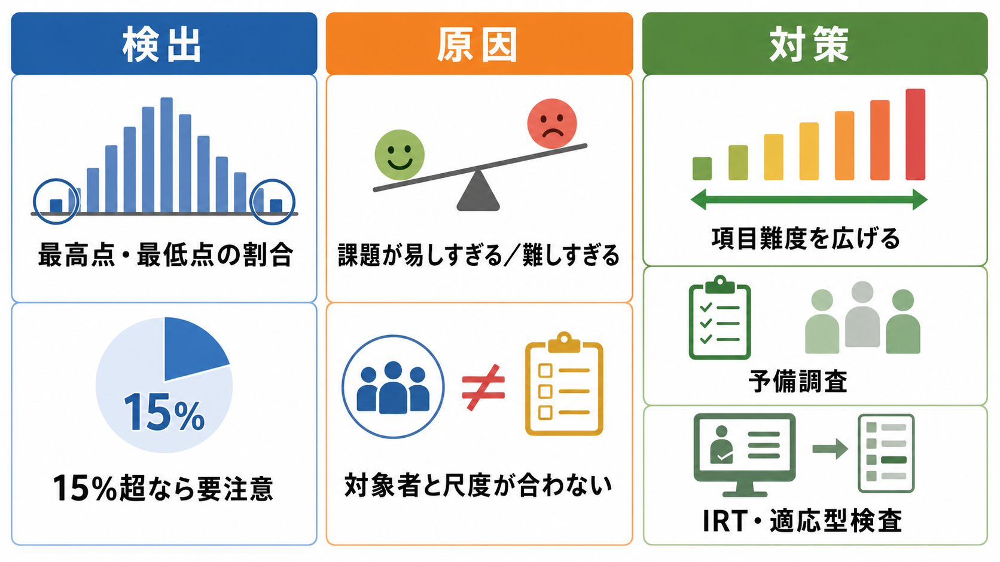

# 天井効果と床効果とは何か

## 要点

- 天井効果とは、多くの人の得点が尺度の上限に集中し、本来はもっと高い能力・症状・態度の差があっても同じような高得点に見えてしまう状態である。
- 床効果とは、多くの人の得点が尺度の下限に集中し、本来はもっと低い能力・症状・態度の差があっても同じような低得点に見えてしまう状態である。
- どちらも、[[心理測定とは何か|心理測定]]で捉えたい個人差、群間差、介入前後の変化、重症度の違いを圧縮する。結果として、[[信頼性とは何か|信頼性]]、反応性、効果量、サンプルサイズ設計、[[妥当性とは何か|妥当性]]解釈に影響する[1][2]。
- 対策は、難しすぎる・易しすぎる項目を足すことではなく、対象者、目的、測定範囲、項目難度、採点方法を合わせ直すことである。

## この記事で答える問い

1. 天井効果と床効果は、何が「天井」「床」なのか。
2. なぜ得点が端に集まると、個人差や変化が見えにくくなるのか。
3. 心理尺度、認知課題、臨床アウトカム研究では何が問題になるのか。
4. 研究計画、尺度開発、統計解析ではどう点検し、どう対処すればよいのか。

## まず結論

天井効果と床効果は、「参加者が本当に同じだから得点が同じになる」現象ではない。測定器の範囲が対象者に合わず、上限または下限で得点が切り詰められるために、違いが見えなくなる現象である。たとえば、非常に簡単な記憶課題を大学生に出すと多くの人が満点になり、記憶力の個人差をほとんど区別できない。逆に、非常に難しい課題を小児や重度障害のある対象者に出すと、多くの人が最低点になり、低い範囲の違いを区別できない。

この問題は、単に「分布が偏っている」という記述統計上の癖にとどまらない。尺度が測れる範囲から対象者がはみ出すと、得点の情報量が端で減り、群間差や縦断的変化が小さく見え、介入効果や症状変化を検出しにくくなる[2][4]。そのため、天井効果・床効果は、[[心理尺度はどのように作られるのか|心理尺度の作成]]、[[標準化とは何か|標準化]]、臨床アウトカム評価、教育評価、認知実験のすべてで点検すべき基本問題である。

## 背景

心理学や臨床研究では、直接観察できない能力、症状、態度、生活機能を、質問紙、検査課題、評定尺度、反応時間、正答数などに変換して扱う。教育・心理検査の標準では、得点解釈の根拠として、測定目的、対象集団、精度、誤差、利用条件を明示することが重視される[1]。天井効果と床効果は、この「得点をどう解釈できるか」を狭める代表的な制約である。

古典的には、天井効果・床効果は得点分布の端への集中として観察される。実務上は、最高点または最低点を取る人の割合、ヒストグラムの形、歪度、項目ごとの正答率・選択肢使用率、時点間の変化量の偏りなどで点検する。健康関連尺度の測定特性を評価する基準では、最高点または最低点に15%を超える対象者が集中する場合、床・天井効果として注意すべきという経験的基準が使われてきた[2]。ただし、この15%は万能な判定線ではなく、研究目的、サンプル、尺度幅、得点の使い方によって解釈する必要がある。

## 基本概念

### 天井効果

天井効果は、測定値が上限に張りつく現象である。易しすぎる課題、軽症者ばかりを対象にした症状尺度、健康な集団に対する生活機能尺度、満点が低く設定された知識テストなどで起こりやすい。

たとえば、睡眠障害がほとんどない学生を対象に「強い不眠症状」を尋ねる尺度を使うと、多くの人が低症状側に集まる。この場合、症状尺度としては床効果が問題になる。一方、非常に簡単な注意課題で正答数を測ると、多くの人が満点に近づき、能力尺度としては天井効果が問題になる。つまり、どちらが天井でどちらが床かは、測っている変数の向きと採点規則に依存する。

### 床効果

床効果は、測定値が下限に張りつく現象である。難しすぎる課題、重症者に対して高機能側の項目しかない尺度、低頻度行動を一般集団に尋ねる質問紙などで起こりやすい。

床効果があると、「できない」「症状がない」「該当しない」という同じ得点の中に、実際には異なる状態が混ざる。たとえば、身体機能尺度で「1km歩けるか」という項目だけでは、数歩なら歩ける人、ベッド上で体位変換できる人、完全介助が必要な人を区別しにくい。PROMIS の身体機能項目バンク研究は、こうした端の測定範囲を広げるため、非常に低い機能と非常に高い機能を測る項目を追加する必要を示した[4]。

## 仕組み

天井効果・床効果の中心には、真の個人差の範囲と、尺度が識別できる範囲の不一致がある。潜在特性を $\theta$、観察得点を $X$ とすると、単純化すれば観察得点は次のように下限 $L$ と上限 $U$ によって切り詰められる。

$$
X = \min(\max(\theta + E, L), U)
$$

ここで $E$ は測定誤差である。$\theta + E$ が $U$ を超えても観察得点は $U$ に固定され、$L$ を下回っても $L$ に固定される。そのため、端にいる人ほど、実際の差が得点差として表れにくい。

この切り詰めは、少なくとも4つの問題を生む。

1. **個人差の圧縮**: 端にいる対象者が同点になり、順位づけや相関が歪む。
2. **群間差の過小評価**: 実際には差がある群でも、上限・下限に張りつくと平均差が小さく見える。
3. **変化検出の低下**: 介入後にさらに良くなる、または悪くなる余地が得点上なくなり、反応性が下がる。
4. **統計モデルの前提違反**: 通常の t 検定や ANOVA をそのまま使うと、効果量や第I種過誤率が歪む場合がある[5][6]。

重要なのは、天井効果・床効果が「外れ値」ではない点である。外れ値なら個別値の扱いが問題になるが、床・天井効果では、測定手続きそのものが端の情報を失っている。したがって、端の得点を機械的に除外すると、対象集団の重要な情報をさらに捨てることになる[5]。

## 図解

図1は、床効果と天井効果を得点分布として見るための概念図である。左端に集まれば床効果、右端に集まれば天井効果であり、中央の問題は「端にいる人が同じ点にまとめられる」ことである。

図2は、真の能力・症状の連続体が、尺度の下限と上限で切り詰められる仕組みを示している。端で切られた得点は、順位づけ、平均差、変化量のどれにも影響する。

図3は、研究実務での確認と対策をまとめている。最高点・最低点の割合だけでなく、対象者と尺度の対応、項目難度、予備調査、項目反応理論や適応型検査の活用を合わせて考える。

## 臨床・研究との接続

### 心理尺度と質問紙

心理尺度では、天井効果・床効果は[[内容的妥当性とは何か|内容的妥当性]]と密接に関わる。項目が概念の狭い範囲しか覆っていないと、対象者の多様な状態を得点に反映できない。たとえば、軽症から重症までを扱う抑うつ尺度で、重症側の項目だけが多ければ軽症・寛解域の変化を捉えにくくなる。逆に、一般集団向けの軽い項目だけでは、重症域の違いが天井側で圧縮される。

この問題は[[構成概念妥当性とは何か|構成概念妥当性]]の証拠にも影響する。得点範囲が狭まると、外部基準との相関、因子構造、群間差、予測妥当性が本来より弱く見える可能性がある。したがって、尺度開発では、対象集団の分布を事前に想定し、項目難度を広く配置し、予備調査で最高点・最低点の集中を確認する必要がある。

### 認知課題と実験研究

認知課題では、課題が易しすぎると正答率が満点に近づき、反応時間や誤答率しか差が残らないことがある。逆に、課題が難しすぎると偶然水準に近づき、条件差や個人差を見つけにくい。社会・行動科学のシミュレーション研究でも、床・天井効果のあるデータに通常の t 検定や ANOVA を無批判に適用すると、推定や検定の性能が悪化しうることが示されている[5][6]。

実験計画では、予備実験で正答率や反応分布を見て、課題難度を調整する。対象者の能力幅が広い場合は、項目セットを複数難度に分ける、開始点を変える、適応的に項目を出す、正答数だけでなく反応時間や信号検出理論の指標を併用する、といった設計が有効になる。

### 臨床アウトカムと介入研究

臨床・リハビリテーション・公衆衛生研究では、床・天井効果は変化の検出に直結する。たとえば、介入前から多くの対象者が最高機能に近い尺度では、改善しても得点上は伸びない。反対に、非常に重度の対象者に対して尺度の最低点が粗いと、小さな改善や悪化を拾えない。

PROMIS は、項目反応理論と項目バンクを使い、対象者の水準に合った項目を選ぶことで、短い質問数でも精度の高い測定を目指してきた[7]。身体機能領域では、従来尺度が極端に高い機能や低い機能を十分に測れないことが問題となり、床項目・天井項目を追加して測定範囲を広げる研究が行われた[4]。これは、[[古典的テスト理論とは何か|古典的テスト理論]]だけでなく、項目ごとの難度と情報量を扱う現代的心理測定の発想と接続する。

## よくある誤解

### 誤解1：天井効果・床効果は、平均が高い・低いだけの問題である

平均が高い、低いだけでは床・天井効果とはいえない。問題は、得点が尺度の端に集中し、それ以上またはそれ以下の違いを得点として表せないことである。平均が高くても分散が十分にあり、上限に張りついていなければ、天井効果は小さい。

### 誤解2：最高点・最低点が15%を超えたら、その尺度は使えない

15%基準は有用な警告線だが、絶対的な失格基準ではない[2]。研究目的がスクリーニングなのか、重症度の細かな比較なのか、介入変化の検出なのかで許容度は変わる。端の集中があっても、目的が分類であり、分類精度が十分なら使える場合もある。一方、縦断的変化を細かく見たい研究では、15%未満でも問題になることがある。

### 誤解3：統計解析で補正すれば十分である

切り詰められたデータを扱う統計モデルは役に立つが、測れていない情報を完全に復元できるわけではない。床・天井効果への第一の対策は、対象者に合う項目や尺度を選ぶことである。解析上は、分布を確認し、必要に応じて打ち切りモデル、順序尺度モデル、項目反応理論、感度分析を使う。ただし、研究計画段階で測定範囲を広げる方が根本的である[5][6]。

### 誤解4：満点者を除外すれば問題は消える

満点者や最低点者は、測定範囲の外側にいる可能性を示す重要な参加者である。除外すると、対象集団を人工的に狭め、一般化可能性を下げる。除外ではなく、なぜ端に集中したのか、尺度が対象者に合っていたか、項目難度が十分だったかを検討する必要がある。

## 実務での点検手順

1. ヒストグラム、箱ひげ図、最高点・最低点の割合を確認する。
2. 項目ごとの正答率、選択肢使用率、欠測、同一回答パターンを確認する。
3. 対象者の能力・症状範囲と、尺度が想定する測定範囲を照合する。
4. 群間差や縦断変化を見たい場合、端にいる対象者で変化量が圧縮されていないか確認する。
5. 必要なら、項目難度の広い尺度、長い尺度、項目バンク、適応型検査、別のアウトカム指標を検討する。
6. 論文やノートでは、床・天井効果の有無、判定基準、対象集団、解析上の扱いを明記する。

## 関連ノート

- [[心理測定とは何か]]
- [[心理尺度はどのように作られるのか]]
- [[信頼性とは何か]]
- [[妥当性とは何か]]
- [[内容的妥当性とは何か]]
- [[構成概念妥当性とは何か]]
- [[標準化とは何か]]
- [[古典的テスト理論とは何か]]
- [[因子分析とは何か]]

## MOC更新候補

- `content/00_MOC/` 配下の心理測定・研究方法・統計系 MOC に、本記事 `[[天井効果と床効果とは何か]]` を追加候補として残す。
- 並列ジョブとの衝突を避けるため、本記事作成時点では MOC ファイル本体は更新しない。

## 理解チェック

1. 天井効果と床効果は、単なる分布の偏りとどう違うか。
2. 満点者が多い認知課題では、どのような個人差が見えにくくなるか。
3. 最高点・最低点の割合が15%を超えたとき、なぜすぐに「尺度は使えない」と断定してはいけないのか。
4. 介入研究で天井効果があると、改善効果はどのように見えやすいか。
5. 項目反応理論や適応型検査は、床・天井効果への対策として何を改善しうるか。

## 未解決問題

- 床・天井効果の判定基準を、尺度の用途、臨床的最小重要差、対象集団の重症度に応じてどう調整すべきか。
- 多文化・多言語尺度で、翻訳により項目難度が変化した場合、床・天井効果をどの段階で検出すべきか。
- スマートフォンやウェアラブルによる高頻度測定では、従来の質問紙型の床・天井効果をどのように再定義すべきか。
- 個人内変動を重視する研究では、集団分布の床・天井効果と個人内の測定範囲制約をどう区別すべきか。

## 参考文献

[1] American Educational Research Association, American Psychological Association, & National Council on Measurement in Education. (2014). *Standards for Educational and Psychological Testing*. https://www.ncme.org/resources-publications/books/testing-standards

[2] Terwee, C. B., Bot, S. D. M., de Boer, M. R., van der Windt, D. A. W. M., Knol, D. L., Dekker, J., Bouter, L. M., & de Vet, H. C. W. (2007). Quality criteria were proposed for measurement properties of health status questionnaires. *Journal of Clinical Epidemiology, 60*(1), 34-42. https://doi.org/10.1016/j.jclinepi.2006.03.012

[3] Mokkink, L. B., Terwee, C. B., Knol, D. L., Stratford, P. W., Alonso, J., Patrick, D. L., Bouter, L. M., & de Vet, H. C. W. (2010). The COSMIN checklist for evaluating the methodological quality of studies on measurement properties: A clarification of its content. *BMC Medical Research Methodology, 10*, 22. https://doi.org/10.1186/1471-2288-10-22

[4] Bruce, B., Fries, J., Lingala, B., Hussain, Y. N., & Krishnan, E. (2013). Development and assessment of floor and ceiling items for the PROMIS physical function item bank. *Arthritis Research & Therapy, 15*, R144. https://doi.org/10.1186/ar4327

[5] Liu, Q., & Wang, L. (2021). t-Test and ANOVA for data with ceiling and/or floor effects. *Behavior Research Methods, 53*(1), 264-277. https://doi.org/10.3758/s13428-020-01407-2

[6] Šimkovic, M., & Träuble, B. (2019). Robustness of statistical methods when measure is affected by ceiling and/or floor effect. *PLOS ONE, 14*(8), e0220889. https://doi.org/10.1371/journal.pone.0220889

[7] Reeve, B. B., Hays, R. D., Bjorner, J. B., Cook, K. F., Crane, P. K., Teresi, J. A., Thissen, D., Revicki, D. A., Weiss, D. J., Hambleton, R. K., Liu, H., Gershon, R., Reise, S. P., Lai, J. S., & Cella, D. (2007). Psychometric evaluation and calibration of health-related quality of life item banks: Plans for the Patient-Reported Outcomes Measurement Information System (PROMIS). *Medical Care, 45*(5 Suppl 1), S22-S31. https://doi.org/10.1097/01.mlr.0000250483.85507.04
