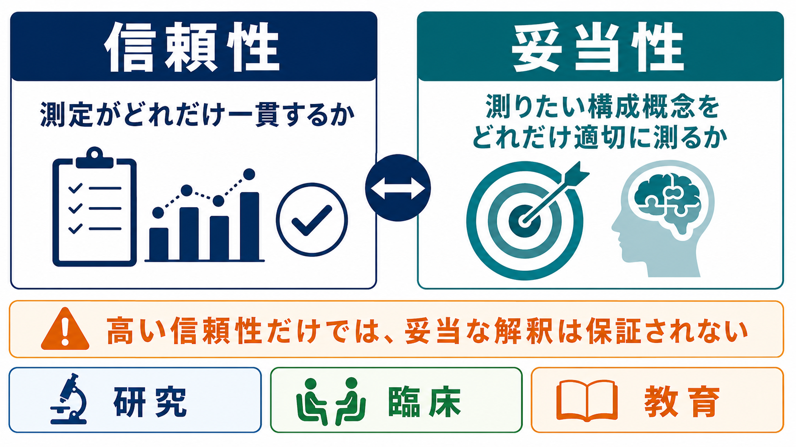

# 妥当性とは何か

## 要点

- 妥当性とは、心理検査や尺度の得点を「何の指標として、どの目的で使うのか」という解釈と使用が、証拠によってどれだけ支えられているかである[1][3][4]。
- 現代の妥当性論では、「検査そのものが妥当である」と言い切るより、「この集団・場面・目的における得点解釈が妥当か」を問う[1][4]。
- 妥当性の証拠には、内容、反応過程、内部構造、他変数との関係、検査使用の結果・影響などがある[1]。
- 信頼性は一貫した測定を表すが、信頼性が高いだけでは妥当性は保証されない。安定していても、測りたい構成概念からずれていれば、誤った解釈につながる[3][7]。
- 研究でも臨床でも、妥当性は一度証明して終わる属性ではなく、解釈と使用のたびに証拠を積み上げる検証プロセスである[4][8]。

## この記事で答える問い

1. 心理検査でいう「妥当性」とは何か。
2. なぜ「妥当性がある検査」ではなく「妥当な得点解釈」と考えるのか。
3. 妥当性の証拠にはどのような種類があるのか。
4. 信頼性、相関、因子分析、基準関連妥当性だけでは何が足りないのか。
5. 研究・臨床で妥当性をどう読むべきか。

## まず結論

妥当性は、心理検査が「本当に測りたいものを測っているか」を考えるための中心概念である。ただし、より正確には、妥当性は検査票や質問項目だけに宿る性質ではない。検査得点を、どの構成概念の指標として、どの集団に、どの場面で、どの判断に使うのかという主張が、どれだけ証拠で支えられているかを表す[1][3][4]。

たとえば、ある抑うつ尺度の合計点が高い人ほど抑うつ症状が強い、という解釈には、項目内容、回答者が項目をどう理解したか、因子構造、臨床面接や他尺度との関係、カットオフを使ったときの利益と不利益など、多面的な証拠が必要になる[1][3]。このため、妥当性は「ある・ない」の二値ではなく、「どの解釈が、どの程度、どの証拠に支えられているか」と読むほうがよい。

## 背景

心理学では、知能、不安、抑うつ、注意、[[ワーキングメモリとは何か|ワーキングメモリ]]、[[実行機能とは何か|実行機能]]、態度、人格特性のように、直接観察できないものを扱うことが多い。これらは構成概念と呼ばれる。構成概念は、理論上の概念であり、検査項目や反応時間や行動観察はその間接的な指標である。

Cronbach と Meehl は、構成概念妥当性を、単一の外的基準に頼れない心理検査を評価するための考え方として整理した[2]。その後、Campbell と Fiske は、同じ構成概念なら異なる方法でも関連し、異なる構成概念なら必要以上に混ざらないという収束的・弁別的証拠を示した[5]。Messick は、内容・基準・構成概念を別々の妥当性に分けるだけでは不十分であり、得点意味と検査使用の社会的帰結を含む統合的な構成概念妥当性として考える必要があると論じた[3]。

現在の Standards for Educational and Psychological Testing でも、妥当性は「意図された解釈と使用を支える証拠の程度」として扱われる[1]。この見方では、妥当性は検査名に固定されたラベルではなく、解釈・対象集団・使用目的に依存する。

## 基本概念

### 妥当性

妥当性とは、検査得点から行う解釈と使用が適切かどうかを支える証拠の総体である[1][4]。たとえば「この質問紙は不安を測る」という主張は、少なくとも次の問いに答える必要がある。

- 項目は不安の重要な側面を含んでいるか。
- 回答者は項目を意図どおり理解しているか。
- 項目群は理論に合ったまとまりを示すか。
- 関連する症状、行動、臨床評価、他尺度と期待どおり関係するか。
- その得点を使った判断が、研究上・臨床上の目的に見合っているか。

### 構成概念

構成概念とは、直接見えない心理的性質を説明するための理論的概念である。心理検査は構成概念そのものを直接取り出す装置ではなく、項目への反応や課題成績を通して構成概念を推定する道具である[2][6]。したがって、妥当性検証では「得点が何と相関するか」だけでなく、「なぜその得点が構成概念を反映すると考えられるのか」という理論的説明が必要になる。

### 信頼性との違い

信頼性は、測定がどれだけ一貫しているかを表す。再検査で似た得点になる、項目間の整合性が高い、評定者間で一致する、といった性質が含まれる。一方、妥当性は、その一貫した得点を何の意味として解釈できるかを問う。

たとえば、同じ人に毎回ほぼ同じ点を出す検査でも、その点数が不安ではなく文章読解力や社会的望ましさを強く反映しているなら、不安尺度としての解釈は弱い。信頼性は妥当性の前提条件になりやすいが、信頼性だけで妥当性は成立しない[3][7]。

## 仕組み

妥当性検証は、検査得点から解釈・使用へ進む推論の鎖を点検する作業である。Kane の議論では、妥当化とは、得点にもとづく主張を明示し、その主張を支える仮定と推論がどれだけもっともらしいかを評価することだとされる[4]。

### 1. 内容にもとづく証拠

内容にもとづく証拠は、項目や課題が測りたい構成概念の重要な側面を十分に含んでいるかを検討する。専門家レビュー、文献にもとづく項目作成、対象者への認知面接などが使われる。内容が狭すぎれば、得点は構成概念の一部しか表さない。内容が広すぎれば、別の構成概念が混ざる[1][7]。

### 2. 反応過程にもとづく証拠

反応過程にもとづく証拠は、回答者が項目をどのように理解し、判断し、回答しているかを調べる。質問紙であれば、回答者が意図された意味で項目を読んでいるか、臨床面接であれば、評定者が基準に沿って判断しているかが問題になる[1]。

### 3. 内部構造にもとづく証拠

内部構造にもとづく証拠は、項目間の関係や因子構造が理論に合っているかを調べる。探索的因子分析、確認的因子分析、項目反応理論、測定不変性の検討などがここに含まれる。ただし、因子構造がきれいに出ることは、妥当性の一部にすぎない。項目内容や外的変数との関係が弱ければ、解釈はまだ十分に支えられない[1][8]。

### 4. 他変数との関係にもとづく証拠

他変数との関係にもとづく証拠は、得点が理論的に関連する変数と関連し、異なるはずの変数とは必要以上に関連しないことを示す。Campbell と Fiske の収束的・弁別的妥当化は、この考え方の古典である[5]。

たとえば、不安尺度なら、心配、回避行動、生理的緊張、臨床評価とは関連することが期待される。一方で、知能や読解力や社会的望ましさとの関連が強すぎる場合、その尺度が本当に不安を測っているのかを再検討する必要がある。

### 5. 結果・影響にもとづく証拠

検査得点は、研究論文の変数として使われるだけでなく、選抜、診断補助、スクリーニング、教育的支援、治療方針の検討にも使われる。したがって、得点の使用がどのような利益と不利益を生むかも妥当性の問題になる[1][3][4]。

臨床場面では、カットオフを低くすれば見逃しは減るが、偽陽性が増える可能性がある。高くすれば過剰な判定は減るが、支援が必要な人を見逃す可能性がある。妥当性は、統計的な相関だけでなく、こうした使用目的と帰結のバランスにも関わる。

## 図解

図1は、妥当性を「得点解釈と使用を支える証拠」として整理した概念地図である。中心にあるのは検査名ではなく、得点をどう読むかという主張である。周囲には、内容、反応過程、内部構造、他変数との関係、結果・影響という証拠が配置される。

図2は、構成概念の定義から得点解釈までの流れを示している。妥当性検証では、項目を作った後に統計だけを見るのではなく、各段階でどの推論が成り立つかを点検する。

図3は、妥当性と信頼性の違いを示している。信頼性は得点の一貫性、妥当性は得点の意味と使用の適切さに関わる。高い信頼性は重要だが、それだけでは測りたい構成概念を適切に測っているとは言えない。

## 臨床・研究との接続

### 臨床での接続

心理検査は、個別診断を単独で決める道具ではなく、面接、観察、生活史、医学的情報、本人の困りごと、周囲からの情報と合わせて解釈する材料である。妥当性のある使い方とは、得点を絶対視することではなく、得点がどの範囲の判断に役立つかを明確にすることである。

たとえば、抑うつ尺度の高得点は「抑うつ症状の可能性が高い」ことを示すかもしれない。しかし、それだけで診断や治療方針を断定するのは過剰な解釈である。疲労、睡眠不足、身体疾患、薬剤、文化的表現、回答スタイル、危機的状況などが得点に影響する可能性がある。臨床では、妥当性は「この得点を、どこまで判断材料にしてよいか」を制御する考え方として重要である。

### 研究での接続

研究では、測定の妥当性が弱いと、どれほどサンプルサイズが大きくても、どれほど高度な統計モデルを使っても、結論の意味が曖昧になる。Flake と Fried は、測定に関する情報の不足や恣意的な尺度使用を questionable measurement practices と呼び、心理学の再現性や累積的知識にとって重要な問題だと論じている[8]。

研究で最低限確認したいのは、どの構成概念を測るのか、なぜその尺度を選んだのか、どの下位尺度や項目を使ったのか、採点方法を変更したか、対象集団での妥当性証拠があるか、測定不変性や文化差が問題にならないか、という点である。これは[[MOC｜研究方法|研究方法]]や[[MOC｜統計・医療統計]]に接続する基礎問題でもある。

## よくある誤解

### 誤解1: 「妥当性が高い検査」はどこでも同じように使える

同じ検査でも、対象集団、言語、年齢、文化、使用目的が変われば、得点の意味も変わりうる。大学生サンプルで妥当性証拠がある尺度を、高齢者、臨床群、別文化圏、職場選抜にそのまま使えるとは限らない[1][8]。

### 誤解2: 因子分析で想定どおりの構造が出れば妥当性は十分である

因子分析は内部構造の証拠であり、重要な一部である。しかし、内容、反応過程、外的変数との関係、使用の帰結を置き換えるものではない[1]。きれいな因子構造は、妥当性検証の終点ではなく、途中の証拠である。

### 誤解3: 基準関連妥当性があれば構成概念は確認できた

外的基準との相関は重要だが、その基準自体が不完全であることも多い。心理学では、構成概念に対して完全な「金標準」が存在しない場合が多いため、単一の基準との相関だけで妥当性を判断するのは危うい[2][6]。

### 誤解4: 信頼性が高ければ妥当性も高い

信頼性が低い測定は、一般に安定した解釈を支えにくい。しかし、信頼性が高くても、測っているものが目的の構成概念からずれていれば妥当ではない。毎回同じ方向にずれる体重計が、正確な体重を示さないのと同じである。

## 関連ノート

- [[MOC｜認知科学・心理学]]
- [[MOC｜統計・医療統計]]
- [[MOC｜研究方法]]
- [[認知機能検査は何を測っているのか]]
- [[ワーキングメモリとは何か]]
- [[実行機能とは何か]]

### 関連ノート候補

- 信頼性とは何か
- 構成概念とは何か
- 尺度開発とは何か
- 因子分析とは何か
- 測定不変性とは何か
- 心理検査のカットオフとは何か

### MOC更新候補

- `content/00_MOC/MOC｜認知科学・心理学.md` の「心理測定・心理学研究」領域に追加候補。
- 将来的に `MOC｜心理測定・心理学研究` を作る場合の基礎記事候補。

## 理解チェック

1. 妥当性は「検査そのもの」ではなく、何に対する証拠として評価されるか。
2. 信頼性が高くても妥当性が不十分な例を1つ説明できるか。
3. 内容、反応過程、内部構造、他変数との関係、結果・影響のうち、自分の研究で最も弱くなりやすい証拠はどれか。
4. 既存尺度を使うとき、対象集団や使用目的が変わると何を再確認すべきか。
5. 臨床場面で検査得点を単独で判断に使うことの危険は何か。

## 参考文献

[1] American Educational Research Association, American Psychological Association, & National Council on Measurement in Education. (2014). *Standards for Educational and Psychological Testing*. American Educational Research Association. https://www.aera.net/publications/books/standards-for-educational-psychological-testing-2014-edition

[2] Cronbach, L. J., & Meehl, P. E. (1955). Construct validity in psychological tests. *Psychological Bulletin, 52*(4), 281-302. https://doi.org/10.1037/h0040957

[3] Messick, S. (1995). Validity of psychological assessment: Validation of inferences from persons' responses and performances as scientific inquiry into score meaning. *American Psychologist, 50*(9), 741-749. https://doi.org/10.1037/0003-066X.50.9.741

[4] Kane, M. T. (2013). Validating the interpretations and uses of test scores. *Journal of Educational Measurement, 50*(1), 1-73. https://doi.org/10.1111/jedm.12000

[5] Campbell, D. T., & Fiske, D. W. (1959). Convergent and discriminant validation by the multitrait-multimethod matrix. *Psychological Bulletin, 56*(2), 81-105. https://doi.org/10.1037/h0046016

[6] Borsboom, D., Mellenbergh, G. J., & van Heerden, J. (2004). The concept of validity. *Psychological Review, 111*(4), 1061-1071. https://doi.org/10.1037/0033-295X.111.4.1061

[7] Clark, L. A., & Watson, D. (1995). Constructing validity: Basic issues in objective scale development. *Psychological Assessment, 7*(3), 309-319. https://doi.org/10.1037/1040-3590.7.3.309

[8] Flake, J. K., & Fried, E. I. (2020). Measurement schmeasurement: Questionable measurement practices and how to avoid them. *Advances in Methods and Practices in Psychological Science, 3*(4), 456-465. https://doi.org/10.1177/2515245920952393

## 未解決問題

- 日本語版尺度で、翻訳・文化適応・測定不変性をどこまで確認すれば実用上十分とみなせるか。
- 臨床スクリーニングで、見逃しと過剰判定のどちらをどの程度重視するか。
- 機械学習モデルが出力する心理・精神医学的リスクスコアを、妥当性論の枠組みでどう評価するか。
- 個人内変動を扱う経験サンプリングやデジタル表現型で、従来の尺度妥当性をどう拡張するか。
