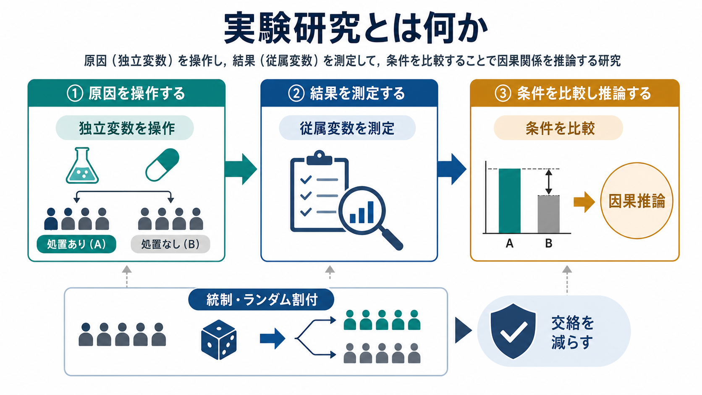
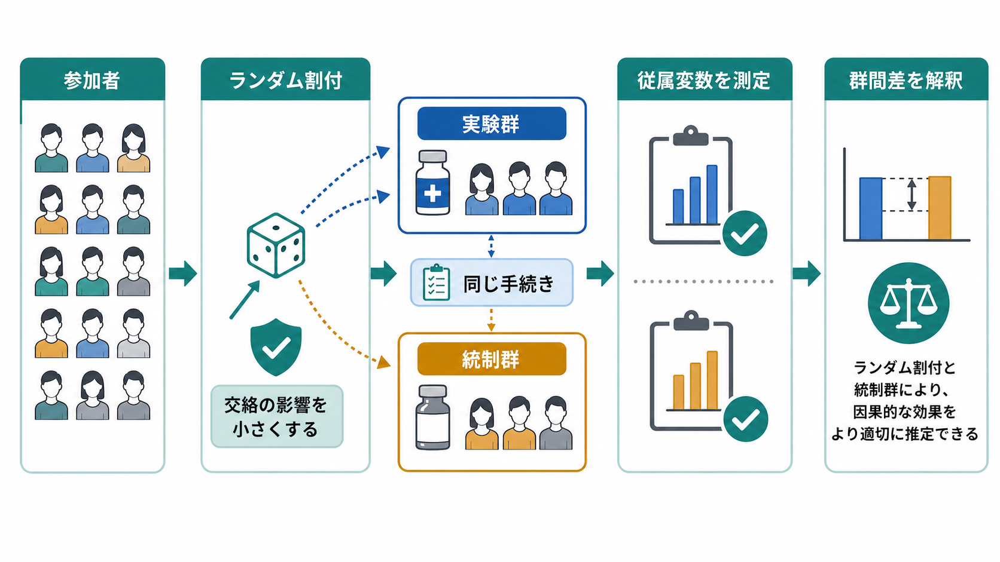

# 実験研究とは何か

## 要点

- 実験研究とは、研究者が独立変数を意図的に操作し、その操作が従属変数に与える影響を条件間で比較する研究デザインである。
- 実験研究の強みは、観察研究よりも因果関係を検討しやすい点にある。とくに、統制条件、ランダム割付、同一手続き、盲検化、事前に定めた分析計画は、交絡やバイアスを小さくするために重要である[1][2][3]。
- ただし、実験で差が出たことは「現実のあらゆる場面で同じ効果がある」ことを意味しない。内的妥当性、構成概念妥当性、外的妥当性、統計的結論の妥当性を分けて読む必要がある[3]。
- 心理学や認知科学では、刺激、課題、教示、介入、フィードバック、環境条件などを操作し、反応時間、正答率、自己報告、行動指標、生理指標などを測定する。
- 臨床研究では、介入の効果を評価するランダム化比較試験が典型例だが、教育・研究目的の知識として扱い、個別の診断や治療指示と混同しない。

## この記事で答える問い

1. 実験研究は、観察研究や調査研究と何が違うのか。
2. 独立変数、従属変数、統制条件、ランダム割付は何をしているのか。
3. 実験研究はなぜ因果推論に強いと言われるのか。
4. 実験研究にはどのような限界や誤解があるのか。
5. 心理測定、妥当性、臨床・応用研究とどのようにつながるのか。

## まず結論

実験研究は、「原因候補を操作し、その結果として何が変わるか」を見るための研究デザインである。たとえば、睡眠時間を変える、課題の難易度を変える、介入を行うか行わないかを変える、フィードバックの有無を変える、といった操作を行い、その後の記憶成績、反応時間、気分評定、症状尺度得点、行動選択などを測定する。

このとき、操作する側の変数が独立変数であり、測定される結果が従属変数である。OpenStax の心理学教材も、因果関係は実験研究デザインによって検討できるとし、統制群は偶然要因を抑えて比較の基準を与えるものとして説明している[1]。Lumen Learning の研究法教材も、独立変数の操作とは、研究者が変数の水準を体系的に変えることであり、もともと異なる人々をただ比較することとは区別されると整理している[2]。

実験研究の中心は、差を作ることではなく、「独立変数以外の違いをできるだけ小さくしたうえで差を解釈する」ことにある。そのため、統制群、ランダム割付、操作チェック、盲検化、同一手続き、脱落の把握、事前登録、透明な報告が重要になる[4][5][6]。

## 背景

心理学・認知科学・精神医学では、研究者が知りたい問いはしばしば因果的である。たとえば、「報酬予測誤差は学習を変えるのか」「注意の向け方は知覚判断を変えるのか」「心理教育は不安症状を軽減するのか」「検査のフィードバックは行動変容を促すのか」といった問いである。

観察研究や横断調査は、現実場面で変数同士の関連を調べるのに有用である。しかし、関連があるだけでは、どちらが原因なのか、第三の変数が両方に影響しているのか、測定方法の偏りが関連を作っているのかを区別しにくい。実験研究は、この問題に対して、研究者が条件を操作し、比較の構造を設計することで答えようとする。

ただし、実験研究は万能ではない。倫理的・実務的に操作できない変数がある。実験室での操作が日常生活や臨床場面にどこまで一般化できるかも別問題である。Shadish, Cook, and Campbell は、実験・準実験デザインを因果推論の方法として整理しつつ、内的妥当性だけでなく、構成概念妥当性、外的妥当性、統計的結論の妥当性を合わせて評価する必要を強調している[3]。

## 基本概念

### 独立変数

独立変数とは、研究者が操作する原因候補である。心理学実験では、刺激の種類、課題条件、教示、報酬、時間制限、社会的文脈、介入の有無などが独立変数になりうる。

重要なのは、独立変数が「研究者によって操作されている」ことである。たとえば、もともと睡眠時間が長い人と短い人を比較するだけなら、睡眠時間は参加者の属性差や生活習慣と混ざっている。これに対して、睡眠条件を割り付けて課題成績を比較するなら、実験操作として扱いやすくなる。ただし、睡眠制限のような操作には倫理的配慮が必要である。

### 従属変数

従属変数とは、独立変数の影響を受けると仮定され、研究者が測定する結果である。反応時間、正答率、選択行動、質問紙得点、生理指標、神経活動、臨床尺度得点などが含まれる。

従属変数の質は、実験の解釈を大きく左右する。測定が不安定なら、真の効果があっても検出しにくい。測定が狭すぎれば、研究者が考えている構成概念の一部しか見ていない可能性がある。この点で、実験研究は [[心理測定とは何か]]、[[信頼性とは何か]]、[[妥当性とは何か]] と切り離せない。

### 条件と統制群

実験では、独立変数の水準を条件と呼ぶ。処置あり条件と処置なし条件、報酬あり条件と報酬なし条件、高負荷条件と低負荷条件のように、比較可能な複数条件を作る。

統制群は、比較の基準である。統制群があることで、処置群の変化が介入そのものによるのか、時間経過、期待、測定への慣れ、研究参加による変化などによるのかを区別しやすくなる。臨床試験では、通常治療、待機リスト、プラセボ、別介入などが統制条件になりうるが、それぞれ解釈できる問いが異なる。

### ランダム割付

ランダム割付とは、参加者や試行を偶然の仕組みによって条件へ割り付けることである。目的は、年齢、性別、重症度、動機づけ、事前能力、未測定の背景要因などが、平均的には条件間で偏りにくくなるようにすることにある。

ランダム割付は、ランダムサンプリングとは異なる。ランダムサンプリングは母集団から誰を研究に入れるかの問題であり、ランダム割付は研究に入った人をどの条件に置くかの問題である。因果推論にとって直接重要なのは、多くの場合、条件間の比較可能性を高めるランダム割付である。

### 操作チェックと盲検化

操作チェックとは、独立変数の操作が研究者の意図どおりに参加者へ届いたかを確認する測定である。たとえば、ストレス操作をしたなら、参加者が実際にストレスを感じたかを確認する。操作チェックがなければ、効果が出なかったときに「操作が効かなかった」のか「理論が誤っていた」のかを区別しにくい。

盲検化は、参加者、実験者、評価者、分析者が条件情報を知らないようにする工夫である。心理学実験では完全な盲検化が難しい場合もあるが、評価者盲検、分析コードの事前化、条件名を伏せた分析などによって、期待や解釈の偏りを減らせる。

## 仕組み

実験研究の基本的な流れは、次のように整理できる。

1. 研究問いと仮説を定める。
2. 独立変数を操作可能な条件として定義する。
3. 従属変数を測定可能な指標として定義する。
4. 統制条件と割付方法を設計する。
5. 参加者や試行を条件へ割り付ける。
6. できるだけ同じ手続きで測定する。
7. 条件間差を推定し、交絡、測定誤差、脱落、一般化可能性を検討する。

この流れのうち、因果推論にとって特に重要なのは、操作、比較、統制である。操作によって原因候補を明確にし、比較によって結果の差を観察し、統制によって独立変数以外の説明を減らす。

統計的には、実験研究は「条件間の平均差」「効果量」「信頼区間」「ベイズ因子」「階層モデルによる推定」などを用いて効果を評価する。もっとも、p 値が有意であることは、操作が妥当だったこと、測定が妥当だったこと、現実場面に一般化できることを自動的には意味しない。統計的結論は、研究デザイン、測定、サンプル、分析計画と一緒に読む必要がある。

## 図解

図1は、実験研究の全体像を示している。上段では、独立変数を操作し、従属変数を測定し、条件を比較して因果推論へ進む流れをまとめている。下段では、統制とランダム割付が交絡を減らす役割を持つことを示している。

図2は、ランダム割付と統制群の働きを示している。参加者を偶然に実験群と統制群へ分け、両群にできるだけ同じ手続きを適用し、同じ従属変数を測定する。こうすると、群間差を独立変数の効果として解釈しやすくなる。ただし、これは「交絡が完全に消える」ことではなく、「交絡の影響を小さくする設計上の工夫」である。

## 臨床・研究との接続

臨床研究では、介入の有効性を検討するためにランダム化比較試験がよく用いられる。CONSORT 2010 は、ランダム化試験の透明な報告を促す国際的な指針であり、チェックリストと参加者フロー図を用いて、割付、介入、アウトカム、脱落、解析などを明確に報告することを求めている[4]。これは、読者が研究の方法と結果を評価できるようにするためである。

心理学では、実験研究は認知、感情、社会的判断、発達、学習、意思決定、臨床介入などの幅広い領域で使われる。たとえば、注意バイアスを変える訓練、報酬構造を変える学習課題、認知再評価の教示、社会的排斥の操作、課題負荷の操作などがある。

心理測定との接続も重要である。従属変数として質問紙尺度を使う場合、その尺度の [[内的一貫性とは何か]]、[[再検査信頼性とは何か]]、[[内容的妥当性とは何か]]、[[構成概念妥当性とは何か]]、[[基準関連妥当性とは何か]] が十分に検討されていなければ、条件間差の解釈は弱くなる。実験操作が精密でも、測定が曖昧なら、結果は曖昧になる。

また、再現性と透明性も欠かせない。National Academies の報告書は、再現性・再現可能性の問題を、研究デザイン、バイアス、測定、分析、報告の透明性と結びつけて整理している[5]。APA の量的研究報告基準も、仮説、分析、結論を明確に分け、観察研究、臨床試験、縦断研究、再現研究などの報告基準を整備している[6]。

## よくある誤解

### 誤解1: 実験研究なら必ず因果関係が証明できる

実験研究は因果推論に強いが、因果関係を自動的に証明するわけではない。操作が弱い、統制が不十分、割付が偏る、脱落が条件間で異なる、測定が妥当でない、分析が事後的に選ばれる、といった問題があれば、因果解釈は弱くなる。

### 誤解2: ランダム割付があれば交絡は完全になくなる

ランダム割付は、条件間の背景差を平均的に小さくする。だが、小規模研究では偶然の偏りが残ることがある。測定不能な要因が完全に消えるわけでもない。ランダム割付は強力な設計上の工夫だが、サンプルサイズ、実施手続き、脱落、分析方針と合わせて評価する必要がある。

### 誤解3: 実験室研究は現実に役立たない

実験室研究は、現実を丸ごと再現するためではなく、特定のメカニズムを切り出して調べるために有用である。外的妥当性の限界はあるが、操作を明確にし、測定を精密にし、理論的な関係を検証するうえで強みがある。現実場面への接続は、フィールド実験、臨床試験、縦断研究、メタ分析、実装研究などと組み合わせて検討する。

### 誤解4: 有意差が出れば実用的に重要である

統計的有意差は、効果の大きさや臨床的・教育的な重要性をそのまま示さない。効果量、信頼区間、事前に定めた主要アウトカム、利益と害、コスト、対象集団、測定の妥当性を合わせて判断する必要がある。

### 誤解5: 従属変数は何でもよい

従属変数は、理論上の構成概念をどれだけ適切に反映しているかが重要である。たとえば「不安」を測りたいとき、自己報告、回避行動、生理反応、臨床面接はそれぞれ異なる側面を反映する。どの指標を使うかは、[[妥当性とは何か]] の問題である。

## 関連ノート

既存の関連ノート:

- [[心理測定とは何か]]
- [[信頼性とは何か]]
- [[妥当性とは何か]]
- [[内的一貫性とは何か]]
- [[再検査信頼性とは何か]]
- [[内容的妥当性とは何か]]
- [[構成概念妥当性とは何か]]
- [[基準関連妥当性とは何か]]
- [[因子分析とは何か]]

今後の作成候補:

- 観察研究とは何か
- ランダム化比較試験とは何か
- 準実験研究とは何か
- 交絡とは何か
- 内的妥当性とは何か
- 外的妥当性とは何か
- 操作的定義とは何か
- 事前登録とは何か

MOC 更新候補:

- `content/00_MOC/` 配下の心理学研究法または心理測定関連 MOC に、バッチ統合時に本記事へのリンクを追加する。
- 並列作業との競合を避けるため、本記事作成時点では MOC 本体は更新しない。

## 理解チェック

1. 実験研究において、独立変数と従属変数はそれぞれ何を指すか。
2. ランダムサンプリングとランダム割付はどう違うか。
3. 統制群がない実験では、どのような解釈上の問題が生じやすいか。
4. 実験研究で有意差が出ても、外的妥当性や構成概念妥当性を検討する必要があるのはなぜか。
5. 質問紙尺度を従属変数として使うとき、信頼性と妥当性の確認が必要なのはなぜか。

## 未解決問題

- 心理学実験で用いられる人工的な課題が、日常生活や臨床場面の行動をどこまで代表しているか。
- 小規模な実験研究で、ランダム割付による条件間の均衡がどの程度達成されているか。
- 操作チェックが、操作の成否を測っているのか、操作への気づきや要求特性を測っているのか。
- 主要アウトカム、探索的アウトカム、事後分析を読者が区別できる形で報告できているか。
- 研究参加者の文化、年齢、臨床状態、教育歴などによって効果がどの程度変わるか。

## 参考文献

[1] OpenStax. (2019). *Psychology 2e*, Chapter 2 Key Terms. Rice University. https://openstax.org/books/psychology-2e/pages/2-key-terms

[2] Lumen Learning. (n.d.). *Research Methods in Psychology: 6.1 Experiment Basics*. https://courses.lumenlearning.com/suny-psychologyresearchmethods/chapter/6-1-experiment-basics/

[3] Shadish, W. R., Cook, T. D., & Campbell, D. T. (2002). *Experimental and Quasi-Experimental Designs for Generalized Causal Inference*. Houghton Mifflin. https://catalog.libraries.psu.edu/catalog/2264384

[4] Schulz, K. F., Altman, D. G., Moher, D., & CONSORT Group. (2010). CONSORT 2010 Statement: updated guidelines for reporting parallel group randomised trials. *BMC Medicine, 8*, 18. https://doi.org/10.1186/1741-7015-8-18

[5] National Academies of Sciences, Engineering, and Medicine. (2019). *Reproducibility and Replicability in Science*. The National Academies Press. https://doi.org/10.17226/25303

[6] Appelbaum, M., Cooper, H., Kline, R. B., Mayo-Wilson, E., Nezu, A. M., & Rao, S. M. (2018). Journal article reporting standards for quantitative research in psychology: The APA Publications and Communications Board task force report. *American Psychologist, 73*(1), 3-25. https://doi.org/10.1037/amp0000191
