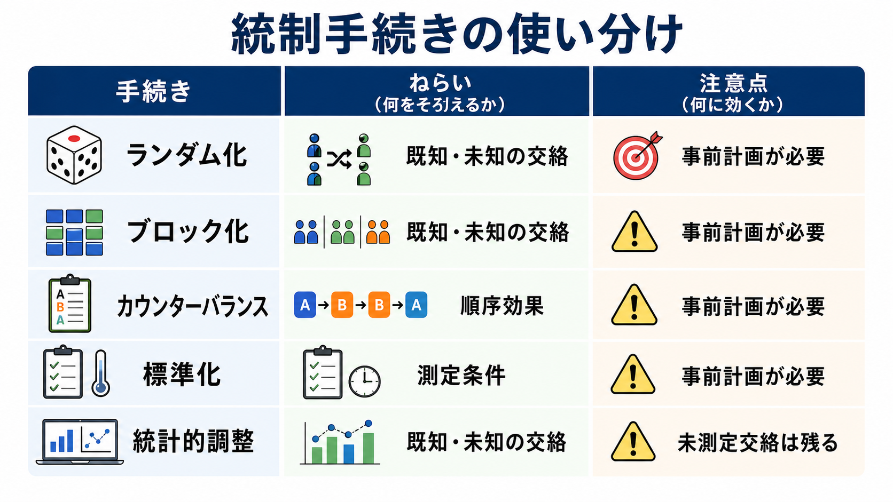
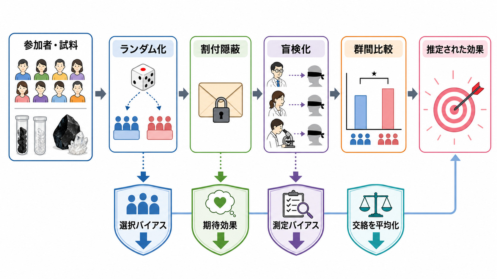
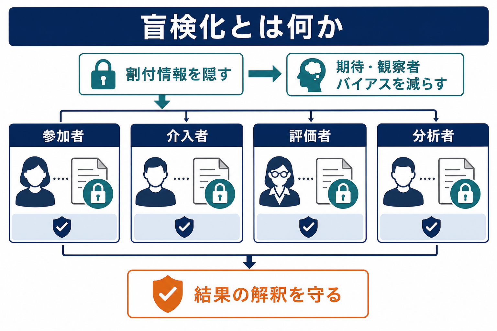

# 実験計画における統制とは何か

## 要点

- 実験計画における統制とは、独立変数の操作以外の要因が従属変数に混ざり込む可能性を減らし、観察された差を「何の効果として読むか」を明確にするための一連の手続きである。
- 統制は「すべてを同じにすること」ではない。比較に不要なばらつきを抑え、必要なばらつきはランダム化やブロック化によって扱える形にする設計上の工夫である[1][2]。
- 中核になる手続きは、ランダム化、比較条件、ブロック化、カウンターバランス、盲検化、手続きの[[標準化とは何か|標準化]]、測定の一貫性、事前計画、統計的調整である[3][4]。
- 統制が強いほど因果推論はしやすくなるが、過度の統制は現実場面への一般化を狭めることがある。内的妥当性と外的妥当性のバランスを設計段階で考える必要がある[2]。
- 統制は、研究結果の[[妥当性とは何か|妥当性]]を支える条件であり、心理学・認知科学・臨床研究では、操作、測定、参加者選抜、解析、報告の各段階で確認される。

## この記事で答える問い

1. 実験計画でいう「統制」とは何を意味するのか。
2. 交絡、バイアス、誤差、ばらつきはどのように区別できるのか。
3. ランダム化、盲検化、カウンターバランス、標準化は何を統制しているのか。
4. 統制を強めることにはどのような利点と限界があるのか。
5. 心理学研究や臨床研究では、統制をどのように読むべきか。

## まず結論

統制とは、実験で観察された差を、できるだけ操作した要因の効果として解釈できるようにする設計上の手続きである。たとえば、ある記憶訓練が成績を上げるかを調べたいとき、訓練群と比較群で年齢、事前能力、期待、測定者の態度、課題順序、測定環境が大きく異なれば、成績差を訓練の効果とは読み切れない。ここに統制が必要になる。

重要なのは、統制は「研究者が気になる変数を消す」ことではなく、「代替説明を減らす」ことである。ランダム化は既知・未知の交絡を群間で平均化し、割付隠蔽は選択バイアスを減らし、盲検化は期待や評価の偏りを減らし、カウンターバランスは順序効果を分散させる。これらはすべて、観察された差の解釈を狭く、明確にするために使われる[3][4]。

一方で、統制を強めるほど、実験室の条件は整うが、現実場面の複雑さからは離れやすい。したがって、良い実験計画とは、単に統制が多い計画ではなく、研究質問に対して必要な統制を選び、その代償を明示できる計画である[2]。

## 背景

実験計画の古典的な発想は、Fisher の農業実験におけるランダム化、反復、ブロック化の整理にさかのぼる。土壌や日照のような背景差が作物の成長に影響する場合、肥料の効果を見るには、処理の割付を偶然化し、同じ条件を反復し、似た区画をブロックとして扱う必要がある[1]。心理学実験でも構造は同じである。参加者の年齢、語彙力、睡眠、動機づけ、期待、実験者の態度、課題順序などが、操作した変数以外の差として結果に入り込む。

この問題は、臨床試験ではさらに厳密に扱われる。CONSORT 2010 は、ランダム化の方法、割付隠蔽、盲検化、解析対象、追跡脱落を透明に報告することを求めている[3]。これは報告基準であると同時に、読者が「統制がどこで効き、どこで破れているか」を判断するための情報でもある。Cochrane の Risk of Bias 2 も、ランダム化過程、介入からの逸脱、欠測、アウトカム測定、選択的報告を主要なバイアス領域として評価する[5]。

心理学では、操作の有無だけでなく、操作が意図した[[構成概念妥当性とは何か|構成概念]]を本当に変えているか、従属変数が目的の過程を測っているかも問題になる。たとえば「ストレスを操作した」と言っても、実際には時間圧、社会的評価、疲労、課題難度が同時に変わっているかもしれない。統制は、こうした代替説明を最初から設計に組み込んで減らすための方法である。

## 基本概念

### 独立変数・従属変数・交絡

独立変数は研究者が操作または比較したい要因であり、従属変数はその影響を受けると考えられる結果である。交絡とは、独立変数と従属変数の両方に関連し、操作の効果と別の要因の効果を混ぜてしまう第三の変数である。

例として、オンライン認知訓練を受けた群の記憶成績が高かったとする。しかし訓練群の方がもともと若く、教育年数が長く、練習への動機づけも高かったなら、成績差は訓練そのものではなく、年齢、教育、動機づけによる可能性がある。このとき、年齢、教育、動機づけは交絡候補になる。

### バイアスと誤差

誤差は測定値のばらつきであり、偶然誤差と系統誤差に分けられる。偶然誤差は平均すれば相殺されやすいが、系統誤差は同じ方向に結果を歪める。バイアスは、推定や解釈が一定方向にずれる過程であり、選択バイアス、測定バイアス、実験者期待効果、脱落によるバイアスなどが含まれる[5]。

統制の目的は、すべての誤差を消すことではない。偶然誤差を測定可能なばらつきとして扱い、系統的なずれをできるだけ減らし、残った限界を報告することである。

### 内的妥当性と外的妥当性

内的妥当性は、観察された差を操作の効果としてどの程度解釈できるかに関わる。外的妥当性は、その結果が別の参加者、場面、課題、時期にもどの程度一般化できるかに関わる。統制は内的妥当性を高めるが、標本や状況を狭くしすぎると外的妥当性を下げることがある[2]。

## 仕組み

### 1. ランダム化

ランダム化は、参加者、試料、試行、刺激、課題順序などを偶然的に割り付ける手続きである。適切なランダム化は、研究者や参加者の選択が群の構成に入り込むことを減らし、既知・未知の交絡が群間で平均化される可能性を高める[3][4]。

ただし、ランダム化は魔法ではない。小標本では群間差が偶然残ることがあり、脱落や介入後の対応が群によって異なれば、ランダム化後にもバイアスは生じる。したがって、ランダム化の方法、割付比、ブロック化や層別化の有無、解析方針を事前に決めて報告する必要がある[3][6]。

### 2. 比較条件

統制群や比較条件は、「何と比べて効果と言うのか」を決める。無処置群、待機群、プラセボ群、能動対照群、標準治療群、別課題群など、比較条件の選び方によって解釈は変わる。

たとえば、介入群が無処置群より改善しても、期待、接触時間、訓練量、フィードバック、研究参加への注意が違っていれば、介入の特異的効果とは限らない。能動対照群を置けば、時間や期待の一部をそろえられるが、介入成分の差は小さくなり、効果の検出は難しくなる。

### 3. ブロック化・層別化・マッチング

ブロック化は、結果に影響しそうな要因ごとに参加者や試料をまとまりに分け、その中で割り付ける手続きである。層別化は、年齢層、性別、重症度、施設などの層ごとにランダム化する方法である。マッチングは、似た参加者を組にして比較条件へ割り付ける方法である。

これらは、重要な既知交絡が群間で偏ることを減らす。ただし、どの変数で層を作るかを後から都合よく決めると、解析の自由度が増える。統制したい要因は、理論、先行研究、測定可能性に基づいて事前に決める方がよい[3][6]。

### 4. カウンターバランス

同じ参加者が複数条件を経験する被験者内計画では、順序効果、練習効果、疲労、持ち越し効果が問題になる。カウンターバランスは、条件順序を参加者間で入れ替え、順序に由来する影響を特定条件に固定しないようにする手続きである[7]。

たとえば A 条件と B 条件を比較するなら、全員が A から B に進むのではなく、A-B 順序と B-A 順序を用意する。条件が多い場合は、完全な順序入れ替えが非現実的になるため、ラテン方格や一部の順序だけを使う。持ち越し効果が強い介入では、休止期間を置くか、被験者間計画に変える必要がある[7]。

### 5. 盲検化と割付隠蔽

盲検化は、参加者、介入者、測定者、解析者が条件を知らないようにする手続きである。期待、観察、評価、解析判断の偏りを減らす。割付隠蔽は、参加者を組み入れる時点で、次にどの条件に割り付けられるかを予測できないようにする手続きである。CONSORT は、ランダム系列の生成だけでなく、割付隠蔽と盲検化を分けて報告することを求めている[3][4]。

心理学実験では完全な盲検化が難しい場合も多い。たとえば心理療法、教育介入、認知訓練では参加者や介入者が条件を知りやすい。この場合でも、アウトカム評価者や解析者を盲検化する、標準化された採点基準を使う、期待を測定して共変量として確認するなど、部分的な統制は可能である。

### 6. 標準化

標準化は、教示、刺激、測定時刻、実験室環境、課題手順、採点基準、介入者訓練をそろえる手続きである。[[標準化とは何か|標準化]]された手続きは、実験者や測定場所の違いが結果に混ざることを減らす。

ただし、標準化は「現実の多様性をすべて排除する」ことではない。研究質問が日常場面での効果を問うなら、現実に近いばらつきをあえて残し、そのばらつきを記録する方がよい場合もある。

### 7. 統計的調整

統計的調整は、共変量、層別解析、回帰モデル、混合効果モデルなどを用いて、測定済みの交絡候補を解析段階で扱う手続きである。これは有用だが、未測定交絡は調整できない。統計的調整は、設計上の統制の代替ではなく、設計で残った問題を扱う補助的手段として読むべきである。

## 図解

図1は、統制手続きの使い分けを示している。ランダム化やブロック化は群間の交絡、カウンターバランスは順序効果、標準化は測定条件、統計的調整は測定済みの共変量に主に関わる。

図2は、ランダム化、割付隠蔽、盲検化が別々の役割を持つことを示している。ランダム化は割付の偏りを減らすが、割付が予測されれば選択バイアスが生じる。盲検化は、割付後の期待、介入、評価、解析の偏りを減らす。

図3は、盲検化の対象が一種類ではないことを示している。参加者、介入者、評価者、解析者のどこを盲検化できるかによって、減らせるバイアスの種類が変わる。

## 臨床・研究との接続

心理学研究では、統制は「課題をきれいにする」ためだけでなく、[[心理測定とは何か|心理測定]]の解釈を守るためにも必要である。たとえば反応時間課題では、刺激提示のタイミング、練習試行、除外基準、反応デバイス、疲労、外れ値処理が結果に影響する。これらが群ごとに違えば、認知過程の差ではなく測定条件の差を読んでしまう。

臨床研究では、統制は個別診断や治療指示を直接決めるものではなく、介入や評価法についての研究上の推論を支える。RCT であっても、脱落、盲検化の破れ、選択的報告、現実場面との違いがあれば、結果の解釈には限界がある[5]。教育・研究目的で読む場合は、「この研究は何を統制し、何を統制できなかったのか」を確認することが重要である。

また、統制は再現可能性とも関わる。APA の量的研究報告基準は、仮説、サンプル、測定、デザイン、解析、除外、探索的分析を透明に報告することを重視している[6]。統制手続きが報告されなければ、読者は結果の強さを評価できず、他の研究者も再現や拡張を行いにくい。

## よくある誤解

### 誤解1: 統制とは、すべての条件を完全に同じにすることである

完全に同じ条件を作ることはほとんど不可能であり、研究質問によっては望ましくもない。統制とは、比較にとって問題になる差を減らし、残る差を扱えるようにすることである。

### 誤解2: ランダム化すれば交絡は消える

ランダム化は交絡を平均化する可能性を高めるが、小標本、脱落、介入後の逸脱、測定バイアス、選択的報告までは自動的に解決しない[4][5]。

### 誤解3: 統計的調整をすれば設計上の統制は不要である

統計的調整は測定済みの変数にしか効かない。未測定交絡、条件の期待差、測定者バイアス、順序効果は、解析だけでは十分に扱えないことが多い。

### 誤解4: 盲検化できない研究は価値がない

盲検化できない研究でも、評価者盲検化、標準化された測定、事前登録、能動対照、期待の測定、感度分析などで推論を強められる。重要なのは、盲検化できない部分を隠さず、どのバイアスが残るかを明示することである。

### 誤解5: 統制を増やすほど良い研究になる

統制を増やすほど内的妥当性は高まりやすいが、課題が人工的になり、参加者や状況の幅が狭くなることがある。研究質問が実験室内の機構を問うのか、現実場面の効果を問うのかで、適切な統制の強さは変わる。

## 関連ノート

既存ノート:

- [[MOC｜研究方法]]
- [[MOC｜因果推論]]
- [[MOC｜認知科学・心理学]]
- [[標準化とは何か]]
- [[妥当性とは何か]]
- [[構成概念妥当性とは何か]]
- [[心理測定とは何か]]

関連ノート候補:

- 交絡とは何か
- 内的妥当性とは何か
- ランダム化とは何か
- 盲検化とは何か
- カウンターバランスとは何か
- 実験者効果とは何か
- プラセボ対照とは何か
- 統計的調整とは何か

MOC 更新候補:

- `content/00_MOC/MOC｜研究方法.md` に「実験計画・統制・バイアス」関連として追加。
- `content/00_MOC/MOC｜因果推論.md` に「実験による因果推論の基礎」として追加。
- `content/00_MOC/MOC｜認知科学・心理学.md` に「心理学研究法」関連として追加。

## 理解チェック

1. 統制が減らそうとしている「代替説明」とは何か。
2. ランダム化、割付隠蔽、盲検化は、それぞれどの段階のバイアスを減らすか。
3. 被験者内計画でカウンターバランスが必要になる理由を説明できるか。
4. 標準化と外的妥当性が緊張関係になる例を1つ挙げられるか。
5. 統計的調整では解決しにくい交絡やバイアスを説明できるか。

## 参考文献

[1] Fisher, R. A. (1935). *The Design of Experiments*. Oliver & Boyd. https://archive.org/details/in.ernet.dli.2015.502684

[2] Shadish, W. R., Cook, T. D., & Campbell, D. T. (2002). *Experimental and Quasi-Experimental Designs for Generalized Causal Inference*. Houghton Mifflin. https://psycnet.apa.org/record/2001-16445-000

[3] Schulz, K. F., Altman, D. G., Moher, D., & CONSORT Group. (2010). CONSORT 2010 Statement: updated guidelines for reporting parallel group randomised trials. *BMJ, 340*, c332. https://doi.org/10.1136/bmj.c332

[4] Moher, D., Hopewell, S., Schulz, K. F., Montori, V., Gøtzsche, P. C., Devereaux, P. J., Elbourne, D., Egger, M., & Altman, D. G. (2010). CONSORT 2010 Explanation and Elaboration: updated guidelines for reporting parallel group randomised trials. *BMJ, 340*, c869. https://doi.org/10.1136/bmj.c869

[5] Cochrane Methods. (2025). *Risk of Bias 2 (RoB 2) tool*. https://methods.cochrane.org/risk-bias-2

[6] Appelbaum, M., Cooper, H., Kline, R. B., Mayo-Wilson, E., Nezu, A. M., & Rao, S. M. (2018). Journal article reporting standards for quantitative research in psychology: The APA Publications and Communications Board task force report. *American Psychologist, 73*(1), 3-25. https://doi.org/10.1037/amp0000191

[7] Pandis, N., Chung, B., Scherer, R. W., Elbourne, D., & Altman, D. G. (2017). CONSORT 2010 statement: extension checklist for reporting within person randomised trials. *BMJ, 357*, j2835. https://doi.org/10.1136/bmj.j2835

## 未解決問題

- 心理学実験で、期待効果をどこまで測定・統制すべきか。
- 実験室統制と生態学的妥当性の最適なバランスを、研究目的ごとにどう判断するか。
- オンライン実験で、環境差、デバイス差、注意低下をどの程度統制できるか。
- AI を用いた採点・評価で、評価者盲検化とアルゴリズムバイアスをどう両立させるか。
