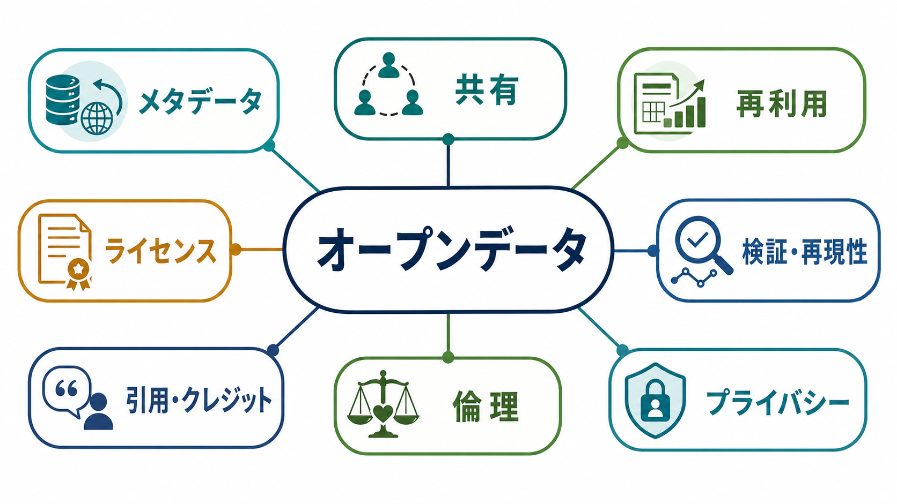
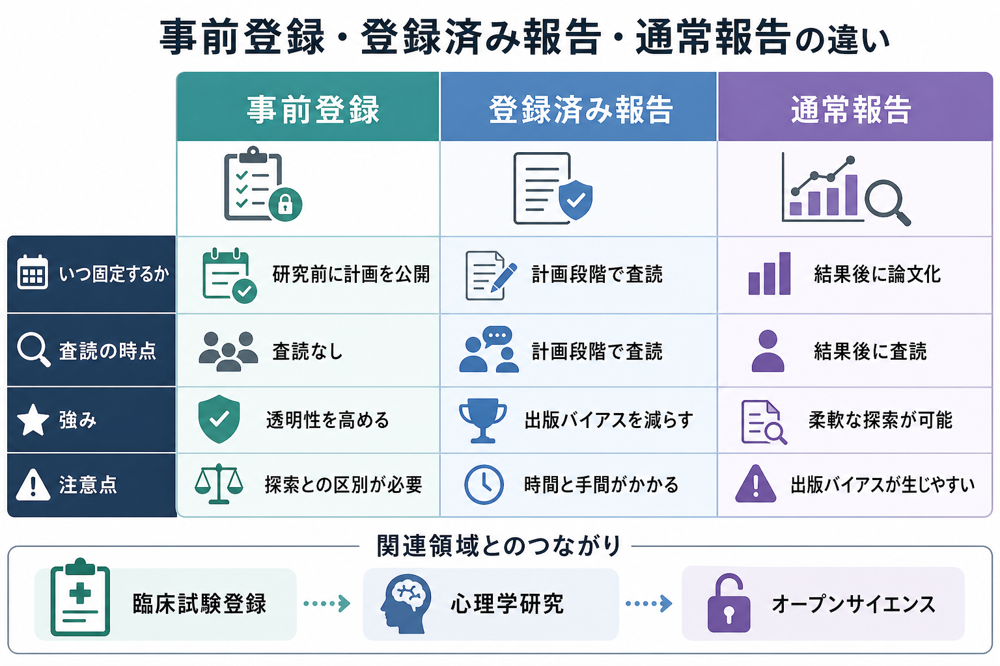

# 心理学の再現性危機とは何か

## 要点

- 心理学の再現性危機とは、過去に有意とされた研究結果が、独立した再現研究で同じ方向・同じ大きさで確認されにくい問題を指す。
- 2015年の大規模再現プロジェクトでは、100件の心理学研究のうち、再現研究で統計的に有意だったものは約36%にとどまった[1]。
- 問題の中心は「心理学が信用できない」という単純な話ではなく、小さいサンプル、研究者自由度、出版バイアス、効果量の過大評価が重なった研究生態系にある[2][3]。
- 改革の柱は、事前登録、データ・材料・コード共有、Registered Reports、再現研究の評価、十分な検出力をもつ研究設計である[4][5]。
- [[社会心理学とは何か]]や[[認知バイアスとは何か]]のような領域知識も、単一研究ではなく、累積的証拠と限界を合わせて読む必要がある。

## この記事で答える問い

1. 心理学の再現性危機とは何か。
2. なぜ「有意な結果」が後から再現されにくくなるのか。
3. オープンサイエンス改革は何を変えようとしているのか。
4. 臨床・教育・研究で、この問題をどう読めばよいのか。

## まず結論

心理学の再現性危機は、個々の研究者の不正だけで説明できる問題ではない。むしろ、探索的に多くの解析を試し、うまくいった結果だけを論文にし、陽性結果を高く評価する仕組みが、偶然の揺らぎを「発見」に見せやすくしてきた問題である[2][3]。

重要なのは、再現性危機が心理学の終わりではなく、心理学がより透明で累積的な科学へ移行する契機になったことである。事前登録は「何を先に決めたか」を明確にし、オープンデータやオープンマテリアルは第三者の検証を可能にし、Registered Reports は結果の見栄えより研究計画の質を評価しやすくする[4][5]。

## 背景

心理学では、長く「p < .05 の有意差」が新しい知見の目印として強く扱われてきた。もちろん統計的検定そのものが悪いわけではない。しかし、仮説、除外基準、測定項目、従属変数、共変量、サンプルサイズを研究後に柔軟に選べると、偶然に有意になった結果を本当の効果のように提示しやすくなる[2]。

この問題は心理学だけの特殊事情ではない。Ioannidis は、検出力が低い研究、柔軟な解析、多数の仮説、出版バイアスが重なると、発表された研究知見のかなりが誤りになりうると論じた[3]。心理学の再現性危機は、この一般的な科学方法論上の問題が、実験心理学・社会心理学・臨床心理学などで可視化された事例といえる。

大きな転機になったのが Open Science Collaboration による大規模再現研究である。元研究100件を対象に、可能な限り元研究に近い手続きで再現を試みたところ、再現研究の効果量は元研究より小さく、統計的有意性も大きく低下した[1]。この結果は「全部が誤り」という意味ではなく、発表済み知見の強さを過大に読んでいた可能性を示した。

## 基本概念

### 再現性と再現研究

再現性にはいくつかの意味がある。狭い意味では、同じデータと同じ解析コードから同じ結果が得られることを指す。心理学で問題になりやすいのは、独立した新しいデータで、同じ仮説や効果が確認されるかという再現研究である。

再現研究で完全に同じ数値が出る必要はない。対象者、文化、測定環境、時代、手続きの違いにより、効果量は揺らぐ。問題は、その揺らぎを考慮しても、元研究で主張された効果がどの程度安定しているかである。

### 研究者自由度

研究者自由度とは、研究者が悪意なく選べる設計・解析・報告上の分岐のことである。たとえば、どの参加者を除外するか、どの従属変数を主分析にするか、どの共変量を入れるか、いつデータ収集を止めるか、といった選択が含まれる。

Simmons らは、このような柔軟性があると、実際には効果がなくても有意な結果を得やすくなることを示した[2]。この問題は p-hacking と呼ばれることがある。また、結果を見た後で仮説を最初から予測していたように書く HARKing も、探索的発見と確認的検証の区別を曖昧にする。

### 出版バイアス

出版バイアスとは、有意で目新しい結果が、非有意な結果や再現失敗よりも発表されやすい偏りである。雑誌、査読者、研究者、資金配分、メディアの関心が陽性結果を強く評価すると、文献全体が効果を過大に見せる。

このため、論文になっている研究だけを読むと、実際には報告されなかった試行、失敗した解析、未発表の再現研究が見えにくくなる。[[メタ認知とは何か]]で自分の判断過程を点検するのと同じように、研究を読むときも「何が観察され、何が観察されていないのか」を意識する必要がある。

## 仕組み

再現されにくい知見が生まれる典型的な流れは、次のように整理できる。

| 段階 | 起きやすいこと | 再現性への影響 |
|---|---|---|
| 研究設計 | サンプルが小さい、主要アウトカムが曖昧 | 真の効果と偶然の揺らぎを区別しにくい |
| 解析 | 複数の除外基準、共変量、下位尺度を試す | 有意な結果が偶然に見つかりやすい |
| 論文化 | 有意な結果だけを物語化する | 探索と確認の区別が曖昧になる |
| 出版 | 目新しい陽性結果が採択されやすい | 文献全体が効果を過大評価する |
| 再現研究 | 大きいサンプルで同じ効果を検証する | 効果量が小さくなり、非有意になることがある |

ただし、再現失敗は常に元研究の誤りを意味しない。元研究と再現研究で、対象者、文化、刺激、手続き、測定の信頼性が違えば、理論上の境界条件が見えている可能性もある。Many Labs 2 は、複数の心理学効果を多数のサンプルと設定で検討し、効果によって再現性や文脈依存性が大きく異なることを示した[6]。

したがって、再現性危機の教訓は「有名研究を信じるな」ではない。より正確には、効果の存在、効果量、境界条件、測定の妥当性、解析の透明性を分けて評価する必要がある、ということである。

## 図解

上の図は、事前登録、Registered Reports、通常報告の違いを整理したものである。事前登録は、研究開始前に仮説、サンプルサイズ、除外基準、主要アウトカム、解析計画を記録する。Registered Reports はさらに一歩進み、結果が出る前に研究計画を査読し、計画が妥当なら結果の方向にかかわらず掲載を約束する仕組みである[5]。

オープンサイエンス改革は、研究者の裁量をゼロにするものではない。探索的研究は新しい仮説を生むために必要である。問題は、探索的に見つけた結果を確認済みの予測として提示することである。改革の目的は、探索と確認を区別し、第三者が検証できる形で研究記録を残すことにある。

## 臨床・研究との接続

臨床心理学や精神医学研究では、再現性の問題は特に重要である。小さいサンプルで見つかった症状差、尺度得点、脳画像指標、介入効果を、そのまま個別診断や治療選択に使うことはできない。研究上の群差は、測定誤差、選択バイアス、併存症、薬物、文化差、解析選択の影響を受ける。

この点は[[脳画像研究の再現性問題とは何か]]ともつながる。心理学研究でも脳画像研究でも、個人レベルの予測や臨床応用に進むには、大規模サンプル、外部検証、事前登録、透明な解析、失敗した結果を含む報告が必要になる。

教育・支援の場でも、単一の有名研究をそのまま実践原則にするのは危うい。たとえば、動機づけ、説得、意思決定、[[衝動性とは何か|衝動性]]に関する知見は有用だが、効果は対象者、課題、文脈、測定法に依存する。実践では、複数研究の蓄積、効果量、再現性、介入コスト、倫理的リスクを合わせて判断する必要がある。

## よくある誤解

### 心理学は科学ではない、という意味である

違う。再現性危機は、心理学が科学ではないことを示したのではなく、心理学が自分の方法を検査し、改善する科学的プロセスを進めていることを示している。むしろ、再現研究、事前登録、オープンデータの広がりは、心理学の研究基盤を強くする動きである[4][7]。

### 再現されなかった研究はすべて不正である

違う。不正は別問題として厳しく扱う必要があるが、再現されにくさの多くは、低検出力、偶然、測定の不安定さ、柔軟な解析、出版バイアスで説明できる。悪意がなくても、研究環境が陽性結果を強く報酬づけると、文献は偏る[2][3]。

### 事前登録すれば探索的研究はできない

違う。事前登録は探索を禁止するものではない。事前に計画した確認的分析と、後から見つけた探索的分析を区別するための道具である。探索は仮説生成に重要だが、その仮説は独立データで確認する必要がある[5]。

### オープンデータは何でも公開すればよい

違う。参加者のプライバシー、同意、匿名化、再識別リスク、臨床情報の機微性を考える必要がある。共有できないデータでは、解析コード、変数定義、合成データ、アクセス制限付きリポジトリなど、検証可能性と倫理を両立する方法を検討する。

## 関連ノート

- [[社会心理学とは何か]]
- [[認知バイアスとは何か]]
- [[メタ認知とは何か]]
- [[衝動性とは何か]]
- [[脳画像研究の再現性問題とは何か]]

MOC更新候補: `content/00_MOC/MOC｜研究方法.md`, `content/00_MOC/MOC｜認知科学・心理学.md`

## 理解チェック

1. 再現研究で元研究と同じ結果が出ないとき、元研究の不正以外にどのような理由が考えられるか。
2. 研究者自由度、p-hacking、HARKing は、それぞれどの段階で問題になりやすいか。
3. 事前登録と Registered Reports は、出版バイアスにどう対抗するか。
4. 臨床・教育の実践で、単一研究より累積的証拠を重視すべき理由は何か。

## 参考文献

[1] Open Science Collaboration. (2015). Estimating the reproducibility of psychological science. *Science, 349*(6251), aac4716. https://doi.org/10.1126/science.aac4716

[2] Simmons, J. P., Nelson, L. D., & Simonsohn, U. (2011). False-positive psychology: Undisclosed flexibility in data collection and analysis allows presenting anything as significant. *Psychological Science, 22*(11), 1359-1366. https://doi.org/10.1177/0956797611417632

[3] Ioannidis, J. P. A. (2005). Why most published research findings are false. *PLOS Medicine, 2*(8), e124. https://doi.org/10.1371/journal.pmed.0020124

[4] Munafò, M. R., Nosek, B. A., Bishop, D. V. M., Button, K. S., Chambers, C. D., du Sert, N. P., Simonsohn, U., Wagenmakers, E.-J., Ware, J. J., & Ioannidis, J. P. A. (2017). A manifesto for reproducible science. *Nature Human Behaviour, 1*, 0021. https://doi.org/10.1038/s41562-016-0021

[5] Nosek, B. A., Ebersole, C. R., DeHaven, A. C., & Mellor, D. T. (2018). The preregistration revolution. *Proceedings of the National Academy of Sciences, 115*(11), 2600-2606. https://doi.org/10.1073/pnas.1708274114

[6] Klein, R. A., Vianello, M., Hasselman, F., Adams, B. G., Adams, R. B., Alper, S., Aveyard, M., Axt, J. R., Babalola, M. T., Bahník, Š., et al. (2018). Many Labs 2: Investigating variation in replicability across samples and settings. *Advances in Methods and Practices in Psychological Science, 1*(4), 443-490. https://doi.org/10.1177/2515245918810225

[7] Kidwell, M. C., Lazarević, L. B., Baranski, E., Hardwicke, T. E., Piechowski, S., Falkenberg, L.-S., Kennett, C., Slowik, A., Sonnleitner, C., Hess-Holden, C., et al. (2016). Badges to acknowledge open practices: A simple, low-cost, effective method for increasing transparency. *PLOS Biology, 14*(5), e1002456. https://doi.org/10.1371/journal.pbio.1002456

[8] Chambers, C. D. (2013). Registered Reports: A new publishing initiative at Cortex. *Cortex, 49*(3), 609-610. https://doi.org/10.1016/j.cortex.2012.12.016

## 未解決問題

- 再現研究で効果が弱まったとき、元研究の偽陽性、文脈依存性、測定差をどのように切り分けるか。
- 心理学の多様な対象者・文化・言語を含めた再現研究を、どのように持続的に支援するか。
- オープンデータと参加者プライバシーを両立する具体的な標準を、臨床心理学研究でどう整えるか。
- 研究者評価を、陽性結果の数ではなく、透明性、再利用可能性、再現研究への貢献にどう移すか。
