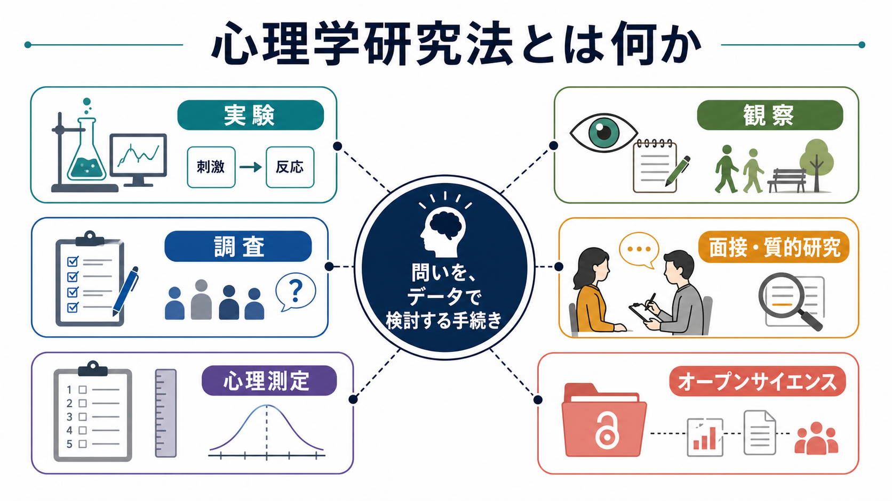
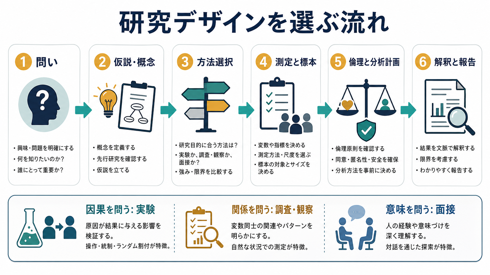
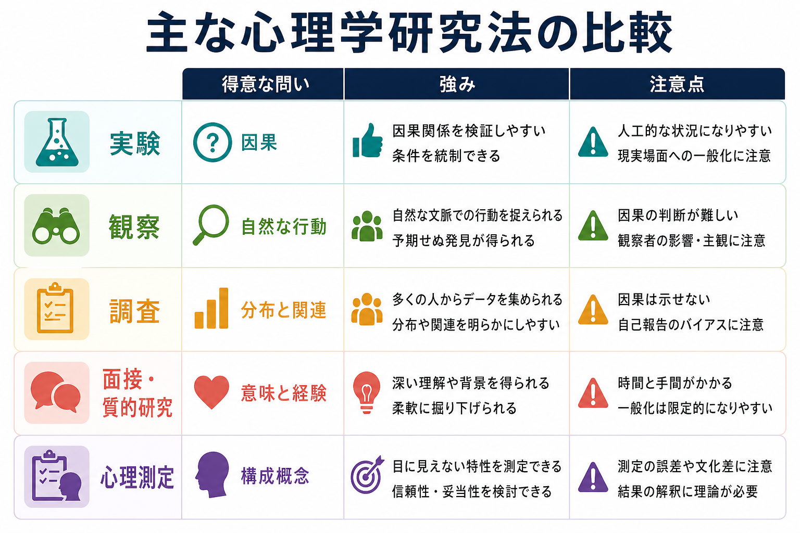

# 心理学研究法とは何か

## 要点

- 心理学研究法とは、心・行動・経験についての問いを、観察可能なデータと明示的な手続きで検討する方法の総称である。
- 実験は因果関係の検討に強く、観察・調査は自然な行動や分布・関連の把握に強く、面接・質的研究は経験の意味づけや文脈理解に強い。
- どの方法でも、概念の操作的定義、測定の[[信頼性とは何か]]と[[妥当性とは何か]]、サンプリング、倫理、分析計画、報告の透明性が結果の解釈を左右する。
- 研究法は「正解の方法」を選ぶ作業ではなく、研究の問い、対象、制約、倫理、一般化可能性に応じて、何が言えて何が言えないかを設計する作業である。

## この記事で答える問い

1. 心理学研究法とは何をするための手続きか。
2. 実験・観察・調査・面接・心理測定は、それぞれ何に向いているのか。
3. 研究デザインを選ぶとき、どのような順序で考えるべきか。
4. 心理学研究を読むとき、どこに注意すればよいのか。

## まず結論

心理学研究法は、「人の内面を直接のぞく技術」ではない。むしろ、直接は見えにくい注意、記憶、感情、態度、動機づけ、発達、対人行動などを、課題成績、反応時間、質問紙、行動観察、発話、面接記録、生理指標などに変換し、そこから慎重に推論するための手続きである。

そのため、研究法を理解するうえで最も重要なのは、「どの方法が優れているか」ではなく、「その問いに対して、その方法でどこまで言えるか」を見極めることである。たとえば、ランダム割付を伴う実験は条件を統制しやすく因果推論に向くが、人工的な状況になりやすい。調査は多くの人の分布や関連を把握しやすいが、自己報告バイアスや交絡の影響を受ける。面接は経験の意味や文脈を深く理解できるが、一般化の範囲を明示する必要がある。

## 背景

心理学は、自然科学・社会科学・人文学にまたがる特徴をもつ。実験心理学や認知科学は、刺激、課題、反応、誤差を統制して心的過程を推定する。一方、発達心理学、臨床心理学、社会心理学、文化心理学では、家庭、学校、職場、地域、臨床場面など、文脈の中で生じる行動や経験が重要になる。したがって、心理学研究では単一の標準方法だけでなく、量的研究、質的研究、混合研究法が使い分けられる。

APA の量的研究報告基準は、仮説、方法、分析、結論を一次・二次・探索的なものに分けて明示すること、観察研究・臨床試験・縦断研究・再現研究などのモジュールを整えることを重視している[1]。また、質的研究と混合研究法についても、研究者の立場、サンプリング、データ収集、分析、解釈の透明性が求められる[2]。つまり、心理学研究法とは、データを集める技術だけでなく、読者が研究の強みと限界を評価できるように報告する技術でもある。

## 基本概念

### 研究の問い

研究法の選択は、まず問いの型で大きく変わる。

| 問いの型 | 例 | 向きやすい方法 |
|---|---|---|
| 因果を問う | 睡眠不足は注意課題成績を低下させるか | 実験、介入研究、準実験 |
| 関連を問う | 孤独感と抑うつ症状は関連するか | 調査、観察研究、縦断研究 |
| 分布を問う | ある集団で不安症状はどの程度みられるか | 横断調査、疫学的調査 |
| 過程を問う | 子どもの自己制御はどのように変化するか | 縦断研究、観察、発達課題 |
| 意味を問う | 当事者は回復をどのように経験しているか | 面接、質的研究 |
| 測定を問う | この尺度は何を測っているのか | [[心理測定とは何か]]、[[心理尺度はどのように作られるのか]] |

### 操作的定義

心理学の概念は、そのままでは測れないことが多い。たとえば「注意」を測るには、反応時間、正答率、眼球運動、主観評定など、観察可能な指標に落とし込む必要がある。この落とし込みを操作的定義という。操作的定義は便利だが、指標が概念全体を代表しているとは限らないため、[[構成概念妥当性とは何か]]の検討が不可欠になる。

### 信頼性と妥当性

測定が不安定であれば、研究デザインが良くても解釈は揺らぐ。[[信頼性とは何か]]は、測定がどの程度一貫しているかに関わる。[[妥当性とは何か]]は、その得点や指標を目的に照らしてどのように解釈できるかに関わる。心理尺度では、[[内的一貫性とは何か]]、[[再検査信頼性とは何か]]、[[内容的妥当性とは何か]]、[[基準関連妥当性とは何か]]、[[因子分析とは何か]]などが重要な入口になる。

## 仕組み

心理学研究は、典型的には次の流れで組み立てられる。

1. 問いを明確にする。
2. 先行研究に基づいて仮説や探索的目的を定める。
3. 実験、観察、調査、面接、心理測定などから方法を選ぶ。
4. 変数、指標、対象集団、標本サイズ、除外基準を定める。
5. 倫理審査、同意、匿名性、安全性、分析計画を整える。
6. 結果を、方法上の制約とともに報告する。

ランダム化比較試験や実験研究では、CONSORT のような報告基準が、割付、介入、アウトカム、脱落、解析方法を明示することを求める[3]。観察研究では、STROBE が、対象者の選定、変数、バイアス、研究サイズ、統計的方法、一般化可能性を報告することを求める[4]。面接やフォーカスグループでは、COREQ が、研究チームと反省性、研究デザイン、分析と報告を含む 32 項目のチェックリストを示している[5]。

## 図解

### 実験

実験では、研究者が独立変数を操作し、従属変数の変化を測定する。条件を統制し、可能ならランダム割付を行うことで、原因と結果の関係を検討しやすくなる。たとえば、学習条件を変えて記憶課題成績を比較する研究では、条件差が成績差にどの程度関係するかを調べる。

ただし、実験は現実場面を単純化する。実験室で得られた結果が、学校、職場、家庭、臨床場面にも当てはまるかは別問題である。したがって、内的妥当性と外的妥当性のバランスを考える必要がある。

### 観察

観察研究は、自然な行動や相互作用を記録する方法である。幼児の遊び、教師と生徒のやりとり、治療場面の会話、オンライン行動などを、あらかじめ決めたコード体系で記録する場合もあれば、探索的にフィールドノートを作る場合もある。

観察の強みは、自己報告では捉えにくい行動を見られることである。一方、観察者の影響、コード化の主観性、場面依存性、プライバシーへの配慮が課題になる。観察データを量的に扱う場合は評定者間信頼性が、質的に扱う場合は分析過程の透明性が重要になる。

### 調査

調査は、質問紙、オンライン調査、面接式調査などで、多数の人からデータを集める方法である。態度、症状、生活習慣、パーソナリティ、社会的支援などの分布や関連を把握しやすい。[[社会心理学とは何か]]や健康心理学では、集団差や相関を調べるためによく使われる。

調査から因果を断定するのは難しい。自己報告バイアス、サンプリングバイアス、交絡、測定の文化差、同時点測定の限界がある。縦断調査にすると時間的順序は見やすくなるが、それでも未測定交絡や脱落の問題は残る。

### 面接・質的研究

面接や質的研究は、参加者が自分の経験をどのように意味づけているかを理解する方法である。半構造化面接、フォーカスグループ、語りの分析、テーマ分析、グラウンデッド・セオリーなどが含まれる。臨床、発達、文化、障害、回復、ケアの経験など、単純な尺度では捉えにくい現象に向いている。

質的研究は「主観的だから弱い」のではない。むしろ、研究者の立場、問い、サンプリング、発話データ、コード化、テーマ生成、反証例、引用の提示を明示することで、どのような解釈がどのデータから導かれたのかを読者が評価できるようにする[2][5]。

### 心理測定

心理測定は、目に見えない構成概念を、質問項目、課題、行動指標などから数値化する方法である。心理尺度を作るときは、項目作成、予備調査、因子構造、信頼性、妥当性、標準化、カットオフ、文化差を検討する。心理測定は、研究だけでなく、[[認知機能検査は何を測っているのか]]のような評価場面にも関わる。

ただし、得点は人そのものではない。得点は、特定の測定条件、対象集団、目的、解釈規則のもとで意味をもつ。医療・臨床に近い文脈では、教育・研究上の知見と個別診断や治療指示を混同しないことが重要である。

## 臨床・研究との接続

臨床心理学や精神医学研究では、研究法の選択が支援の理解に直結する。症状尺度の得点は重症度や変化を追う助けになるが、本人の生活文脈や価値観までは十分に表せない。面接は文脈理解に役立つが、介入の平均的効果を示すには別のデザインが必要になる。したがって、臨床研究では、量的指標と質的理解を組み合わせることが多い。

また、心理学研究は人を対象にするため、倫理が研究デザインの外側にある付録ではない。Belmont Report は、人を対象とする研究の基本原則として、人格の尊重、善行、公正を示している[6]。これは、インフォームド・コンセント、リスクと便益の評価、対象者選定の公平性に関わる。心理学研究では、匿名性、心理的負担、欺瞞を用いる場合の事後説明、脆弱な集団への配慮も重要になる。

再現性も重要である。Open Science Collaboration による心理学研究の大規模再現プロジェクトは、再現可能性を実証的に調べる必要性を示した[7]。事前登録は、探索的分析と確認的検証を区別し、後から見つけたパターンを事前仮説のように扱うリスクを下げる方法として位置づけられる[8]。

## よくある誤解

### 「実験なら必ず因果がわかる」

実験は因果推論に強いが、操作、割付、盲検化、脱落、測定、分析、外的妥当性に問題があれば、因果解釈は弱くなる。実験というラベルだけでなく、どの条件がどのように統制されたかを見る必要がある。

### 「相関研究は価値が低い」

相関や観察研究は、因果を断定しにくいが、自然な現象の発見、リスク要因の探索、仮説生成、介入できない問題の検討に重要である。縦断研究や統計的調整を組み合わせれば、時間的順序や代替説明を検討しやすくなる。

### 「質的研究は感想の集まりである」

質的研究は、単なる感想の列挙ではない。研究者の立場、データ収集、コード化、テーマ生成、反証例、参加者の語りの提示を通して、解釈の筋道を示す研究法である[5]。

### 「尺度得点は心の状態そのものを表す」

尺度得点は、構成概念の一側面を、特定の項目と採点規則で表した指標である。[[心理測定とは何か]]で扱うように、得点の意味は信頼性・妥当性・標準化・利用目的に依存する。

## 関連ノート

- [[心理測定とは何か]]
- [[心理尺度はどのように作られるのか]]
- [[信頼性とは何か]]
- [[妥当性とは何か]]
- [[構成概念妥当性とは何か]]
- [[因子分析とは何か]]
- [[社会心理学とは何か]]
- [[観察学習とは何か]]
- [[モチベーション面接は行動変容をどう支えるのか]]

MOC 更新候補: `content/00_MOC/MOC｜認知科学・心理学.md`、`content/00_MOC/MOC｜研究方法.md`。並列ジョブとの衝突を避けるため、本記事では MOC 本体は更新しない。

## 理解チェック

1. 因果関係を検討したいとき、実験が有利になる理由は何か。
2. 横断調査から因果を断定しにくい理由は何か。
3. 面接研究で、研究者の立場や分析過程を明示する必要があるのはなぜか。
4. 心理尺度の得点を解釈するとき、信頼性と妥当性はそれぞれ何を支えるか。
5. 事前登録は、探索的研究を禁止するものではなく、何を区別するためのものか。

## 限界と未解決問題

心理学研究法は、対象とする人間の多様性に常に制約される。大学生サンプル、オンライン調査、特定文化圏の尺度、短期実験、出版バイアスに依存すると、知見の一般化可能性は狭くなる。今後の課題は、再現研究、多施設研究、縦断研究、オープンデータ、事前登録、質的データの透明な報告、文化的妥当性の検討を組み合わせ、単一研究の結果を過大評価しない知識体系を作ることである。

## 参考文献

[1] Appelbaum, M., Cooper, H., Kline, R. B., Mayo-Wilson, E., Nezu, A. M., & Rao, S. M. (2018). Journal article reporting standards for quantitative research in psychology: The APA Publications and Communications Board task force report. *American Psychologist, 73*(1), 3-25. https://doi.org/10.1037/amp0000191

[2] Levitt, H. M., Bamberg, M., Creswell, J. W., Frost, D. M., Josselson, R., & Suarez-Orozco, C. (2018). Journal article reporting standards for qualitative primary, qualitative meta-analytic, and mixed methods research in psychology. *American Psychologist, 73*(1), 26-46. https://doi.org/10.1037/amp0000151

[3] Schulz, K. F., Altman, D. G., Moher, D., & CONSORT Group. (2010). CONSORT 2010 Statement: Updated guidelines for reporting parallel group randomised trials. *BMC Medicine, 8*, 18. https://doi.org/10.1186/1741-7015-8-18

[4] von Elm, E., Altman, D. G., Egger, M., Pocock, S. J., Gotzsche, P. C., Vandenbroucke, J. P., & STROBE Initiative. (2007). The Strengthening the Reporting of Observational Studies in Epidemiology (STROBE) Statement: Guidelines for reporting observational studies. *PLoS Medicine, 4*(10), e296. https://doi.org/10.1371/journal.pmed.0040296

[5] Tong, A., Sainsbury, P., & Craig, J. (2007). Consolidated criteria for reporting qualitative research (COREQ): A 32-item checklist for interviews and focus groups. *International Journal for Quality in Health Care, 19*(6), 349-357. https://doi.org/10.1093/intqhc/mzm042

[6] National Commission for the Protection of Human Subjects of Biomedical and Behavioral Research. (1979). *The Belmont Report: Ethical principles and guidelines for the protection of human subjects of research*. U.S. Department of Health and Human Services. https://www.hhs.gov/ohrp/regulations-and-policy/belmont-report/index.html

[7] Open Science Collaboration. (2015). Estimating the reproducibility of psychological science. *Science, 349*(6251), aac4716. https://doi.org/10.1126/science.aac4716

[8] Nosek, B. A., Ebersole, C. R., DeHaven, A. C., & Mellor, D. T. (2018). The preregistration revolution. *Proceedings of the National Academy of Sciences, 115*(11), 2600-2606. https://doi.org/10.1073/pnas.1708274114
