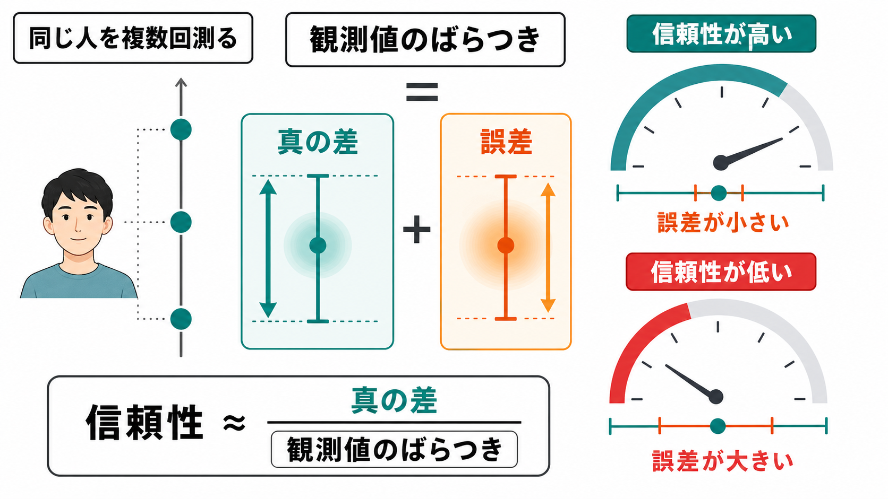
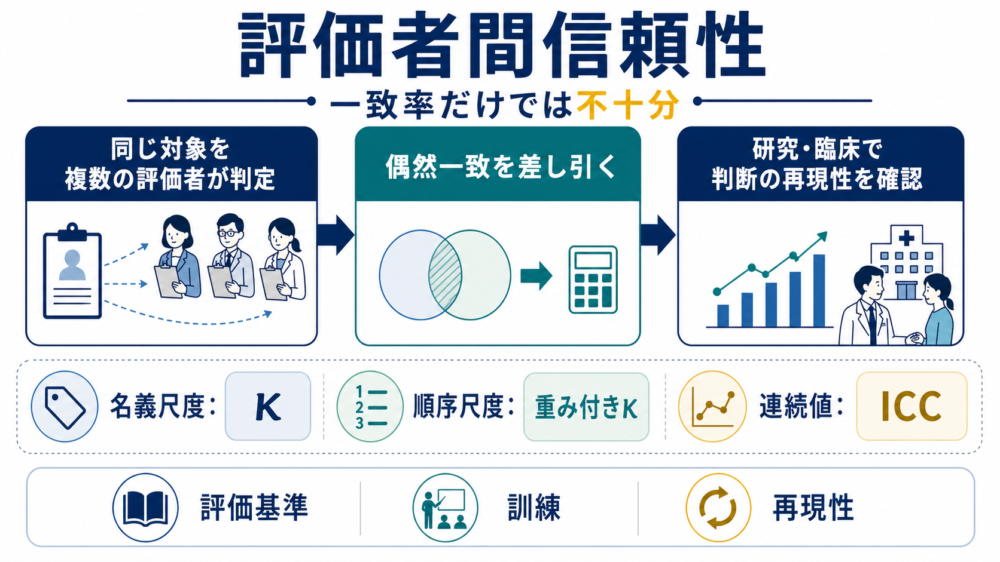
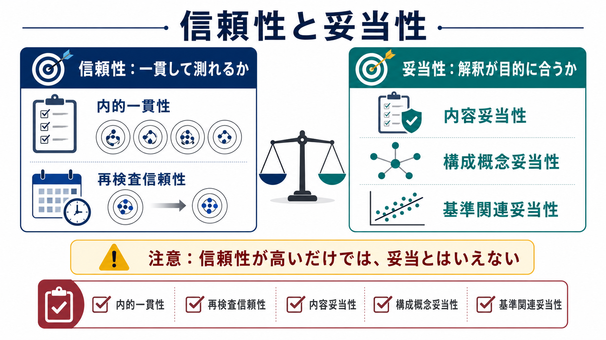

# 心理尺度はどのように作られるのか

## 要点

- 心理尺度は、[[自己効力感とは何か|自己効力感]]、不安、動機づけ、疲労、態度のような直接観察できない構成概念を、複数の質問項目への反応として測る道具である。
- 尺度作成は「質問を思いつく」作業ではなく、概念定義、項目作成、専門家・対象者による内容確認、予備調査、項目分析、因子分析、信頼性検討、妥当性検証を重ねる研究プロセスである[1][2]。
- 信頼性は「一貫して測れるか」、妥当性は「その得点解釈が目的に合うだけの証拠があるか」である。信頼性が高いだけでは、尺度が妥当だとはいえない[3][8]。
- 臨床や教育で使う場合、尺度得点は診断や評価の補助情報であり、面接、行動観察、生活史、文化的背景、他の指標と合わせて解釈する必要がある。

## この記事で答える問い

1. 心理尺度は、どのような手順で作られるのか。
2. 項目作成と予備調査では何を確認するのか。
3. 信頼性と妥当性は何が違うのか。
4. 尺度得点を研究・臨床で読むとき、どこに注意すべきか。

## まず結論

心理尺度づくりの中心は、「測りたい心理概念」と「実際の質問項目」と「得点の使い道」をずれないように結び続けることである。たとえば「学習意欲」を測る尺度を作るなら、楽しさ、努力、価値づけ、目標志向、回避的態度などのどこまでを学習意欲に含めるのかを先に決める必要がある。この定義が曖昧なまま項目を集めると、見かけ上は信頼性が高くても、実際には別々の概念を混ぜた得点になりやすい[2][4]。

一般的な流れは、構成概念を定義し、広めの項目プールを作り、専門家と対象者の確認で内容妥当性を検討し、予備調査で回答分布やわかりにくい項目を調べ、項目分析と因子分析で構造を推定し、別サンプルで信頼性と妥当性を検証する、という段階を踏む[1][5][6]。重要なのは、1回の分析で「完成」と考えないことである。尺度は、使用目的、対象集団、言語、文化、測定場面が変わるたびに、解釈の妥当性を再点検する必要がある[3][5]。

## 背景

心理学では、知覚や反応時間のように実験課題で測りやすい対象もあれば、自己評価、抑うつ、価値観、ストレス、[[内発的動機づけとは何か|内発的動機づけ]]のように、本人の主観報告を通してしか近づきにくい対象も多い。そこで使われるのが質問紙尺度である。尺度は研究の効率を高める一方で、項目の言い回し、回答形式、サンプル、文化、翻訳、実施文脈に強く影響される。

たとえば、同じ「不安」を測る尺度でも、状態不安を測るのか、特性的な不安傾向を測るのか、社交不安を測るのか、身体感覚への不安を測るのかで、必要な項目は変わる。[[内受容感覚とは何か|内受容感覚]]や[[認知負荷とは何か|認知負荷]]のような多面的概念では、単一の合計点だけで扱うと、重要な下位成分を見落とすことがある。

## 基本概念

### 構成概念

構成概念とは、直接観察できないが、理論上必要とされる心理的な概念である。自己効力感、衝動性、レジリエンス、態度、疲労感などが典型例である。尺度開発では、まず構成概念の境界を決める。何を含め、何を含めないのかを明確にしなければ、項目選定も妥当性検証もできない[2]。

### 項目と回答形式

項目とは、回答者に提示する一つひとつの質問文や文である。回答形式には、5件法や7件法のリッカート形式、頻度評定、同意度評定、二件法などがある。項目文は、二重質問、否定表現の重なり、専門用語、誘導的表現、文化的に偏った前提を避ける必要がある[1]。

### 信頼性

信頼性は、測定がどれくらい一貫しているかを表す。内的一貫性、再検査信頼性、評定者間信頼性などがある。クロンバックの $\alpha$ は内的一貫性の代表的指標だが、すべての項目が同じ程度に構成概念を反映するなどの仮定に依存するため、単独で「尺度の良さ」を保証する指標ではない[7][8]。

### 妥当性

妥当性は、尺度そのものに貼られる合格印ではなく、得点の解釈と使用目的を支える証拠の総体である。内容妥当性、構造に基づく証拠、外的基準との関連、反応過程、結果の帰結などを総合して考える[3]。新しい尺度では、とくに内容妥当性が初期段階の土台になる[4][5]。

## 仕組み

### 1. 測りたい概念を定義する

最初に行うのは、文献レビューと理論整理である。既存尺度があるなら、それを使う、翻訳・適応する、新尺度を作る、のどれが妥当かを検討する。新尺度が必要な場合でも、既存研究との接続を明確にしなければ、研究間で結果を比較しにくくなる[1][2]。

ここで作るべきものは、短い定義文、下位概念の候補、対象集団、利用場面、得点解釈の範囲である。「大学生の試験不安を授業改善研究で測る」のか、「臨床群の不安症状をスクリーニングする」のかで、許容される項目、必要な精度、倫理的配慮は変わる。

### 2. 項目プールを作る

項目プールは、最終尺度より多めに作る。Clark と Watson は、初期項目を狭く作りすぎると構成概念の重要な側面が抜け落ちるため、最初はやや広めに項目を集め、その後の検討で絞ることを重視している[2]。項目は、理論、先行尺度、面接、自由記述、専門家の知見、対象者の語りから作る。

この段階では、似た項目をあえて複数入れておくこともある。ただし、冗長すぎる項目ばかりだと、後で高い内的一貫性が出ても、概念の幅を測れていない可能性がある。短く、具体的で、一つの意味だけを問う文にすることが基本である。

### 3. 内容妥当性を確認する

内容妥当性は、項目が測りたい構成概念をどれだけ適切に代表しているかである。専門家には、各項目が定義に合っているか、重要な領域が欠けていないか、余計な領域が混ざっていないかを確認してもらう。対象者には、項目が理解できるか、回答しにくい表現がないか、想定と違う意味に読まれないかを確認する[4][5]。

患者報告アウトカム尺度などでは、COSMIN の方法論が、関連性、包括性、わかりやすさを内容妥当性の中心要素として扱う[5]。心理尺度でも、専門家だけでなく、実際に回答する人の認知的インタビューや予備的フィードバックが重要である。

### 4. 予備調査を行う

予備調査では、少数から中規模のサンプルで項目の動きを見る。確認するのは、欠損の多い項目、極端に偏った項目、天井効果・床効果、項目間相関、回答時間、自由記述の違和感などである。ここでは、項目を減らすだけでなく、文言を修正したり、下位概念の定義に戻ったりする。

予備調査は、統計的なふるい分けであると同時に、回答者が尺度をどのように読んだかを調べる工程でもある。項目が理論的にはよく見えても、回答者が別の意味で理解していれば、得点解釈は崩れる。

### 5. 項目分析と因子分析で構造を調べる

項目分析では、各項目が合計点や下位尺度点とどれくらい関連するか、識別力があるか、似すぎた項目がないかを見る。因子分析では、項目の背後にある次元構造を推定する。探索的因子分析は、想定構造がまだ不確かな段階で候補構造を探る方法であり、確認的因子分析は、あらかじめ想定した構造がデータに合うかを検討する方法である[6]。

因子数、抽出法、回転法、サンプルサイズ、欠損処理、順序尺度としての扱いは結果に影響する。したがって、因子分析の結果は機械的に読まず、理論、項目内容、サンプル特性と合わせて判断する必要がある[6]。

### 6. 信頼性を検討する

尺度がある程度形になったら、信頼性を検討する。内的一貫性は、同じ下位概念を測る項目群がどれだけまとまっているかを見る。再検査信頼性は、測る概念が安定しているはずの期間で、得点がどれだけ安定するかを見る。評定者が関与する尺度では、評定者間信頼性も必要になる。

クロンバックの $\alpha$ は便利だが、値が高すぎる場合は項目が重複している可能性もある。近年は、尺度構造に応じて $\omega$ などの代替指標を併記することも推奨される[8]。信頼性は、対象集団と実施条件に依存するため、「一度報告された値」をどこでも使えるとは考えない。

### 7. 妥当性証拠を集める

妥当性検証では、尺度得点が理論的に予測される相手と関連するか、関連しないはずのものとは弱く関連するか、既存尺度や行動指標と整合するか、群差や介入効果を適切に反映するかを検討する。AERA・APA・NCME のテスト標準は、妥当性を得点解釈を支える証拠として扱う[3]。

ここで重要なのは、「相関があったから妥当」ではない点である。どの程度の相関を期待したのか、なぜその基準を選んだのか、別の説明はないのか、対象集団が変わっても同じ解釈が成り立つのかを検討する必要がある。

## 図解

| 図 | 何を示すか | 記事内での役割 |
|---|---|---|
| 図1 | 概念定義から妥当性検証までの全体像 | 尺度作成を一連の研究プロセスとして把握する |
| 図2 | 項目プール、予備調査、項目分析、因子分析の関係 | どのように項目を残すかを理解する |
| 図3 | 信頼性と妥当性の違い | 「安定している」と「正しく解釈できる」を区別する |

## 臨床・研究との接続

研究では、心理尺度は群間比較、縦断変化、介入効果、媒介分析、機械学習モデルの特徴量などに使われる。[[認知機能検査は何を測っているのか|認知機能検査]]や行動課題と組み合わせると、主観報告と客観指標のずれも検討できる。たとえば、[[行動賦活システムとは何か|BIS/BAS尺度]]のような自己報告尺度は、神経画像や行動課題と合わせて、接近・回避傾向の個人差を調べる入口になる。

臨床では、尺度は面接を置き換えるものではない。スクリーニング、重症度評価、経過観察、心理教育、研究参加基準の設定には役立つが、個人の診断や治療方針を単独で決めるものではない。特に精神医学では、生活機能、発達歴、身体疾患、薬物、文化的背景、本人の語りを合わせて読む必要がある。

## よくある誤解

### α が高ければよい尺度である

高い $\alpha$ は、項目が似ていることを示す場合がある。しかし、同じような文を繰り返していれば値は上がりやすい。尺度に必要なのは、項目のまとまりだけでなく、構成概念の重要な側面を過不足なく含むことである[8]。

### 因子分析で出た因子が、そのまま心理的実体である

因子はデータ構造を要約する統計的表現であり、必ずしも心の中に独立した部品が存在することを意味しない。因子名は、項目内容、理論、先行研究を踏まえて慎重につける必要がある[6]。

### 妥当性は一度確認すれば終わる

妥当性は、対象者、言語、文化、測定目的、利用場面に依存する。大学生サンプルで妥当性証拠が得られた尺度を、高齢者、臨床群、異文化集団、オンライン調査にそのまま使えるとは限らない[3][5]。

### 逆転項目を入れれば注意深く回答しているか分かる

逆転項目は同意傾向への対策になることがあるが、文意を複雑にし、別因子のように振る舞うこともある。単に「逆向きにしておけばよい」ではなく、対象者の読解負荷と測定目的に合わせて判断する。

## 関連ノート

- [[認知機能検査は何を測っているのか]]
- [[自己効力感とは何か]]
- [[内受容感覚とは何か]]
- [[認知負荷とは何か]]
- [[内発的動機づけとは何か]]
- [[行動賦活システムとは何か]]
- [[MOC｜認知科学・心理学]]
- [[MOC｜研究方法]]
- [[MOC｜統計・医療統計]]

### 関連ノート候補

- 妥当性とは何か
- 信頼性とは何か
- 因子分析とは何か
- クロンバックのアルファとは何か
- 質問紙調査の設計

### MOC更新候補

- `content/00_MOC/MOC｜認知科学・心理学.md`
- `content/00_MOC/MOC｜研究方法.md`
- `content/00_MOC/MOC｜統計・医療統計.md`

## 理解チェック

1. 心理尺度を作る前に、構成概念の定義を明確にする必要があるのはなぜか。
2. 内容妥当性を専門家だけでなく対象者にも確認する理由は何か。
3. クロンバックの $\alpha$ が高くても、尺度が妥当だとは限らないのはなぜか。
4. 探索的因子分析と確認的因子分析は、どの段階で使い分けるべきか。
5. 臨床場面で尺度得点を診断そのものとして扱ってはいけない理由は何か。

## 参考文献

[1] Boateng, G. O., Neilands, T. B., Frongillo, E. A., Melgar-Quiñonez, H. R., & Young, S. L. (2018). Best Practices for Developing and Validating Scales for Health, Social, and Behavioral Research: A Primer. *Frontiers in Public Health, 6*, 149. https://doi.org/10.3389/fpubh.2018.00149

[2] Clark, L. A., & Watson, D. (1995). Constructing validity: Basic issues in objective scale development. *Psychological Assessment, 7*(3), 309-319. https://doi.org/10.1037/1040-3590.7.3.309

[3] American Educational Research Association, American Psychological Association, & National Council on Measurement in Education. (2014). *Standards for Educational and Psychological Testing*. American Educational Research Association. https://www.aera.net/publications/books/standards-for-educational-psychological-testing-2014-edition

[4] Haynes, S. N., Richard, D. C. S., & Kubany, E. S. (1995). Content validity in psychological assessment: A functional approach to concepts and methods. *Psychological Assessment, 7*(3), 238-247. https://doi.org/10.1037/1040-3590.7.3.238

[5] Terwee, C. B., Prinsen, C. A. C., Chiarotto, A., Westerman, M. J., Patrick, D. L., Alonso, J., Bouter, L. M., de Vet, H. C. W., & Mokkink, L. B. (2018). COSMIN methodology for evaluating the content validity of patient-reported outcome measures: a Delphi study. *Quality of Life Research, 27*, 1159-1170. https://doi.org/10.1007/s11136-018-1829-0

[6] Fabrigar, L. R., Wegener, D. T., MacCallum, R. C., & Strahan, E. J. (1999). Evaluating the use of exploratory factor analysis in psychological research. *Psychological Methods, 4*(3), 272-299. https://doi.org/10.1037/1082-989X.4.3.272

[7] Cronbach, L. J. (1951). Coefficient alpha and the internal structure of tests. *Psychometrika, 16*(3), 297-334. https://doi.org/10.1007/BF02310555

[8] McNeish, D. (2018). Thanks coefficient alpha, we'll take it from here. *Psychological Methods, 23*(3), 412-433. https://doi.org/10.1037/met0000144

## 未解決問題

- 心理尺度の短縮版を作るとき、利便性と内容妥当性の低下をどのように釣り合わせるべきか。
- オンライン調査、スマートフォン回答、生成AIを用いた回答支援が、尺度得点の信頼性と妥当性にどのような影響を与えるか。
- 文化差や翻訳の影響を、単なる平均差ではなく、項目機能の違いとしてどこまで検出できるか。
- 自己報告尺度、行動課題、生理指標、神経画像を統合したとき、同じ構成概念を測っていると判断する基準は何か。
