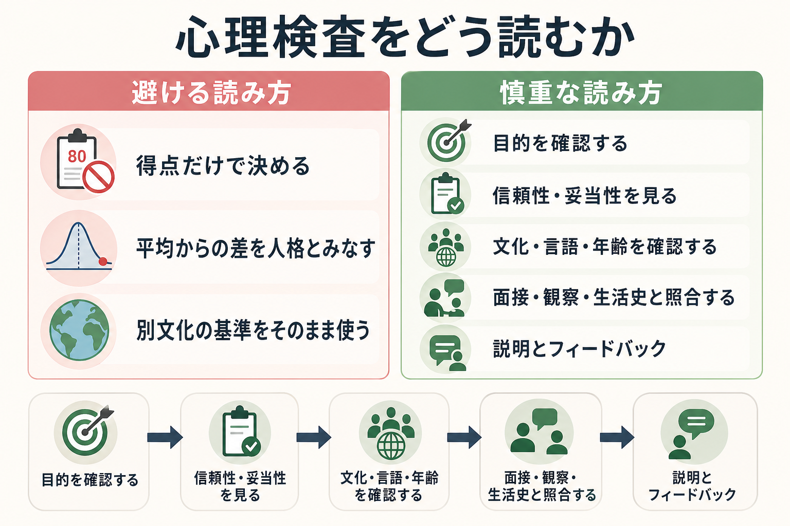

# 心理検査の限界は何か

## 要点

- 心理検査の得点は、心理状態や能力そのものではなく、特定の課題・質問・採点規則を通じて得られた「推定値」である。
- 得点には[[信頼性とは何か|信頼性]]と測定誤差の問題があり、1点の差やカットオフ付近の差を過大に読むと誤判断につながる。
- 得点の意味は、[[妥当性とは何か|妥当性]]、標準化集団、文化・言語、年齢、教育歴、検査状況、目的によって変わる。
- 臨床では、心理検査は診断書ではなく、面接、観察、生活史、身体・神経学的情報、本人の語りと照合するための道具である。
- 研究では、測定の透明性が低いと、統計解析が高度でも結論の妥当性は弱くなる。

## この記事で答える問い

1. 心理検査の得点は、なぜ「本人の本質」をそのまま表すとは言えないのか。
2. 測定誤差、文化差、状況依存性は、どのように検査解釈を揺らすのか。
3. 検査結果を臨床・研究で使うとき、どこまで言えて、どこからは言いすぎなのか。
4. 得点を慎重に読むために、どのような確認が必要なのか。

## まず結論

心理検査の限界は、検査が役に立たないという意味ではない。むしろ限界を明示できるからこそ、心理検査は研究や臨床で使える。重要なのは、得点を「結論」としてではなく、「不確実性を含む証拠」として読むことである。

たとえば、ある尺度で高得点だったとしても、それだけで特定の診断や性格特性を断定することはできない。得点は、項目内容、回答者の理解、疲労や不安、検査者との関係、標準化集団、採点方法、文化的背景の影響を受ける。現代のテスト標準では、検査得点の解釈と利用には、信頼性、測定誤差、妥当性、公平性、利用目的に関する証拠が必要だとされる[1]。

したがって、心理検査を慎重に使うとは、「検査を信用しない」ことではない。得点から何を推論しているのか、その推論をどの証拠が支え、どの条件では弱くなるのかを明示することである[2]。

## 背景

心理学や精神医学が扱う対象には、不安、注意、抑うつ、知能、パーソナリティ、実行機能、生活機能のように、直接手で触れたり測ったりできないものが多い。そこで[[心理測定とは何か|心理測定]]では、質問紙、課題、面接、観察、行動指標などを通じて、見えにくい構成概念を数値化する。

しかし、数値化された瞬間に不確実性が消えるわけではない。体温計であっても測定誤差はあるが、心理検査ではさらに、質問文の解釈、回答スタイル、社会的望ましさ、文化的規範、検査場面の緊張、評価者の判断が関わる。検査得点は、心理的特徴の「写真」ではなく、測定手続きによって切り取られた一つの観測値である。

妥当性論では、検査そのものが無条件に妥当なのではなく、「ある得点を、ある目的で、ある対象集団に、ある仕方で解釈・利用すること」が妥当かを問う[2][3]。この発想に立つと、心理検査の限界は次のように整理できる。

| 限界 | 何が問題になるか | 慎重な読み方 |
|---|---|---|
| 測定誤差 | 得点が偶然要因で揺れる | 点ではなく範囲で読む |
| 妥当性の限界 | 測りたい概念と得点がずれる | 得点が何を支える証拠かを限定する |
| 文化差・言語差 | 項目の意味や基準が集団で変わる | 翻訳・適応・標準化の根拠を確認する |
| 状況依存性 | 疲労、不安、薬物、睡眠、関係性で変わる | 検査時の状態を記録して解釈に入れる |
| 利用目的の違い | 研究、スクリーニング、診断補助で要求水準が違う | 目的に合う検査かを先に決める |

## 基本概念

### 得点は「推定値」である

古典的テスト理論では、観察された得点 $X$ を、真の得点 $T$ と誤差 $E$ の和として考える。

$$
X = T + E
$$

この式は単純だが、心理検査の限界を理解する入口になる。観察得点は、本人の特性だけでなく、偶然誤差、検査環境、理解度、体調、採点の揺れを含む。信頼性が低い検査では、同じ人を測っても得点が大きく変動しやすい。信頼性が高くても、測定対象や利用目的からずれていれば、解釈は妥当とは言えない[1]。

### 信頼性は「安定して測れるか」の問題

[[信頼性とは何か|信頼性]]は、検査得点がどれくらい一貫しているかを示す。[[内的一貫性とは何か|内的一貫性]]、[[再検査信頼性とは何か|再検査信頼性]]、[[評価者間信頼性とは何か|評価者間信頼性]]など、目的に応じて見るべき信頼性は違う。

ただし、信頼性が高いことは、得点が正しい解釈を支えることと同じではない。毎回同じ方向にずれる体重計が「安定しているが正確ではない」ように、心理検査でも、安定していても別の構成概念を測っている可能性がある。

### 妥当性は「その解釈でよいか」の問題

[[妥当性とは何か|妥当性]]は、検査得点から行う解釈や利用を支える証拠の強さである。Messick は、妥当性を得点の意味と利用に関する統合的な評価として捉え、検査結果の社会的帰結も検討対象に含めた[3]。Kane の議論では、得点から結論に至る推論の連鎖を明示し、それぞれの推論がどの証拠で支えられているかを評価する[2]。

たとえば、抑うつ尺度の得点が高いことから言えるのは、通常は「その尺度が想定する抑うつ関連反応が多い」ことである。そこから「大うつ病性障害である」「治療方針はこれでよい」「本人の性格はこうである」まで進むには、追加の臨床情報と別種の根拠が必要になる。

### 文化差は翻訳だけでは解決しない

心理検査を別の言語・文化で使うとき、単に文を翻訳すれば十分とは限らない。ある項目が同じ言語的意味を持っていても、感情表現、自己開示、教育経験、家族観、宗教観、仕事観、医療への期待が違えば、回答の意味は変わりうる。ITC の翻訳・適応ガイドラインは、前提条件、検査開発、確認、実施、採点・解釈、文書化を含む体系的な適応を求めている[5]。

この問題は、海外尺度の日本語版だけでなく、日本国内の年齢層、教育歴、発達特性、方言、移民・多文化背景、臨床群と一般群の違いにも関わる。標準化とは、単に平均と標準偏差を作ることではなく、「誰を基準に、どの目的で比べているのか」を定める作業である。関連して、[[標準化とは何か]]、[[偏差値と標準得点は何を意味するのか]]も参照できる。

## 仕組み

### 1. 項目が構成概念の一部だけを切り取る

心理検査は、広い心理現象を限られた項目に変換する。項目数を増やせば情報は増えるが、回答負担も増える。短縮版尺度は便利だが、構成概念の一部を落としている可能性がある。研究では、どの構成概念を、なぜその尺度で測るのかを明示しないと、結果の解釈が曖昧になる[8]。

### 2. 回答者の状態が得点を変える

睡眠不足、痛み、急性ストレス、服薬、検査への警戒、検査者との関係、質問文の理解困難は、得点に影響する。特に臨床場面では、得点が「安定した特性」なのか、「現在の状態」なのかを分ける必要がある。状態を測る検査を特性の証拠として読んだり、特性尺度を急性期の症状評価として使ったりすると、解釈がずれやすい。

### 3. カットオフは便利だが境界を作る

[[カットオフ値はどのように決めるのか|カットオフ値]]は、スクリーニングや支援の優先順位づけに有用である。しかし、カットオフを1点超えた人と1点下回った人が、本質的に別の集団だとは限らない。カットオフ付近では、測定誤差、基準集団、偽陽性・偽陰性、見逃しのリスク、過剰判定のリスクを合わせて読む必要がある。

### 4. 検査の目的が変わると必要な根拠も変わる

研究で群平均の差を見るための尺度、臨床でスクリーニングに使う尺度、個別支援計画に使う尺度、法的・教育的判断に関わる検査では、要求される根拠が違う。COSMIN のような枠組みは、患者報告アウトカム尺度の信頼性、測定誤差、内容的妥当性、構成概念妥当性、反応性などを区別して評価する[7]。心理検査でも、目的に応じた測定特性を確認するという考え方は共通して重要である。

## 図解

この記事では2枚の図を使う。

| 図 | 読み方 |
|---|---|
| 図1 | 心理検査を読むときの避ける読み方と慎重な読み方を対比する。得点、妥当性、文化・言語、面接・観察、フィードバックを一連の確認事項として見る。 |
| 図2 | 観察得点に測定誤差や状況要因が混ざることを示す。得点を一点の真実ではなく、不確実性を含む範囲として読む。 |

## 臨床・研究との接続

### 臨床では「総合的評価」の一部として使う

APA の心理アセスメント・評価ガイドラインは、心理検査を含むアセスメントには、専門的能力、適切な検査選択、実施・採点・解釈、報告とフィードバック、多様性への配慮が必要だと整理している[6]。これは、検査結果を単独で診断や支援方針に置き換えないという実践上の注意につながる。

臨床で心理検査を読むときは、少なくとも次を確認する。

- 検査の目的は、診断補助、スクリーニング、重症度把握、経過観察、支援計画のどれか。
- 検査時の状態に、睡眠不足、痛み、薬物、疲労、急性ストレス、理解困難はなかったか。
- 標準化集団は、本人の年齢、文化、言語、教育歴、臨床背景と大きくずれていないか。
- 得点は、面接、観察、家族・学校・職場情報、生活史と一致するか。
- 結果の説明は、本人を固定的にラベルづけせず、支援につながる言葉になっているか。

### 研究では「測定の透明性」が結論の土台になる

研究では、測定の不明瞭さが再現性や累積的知識を損なう。Flake と Fried は、尺度選択、項目の改変、得点化、構成概念の定義を曖昧にしたまま進める実践を questionable measurement practices と呼び、心理学研究の結論を弱める要因として論じている[8]。

したがって、心理検査を研究で使うときは、次を報告する必要がある。

- 測ろうとした構成概念の定義。
- 使用した検査名、版、項目数、回答形式、採点方法。
- 尺度を改変・短縮・翻訳した場合の理由。
- 対象集団での信頼性・妥当性の根拠。
- 欠測、逆転項目、下位尺度、合計得点の扱い。
- 研究の主張が、その測定の範囲を超えていないか。

この点は、[[心理学の再現性危機とは何か]]や[[事前登録とは何か]]とも接続する。統計モデルを複雑にしても、測定が曖昧なら、得られた効果の意味も曖昧になる。

## よくある誤解

### 誤解1: 心理検査は主観より客観的だから、得点が最終判断になる

心理検査は、面接だけでは見えにくい情報を構造化して得る点で有用である。しかし、得点は検査設計と採点規則に依存する。客観性とは「人間の判断が不要になる」ことではなく、判断の手続きを明示し、誤差と限界を点検できるようにすることである。

### 誤解2: 信頼性が高い検査なら、どの場面でも使える

信頼性は必要条件だが十分条件ではない。大学生サンプルで安定していた尺度が、高齢者、児童、臨床群、多文化背景を持つ人にそのまま使えるとは限らない。対象集団と利用目的が変われば、妥当性と公平性の根拠も再確認する必要がある[1][5]。

### 誤解3: カットオフを超えたら診断が決まる

カットオフは判断を助ける道具であり、診断そのものではない。特に精神科・心理臨床では、症状の持続、苦痛、機能障害、発達歴、身体疾患、物質使用、生活環境、文化的表現を合わせて評価する必要がある。検査得点は、その総合判断の一部に位置づける。

### 誤解4: 翻訳版尺度は、翻訳が自然なら問題ない

自然な翻訳と心理測定上の等価性は別である。項目の意味、反応形式、社会的望ましさ、基準集団、因子構造、測定不変性を確認しなければ、集団間比較や個別解釈が歪む可能性がある[5]。

## 関連ノート

既存ノートとしては、以下と接続できる。

- [[心理測定とは何か]]
- [[心理尺度はどのように作られるのか]]
- [[信頼性とは何か]]
- [[妥当性とは何か]]
- [[構成概念妥当性とは何か]]
- [[古典的テスト理論とは何か]]
- [[項目反応理論とは何か]]
- [[標準化とは何か]]
- [[カットオフ値はどのように決めるのか]]
- [[反応バイアスとは何か]]
- [[社会的望ましさバイアスとは何か]]

MOC更新候補:

- `content/00_MOC/` 配下の心理測定・心理学研究関連MOCがあれば、本記事を心理検査、心理測定、臨床評価、研究法の入口として追加する。

今後の作成候補:

- 心理検査と臨床判断はどう統合するのか
- 測定不変性とは何か
- 心理検査のフィードバックはどう行うべきか
- スクリーニング検査と診断検査は何が違うのか

## 理解チェック

1. 心理検査の得点を「本人の本質」ではなく「推定値」と読むべき理由は何か。
2. 信頼性が高くても妥当性が不十分な検査とは、どのような例か。
3. カットオフ付近の得点を解釈するとき、どのようなリスクがあるか。
4. 海外尺度を日本語で使うとき、翻訳以外に何を確認する必要があるか。
5. 臨床場面で、心理検査の結果を面接・観察・生活史と照合する理由は何か。

## 未解決問題

- デジタル行動ログ、スマートフォンセンサー、オンライン検査の得点を、従来の心理検査と同じ妥当性枠組みでどこまで評価できるか。
- 文化差や発達特性を踏まえた標準化集団を、実務上どこまで細かく設計すべきか。
- AIによる自動採点やリスク推定を、説明可能性、公平性、プライバシーを損なわずに心理評価へ組み込めるか。
- 個人内変動を重視する時系列評価と、集団基準に基づく標準得点をどう統合するか。

## 参考文献

[1] American Educational Research Association, American Psychological Association, & National Council on Measurement in Education. (2014). *Standards for Educational and Psychological Testing*. AERA. https://www.aera.net/Publications/Books/Standards-for-Educational-Psychological-Testing-2014-Edition

[2] Kane, M. T. (2013). Validating the interpretations and uses of test scores. *Journal of Educational Measurement, 50*(1), 1-73. https://doi.org/10.1111/jedm.12000

[3] Messick, S. (1995). Validity of psychological assessment: Validation of inferences from persons' responses and performances as scientific inquiry into score meaning. *American Psychologist, 50*(9), 741-749. https://doi.org/10.1037/0003-066X.50.9.741

[4] Borsboom, D., Mellenbergh, G. J., & van Heerden, J. (2004). The concept of validity. *Psychological Review, 111*(4), 1061-1071. https://doi.org/10.1037/0033-295X.111.4.1061

[5] International Test Commission. (2017). The ITC Guidelines for Translating and Adapting Tests (Second edition). *International Journal of Testing, 18*(2), 101-134. https://doi.org/10.1080/15305058.2017.1398166

[6] American Psychological Association, APA Task Force on Psychological Assessment and Evaluation Guidelines. (2020). *APA Guidelines for Psychological Assessment and Evaluation*. https://www.apa.org/about/policy/guidelines-psychological-assessment-evaluation.pdf

[7] Mokkink, L. B., de Vet, H. C. W., Prinsen, C. A. C., Patrick, D. L., Alonso, J., Bouter, L. M., & Terwee, C. B. (2018). COSMIN Risk of Bias checklist for systematic reviews of Patient-Reported Outcome Measures. *Quality of Life Research, 27*, 1171-1179. https://doi.org/10.1007/s11136-017-1765-4

[8] Flake, J. K., & Fried, E. I. (2020). Measurement schmeasurement: Questionable measurement practices and how to avoid them. *Advances in Methods and Practices in Psychological Science, 3*(4), 456-465. https://doi.org/10.1177/2515245920952393
