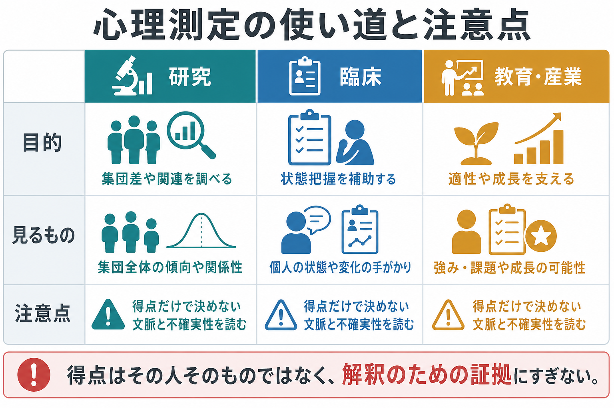
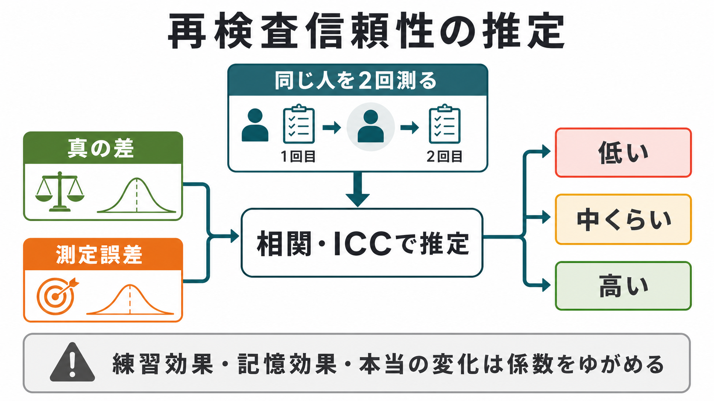

# 心理測定とは何か

## 要点

- 心理測定とは、知能、抑うつ、不安、性格、態度、動機づけのような直接は見えない心的特性を、質問紙、課題、面接、行動指標などの反応から数値として推定する方法である。
- 得点は「心そのもの」ではなく、構成概念、項目、対象集団、測定状況、採点規則、解釈目的に依存する証拠である。
- 良い尺度や検査には、少なくとも信頼性、妥当性、標準化、解釈の透明性、倫理的な利用条件が必要になる。
- 心理測定は研究で集団差や関連を調べるためにも、臨床・教育・産業で判断を補助するためにも使われるが、得点だけで個人を決めつける使い方は避ける。

## この記事で答える問い

1. 心理測定は何を「測っている」と言えるのか。
2. 尺度や検査の得点は、どのような手続きで作られるのか。
3. 信頼性と妥当性は何が違うのか。
4. 心理測定は研究・臨床でどのように使えるのか。
5. 得点を読むとき、どのような誤解を避けるべきか。

## まず結論

心理測定は、見えない心的特性を直接「取り出す」技術ではない。むしろ、観察可能な反応を一定のルールで集め、測定誤差を考慮しながら、ある構成概念についてどの程度の解釈が許されるかを検討する実践である。教育・心理検査の標準では、検査得点の解釈と利用を支える証拠を継続的に集めることが重視される[1]。

## 背景

心理学は、反応時間、正答数、質問紙回答、面接評定、生理指標、行動ログなど、さまざまな観察データを扱う。しかし、研究者や実践家が知りたいのは、しばしば「注意」「抑うつ」「外向性」「ワーキングメモリ」「学業動機づけ」のような、単独の観察では見えない概念である。

このような概念は、心理測定では構成概念と呼ばれる。構成概念は、単なる名前ではなく、理論、先行研究、関連する行動、他の概念との関係から意味づけられる。Cronbach と Meehl は、構成概念の妥当化には、概念を取り巻く理論的ネットワークと経験的証拠が必要だと論じた[2]。したがって心理測定では、「項目に答えたから測れた」とは言えず、その得点がどの構成概念のどの側面を、どの用途でどの程度支えるかを検討する。

関連する入口としては、[[MOC｜認知科学・心理学]]、[[MOC｜研究方法]]、[[MOC｜統計・医療統計]] がある。心理現象を扱う個別領域では、[[社会心理学とは何か]] のようなノートとも接続できる。

## 基本概念

### 構成概念

構成概念とは、直接観察できないが、理論上必要とされ、複数の観察指標から推定される概念である。たとえば「不安」は、主観的な心配、回避行動、身体症状、注意バイアス、面接所見などの複数の側面から推定される。

### 尺度・検査・項目

尺度は、複数の項目や課題反応をまとめて、ある構成概念の程度を表す道具である。質問紙尺度なら「まったく当てはまらない」から「非常に当てはまる」までの評定を合計・平均することが多い。能力検査なら正誤、反応時間、難易度、課題条件が重要になる。

### 得点

得点は、観察された反応を採点規則で変換した数値である。合計点、標準得点、偏差値、パーセンタイル、因子得点、IRT による潜在特性値など、得点化の形式は目的によって異なる。得点は便利だが、測定誤差や文脈依存性を含む。

### 信頼性

信頼性は、測定がどれだけ一貫しているかに関する性質である。内的一貫性、再検査信頼性、評定者間信頼性などがある。Cronbach のアルファ係数は、項目群がどれほど共通した情報を含むかを評価する代表的な指標として広く使われてきた[4]。ただし、アルファが高いだけで尺度が妥当だとは言えない。

### 妥当性

妥当性は、得点の解釈と利用を支える証拠の強さである。Messick は、妥当性を内容、内的構造、外的関係、一般化可能性、結果の含意などを統合して考える必要があると論じた[3]。つまり、妥当性は「検査そのもの」に固定的に備わる属性ではなく、「どの集団に、どの目的で、どのように解釈するか」に依存する。

## 仕組み

心理測定の典型的な流れは、次のように整理できる。

1. 測りたい構成概念を定義する。
2. 理論と先行研究に基づいて項目や課題を作る。
3. 対象集団からデータを集める。
4. 項目分析、因子分析、信頼性分析で尺度の構造を調べる。
5. 関連する外部指標、既存尺度、将来の行動、臨床的判断などとの関係から妥当性証拠を集める。
6. 標準化、カットオフ、解釈指針、利用上の制約を明示する。

古典的テスト理論では、観察得点を真の得点と誤差の和として考える。単純化すれば、次のように表せる。

$$
X = T + E
$$

ここで $X$ は観察得点、$T$ は理論上の真の得点、$E$ は測定誤差である。この見方は、再検査や項目間の一貫性を考えるうえで直感的である。一方、項目反応理論（IRT）は、個人の潜在特性と項目の難易度・識別力などを同じモデル内で扱い、どの特性水準でどの項目が情報を持つかを評価できる[6]。Rasch モデルはその代表的な出発点であり、項目と人の特性を確率モデルで結びつける考え方を示した[7]。

## 図解

この記事の3枚の図は、次の対応で読むとよい。

| 図 | 読み方 |
|---|---|
| 図1 | 心理測定は研究・臨床・教育産業で使われるが、得点だけで判断しない。 |
| 図2 | 信頼性は一貫性、妥当性は解釈の適切さであり、両者は別の問いである。 |
| 図3 | 再検査信頼性は同じ対象を時点を変えて測り、一貫性を推定する考え方である。 |

## 臨床・研究との接続

研究では、心理測定は集団差、個人差、発達変化、介入効果、脳・行動・主観指標の関連を調べるために使われる。尺度が安定していなければ、相関や群間差は測定誤差に埋もれやすい。逆に、尺度が狭すぎると、研究したい概念の一部だけを見ている可能性がある。

臨床では、心理検査や症状尺度は、面接、生活史、観察、身体疾患、社会的文脈と合わせて状態理解を補助する。医療・精神医学の文脈では、得点を個別診断や治療指示として単独で断定せず、研究で示された知見と臨床判断を区別して読む必要がある。患者報告アウトカムの測定特性を評価する COSMIN でも、信頼性、妥当性、反応性など複数の測定特性を体系的に見る枠組みが提示されている[5]。

教育・産業では、適性、学習到達、職務関連特性、ストレス、エンゲージメントなどの評価に使われる。ただし、検査は意思決定を補助する道具であって、個人の価値を決めるものではない。検査利用では、目的に合った尺度選択、説明責任、プライバシー、文化的公平性、結果のフィードバックが重要になる[1]。

## よくある誤解

### 誤解1: 数値化すれば客観的になる

数値は比較を助けるが、項目の作り方、サンプル、採点規則、測定状況に依存する。数値化は客観性の出発点であって、客観性そのものではない。

### 誤解2: 信頼性が高ければ妥当性も高い

同じものを一貫して測れていても、それが測りたい構成概念であるとは限らない。たとえば、ある尺度が一貫して「回答の速さ」を反映していても、研究者が測りたい「不安」を適切に捉えているとは限らない。

### 誤解3: カットオフを超えたら診断が決まる

カットオフはスクリーニングや判断補助には有用だが、個別診断を自動的に決めるものではない。臨床判断では、症状の持続、機能障害、背景要因、他の情報源を合わせて検討する。

### 誤解4: 海外尺度を翻訳すればそのまま使える

翻訳した尺度では、言語的等価性、文化的意味、因子構造、測定不変性を確認する必要がある。語の自然さだけでなく、同じ構成概念を同じように測っているかが問題になる。

## 関連ノート

既存ノートとしては、以下と接続できる。

- [[MOC｜認知科学・心理学]]
- [[MOC｜研究方法]]
- [[MOC｜統計・医療統計]]
- [[社会心理学とは何か]]

今後の作成候補:

- 信頼性とは何か
- 妥当性とは何か
- 因子分析とは何か
- 項目反応理論とは何か
- 測定不変性とは何か
- 質問紙尺度の作り方

MOC更新候補:

- `content/00_MOC/MOC｜認知科学・心理学.md`
- `content/00_MOC/MOC｜研究方法.md`
- `content/00_MOC/MOC｜統計・医療統計.md`

## 理解チェック

1. 心理測定でいう「構成概念」とは何か。
2. 得点が「心そのもの」ではないとは、どういう意味か。
3. 信頼性と妥当性の違いを一文で説明するとどうなるか。
4. 臨床場面で心理尺度の得点だけで判断しない理由は何か。
5. 翻訳尺度を使うとき、なぜ測定不変性や妥当性証拠が必要なのか。

## 未解決問題

- デジタル行動ログやスマートフォンセンサーのような連続データを、従来の心理尺度とどう統合するか。
- 文化、言語、年齢、神経多様性によって項目の意味が変わるとき、どの水準まで「同じ尺度」とみなせるか。
- AI による自動採点や行動推定を心理測定として使う場合、説明可能性、公平性、プライバシーをどう保証するか。
- 高精度な予測モデルと、解釈しやすい心理学的構成概念をどのように両立させるか。

## 参考文献

[1] American Educational Research Association, American Psychological Association, & National Council on Measurement in Education. (2014). *Standards for Educational and Psychological Testing*. https://www.ncme.org/resources-publications/books/testing-standards

[2] Cronbach, L. J., & Meehl, P. E. (1955). Construct validity in psychological tests. *Psychological Bulletin, 52*(4), 281-302. https://doi.org/10.1037/h0040957

[3] Messick, S. (1995). Validity of psychological assessment: Validation of inferences from persons' responses and performances as scientific inquiry into score meaning. *American Psychologist, 50*(9), 741-749. https://doi.org/10.1037/0003-066X.50.9.741

[4] Cronbach, L. J. (1951). Coefficient alpha and the internal structure of tests. *Psychometrika, 16*(3), 297-334. https://doi.org/10.1007/BF02310555

[5] Mokkink, L. B., de Vet, H. C. W., Prinsen, C. A. C., Patrick, D. L., Alonso, J., Bouter, L. M., & Terwee, C. B. (2018). COSMIN Risk of Bias checklist for systematic reviews of Patient-Reported Outcome Measures. *Quality of Life Research, 27*, 1171-1179. https://doi.org/10.1007/s11136-017-1765-4

[6] Embretson, S. E., & Reise, S. P. (2000). *Item Response Theory for Psychologists*. Lawrence Erlbaum Associates. https://www.routledge.com/Item-Response-Theory-1st-Edition/Embretson-Reise/p/book/9780805828191

[7] Rasch, G. (1960). *Probabilistic Models for Some Intelligence and Attainment Tests*. Danish Institute for Educational Research. https://www.scirp.org/reference/referencespapers?referenceid=2394024
