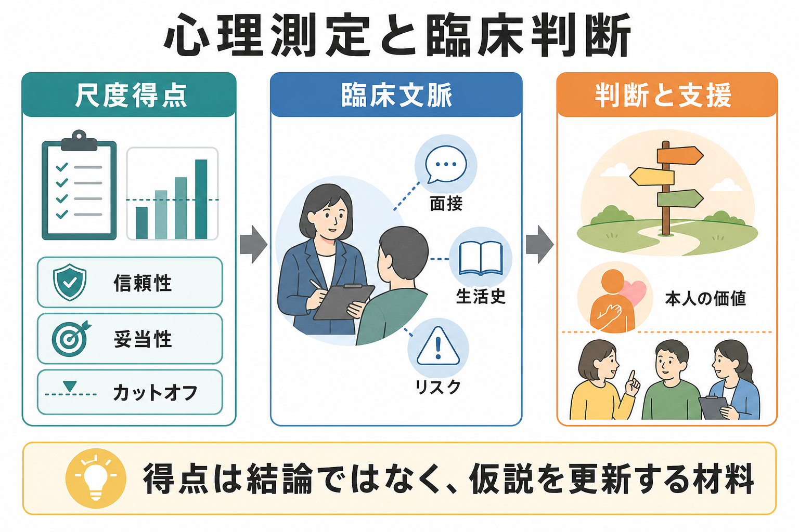
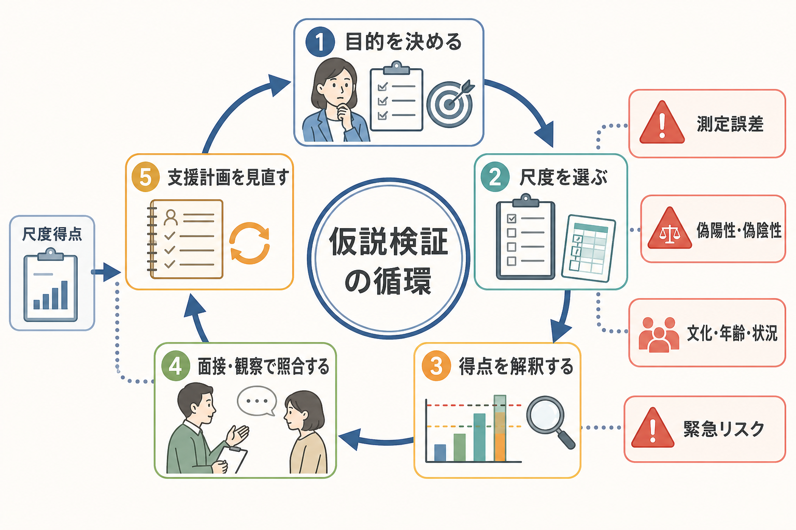
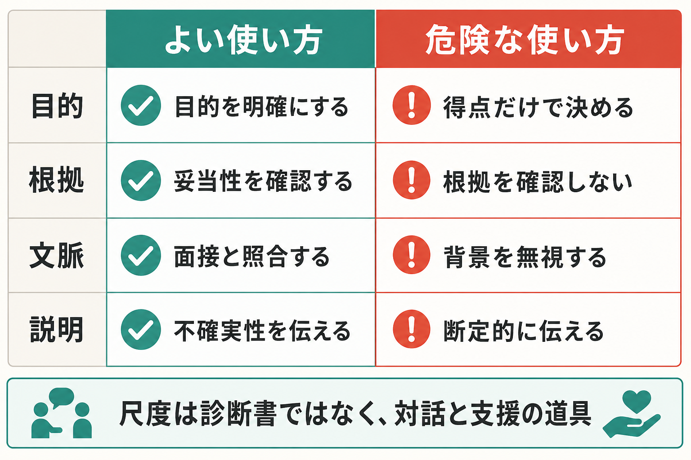

# 心理測定と臨床判断はどう組み合わせるべきか

## 要点

- 尺度得点は、診断名や支援方針を自動的に決めるものではなく、面接、観察、生活史、機能障害、リスク、本人の価値と照合して臨床仮説を更新する材料である。
- 心理測定を安全に使うには、[[信頼性とは何か|信頼性]]、[[妥当性とは何か|妥当性]]、[[標準化とは何か|標準化]]、対象集団、使用目的、[[カットオフ値はどのように決めるのか|カットオフ値]]の根拠を確認する必要がある[1]。
- 研究上は、統計的・機械的な予測規則が臨床家の直観的判断より同等以上に正確なことが多い。ただし、その規則が妥当なデータ、対象集団、運用条件に支えられていることが前提である[2][3]。
- 臨床場面では、尺度の陽性結果を「診断」と読み替えず、偽陽性・偽陰性、測定誤差、反応バイアス、文化・年齢・状況差を考える。
- 医療・心理臨床では、ここでの内容は教育・研究目的の整理であり、個別の診断や治療指示ではない。

## この記事で答える問い

1. 尺度得点は、臨床判断のどの部分を助けるのか。
2. なぜ「高得点だから診断」「低得点だから問題なし」とは言えないのか。
3. 統計的判断と臨床判断は、どちらを優先すべきなのか。
4. 支援や診断補助に尺度を使うとき、どの順序で確認すればよいのか。

## まず結論

心理測定と臨床判断は、競合する二つの方法ではなく、役割を分けて組み合わせるのがよい。心理測定は、主観的印象だけでは見落としやすい症状の強さ、変化、比較、リスクの手がかりを数値化する。一方、臨床判断は、その得点が本人の生活、文脈、文化、身体状態、危機状況、支援資源のなかで何を意味するかを解釈する。

したがって、よい使い方は「尺度で結論を出す」ことではない。よい使い方は、「尺度で仮説を立て、他の情報で照合し、必要なら支援計画を更新する」ことである。DSM-5-TR の評価尺度も、臨床判断を高める可能性のある道具であり、単独で臨床診断の根拠にするものではないと説明されている[4]。

## 背景

心理臨床や精神医学では、質問紙、面接評定、症状尺度、機能評価、リスクスコアなどが広く使われる。これらは[[心理測定とは何か|心理測定]]の道具であり、見えにくい心理的特徴や症状を観察可能な反応として扱う。

尺度が役立つ理由は明確である。第一に、同じ観点で繰り返し測ることで変化を追いやすい。第二に、面接者の記憶や印象だけに依存しにくい。第三に、研究知見や集団データと照合しやすい。第四に、支援前後の変化を本人やチームで共有しやすい。

しかし、尺度は万能ではない。尺度は、回答時点の状態、設問理解、反応スタイル、疲労、二次利得、文化的背景、併存症、身体疾患、薬物、睡眠、環境ストレスの影響を受ける。[[反応バイアスとは何か|反応バイアス]]や測定誤差を含むため、得点は常に「観察された値」であって、本人の内的状態を直接読んだものではない[1]。

## 基本概念

### 尺度得点

尺度得点とは、質問項目や評定項目への反応を一定の規則で数値化したものである。[[リッカート尺度とは何か|リッカート尺度]]の合計点、標準得点、偏差値、パーセンタイル、カットオフ判定などが含まれる。

得点は、比較と記録には便利である。ただし、得点の意味は尺度の作成目的に依存する。抑うつ症状の重症度を把握する尺度を、性格傾向や診断名の確定にそのまま使うことはできない。妥当性は「尺度そのもの」ではなく、「その得点を、その目的で、そう解釈してよいか」に関する証拠である[1]。

### 臨床判断

臨床判断とは、面接、観察、検査、生活史、身体状態、本人の語り、家族や支援者からの情報、危機リスク、機能障害、診断基準、支援資源を統合して、次に何を確認し、どう支援するかを決める判断である。

臨床判断には専門性が必要だが、直観だけでは偏りやすい。利用可能性ヒューリスティック、初期印象への固着、確認バイアス、基準率の無視などが入りうる。Meehl 以来の研究は、臨床家が情報を自由に重みづけるより、明示された規則で情報を組み合わせるほうが予測精度で優れる場面が多いことを示してきた[2][3]。

### 統計的・機械的判断

統計的・機械的判断とは、あらかじめ決められた規則、回帰式、リスクモデル、スコアリング規則、アルゴリズムによって情報を結合する方法である。Grove らのメタ分析では、健康・行動領域の予測課題において、機械的予測は平均して臨床的予測より高い精度を示す傾向があった[3]。

ただし、これは「尺度やモデルだけで臨床判断を置き換えるべき」という意味ではない。統計的規則が有効なのは、開発時と似た対象集団、測定条件、アウトカム、運用目的で使われる場合である。対象がずれると、予測精度や公平性は変わりうる。

## 仕組み

心理測定と臨床判断を組み合わせる実務上の流れは、次のように整理できる。

### 1. 目的を先に決める

最初に決めるべきなのは、どの尺度を使うかではなく、何のために測るかである。目的は少なくとも次のように分かれる。

| 目的 | 尺度の役割 | 注意点 |
|---|---|---|
| スクリーニング | 見落としを減らし、追加評価の必要性を示す | 陽性は診断ではない |
| 重症度評価 | 症状や困難の強さを記録する | 得点だけで機能障害を判断しない |
| 経過観察 | 支援前後や時間変化を見る | 測定誤差と最小重要変化を考える |
| 研究 | 群間差や関連を調べる | 尺度の妥当性と対象集団を明示する |
| 支援計画 | 支援ニーズの優先順位を整理する | 本人の価値や環境要因と照合する |

目的が曖昧なまま得点を読むと、スクリーニング用の高感度なカットオフを診断確定のように扱う、研究用尺度を臨床説明に過剰利用する、といった誤用が起こりやすい。

### 2. 尺度の測定特性を確認する

尺度を使う前に、少なくとも次を確認する。

- 何を測る尺度として作られたのか。
- どの対象集団で検証されたのか。
- 信頼性、妥当性、測定誤差、反応性の根拠があるか。
- 日本語版や翻訳版を使う場合、言語・文化的な検証があるか。
- カットオフ値がある場合、その目的、感度、特異度、予測値、外部検証が示されているか。

COSMIN は、患者報告アウトカム尺度を選ぶ際、信頼性、妥当性、測定誤差、反応性などを体系的に評価する枠組みを提供している[5]。心理臨床で用いる質問紙でも、この考え方は「得点を使う前に、得点の質を確認する」という実務上の基準になる。

### 3. 得点を臨床文脈に戻す

尺度得点は、本人の文脈から切り離して読むと誤解されやすい。たとえば不安尺度の高得点は、不安症の可能性を示すこともあれば、身体疾患、薬物、睡眠不足、急性ストレス、トラウマ反応、発達特性、職場や家庭の危機を反映していることもある。

得点を読んだら、次を照合する。

- 症状の持続期間、頻度、強度。
- 生活、学業、仕事、対人関係への機能障害。
- 本人が困っていることと、周囲が問題視していることの違い。
- 身体疾患、薬物、睡眠、疼痛、認知機能、発達歴。
- 文化、言語、年齢、ジェンダー、社会的条件。
- 自傷他害、虐待、重度のセルフネグレクトなどの緊急リスク。

この照合を行うことで、尺度は「ラベルを貼る装置」ではなく、「確認すべき問いを増やす装置」になる。

### 4. 統計的規則を尊重しつつ、適用条件を点検する

統計的規則やカットオフ値がある場合、臨床家の直観で恣意的に上書きしないほうがよい場面は多い。経験豊富な臨床家でも、情報の重みづけは一貫しないことがある。予測課題では、明示的な規則のほうが安定しやすい[2][3]。

一方で、規則を機械的に適用すればよいわけでもない。開発研究の対象と目の前の人が大きく異なる場合、モデルの外部妥当性は弱くなる。低有病率の場面では、感度・特異度が高くても陽性的中率が低くなることがある。[[カットオフ値はどのように決めるのか|カットオフ値]]を使うときは、その閾値が何を最大化するために選ばれたのかを確認する必要がある。

### 5. 支援方針に変換するときは不確実性を残す

尺度得点を本人に返すときは、断定ではなく、仮説として説明するほうが安全である。エビデンスに基づくアセスメントでは、検査結果を臨床的意思決定に結びつけるだけでなく、本人の希望や価値も判断過程に含めることが重視される[8]。

たとえば「あなたはうつ病です」ではなく、「この尺度では抑うつ症状が高い範囲にあります。睡眠、活動量、生活上の支障、身体要因、これまでの経過も合わせて確認しましょう」と伝える。評価結果を支援につなげるには、本人の目標、価値、環境、リスク、利用可能な支援資源を含めて方針を考える。

## 図解

3枚の図は、次のように読む。

| 図 | 読み方 |
|---|---|
| 図1 | 尺度得点は、信頼性・妥当性・カットオフを確認したうえで、臨床文脈と合わせて判断する。 |
| 図2 | 尺度利用は一回限りの判定ではなく、目的設定、尺度選択、得点解釈、面接・観察との照合、支援計画の見直しを回す循環である。 |
| 図3 | よい使い方は、目的・根拠・文脈・説明を明確にすること。危険な使い方は、得点だけで断定することである。 |

## 臨床・研究との接続

### 臨床での接続

臨床では、尺度は主に三つの場面で役立つ。エビデンスに基づくアセスメントの観点では、評価は単なる情報収集ではなく、診断、介入選択、経過観察、フィードバックを支える臨床行為として扱われる[7]。

第一に、初回評価で見落としを減らす。短い質問紙は、本人が面接で言いにくい症状や、臨床家が聞き忘れやすい領域を拾う助けになる。

第二に、経過を共有する。支援の前後で同じ尺度を使うと、本人の実感、生活上の変化、得点の変化を並べて検討できる。ただし、変化量が測定誤差を超えているか、本人にとって意味のある変化かを確認する必要がある[5]。

第三に、チームで判断を共有する。尺度得点は、医師、心理職、看護師、教師、支援者、本人の間で状態を共有する共通言語になる。ただし、共有されるべきなのは「点数」だけではなく、「何を測り、どの範囲で、何に注意して解釈したか」である。

### 研究での接続

研究では、尺度得点の扱いが研究結論を左右する。測定したい構成概念と尺度内容がずれていれば、サンプルサイズや統計モデルを精密にしても解釈は弱くなる。近年は、心理学研究における不十分な測定報告や不適切な尺度利用が、再現性や累積的知識の問題として議論されている[6]。

研究報告では、尺度名、版、言語、対象集団、信頼性、妥当性、得点化、欠測処理、カットオフ、測定不変性の検討を明示することが望ましい。尺度得点を診断群の代理変数にする場合は、診断面接や外部基準との関係を慎重に示す必要がある。

### AI・予測モデルとの接続

機械学習やリスク予測モデルは、統計的判断の拡張として臨床支援に使われる可能性がある。ここでも原則は同じである。モデル出力は、診断や支援を自動決定するものではなく、臨床仮説を更新する情報である。

特に、開発データと運用現場の差、説明可能性、校正、外部検証、偽陽性・偽陰性の害、公平性、プライバシーを確認する必要がある。予測精度が高いモデルでも、支援資源が不足している現場では、誰を優先するかという倫理的判断を避けられない。

## よくある誤解

### 誤解1: 尺度得点が高ければ診断できる

尺度得点が高いことは、診断可能性や支援ニーズを示す重要な手がかりになりうる。しかし、診断は症状数だけでなく、持続期間、機能障害、除外条件、鑑別、身体要因、文化的文脈、本人の語りを含む総合判断である。DSM-5-TR の評価尺度も、臨床診断の単独根拠としてではなく、意思決定を補助する道具として位置づけられている[4]。

### 誤解2: 臨床家の経験があれば尺度は不要である

経験は重要だが、経験だけでは判断の一貫性や予測精度は保証されない。臨床対統計的予測の研究は、情報を明示的な規則で組み合わせる利点を繰り返し示している[2][3]。尺度は、臨床家の判断を置き換えるのではなく、判断の偏りを減らし、確認すべき点を明確にする。

### 誤解3: 統計的規則があれば臨床判断はいらない

統計的規則は、対象集団、測定条件、アウトカムが合っているときに強い。だが、緊急リスク、本人の価値、家族状況、文化的意味、支援資源、身体疾患、併存症などは、単一の尺度やモデルだけでは十分に扱えない。統計的規則は「情報の結合」を助け、臨床判断は「適用条件と支援上の意味」を点検する。

### 誤解4: 妥当性が高い尺度なら、どの場面でも使える

妥当性は文脈依存である。大学生サンプルで作られた尺度を高齢者、児童、臨床群、別文化、別言語の集団に使うには追加の根拠が必要である。翻訳版では、語の自然さだけでなく、項目内容、因子構造、測定不変性、カットオフの再検証が問題になる[1][5]。

## 関連ノート

- [[心理測定とは何か]]
- [[心理尺度はどのように作られるのか]]
- [[信頼性とは何か]]
- [[妥当性とは何か]]
- [[構成概念妥当性とは何か]]
- [[標準化とは何か]]
- [[カットオフ値はどのように決めるのか]]
- [[反応バイアスとは何か]]

関連ノート候補:

- 臨床判断とは何か
- 統計的予測と臨床的予測
- 心理尺度を臨床で使うときの説明責任
- 尺度得点のフィードバック面接

MOC更新候補:

- `content/00_MOC/` 配下の心理測定・心理学研究関連 MOC に、本記事を「心理測定の臨床応用」または「尺度解釈と臨床判断」の項目として追加する。

## 理解チェック

1. 尺度得点を診断名そのものとして扱ってはいけない理由を、測定誤差と妥当性の観点から説明できるか。
2. スクリーニング目的のカットオフと、診断補助目的のカットオフでは、何を重視するかがどう変わるか。
3. 統計的予測が臨床的予測より優れやすい場面と、そのまま適用してはいけない場面を分けて説明できるか。
4. 尺度得点を本人に返すとき、断定を避けながら支援につなげる説明文を作れるか。
5. ある尺度を別の文化・年齢層・臨床群に使う前に、どの測定特性を確認すべきか。

## 未解決問題

- 尺度得点を本人に返すとき、どのような説明が自己理解を助け、スティグマや過剰な自己診断を減らすのか。
- 統計的予測モデルを臨床現場に導入したとき、予測精度、説明可能性、公平性、支援資源の配分をどう両立させるのか。
- 個人内変化を扱う反復測定では、集団基準のカットオフと本人内ベースラインをどのように組み合わせるべきか。
- 日本語版尺度の文化的妥当性、測定不変性、臨床カットオフの外部検証をどの水準まで求めるべきか。

## 参考文献

[1] American Educational Research Association, American Psychological Association, & National Council on Measurement in Education. (2014). *Standards for Educational and Psychological Testing*. AERA. https://www.aera.net/publications/books/standards-for-educational-psychological-testing-2014-edition

[2] Meehl, P. E. (1954). *Clinical Versus Statistical Prediction: A Theoretical Analysis and a Review of the Evidence*. University of Minnesota Press. https://openlibrary.org/books/OL6157448M/Clinical_versus_statistical_prediction

[3] Grove, W. M., Zald, D. H., Lebow, B. S., Snitz, B. E., & Nelson, C. (2000). Clinical versus mechanical prediction: A meta-analysis. *Psychological Assessment, 12*(1), 19-30. https://doi.org/10.1037/1040-3590.12.1.19

[4] American Psychiatric Association. (2022). *DSM-5-TR Assessment Measures*. https://www.psychiatry.org/File%20Library/Psychiatrists/Practice/DSM/DSM-5-TR/APA-DSM5TR-ClinicianRatedSeverityOfConductDisorder.pdf

[5] Prinsen, C. A. C., Mokkink, L. B., Bouter, L. M., Alonso, J., Patrick, D. L., de Vet, H. C. W., & Terwee, C. B. (2018). COSMIN guideline for systematic reviews of patient-reported outcome measures. *Quality of Life Research, 27*, 1147-1157. https://doi.org/10.1007/s11136-018-1798-3

[6] Flake, J. K., & Fried, E. I. (2020). Measurement schmeasurement: Questionable measurement practices and how to avoid them. *Advances in Methods and Practices in Psychological Science, 3*(4), 456-465. https://doi.org/10.1177/2515245920952393

[7] Hunsley, J., & Mash, E. J. (2007). Evidence-based assessment. *Annual Review of Clinical Psychology, 3*, 29-51. https://doi.org/10.1146/annurev.clinpsy.3.022806.091419

[8] Youngstrom, E. A. (2013). Future directions in psychological assessment: Combining evidence-based medicine innovations with psychology's historical strengths to enhance utility. *Journal of Clinical Child & Adolescent Psychology, 42*(1), 139-159. https://doi.org/10.1080/15374416.2012.736358
