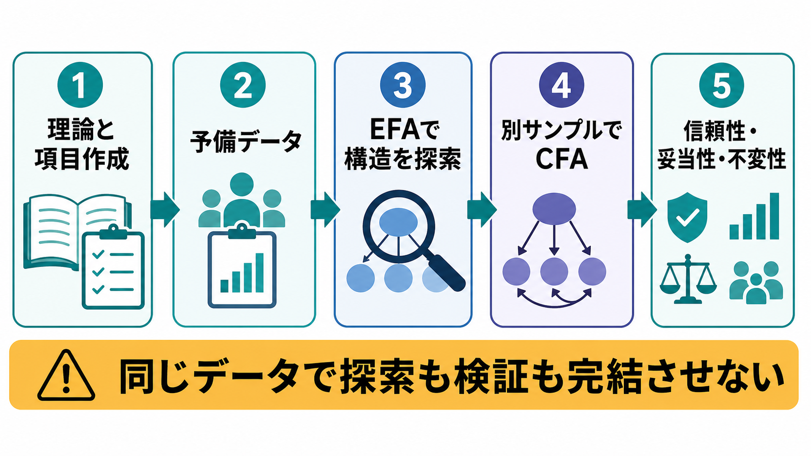
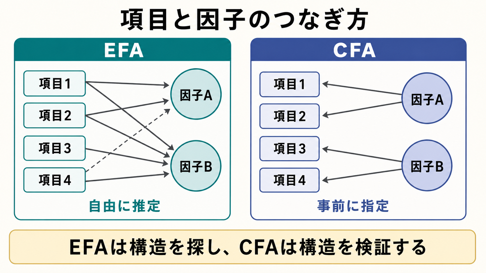

# 探索的因子分析と確認的因子分析は何が違うのか

## 要点

- 探索的因子分析（exploratory factor analysis: EFA）は、項目間の相関から「どのような潜在因子構造がありそうか」を探す方法である。
- 確認的因子分析（confirmatory factor analysis: CFA）は、理論や先行研究で決めた因子構造が、観測データとどの程度整合するかを検証する方法である。
- EFA は「仮説を作る」段階、CFA は「仮説モデルを評価する」段階に向いている。ただし、どちらも機械的に真の構造を発見する手続きではない。
- 心理尺度開発では、EFA と CFA を同じデータで完結させると過適合になりやすい。可能なら別サンプル、少なくとも分割サンプルで交差確認する。
- CFA の適合度指標は有用だが、数値のカットオフだけで妥当性を判断してはいけない。項目内容、理論、推定方法、サンプル、測定不変性と合わせて解釈する。

## この記事で答える問い

1. EFA と CFA は、同じ「因子分析」なのに何が違うのか。
2. どちらを先に使うべきか。
3. 尺度開発や既存尺度の翻訳・改訂では、どのように使い分けるのか。
4. 適合度指標が良ければ、尺度は妥当だと言えるのか。
5. 研究・臨床で因子分析を読むとき、どこに注意すべきか。

## まず結論

EFA と CFA の違いは、計算式の細部よりも「研究上の問い」の違いとして理解するとわかりやすい。EFA は、どの項目がどの因子にまとまりそうか、因子数はいくつぐらいが妥当か、項目のまとまりは理論的に解釈できるかを探索する。CFA は、あらかじめ決めた「この項目はこの因子に負荷する」という測定モデルが、データから見て受け入れられるかを検証する[1][3]。

たとえば新しい不安尺度を作るなら、初期項目群に EFA をかけて「身体症状」「心配」「回避」のような候補構造を探す。その後、別の参加者データで「身体症状項目は身体症状因子に、心配項目は心配因子に負荷する」という CFA モデルを検証する。これは [[心理尺度はどのように作られるのか]] で扱う尺度開発の一部であり、[[心理測定とは何か]] の構成概念妥当性の問題でもある。

## 背景

心理学・認知科学・精神医学では、不安、抑うつ、注意、衝動性、自己効力感のように、直接は観察できない構成概念を扱う。これらは単一の質問項目だけで測るよりも、複数項目への反応パターンから推定することが多い。因子分析は、このような複数項目の背後にある潜在因子をモデル化する代表的な方法である。

ただし、「因子分析をした」という記述だけでは不十分である。EFA なのか CFA なのか、因子数をどう決めたのか、回転は何を使ったのか、因子間相関を許したのか、CFA ならどの負荷量や誤差共分散を固定・自由化したのかによって、結論は変わる[1]。EFA と CFA の違いを押さえることは、尺度論文を読むときの基本的なリテラシーになる。

## 基本概念

### 共通因子モデル

因子分析の基本的な考え方は、観測された項目得点が、共通因子によって説明される部分と、項目固有の部分・誤差によって構成されるというものである。単純化すると、項目 $x_i$ は次のように表せる。

$$
x_i = \lambda_{i1}F_1 + \lambda_{i2}F_2 + \cdots + \epsilon_i
$$

ここで $\lambda$ は因子負荷量、$F$ は潜在因子、$\epsilon$ はその項目に固有の残差である。EFA と CFA は、この負荷量パターンをどれだけ事前に指定するかが大きく異なる。

### EFA

EFA では、研究者は最初から「項目1は因子Aだけに負荷する」と厳密には決めない。データの相関構造をもとに、因子数、因子負荷量、因子間相関、項目のまとまりを探索する。したがって EFA は、構造が不明確な新規尺度、既存尺度の新しい対象集団への適用、項目プールの整理に向いている。

EFA では、抽出法、因子数決定、回転法、項目削除基準が重要になる。因子数は固有値 1 以上という単純規則だけに頼るより、スクリープロット、並行分析、理論的解釈を組み合わせる方が望ましい[1][2]。また、心理構成概念では因子同士が相関することが多いため、直交回転だけでなく斜交回転を検討する必要がある。

### CFA

CFA では、研究者が事前に測定モデルを指定する。たとえば「不安尺度は3因子で、項目1-4は身体症状、項目5-8は心配、項目9-12は回避に負荷する」と決めてから、観測共分散行列とモデルが再現する共分散行列のずれを評価する。

CFA は SEM（構造方程式モデリング）の測定モデルとして位置づけられる。因子負荷量、因子間相関、誤差分散、必要なら誤差共分散などを指定し、モデル識別、推定方法、適合度指標、局所的な不適合、パラメータ推定値を総合して判断する[3][4]。

## 仕組み

EFA と CFA は、どちらも「項目と因子の関係」を扱う。しかし、EFA では関係を広く探索し、CFA では関係を事前に制約する。

| 観点 | EFA | CFA |
|---|---|---|
| 主な問い | 因子構造はどうなっていそうか | 仮説モデルはデータに合うか |
| 出発点 | データの相関構造 | 理論・先行研究・事前仮説 |
| 項目と因子の関係 | 原則として広く推定する | どの項目がどの因子に負荷するかを指定する |
| 因子数 | 探索的に決める | 事前に決めて検証する |
| 代表的な判断材料 | 因子負荷量、共通性、交差負荷、因子解釈、並行分析 | $\chi^2$、CFI、TLI、RMSEA、SRMR、負荷量、残差、修正指標 |
| 得意な場面 | 新規尺度、項目整理、構造の仮説形成 | 既存モデルの検証、尺度の交差妥当化、測定不変性 |
| 主なリスク | 因子数や項目削除が恣意的になる | 適合度指標だけを追って理論を後付けする |

CFA の適合度指標には、CFI、TLI、RMSEA、SRMR などがある。Hu と Bentler の研究は、複数の指標を組み合わせてモデル適合を判断する発想を広めたが、そこで示されたカットオフは絶対的な合否判定ではない[5]。サンプルサイズ、モデル複雑性、項目の分布、推定法、カテゴリカル項目かどうかによって、適合度指標の振る舞いは変わる。

## 図解

図1は、尺度開発でよく使われる流れを示している。理論と項目作成から出発し、予備データで EFA を行い、別サンプルで CFA を行う。その後、信頼性、妥当性、測定不変性を検討する。この順序は固定された儀式ではないが、「探索した構造を同じデータでそのまま検証済みにしない」という注意点は重要である[6][7]。

図2は、項目と因子のつなぎ方の違いを示している。EFA では複数の項目が複数の因子に負荷する可能性を開いて探索する。CFA では、理論的に想定した負荷だけを自由推定し、それ以外の交差負荷を 0 に固定することが多い。もっとも、現実の心理尺度では小さな交差負荷が存在することも多く、過度に厳しい単純構造 CFA が不自然な不適合を生む場合もある。この問題に対して、EFA と CFA の中間的性格をもつ探索的構造方程式モデリング（ESEM）も提案されている[8]。

## 臨床・研究との接続

臨床研究では、症状尺度や患者報告アウトカム尺度の内部構造を検討するときに、EFA と CFA が頻繁に使われる。たとえば抑うつ尺度が「気分」「身体症状」「認知症状」の3因子で解釈できるのか、ある対象集団では1因子として扱う方がよいのか、翻訳版でも同じ因子構造が保たれるのか、といった問いである。

ただし、因子構造が得られたからといって、個別診断や治療方針が自動的に決まるわけではない。尺度得点は、研究や臨床判断を補助する情報であり、面接、生活史、身体疾患、文化的背景、機能障害、他の評価指標と合わせて解釈する必要がある。COSMIN の枠組みでも、構造的妥当性は測定特性の一部であり、内容的妥当性、信頼性、測定誤差、仮説検証、反応性などと合わせて評価される[7]。

研究実務では、次のような使い分けが多い。

1. 新規尺度や大幅改訂では、理論と内容的妥当性を整えたうえで EFA を使い、項目群のまとまりを探索する。
2. 既存尺度の再検証では、最初から CFA を使って、先行研究の因子構造が現在のデータに合うかを調べる。
3. 翻訳尺度や異なる年齢・文化・臨床群への適用では、CFA や多母集団 CFA によって測定不変性を検討する。
4. EFA で見つけた構造を採用する場合は、別データで CFA を行い、過適合を避ける。

## よくある誤解

### 誤解1: EFA は古く、CFA の方が常に上位である

EFA と CFA は優劣ではなく、問いが違う。理論や先行研究が乏しい段階で、無理に CFA を行っても、検証すべきモデルが弱い。逆に、既に明確な仮説モデルがあるのに EFA だけで済ませると、仮説検証としては不十分になる。

### 誤解2: EFA で出た因子が「真の心理構造」である

EFA の因子は、抽出法、因子数、回転法、サンプル特性、項目内容に依存する統計的要約である。因子名は研究者が解釈して付けるものであり、データから自動的に心理実体が発見されるわけではない[1]。

### 誤解3: CFA の適合度が良ければ妥当性は確認された

適合度が良いことは、仮説モデルとデータのずれが相対的に小さいことを示すにすぎない。内容的に不適切な項目、狭すぎる構成概念、文化的に偏った項目でも、局所的には適合度が良くなることがある。妥当性は、得点解釈を支える証拠の総体として考える必要がある[7]。

### 誤解4: 修正指標に従ってモデルを直せばよい

修正指標は、どの制約を緩めると適合度が改善しそうかを示す探索的な情報である。理論的理由なしに誤差共分散や交差負荷を追加していくと、現在のデータにだけよく合うモデルになりやすい。モデル修正をした場合は、別サンプルで再検証することが望ましい[3][4]。

### 誤解5: EFA と CFA を同じサンプルで連続して行えば十分である

同じデータで EFA により構造を選び、そのまま CFA で適合度を確認すると、検証というより「選んだ構造を同じデータに再び当てはめる」ことになる。サンプルを分ける、別研究で再現する、事前登録するなど、探索と検証を分ける工夫が必要である[6]。

## 関連ノート

既存ノート:

- [[心理測定とは何か]]
- [[心理尺度はどのように作られるのか]]

今後の作成候補:

- 因子分析とは何か
- 因子負荷量とは何か
- 構造方程式モデリングとは何か
- 測定不変性とは何か
- 信頼性と妥当性は何が違うのか

MOC 更新候補:

- `content/00_MOC/` 配下の心理学・研究方法・統計関連 MOC

## 理解チェック

1. EFA と CFA の違いを、「探索」と「検証」という語を使って説明できるか。
2. 新しい尺度を作るとき、なぜ EFA の後に別サンプルで CFA を行うことが望ましいのか。
3. CFA の適合度指標が良いだけでは、なぜ妥当性が確認されたとは言えないのか。
4. 因子数を決めるとき、固有値 1 以上だけに頼るとどのような問題が起こりうるか。
5. 臨床尺度の因子構造を読むとき、個別診断と研究上の測定モデルをどう区別すべきか。

## 未解決問題

- 心理尺度の因子構造は、文化、年齢、臨床群、調査方法、項目形式によってどの程度変わるのか。
- 小サンプル研究や希少疾患研究で、CFA のモデル複雑性と推定安定性をどう両立させるか。
- 交差負荷を許す ESEM、双因子モデル、IRT、ネットワーク分析を、どの研究問いで使い分けるべきか。
- 機械学習による特徴量選択と、心理測定における理論的な項目選択をどう接続するか。

## 参考文献

[1] Fabrigar, L. R., Wegener, D. T., MacCallum, R. C., & Strahan, E. J. (1999). Evaluating the use of exploratory factor analysis in psychological research. *Psychological Methods, 4*(3), 272-299. https://doi.org/10.1037/1082-989X.4.3.272

[2] Hayton, J. C., Allen, D. G., & Scarpello, V. (2004). Factor retention decisions in exploratory factor analysis: A tutorial on parallel analysis. *Organizational Research Methods, 7*(2), 191-205. https://doi.org/10.1177/1094428104263675

[3] Brown, T. A. (2015). *Confirmatory Factor Analysis for Applied Research* (2nd ed.). Guilford Press. https://www.guilford.com/books/Confirmatory-Factor-Analysis-for-Applied-Research/Timothy-Brown/9781462515363

[4] Kline, R. B. (2023). *Principles and Practice of Structural Equation Modeling* (5th ed.). Guilford Press. https://www.guilford.com/books/Principles-and-Practice-of-Structural-Equation-Modeling/Rex-Kline/9781462551910

[5] Hu, L. T., & Bentler, P. M. (1999). Cutoff criteria for fit indexes in covariance structure analysis: Conventional criteria versus new alternatives. *Structural Equation Modeling: A Multidisciplinary Journal, 6*(1), 1-55. https://doi.org/10.1080/10705519909540118

[6] Worthington, R. L., & Whittaker, T. A. (2006). Scale development research: A content analysis and recommendations for best practices. *The Counseling Psychologist, 34*(6), 806-838. https://doi.org/10.1177/0011000006288127

[7] Mokkink, L. B., de Vet, H. C. W., Prinsen, C. A. C., Patrick, D. L., Alonso, J., Bouter, L. M., & Terwee, C. B. (2018). COSMIN Risk of Bias checklist for systematic reviews of Patient-Reported Outcome Measures. *Quality of Life Research, 27*, 1171-1179. https://doi.org/10.1007/s11136-017-1765-4

[8] Marsh, H. W., Morin, A. J. S., Parker, P. D., & Kaur, G. (2014). Exploratory structural equation modeling: An integration of the best features of exploratory and confirmatory factor analysis. *Annual Review of Clinical Psychology, 10*, 85-110. https://doi.org/10.1146/annurev-clinpsy-032813-153700
