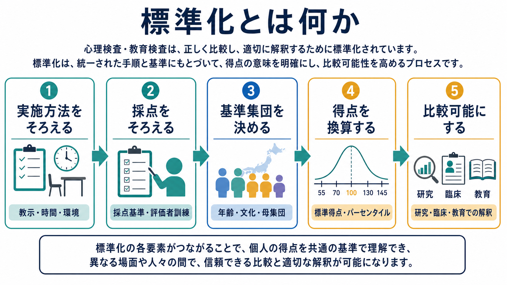
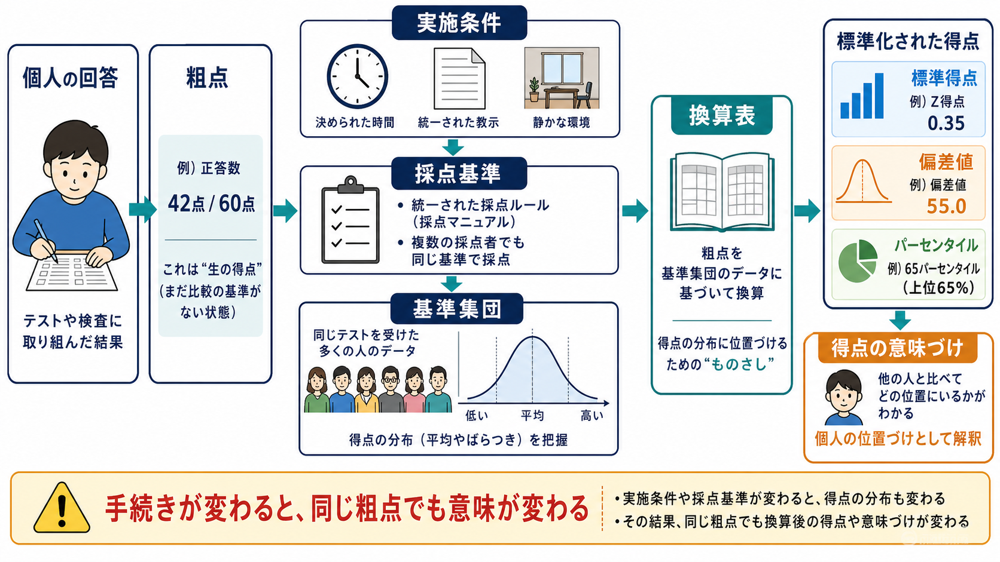
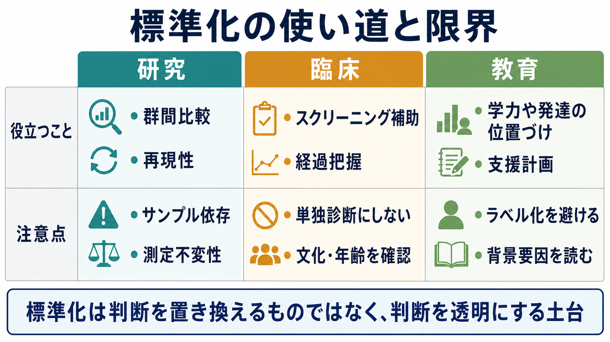

# 標準化とは何か

## 要点

- 標準化とは、検査の教示、時間、環境、採点、得点換算、基準集団をできるだけ同じ条件にそろえ、得点を比較可能にする手続きである。
- 粗点はそのままでは意味を持ちにくい。得点の意味は、どの集団を基準にし、どの手続きで測ったかによって決まる。
- 標準化は「客観的な真実」を直接取り出す仕組みではなく、判断の前提を透明にする仕組みである。
- 臨床・教育・研究で標準化検査を使うときは、標準化サンプル、文化・言語、測定不変性、妥当な使用目的を確認する必要がある。

## この記事で答える問い

1. 標準化とは、何をどこまでそろえる手続きなのか。
2. なぜ粗点だけでは比較や解釈が難しいのか。
3. 基準集団、標準得点、パーセンタイルはどのように関係するのか。
4. 臨床・研究・教育で標準化を使うとき、何に注意すべきか。

## まず結論

標準化とは、検査を「誰が、どこで、どのように実施し、どのように採点し、どの集団と比べるか」を明示的にそろえることである。標準化された検査では、同じ人が同じ能力や状態を示したとき、実施者や場所の違いだけで得点が大きく変わらないように、教示、制限時間、練習問題、採点ルーブリック、評価者訓練、換算表などが決められる[1][2]。

ただし、標準化は「得点を絶対的に正しくする」手続きではない。標準化が可能にするのは、特定の目的、特定の対象集団、特定の手続きのもとで、得点の解釈を比較しやすくすることである。したがって、標準化の質は[[信頼性とは何か]]や[[妥当性とは何か]]と切り離せない。

## 背景

心理検査、知能検査、発達検査、学力検査、症状尺度では、測りたい対象が身長や体重のように直接観察できるとは限らない。注意、記憶、不安、抑うつ、実行機能、読解力などは、課題への反応、質問紙の回答、面接評価、行動観察を通じて推定される。このため、検査得点には、測りたい特性だけでなく、教示の違い、検査環境、採点者の判断、文化的背景、受検者の理解、標準化サンプルとのずれが入り込みやすい。

標準化は、このようなばらつきを減らし、得点を解釈するための共通の土台を作る。教育・心理検査の標準に関する AERA・APA・NCME の基準書は、検査の開発、実施、採点、解釈、妥当性、信頼性、公平性、利用者責任を体系的に扱っており、標準化はその実務的な中核に位置づけられる[1]。

## 基本概念

### 粗点

粗点とは、正答数、合計点、反応時間、評定合計など、採点直後に得られる未変換の得点である。粗点は「何問正解したか」「何点だったか」を示すが、それだけでは、その人が同年齢集団の中で高いのか低いのか、臨床的に注目すべき範囲なのか、以前より変化したのかは分からない。

たとえば、20点満点中12点という粗点は、小学生向け検査では高いかもしれないが、大学生向け検査では低いかもしれない。粗点の意味は、検査の難易度、対象年齢、採点基準、基準集団によって変わる。

### 基準集団

基準集団とは、得点解釈の基準を作るために用いられる集団である。年齢、学年、性別、地域、言語、文化、臨床群・非臨床群など、検査の使用目的に合わせて定義される。心理検査のノルムは、個人の粗点を特定の集団内での相対的位置として解釈するためのデータであり、粗点だけでは得られない比較の文脈を与える[4]。

基準集団が使用場面とずれていると、得点の意味もずれる。成人一般集団で標準化された尺度を、高齢者、児童、特定疾患群、多文化集団にそのまま使うと、同じ点数でも意味が異なる可能性がある。

### 標準得点とパーセンタイル

標準得点は、粗点を基準集団の分布に照らして変換した得点である。代表例には、z 得点、T 得点、偏差値、IQ 型得点がある。パーセンタイルは、基準集団の中でその得点以下の人が何パーセントいるかを示す。これらは、検査の種類や問題数が違っても、集団内での位置づけを比較しやすくする。

標準得点やパーセンタイルは便利だが、万能ではない。基準集団が不適切であれば、換算後の得点も不適切に解釈される。標準化は、得点換算表だけでなく、基準集団の設計と記述を含む手続きである。

## 仕組み

標準化は、少なくとも次の4つをそろえる。

| 要素 | そろえる内容 | そろえない場合に起きること |
|---|---|---|
| 実施方法 | 教示、練習、制限時間、検査順序、環境、補助の範囲 | 実施者や場所の違いが得点差に混ざる |
| 採点 | 正誤基準、部分点、評価者訓練、採点者間一致 | 採点者の判断差が得点差に混ざる |
| 基準集団 | 年齢、学年、文化、言語、臨床特性、サンプル抽出 | 比較対象がずれ、得点の意味が変わる |
| 解釈 | 換算表、標準得点、信頼区間、使用目的、限界 | 数値だけが一人歩きし、過剰解釈が起きる |

たとえば、同じ受検者が同じ検査を受けても、ある実施者は制限時間を厳密に守り、別の実施者は少し延長するなら、得点差は能力差だけでは説明できない。同様に、自由回答や面接評価では、採点者が同じ基準で判断できるように、採点ルーブリック、訓練、二重採点、採点者間一致の確認が必要になる。

標準化された検査では、開発段階で標準化サンプルから得点分布を集め、粗点から標準得点やパーセンタイルへの換算表を作る。実施・採点・換算・解釈がひとつのパッケージとして管理されることで、個人の得点を基準集団内の位置として読むことができる[1][3][4]。

## 図解

図1は、標準化を「実施方法」「採点」「基準集団」「得点換算」「比較可能性」の連鎖としてまとめたものである。どこか一箇所が崩れると、最終的な得点解釈も不安定になる。

図2は、粗点が標準得点へ変換される流れを示している。重要なのは、粗点が直接「能力」や「症状の重さ」を意味するのではなく、統一された実施・採点と基準集団データを介して意味づけられる点である。

図3は、標準化が研究・臨床・教育にどう接続するかを整理している。研究では群間比較や再現性、臨床ではスクリーニングや経過把握、教育では支援計画に役立つ。一方で、標準化得点だけで個別診断、治療方針、教育的ラベルを決めることは避けるべきである。

## 臨床・研究との接続

### 臨床

臨床場面では、標準化された検査は、症状や認知機能を構造化して把握する補助線になる。たとえば、ある尺度の得点が同年齢・同条件の基準集団と比べてどの程度高いかを知ることで、面接、生活史、行動観察、家族情報、身体疾患、薬剤、文化的背景を読む際の焦点が定まりやすくなる。

しかし、標準化得点は診断そのものではない。特に精神医学や心理臨床では、得点は教育・研究・臨床判断を補助する情報であり、個別診断や治療指示を単独で決める根拠にはならない。検査のマニュアル、適用対象、カットオフの根拠、偽陽性・偽陰性、文化・言語適合性を確認する必要がある[1][2]。

### 研究

研究では、標準化は群間比較、縦断比較、介入前後比較の前提になる。検査手続きが研究参加者ごとに違えば、群差や介入効果に見えるものが、実施条件や採点条件の違いに由来する可能性がある。標準化された手続きは、この混入を減らす。

さらに、異なる集団を比較するときには、同じ尺度が同じ構成概念を測っているかを検討する必要がある。測定不変性の検討は、集団間や時点間で心理尺度の構造や意味が保たれているかを評価する枠組みであり、比較研究の重要な前提になる[6]。これは[[心理測定とは何か]]で扱う「測るとは何か」という問題と直結している。

### 文化・言語をまたぐ使用

検査を翻訳・適応するとき、単に文を訳すだけでは標準化とは言えない。国際テスト委員会の翻訳・適応ガイドラインは、事前条件、テスト開発、確認、実施、採点と解釈、文書化を含む段階的な確認を求めている[5]。言語が自然でも、項目の意味、難易度、社会的望ましさ、文化的前提が変われば、得点の比較可能性は損なわれる。

## よくある誤解

### 誤解1: 標準化されていれば、誰にでもそのまま使える

標準化は、特定の基準集団と使用目的に対して成立する。成人一般集団で標準化された尺度を、児童、認知症高齢者、身体疾患を持つ人、異なる言語・文化集団にそのまま使えるとは限らない。

### 誤解2: 粗点が同じなら、意味も同じである

粗点の意味は、実施条件、採点基準、検査難易度、基準集団によって変わる。同じ12点でも、どの検査で、どの年齢層と比較し、どの換算表を使ったかで解釈は変わる。

### 誤解3: 標準化は妥当性を保証する

標準化は、得点を比較しやすくするための条件を整える。しかし、その得点が本当に測りたい構成概念を測っているか、どの判断に使ってよいかは、[[妥当性とは何か]]の問題である。標準化されていても、使用目的がずれていれば妥当な解釈にはならない。

### 誤解4: 標準化は個人差を消す

標準化は個人差を消すのではなく、個人差を読めるようにするために、測定条件のばらつきを抑える。つまり、標準化は「全員を同じに扱う」だけでなく、「比較に不要な条件差を減らす」ための手続きである。

## 関連ノート

既存ノート:

- [[心理測定とは何か]]
- [[信頼性とは何か]]
- [[妥当性とは何か]]
- [[心理尺度はどのように作られるのか]]

今後の作成候補:

- ノルムとは何か
- 標準得点とは何か
- パーセンタイルとは何か
- 測定不変性とは何か
- 心理検査のカットオフとは何か
- 検査マニュアルは何を保証するのか

MOC更新候補:

- `content/00_MOC/` 配下の心理測定・心理学研究関連 MOC に、本記事を「心理測定の基礎概念」として追加する。

## 理解チェック

1. 標準化でそろえるべき要素を、実施、採点、基準集団、解釈の4つに分けて説明できるか。
2. 粗点だけでは得点の意味を判断しにくい理由を説明できるか。
3. 基準集団が使用場面とずれると、どのような誤解が起きるか。
4. 標準化と信頼性、妥当性の違いを一文で説明できるか。
5. 臨床場面で標準化得点を単独診断に使うべきでない理由を説明できるか。

## 参考文献

[1] American Educational Research Association, American Psychological Association, & National Council on Measurement in Education. (2014). *Standards for Educational and Psychological Testing*. American Educational Research Association. https://www.aera.net/Publications/Books/Standards-for-Educational-Psychological-Testing-2014-Edition

[2] International Test Commission. (2013). *ITC Guidelines on Test Use*. https://members.intestcom.org/files/guideline_test_use.pdf

[3] Educational Testing Service. (2014). *ETS Standards for Quality and Fairness*. https://www.ets.org/content/dam/ets-org/pdfs/about/standards-quality-fairness.pdf

[4] Fiske, D. W. (n.d.). Psychological testing: Test norms. *Encyclopaedia Britannica*. https://www.britannica.com/science/psychological-testing/Test-norms

[5] International Test Commission. (2017). *The ITC Guidelines for Translating and Adapting Tests (Second edition)*. https://www.intestcom.org/files/guideline_test_adaptation_2ed.pdf

[6] Putnick, D. L., & Bornstein, M. H. (2016). Measurement invariance conventions and reporting: The state of the art and future directions for psychological research. *Developmental Review, 41*, 71-90. https://doi.org/10.1016/j.dr.2016.06.004

## 未解決問題

- 標準化サンプルの代表性を、日本語圏・多文化環境・オンライン調査でどこまで確保できるか。
- 短縮版尺度やスマートフォン実施版で、元の標準化手続きと同じ得点解釈を維持できるか。
- 臨床的カットオフを、文化差、年齢差、併存症、生活背景を踏まえてどう更新すべきか。
- AI支援採点や適応型検査で、採点の透明性と標準化をどのように両立するか。
