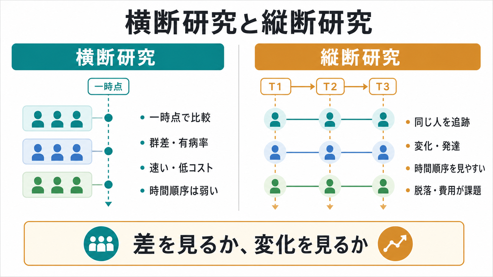
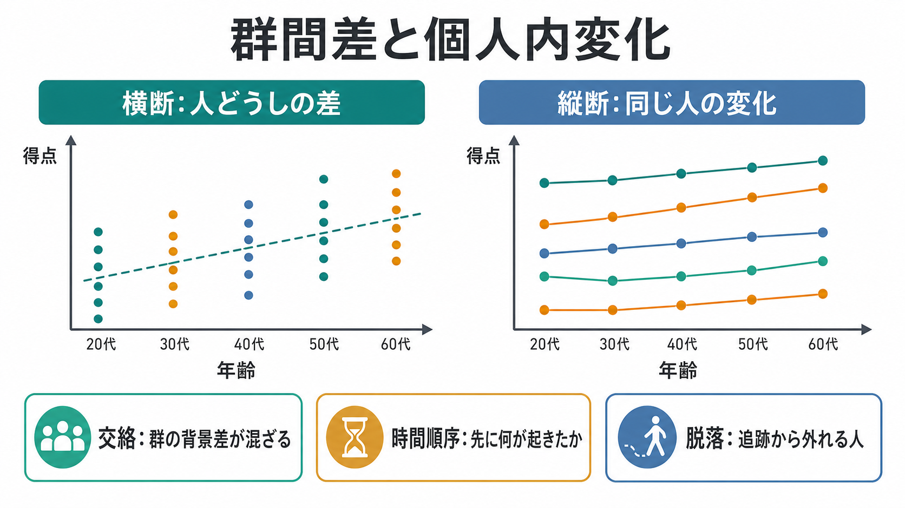
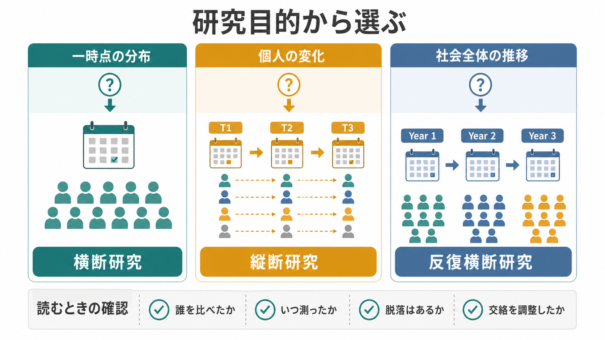

# 横断研究と縦断研究は何が違うのか

## 要点

- 横断研究は、一時点で異なる個人・群を測定し、群間差、関連、有病率、得点分布を調べる研究デザインである[1]。
- 縦断研究は、同じ個人・集団を複数時点で追跡し、個人内変化、発達軌跡、発症や回復の時間順序を調べる研究デザインである[2]。
- 横断研究は速く低コストだが、「年齢差」や「群差」に見えるものへ、コホート差、選択バイアス、交絡が混ざりやすい[1][5]。
- 縦断研究は変化を直接見やすいが、脱落、再検査効果、測定不変性、追跡コストが大きな課題になる[2][5][6]。
- どちらも観察研究である限り、単独では因果効果を確定しない。研究目的、測定の質、交絡調整、時間順序、欠測の扱いを合わせて読む必要がある[3][4]。

## この記事で答える問い

1. 横断研究と縦断研究は、何を比較しているのか。
2. 「群間差」と「個人内変化」はなぜ違う問いなのか。
3. 発達、加齢、臨床症状、心理尺度の研究では、どのような読み違いが起こるのか。
4. 研究論文を読むとき、どこを確認すればよいのか。

## まず結論

横断研究と縦断研究の違いは、「何回測ったか」だけではない。より重要なのは、**異なる人どうしの差を見るのか、同じ人の変化を見るのか**である。

横断研究では、たとえば20歳群、40歳群、70歳群を同じ時点で測定し、得点差を比べる。この方法は、ある時点の分布や群間差を知るには向いている。しかし、20歳群と70歳群は同じ個人の50年後ではない。教育歴、社会環境、医療、栄養、文化、出生年の違いが混ざるため、差をそのまま「加齢による変化」と読むのは危うい[1][5]。

縦断研究では、同じ参加者をT1、T2、T3のように追跡する。これにより、同一個人の得点が上がったのか下がったのか、症状が先に変化したのか生活要因が先に変化したのかを見やすくなる[2]。ただし、同じ検査を繰り返すことで慣れが生じる再検査効果、途中で追跡から外れる脱落、時点間で尺度の意味が同じかという測定不変性の問題が残る[5][6]。

## 背景

心理学、認知科学、精神医学、神経科学では、「年齢が上がると認知機能はどう変わるか」「症状が強い人はどのような生活背景を持つか」「自己評価は発達とともにどう変化するか」「尺度得点は介入後に改善するか」といった問いが頻繁に出てくる。

これらの問いは似て見えるが、必要な研究デザインは同じではない。一時点で集団を比べたいなら横断研究が有用である。一方、変化、発症、回復、学習、発達、再発、介入後の推移を見たいなら、縦断研究や実験・介入研究が必要になりやすい。

観察研究の報告基準である STROBE は、コホート研究、症例対照研究、横断研究を含む観察研究で、対象者、変数、バイアス、研究サイズ、統計方法、欠測、交絡などを明確に報告することを求めている[3][4]。つまり、研究デザイン名だけで信頼性が決まるのではなく、何をどのように測り、どの限界をどう扱ったかが重要である。

## 基本概念

### 横断研究

横断研究は、ある時点で対象者を測定し、曝露、属性、症状、得点、診断、行動指標などの関連を調べる観察研究である[1]。心理学では、質問紙調査、オンライン調査、学校や職場での一斉測定、臨床サンプルの初回評価などが典型例になる。

横断研究でよく答えられる問いは、次のようなものである。

| 問い | 例 |
|---|---|
| 分布 | ある尺度得点は、対象集団でどの程度ばらつくか |
| 群間差 | 診断群と対照群で平均得点は違うか |
| 関連 | 睡眠時間と抑うつ得点は関連するか |
| 有病率・該当率 | ある症状を示す人はどの程度いるか |

横断研究の強みは、比較的短時間で実施しやすく、費用を抑えやすく、多数の変数を同時に測れることである[1]。一方で、曝露と結果を同時に測るため、どちらが先に起きたのかを判断しにくい。たとえば「不安が高い人ほど睡眠が短い」という横断的関連があっても、不安が睡眠を悪化させたのか、睡眠不足が不安を高めたのか、第三の要因が両方に影響したのかは区別しにくい。

### 縦断研究

縦断研究は、同じ対象者を複数時点で測定し、時間に沿った変化を調べる研究である[2]。数週間の追跡から、数十年のコホート研究まで幅がある。心理学では、発達研究、加齢研究、症状経過、介入後フォローアップ、経験サンプリング、スマートフォンを用いた反復測定などが含まれる。

縦断研究でよく答えられる問いは、次のようなものである。

| 問い | 例 |
|---|---|
| 個人内変化 | ある人の認知得点は時間とともに上がるか下がるか |
| 変化の個人差 | 誰が速く改善し、誰が悪化しやすいか |
| 時間順序 | 生活ストレスの増加は、その後の症状変化に先行するか |
| 発達軌跡 | 年齢とともに自己評価や注意制御はどう変わるか |

縦断研究の強みは、時間順序を扱いやすく、同じ人の中での変化を直接見られることである[2]。ただし、追跡から脱落する人が偏ると結果がゆがむ。検査を繰り返すことで練習効果が出ることもある。認知機能研究では、横断比較では若年期から低下が見える一方、縦断比較では同じ検査への慣れによって低下が見えにくくなる場合が報告されている[5]。

### 反復横断研究

反復横断研究は、同じ個人を追跡するのではなく、同じ方法で別サンプルを複数時点に測るデザインである。たとえば、2026年、2028年、2030年にそれぞれ別の大学生サンプルを調査する場合である。

これは「社会全体の傾向が変わったか」を見るには有用だが、個人がどう変化したかは分からない。縦断研究と名前が似ていても、同一個人の変化を測るわけではない。

## 仕組み

### 群間差と個人内変化

横断研究が主に見るのは、異なる個人・群のあいだの差である。縦断研究が主に見るのは、同じ個人の中での変化である。この違いは、平均値の比較だけを見ていると見落とされやすい。

たとえば、ある横断研究で「年齢が高い群ほど記憶課題の得点が低い」と示されたとする。これは年齢群間の差である。そこから「同じ人が年を取ると同じだけ低下する」と言うには、同じ人を追跡するデータが必要になる。

逆に、縦断研究で「2年後に平均得点が上がった」と示されたとしても、それが真の発達や改善だけを意味するとは限らない。同じ課題への慣れ、選択的脱落、測定環境の変化が関与しうる[5]。したがって、横断研究にも縦断研究にも、それぞれ固有の読み方がある。

### 時間順序と因果

縦断研究は、横断研究よりも時間順序を扱いやすい。たとえば、T1のストレスがT2の抑うつ得点を予測するか、T1の抑うつ得点を調整しても予測が残るか、といった問いを立てられる。

ただし、時間順序があることは因果の十分条件ではない。未測定の交絡、逆方向の効果、測定誤差、選択バイアス、時変交絡が残ることがある。因果効果を主張するには、研究デザイン、交絡調整、感度分析、理論的仮定を明示する必要がある[3][4]。この点は [[MOC｜因果推論]] と接続して読むとよい。

### 測定不変性

縦断研究では、同じ尺度を複数時点で使うことが多い。しかし、同じ項目を使っていても、時点や集団によって意味が変わることがある。たとえば「疲れやすい」という項目は、青年期、子育て期、高齢期、身体疾患を持つ人で異なる背景を反映しうる。

このため、集団間比較や時点間比較では、尺度が同じ構成概念を同じように測っているかを検討する必要がある。測定不変性は、[[心理測定とは何か]]、[[妥当性とは何か]]、[[構成概念妥当性とは何か]]、[[標準化とは何か]]と深く関係する[6]。

## 図解

### 研究目的から選ぶ

研究デザインは、手元にあるデータではなく、答えたい問いから選ぶ方がよい。

| 研究目的 | 向いているデザイン | 注意点 |
|---|---|---|
| 一時点の分布を知る | 横断研究 | 有病率、平均値、関連は分かるが時間順序は弱い |
| 群間差を調べる | 横断研究 | 群の背景差、交絡、選択バイアスを確認する |
| 個人の変化を見る | 縦断研究 | 脱落、再検査効果、測定不変性を確認する |
| 発症や回復の予測因子を探す | 縦断研究・コホート研究 | 時間順序は見やすいが因果は別途検討が必要 |
| 社会全体の推移を見る | 反復横断研究 | 個人内変化とは区別する |
| 介入効果を評価する | 実験・介入研究 | 対照群、割付、盲検化、追跡を確認する |

## 臨床・研究との接続

### 心理測定と尺度研究

心理尺度の研究では、横断研究は尺度構造、内的一貫性、群間差、関連妥当性の初期検討に使われやすい。たとえば、ある質問紙が不安尺度と相関し、抑うつ尺度とは中程度に相関し、別概念の尺度とは低く相関するかを調べる場合である。

一方、[[再検査信頼性とは何か|再検査信頼性]]、症状の自然経過、介入前後の変化、発達的変化を調べるには、縦断データが必要になる。縦断研究では、尺度得点の変化が本当に構成概念の変化を反映しているのか、測定誤差や反応スタイルの変化ではないのかを考える必要がある[6]。

### 発達・加齢研究

発達や加齢では、横断研究と縦断研究の違いが特に重要になる。横断研究で年齢群を比較すると、短期間で幅広い年齢差を見られる。しかし、年齢群が生まれ育った時代、教育制度、栄養、医療、デジタル環境は異なる。これがコホート差である。

縦断研究では同じ個人を追うため、個人内変化を見やすい。しかし、認知課題では同じ検査への慣れが成績を押し上げることがあり、加齢による低下を過小評価する可能性がある[5]。したがって、発達・加齢研究では、横断、縦断、反復横断、加速縦断デザインを組み合わせて解釈することがある。

### 臨床・精神医学研究

臨床研究では、横断研究は症状の併存、診断群と対照群の差、スクリーニング尺度の分布を把握するために有用である。ただし、横断的な群差だけで「原因」を断定してはいけない。たとえば、うつ症状と睡眠障害が関連していても、原因方向は複数ありうる。

縦断研究は、症状の発症、再発、回復、治療後経過、リスク因子の時間順序を調べるうえで重要である。ただし、臨床サンプルでは重症例ほど脱落しやすい、逆に改善した人が来なくなる、治療内容が途中で変わる、といった問題が起こりやすい。研究知見は教育・研究目的で読み、個別診断や治療指示に直接置き換えない。

## よくある誤解

### 誤解1: 横断研究は質が低く、縦断研究は常に優れている

研究デザインの良し悪しは、問いとの対応で決まる。ある時点の有病率、分布、群間差を知りたいなら横断研究は適切である[1]。同じ個人の変化を知りたいなら縦断研究が必要になる。縦断研究でも、脱落や測定の問題が大きければ解釈は難しくなる。

### 誤解2: 横断研究で年齢差があれば、発達変化が分かったことになる

横断研究の年齢差は、異なる年齢の人どうしの差である。発達や加齢による個人内変化とは限らない。出生年、教育歴、社会環境、健康状態、検査経験の違いが混ざることがある[5]。

### 誤解3: 縦断研究なら因果が分かる

縦断研究は時間順序を見やすいが、交絡や選択バイアスを自動的に消すわけではない。因果を主張するには、何が交絡で、何を調整し、どの仮定のもとで解釈しているのかを明示する必要がある[3][4]。

### 誤解4: 同じ尺度を使えば、時点間比較はそのままできる

同じ項目を使っていても、時点、年齢、文化、症状状態によって項目の意味が変わることがある。時点間や群間の比較では、測定不変性や妥当性の確認が重要である[6]。

### 誤解5: 脱落者は単にサンプルサイズの問題である

脱落は人数を減らすだけではない。症状が重い人、忙しい人、改善した人、関心を失った人が偏って抜けると、推定される変化そのものがゆがむ。縦断研究では、脱落理由、追跡率、欠測処理を確認する必要がある[2][4]。

## 関連ノート

既存ノート:

- [[心理測定とは何か]]
- [[標準化とは何か]]
- [[再検査信頼性とは何か]]
- [[妥当性とは何か]]
- [[構成概念妥当性とは何か]]
- [[自己評価はどのように形成されるのか]]
- [[MOC｜研究方法]]
- [[MOC｜統計・医療統計]]
- [[MOC｜因果推論]]
- [[MOC｜認知科学・心理学]]

今後の作成候補:

- 観察研究とは何か
- コホート研究とは何か
- 反復横断研究とは何か
- 加速縦断デザインとは何か
- 交絡とは何か
- 測定不変性とは何か
- 欠測データはどう扱うのか

MOC更新候補:

- `content/00_MOC/MOC｜研究方法.md` に、本記事を「研究デザイン」の入口として追加する。
- `content/00_MOC/MOC｜認知科学・心理学.md` に、本記事を「心理測定・心理学研究」の関連ノートとして追加する。
- `content/00_MOC/MOC｜統計・医療統計.md` に、本記事を観察研究デザインの基礎として追加する。

## 理解チェック

1. 横断研究が主に見る「群間差」と、縦断研究が主に見る「個人内変化」の違いを説明できるか。
2. 横断研究で年齢群差が見つかっても、それをそのまま発達変化と読めない理由は何か。
3. 縦断研究で同じ検査を繰り返すと、どのような再検査効果が起こりうるか。
4. 縦断研究で脱落が結果をゆがめるのはどのような場合か。
5. 心理尺度を時点間・群間で比較するとき、測定不変性を確認する理由は何か。

## 参考文献

[1] Setia, M. S. (2016). Methodology Series Module 3: Cross-sectional Studies. *Indian Journal of Dermatology, 61*(3), 261-264. https://doi.org/10.4103/0019-5154.182410

[2] Caruana, E. J., Roman, M., Hernandez-Sanchez, J., & Solli, P. (2015). Longitudinal studies. *Journal of Thoracic Disease, 7*(11), E537-E540. https://doi.org/10.3978/j.issn.2072-1439.2015.10.63

[3] von Elm, E., Altman, D. G., Egger, M., Pocock, S. J., Gotzsche, P. C., Vandenbroucke, J. P., & STROBE Initiative. (2007). The Strengthening the Reporting of Observational Studies in Epidemiology (STROBE) Statement: Guidelines for Reporting Observational Studies. *PLoS Medicine, 4*(10), e296. https://doi.org/10.1371/journal.pmed.0040296

[4] Vandenbroucke, J. P., von Elm, E., Altman, D. G., Gotzsche, P. C., Mulrow, C. D., Pocock, S. J., Poole, C., Schlesselman, J. J., Egger, M., & STROBE Initiative. (2007). Strengthening the Reporting of Observational Studies in Epidemiology (STROBE): Explanation and Elaboration. *PLoS Medicine, 4*(10), e297. https://doi.org/10.1371/journal.pmed.0040297

[5] Salthouse, T. A. (2014). Why are there different age relations in cross-sectional and longitudinal comparisons of cognitive functioning? *Current Directions in Psychological Science, 23*(4), 252-256. https://doi.org/10.1177/0963721414535212

[6] Putnick, D. L., & Bornstein, M. H. (2016). Measurement invariance conventions and reporting: The state of the art and future directions for psychological research. *Developmental Review, 41*, 71-90. https://doi.org/10.1016/j.dr.2016.06.004

[7] Singer, J. D., & Willett, J. B. (2003). *Applied Longitudinal Data Analysis: Modeling Change and Event Occurrence*. Oxford University Press. https://doi.org/10.1093/acprof:oso/9780195152968.001.0001

[8] Fitzmaurice, G. M., Laird, N. M., & Ware, J. H. (2011). *Applied Longitudinal Analysis* (2nd ed.). Wiley. https://www.wiley.com/en-us/Applied+Longitudinal+Analysis%2C+2nd+Edition-p-9780470380277

## 未解決問題

- 横断データ、縦断データ、反復横断データを組み合わせて、年齢効果、時代効果、コホート効果をどこまで分離できるか。
- 心理尺度の測定不変性が完全には成り立たないとき、どの水準までなら群間・時点間比較を許容できるか。
- スマートフォンやウェアラブルによる高頻度縦断データで、測定反応性、欠測、生活文脈の変化をどう扱うべきか。
- 臨床研究で、集団レベルの縦断予測を個人レベルの支援判断へ接続するには、どのような検証が必要か。
