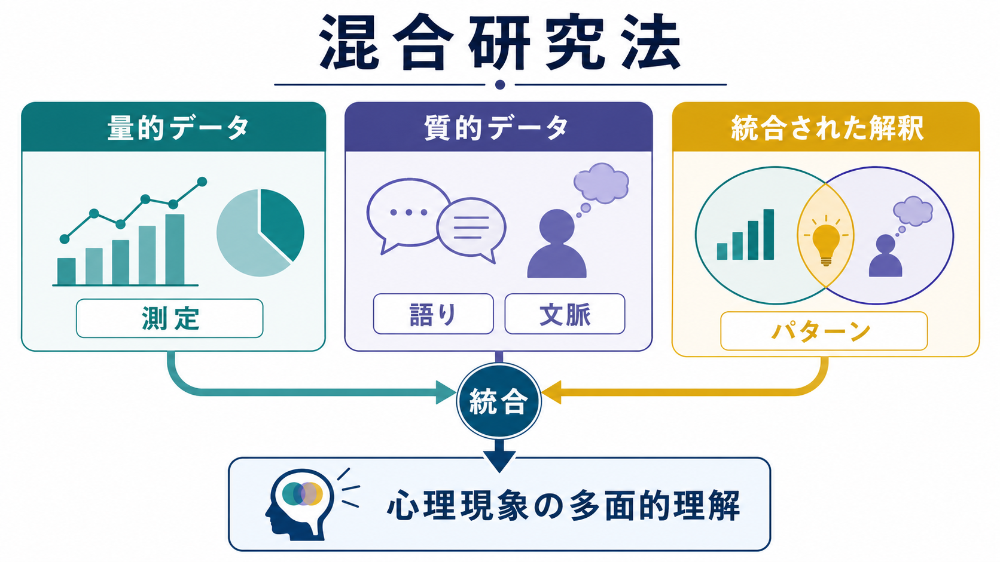
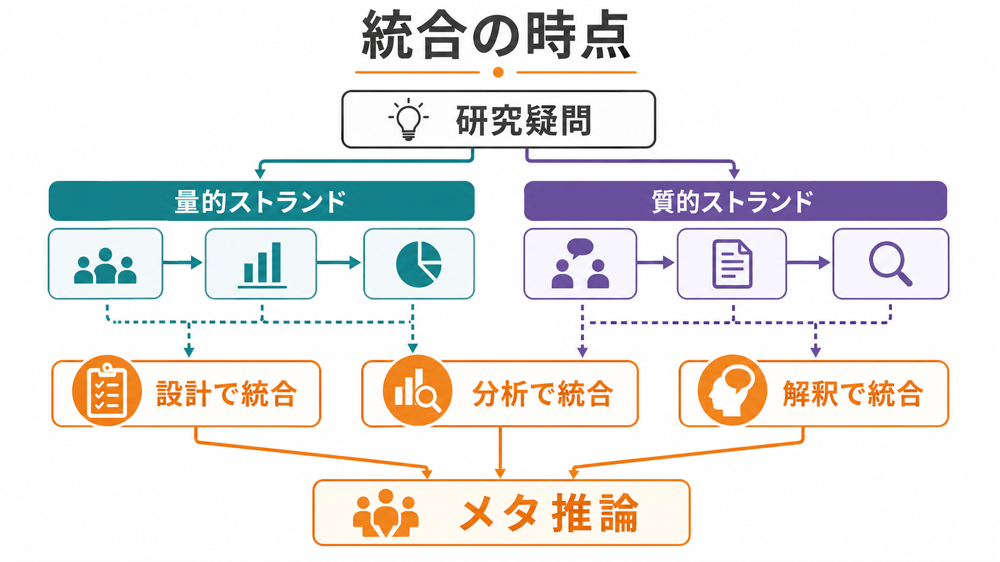
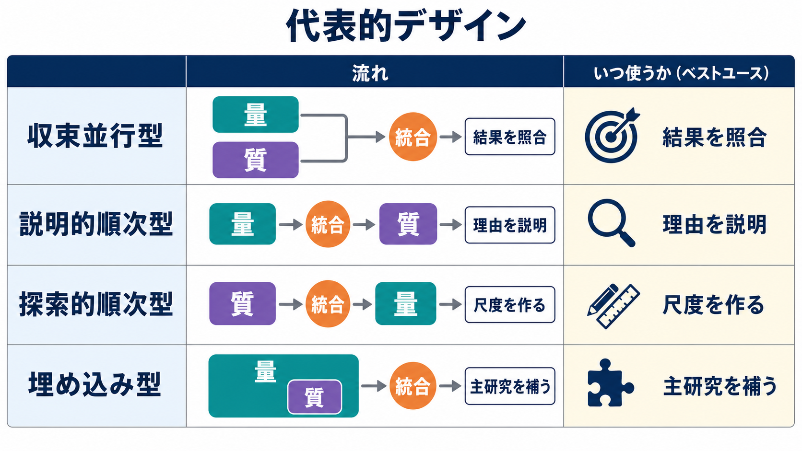

# 混合研究法とは何か

## 要点

- 混合研究法とは、量的データと質的データを同じ研究疑問のもとで収集・分析し、最終的に統合して解釈する研究アプローチである。
- 単にアンケートと面接を両方行うだけでは不十分で、なぜ組み合わせるのか、どの時点で統合するのか、統合から何が新しく分かるのかを明示する必要がある。
- 心理学では、尺度開発、介入評価、臨床経験の理解、発達・文化差の解釈などで有用だが、設計・分析・報告の負担は単一方法より大きい。

## この記事で答える問い

- 混合研究法は、[[心理学研究法とは何か]]の中でどのような位置にあるのか。
- 量的研究と質的研究を組み合わせると、心理現象の理解は何が変わるのか。
- 代表的な研究デザインと、統合の失敗を避ける要点は何か。

## まず結論

混合研究法の核心は「方法の足し算」ではなく「推論の統合」である。[[心理測定とは何か]]や[[心理尺度はどのように作られるのか]]が扱う量的な測定は、分布、関連、群差、予測、信頼性、妥当性を検討しやすい。一方で、面接、自由記述、観察記録などの質的データは、参加者がどのように経験を意味づけ、どの文脈で反応が生じるかを描きやすい。混合研究法は、この二つを同じ研究目的に接続し、単独では見えにくい説明を作るための枠組みである[1][2]。

## 背景

心理学の研究対象は、反応時間、得点、症状尺度、選択行動のように数値化しやすい側面と、主観的経験、語り、社会的文脈、治療関係のように数値だけでは捉えにくい側面を同時に含む。たとえば、ある介入で平均得点が改善したとしても、誰にとって、どのような経験を通じて、なぜ変化したのかは量的結果だけでは分からないことがある。逆に、面接で豊かな語りが得られても、その語りがどの程度広く見られるのか、どの変数と関係するのかは質的データだけでは判断しにくい。

NIH/OBSSR の混合研究法ガイドは、健康・行動科学の複雑な問題を扱う際に、量的・質的アプローチを計画的に組み合わせることの意義を整理している[1]。心理学向けには、APA の JARS が質的研究・混合研究の報告基準を提示し、研究目的、サンプリング、分析、研究者の立場、統合の根拠を透明に報告することを求めている[6]。

## 基本概念

混合研究法は、次の三つの条件を満たすと考えると分かりやすい。

1. 同じ研究課題の中で、量的データと質的データを扱う。
2. それぞれのデータを、それぞれの方法論的基準に沿って収集・分析する。
3. 設計、分析、解釈、報告のどこかで両者を統合し、単独の方法を超える推論を得る。

量的成分は、[[サンプルサイズ設計とは何か]]、[[統計的検出力とは何か]]、[[効果量とは何か]]、[[p値とは何か]]などと関係する。質的成分は、参加者の意味づけ、語りのパターン、例外例、文脈依存性を扱う。混合研究法では、両者を対立させるのではなく、「どの問いにどのデータが答えるのか」を分担させる。

重要なのは、統合の結果として生じるメタ推論である。メタ推論とは、量的結果と質的結果を照合し、収束、補完、拡張、矛盾を含めて、研究全体として何が言えるかをまとめる推論である[2][3]。

## 仕組み

混合研究法では、統合が起こる場所を先に決めると設計が明確になる。Fetters らは、統合を研究デザイン、方法、解釈・報告の複数レベルで考えることを提案している[2]。

代表的な統合の仕方は次の四つである。

| 統合の仕方 | 内容 | 心理学での例 |
|---|---|---|
| 連結 | 一方の結果で、もう一方のサンプルや対象を決める | 尺度得点が高い群・低い群から面接対象者を選ぶ |
| 構築 | 一方の結果から、次の測定や介入を作る | 面接テーマをもとに質問項目を作る |
| 併合 | 量的結果と質的結果を並べて照合する | 症状得点の変化と自由記述の変化を比較する |
| 埋め込み | 主研究の中に補助的な方法を組み込む | RCT の中で治療経験の面接を行う |

統合を視覚的に支える道具として、ジョイントディスプレイがある。これは、量的結果と質的結果を同じ表や図に配置し、どこが一致し、どこが食い違い、どのような新しい解釈が生じるかを明示する方法である[3]。ただし、このリポジトリではコード生成図を作らない方針なので、記事内では表、箇条書き、ラスター画像によるインフォグラフィックを使う。

## 図解

混合研究法の代表的デザインは、研究疑問と統合の目的によって選ぶ。

| デザイン | 基本的な流れ | 向いている問い |
|---|---|---|
| 収束並行型 | 量的データと質的データを並行して集め、最後に統合する | 数値結果と経験の語りが一致するかを見たい |
| 説明的順次型 | 量的結果を先に得て、その理由を質的データで探る | 得点差や予想外の結果の理由を知りたい |
| 探索的順次型 | 質的探索から始め、量的測定や検証へ進む | 新しい尺度、項目、仮説を作りたい |
| 埋め込み型 | 主たる研究デザインの中に補助的な方法を入れる | [[実験研究とは何か]]や介入研究に経験データを加えたい |

## 臨床・研究との接続

臨床心理学や精神医学研究では、症状尺度や診断面接だけでは、当事者が何を苦痛として経験し、どの治療要素を有用と感じ、どの場面で介入が機能しないかを十分に説明できないことがある。混合研究法は、[[妥当性とは何か]]や[[構成概念妥当性とは何か]]の検討にも役立つ。たとえば、尺度得点が想定どおりに変化しても、面接で「得点上は改善したが生活上の困難は残っている」と分かれば、測定している構成概念の範囲を再検討できる。

尺度開発では、探索的順次型が特に使いやすい。まず質的調査で参加者の語彙や経験領域を把握し、それを項目候補に変換し、次に[[内容的妥当性とは何か]]、[[内的一貫性とは何か]]、[[因子分析とは何か]]などの量的検討へ進む。介入研究では、量的な効果推定に、参加者や治療者の経験を組み合わせることで、効果が出た理由、出なかった理由、実装上の障壁を検討できる[2][3]。

ただし、混合研究法は万能ではない。データ収集が増えるほど、倫理審査、研究者訓練、分析時間、報告スペース、チーム内合意の負担も増える。[[事前登録とは何か]]で扱うように、主要アウトカム、質的サンプリング、統合方針を事前に明確化できる部分は明確化しておくと、後づけ解釈のリスクを減らせる。

## よくある誤解

**誤解1: 量的研究と質的研究を両方入れれば混合研究法である。**  
両方のデータを集めても、統合されなければ単なる並列的なマルチメソッド研究に近い。混合研究法では、両者を結びつけて何を新しく推論したかが中心になる[2]。

**誤解2: 質的データは量的結果を飾るための引用である。**  
質的データは、量的結果を説明する場合もあれば、量的結果と矛盾し、仮説や測定の修正を促す場合もある。都合のよい発話だけを抜き出すと、質的成分の妥当性が弱くなる。

**誤解3: 混合研究法は質的研究の弱さを量的研究で補う方法である。**  
これは不適切である。混合研究法は、量的・質的アプローチをそれぞれ独立した基準で丁寧に実施し、そのうえで統合する。MMAT などの評価ツールでも、各成分の質と統合の妥当性の両方が問題になる[7]。

**誤解4: 矛盾する結果は失敗である。**  
矛盾は、測定、サンプリング、文脈、時点、参加者群の違いを見直す重要な手がかりになる。収束だけでなく、不一致をどう扱ったかを報告することが重要である[4][5]。

## 関連ノート

- [[心理学研究法とは何か]]
- [[心理測定とは何か]]
- [[心理尺度はどのように作られるのか]]
- [[妥当性とは何か]]
- [[構成概念妥当性とは何か]]
- [[内容的妥当性とは何か]]
- [[因子分析とは何か]]
- [[実験研究とは何か]]
- [[観察研究とは何か]]
- [[横断研究と縦断研究は何が違うのか]]

## MOC更新候補

- `content/00_MOC/` 配下の心理学研究法・心理測定関連 MOC に、本記事 `[[混合研究法とは何か]]` を追加候補とする。
- 並列生成ジョブとの競合を避けるため、このタスクでは MOC ファイル自体は更新しない。

## 理解チェック

1. 混合研究法と、単に複数の方法を使う研究の違いは何か。
2. 説明的順次型と探索的順次型では、量的データと質的データの順序がどう違うか。
3. 量的結果と質的結果が矛盾したとき、それを失敗ではなく知見として扱うには何を確認すべきか。
4. 尺度開発で混合研究法を使う場合、質的探索はどの段階で役立つか。

## 未解決問題

- 心理学における混合研究法の教育では、量的分析と質的分析の訓練が分断されやすく、統合の訓練が不足しやすい。
- ジョイントディスプレイやメタ推論の品質を、査読や教育でどのように評価するかは、今後も方法論的検討が必要である。
- 臨床研究では、参加者の語りを尊重しつつ、個別事例への治療指示として過度に一般化しない書き方が求められる。

## 参考文献

[1] Creswell, J. W., Klassen, A. C., Plano Clark, V. L., & Smith, K. C. (2011). *Best practices for mixed methods research in the health sciences*. Office of Behavioral and Social Sciences Research, National Institutes of Health. https://obssr.od.nih.gov/research-resources/mixed-methods-research

[2] Fetters, M. D., Curry, L. A., & Creswell, J. W. (2013). Achieving integration in mixed methods designs: Principles and practices. *Health Services Research, 48*(6 Pt 2), 2134-2156. https://doi.org/10.1111/1475-6773.12117

[3] Guetterman, T. C., Fetters, M. D., & Creswell, J. W. (2015). Integrating quantitative and qualitative results in health science mixed methods research through joint displays. *Annals of Family Medicine, 13*(6), 554-561. https://doi.org/10.1370/afm.1865

[4] O'Cathain, A., Murphy, E., & Nicholl, J. (2007). Integration and publications as indicators of “yield” from mixed methods studies. *Journal of Mixed Methods Research, 1*(2), 147-163. https://doi.org/10.1177/1558689806299094

[5] O'Cathain, A., Murphy, E., & Nicholl, J. (2008). The quality of mixed methods studies in health services research. *Journal of Health Services Research & Policy, 13*(2), 92-98. https://doi.org/10.1258/jhsrp.2007.007074

[6] Levitt, H. M., Bamberg, M., Creswell, J. W., Frost, D. M., Josselson, R., & Suárez-Orozco, C. (2018). Journal article reporting standards for qualitative primary, qualitative meta-analytic, and mixed methods research in psychology: The APA Publications and Communications Board task force report. *American Psychologist, 73*(1), 26-46. https://doi.org/10.1037/amp0000151

[7] Hong, Q. N., Fàbregues, S., Bartlett, G., Boardman, F., Cargo, M., Dagenais, P., Gagnon, M.-P., Griffiths, F., Nicolau, B., O'Cathain, A., Rousseau, M.-C., Vedel, I., & Pluye, P. (2018). The Mixed Methods Appraisal Tool (MMAT) version 2018 for information professionals and researchers. *Education for Information, 34*(4), 285-291. https://doi.org/10.3233/EFI-180221

[8] Creswell, J. W., & Plano Clark, V. L. (2018). *Designing and conducting mixed methods research* (3rd ed.). SAGE Publications. https://us.sagepub.com/en-us/nam/designing-and-conducting-mixed-methods-research/book241842
