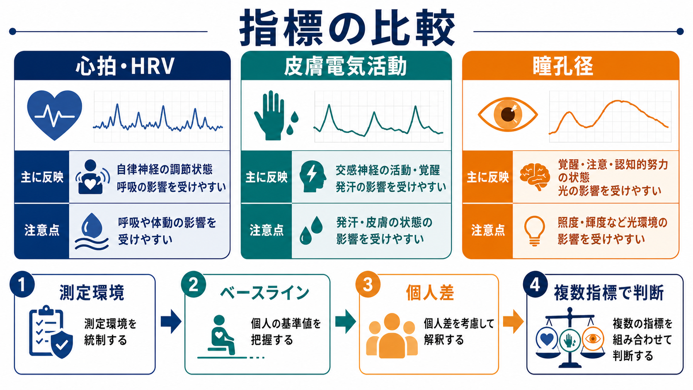
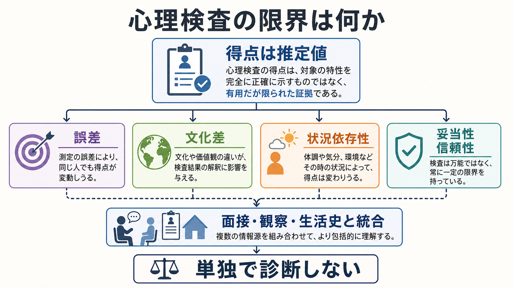

# 生理指標は心理状態をどう反映するのか

## 要点

- 生理指標は、心理状態を直接読む「心のメーター」ではなく、課題、身体、環境、測定手続きに影響された身体反応から心理過程を推論するための観測値である。
- 心拍・心拍変動、皮膚電気活動、瞳孔径は、それぞれ自律神経調節、交感神経性覚醒、注意・努力・覚醒などに関係するが、どれも一対一に心理状態へ対応しない[1][2][3]。
- 解釈の中心は、単一指標の大小ではなく、研究仮説、ベースライン、時間構造、測定環境、個人差、複数指標の収束にある。
- 心理計測として使うには、[[心理測定とは何か]]や[[構成概念妥当性とは何か]]と同じく、「何を測ったことにするのか」という測定モデルを明示する必要がある。
- 臨床や教育への応用では、研究で示された群平均の関連と、個人への診断・介入判断を混同しない。

## この記事で答える問い

この記事では、次の問いに答える。

1. 心拍、皮膚電気活動、瞳孔径は、どのような身体メカニズムを通じて心理状態と関係するのか。
2. これらの指標から「不安」「注意」「努力」「覚醒」などをどこまで推論できるのか。
3. 生理指標を心理測定として使うとき、どのような統制、前処理、妥当性の確認が必要なのか。
4. 研究・臨床・教育応用で、どのような誤解を避けるべきか。

## まず結論

生理指標は、心理状態を直接測るものではない。より正確には、心理状態、課題要求、身体状態、環境条件が神経系・内分泌系・感覚運動系に及ぼした影響を、身体の一部として観測したものである。したがって、心拍が上がったから不安、皮膚電気活動が高いからストレス、瞳孔が大きいから興味がある、とは単純には言えない。

それでも、生理指標は強力である。質問紙や面接では捉えにくい時間的変化、無自覚な覚醒、課題中の努力、刺激への定位反応、感情喚起の強さなどを、ミリ秒から秒単位で追えるからである[1][4]。重要なのは、「この指標は何を反映しているか」ではなく、「この課題、この統制、この参加者群、この分析窓で、その指標変化をどの心理過程の証拠として読むのが妥当か」と問うことである。

## 背景

心理学は、長く質問紙、行動課題、面接、観察によって心的過程を推定してきた。しかし、情動や注意、努力、疲労、ストレス反応は、本人が言語化できない場合や、言語化できても[[反応バイアスとは何か]]の影響を受ける場合がある。そこで、身体反応を心理過程の手がかりとして使う心理生理学が発展してきた。

心理生理学の基本的な発想は、心理過程が脳と身体の調節過程を伴うということである。怖い刺激を見れば心拍や皮膚電気活動が変わり、難しい課題に取り組めば瞳孔径が変わり、呼吸や姿勢の変化は心拍変動を変える[8]。ここで難しいのは、同じ身体反応が複数の心理過程から生じうる点である。覚醒、注意、運動準備、温度、カフェイン、睡眠不足、測定装置への緊張は、いずれも生理指標を変えうる。

そのため、生理指標を使う研究は、[[実験計画における統制とは何か]]と密接に関係する。刺激条件、照明、室温、姿勢、呼吸、測定時間、ベースライン、順序効果、除外基準をそろえなければ、心理状態の差ではなく測定条件の差を読んでしまう。

## 基本概念

### 生理指標

生理指標とは、心拍、心拍変動、皮膚電気活動、瞳孔径、脳波、筋電、呼吸、ホルモンなど、身体から測定される量を心理過程の推論に使う指標である。この記事では、とくに基礎心理学・認知科学でよく使われる心拍・心拍変動、皮膚電気活動、瞳孔径に絞る。

### 覚醒

覚醒は、身体と脳がどれだけ活動準備状態にあるかを表す広い概念である。皮膚電気活動や瞳孔径は覚醒と関係しやすいが、覚醒は快・不快、注意、努力、驚き、運動準備と重なる。したがって、覚醒の高さだけから感情の種類を決めることはできない。

### 自律神経

自律神経は、心拍、血管、発汗、瞳孔、消化などを調節する神経系である。大まかには交感神経と副交感神経に分けられるが、「交感神経はストレス、副交感神経はリラックス」と単純化しすぎると誤解を招く。課題への集中、姿勢、呼吸、運動、体温調節も自律神経指標に影響する。

### ベースライン

ベースラインとは、課題や刺激に先立つ比較基準である。生理指標は個人差が大きいため、絶対値だけで比べるより、同じ人のベースラインからの変化量や、条件間差を使うことが多い。ただし、ベースライン自体も緊張、期待、疲労に影響される。

### 妥当性

生理指標を心理測定として使うときの妥当性とは、「その指標から導いた心理学的解釈が、理論とデータに照らしてどれだけ支持されるか」である。これは[[妥当性とは何か]]や[[構成概念妥当性とは何か]]の問題であり、測定装置の精度だけでは決まらない。

## 仕組み

### 心拍・心拍変動

心拍は、心臓の拍動頻度である。課題負荷、情動喚起、姿勢、運動、呼吸、薬物、睡眠、体温などに影響される。単純な心拍数は活動準備や負荷の粗い指標として使えるが、心理状態との対応はかなり非特異的である。

心拍変動、すなわち HRV は、連続する拍動間隔のゆらぎを扱う。HRV は自律神経調節、とくに副交感神経性の迷走神経調節と関係する指標として広く使われてきた[2][5]。ただし、HRV は呼吸、測定時間、姿勢、年齢、体力、疾患、薬物の影響を強く受ける。短時間 HRV を「ストレスの正確な数値」として読むのは危険であり、測定条件をそろえ、解析指標の意味を限定して使う必要がある[2]。

### 皮膚電気活動

皮膚電気活動、EDA は、汗腺活動によって皮膚の電気的性質が変化する現象である。多くの心理学研究では、皮膚コンダクタンス水準や皮膚コンダクタンス反応として測定される。発汗を介するため、EDA は交感神経性覚醒の代表的な指標とされる[3]。

EDA は、驚き、注意喚起、脅威、情動的刺激、認知的負荷などで変化しやすい。一方で、手の温度、皮膚の乾燥、電極位置、参加者の動き、室温、測定時間にも影響される。EDA は「感情の種類」よりも、「刺激や課題が身体をどれだけ喚起したか」を読むのに向いている。出版推奨では、電極配置、記録方法、前処理、反応定義などを明示することが重視されている[3]。

### 瞳孔径

瞳孔径は、光量に反応するだけでなく、注意、努力、驚き、意思決定、不確実性、覚醒にも影響される。古典的には、認知課題の負荷が高まると瞳孔が拡大することが示され、心理的努力の指標として使われてきた[6]。近年は、瞳孔径が青斑核ノルアドレナリン系、上丘を介した定位反応、前視蓋オリーブ核を介した対光反射など複数の神経機構と関係することが整理されている[7]。

瞳孔径を使うときの最大の注意点は、照明と視覚刺激そのものの影響である。画面輝度、コントラスト、注視位置、瞬目、視線逸脱、眼鏡やコンタクト、カメラ精度が結果に入る。したがって、瞳孔径を心理的努力や覚醒の指標として使うには、視覚条件の統制と前処理が不可欠である[4][7]。

## 図解

生理指標の読み方は、次のように整理できる。

| 指標 | 主に関係する過程 | 強み | 注意点 |
|---|---|---|---|
| 心拍・HRV | 自律神経調節、身体負荷、呼吸、課題要求 | 長時間・日常環境でも測定しやすい | 呼吸、姿勢、運動、年齢、薬物の影響が大きい |
| 皮膚電気活動 | 交感神経性覚醒、定位反応、情動喚起 | 覚醒変化に敏感 | 感情の種類は区別しにくく、皮膚・室温・電極条件に依存する |
| 瞳孔径 | 注意、努力、覚醒、視覚定位 | 課題中の秒単位変化を追いやすい | 照明、画面輝度、視線、瞬目の統制が必須 |

## 臨床・研究との接続

### 研究での使い方

研究では、生理指標は主に三つの目的で使われる。第一に、主観報告では捉えにくい時間変化を測る。第二に、情動・注意・努力などの理論モデルを検証する。第三に、質問紙、行動、神経活動と組み合わせて、構成概念の証拠を増やす。

たとえば、恐怖条件づけ研究では、皮膚電気活動が条件刺激への覚醒反応として使われる。認知負荷研究では、瞳孔径が課題努力の時間的変化を追うために使われる。ストレスや情動調節研究では、心拍や HRV が身体調節の変化を示す指標として使われる。ただし、どの例でも、指標の増減だけでは十分でない。課題操作が理論上どの心理過程を変えるはずか、統制条件との差がどの時点に出るはずか、他の指標とどのように対応するはずかを事前に決める必要がある。

### 臨床・教育での使い方

臨床・教育場面では、生理指標は心理教育、バイオフィードバック、ストレス管理、睡眠・活動リズムの理解などに使われることがある。しかし、研究用の指標をそのまま個人診断に使うことはできない。HRV が低い、EDA が高い、瞳孔反応が大きいという情報は、その人の文脈、身体疾患、薬物、睡眠、活動量、測定環境と合わせて読む必要がある。

精神医学や臨床心理学で生理指標を扱う場合も、教育・研究目的の補助情報として位置づけるのが基本である。個別診断や治療方針は、症状、生活史、面接、行動観察、標準化された評価、医学的検査などを統合して判断されるべきであり、生理指標だけで断定しない。

### 測定設計のチェックリスト

生理指標を使う研究では、少なくとも次を確認する。

1. 測りたい心理過程を明確にする。
2. その心理過程が、対象指標にどう現れるはずかを理論化する。
3. 照明、室温、姿勢、呼吸、活動量、測定時間を可能な範囲で統制する。
4. ベースラインと課題条件を分ける。
5. アーチファクト、瞬目、体動、欠損、外れ値の処理を事前に決める。
6. 複数指標や主観報告、行動指標との対応を見る。
7. 結果を「指標の変化」と「心理状態の推論」に分けて報告する。

この発想は、[[実験研究とは何か]]や[[標準化とは何か]]ともつながる。測定条件が安定していなければ、指標の変化が心理過程によるものか、環境差によるものかを区別しにくい。

## よくある誤解

### 誤解1: 生理指標は主観報告より客観的だから正しい

生理指標は数値として得られるが、数値であることは心理学的解釈の正しさを保証しない。センサーの値は客観的でも、その値を「不安」「集中」「疲労」と読む段階には推論が入る。主観報告、行動、生理指標は互いに置き換えるものではなく、異なる観測窓である。

### 誤解2: 心拍が高いほどストレスが高い

心拍はストレス以外にも、姿勢、運動、発話、カフェイン、睡眠不足、発熱、課題への努力で上がる。心拍数だけでストレスを断定するのではなく、ベースライン、条件差、呼吸、課題内容、主観報告を合わせて読む必要がある。

### 誤解3: 皮膚電気活動で感情の種類がわかる

EDA は覚醒に敏感だが、怒り、恐怖、興味、驚き、認知負荷を単独で区別するのは難しい。感情の種類を知りたいなら、刺激条件、表情、行動、主観評定、他の生理指標を組み合わせる必要がある。

### 誤解4: 瞳孔が大きいほど興味がある

瞳孔は興味だけでなく、照明、画面輝度、認知負荷、驚き、意思決定、覚醒に反応する。視覚刺激の明るさを統制しなければ、心理的興味ではなく画像の明るさを測っている可能性がある。

### 誤解5: AI やウェアラブルなら心理状態を自動推定できる

機械学習は複数の生理信号から状態分類を行えるが、分類精度は学習データ、測定環境、個人差、ラベルの質に依存する。日常環境で得られた高精度分類が、別の人、別の文化、別の課題に一般化するとは限らない。予測性能と心理学的理解は同じではない。

## 関連ノート

既存ノート:

- [[心理測定とは何か]]
- [[構成概念妥当性とは何か]]
- [[妥当性とは何か]]
- [[信頼性とは何か]]
- [[実験計画における統制とは何か]]
- [[実験研究とは何か]]
- [[心理学研究法とは何か]]
- [[反応バイアスとは何か]]
- [[標準化とは何か]]

今後の作成候補:

- 心拍変動とは何か
- 皮膚電気活動とは何か
- 瞳孔径は認知負荷をどう反映するのか
- 心理生理学とは何か
- バイオフィードバックとは何か
- ウェアラブル心理計測の妥当性

MOC 更新候補:

- `content/00_MOC/` 配下の認知科学・心理学系 MOC に「心理生理指標」「心理測定」「実験研究法」関連として追加。
- 並列ジョブとの競合を避けるため、この作業では MOC 本体は更新しない。

## 理解チェック

1. 生理指標が心理状態を「直接測る」と言い切れない理由は何か。
2. HRV をストレス指標として使うとき、呼吸や姿勢を確認すべき理由は何か。
3. 皮膚電気活動が高いとき、感情の種類を単独で判断しにくいのはなぜか。
4. 瞳孔径研究で照明や画面輝度の統制が重要な理由は何か。
5. 生理指標を心理測定として使うとき、[[構成概念妥当性とは何か]]の観点から何を示す必要があるか。

## 未解決問題

- 日常環境で得られるウェアラブル指標を、実験室指標とどの程度同じ意味で扱えるのか。
- 個人内変化を重視するモデルと、集団平均の差を重視するモデルをどう統合するのか。
- 生理指標、自己報告、行動、脳活動が一致しないとき、どれをどの目的で優先すべきか。
- 機械学習による状態推定において、予測精度、説明可能性、公平性、プライバシーをどう両立するのか。

## 参考文献

[1] Cacioppo, J. T., Tassinary, L. G., & Berntson, G. G. (Eds.). (2017). *Handbook of Psychophysiology* (4th ed.). Cambridge University Press. https://doi.org/10.1017/9781107415782

[2] Task Force of the European Society of Cardiology and the North American Society of Pacing and Electrophysiology. (1996). Heart rate variability: Standards of measurement, physiological interpretation, and clinical use. *Circulation, 93*(5), 1043-1065. https://doi.org/10.1161/01.CIR.93.5.1043

[3] Boucsein, W., Fowles, D. C., Grimnes, S., Ben-Shakhar, G., Roth, W. T., Dawson, M. E., & Filion, D. L. (2012). Publication recommendations for electrodermal measurements. *Psychophysiology, 49*(8), 1017-1034. https://doi.org/10.1111/j.1469-8986.2012.01384.x

[4] Mathot, S. (2018). Pupillometry: Psychology, physiology, and function. *Journal of Cognition, 1*(1), 16. https://doi.org/10.5334/joc.18

[5] Shaffer, F., & Ginsberg, J. P. (2017). An overview of heart rate variability metrics and norms. *Frontiers in Public Health, 5*, 258. https://doi.org/10.3389/fpubh.2017.00258

[6] Beatty, J., & Lucero-Wagoner, B. (2000). The pupillary system. In J. T. Cacioppo, L. G. Tassinary, & G. G. Berntson (Eds.), *Handbook of Psychophysiology* (2nd ed., pp. 142-162). Cambridge University Press. https://doi.org/10.1017/CBO9780511546396

[7] Joshi, S., & Gold, J. I. (2020). Pupil size as a window on neural substrates of cognition. *Trends in Cognitive Sciences, 24*(6), 466-480. https://doi.org/10.1016/j.tics.2020.03.005

[8] Bradley, M. M., & Lang, P. J. (2007). Emotion and motivation. In J. T. Cacioppo, L. G. Tassinary, & G. G. Berntson (Eds.), *Handbook of Psychophysiology* (3rd ed., pp. 581-607). Cambridge University Press. https://doi.org/10.1017/CBO9780511546396
