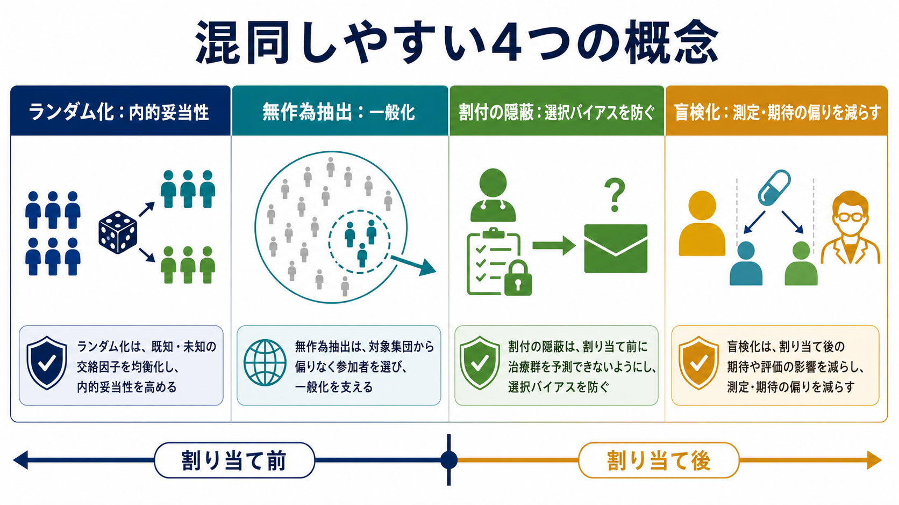
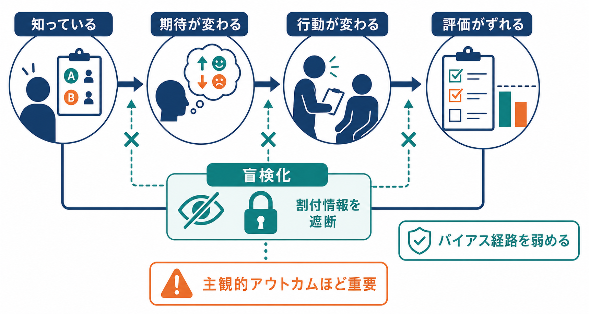
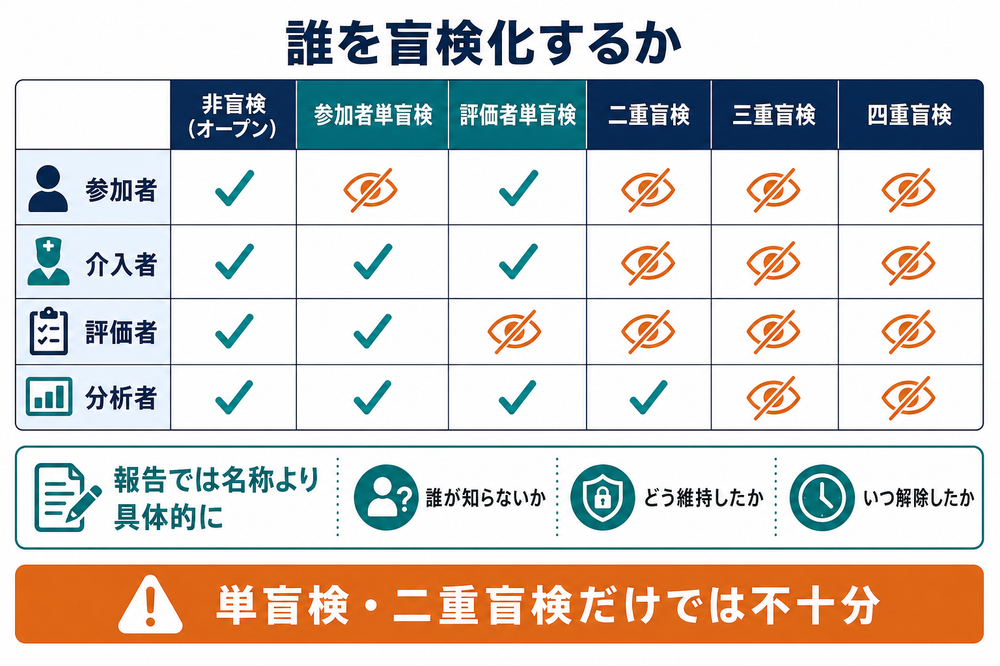

# 盲検化とは何か

## 要点

- 盲検化とは、研究参加者、介入を行う人、アウトカム評価者、データ分析者などが、どの条件・群に割り付けられたかを知らないようにする研究手続きである[1][2]。
- 目的は、期待、失望、治療者の熱意、評価者の先入観、分析時の解釈の偏りが、アウトカムや効果推定に混入することを減らす点にある[2][5][6]。
- 「二重盲検」という名称だけでは不十分で、誰が、いつ、どの情報から、どのように盲検化されたのかを具体的に報告する必要がある[1][3][7]。
- 盲検化は[[実験研究とは何か]]やランダム化比較試験で特に重要だが、すべての研究で完全に可能とは限らない。難しい場合は、独立した評価者、標準化された測定、事前登録された分析計画などでバイアスを減らす[2][3]。
- 盲検化は「ランダム化」や「割付の隠蔽」と同じではない。ランダム化は群を確率的に決める手続きであり、割付の隠蔽は割付前の選択バイアスを防ぎ、盲検化は割付後の期待・行動・評価の偏りを防ぐ。

## この記事で答える問い

1. 盲検化は、研究のどの段階で何を防ぐ手続きなのか。
2. 参加者、介入者、評価者、分析者の盲検化はそれぞれ何を守るのか。
3. 「単盲検」「二重盲検」という言い方にはどのような限界があるのか。
4. 盲検化が難しい研究では、どのような代替策を考えるべきか。

## まず結論

盲検化とは、研究に関わる人が「どの条件に割り付けられたか」を知ることで生じる期待や判断の偏りを抑えるための情報管理である。たとえば、参加者が「自分は新しい治療を受けている」と知ると、症状報告、受診行動、脱落のしやすさが変わるかもしれない。評価者が割付を知っていれば、境界例の判定や尺度評定が無意識に有利な方向へ動くかもしれない[2][5][6]。

したがって、盲検化は単なる形式ではなく、[[反応バイアスとは何か]]、観察者バイアス、測定誤差、[[妥当性とは何か]]の問題と直結する。とくに痛み、気分、機能評価、臨床的改善度、画像や面接の判定など、主観的判断を含むアウトカムでは重要度が高い[2][5][6]。

## 背景

研究結果は、介入そのものだけで決まるわけではない。参加者が何を期待するか、介入者がどの群へどれだけ丁寧に関わるか、評価者がどの結果を「改善」と読むか、分析者が境界的な解析判断をどう選ぶかによっても変わりうる。盲検化は、この「研究者や参加者が知っていること」が結果に影響する経路を遮断しようとする手続きである。

CONSORT 2010 は、ランダム化比較試験の報告において、割付後に誰が盲検化されたか、どのように盲検化されたかを明記するよう求める[1]。SPIRIT 2013 も、試験プロトコルの段階で参加者、ケア提供者、アウトカム評価者、データ分析者の誰を盲検化するかを計画に書くことを求めている[3]。つまり盲検化は、論文を書いた後に付け加える説明ではなく、研究設計の段階で組み込むべき方法論である。

経験的にも、盲検化や割付の隠蔽が不十分な研究では、介入効果が大きく見積もられやすいことが示されてきた。Schulz らは、割付の隠蔽が不十分または不明確な試験で効果推定が大きくなり、二重盲検でない試験でも効果が大きく見積もられる傾向を報告した[4]。後続の系統的レビューでも、非盲検のアウトカム評価者は、主観的アウトカムでより楽観的な効果推定を生みやすいことが示されている[5][6]。

## 基本概念

### 盲検化

盲検化は、割付情報を知られると行動や判断が変わりうる人から、その情報を隠す手続きである。医学領域では masking という語も使われる。眼科領域などでは blind という語が不適切または混乱を招くことがあるため、masking が好まれる場合がある[2]。

盲検化の対象は一種類ではない。典型的には次の人々が問題になる。

| 対象 | 盲検化で減らしたい偏り |
|---|---|
| 参加者 | 期待、失望、症状報告の変化、併用介入の探索、脱落 |
| 介入者・ケア提供者 | 接し方、説明量、追加ケア、遵守支援の差 |
| アウトカム評価者 | 境界例の判定、尺度評定、診断・画像・面接評価の偏り |
| データ分析者 | 解析選択、外れ値処理、サブグループ解釈の偏り |

### 単盲検・二重盲検・三重盲検

単盲検、二重盲検、三重盲検という語は便利だが、曖昧である。二重盲検と言っても、参加者と介入者なのか、参加者と評価者なのか、評価者と分析者なのかは論文によって異なる。Haahr と Hróbjartsson の調査では、「double blind」と書かれた試験でも、患者、医療提供者、データ収集者の盲検化状態が明示されているものはごく少数だった[7]。

そのため、記事や論文では「二重盲検だった」と書くだけでは足りない。よりよい書き方は、「参加者とアウトカム評価者は割付を知らなかったが、介入者は介入内容を知っていた」のように、誰が何を知らなかったかを具体的に書くことである[1][2][7]。

### 割付の隠蔽との違い

割付の隠蔽は、参加者をどの群に入れるかが決まる前に、割付列を予測・操作されないようにする手続きである。これは、研究へ入る人が選ばれる段階の選択バイアスを防ぐ。盲検化は、割付後に参加者や研究者が群を知ることで生じる行動・測定・解釈の偏りを防ぐ[3][4]。

この区別は重要である。割付の隠蔽が失敗すると、そもそも群の比較可能性が崩れる。盲検化が失敗すると、割付後の行動、測定、解析が群ごとに系統的に変わる。どちらも研究の[[信頼性とは何か]]と妥当性を損なうが、働く段階が異なる。

## 仕組み

盲検化が効くのは、情報が行動と判断を変えるからである。典型的な経路は次のように整理できる。

1. 参加者や評価者が割付情報を知る。
2. 「効くはず」「効かないはず」「新しい介入だから良いはず」という期待が生じる。
3. 参加者の症状報告、遵守、脱落、追加治療の探索が変わる。
4. 介入者の説明量、観察頻度、支援の熱量が変わる。
5. 評価者の尺度評定、診断判断、イベント判定が変わる。
6. 結果として、介入そのもの以外の差が効果推定に混入する。

Cochrane RoB 2 では、参加者・介入者・ケア提供者が割付を知ることは「意図した介入からの逸脱」によるバイアスと関係づけられ、アウトカム評価者が割付を知ることは「アウトカム測定」によるバイアスと関係づけられる[2]。この整理は、盲検化を一つのラベルではなく、どのバイアス経路を遮断するかという観点で読む助けになる。

とくに主観的アウトカムでは、盲検化の有無が結果に影響しやすい。Hróbjartsson らの BMJ の系統的レビューでは、主観的な二値アウトカムを非盲検評価者が評価した場合、盲検評価よりも介入に有利な方向へ効果が誇張される傾向が報告された[5]。CMAJ のレビューでも、主観的尺度アウトカムで非盲検評価者による効果推定がより有利になることが示されている[6]。

## 図解

次の図は、盲検化の対象を「誰が割付情報を知らないか」という観点で整理したものである。名称よりも、参加者、介入者、評価者、分析者それぞれの情報状態を確認することが重要である。

この図で注意したいのは、盲検化の階層が多いほど常に良い、という単純な話ではない点である。外科的介入、心理療法、教育介入、運動介入のように、介入者や参加者を盲検化しにくい研究は多い。その場合でも、アウトカム評価者を独立させる、評価基準を事前に定める、可能な限り自動測定を使う、分析者には群ラベルを伏せる、といった部分的な盲検化は可能な場合がある[2][3]。

## 臨床・研究との接続

臨床試験では、盲検化はプラセボ効果や期待効果だけでなく、ケアの差、追加治療、脱落、イベント判定の差を減らすために使われる。薬剤試験では、見た目や味が似たプラセボ、同じスケジュールの投与、割付を知らない評価者などが典型的である。ただし、副作用が強い薬では、参加者や医療者が群を推測できてしまうことがある。この場合、形式上は盲検化されていても、実質的な盲検化が破れている可能性を検討する必要がある[2]。

心理学・認知科学では、盲検化は[[心理測定とは何か]]や[[社会的望ましさバイアスとは何か]]ともつながる。質問紙研究では、参加者が仮説を推測すると、望ましい回答や研究者の期待に沿った回答が増えるかもしれない。実験研究では、実験者が条件を知っているだけで、説明、表情、声かけ、フィードバック、試行の扱いが微妙に変わることがある。こうした期待効果を減らすには、実験者を条件に対して盲検化する、教示を標準化する、反応記録を自動化する、評価者を別にするなどの設計が役立つ。

観察研究では、介入割付そのものがないため、ランダム化比較試験の意味での盲検化はそのまま適用しにくい。しかし、[[観察研究とは何か]]でも、評価者が曝露状態や仮説を知らずにアウトカムを判定する、コーディング担当者が群や時点を知らない、分析者が主要解析を事前に固定する、といった方法で評価バイアスを減らせる。

## よくある誤解

### 「二重盲検なら十分」

不十分である。二重盲検という語だけでは、誰が盲検化されていたのかがわからない。参加者と介入者が盲検化されていても、アウトカム評価者が割付を知っていれば測定バイアスが残る。逆に、参加者と介入者の盲検化が無理でも、独立評価者の盲検化は可能な場合がある[1][2][7]。

### 「客観的アウトカムなら盲検化はいらない」

場合による。死亡のように判断の余地が小さいアウトカムでは、評価者の期待が測定値を直接変える余地は比較的小さい。一方、入院、治療中止、紹介、追加検査の実施などは、医療者の判断そのものがアウトカムに含まれるため、割付を知っていることが結果に影響しうる[2]。

### 「盲検化は心理的効果だけを消す」

盲検化が減らすのは心理的期待だけではない。追加治療の探索、遵守、脱落、介入者の対応、評価者の判定、分析者の判断など、研究過程の複数段階に関わる。したがって、盲検化は「プラセボ対策」だけでなく、研究の測定と比較を守る設計である。

### 「盲検化できない研究は価値がない」

そうではない。盲検化が不可能または倫理的に難しい研究でも、研究価値はある。ただし、その場合はリスクを明示し、評価者盲検化、標準化、事前登録、独立判定委員会、客観的測定、感度分析などで補う必要がある[2][3]。

## 関連ノート

- [[実験研究とは何か]]
- [[観察研究とは何か]]
- [[反応バイアスとは何か]]
- [[社会的望ましさバイアスとは何か]]
- [[心理測定とは何か]]
- [[妥当性とは何か]]
- [[信頼性とは何か]]

### MOC更新候補

- `content/00_MOC/MOC｜研究方法.md`
- `content/00_MOC/MOC｜認知科学・心理学.md`
- `content/00_MOC/MOC｜統計・医療統計.md`

並列ジョブとの競合を避けるため、本記事では MOC 本体の更新は行わない。

## 理解チェック

1. 盲検化と割付の隠蔽は、研究のどの段階で働く手続きか。
2. 参加者が割付を知ると、どのような行動や報告が変わりうるか。
3. アウトカム評価者の盲検化が特に重要になるアウトカムはどのようなものか。
4. 「二重盲検」と書かれている論文を読むとき、追加で何を確認すべきか。
5. 参加者と介入者を盲検化できない研究で、残せる工夫は何か。

## 未解決問題

- 盲検化の成功を事後的に質問することは、群の推測可能性を知る助けになる一方、アウトカムや副作用から自然に推測できた結果を過剰に「盲検化失敗」と読む危険もある。
- 心理療法、教育、リハビリテーション、行動介入では、参加者と介入者の盲検化が難しい。どの程度まで評価者盲検化や標準化で補えるかは、アウトカムの種類に依存する。
- 分析者盲検化は有用だが、現実のデータクリーニング、欠測処理、探索的解析とどう両立させるかは、研究計画の透明性とセットで検討する必要がある。

## 参考文献

[1] Schulz, K. F., Altman, D. G., Moher, D., & CONSORT Group. (2010). CONSORT 2010 Statement: updated guidelines for reporting parallel group randomised trials. *BMJ*, 340, c332. https://doi.org/10.1136/bmj.c332

[2] Higgins, J. P. T., Savović, J., Page, M. J., Elbers, R. G., & Sterne, J. A. C. (2024). Chapter 8: Assessing risk of bias in a randomized trial. In *Cochrane Handbook for Systematic Reviews of Interventions version 6.5*. https://www.cochrane.org/authors/handbooks-and-manuals/handbook/current/chapter-08

[3] Chan, A. W., Tetzlaff, J. M., Gøtzsche, P. C., Altman, D. G., Mann, H., Berlin, J. A., et al. (2013). SPIRIT 2013 explanation and elaboration: guidance for protocols of clinical trials. *BMJ*, 346, e7586. https://doi.org/10.1136/bmj.e7586

[4] Schulz, K. F., Chalmers, I., Hayes, R. J., & Altman, D. G. (1995). Empirical evidence of bias: dimensions of methodological quality associated with estimates of treatment effects in controlled trials. *JAMA*, 273(5), 408-412. https://doi.org/10.1001/jama.1995.03520290060030

[5] Hróbjartsson, A., Thomsen, A. S. S., Emanuelsson, F., Tendal, B., Hilden, J., Boutron, I., Ravaud, P., & Brorson, S. (2012). Observer bias in randomised clinical trials with binary outcomes: systematic review of trials with both blinded and non-blinded outcome assessors. *BMJ*, 344, e1119. https://doi.org/10.1136/bmj.e1119

[6] Hróbjartsson, A., Thomsen, A. S. S., Emanuelsson, F., Tendal, B., Rasmussen, J. V., Hilden, J., Boutron, I., Ravaud, P., & Brorson, S. (2013). Observer bias in randomized clinical trials with measurement scale outcomes: a systematic review of trials with both blinded and nonblinded assessors. *CMAJ*, 185(4), E201-E211. https://doi.org/10.1503/cmaj.120744

[7] Haahr, M. T., & Hróbjartsson, A. (2006). Who is blinded in randomized clinical trials? A study of 200 trials and a survey of authors. *Clinical Trials*, 3(4), 360-365. https://doi.org/10.1177/1740774506069153
