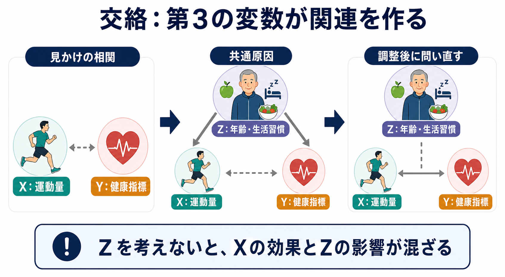
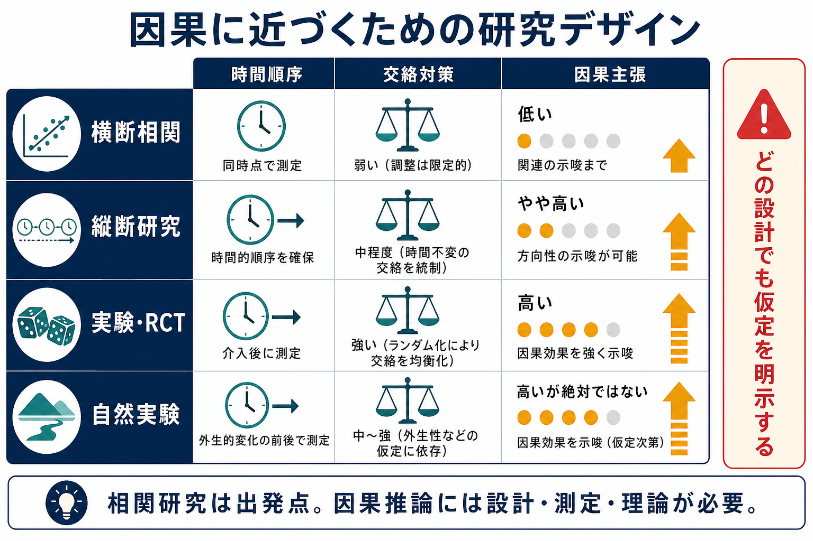

# 相関研究で因果を言えないのはなぜか

## 要点

- 相関は「2つの変数が一緒に変わる」ことを示すが、「片方を変えればもう片方が変わる」ことまでは示さない。
- 因果を言うには、少なくとも時間順序、交絡の扱い、測定の妥当性、研究デザイン、背景理論が必要になる。
- 交絡とは、第3の変数が原因側と結果側の両方に影響して、見かけの関連を作ることである。
- 逆因果とは、研究者が想定した向きとは反対に、結果側が原因側に影響している可能性である。
- 統計的に「調整した」だけでは十分でない。何を調整すべきか、何を調整してはいけないかは、因果構造の仮定に依存する。

## この記事で答える問い

1. 相関研究は何を示し、何を示さないのか。
2. なぜ交絡や逆因果が因果解釈を難しくするのか。
3. 統計調整、縦断研究、実験研究はどのように因果推論を強めるのか。
4. 心理学・臨床研究で相関を読むとき、どこに注意すべきか。

## まず結論

相関研究で因果を言えないのは、同じデータパターンを説明する因果物語が複数ありうるからである。たとえば「不安が睡眠不足を引き起こす」という関連が観察されても、睡眠不足が不安を高めているのかもしれないし、仕事負荷、身体疾患、薬物使用、生活リズムの乱れのような第3の変数が両方に影響しているのかもしれない。

因果主張とは、単なる関連の報告ではなく、「もし介入して X を変えたなら、Y がどの程度変わるか」という反事実的な問いに答えようとする主張である[1][2]。したがって、相関研究は因果仮説の出発点にはなるが、それだけでは因果効果の推定には届かない。

## 背景

心理学や認知科学では、操作できない変数が多い。年齢、発達歴、家庭環境、社会経済的地位、臨床症状、パーソナリティ、トラウマ経験などは、倫理的にも実務的にもランダムに割り当てることが難しい。そのため、多くの研究は観察データや質問紙データに基づく相関研究になる。

相関研究が不要という意味ではない。むしろ相関研究は、現象の記述、仮説生成、尺度の妥当性検討、リスク因子候補の発見に不可欠である。問題は、相関研究が示した「関連」を、すぐに「原因」と読み替えることである。Rohrer は、心理学で観察データから因果を考えるには、DAG などの因果グラフを使って交絡、媒介、合流点を区別する必要があると論じている[3]。

## 基本概念

### 相関

相関とは、ある変数 X が大きい人ほど、別の変数 Y も大きい、または小さいという統計的な関連である。相関係数、回帰係数、群間差、オッズ比、リスク比など、指標の形は違っても、観察データがまず示すのは「関連」である。

たとえば、抑うつ症状得点と睡眠時間に負の相関があるなら、「抑うつ症状が高い人ほど睡眠時間が短い傾向がある」とは言える。しかし、それだけで「抑うつが睡眠不足を引き起こした」とは言えない。

### 因果

因果とは、X を変える介入が Y を変える、という関係である。因果推論の文脈では、同じ人が「X を受けた場合」と「X を受けなかった場合」にどのような結果を示したか、という反事実的な比較が中心になる[1][4]。現実には同じ人の2つの状態を同時に観察できないため、研究デザインと仮定によって、その比較に近づく。

### 交絡

交絡とは、第3の変数 Z が X と Y の両方に影響し、X と Y の間に見かけの関連を作ることである。典型的には、次のような構造で表せる。

$$
Z \rightarrow X,\quad Z \rightarrow Y
$$

このとき、X と Y が相関していても、その相関は X が Y を変えたからではなく、Z が両方を動かしたために生じている可能性がある。

### 逆因果

逆因果とは、研究者が「X が Y に影響する」と考えているときに、実際には Y が X に影響している可能性である。たとえば「孤独感が SNS 使用時間を増やす」と見える相関があっても、SNS 使用による睡眠不足や対人比較が孤独感を高めている可能性もある。

### 媒介と合流点

媒介変数は、X の効果が Y に届く途中にある変数である。一方、合流点は2つ以上の変数から影響を受ける変数であり、これを不用意に統制すると、本来なかった関連を作ることがある[3]。したがって、「関連する変数は全部入れて調整する」という発想は危険である。

## 仕組み

### 1. 同じ相関に複数の因果構造が対応する

X と Y が相関しているとき、少なくとも次の説明がありうる。

| 観察された関連 | ありうる説明 | 因果解釈上の問題 |
|---|---|---|
| X と Y が相関する | X が Y を引き起こす | 目的の仮説 |
| X と Y が相関する | Y が X を引き起こす | 逆因果 |
| X と Y が相関する | Z が X と Y の両方を動かす | 交絡 |
| X と Y が相関する | 測定誤差や選択バイアスが関連を歪める | 測定・標本の問題 |

相関係数だけを見ても、これらの説明は区別できない。因果を言うには、データの形だけでなく、時間、測定、設計、理論を合わせて検討する必要がある。

### 2. 交絡は「効果」と「背景差」を混ぜる

たとえば、運動量 X と健康指標 Y に正の相関があるとする。ここから「運動量を増やせば健康になる」と言いたくなる。しかし、年齢、食習慣、所得、慢性疾患、睡眠、医療アクセスなどが運動量と健康指標の両方に関係していれば、運動の効果と背景差が混ざる。

傾向スコアは、観察研究で処置を受ける確率を共変量から要約し、観察された共変量に関する群間差を調整する代表的な方法である[5]。ただし、傾向スコアも「観察され、正しく測定された交絡因子」への対処であり、未測定交絡を自動的に消すものではない。

### 3. 逆因果は横断研究で特に見えにくい

同じ時点で X と Y を測る横断研究では、どちらが先に起きたかが分からない。睡眠不足と不安、身体活動と気分、自己効力感と学業成績のように、双方向に影響しうる変数では特に注意が必要である。

縦断研究では時間順序を確認しやすくなるが、それでも交絡がなくなるわけではない。時間的に先行していても、その前から存在する第3の要因が X と Y の両方を作っている可能性は残る。

### 4. 統計調整は設計の代わりではない

回帰分析で共変量を入れると、交絡に対処しているように見える。しかし、何を調整すべきかは、因果構造の仮定に依存する。交絡因子は調整候補になるが、媒介変数を調整すると総効果の一部を消してしまう。合流点を調整すると、かえって偽の関連を作る場合もある[3]。

Pearl は、因果推論では統計的関連だけでなく、介入、反事実、因果仮定を明示する言語が必要だと整理している[2]。つまり、因果推論は「高度な回帰式」ではなく、「どの世界を比較したいのか」を明確にする作業である。

## 図解

図1は、運動量と健康指標の相関が、年齢・生活習慣という共通原因によって生じうることを示している。重要なのは、X と Y の間に線が見えても、それが X から Y への効果とは限らない点である。

図2は、研究デザインによって因果主張の強さが変わることをまとめている。横断相関は出発点として有用だが、因果主張は弱い。縦断研究は時間順序を補う。実験・RCT はランダム化によって交絡を均衡化しやすい。自然実験は、外生的な変化を利用して因果仮説に近づく。ただし、どの設計でも仮定は残る。

## 臨床・研究との接続

臨床研究では、相関はリスク評価や仮説生成に役立つ。たとえば、ある心理尺度の得点が将来の症状悪化と関連するなら、支援が必要な集団を見つける手がかりになる。しかし、その尺度得点を下げる介入が症状を改善するとは限らない。尺度が単に重症度、社会的困難、併存症、医療アクセスの違いを反映している可能性がある。

心理測定の文脈では、相関は[[基準関連妥当性とは何か]]や[[構成概念妥当性とは何か]]の証拠として使われる。しかし、妥当性の証拠としての相関と、介入効果としての因果は別の問いである。[[心理測定とは何か]]や[[妥当性とは何か]]で扱うように、測定値の意味を確かめることと、測定値を変えたときの結果を推定することは区別する必要がある。

観察研究を報告するときは、STROBE 声明のように、研究デザイン、対象者、変数、バイアス、研究サイズ、統計手法、交絡への対応を透明に記述することが求められる[6]。透明な報告は因果を保証しないが、読者が限界を評価するための前提になる。

## よくある誤解

### 誤解1: 相関が強ければ因果である

相関が強いほど因果仮説は注目に値するが、強い相関だけでは交絡や逆因果を排除できない。Bradford Hill は、関連の強さ、時間性、一貫性、生物学的もっともらしさなどを含む観点を提案したが、それらは機械的な判定基準ではなく、因果判断の手がかりである[7]。

### 誤解2: 時間的に先に測れば因果である

時間順序は重要だが、それだけでは十分でない。X が Y より先に測られていても、X より前から存在する Z が X と Y の両方に影響していれば、交絡は残る。

### 誤解3: 共変量をたくさん入れればよい

共変量を多く入れるほどよいとは限らない。交絡因子を入れないと偏るが、媒介変数や合流点を入れると別の偏りが生じることがある[3]。重要なのは変数の数ではなく、因果構造に照らして調整の意味を説明できることである。

### 誤解4: RCT なら必ず因果が確定する

ランダム化比較試験は因果推論を強く支えるが、脱落、遵守不良、測定誤差、盲検化の失敗、対象集団の限定、介入の実装差などの問題は残る。RCT は強い設計であって、無条件の真理製造機ではない。

### 誤解5: 因果を言えないなら相関研究には価値がない

相関研究は、現象の地図を作り、重要な仮説を見つけ、尺度や理論の妥当性を検討するために重要である。問題は、相関研究を過小評価することではなく、相関研究が答えられる問いと答えられない問いを混同しないことである。

## 関連ノート

既存ノートとして接続できるもの:

- [[心理測定とは何か]]
- [[妥当性とは何か]]
- [[構成概念妥当性とは何か]]
- [[基準関連妥当性とは何か]]
- [[信頼性とは何か]]
- [[因子分析とは何か]]

今後の作成候補:

- 交絡とは何か
- 逆因果とは何か
- 観察研究とは何か
- ランダム化比較試験とは何か
- DAGとは何か
- 傾向スコアとは何か

MOC更新候補:

- `content/00_MOC/` 配下の心理学研究法・統計・心理測定に関する MOC
- 研究方法論、統計、因果推論を扱う索引ページ

## 理解チェック

1. 「睡眠時間と抑うつ症状が相関する」と「睡眠不足が抑うつを引き起こす」は何が違うか。
2. 交絡因子とはどのような変数か。例を1つ挙げる。
3. 横断研究で逆因果が問題になりやすい理由は何か。
4. 「共変量をたくさん入れるほどよい」という考え方の危険は何か。
5. RCT が相関研究より因果推論に強い理由と、それでも残る限界は何か。

## 未解決問題

- 心理学の複雑な構成概念では、どの変数を交絡、媒介、合流点として扱うべきかが理論的に曖昧なことが多い。
- 未測定交絡をどの程度まで感度分析で評価できるかは、研究領域と測定可能性に依存する。
- 心理尺度の測定誤差や[[信頼性とは何か]]の問題が、因果効果の推定にどの程度影響するかを、研究ごとに明示する必要がある。
- 因果推論の方法を使っても、推定対象が「誰に、どの介入を、どの状況で行った場合の効果か」を明確にしなければ、臨床や教育への一般化は難しい。

## 参考文献

[1] Hernán, M. A., & Robins, J. M. (2024). *Causal Inference: What If*. Taylor & Francis. https://www.hsph.harvard.edu/miguel-hernan/causal-inference-book/

[2] Pearl, J. (2009). Causal inference in statistics: An overview. *Statistics Surveys, 3*, 96-146. https://doi.org/10.1214/09-SS057

[3] Rohrer, J. M. (2018). Thinking clearly about correlations and causation: Graphical causal models for observational data. *Advances in Methods and Practices in Psychological Science, 1*(1), 27-42. https://doi.org/10.1177/2515245917745629

[4] Rubin, D. B. (1974). Estimating causal effects of treatments in randomized and nonrandomized studies. *Journal of Educational Psychology, 66*(5), 688-701. https://doi.org/10.1037/h0037350

[5] Rosenbaum, P. R., & Rubin, D. B. (1983). The central role of the propensity score in observational studies for causal effects. *Biometrika, 70*(1), 41-55. https://doi.org/10.1093/biomet/70.1.41

[6] von Elm, E., Altman, D. G., Egger, M., Pocock, S. J., Gøtzsche, P. C., Vandenbroucke, J. P., & STROBE Initiative. (2007). The Strengthening the Reporting of Observational Studies in Epidemiology (STROBE) statement: Guidelines for reporting observational studies. *PLoS Medicine, 4*(10), e296. https://doi.org/10.1371/journal.pmed.0040296

[7] Hill, A. B. (1965). The environment and disease: Association or causation? *Proceedings of the Royal Society of Medicine, 58*(5), 295-300. https://doi.org/10.1177/003591576505800503
