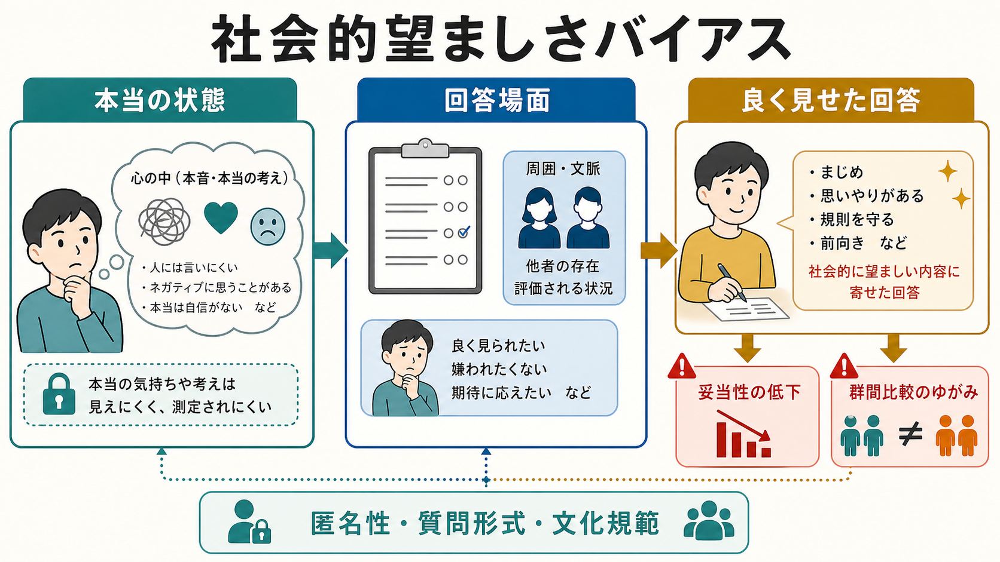
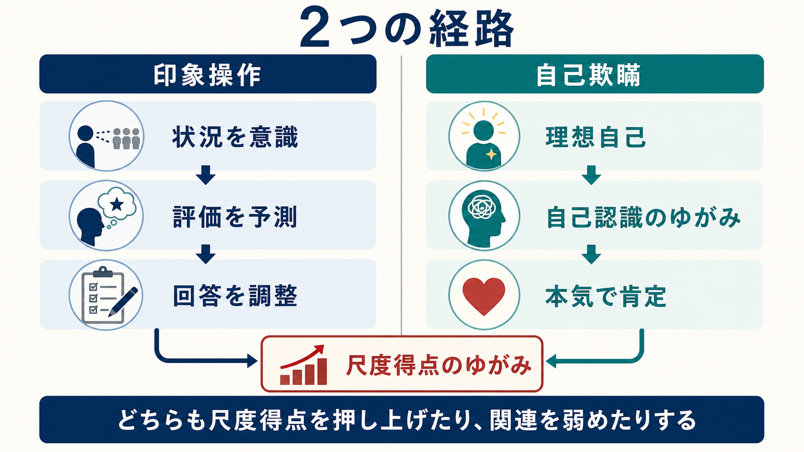
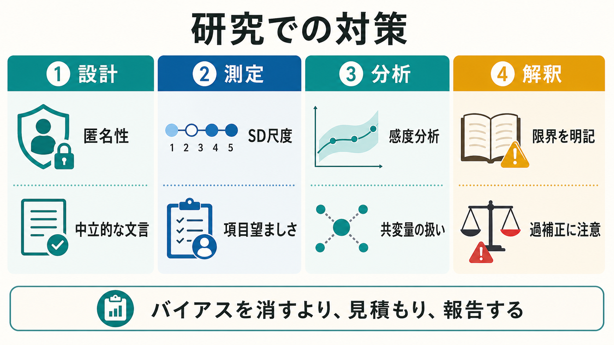

# 社会的望ましさバイアスとは何か

## 要点

- 社会的望ましさバイアスとは、回答者が「実際の状態」よりも社会的に好ましく見える方向へ自己報告を寄せる反応傾向である。
- 心理測定では、自己報告尺度の平均、分散、相関、群間比較、因子構造、カットオフ解釈をゆがめる可能性がある。
- 古典的には Marlowe-Crowne Social Desirability Scale が広く使われ、近年は印象操作と自己欺瞞を分ける多次元的な見方が重視される[1][2]。
- 対策は「バイアスを完全に消す」ことではなく、設計、測定、分析、報告の各段階で影響を小さくし、限界として明示することである[3][4]。

## この記事で答える問い

1. 社会的望ましさバイアスは、単なる嘘や見栄とどう違うのか。
2. なぜ自己報告尺度や質問紙研究で問題になるのか。
3. 印象操作と自己欺瞞はどのように違うのか。
4. 研究・臨床でどのように検出し、軽減し、報告すればよいのか。

## まず結論

社会的望ましさバイアスは、「自分を良く見せたい」という意図的な操作だけではない。人は、他者から評価される場面では恥ずかしい内容を控えめに報告し、道徳的・健康的・協力的・有能に見える内容を強めに報告しやすい。さらに、本人が意識していなくても、理想的な自己像に沿って自分を理解しているために、好ましい自己記述を本気で信じている場合もある[2][5]。

このため、社会的望ましさバイアスは[[心理測定とは何か|心理測定]]の小さなノイズではなく、[[妥当性とは何か|妥当性]]の問題である。尺度得点が安定していても、それが測りたい構成概念ではなく「良く見せたさ」や「社会規範への同調」を反映しているなら、得点解釈は弱くなる。特に、自己報告だけで独立変数と従属変数を同時に測る研究では、共通方法バイアスとも結びつきやすい[4]。

## 背景

心理学、精神医学、教育、組織研究、疫学調査では、質問紙や面接で「本人に聞く」方法が頻繁に使われる。自己報告は、本人の経験、感情、価値観、症状、行動意図を効率よく集められる強力な方法である。一方で、回答は単に内面を写し取るものではない。回答者は質問の意味を解釈し、自分の記憶を検索し、どこまで開示するかを判断し、選択肢に変換して答える。

社会的望ましさが問題になるのは、この回答過程に「他者からどう見られるか」「自分はどうあるべきか」という評価軸が入り込むからである。違法行為、性行動、薬物使用、差別的態度、攻撃性、怠惰、依存、治療遵守、育児や介護の困難など、恥・責任・評価が関わる項目ほど、報告は状況に左右されやすい[6]。

## 基本概念

### 社会的望ましさ

社会的望ましさとは、ある回答や性質が、その文化・集団・場面で「良い」「成熟している」「道徳的である」「問題が少ない」と評価されやすい程度である。たとえば「いつも他者に親切である」「規則を必ず守る」「怒りを感じない」といった項目は、現実には誰にでも例外があるにもかかわらず、好ましい自己像と結びつきやすい。

Crowne と Marlowe は、精神病理から独立した社会的望ましさ尺度を作成し、文化的に承認される方向へ回答する傾向を測ろうとした[1]。この流れは、人格検査や態度調査における反応スタイル研究の基礎になった。

### 反応バイアス

反応バイアスとは、測りたい内容とは別の理由で回答が一定方向へ偏ることを指す。社会的望ましさバイアスはその一種であり、黙従傾向、極端反応、中心化傾向、同一選択肢の連続回答などとは区別される。ただし、実際のデータでは複数の反応スタイルが同時に混ざるため、単独の指標だけで原因を断定するのは難しい。

### 印象操作

印象操作は、他者にどう見えるかを意識し、意図的に回答を調整する過程である。就職選考、評価面接、学校調査、臨床初回面接、研究者が目の前にいる調査などでは、回答者は「正直に答えたら不利になるかもしれない」と感じやすい。Paulhus は、社会的望ましさ反応を印象操作と自己欺瞞に分ける二成分モデルを示し、多くの尺度研究に影響を与えた[2]。

### 自己欺瞞

自己欺瞞は、本人が意図的に嘘をついているというより、好ましい自己像を本気で信じている状態に近い。たとえば、自分は公平で合理的だと強く思っている人が、実際の行動や他者評価とはずれていても、その自己理解に沿って回答する場合がある。これは[[自己奉仕バイアスとは何か|自己奉仕バイアス]]や動機づけられた推論とも接続する。

## 仕組み

社会的望ましさバイアスは、少なくとも三つの段階で生じる。

第一に、質問の内容が社会的評価を呼び起こす。症状、攻撃性、依存、差別、性的行動、倫理的行動、育児・介護の困難などは、回答者にとって「どう答えるべきか」が見えやすい。

第二に、回答場面が自己呈示を強める。匿名性が低い、面接者がいる、所属組織や治療者に結果が伝わる可能性がある、報酬や不利益が想定される、といった条件では印象操作が起こりやすい[6]。

第三に、本人の自己理解そのものが理想化される。これは自己欺瞞に近い経路であり、回答者は意図的にごまかしているわけではない。だからこそ、単に「正直に答えてください」と書くだけでは十分でない。

測定上は、次のような影響が起こる。

| 影響 | 例 | 解釈上の問題 |
|---|---|---|
| 平均の偏り | 望ましい行動を高く、望ましくない行動を低く報告する | 実際の水準を過大・過小評価する |
| 分散の縮小 | 多くの人が「良い回答」に寄る | 個人差や群間差が見えにくくなる |
| 相関のゆがみ | 2つの尺度が同じ望ましさを共有する | 構成概念間の関連を過大評価する |
| 因子構造の混入 | 内容因子とは別に望ましさ因子が出る | [[構成概念妥当性とは何か|構成概念妥当性]]が弱くなる |
| カットオフの誤用 | 症状を低く見せる、適応を高く見せる | スクリーニングや群分けが不安定になる |

## 図解

3枚の図は、次のように読むとよい。

| 図 | 読み方 |
|---|---|
| 図1 | 本当の状態、回答場面、良く見せた回答の間に、評価状況・匿名性・文化規範が入ることを示す。 |
| 図2 | 印象操作と自己欺瞞という二つの経路が、どちらも尺度得点をゆがめうることを示す。 |
| 図3 | 研究では設計、測定、分析、解釈の各段階で対策を分ける必要があることを示す。 |

## 臨床・研究との接続

### 心理尺度作成

[[心理尺度はどのように作られるのか|心理尺度作成]]では、項目の社会的望ましさを初期段階で点検する必要がある。極端に徳の高い項目、反社会的に見える項目、恥を誘う項目ばかりで尺度を作ると、回答は構成概念だけでなく社会的評価を反映しやすい。項目望ましさの評定、逆転項目の慎重な使用、匿名回答、予備調査、認知面接が役立つ。

### 妥当性研究

社会的望ましさは、[[基準関連妥当性とは何か|基準関連妥当性]]や弁別的妥当性の検討で重要になる。たとえば、自己報告の健康行動尺度と自己報告の自己統制尺度が強く相関しても、両方が「望ましい自分」を反映している可能性がある。共通方法バイアスのレビューでは、同じ測定方法・同じ回答者・同じ時点で集めたデータが関連を膨らませる可能性が指摘されている[4]。

### 調査研究

調査研究では、質問の敏感さ、匿名性、面接者の有無、回答モード、質問順序、プライバシー保護の説明が報告の正確さに関わる。Tourangeau と Yan は、敏感な質問への誤報告は状況依存であり、回答者が恥や不利益を避けるために報告内容を編集する過程として理解できると整理している[6]。間接質問法やランダム化回答法は、こうした場面で検討される選択肢である[7]。

### 臨床場面

臨床で使う質問紙では、社会的望ましさを「患者が嘘をついている」と単純化してはいけない。症状を軽く見せる背景には、恥、スティグマ、治療者への遠慮、家族や職場への影響、自己理解の困難がある。逆に、助けを求めるために苦痛を強調する反応もありうる。したがって、尺度得点は面接、行動観察、生活史、他者情報、臨床判断と組み合わせて読む必要がある。

## よくある誤解

### 誤解1: 社会的望ましさバイアスは「嘘つき」の問題である

意図的なごまかしは一部に含まれるが、全体ではない。本人が理想的な自己像を本気で信じている場合や、質問の意味を文化的規範に沿って解釈している場合もある。したがって、倫理的非難よりも、測定条件と回答過程の問題として扱う方が実用的である[2][5]。

### 誤解2: 社会的望ましさ尺度で統制すれば問題は解決する

社会的望ましさ尺度は有用だが、万能ではない。得点を共変量として機械的に調整すると、測りたい構成概念の実質的な分散まで取り除くことがある。また、社会的望ましさ尺度自体にも多次元性、文化差、対象集団差がある[5][8]。

### 誤解3: 匿名調査ならバイアスは消える

匿名性は重要な対策だが、自己欺瞞や内面化された規範は残る。さらに、オンライン調査でも、回答者は研究者、所属組織、家族、社会一般を想定して答えることがある。匿名性は必要条件に近いが、十分条件ではない。

### 誤解4: 「正直に答えてください」と書けばよい

教示は一定の効果をもつ場合があるが、質問内容、場面、インセンティブ、プライバシー保護、回答形式の方が大きく効くことも多い。対策は教示だけに置かず、設計全体で考える必要がある。

## 関連ノート

既存ノート:

- [[心理測定とは何か]]
- [[心理尺度はどのように作られるのか]]
- [[妥当性とは何か]]
- [[構成概念妥当性とは何か]]
- [[基準関連妥当性とは何か]]
- [[信頼性とは何か]]
- [[認知バイアスとは何か]]
- [[自己奉仕バイアスとは何か]]
- [[社会心理学とは何か]]

今後の作成候補:

- 反応スタイルとは何か
- 印象操作とは何か
- 自己欺瞞とは何か
- 共通方法バイアスとは何か
- ランダム化回答法とは何か

MOC 更新候補:

- `content/00_MOC/` 配下の認知科学・心理学系 MOC に、心理測定・研究方法・社会心理学の接続ノートとして追加する。

## 理解チェック

1. 社会的望ましさバイアスは、単なる虚偽回答とどのように違うか。
2. 印象操作と自己欺瞞を、それぞれ一文で説明できるか。
3. 社会的望ましさバイアスが、尺度得点の平均・分散・相関に与える影響を説明できるか。
4. 社会的望ましさ尺度を共変量として使うとき、どのような過補正に注意すべきか。
5. 臨床場面で、社会的望ましさを「患者が悪い」と解釈してはいけない理由は何か。

## 未解決問題

- 社会的望ましさ尺度は、どこまで「バイアス」を測り、どこから「適応的な自己制御」や「文化的規範」を測っているのか。
- 日本語・多文化環境で、項目望ましさや自己呈示の意味はどの程度変わるのか。
- オンライン調査、SNS行動ログ、スマートフォンセンサーデータを組み合わせると、自己報告の社会的望ましさをどこまで評価できるのか。
- AI による回答支援や文章生成が、自己報告の社会的望ましさを増やすのか、減らすのか。

## 参考文献

[1] Crowne, D. P., & Marlowe, D. (1960). A new scale of social desirability independent of psychopathology. *Journal of Consulting Psychology, 24*(4), 349-354. https://doi.org/10.1037/h0047358

[2] Paulhus, D. L. (1984). Two-component models of socially desirable responding. *Journal of Personality and Social Psychology, 46*(3), 598-609. https://doi.org/10.1037/0022-3514.46.3.598

[3] Nederhof, A. J. (1985). Methods of coping with social desirability bias: A review. *European Journal of Social Psychology, 15*(3), 263-280. https://doi.org/10.1002/ejsp.2420150303

[4] Podsakoff, P. M., MacKenzie, S. B., Lee, J.-Y., & Podsakoff, N. P. (2003). Common method biases in behavioral research: A critical review of the literature and recommended remedies. *Journal of Applied Psychology, 88*(5), 879-903. https://doi.org/10.1037/0021-9010.88.5.879

[5] Paulhus, D. L., & Reid, D. B. (1991). Enhancement and denial in socially desirable responding. *Journal of Personality and Social Psychology, 60*(2), 307-317. https://doi.org/10.1037/0022-3514.60.2.307

[6] Tourangeau, R., & Yan, T. (2007). Sensitive questions in surveys. *Psychological Bulletin, 133*(5), 859-883. https://doi.org/10.1037/0033-2909.133.5.859

[7] Fisher, R. J. (1993). Social desirability bias and the validity of indirect questioning. *Journal of Consumer Research, 20*(2), 303-315. https://doi.org/10.1086/209351

[8] Hart, C. M., Ritchie, T. D., Hepper, E. G., & Gebauer, J. E. (2015). The Balanced Inventory of Desirable Responding Short Form (BIDR-16). *SAGE Open, 5*(4). https://doi.org/10.1177/2158244015621113
