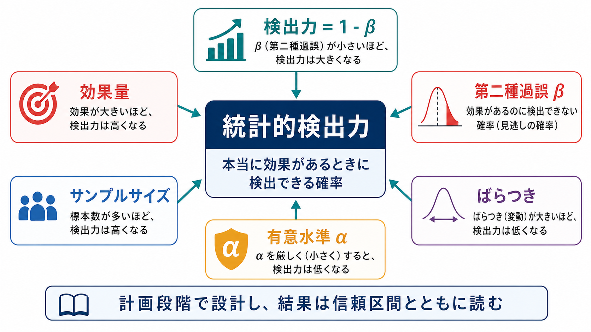
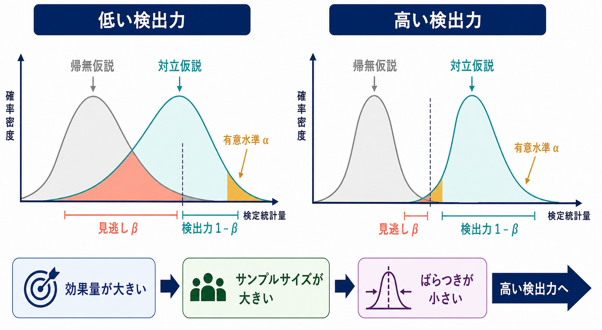
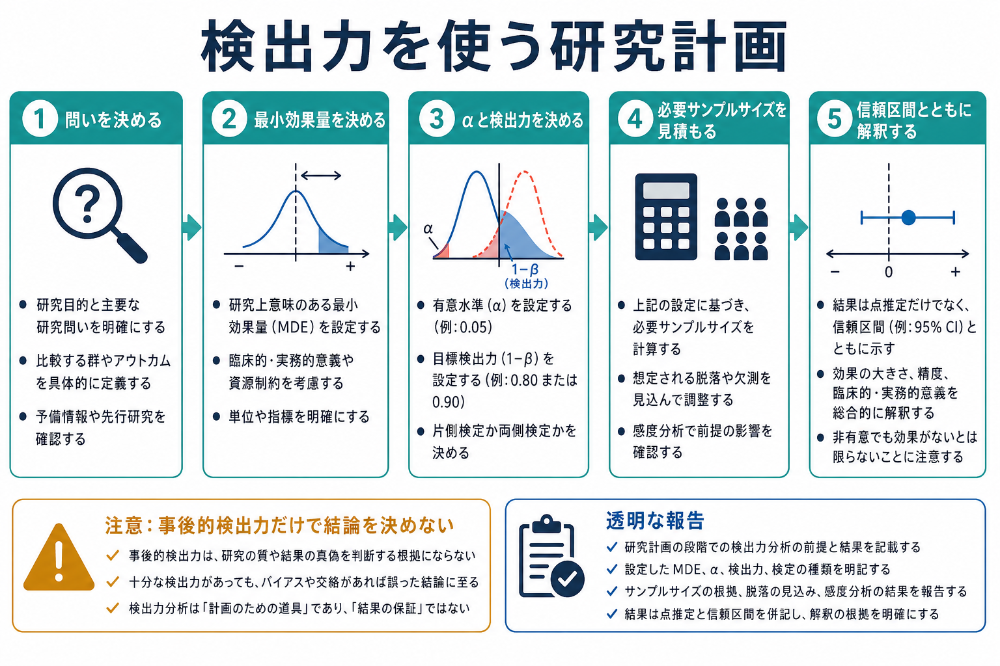

# 統計的検出力とは何か

## 要点

- 統計的検出力とは、実際に効果や差が存在するときに、統計的検定がそれを「有意」として検出できる確率である。通常は $1-\beta$ と表され、$\beta$ は第二種過誤、つまり「本当は効果があるのに見逃す確率」を意味する[1]。
- 検出力は、主に効果量、サンプルサイズ、有意水準 $\alpha$、データのばらつき、検定方法、片側・両側検定の選択によって変わる[1][2]。
- 低い検出力の研究では、真の効果を見逃しやすいだけでなく、有意になった効果量が過大に見積もられやすく、再現性の低下にもつながる[2][3]。
- 検出力分析は、結果を「保証」する道具ではなく、研究計画の段階で、どの程度の効果をどれだけの精度で検出したいのかを明確にする道具である[4]。
- 結果の解釈では、p値だけでなく、効果量、信頼区間、研究デザイン、測定の[[信頼性とは何か|信頼性]]や[[妥当性とは何か|妥当性]]を合わせて読む必要がある[5][6]。

## この記事で答える問い

1. 統計的検出力は、p値や有意水準とどう違うのか。
2. なぜサンプルサイズを増やすと検出力が上がるのか。
3. 検出力が低い研究では、どのような問題が起きるのか。
4. 心理学・認知科学・臨床研究では、検出力をどのように研究計画へ組み込むべきか。
5. 「事後的検出力」や「80%なら十分」といった言い方には、どのような注意が必要か。

## まず結論

統計的検出力は、ひとことで言えば「本当に効果があるときに、それを見つけられる確率」である。たとえば検出力が 80% の研究とは、同じ条件で研究を何度も繰り返したとき、真の効果が想定どおり存在するなら、そのうち約80%で統計的に有意な結果が得られる、という意味である[1]。

ここで重要なのは、検出力は「この研究で得られた有意差が本物である確率」ではないという点である。検出力は、研究を始める前に、想定する効果量、サンプルサイズ、有意水準、ばらつき、検定方法を置いたときに定まる、手続きの性質である。したがって、[[心理学研究法とは何か|心理学研究法]]や[[実験研究とは何か|実験研究]]では、検出力は「結果を見た後の言い訳」ではなく、「どのくらいの効果を検出したいのか」を事前に設計するための概念として使う。

## 背景

心理学、認知科学、神経科学、臨床研究では、効果はしばしば小さく、測定誤差や個人差も大きい。注意課題の反応時間差、心理尺度の群間差、介入前後の症状変化、脳活動指標の条件差などは、測定そのもののばらつきに埋もれやすい。このため、真の効果が存在しても、サンプルが少なかったり測定が粗かったりすると、有意差として検出できないことがある。

この問題は単なる「サンプル数不足」に限られない。低検出力の研究では、有意になった研究だけが文献に残ると、効果量が実際より大きく見えやすい。Button らは、神経科学研究における低検出力が、見逃し、効果量の過大推定、再現性低下を引き起こすと論じた[2]。Ioannidis も、研究の事前確率、検出力、バイアス、選択的報告が組み合わさると、文献中の「有意な知見」の信頼性が低下しうると整理している[3]。

したがって、検出力は[[心理測定とは何か|心理測定]]や研究デザインの周辺概念ではなく、研究の問い、測定、サンプルサイズ、解釈をつなぐ中心概念である。

## 基本概念

### 帰無仮説、有意水準、第二種過誤

通常の仮説検定では、まず「効果がない」「差がない」とする帰無仮説 $H_0$ を置く。観測されたデータが $H_0$ のもとでどれほど珍しいかを p値として評価し、p値が事前に定めた有意水準 $\alpha$ より小さければ、帰無仮説を棄却する。

このとき、誤りには少なくとも二種類がある。第一種過誤は、本当は効果がないのに有意と判断する誤りであり、その許容確率が有意水準 $\alpha$ である。第二種過誤は、本当は効果があるのに有意と判断できない誤りであり、その確率を $\beta$ と書く。検出力は、この第二種過誤を避ける確率として、次のように定義される[1]。

$$
\text{Power} = 1 - \beta
$$

つまり、$\beta$ が小さいほど見逃しが少なく、検出力は高くなる。

### 検出力を左右する要因

検出力は単独で決まる値ではない。代表的には、次の要因に依存する。

| 要因 | 検出力への影響 | 直感的な意味 |
|---|---|---|
| 効果量 | 大きいほど検出力は上がる | 差や関連が大きいほど見つけやすい |
| サンプルサイズ | 大きいほど検出力は上がる | 推定のばらつきが小さくなる |
| 有意水準 $\alpha$ | 大きいほど検出力は上がるが、第一種過誤も増える | 判定基準を緩めると見つけやすい |
| ばらつき | 小さいほど検出力は上がる | ノイズが少ないほど信号が見えやすい |
| 検定方法 | 適切な方法ほど検出力を保ちやすい | デザインに合った分析が必要 |
| 片側・両側検定 | 条件により変わる | 方向を事前に正当化できるかが重要 |

この表からわかるように、検出力を上げる方法は「人数を増やす」だけではない。測定の信頼性を高める、アウトカムを明確にする、不要なばらつきを減らす、反復測定や適切な共変量調整を使う、といった設計上の工夫も検出力に関わる。

## 仕組み

検出力の仕組みは、帰無仮説の分布と、真の効果がある場合の分布がどれだけ重なるかとして理解できる。2つの分布が大きく重なると、有意水準の基準を超えられないケースが多くなり、見逃し $\beta$ が増える。逆に、効果量が大きい、サンプルサイズが大きい、ばらつきが小さい場合には、分布の重なりが減り、検出力 $1-\beta$ が高くなる。

この図で注意すべきなのは、有意水準 $\alpha$ と検出力がトレードオフをもつことである。$\alpha$ を大きくすれば、たしかに有意になりやすくなり、検出力も上がる。しかし同時に、効果がないのに有意と判断する第一種過誤も増える。そのため、検出力を上げる実質的な方法は、単に $\alpha$ を緩めることではなく、サンプルサイズ、測定精度、研究デザイン、最小重要効果量を丁寧に設計することである[4]。

## 図解

検出力分析は、研究計画の中で次のように使うと理解しやすい。まず研究の問いと主要アウトカムを決める。次に、理論的・臨床的・実践的に意味のある最小効果量を決める。そこから、有意水準、目標検出力、検定方法、脱落率、測定回数などを指定し、必要サンプルサイズを見積もる[4][7]。

重要なのは、最小効果量を「過去研究でたまたま有意だった大きな効果量」から機械的に取らないことである。小規模研究では、有意になった効果量が過大に見積もられやすい。したがって、先行研究、理論、臨床的・実践的意義、資源制約を合わせて、検出したい効果の大きさを明示する必要がある[2][4]。

## 臨床・研究との接続

### 心理学・認知科学研究

心理学や認知科学では、効果が小さく、測定値のばらつきも大きいことが多い。たとえば介入群と対照群の平均差、反応時間の条件差、注意課題の正答率差、心理尺度得点の相関などは、理論的には重要でも、1回の小規模研究では検出しにくい。低検出力の研究を積み重ねると、「効果がない」と誤って判断するだけでなく、有意になった研究だけが注目され、効果が過大に見える危険がある[2][3]。

そのため、[[心理学研究法とは何か|心理学研究法]]では、検出力を事前登録、主要アウトカムの明確化、分析計画、データ除外基準、信頼区間の報告と結びつけて扱う必要がある。

### 心理測定・尺度研究

[[心理測定とは何か|心理測定]]では、測定誤差が検出力に直接関わる。信頼性の低い尺度は、真の個人差や変化をノイズで薄めるため、同じサンプルサイズでも検出力を下げる。逆に、[[内的一貫性とは何か|内的一貫性]]、[[再検査信頼性とは何か|再検査信頼性]]、[[評価者間信頼性とは何か|評価者間信頼性]]を高めることは、効果を見つけやすくする設計上の工夫でもある。

また、尺度研究では、統計的に検出できる差と、実際に意味のある差は同じではない。サンプルサイズが非常に大きいと、ごく小さな差でも有意になりうる。そのため、統計的検出力とあわせて、効果量、信頼区間、[[基準関連妥当性とは何か|基準関連妥当性]]、臨床的・教育的な意味を検討する必要がある。

### 臨床研究

臨床研究では、検出力分析は倫理とも関係する。サンプルサイズが少なすぎる研究は、有効な介入を見逃す可能性が高く、参加者の負担に見合う知識を生みにくい。一方、必要以上に大きな研究は、時間、費用、参加者負担を過剰にする。CONSORT は、ランダム化比較試験の報告において、サンプルサイズの決定方法とその根拠を明示することを求めている[7]。

ただし、臨床領域で検出力を語るときは、個別診断や治療指示として読まないことが重要である。検出力は研究計画の概念であり、個々の患者・クライエントにどの治療が適しているかを直接決めるものではない。

## よくある誤解

### 誤解1: 検出力は「有意差が本物である確率」である

検出力は、真の効果があるという条件のもとで、有意な結果を得る確率である。得られた有意差が真である確率、あるいは帰無仮説が偽である確率ではない。p値についても同様に、p値は帰無仮説のもとでデータ以上に極端な結果が出る確率であり、仮説が正しい確率ではない[6]。

### 誤解2: 検出力80%なら、その研究は十分である

80% は慣例的によく使われる目標値だが、常に十分とは限らない。見逃しが重大な研究では、90%やそれ以上を目標にすることがありうる。一方で、探索的研究、希少疾患研究、予備研究では、資源制約のもとで別の設計判断が必要になる。Lakens は、サンプルサイズの正当化では、検出力分析だけでなく、精度、資源制約、感度分析、先行研究、実用的意義を組み合わせて説明する必要があると述べている[4]。

### 誤解3: 有意でなかったので効果はない

有意でない結果は、効果がないことの証明ではない。低検出力の研究では、効果があっても見逃す可能性が高い。Altman と Bland が強調したように、「証拠がない」ことと「ないことの証拠」は同じではない[5]。非有意結果を解釈するには、信頼区間がどの範囲の効果をまだ許容しているかを見る必要がある。

### 誤解4: 事後的検出力を計算すれば、結果の意味がわかる

観測された効果量を使って事後的検出力を計算しても、多くの場合、それはp値と同じ情報を別の形で言い換えるだけになりやすい。結果を読んだ後に知りたいのは、「この研究はどれだけの効果を排除できるのか」「推定値の不確実性はどれくらいか」であり、そのためには信頼区間、効果量、感度分析、事前に設定した最小重要効果量を確認するほうが有用である[4][5]。

### 誤解5: サンプルサイズを増やせば研究は自動的によくなる

サンプルサイズを増やすと検出力は上がるが、測定が不適切、アウトカムが曖昧、交絡が大きい、分析計画が後付け、欠測が多い、といった問題は解決しない。大規模研究では、ごく小さく実質的に重要でない効果も有意になりうる。したがって、検出力は、[[妥当性とは何か|妥当性]]、研究デザイン、測定精度、倫理、解釈可能性と合わせて評価する。

## 関連ノート

既存の関連ノート:

- [[心理学研究法とは何か]]
- [[実験研究とは何か]]
- [[心理測定とは何か]]
- [[信頼性とは何か]]
- [[妥当性とは何か]]
- [[内的一貫性とは何か]]
- [[再検査信頼性とは何か]]
- [[評価者間信頼性とは何か]]
- [[基準関連妥当性とは何か]]
- [[カットオフ値はどのように決めるのか]]

今後の作成候補:

- 効果量とは何か
- p値とは何か
- 第一種過誤と第二種過誤とは何か
- サンプルサイズ設計とは何か
- 信頼区間とは何か
- 事前登録とは何か
- 多重比較問題とは何か

MOC 更新候補:

- `content/00_MOC/` 配下の心理学研究法・心理測定・統計関連 MOC に、本記事へのリンクをバッチ統合時に追加する。
- 並列ジョブとの競合を避けるため、本タスクでは MOC 本体は更新しない。

## 理解チェック

1. 検出力 $1-\beta$ の $\beta$ は、どのような誤りの確率か。
2. サンプルサイズを増やすと、なぜ検出力が上がりやすいのか。
3. 「有意でなかった」という結果だけで「効果はない」と言えない理由は何か。
4. 検出力を上げる方法として、サンプルサイズ以外にどのような工夫があるか。
5. 事後的検出力よりも、信頼区間や最小重要効果量を見るほうが有用な場面はどのようなときか。

## 参考文献

[1] Cohen, J. (1992). A power primer. *Psychological Bulletin, 112*(1), 155-159. https://doi.org/10.1037/0033-2909.112.1.155

[2] Button, K. S., Ioannidis, J. P. A., Mokrysz, C., Nosek, B. A., Flint, J., Robinson, E. S. J., & Munafo, M. R. (2013). Power failure: Why small sample size undermines the reliability of neuroscience. *Nature Reviews Neuroscience, 14*, 365-376. https://doi.org/10.1038/nrn3475

[3] Ioannidis, J. P. A. (2005). Why most published research findings are false. *PLoS Medicine, 2*(8), e124. https://doi.org/10.1371/journal.pmed.0020124

[4] Lakens, D. (2022). Sample size justification. *Collabra: Psychology, 8*(1), 33267. https://doi.org/10.1525/collabra.33267

[5] Altman, D. G., & Bland, J. M. (1995). Absence of evidence is not evidence of absence. *BMJ, 311*(7003), 485. https://doi.org/10.1136/bmj.311.7003.485

[6] Wasserstein, R. L., & Lazar, N. A. (2016). The ASA statement on p-values: Context, process, and purpose. *The American Statistician, 70*(2), 129-133. https://doi.org/10.1080/00031305.2016.1154108

[7] Schulz, K. F., Altman, D. G., Moher, D., & CONSORT Group. (2010). CONSORT 2010 Statement: Updated guidelines for reporting parallel group randomised trials. *BMC Medicine, 8*, 18. https://doi.org/10.1186/1741-7015-8-18

