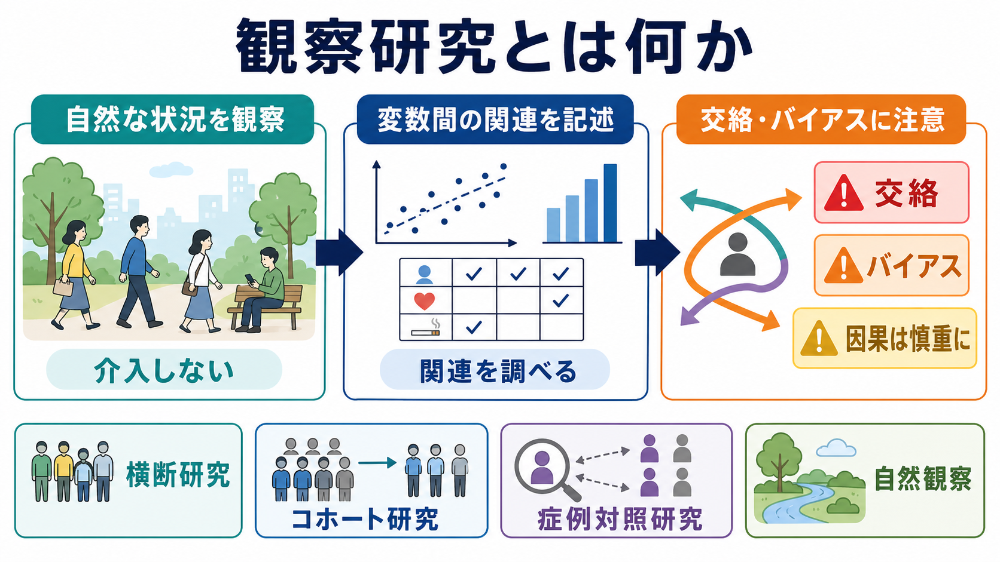
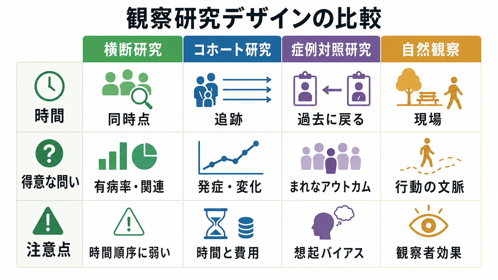
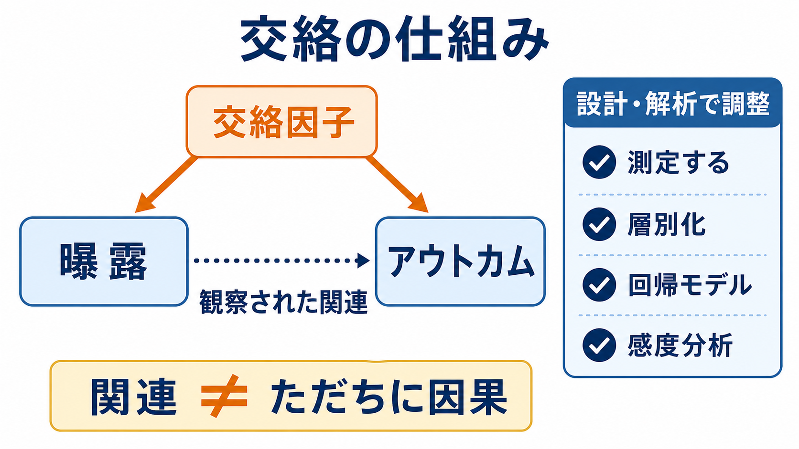

# 観察研究とは何か

## 要点

- 観察研究とは、研究者が介入や割り付けを行わず、すでに起きている行動、環境、曝露、心理指標、アウトカムの関連を調べる研究デザインである[1]。
- 心理学では、自然な場面で行動を観察する自然観察、質問紙や行動ログを使う調査研究、既存記録を使う研究などが含まれる[2]。
- 観察研究は、実験が倫理的・実務的に難しい問いを扱いやすく、現実場面での生態学的妥当性を高めやすい[2]。
- ただし、ランダム割り付けがないため、交絡、選択バイアス、情報バイアス、観察者効果に注意しなければならない[5][6]。
- 観察研究で得られる「関連」は、追加の仮定や分析なしに「因果」とは言えない[2][5]。

## この記事で答える問い

1. 観察研究は、実験研究や介入研究と何が違うのか。
2. 心理学・認知科学では、どのような場面で観察研究が役立つのか。
3. 横断研究、コホート研究、症例対照研究、自然観察はどう違うのか。
4. 観察研究を読むとき、どのバイアスと限界に注意すればよいのか。
5. 観察研究を、[[心理測定とは何か]]、[[信頼性とは何か]]、[[妥当性とは何か]]とどう接続して考えるか。

## まず結論

観察研究は、「人や環境に何かを割り付けて変化させる」のではなく、「自然に起きている違いを測り、その違いと結果の関連を調べる」方法である。たとえば、睡眠時間と注意課題成績、スマートフォン使用時間と抑うつ症状、教室での教師のフィードバックと児童の発話行動の関係を、実験的に割り付けずに調べる。

重要なのは、観察研究が「弱い研究」ではないという点である。介入できない問い、長期経過を見たい問い、現実場面の行動を扱いたい問いでは、観察研究がもっとも適切な設計になることがある。一方で、観察研究は「何が原因で何が結果か」を自動的に決めてくれる方法ではない。よい観察研究とは、測定、対象者選択、時間順序、交絡の扱いを明示し、どこまで言えるかを慎重に区切る研究である[3][4]。

## 背景

心理学や認知科学で扱う現象の多くは、研究室で完全に再現することが難しい。親子相互作用、学校での学習行動、職場ストレス、日常生活での気分変動、臨床症状の長期経過などは、実験室だけで測ると本来の文脈が失われやすい。自然観察は、このような行動を自然な場面で観察することで、現実に近い情報を得る方法として使われる[2]。

また、実験的に割り付けることが倫理的に不可能な問いも多い。たとえば、虐待経験、社会的孤立、長期的な睡眠不足、疾患リスク、薬物使用歴などを研究者がランダムに割り付けることはできない。このような場合、研究者は既に存在する差異を観察し、適切な比較群、測定、統計調整を設計して、関連のパターンを調べる。

観察研究は、医学・疫学ではコホート研究、症例対照研究、横断研究として整理されることが多い[1][3]。心理学では、自然観察、質問紙調査、経験サンプリング、行動ログ解析、臨床記録研究などとして現れる。名称は違っても、共通する核は「介入せず、観察された変数間の関連を調べる」ことである。

## 基本概念

### 観察研究と介入研究

介入研究では、研究者が参加者を条件に割り付け、介入、刺激、処置、トレーニングなどを実施する。ランダム化比較試験では、割り付けをランダムにすることで、既知・未知の交絡因子を平均的に均衡させようとする。

観察研究では、研究者は曝露や条件を割り付けない。NIH の説明でも、観察研究は前向きに情報を集める場合と既存データを調べる場合があり、いずれも介入を与えない研究として整理されている[1]。このため、観察研究は現実に近いデータを扱いやすいが、「なぜその曝露を受けた人と受けていない人が違うのか」を慎重に考える必要がある。

### 関連と因果

観察研究がまず示すのは、変数間の関連である。たとえば、睡眠時間が短い人ほど注意課題の成績が低い、という関連が見つかったとする。この結果だけでは、睡眠不足が注意低下を引き起こしたのか、ストレスが睡眠と注意の両方に影響したのか、生活リズムや疾患など別の要因が関わったのかは決まらない。

OpenStax の心理学テキストも、観察、調査、既存記録を用いる研究は相関的性格を持ち、変数間の重要な関係を示せる一方で、因果関係を主張するには実験など追加の条件が必要だと説明している[2]。因果推論の観点では、交換可能性、正の確率、整合性、時間順序、測定の妥当性などの仮定をどこまで満たすかが問題になる[5]。

### 代表的なデザイン

横断研究は、ある時点で曝露とアウトカムを同時に測る。大規模に実施しやすく、有病率や変数間の関連を把握しやすいが、時間順序を判断しにくい。

コホート研究は、ある曝露や特徴を持つ人々を追跡し、その後のアウトカムを調べる。時間順序を確認しやすいが、長い追跡、脱落、費用が課題になる。

症例対照研究は、アウトカムを持つ群と持たない群を先に定め、過去の曝露の違いを比較する。まれなアウトカムを扱いやすいが、想起バイアスや記録の偏りに注意が必要である。

自然観察は、研究室ではなく日常場面で行動を観察する方法である。行動の文脈や相互作用を捉えやすい一方、観察者の存在が行動を変える可能性や、記録基準の一貫性が問題になる[2]。

## 仕組み

観察研究の基本的な流れは、次のように整理できる。

1. 問いを決める  
   例: 日常の睡眠時間は、翌日の注意制御と関連するか。

2. 対象集団を定める  
   例: 大学生、臨床群、地域住民、児童、職場集団など。

3. 曝露・説明変数を測る  
   例: 睡眠時間、ストレス、スマートフォン使用、社会的支援、観察された行動頻度。

4. アウトカムを測る  
   例: 認知課題成績、症状尺度得点、行動指標、生理指標、診断、学業成績。

5. 交絡因子を想定し、測定する  
   例: 年齢、性別、既往歴、社会経済的要因、ベースライン症状、薬物療法、生活習慣。

6. 統計解析と感度分析を行う  
   例: 層別化、回帰モデル、傾向スコア、欠測データ処理、代替モデルでの頑健性確認。

7. 「関連」「予測」「因果仮説」を区別して解釈する  
   観察研究は因果仮説を強めることもあるが、因果効果の推定には仮定の明示が必要である[5]。

この流れで特に重要なのが交絡である。交絡因子とは、曝露とアウトカムの両方に関連し、見かけの関連を作ったり、本当の関連を隠したりする要因である[6]。

たとえば、カフェイン摂取量と不安症状の関連を調べるとき、睡眠不足、仕事量、もともとの不安傾向、服薬、生活リズムが交絡因子になりうる。カフェインそのものが不安を高めているのか、不安が強い人が眠気対策としてカフェインを増やしているのか、第三の要因が両方に影響しているのかを切り分ける必要がある。

## 図解

この記事の 3 枚の図は、観察研究を読むための最小セットとして配置した。

| 図 | 役割 | 読み取り方 |
|---|---|---|
| 図1 | 観察研究の全体像 | 介入しない、自然な状況を扱う、関連を調べる、因果は慎重に読むという基本姿勢を確認する。 |
| 図2 | 交絡の仕組み | 曝露とアウトカムの関連が、第三の要因によって作られる可能性を見る。 |
| 図3 | デザイン比較 | 横断研究、コホート研究、症例対照研究、自然観察の得意な問いと注意点を比較する。 |

## 臨床・研究との接続

臨床心理学や精神医学では、観察研究は症状の経過、リスク因子、保護因子、治療選択後の転帰、尺度得点の変化を調べるために使われる。ただし、臨床データは「誰がどの治療を受けたか」がランダムではないことが多い。重症な人ほど強い治療を受けやすい場合、治療と転帰の関連は「治療の効果」だけではなく、もともとの重症度によって歪む可能性がある。これは交絡、特に適応による交絡として問題になる[6]。

心理測定との接点も大きい。観察研究の結論は、測定された変数の質に依存する。質問紙尺度を使うなら、[[信頼性とは何か]]、[[内的一貫性とは何か]]、[[再検査信頼性とは何か]]、[[妥当性とは何か]]、[[構成概念妥当性とは何か]]を検討する必要がある。行動観察なら、観察カテゴリの定義、評定者間一致、観察者訓練、記録場面の標準化が重要になる。

研究報告では、STROBE 声明がよい点検表になる。STROBE は、コホート研究、症例対照研究、横断研究の報告に必要な項目を整理し、対象者、変数、バイアス、研究規模、統計手法、交絡調整、欠測、感度分析などを明示することを求めている[4]。これは「研究の質を自動判定する道具」ではなく、読者が研究の強みと限界を評価できるように透明な報告を促す道具である。

## よくある誤解

### 誤解1: 観察研究は因果をまったく扱えない

観察研究だけで因果を断定するのは危険だが、因果をまったく扱えないわけではない。時間順序が明確で、交絡因子が十分に測定され、適切な因果モデルと感度分析がある場合、観察データから因果効果を推定しようとする研究もある[5]。ただし、その結論は仮定に依存するため、本文中で仮定と限界を明示する必要がある。

### 誤解2: サンプルサイズが大きければバイアスは消える

大規模データは推定のばらつきを小さくするが、交絡や選択バイアスを自動的に消すわけではない。交絡がある場合、サンプルサイズが非常に大きくても、精密に偏った推定値を得ることがある[5][6]。

### 誤解3: 自然観察なら現実をそのまま測れる

自然観察は現実場面に近い強みを持つが、観察者の存在、記録基準、観察時間帯、対象者の選択、行動カテゴリの曖昧さによって結果は変わる。OpenStax は、自然観察では観察者ができるだけ目立たないこと、観察者バイアスを避けるために明確な記録基準や評定者間信頼性が重要であることを説明している[2]。

### 誤解4: 統計調整すれば交絡は完全に消える

回帰モデルや傾向スコアは、測定済みの交絡因子を扱うための道具である。測定していない交絡因子、誤測定された交絡因子、モデル化の誤り、選択バイアス、情報バイアスは残りうる。したがって、解析方法だけでなく、研究計画の段階で何を測るか、どの対象を比較するかを設計することが重要である[4][6][7]。

## 関連ノート

確認済みの既存ノート:

- [[心理測定とは何か]]
- [[心理尺度はどのように作られるのか]]
- [[信頼性とは何か]]
- [[妥当性とは何か]]
- [[構成概念妥当性とは何か]]
- [[反応バイアスとは何か]]
- [[標準化とは何か]]
- [[MOC｜研究方法]]
- [[MOC｜因果推論]]
- [[MOC｜認知科学・心理学]]
- [[MOC｜統計・医療統計]]

今後の作成候補:

- 横断研究とは何か
- コホート研究とは何か
- 症例対照研究とは何か
- 交絡とは何か
- 選択バイアスとは何か
- 情報バイアスとは何か
- 評定者間信頼性とは何か
- STROBE声明とは何か

MOC更新候補:

- `content/00_MOC/MOC｜研究方法.md`
- `content/00_MOC/MOC｜認知科学・心理学.md`
- `content/00_MOC/MOC｜因果推論.md`

## 理解チェック

1. 観察研究と介入研究のもっとも基本的な違いは何か。
2. 「睡眠時間と注意成績に関連がある」という結果から、なぜすぐに「睡眠不足が注意低下を引き起こす」と言えないのか。
3. 横断研究、コホート研究、症例対照研究のうち、時間順序を確認しやすいのはどれか。
4. 自然観察で、観察者バイアスを減らすためには何が必要か。
5. 観察研究の論文を読むとき、STROBE のどの項目を重点的に確認したいか。

## 参考文献

[1] NIH Intramural Research Program. Observational Research. https://irbo.nih.gov/protocol-development/observational-research/

[2] OpenStax. Psychology 2e, 2.2 Approaches to Research. https://openstax.org/books/psychology-2e/pages/2-2-approaches-to-research

[3] Thiese, M. S. (2014). Observational and interventional study design types; an overview. *Biochemia Medica*, 24(2), 199-210. https://pmc.ncbi.nlm.nih.gov/articles/PMC4083571/

[4] von Elm, E., Altman, D. G., Egger, M., Pocock, S. J., Gotzsche, P. C., & Vandenbroucke, J. P. (2007). The Strengthening the Reporting of Observational Studies in Epidemiology (STROBE) Statement: Guidelines for Reporting Observational Studies. *PLoS Medicine*, 4(10), e296. https://pmc.ncbi.nlm.nih.gov/articles/PMC2020495/

[5] Hernan, M. A., & Robins, J. M. (2024). *Causal Inference: What If*. https://www.hsph.harvard.edu/miguel-hernan/wp-content/uploads/sites/1268/2024/01/hernanrobins_WhatIf_2jan24.pdf

[6] Catalogue of Bias Collaboration, Aronson, J. K., Bankhead, C., & Nunan, D. (2018). Confounding. *Catalogue of Bias*. https://catalogofbias.org/biases/confounding/

[7] Catalogue of Bias Collaboration. Information bias. *Catalogue of Bias*. https://catalogofbias.org/biases/information-bias/
