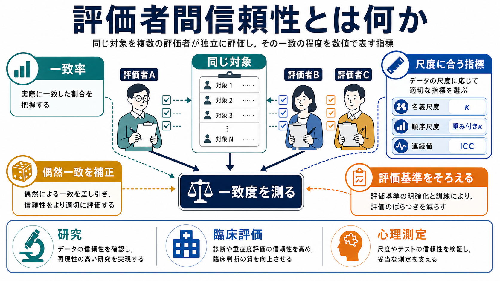
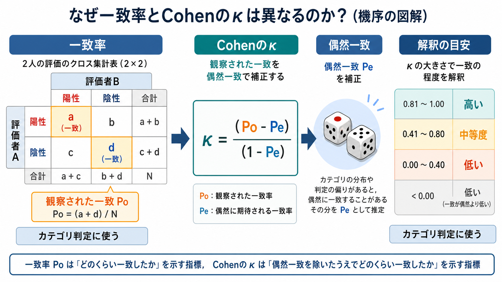
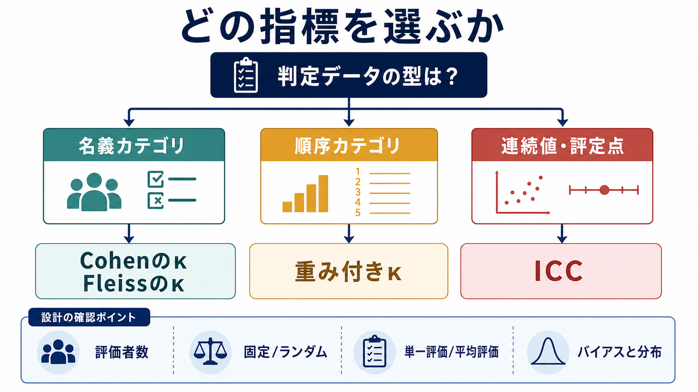

# 評価者間信頼性とは何か

## 要点

- 評価者間信頼性とは、同じ対象を複数の評価者が判定したとき、どの程度同じ結論に到達するかを表す[[信頼性とは何か|信頼性]]の一種である。
- 単純な一致率は直感的だが、偶然一致を差し引けないため、カテゴリ判定では Cohen の $\kappa$ や Fleiss の $\kappa$ がよく使われる[1][3]。
- 順序カテゴリでは不一致の大きさを区別する重み付き $\kappa$、連続値や評定点では ICC が候補になる[2][4]。
- 高い評価者間信頼性は、判定ルールが共有されていることを示すが、測定が本当に測りたいものを測っているという[[妥当性とは何か|妥当性]]までは保証しない。
- 係数だけでなく、評価者の訓練、評価基準、対象分布、信頼区間、不一致の内容を一緒に報告する必要がある[6][7]。

## この記事で答える問い

評価者間信頼性は、心理学研究、臨床評価、行動観察、面接評定、診断補助、質的データのコーディングで頻繁に出てくる概念である。この記事では、次の問いに答える。

1. 評価者間信頼性は、[[内的一貫性とは何か|内的一貫性]]や[[再検査信頼性とは何か|再検査信頼性]]と何が違うのか。
2. 一致率、Cohen の $\kappa$、Fleiss の $\kappa$、重み付き $\kappa$、ICC はどう使い分けるのか。
3. 研究・臨床で、係数をどのように読み、どこに注意すべきか。

## まず結論

評価者間信頼性は、「人が判断に入る測定で、判断者の違いによって結果がどの程度ぶれるか」を見るための指標である。たとえば、2人の臨床家が同じ面接記録を見て「症状あり／なし」を判定する、複数のコーダーが発話をカテゴリ分類する、複数の評価者が症状重症度を点数化する、といった場面で問題になる。

ただし、評価者間信頼性は「正しさ」そのものではない。全員が同じ誤った基準で一致しても係数は高くなりうる。したがって、評価者間信頼性は[[心理測定とは何か|心理測定]]の品質管理の入口であり、[[心理尺度はどのように作られるのか|尺度作成]]や妥当性検討と組み合わせて解釈する。

## 背景

心理学や精神医学では、測定対象が直接観察できないことが多い。抑うつ、不安、注意、社会的相互作用、病識、思考過程などは、観察、面接、質問紙、行動課題、臨床記録を通して推定される。このとき評価者が違うだけで結論が大きく変わるなら、そのデータを用いた群間比較、相関、予測、介入効果の推定は不安定になる。

評価者間信頼性が重要になるのは、測定誤差のうち「評価者に由来するばらつき」を明示的に扱うためである。観察研究のチュートリアルでは、研究デザイン、統計指標の選択、報告内容がそろっていないと、IRR の値だけでは後続分析への影響を判断しにくいことが指摘されている[6]。

## 基本概念

評価者間信頼性は、同じ対象に対する複数評価者の一致度を測る。ここでいう「一致」は、データの型によって意味が変わる。

| データの型 | 例 | 代表的な指標 |
|---|---|---|
| 名義カテゴリ | あり／なし、診断カテゴリ、行動カテゴリ | 一致率、Cohen の $\kappa$、Fleiss の $\kappa$ |
| 順序カテゴリ | 0-3点の重症度、Likert型評定 | 重み付き $\kappa$ |
| 連続値・評定点 | 症状得点、反応強度、尺度得点 | ICC |

単純一致率は、全判定のうち一致した割合である。わかりやすいが、カテゴリの偏りがあると高く見えやすい。たとえば、ほとんどの対象が「陰性」であるデータでは、評価者が深く見ていなくても「陰性」と判定し続けるだけで一致率が高くなる。Cohen の $\kappa$ は、このような偶然一致を補正するために提案された[1]。

## 仕組み

Cohen の $\kappa$ は、2人の評価者が名義カテゴリを判定する場面で使われる代表的な指標である。基本形は次のように表せる。

$$
\kappa = \frac{P_o - P_e}{1 - P_e}
$$

ここで、$P_o$ は観察された一致率、$P_e$ は偶然に期待される一致率である。分子は「観察された一致が偶然一致をどれだけ上回るか」、分母は「偶然一致を除いたうえで理論的にどれだけ改善余地があるか」を表す。

Cohen の $\kappa$ は2人の評価者を想定する。3人以上の評価者が名義カテゴリを付ける場合には、Fleiss の $\kappa$ が使われることがある[3]。順序カテゴリでは、1段階のずれと3段階のずれを同じ不一致として扱うのは不自然なので、重み付き $\kappa$ が使われる[2]。

連続値や評定点では、ICC、つまり級内相関係数が候補になる。ICC には複数の型があり、評価者を固定効果として考えるのか、評価者を母集団からのランダムサンプルと考えるのか、単一評価者の値を使うのか、複数評価者の平均値を使うのかで選ぶ型が変わる[4][5]。したがって、ICC は「計算した」と書くだけでは不十分で、どのモデル、どの型、どの信頼区間を用いたかを報告する必要がある[5]。

## 臨床・研究との接続

評価者間信頼性は、研究ではデータの再現性を支える。たとえば、症例記録から症状カテゴリを抽出する研究では、コーダー間の一致が低いと、得られた関連や群間差がコーディングの揺れに依存している可能性が高くなる。行動観察でも、観察単位、カテゴリ定義、評価者訓練、盲検化、再評価手順を決めておかないと、数値だけが独り歩きする。

臨床では、評価者間信頼性はチーム医療や診断面接の標準化に関わる。複数の職種が同じ患者のリスク、機能、症状重症度を評価する場合、基準が共有されていないと、支援方針やフォローアップの優先度がぶれる。ただし、評価者間信頼性が高いからといって、その判断が個別症例に対する診断や治療方針として十分であるとは限らない。臨床判断では、教育・研究で示された指標を参考にしつつ、面接、生活史、身体疾患、文脈、本人の価値観を総合する必要がある。

## よくある誤解

### 一致率が高ければ十分である

一致率は見やすいが、偶然一致やカテゴリ分布の偏りを補正しない。カテゴリ判定では、$\kappa$ と一緒にクロス表、カテゴリ別の偏り、一致率を示すほうが解釈しやすい[7]。

### $\kappa$ が低いなら評価者が悪い

$\kappa$ は評価者の能力だけで決まらない。対象の偏り、カテゴリの希少性、評価基準の曖昧さ、カテゴリ数、サンプルサイズ、評価者の訓練不足が影響する。低い値は、個人の失敗というより、測定設計の見直しサインとして扱う。

### ICC は1種類だけである

ICC は複数のモデルを含む総称である。Shrout と Fleiss は信頼性研究での ICC の使い分けを整理し、Koo と Li はモデル選択と報告の実用的な指針を示している[4][5]。連続値だから ICC とだけ書くのではなく、評価者を固定と見るかランダムと見るか、単一評価か平均評価かを明示する。

### 信頼性が高ければ妥当性も高い

信頼性は「ぶれの少なさ」、妥当性は「解釈や用途の適切さ」である。全評価者が同じ偏った基準を使えば、評価者間信頼性は高くても妥当性は低くなりうる。信頼性は妥当性の必要条件に近いが、十分条件ではない。

## 関連ノート

- [[信頼性とは何か]]
- [[妥当性とは何か]]
- [[心理測定とは何か]]
- [[心理尺度はどのように作られるのか]]
- [[内的一貫性とは何か]]
- [[再検査信頼性とは何か]]

MOC更新候補: `content/00_MOC/` 配下の心理測定・心理学研究関連MOCがある場合、バッチ統合時に本記事へのリンク追加を検討する。

## 理解チェック

1. 単純一致率と Cohen の $\kappa$ は何が違うか。
2. 2人の評価者が「あり／なし」を判定する場合、まず候補になる指標は何か。
3. 0-4点の順序カテゴリで、1点差と4点差を区別したい場合、どの指標を考えるか。
4. 連続値の評定を複数評価者が行ったとき、ICC の型を決めるうえで何を明示すべきか。
5. 評価者間信頼性が高くても、妥当性が保証されないのはなぜか。

## 未解決問題

- $\kappa$ の解釈基準は領域やリスクによって変わるため、万能のカットオフは置きにくい。
- 希少カテゴリや極端な分布では、$\kappa$ が直感とずれることがある。
- 臨床評価では、係数だけでなく、不一致がどの判断場面で生じたかを質的に検討する必要がある。
- AI支援コーディングや自動評定では、人間同士の信頼性に加えて、人間とモデルの一致、基準データの妥当性、バイアス評価が課題になる。

## 参考文献

[1] Cohen, J. (1960). A coefficient of agreement for nominal scales. *Educational and Psychological Measurement, 20*(1), 37-46. https://doi.org/10.1177/001316446002000104

[2] Cohen, J. (1968). Weighted kappa: Nominal scale agreement provision for scaled disagreement or partial credit. *Psychological Bulletin, 70*(4), 213-220. https://doi.org/10.1037/h0026256

[3] Fleiss, J. L. (1971). Measuring nominal scale agreement among many raters. *Psychological Bulletin, 76*(5), 378-382. https://doi.org/10.1037/h0031619

[4] Shrout, P. E., & Fleiss, J. L. (1979). Intraclass correlations: Uses in assessing rater reliability. *Psychological Bulletin, 86*(2), 420-428. https://doi.org/10.1037/0033-2909.86.2.420

[5] Koo, T. K., & Li, M. Y. (2016). A guideline of selecting and reporting intraclass correlation coefficients for reliability research. *Journal of Chiropractic Medicine, 15*(2), 155-163. https://doi.org/10.1016/j.jcm.2016.02.012

[6] Hallgren, K. A. (2012). Computing inter-rater reliability for observational data: An overview and tutorial. *Tutorials in Quantitative Methods for Psychology, 8*(1), 23-34. https://doi.org/10.20982/tqmp.08.1.p023

[7] McHugh, M. L. (2012). Interrater reliability: The kappa statistic. *Biochemia Medica, 22*(3), 276-282. https://doi.org/10.11613/BM.2012.031
