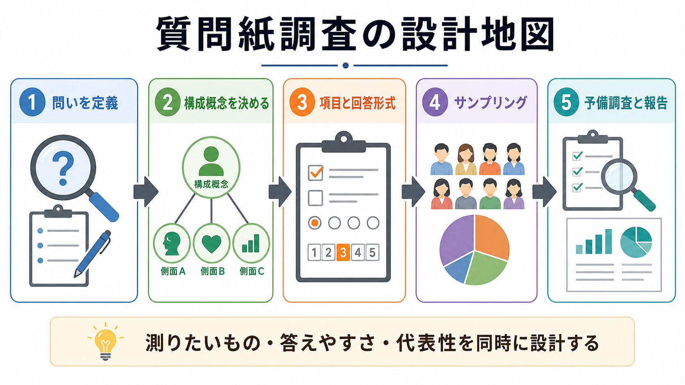
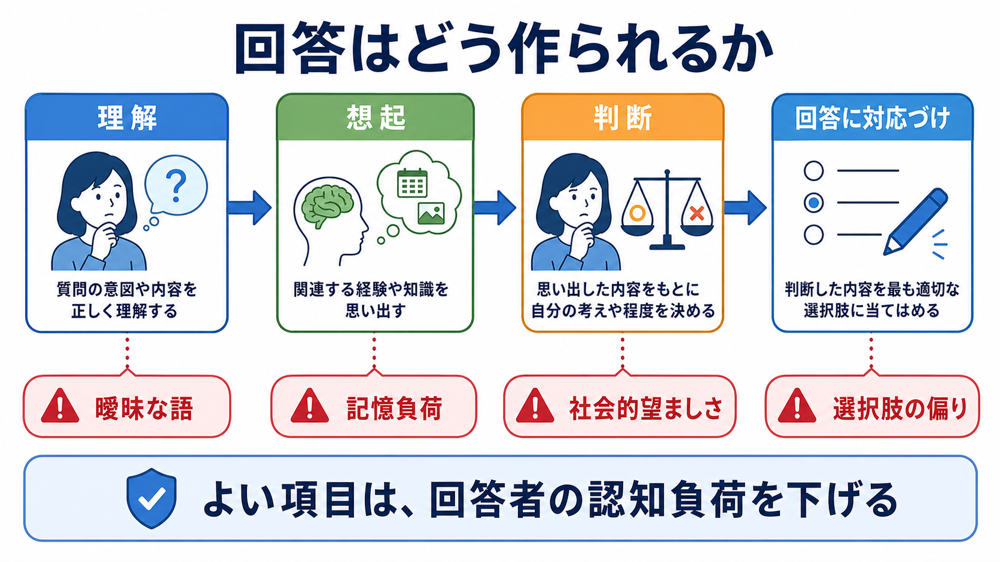
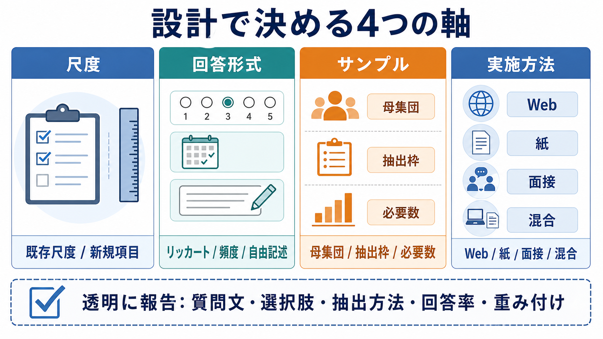

# 質問紙調査はどのように設計するのか

## 要点

- 質問紙調査の品質は、回答者数の多さだけでは決まらない。研究目的、母集団、抽出枠、質問文、回答形式、実施方法、欠測・非回答への扱い、報告の透明性が一体として設計されているかで決まる[1]。
- 項目作成では、「聞きたいこと」ではなく「回答者が理解し、思い出し、判断し、選択肢に対応づけられること」を設計する。回答は、理解、想起、判断、回答編集という認知過程を通って作られる[2][3]。
- 心理尺度を使う場合は、既存尺度を安易に寄せ集めるのではなく、構成概念、内容的妥当性、因子構造、信頼性、使用対象への適合性を確認する必要がある[4][5]。
- サンプリングでは、誰について一般化したいのか、どの抽出枠から、どの方法で、どれだけ集めるのかを明示する。便宜サンプルやオンラインパネルを使う場合も、限界を隠さず報告する[1]。
- 本調査の前には、認知的インタビューや予備調査で、質問文の解釈、回答負荷、選択肢の過不足、回答時間、離脱しやすい箇所を点検する[6]。

## この記事で答える問い

1. 質問紙調査を始める前に、何を決めるべきか。
2. 項目作成と尺度選択では、どのような失敗を避けるべきか。
3. リッカート形式、頻度形式、自由記述などの回答形式はどう選ぶのか。
4. サンプリングと報告では、どこまで透明に書くべきか。

## まず結論

質問紙調査は、「質問を並べる作業」ではなく、測定したい構成概念を、回答可能な問いと、分析可能なデータに変換する設計作業である。最初に決めるべきことは、調査票の見た目ではなく、研究疑問、母集団、主要変数、測定水準、分析計画である。ここが曖昧なまま項目を作ると、回答は集まっても、何を測ったのか、どの集団に一般化できるのか、どの解釈が妥当なのかが不明になる。

実務上は、次の順で考えるとよい。第一に、研究疑問を「誰の、何を、どの程度、何と関連づけて知りたいのか」まで具体化する。第二に、測りたい概念について既存尺度があるかを調べ、なければ新規項目を作る理由を明確にする。第三に、回答者の認知負荷を下げるように質問文と回答形式を選ぶ。第四に、母集団と抽出枠を定義し、サンプルサイズと非回答への対応を計画する。第五に、予備調査で問題を直し、最後に質問文、選択肢、抽出方法、回答率、除外基準、重み付けを透明に報告する[1][7]。

## 背景

心理学、認知科学、臨床研究、教育研究では、主観的経験、態度、信念、症状、生活習慣、満足度、行動頻度のように、直接観察しにくい対象を扱うことが多い。質問紙調査はそのための強力な方法だが、同時に誤差が入りやすい方法でもある。回答者は質問文を機械的に読み取るのではなく、自分なりに意味を解釈し、記憶を検索し、判断し、社会的に受け入れられやすい表現へ編集してから回答する[3]。

そのため、質問紙調査の問題は、単なる文章表現の問題にとどまらない。曖昧な語、二重質問、誘導的表現、不均衡な選択肢、長すぎる調査票、センシティブな内容の提示順、サンプルの偏り、回答率の低さは、[[信頼性とは何か]]や[[妥当性とは何か]]を損なう。さらに、質問紙調査はしばしば[[横断研究と縦断研究は何が違うのか|横断研究]]として実施されるため、変数間の関連が見えても、時間順序や因果方向を慎重に扱う必要がある。

## 基本概念

### 研究疑問と母集団

最初に定義するのは、質問項目ではなく研究疑問である。たとえば「職場ストレスを調べる」では広すぎる。「日本の病院勤務看護師において、勤務負荷とバーンアウト得点の関連を横断調査で推定する」のように、対象者、主要概念、比較・関連、調査時点、分析単位を明示する。

母集団は、結果を一般化したい対象である。抽出枠は、実際に連絡できる対象者のリストやパネルである。母集団と抽出枠がずれるほど、カバレッジ誤差が生じる。オンライン調査では、回答しやすい人、パネル登録者、特定のSNS利用者に偏る可能性があるため、確率サンプリングか非確率サンプリングか、どのような制約があるかを報告する[1]。

### 構成概念と尺度

構成概念とは、直接観察できないが、理論上重要な心理的・社会的概念である。抑うつ、不安、自己効力感、孤独感、スティグマ、職務満足などが典型例である。構成概念を測るには、単一項目で足りる場合もあるが、多くの場合は複数項目からなる尺度を使う。

既存尺度を使う利点は、先行研究との比較可能性、信頼性・妥当性の検証蓄積、解釈のしやすさである。一方で、対象集団、言語、文化、実施方法が変わると、同じ尺度でも測定特性が変わることがある。尺度を選ぶ際には、[[心理尺度はどのように作られるのか]]、[[内容的妥当性とは何か]]、[[構成概念妥当性とは何か]]、[[内的一貫性とは何か]]を確認し、必要なら予備データで[[因子分析とは何か|因子構造]]や信頼性を再検討する[4][8]。

### 項目と回答形式

項目は、回答者に提示される最小単位の質問文である。よい項目は、短く、具体的で、1つの概念だけを尋ね、対象者が理解できる語彙を使い、誘導しない。悪い項目は、二重質問、専門用語、否定の重なり、曖昧な期間、社会的に望ましい答えを促す表現を含む。

回答形式には、同意度、頻度、強度、該当有無、順位づけ、自由記述などがある。同意度形式は使いやすいが、[[反応バイアスとは何か|黙従傾向]]や極端反応の影響を受けやすい。頻度形式は行動を尋ねるときに有用だが、「最近」「よく」などの曖昧語を避け、参照期間を明示する必要がある。自由記述は予期しない情報を得やすい一方で、回答負荷とコーディング負荷が大きい。

## 仕組み

質問紙への回答は、少なくとも4つの認知過程を通る。第一に、回答者は質問文を理解する。ここで専門用語、長い文、曖昧な対象、二重否定があると、研究者の意図とは違う意味で読まれる。第二に、回答者は関連する経験や知識を想起する。期間が長すぎる、出来事が日常的すぎる、記憶に残りにくい内容では誤差が大きくなる。第三に、回答者は思い出した内容をもとに判断する。頻度、程度、評価、原因帰属を推定する場面では、直近の出来事や印象的な出来事に引っ張られる。第四に、判断を選択肢へ対応づける。選択肢の数、ラベル、端点、中点、順序が回答を変える[2][3]。

この仕組みを踏まえると、項目作成の目標は「研究者の聞きたいことを盛り込むこと」ではなく、「回答者が同じ意味で読み、適切な記憶を参照し、無理なく判断し、妥当な選択肢を選べるようにすること」である。認知的インタビューでは、回答者に質問文を読んでもらい、何を意味すると理解したか、どの記憶を参照したか、なぜその選択肢を選んだかを聞く。これにより、本調査前に項目の失敗を発見できる[6]。

## 図解

質問紙設計では、少なくとも次の4軸を同時に決める。

| 軸 | 主な選択肢 | 確認すべき点 |
|---|---|---|
| 尺度 | 既存尺度、新規項目、既存項目の一部利用 | 構成概念、使用許諾、翻訳、信頼性、妥当性 |
| 回答形式 | 同意度、頻度、強度、該当有無、自由記述 | 参照期間、選択肢の均衡、中点、欠測選択肢 |
| サンプル | 確率抽出、層化抽出、便宜サンプル、オンラインパネル | 母集団、抽出枠、必要数、回答率、代表性 |
| 実施方法 | Web、紙、面接、電話、混合モード | 回答負荷、匿名性、センシティブ項目、モード効果 |

## 臨床・研究との接続

臨床・メンタルヘルス領域で質問紙を使う場合、得点は診断そのものではなく、症状、機能、生活上の困難、主観的苦痛を把握する補助情報である。尺度得点は、面接、行動観察、生活歴、身体疾患、文化的背景、測定時点の文脈と合わせて解釈する必要がある。特にスクリーニング尺度では、[[カットオフ値はどのように決めるのか]]や偽陽性・偽陰性の問題を考慮する。

研究では、質問紙調査は[[観察研究とは何か]]や横断研究の一部として実施されることが多い。したがって、関連が見つかったとしても、ただちに因果とは言えない。因果主張を強めるには、縦断設計、介入研究、交絡調整、事前登録、感度分析などが必要になる。また、尺度をアウトカムとして使う研究では、測定誤差が効果量を弱めたり、群間比較を歪めたりするため、測定不変性や欠測処理も重要になる[8]。

報告では、STROBE などの観察研究報告ガイドラインを参照し、研究デザイン、対象者、変数、データソース、バイアス、サンプルサイズ、統計手法、除外数を明示する[7]。調査研究ではさらに、質問文と選択肢、調査モード、実施期間、リクルート方法、回答率、重み付け、インセンティブ、品質管理手続きも報告することが望ましい[1]。

## よくある誤解

### 「サンプルサイズが大きければよい」

大きなサンプルは推定のばらつきを小さくするが、サンプルが偏っていれば偏りは消えない。代表性のない巨大サンプルより、母集団と抽出枠が明確で、非回答への対応が説明されたサンプルのほうが解釈しやすい。必要数については、効果量、推定精度、検出力、分析モデルを踏まえ、[[サンプルサイズ設計とは何か]]として別に考える。

### 「既存尺度ならそのまま使えば妥当である」

既存尺度は有力な出発点だが、使用対象、言語、文化、年齢層、実施方法が変わると測定特性も変わりうる。翻訳尺度では、言語的等価性だけでなく、内容が対象集団に理解可能か、因子構造が保たれるか、得点解釈が妥当かを確認する必要がある[4][8]。

### 「逆転項目を入れれば不注意回答を防げる」

逆転項目は黙従傾向を検出・緩和する目的で使われることがあるが、理解負荷を上げ、方法因子を作り、因子分析の解釈を難しくすることもある。とくに高齢者、臨床群、第二言語回答者、疲労が強い回答者では、逆転項目が測定誤差を増やす可能性がある。

### 「自由記述を入れれば深いデータになる」

自由記述は重要な気づきを与えるが、回答しない人も多く、回答の長さや内容は文章能力、動機づけ、時間的余裕に影響される。探索目的には有用だが、主要アウトカムとして使う場合は、コーディング手順、評価者間信頼性、欠測の扱いを設計しておく必要がある。

## 実務チェックリスト

1. 研究疑問を、対象者、主要概念、比較・関連、調査時点、分析単位まで書く。
2. 母集団、抽出枠、リクルート方法、除外基準、必要サンプルサイズを決める。
3. 既存尺度を調べ、使用許諾、対象集団、翻訳、信頼性、妥当性を確認する。
4. 新規項目を作る場合は、構成概念の範囲、項目プール、専門家確認、対象者確認を行う。
5. 質問文は短く、1項目1概念にし、曖昧な期間、二重否定、誘導表現を避ける。
6. 回答形式は、測りたい水準に合わせて選び、選択肢の端点、中点、欠測選択肢を明示する。
7. センシティブ項目は、説明、匿名性、スキップ可能性、提示順、支援情報を検討する。
8. 認知的インタビューまたは予備調査を行い、解釈のずれ、回答時間、離脱、天井・床効果を確認する。
9. 本調査後は、回答率、欠測、除外、品質管理、重み付け、質問文と選択肢を透明に報告する。

## 関連ノート

- [[心理測定とは何か]]
- [[心理尺度はどのように作られるのか]]
- [[信頼性とは何か]]
- [[妥当性とは何か]]
- [[内容的妥当性とは何か]]
- [[構成概念妥当性とは何か]]
- [[内的一貫性とは何か]]
- [[因子分析とは何か]]
- [[項目反応理論とは何か]]
- [[反応バイアスとは何か]]
- [[社会的望ましさバイアスとは何か]]
- [[サンプルサイズ設計とは何か]]
- [[横断研究と縦断研究は何が違うのか]]
- [[観察研究とは何か]]

MOC更新候補: `content/00_MOC/` 配下の心理測定・研究法関連 MOC に、この記事を「調査法」「心理測定」「研究デザイン」の接続ノートとして追加する。

## 理解チェック

1. 「母集団」と「抽出枠」はどのように違うか。
2. 同意度形式が便利である一方、どのような反応バイアスを受けやすいか。
3. 認知的インタビューでは、回答者のどの過程を確認するのか。
4. 既存尺度を別の集団で使うとき、なぜ妥当性を再確認する必要があるのか。
5. 質問紙調査の報告で、質問文と選択肢を公開することが重要なのはなぜか。

## 未解決問題

- オンライン非確率サンプルから得た結果を、どの条件でどこまで一般化できるか。
- 生成AIや自動翻訳を使った質問紙項目作成で、内容的妥当性と文化的適合性をどう検証するか。
- スマートフォン回答の増加が、回答時間、離脱、自由記述量、尺度得点にどの程度影響するか。
- センシティブな精神健康項目において、匿名性、支援情報、回答の正確性をどのように両立させるか。

## 参考文献

[1] American Association for Public Opinion Research. (n.d.). *Best Practices for Survey Research*. https://aapor.org/standards-and-ethics/best-practices/

[2] Krosnick, J. A., & Presser, S. (2009). Question and questionnaire design. In J. D. Wright & P. V. Marsden (Eds.), *Handbook of Survey Research* (2nd ed.). Elsevier. https://web.stanford.edu/dept/communication/faculty/krosnick/docs/2009/2009_handbook_krosnick.pdf

[3] Tourangeau, R., Rips, L. J., & Rasinski, K. (2000). *The Psychology of Survey Response*. Cambridge University Press. https://doi.org/10.1017/CBO9780511819322

[4] Boateng, G. O., Neilands, T. B., Frongillo, E. A., Melgar-Quiñonez, H. R., & Young, S. L. (2018). Best practices for developing and validating scales for health, social, and behavioral research: A primer. *Frontiers in Public Health, 6*, 149. https://doi.org/10.3389/fpubh.2018.00149

[5] Hinkin, T. R. (1998). A brief tutorial on the development of measures for use in survey questionnaires. *Organizational Research Methods, 1*(1), 104-121. https://doi.org/10.1177/109442819800100106

[6] Willis, G. B. (2005). *Cognitive Interviewing: A Tool for Improving Questionnaire Design*. Sage. https://doi.org/10.1037/e538062007-001

[7] STROBE. (n.d.). *STROBE Checklists*. https://www.strobe-statement.org/checklists/

[8] Mokkink, L. B., Terwee, C. B., Patrick, D. L., Alonso, J., Stratford, P. W., Knol, D. L., Bouter, L. M., & de Vet, H. C. W. (2010). The COSMIN checklist for assessing the methodological quality of studies on measurement properties of health status measurement instruments: An international Delphi study. *Quality of Life Research, 19*, 539-549. https://doi.org/10.1007/s11136-010-9606-8
