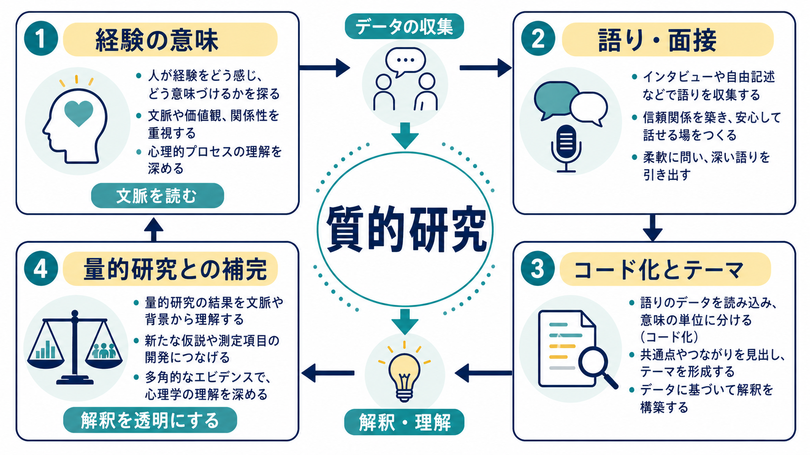
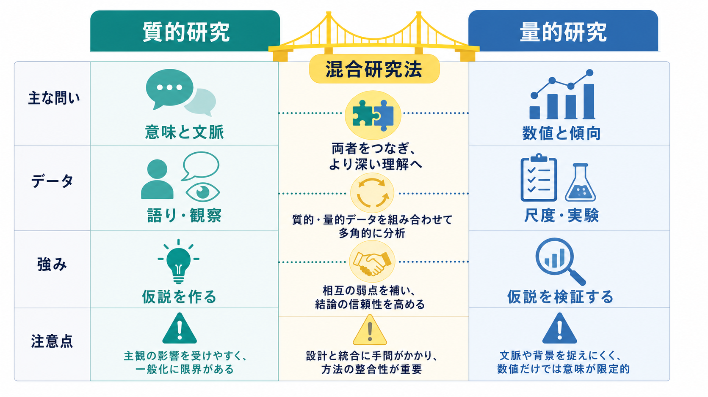

# 質的研究は心理学でどう使われるのか

## 要点

- 質的研究は、語り、観察記録、文章資料などを手がかりに、人が経験をどのように意味づけているかを分析する研究法である。
- 心理学では、臨床経験、発達、文化、アイデンティティ、支援過程、患者・当事者の語りなど、数値だけでは捉えにくい現象を理解するために使われる。
- 量的研究が「どのくらい多いか」「平均的に差があるか」「仮説は支持されるか」を問いやすいのに対し、質的研究は「どのような意味構造か」「どの文脈で生じるか」「どの過程をたどるか」を問いやすい。
- 質的研究の厳密さは、サンプル数の大きさではなく、研究者の立場、データ収集、コード化、テーマ生成、反証例、引用提示、報告の透明性によって評価される[1][2][3]。
- 質的研究と量的研究は対立物ではない。質的研究は仮説や尺度項目を作り、量的研究はその仮説や測定モデルを広いサンプルで検証する、という補完関係を持つ。

## この記事で答える問い

1. 質的研究は心理学で何を明らかにする方法なのか。
2. 面接や語りのデータは、どのようにコード化され、テーマへ整理されるのか。
3. 質的研究と量的研究は、問い、データ、一般化の仕方がどう違うのか。
4. 臨床心理学・精神医学・心理測定では、質的研究はどのように役立つのか。
5. 「質的研究は主観的で弱い」という誤解をどう考えればよいのか。

## まず結論

質的研究は、心理学における「意味を読む方法」である。たとえば、うつ病からの回復を経験した人が「よくなる」とは何を意味しているのか、発達障害のある学生が大学生活をどのように調整しているのか、心理療法の中でどのような語りの変化が起きるのか、といった問いに向いている。

ここで扱うデータは、面接逐語録、観察記録、日記、自由記述、臨床記録、オンライン投稿、フィールドノートなどである。研究者はそれらを読み、意味の単位に分け、コードを付け、コード間の関係を整理し、より抽象度の高いテーマや概念へまとめる。代表的な方法には、テーマ分析、グラウンデッド・セオリー、解釈的現象学的分析、ナラティブ分析、エスノグラフィなどがある[2][4][5]。

重要なのは、質的研究が「感想を集めるだけ」の作業ではない点である。APA の質的研究報告基準 JARS-Qual は、研究目的、研究者の立場、参加者、サンプリング、データ収集、分析手続き、解釈の根拠を明示することを求めている[1]。COREQ も、面接・フォーカスグループ研究の報告において、研究チームと省察性、研究デザイン、分析と報告を整理する 32 項目のチェックリストを提示している[3]。つまり、質的研究の信頼性は「誰が読んでも同じ数値になる」ことだけではなく、「どのデータから、どの解釈が、どの手続きで導かれたか」を読者が追跡できることに支えられる。

## 背景

心理学は、実験、調査、観察、心理測定、面接、臨床記録など、複数の方法を組み合わせて人間を研究する。[[実験研究とは何か]]で扱うような実験は、条件を統制し、因果関係を検討するうえで強い。一方で、現実の生活、文化、対人関係、臨床場面では、本人にとっての意味や文脈が結果を大きく左右する。

たとえば、不安症状の尺度得点が同じ 20 点であっても、ある人にとっては「失敗への恐怖」が中心であり、別の人にとっては「他者に迷惑をかけることへの罪悪感」が中心かもしれない。[[心理測定とは何か]]や[[構成概念妥当性とは何か]]の観点から見れば、尺度得点は構成概念の一部を数値化した指標であって、経験そのものではない。質的研究は、この数値の背後にある意味、語り、生活文脈を明らかにする。

質的研究は、特に次のような場面で有用である。

| 研究上の目的 | 心理学での例 | 質的研究が役立つ理由 |
|---|---|---|
| 現象を探索する | 新しい支援プログラムを受けた人が何を助けと感じたか | 既存尺度にない経験を拾える |
| 意味を理解する | 慢性疾患、不妊、喪失、回復を当事者がどう語るか | 体験の文脈と価値を扱える |
| 過程を記述する | 心理療法で自己理解が変化する過程 | 時間的な変化や転機を追える |
| 仮説を作る | 孤独感を強める日常場面のパターン | 後の調査・実験の問いを作れる |
| 尺度項目を作る | 新しい心理尺度の項目候補を作る | 当事者の言葉を項目に反映できる |

このため、質的研究は[[心理学研究法とは何か]]、[[観察研究とは何か]]、[[心理尺度はどのように作られるのか]]と密接につながる。

## 基本概念

### 質的データ

質的データとは、数値そのものではなく、言葉、行動、状況、関係、物語、記録として表れるデータである。面接逐語録、フォーカスグループ、観察記録、日記、自由記述、臨床ノートなどが典型である。Pope らは、質的データ分析では逐語録、フィールドノート、研究者の省察メモなど大量の資料を扱い、そこからパターンや説明を構成していくと整理している[6]。

### コード

コードとは、データ中の意味のある部分に付ける短いラベルである。たとえば「人に迷惑をかけたくない」「症状を隠す」「支援を頼るのが怖い」という発話に、「援助要請へのためらい」というコードを付けることができる。コードは単なる要約ではなく、研究の問いに照らして、どの意味が重要かを見定める分析単位である。

### テーマ

テーマとは、複数のコードを統合して見えてくる、より抽象度の高い意味のまとまりである。Braun と Clarke は、テーマ分析を心理学で広く使える柔軟な方法として整理し、データへのなじみ、コード化、テーマ探索、テーマ確認、テーマ定義、報告という流れを示した[2]。テーマは「よく出てきた話題」だけではない。研究の問いに照らして、データの中で重要な意味パターンを表すものである。

### 省察性

省察性とは、研究者自身の立場、価値観、専門性、参加者との関係が、データ収集や解釈にどう影響しうるかを自覚し、記録し、報告する姿勢である。質的研究では、研究者を完全に透明な測定器として扱わない。むしろ、研究者の関与を明示し、解釈の過程を追跡できるようにする。

### 飽和

飽和とは、追加データを集めても、新しい重要なコードやテーマがほとんど現れなくなる状態を指すことが多い。ただし、飽和は機械的な停止規則ではない。研究目的、対象の多様性、分析の深さ、方法論によって意味が変わる。したがって「何人なら十分か」よりも、「どの問いに対して、どの範囲の経験を、どの深さまで扱ったか」を報告する必要がある。

## 仕組み

質的研究の典型的な流れは、問いを立て、データを集め、逐語録や観察記録を作り、コード化し、テーマや概念を生成し、データ引用で解釈を支える、という順序で整理できる。

1. 研究の問いを定める  
   「何が多いか」ではなく、「どのように経験されるか」「どの意味づけがなされるか」「どの過程をたどるか」を問う。

2. 対象とデータ収集法を選ぶ  
   半構造化面接、フォーカスグループ、観察、自由記述、文書資料などを、問いに合わせて選ぶ。

3. 逐語録やフィールドノートを整える  
   発話だけでなく、沈黙、感情表現、場面、文脈をどの程度記録するかを決める。

4. 初期コードを付ける  
   発話や記録を意味の単位に分け、研究の問いに関係するラベルを付ける。

5. コード間の関係を検討する  
   類似コードをまとめ、相違点や反証例を探し、概念の輪郭を調整する。

6. テーマや理論へまとめる  
   テーマ分析ではテーマ、グラウンデッド・セオリーではカテゴリや理論的説明を形成する[2][5]。

7. 引用と手続きで解釈を支える  
   参加者の語りを引用し、どのデータがどの解釈を支えているかを示す。

この流れで特に重要なのは、分析が一方向ではなく反復的である点である。データを読んでコードを付ける、コードを見直す、例外的な語りを探す、テーマ名を修正する、研究者の前提を省察する、という往復が質的分析の中心になる。Mays と Pope は、質的研究の品質を評価するには、妥当性や関連性を量的研究と同じ言葉で機械的に適用するのではなく、質的研究の目的に即して操作化する必要があると述べている[7]。

## 図解

次の図は、質的研究と量的研究の違いを大まかに整理したものである。

| 観点 | 質的研究 | 量的研究 |
|---|---|---|
| 主な問い | どのように経験されるか、どんな意味を持つか | どの程度あるか、差や関連はあるか |
| データ | 語り、観察、記録、自由記述 | 尺度得点、反応時間、正答率、生理指標 |
| 分析 | コード化、テーマ生成、比較、解釈 | 統計モデル、検定、推定、効果量 |
| 強み | 文脈、意味、過程、少数派の経験を扱える | 一般的傾向、効果の大きさ、仮説検証に強い |
| 注意点 | 研究者の立場、解釈の透明性、過度な一般化 | 測定の妥当性、交絡、平均への過度な依存 |

質的研究は、代表性よりも情報量の豊かさを重視することが多い。たとえば、少数の参加者を深く面接し、経験の構造を丁寧に分析することがある。一方、量的研究は、大きなサンプルで分布、平均差、関連、予測を調べることに向いている。これは優劣ではなく、研究の問いの違いである。

混合研究法では、両者を組み合わせる。たとえば、最初に質的面接で当事者の経験を探索し、その結果をもとに質問紙項目を作り、次に大規模調査で因子構造や[[信頼性とは何か|信頼性]]、[[妥当性とは何か|妥当性]]を検討する。逆に、量的研究で得られた予想外の結果について、後から面接を行い、なぜそのような結果になったのかを探ることもできる。

## 臨床・研究との接続

### 臨床心理学

臨床心理学では、症状尺度だけでなく、本人が症状をどう理解しているか、支援をどう経験しているか、どの場面で困難が強まるかが重要になる。たとえば、同じ不安得点でも、「他者評価への恐れ」「身体感覚への恐怖」「失敗後の反芻」「家族内での役割」といった意味づけは異なる。質的研究は、この違いを記述し、支援仮説や面接方針を考える材料を与える。

ただし、質的研究の知見を個別診断や治療指示として直接使うことはできない。臨床で使うには、本人の状態、生活環境、リスク、安全性、既存のエビデンス、専門職の判断と統合する必要がある。この記事での説明は教育・研究目的であり、個別の診断や治療方針を決めるものではない。

### 心理測定

心理尺度を作るとき、研究者の机上の概念だけで項目を作ると、当事者の経験からずれた項目になることがある。質的面接や自由記述は、項目候補を作る初期段階で役立つ。たとえば、ストレス、疲労、孤独感、回復感、自己効力感のような概念では、本人が実際に使う言葉を集めることで、[[内容的妥当性とは何か|内容的妥当性]]を高めやすくなる。

その後、[[因子分析とは何か]]、[[内的一貫性とは何か]]、[[再検査信頼性とは何か]]、[[基準関連妥当性とは何か]]などを通じて、尺度得点の解釈を量的に検討する。つまり、質的研究は尺度開発の前半で「何を測るべきか」を具体化し、量的研究は後半で「その得点をどう解釈できるか」を検証する。

### 認知・発達・社会心理学

認知心理学では、課題成績や反応時間が中心になりやすいが、課題を参加者がどう理解したかを調べる質的情報は重要である。発達心理学では、家庭、学校、友人関係、文化的期待が経験の意味を変える。社会心理学では、偏見、アイデンティティ、集団経験、オンライン相互作用など、文脈に依存する現象が多い。

たとえば[[物語的自己とは何か]]で扱うような人生の語りは、単なる記憶の内容ではなく、自己理解やアイデンティティ形成に関わる。質的研究は、このような語りの構造や変化を分析する手段になる。

### 研究報告の透明性

質的研究では、研究者が何をしたかを読者が追跡できることが重要である。JARS-Qual は心理学における質的研究、質的メタ分析、混合研究法の報告基準を示し、COREQ は面接・フォーカスグループ研究の透明な報告を促す[1][3]。これらは研究の質を自動的に保証する採点表ではないが、読者が研究の強みと限界を評価するための足場になる。

## よくある誤解

### 「質的研究は主観的だから科学ではない」

質的研究は主観を扱うが、恣意的な感想ではない。研究者の立場、データ収集、分析手続き、反証例、引用提示を明示し、解釈の根拠を読者が評価できるようにする。主観的経験を研究対象にすることと、研究手続きが恣意的であることは別である。

### 「人数が少ない研究は意味がない」

質的研究では、サンプル数の大きさよりも、問いに対して十分な情報量と多様性があるかが重要になる。少人数でも、深い面接によって経験の構造や仮説生成に有用な知見が得られることがある。ただし、その知見を「すべての人に当てはまる」と一般化するのは不適切である。

### 「質的研究は量的研究の前段階にすぎない」

質的研究は仮説生成に役立つが、それだけではない。臨床経験、文化的意味、支援過程、少数派の経験、語りの変化など、量的研究だけでは十分に扱えない問いに答える独自の価値を持つ。一方で、効果の大きさや集団全体の傾向を示すには量的研究が必要になる。

### 「研究者の解釈が入るなら信頼できない」

解釈が入ること自体が問題なのではなく、解釈の過程が不透明であることが問題である。質的研究では、省察メモ、複数研究者での検討、参加者の語りの引用、反証例の提示、監査可能な分析記録などによって、解釈の妥当性を支える。

## 関連ノート

- [[心理学研究法とは何か]]
- [[心理測定とは何か]]
- [[心理尺度はどのように作られるのか]]
- [[信頼性とは何か]]
- [[妥当性とは何か]]
- [[構成概念妥当性とは何か]]
- [[内容的妥当性とは何か]]
- [[実験研究とは何か]]
- [[観察研究とは何か]]
- [[因子分析とは何か]]
- [[物語的自己とは何か]]

MOC 更新候補: `content/00_MOC/MOC｜研究方法.md` と `content/00_MOC/MOC｜認知科学・心理学.md` の心理学研究法・質的研究項目に追加するとよい。並列ジョブとの競合を避けるため、本記事では MOC 本体は更新しない。

## 理解チェック

1. 質的研究が「意味」や「文脈」を扱うとは、具体的に何を分析することか。
2. コードとテーマはどう違うか。
3. 質的研究と量的研究は、問い、データ、一般化の仕方でどう異なるか。
4. 質的研究で研究者の省察性が重要になる理由は何か。
5. 心理尺度を作るとき、質的研究はどの段階で役立つか。

## 未解決問題

- 質的データの共有と再分析を進めるとき、参加者の匿名性や文脈の保護をどう両立するか。
- AI による逐語録要約やコード化支援を使う場合、研究者の解釈責任と監査可能性をどう確保するか。
- 質的研究と量的研究を組み合わせる混合研究法で、どちらか一方を補助的扱いにしない統合の仕方をどう設計するか。
- 文化差や少数派の経験を扱う研究で、研究者と参加者の権力差をどのように報告・検討するか。

## 参考文献

[1] Levitt, H. M., Bamberg, M., Creswell, J. W., Frost, D. M., Josselson, R., & Suarez-Orozco, C. (2018). Journal article reporting standards for qualitative primary, qualitative meta-analytic, and mixed methods research in psychology. *American Psychologist, 73*(1), 26-46. https://doi.org/10.1037/amp0000151

[2] Braun, V., & Clarke, V. (2006). Using thematic analysis in psychology. *Qualitative Research in Psychology, 3*(2), 77-101. https://doi.org/10.1191/1478088706qp063oa

[3] Tong, A., Sainsbury, P., & Craig, J. (2007). Consolidated criteria for reporting qualitative research (COREQ): A 32-item checklist for interviews and focus groups. *International Journal for Quality in Health Care, 19*(6), 349-357. https://doi.org/10.1093/intqhc/mzm042

[4] Ponterotto, J. G. (2005). Qualitative research in counseling psychology: A primer on research paradigms and philosophy of science. *Journal of Counseling Psychology, 52*(2), 126-136. https://doi.org/10.1037/0022-0167.52.2.126

[5] Charmaz, K. (2006). *Constructing grounded theory: A practical guide through qualitative analysis*. Sage. https://openlibrary.org/works/OL4460998W/Constructing_Grounded_Theory

[6] Pope, C., Ziebland, S., & Mays, N. (2000). Analysing qualitative data. *BMJ, 320*, 114-116. https://doi.org/10.1136/bmj.320.7227.114

[7] Mays, N., & Pope, C. (2000). Assessing quality in qualitative research. *BMJ, 320*, 50-52. https://doi.org/10.1136/bmj.320.7226.50
