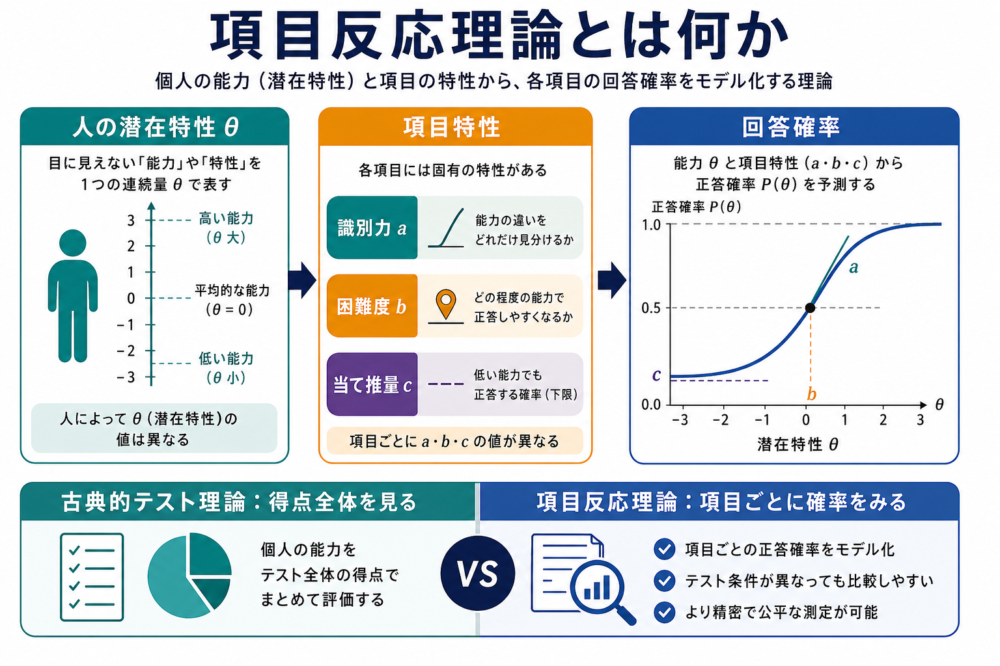
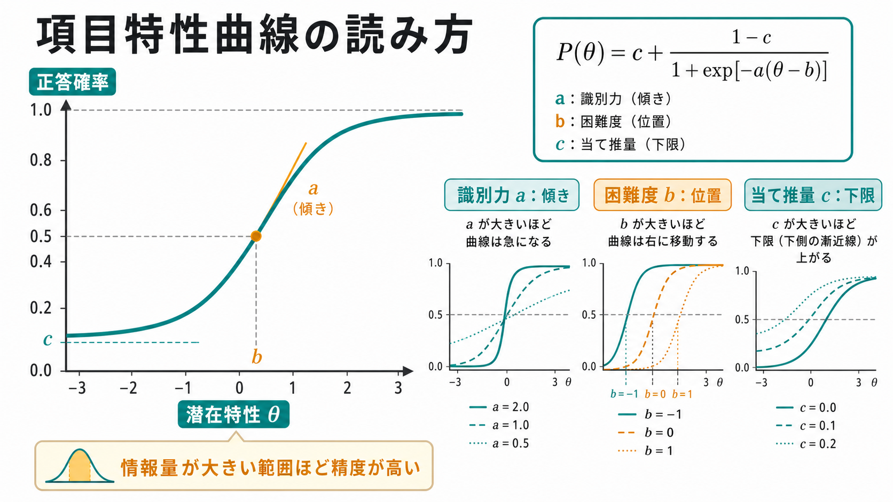
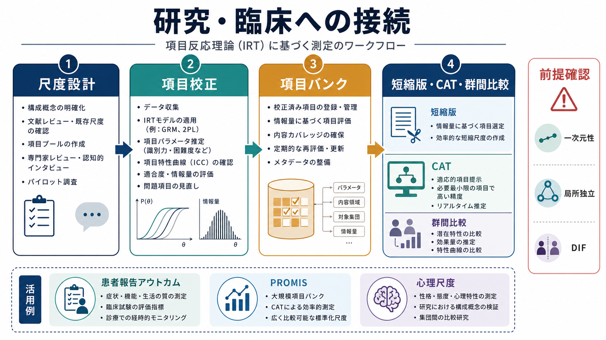

# 項目反応理論とは何か

## 要点

- 項目反応理論（item response theory: IRT）は、観察された合計得点だけでなく、個人の潜在特性 $\theta$ と各項目の性質から回答確率をモデル化する[[心理測定とは何か|心理測定]]の理論である。
- 典型的な二値項目では、項目の「困難度」「識別力」「当て推量」を使い、ある人がその項目に正答・肯定反応する確率を表す[1][2]。
- IRT は、尺度作成、項目バンク、短縮版尺度、コンピュータ適応型検査（CAT）、患者報告アウトカム、群間比較の検討に使われる[3][4]。
- ただし、モデルを当てはめれば自動的に妥当な尺度になるわけではない。一次元性、局所独立、項目適合、DIF（differential item functioning; 特異項目機能）を確認する必要がある[2][5]。

## この記事で答える問い

- IRT は[[信頼性とは何か|信頼性]]や[[妥当性とは何か|妥当性]]とどう関係するのか。
- 古典的テスト理論（CTT）と何が違うのか。
- 項目特性曲線、情報量、項目バンクは何を意味するのか。
- 研究や臨床評価で IRT を使うとき、どこに注意すべきか。

## まず結論

IRT は、「その人はどのくらい能力・症状・特性を持っているか」と「その項目はどのくらい難しいか、どのくらいよく見分けるか」を同じモデル内で扱う枠組みである。合計点を単に足し合わせるのではなく、項目ごとの反応パターンから潜在特性を推定するため、項目の質を評価しながら尺度を洗練できる[1][2]。

## 背景

[[心理尺度はどのように作られるのか|心理尺度]]や認知検査では、うつ症状、認知能力、態度、生活の質のように、直接には観察できない構成概念を測ろうとする。古典的テスト理論では、観測得点 $X$ を真の得点 $T$ と誤差 $E$ の和として考え、総得点、平均、分散、信頼性係数などを中心に評価する。この発想は直感的で扱いやすいが、項目ごとの性質を明示的には表しにくい。

IRT は、Rasch モデル、2 パラメータロジスティックモデル、3 パラメータロジスティックモデル、段階反応モデルなどを通じて、個人と項目の関係を確率モデルとして表す[1][6][7]。そのため、同じ合計点でも、どの項目に反応したかというパターンが意味を持つ。

## 基本概念

### 潜在特性

潜在特性 $\theta$ は、能力、症状の重さ、態度傾向など、直接観察できない連続量を表す。多くの IRT モデルでは、$\theta=0$ を平均的水準、正の値を高い水準、負の値を低い水準として標準化して扱う。

### 項目困難度

困難度 $b$ は、その項目に反応しやすくなる $\theta$ の位置を表す。能力検査なら「正答しやすくなる能力水準」、症状尺度なら「肯定反応しやすくなる症状水準」と考えられる。$b$ が高い項目は、高い $\theta$ の人でないと反応しにくい[2]。

### 項目識別力

識別力 $a$ は、項目が $\theta$ の近い人々をどの程度よく分けるかを表す。項目特性曲線の傾きが急なほど、ある $\theta$ 付近で反応確率が大きく変わり、その範囲の測定に有用である[2]。

### 当て推量

3 パラメータロジスティックモデルでは、当て推量 $c$ が含まれる。これは低い $\theta$ でも偶然に正答する下限確率を表す。多肢選択式の能力検査では意味を持ちやすいが、臨床質問紙や態度尺度では常に必要とは限らない[1][2]。

## 仕組み

二値項目の代表例である 3PL モデルは、概念的には次の形で表せる。

$$
P(X=1 \mid \theta)=c+\frac{1-c}{1+\exp[-a(\theta-b)]}
$$

ここで $P(X=1 \mid \theta)$ は、潜在特性 $\theta$ の人が項目に正答または肯定反応する確率である。$a$ は曲線の傾き、$b$ は曲線の位置、$c$ は下限を変える。$c=0$ とすれば 2PL モデルに近づき、さらに全項目で $a$ を等しいと考えると Rasch 型の考え方に近づく[1][6]。

重要なのは、項目は全ての能力範囲で同じ精度を持つわけではない、という点である。項目情報量は、ある $\theta$ 付近でその項目がどれだけ精密な情報を与えるかを表す。複数項目の情報量を足し合わせると、尺度全体がどの範囲の $\theta$ を精密に測っているかを確認できる[2]。

## 図解

IRT の実務的な流れは、まず測りたい構成概念を明確にし、候補項目を作り、データを集め、モデルを当てはめ、項目パラメータと適合度を確認することで進む。十分に校正された項目は項目バンクとして管理でき、対象者に応じて項目を選ぶ CAT や短縮版尺度の設計に利用できる[3][4]。

## 臨床・研究との接続

臨床研究では、症状、機能、生活の質、治療負担などを患者報告アウトカムとして測定する場面が多い。IRT は、項目バンクと CAT を組み合わせることで、少ない項目数でも測定精度を保ちやすくする。PROMIS はその代表的な応用例であり、健康関連アウトカムを標準化された項目バンクとして扱う発想を発展させた[4]。

研究面では、IRT は尺度短縮、項目選択、群間比較、縦断研究に役立つ。たとえば、同じ構成概念を測る項目でも、年齢、文化、言語、診断群によって反応しやすさが異なる場合がある。このような DIF を検出しないまま群間差を解釈すると、構成概念の差ではなく項目のバイアスを読んでしまう可能性がある[5]。

医療・精神医学領域では、IRT の出力を個別診断や治療指示として直接読むのではなく、研究用の測定精度、尺度の妥当性検討、集団比較の補助情報として扱う必要がある。

## よくある誤解

### IRT は CTT より常に優れている

IRT は項目レベルの情報を扱える強力な枠組みだが、十分なサンプルサイズ、モデル選択、前提確認、専門的解釈が必要である。小規模研究や探索段階では、CTT の記述統計、信頼性、項目分析が依然として有用な場合もある。

### 高い識別力の項目だけを残せばよい

識別力が高い項目は有用だが、尺度全体が測りたい範囲を覆っているかも重要である。高い識別力の項目ばかりでも、困難度が一部に偏れば、低い水準や高い水準の人を十分に測れない。

### IRT は合計点を不要にする

IRT は合計点を単純に否定するものではない。むしろ、合計点や尺度得点がどの範囲でどの程度情報を持つのかを評価し、得点解釈を精密化するための方法である。

### モデル適合が良ければ妥当性は証明された

IRT の適合は、測定モデルの一部の根拠にすぎない。[[構成概念妥当性とは何か|構成概念妥当性]]、内容的妥当性、外的基準との関係、反応過程などを合わせて検討する必要がある[8]。

## 関連ノート

- [[心理測定とは何か]]
- [[心理尺度はどのように作られるのか]]
- [[信頼性とは何か]]
- [[妥当性とは何か]]
- [[構成概念妥当性とは何か]]
- [[内的一貫性とは何か]]
- [[基準関連妥当性とは何か]]

## MOC更新候補

- `content/00_MOC/MOC｜認知科学・心理学.md`
- `content/00_MOC/MOC｜統計・医療統計.md`

## 理解チェック

1. IRT が「人の特性」と「項目の特性」を分けて扱う利点は何か。
2. 項目困難度 $b$ と識別力 $a$ は、項目特性曲線のどこに表れるか。
3. 項目情報量が高い範囲とは、どのような意味を持つか。
4. DIF を確認しない群間比較には、どのようなリスクがあるか。
5. IRT の結果だけで妥当性が証明されたと言えないのはなぜか。

## 未解決問題

- 多次元 IRT を使うべきか、一次元モデルで十分かをどう判断するか。
- 臨床尺度で当て推量パラメータを含めることに実質的意味があるか。
- CAT の効率性と、患者・参加者にとっての回答負担や内容的納得感をどう両立するか。
- 文化差や翻訳差がある項目を、DIF として除外するだけでなく、構成概念の違いとしてどう解釈するか。

## 参考文献

[1] Lord, F. M. (1980). *Applications of Item Response Theory to Practical Testing Problems*. Lawrence Erlbaum Associates. https://archive.org/details/applicationsofit0000lord

[2] Hambleton, R. K., Swaminathan, H., & Rogers, H. J. (1991). *Fundamentals of Item Response Theory*. Sage. https://us.sagepub.com/en-us/nam/fundamentals-of-item-response-theory/book3557

[3] Edelen, M. O., & Reeve, B. B. (2007). Applying item response theory (IRT) modeling to questionnaire development, evaluation, and refinement. *Quality of Life Research, 16*(Suppl 1), 5-18. https://doi.org/10.1007/s11136-007-9198-0

[4] Cella, D., Yount, S., Rothrock, N., Gershon, R., Cook, K., Reeve, B., Ader, D., Fries, J. F., Bruce, B., Rose, M., & PROMIS Cooperative Group. (2007). The Patient-Reported Outcomes Measurement Information System (PROMIS): Progress of an NIH Roadmap cooperative group during its first two years. *Medical Care, 45*(5 Suppl 1), S3-S11. https://doi.org/10.1097/01.mlr.0000258615.42478.55

[5] Choi, S. W., Gibbons, L. E., & Crane, P. K. (2011). lordif: An R package for detecting differential item functioning using iterative hybrid ordinal logistic regression/item response theory and Monte Carlo simulations. *Journal of Statistical Software, 39*(8), 1-30. https://doi.org/10.18637/jss.v039.i08

[6] Rasch, G. (1960/1980). *Probabilistic Models for Some Intelligence and Attainment Tests*. Danish Institute for Educational Research; expanded edition, University of Chicago Press. https://www.rasch.org/books.htm

[7] Samejima, F. (1969). Estimation of latent ability using a response pattern of graded scores. *Psychometrika Monograph Supplement, 34*(4, Pt. 2). https://doi.org/10.1007/BF03372160

[8] American Educational Research Association, American Psychological Association, & National Council on Measurement in Education. (2014). *Standards for Educational and Psychological Testing*. AERA. https://www.testingstandards.net/open-access-files.html
