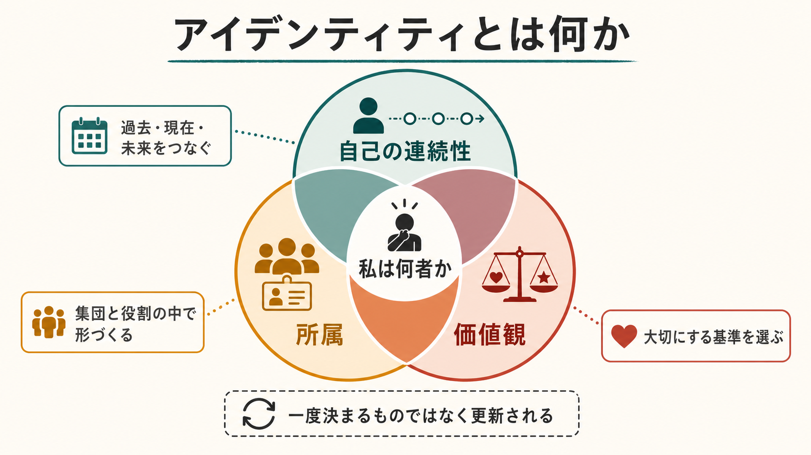
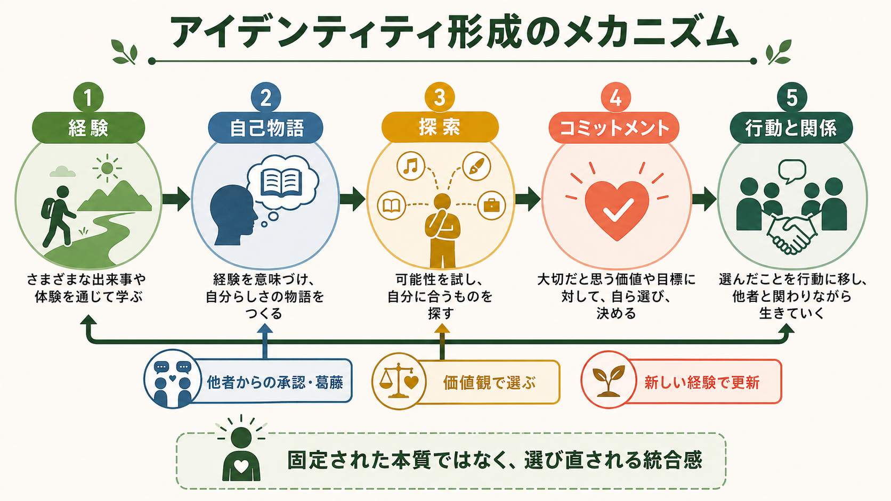
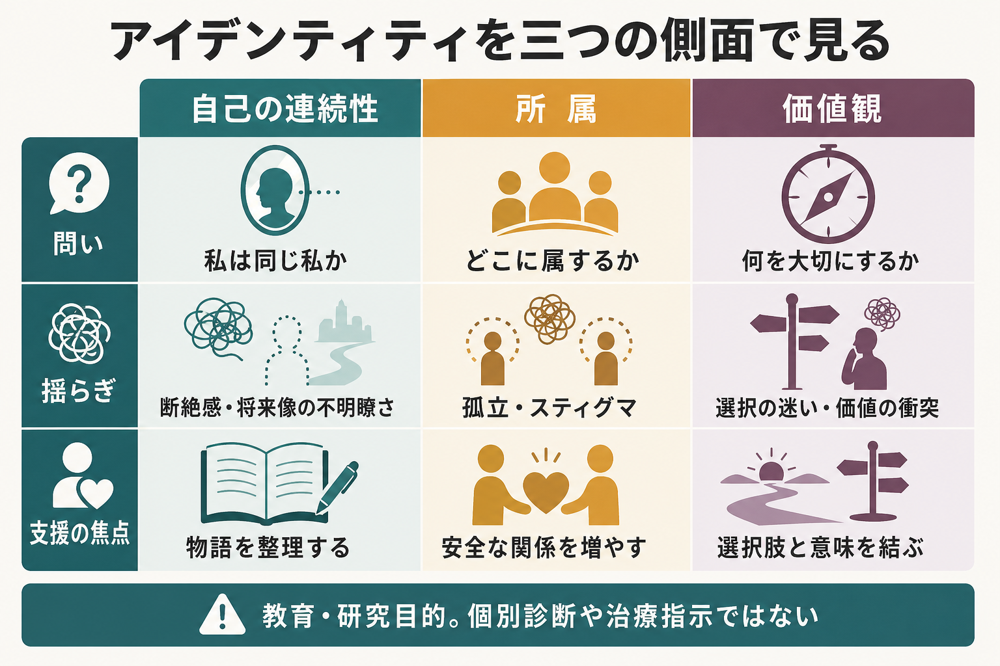

# アイデンティティとは何か

## 要点

- アイデンティティとは、「私は同じ私であり続けている」「私はどこに属している」「私は何を大切にして生きる」という感覚が、ある程度まとまっている状態である。
- それは生まれつき固定された本質ではなく、経験、記憶、他者との関係、社会的役割、価値選択を通じて更新される心理社会的な構成物である [1][2]。
- 発達心理学では、青年期から成人期にかけて「探索」と「コミットメント」を通じて形成されるものとして扱われる [1][2]。
- 社会心理学では、集団所属、承認、スティグマ、内集団・外集団の関係が、自己理解に大きく影響すると考える [3][4]。
- 臨床や支援では、アイデンティティを「本当の自分探し」として急がせるより、生活史、関係、安全感、選択肢、価値観を整理する枠組みとして扱う方が有用である。

## この記事で答える問い

1. アイデンティティとは、自己概念や性格と何が違うのか。
2. なぜ青年期や移行期にアイデンティティが揺らぎやすいのか。
3. 所属、価値観、記憶、物語はどのようにアイデンティティを形づくるのか。
4. 臨床・教育・研究では、アイデンティティをどう扱うとよいのか。

## まず結論

アイデンティティとは、[[自己とは何か|自己]]についての単なる知識ではなく、「自分は時間を越えて同じ人物である」「自分は特定の人間関係や集団の中に位置づけられている」「自分は何を大切にして選ぶのか」という感覚が統合されたものである。

したがって、アイデンティティは三つの面から見ると理解しやすい。第一に、過去・現在・未来をつなぐ自己の連続性。第二に、家族、学校、職場、文化、ジェンダー、専門職、コミュニティなどへの所属。第三に、何を重要と感じ、どの方向へ行動を選ぶかという価値観である。

この三つが常に安定している必要はない。むしろ、進学、就職、移住、病気、喪失、トラウマ、差別、役割変化のような出来事は、アイデンティティを揺らす。重要なのは、揺らぎそのものを異常とみなすことではなく、経験を語り直し、所属を再編し、価値に沿った選択を少しずつ作り直せるかである。

## 背景

アイデンティティ研究の代表的な出発点は、Erikson の心理社会的発達論である。Erikson は、青年期の主要課題を「アイデンティティ対役割混乱」として位置づけ、個人が社会的役割、将来像、価値、身体的成熟、対人関係を統合していく過程を重視した [1]。

その後、Marcia は Erikson の議論を実証研究に接続し、探索とコミットメントという二つの軸から、アイデンティティ達成、モラトリアム、早期完了、拡散という状態を区別した [2]。ここで大切なのは、アイデンティティが「一度見つけたら終わり」のものではなく、選択肢を試し、暫定的に選び、状況に応じて再検討される過程だという点である。

一方、社会的アイデンティティ理論は、アイデンティティを個人の内面だけで説明しない。人は「私はこの集団の一員である」という所属を通じて自己を理解し、集団間の評価や差別、承認、連帯によって自尊感情や行動が変化する [3][4]。この観点は、スティグマ、マイノリティ経験、専門職アイデンティティ、文化的背景を理解するうえで重要である。

## 基本概念

### 自己概念との違い

[[自己概念とは何か|自己概念]]は、「私は内向的だ」「数学が得意だ」「親である」「研究者である」のような、自分についての知識や評価を含む。アイデンティティは、それらの自己概念をばらばらの特徴としてではなく、「自分はこういう人間として生きている」というまとまりとして統合する働きをもつ。

たとえば「学生」「家族の一員」「日本語話者」「精神医学を学ぶ人」という自己概念は、それぞれ独立して存在できる。しかし、それらが「自分はどの集団に属し、何を大切にし、どの方向へ進むのか」という全体像に結びついたとき、アイデンティティとして働く。

### 物語としてのアイデンティティ

[[物語的自己とは何か|物語的自己]]の研究では、アイデンティティは人生の出来事を意味ある物語としてまとめる過程と考えられる。McAdams と McLean は、ナラティブ・アイデンティティを、再構成された過去と想像された未来を統合し、人生に統一性と目的を与える内面化された物語として整理している [5]。

この「物語」は、事実の正確な記録ではない。どの出来事を選び、どう意味づけ、誰に向けて語るかによって変わる。したがって、アイデンティティは記憶の倉庫ではなく、現在の関心、関係、価値観に応じて更新される自己理解である。

### 最小自己との違い

[[最小自己とは何か|最小自己]]は、「この身体は自分の身体である」「この行為は自分が起こしている」という、経験のもっと基礎的な自己性を指す。アイデンティティは、それより広い時間幅をもつ。名前、役割、所属、人生の物語、将来像、価値観が関わるためである。

ただし両者は無関係ではない。身体感覚、主体感、感情調整が大きく揺らぐと、「自分らしさ」や「自分の人生を生きている感覚」も揺らぎやすい。この点で、アイデンティティは身体・記憶・社会をまたぐ概念である。

## 仕組み

アイデンティティ形成の中心には、探索とコミットメントの循環がある。探索とは、価値、職業、関係、信念、所属、ライフスタイルの可能性を試すことである。コミットメントとは、その時点で「これを大切にする」「この方向に進む」と引き受けることである [2]。

### 1. 経験が素材になる

成功、失敗、喪失、達成、葛藤、出会い、差別、ケアされる経験は、アイデンティティの素材になる。ただし、経験は自動的に意味をもつわけではない。同じ出来事でも、「自分はだめだ」と読むことも、「困難を通じて何を大切にしたいかが見えた」と読むこともある。

### 2. 記憶と物語が連続性を作る

自己の連続性は、過去の記憶がそのまま保存されることだけで成り立つのではない。自伝的記憶は、現在の目標や自己理解に応じて検索され、再構成される [6]。そのため、過去をどう語るかは、現在のアイデンティティを支えもすれば、縛りもする。

### 3. 他者と集団が所属を作る

人は単独でアイデンティティを作るわけではない。名前を呼ばれること、役割を与えられること、集団に迎えられること、反対に排除やスティグマを受けることが、自己理解に入り込む [3][4]。この意味で、アイデンティティは「内面の所有物」ではなく、関係の中で維持される。

### 4. 価値観が選択を方向づける

アイデンティティは、価値観とも深く結びつく。「何を大切にするか」が見えないと、選択肢は増えても方向が定まりにくい。自己決定理論では、自律性、有能感、関係性が人間の動機づけやウェルビーイングに重要だとされる [7]。これは、アイデンティティを「他者から期待された役割をこなすこと」だけでなく、自分にとって意味ある選択として考える手がかりになる。

### 5. 行動がアイデンティティを更新する

アイデンティティは頭の中で完成してから行動に移されるものではない。むしろ、選んだ行動、関わった人、引き受けた役割が、次の自己理解を作る。小さな実践を通じて「自分はこういう関係を作れる」「この価値を大切にできる」という感覚が育つ。

## 図解

| 側面 | 中心の問い | 揺らぎの例 | 支援・研究の焦点 |
|---|---|---|---|
| 自己の連続性 | 私は同じ私か | 断絶感、将来像の不明瞭さ、過去の意味づけの困難 | 生活史、記憶、自己物語の整理 |
| 所属 | どこに属するか | 孤立、排除、スティグマ、役割喪失 | 安全な関係、集団参加、社会的承認 |
| 価値観 | 何を大切にするか | 選択の迷い、価値の衝突、他者期待への過剰適応 | 価値明確化、選択肢の検討、行動実験 |

## 臨床・研究との接続

臨床では、アイデンティティの揺らぎをただちに病理とみなすべきではない。青年期、進学・就職、移住、親密な関係の変化、喪失、慢性疾患、精神疾患、トラウマ、社会的差別は、いずれも自己理解を再編する契機になりうる。

一方で、強い断絶感、空虚感、慢性的な自己評価の不安定さ、所属の喪失、将来像の欠如が続く場合、生活機能や精神健康に影響することがある。パーソナリティ機能の研究や精神病スペクトラムのナラティブ研究では、自己の連続性、主体性、他者との関係、物語のまとまりが重要な観察点として扱われる [5][8]。ただし、これは教育・研究目的の説明であり、個別診断や治療指示ではない。

研究では、アイデンティティを質問紙、面接、ナラティブ分析、発達縦断研究、社会心理実験などで扱う。どの方法でも、個人の内面だけでなく、語る場面、文化、社会的地位、関係性を考慮する必要がある。アイデンティティは「測ればそのまま見えるもの」ではなく、測定方法によって捉えられる側面が変わるからである。

## よくある誤解

### 誤解1: アイデンティティは一つの本当の自分である

アイデンティティは、隠された唯一の本質ではない。人は家族の中、仕事の中、友人関係の中、文化の中で少しずつ異なる自己を生きる。重要なのは、それらが完全に一つになることではなく、矛盾や複数性を抱えながらも、ある程度の連続性と方向感を保てることである。

### 誤解2: アイデンティティは青年期に完成する

青年期は重要な時期だが、アイデンティティは成人後も変化する。親になる、職業を変える、病気を経験する、喪失を経験する、文化的環境が変わるといった出来事は、何歳であっても自己理解を再編する。

### 誤解3: 所属は個性を弱める

所属は個性を消すだけのものではない。むしろ、人は集団、言語、文化、役割の中で、自分の選択や価値を見つけることが多い。問題になるのは、所属が一方的に押しつけられたり、所属を理由に排除やスティグマが生じたりする場合である [3][4]。

### 誤解4: アイデンティティの揺らぎは悪い

揺らぎは、変化に適応するための探索でもある。問題は、揺らぎが長く続いて生活が著しく狭まる場合や、他者からの否定や孤立によって選択肢が失われる場合である。支援では、早く答えを出させるより、安全に探索できる条件を整えることが重要になる。

## 関連ノート

### 既存ノート

- [[自己とは何か]]
- [[自己概念とは何か]]
- [[物語的自己とは何か]]
- [[最小自己とは何か]]
- [[社会的認知とは何か]]

### 今後の作成候補

- 青年期のアイデンティティ形成とは何か
- 青年期のアイデンティティ形成と精神健康はどう関係するのか
- アイデンティティ・ステータスとは何か
- 社会的アイデンティティ理論とは何か
- ナラティブ・アイデンティティとは何か
- 価値明確化とは何か
- スティグマとは何か
- 内集団バイアスとは何か
- 自己決定理論とは何か

### MOC更新候補

- `content/00_MOC/MOC・認知科学・心理学.md`
- `content/00_MOC/MOC・精神医学.md`
- `content/00_MOC/MOC・哲学・倫理・社会.md`

## 理解チェック

1. アイデンティティを「自己の連続性」「所属」「価値観」に分けると、どのような利点があるか。
2. 探索とコミットメントは、アイデンティティ形成の中でどのように循環するか。
3. 社会的アイデンティティの観点は、「本当の自分」という考え方にどのような修正を加えるか。
4. 物語的自己の観点から見ると、過去の記憶はなぜ固定された記録ではないのか。
5. 臨床や教育で、アイデンティティの揺らぎを急いで解消しようとすることにはどのようなリスクがあるか。

## 参考文献

[1] Erikson, E. H. (1968). *Identity: Youth and Crisis*. W. W. Norton. https://wwnorton.com/books/9780393311440

[2] Marcia, J. E. (1966). Development and validation of ego-identity status. *Journal of Personality and Social Psychology, 3*(5), 551-558. https://doi.org/10.1037/h0023281

[3] Tajfel, H., & Turner, J. C. (1979). An integrative theory of intergroup conflict. In W. G. Austin & S. Worchel (Eds.), *The Social Psychology of Intergroup Relations* (pp. 33-47). Brooks/Cole. https://psycnet.apa.org/record/2004-13697-016

[4] Ellemers, N., Spears, R., & Doosje, B. (2002). Self and social identity. *Annual Review of Psychology, 53*, 161-186. https://doi.org/10.1146/annurev.psych.53.100901.135228

[5] McAdams, D. P., & McLean, K. C. (2013). Narrative identity. *Current Directions in Psychological Science, 22*(3), 233-238. https://doi.org/10.1177/0963721413475622

[6] Conway, M. A., & Pleydell-Pearce, C. W. (2000). The construction of autobiographical memories in the self-memory system. *Psychological Review, 107*(2), 261-288. https://doi.org/10.1037/0033-295X.107.2.261

[7] Ryan, R. M., & Deci, E. L. (2000). Self-determination theory and the facilitation of intrinsic motivation, social development, and well-being. *American Psychologist, 55*(1), 68-78. https://doi.org/10.1037/0003-066X.55.1.68

[8] Cowan, H. R., Mittal, V. A., & McAdams, D. P. (2021). Narrative identity in the psychosis spectrum: A systematic review and developmental model. *Clinical Psychology Review, 88*, 102067. https://doi.org/10.1016/j.cpr.2021.102067
