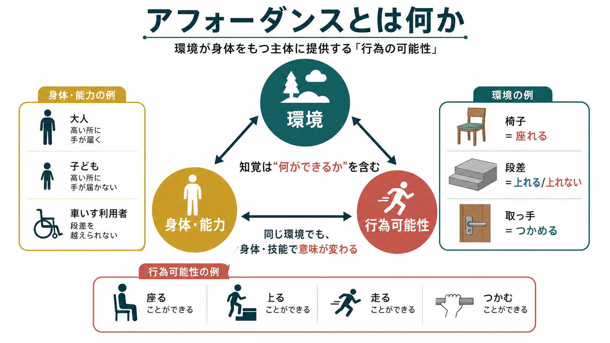
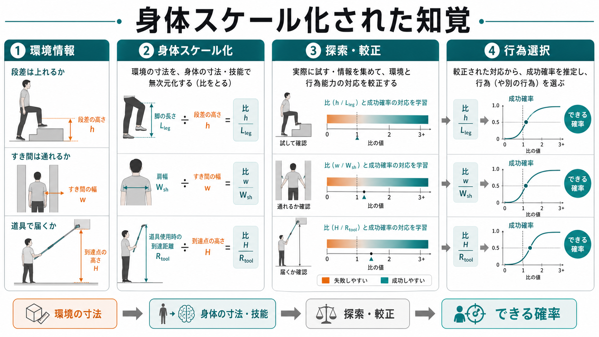

# アフォーダンスとは何か

## 要点

- アフォーダンスとは、環境が行為者に提供する「行為可能性」である。椅子は座ることを、段差は上ることを、取っ手はつかむことを可能にするが、それは物だけの性質ではなく、身体・技能・状況との関係として成立する[1][4]。
- 同じ環境でも、子ども、成人、高齢者、道具を持った人、疲労している人では、知覚されるアフォーダンスが変わる。環境の寸法は、身体の寸法や運動能力によって「できる／できない」の境界をもつ[2][3]。
- アフォーダンスの知覚は、単に対象を認識することではなく、「この環境で何ができるか」を見分けることである。したがって [[知覚とは何か]]、[[自己とは何か]]、[[予測処理とは何か]] と接続する。
- デザイン分野の「アフォーダンス」は、Gibson の生態心理学の用語とは少しずれる。実際に可能な行為と、ユーザーが可能だと知覚する手がかり、すなわちシグニファイアを区別する必要がある[8]。

## この記事で答える問い

1. アフォーダンスは「物の使い方」なのか、それとも「身体と環境の関係」なのか。
2. なぜ段差、すき間、椅子、道具は、身体の大きさや技能によって違って見えるのか。
3. アフォーダンスは発達、リハビリテーション、デザイン、計算論的認知科学にどうつながるのか。

## まず結論

アフォーダンスは、環境の中にあるが、環境だけには還元できない。たとえば、30 cm の段差は、ある人には「上れる段差」であり、別の人には「危険な障壁」である。違いを生むのは、段差そのものだけではなく、脚の長さ、筋力、バランス、経験、靴、疲労、目的、周囲の支持物である。

Gibson の生態心理学では、知覚は頭の中で対象の表象を作ってから意味づける処理ではなく、環境にある行為の可能性を直接的に拾い上げる働きとして理解される[1]。この見方では、世界は単なる物理量の集合ではない。行為者にとっての世界は、歩ける床、座れる面、つかめる縁、避けるべき穴、近づける相手、使える道具として現れる。

## 背景

アフォーダンスという語を心理学に導入したのは J. J. Gibson である。Gibson は、視覚を網膜像から内的表象を組み立てる過程としてだけ考えるのではなく、動物が環境の中で動きながら、表面・物体・配置が何を可能にするかを知覚する過程として捉えた[1]。

この考え方は、[[知覚とは何か]] を「外界のコピー」ではなく「行為のための情報の抽出」として理解する立場に近い。たとえば、椅子を見るとき、私たちは色や形だけを見ているのではない。高さ、安定性、向き、周囲の余白、自分の姿勢をまとめて、「座れそうか」「動かせそうか」「踏み台にしてよいか」を瞬時に判断している。

アフォーダンス概念が重要なのは、認知を脳内処理だけで閉じず、身体と環境の結びつきとして捉えるからである。このため、身体性認知、発達心理学、スポーツ科学、リハビリテーション、人間中心設計、ロボティクスなどで繰り返し参照されてきた。

## 基本概念

### アフォーダンスは関係である

アフォーダンスを「物に備わった機能」とだけ考えると、重要な点を取り逃がす。Chemero は、アフォーダンスを「環境の特徴」と「動物の能力」の関係として定式化した[4]。この定義では、アフォーダンスは主観的な思い込みではないが、物だけの客観的属性でもない。

たとえば、岩の表面は、ある昆虫には歩ける面であり、人間には粗い壁であり、熟練したクライマーには登れるルートである。環境は同じでも、行為者の身体と技能が変われば、行為可能性の構造も変わる。

### 身体スケール化された知覚

アフォーダンス研究の古典的実験では、階段の蹴上げ高さが脚の長さに対してどの程度なら上れるかが調べられた。Warren は、階段の「上れる／上れない」の境界が、絶対的なセンチメートルではなく、脚の長さとの比で整理できることを示した[2]。続く Warren と Whang の研究では、すき間を通り抜けられるかどうかが肩幅などの身体寸法にスケールされることが示された[3]。

これは、身体が知覚の外側にある単なる実行装置ではないことを意味する。環境の情報は、身体の寸法、動き、可動域、道具の使用可能性によって、行為可能性として読み替えられる。

### できる／できないは二値とは限らない

日常的には「通れる」「通れない」と言うが、実際の行為可能性は確率的である。Franchak と Adolph は、アフォーダンスを二値の境界ではなく、環境条件に対する成功確率の関数として扱うことを提案した[6]。狭いすき間は、必ず失敗するわけでも、必ず成功するわけでもない。身体の揺れ、速度、姿勢調整、注意、経験によって成功確率が変わる。

この見方は、発達やリハビリテーションに重要である。乳幼児や回復期の患者では、身体能力が変化し続けるため、昨日の「できる」が今日も同じとは限らない。アフォーダンス知覚は、固定された知識ではなく、身体と環境の変化に合わせて更新される判断である。

## 仕組み

アフォーダンス知覚は、少なくとも次の四つの過程として整理できる。

| 段階 | 何が起こるか | 例 |
|---|---|---|
| 環境情報の抽出 | 表面、距離、高さ、幅、傾き、摩擦、他者の配置を拾う | 段差の高さ、ドアの幅、床の滑りやすさ |
| 身体スケール化 | 環境情報を身体寸法や運動能力に照らす | 脚の長さに対する段差、肩幅に対する通路 |
| 探索と較正 | 触る、近づく、姿勢を変える、試すことで判断を更新する | すき間の前で肩をひねる、道具を持ち替える |
| 行為選択 | 成功確率、危険、目的、社会的文脈から行為を選ぶ | 上る、迂回する、助けを求める、道具を使う |

較正は特に重要である。身体や環境が変わると、行為者は自分のアフォーダンス知覚を調整し直す必要がある。Franchak は、探索行動がアフォーダンス知覚の再較正に関わることを示し、類似した行為可能性の間でどの過程が共有されるかを検討した[7]。

この点は [[予測処理とは何か]] とも接続できる。予測処理では、脳は環境からの入力を受動的に待つだけでなく、次に何が起こるかを予測し、誤差に応じてモデルを更新すると考える。アフォーダンス知覚も同様に、環境の手がかり、身体状態、過去の成功・失敗から「今できること」を予測し、探索と行為によって更新される。

## 図解

アフォーダンスを理解するうえで、次の三つの区別が役に立つ。

| 区別 | 説明 | 注意点 |
|---|---|---|
| 実在するアフォーダンス | 行為者と環境の関係として実際に成り立つ行為可能性 | 気づかれていなくても存在しうる |
| 知覚されたアフォーダンス | 行為者が「できそう」と判断した行為可能性 | 誤知覚や過信がありうる |
| シグニファイア | 何をすればよいかを示す手がかり | デザインではこちらが重要になることが多い |

Norman は、デザイン領域でアフォーダンスという語が広く使われる一方で、実際には「ユーザーが行為可能性を知覚できるか」が問題になると述べた。画面上のボタンは、物理的には画面のどこでもクリックできるという意味で「クリック可能」だが、ユーザーが意味のある操作対象として知覚できるかは、形、影、ラベル、配置、慣習によって決まる[8]。

## 臨床・研究との接続

### 発達研究

発達研究では、アフォーダンスは「子どもが何を知っているか」だけでなく、「何を試し、どのように失敗から学ぶか」を見る枠組みになる。乳幼児は、段差、斜面、すき間、支持面に対して、見る、触る、揺らす、体重をかけるといった探索を通じて、自分の身体で何ができるかを学ぶ[6]。身体寸法と運動能力が急速に変わる発達期では、この較正がとくに重要である。

### リハビリテーションと支援環境

リハビリテーションでは、環境がどの行為を促し、どの行為を妨げるかを考える必要がある。手すり、椅子の高さ、床材、段差、照明、道具の重さは、患者や利用者に同じ意味をもたない。ここでのポイントは、「安全にできること」を過小評価しても過大評価しても問題が生じることである。

ただし、アフォーダンスの概念から個別の診断や治療方針を直接導くことはできない。臨床では、身体機能、認知機能、情動、環境調整、本人の目的を合わせて評価する必要がある。

### 計算論・ロボティクス

ロボティクスや機械学習では、アフォーダンスは「物体カテゴリ」ではなく「行為結果を予測する表現」として扱われることがある。たとえば、ロボットにとってカップは「カップ」という名前よりも、つかめる、持ち上げられる、液体を入れられる、倒れやすいという行為可能性の束として有用である。

この観点は [[視覚認知はどのように対象を認識するのか]] ともつながる。対象認識が「これは何か」を答える処理だとすれば、アフォーダンス知覚は「これで何ができるか」を答える処理である。

## よくある誤解

### 誤解1：アフォーダンスは物の性質である

アフォーダンスは物だけに宿る性質ではない。椅子の高さ、座面の安定性、行為者の身長、筋力、文化的慣習、目的がそろって、はじめて「座れる」という行為可能性が成立する[4]。

### 誤解2：アフォーダンスは必ず見えている

Gibson 的には、アフォーダンスは知覚されていなくても存在しうる[1]。一方、デザインでは、ユーザーが可能な操作を知覚できることが重要になるため、「知覚されたアフォーダンス」や「シグニファイア」が問題になる[8]。

### 誤解3：アフォーダンスは運動だけに関係する

歩く、つかむ、座るなどの運動アフォーダンスは典型例だが、人間の環境には社会的・文化的なアフォーダンスもある。Rietveld と Kiverstein は、人間が技能と実践を通じて、豊かなアフォーダンスの風景を生きていると論じた[5]。会議室の空席、病院の受付、オンラインフォーム、沈黙している相手も、適切な技能や文脈の中で行為可能性をもつ。

### 誤解4：アフォーダンスは常に正確に知覚される

アフォーダンス知覚には誤差がある。人は狭いすき間を通れると過信することも、実際にはできる行為を避けることもある。身体状態が急に変わったとき、たとえば荷物を背負ったとき、妊娠、加齢、疲労、怪我の後には、較正のずれが生じやすい[6][7]。

## 関連ノート

- [[知覚とは何か]]
- [[視覚認知はどのように対象を認識するのか]]
- [[予測処理とは何か]]
- [[自己とは何か]]
- [[最小自己とは何か]]
- [[認知的柔軟性とは何か]]
- [[熟達者の認知は初心者と何が違うのか]]

関連ノート候補:

- 身体図式とは何か
- 身体所有感とは何か
- 身体イメージとは何か
- 生態心理学とは何か
- シグニファイアとは何か
- 環境調整とリハビリテーション

MOC 更新候補:

- `content/00_MOC/MOC｜認知科学・心理学.md`
- 身体性認知、知覚、発達、デザインを横断する項目として追加するのが自然。

## 理解チェック

1. 椅子が「座れるもの」になるためには、椅子側の性質以外に何が必要か。
2. 階段の上りやすさを、絶対的な高さだけでなく脚の長さとの関係で考える理由は何か。
3. Gibson 的なアフォーダンスと、デザインでいう知覚されたアフォーダンス／シグニファイアはどう違うか。
4. 発達やリハビリテーションで、アフォーダンス知覚の較正が重要になるのはなぜか。

## 未解決問題

- アフォーダンス知覚は、どの程度まで直接的で、どの程度まで予測・記憶・推論に依存するのか。
- 社会的アフォーダンスを、運動アフォーダンスと同じ枠組みでどこまで扱えるのか。
- 個人の技能、文化的慣習、道具使用が、アフォーダンスの「実在性」をどのように変えるのか。
- 臨床・支援環境で、過小な挑戦と過大な危険を避けながら、行為可能性をどう評価・設計するのか。

## 参考文献

[1] Gibson, J. J. (1979). *The Ecological Approach to Visual Perception*. Houghton Mifflin. Open Library: https://openlibrary.org/works/OL5589051W/The_ecological_approach_to_visual_perception

[2] Warren, W. H. (1984). Perceiving affordances: Visual guidance of stair climbing. *Journal of Experimental Psychology: Human Perception and Performance, 10*(5), 683-703. https://doi.org/10.1037/0096-1523.10.5.683

[3] Warren, W. H., & Whang, S. (1987). Visual guidance of walking through apertures: Body-scaled information for affordances. *Journal of Experimental Psychology: Human Perception and Performance, 13*(3), 371-383. https://doi.org/10.1037/0096-1523.13.3.371

[4] Chemero, A. (2003). An outline of a theory of affordances. *Ecological Psychology, 15*(2), 181-195. https://doi.org/10.1207/S15326969ECO1502_5

[5] Rietveld, E., & Kiverstein, J. (2014). A rich landscape of affordances. *Ecological Psychology, 26*(4), 325-352. https://doi.org/10.1080/10407413.2014.958035

[6] Franchak, J. M., & Adolph, K. E. (2014). Affordances as probabilistic functions: Implications for development, perception, and decisions for action. *Ecological Psychology, 26*(1-2), 109-124. https://doi.org/10.1080/10407413.2014.874923

[7] Franchak, J. M. (2017). Exploratory behaviors and recalibration: What processes are shared between functionally similar affordances? *Attention, Perception, & Psychophysics, 79*(6), 1816-1829. https://doi.org/10.3758/s13414-017-1339-0

[8] Norman, D. A. (2008). Affordances and design. *Don Norman's JND.org*. https://jnd.org/affordances-and-design/
