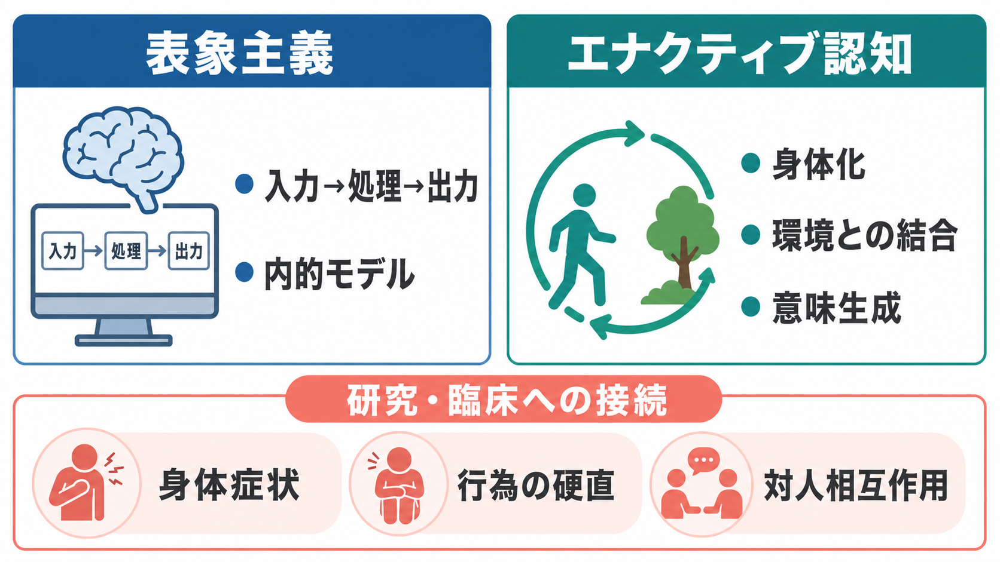

# エナクティブ認知とは何か

## 要点

- エナクティブ認知は、認知を「外界を頭の中に写し取る処理」ではなく、生物が身体を通じて環境とかかわり、その中で意味を生成する過程として捉える立場である [1][2]。
- 中核にあるのは、身体、行為、環境、経験が循環的に結びつくという見方である。知覚は受動的入力ではなく、探索、姿勢、運動、注意、価値づけを含む能動的活動として理解される [4]。
- 生命の自律性、オートポイエーシス、センスメイキング、感覚運動ループ、参与的センスメイキングが重要概念である [1][3][5][6]。
- 精神医学や臨床心理学では、症状を脳内だけに閉じた異常としてではなく、身体状態、行為の可能性、対人相互作用、社会文化的文脈の中で理解する視点を与える [7][8]。

## この記事で答える問い

1. エナクティブ認知は、古典的な認知観と何が違うのか。
2. 「生物が環境との相互作用を通じて意味を生成する」とはどういうことか。
3. 身体、行為、知覚、意識、社会的相互作用はどのように結びつくのか。
4. 研究や臨床で、この見方はどのように役立ち、どこに限界があるのか。

## まず結論

エナクティブ認知とは、認知を「脳内の表象操作」だけで説明するのではなく、生きた身体が環境とかかわりながら世界を意味あるものとして立ち上げる過程として理解する理論である。ここでいう「意味」は、辞書的な意味だけではない。食べられる、避けるべき、近づきたい、使える、危険だ、相手が応答している、といった、生物の行為と生存に関わる価値づけを含む。

この立場では、脳は重要だが単独の司令塔ではない。脳、身体、環境、道具、他者との相互作用が、時間の中で結合しながら認知をつくる。したがって、[[知覚とは何か|知覚]]、[[注意とは何か|注意]]、[[意識とは何か|意識]]、[[最小自己とは何か|最小自己]]は、頭の中に閉じた機能ではなく、身体をもつ主体が世界に働きかける仕方として捉え直される。

## 背景

古典的な認知科学では、認知はしばしば「入力された情報を内部で処理し、出力として行動を生む」過程としてモデル化された。この枠組みは、記憶、推論、言語、問題解決を形式化するうえで強力だった。一方で、身体をもつ生物が、変化する環境の中で即興的に行動し、価値や意味を経験するという側面を捉えにくい。

Varela、Thompson、Rosch の『The Embodied Mind』は、この限界に対して「身体化された認知」と「エナクション」を提案した古典である。彼らは、認知をあらかじめ存在する世界の写像ではなく、身体化された行為を通じて世界が意味あるものとして現れる過程として論じた [2]。その背景には、Maturana と Varela のオートポイエーシス論、すなわち生命システムが自己を産出し維持する自律的組織であるという考え方がある [1]。

Thompson はさらに、生命と心の連続性を論じ、認知を生命活動から切り離さずに理解する必要を示した [3]。この見方では、最小限の認知は、抽象的な計算能力ではなく、生物が自分の存続に関わる差異を区別し、環境に応答するところから始まる。

## 基本概念

### エナクション

エナクションとは、主体が世界を「内的に再現する」のではなく、行為を通じて意味ある世界を enact、つまり生成・実現するという考え方である [2]。たとえば、椅子は単なる物理的対象ではなく、疲れている人には「座れるもの」として現れる。段差は、歩ける人、車椅子利用者、幼児、高齢者で異なる行為可能性をもつ。

### 自律性とオートポイエーシス

オートポイエーシスは、生命システムが自分自身を構成する諸過程を産出し、境界を維持する組織であることを指す [1]。エナクティブ認知では、この自律性が意味生成の土台になる。生物にとって環境の違いは中立ではない。栄養、危険、温度、他者、道具、社会的評価などは、その生物の維持と変化に関わるため、価値を帯びて現れる。

### センスメイキング

センスメイキングとは、生物が環境内の差異を、自分の存続、行為、関心に照らして意味あるものとして扱う過程である [6]。光、音、匂い、表情、姿勢は、物理刺激として入力されるだけではない。身体状態、学習歴、情動、目的、社会的文脈の中で「何として現れるか」が変わる。

### 感覚運動ループ

O'Regan と Noe は、視覚を「脳内画像の生成」ではなく、環境を探索する行為の仕方として捉える感覚運動的説明を提案した [4]。見ることは、目や頭を動かし、予測される感覚変化を利用しながら対象にアクセスする技能である。この考えは、[[予測処理とは何か|予測処理]]やアフォーダンスの議論とも接続しやすい。

### 参与的センスメイキング

De Jaegher と Di Paolo は、センスメイキングを社会的相互作用へ拡張し、参与的センスメイキングを提案した [5]。会話、視線、身振り、間合い、沈黙は、各個人の頭の中だけで完結しない。相互作用そのものが独自のリズムや制約をもち、個人の理解や行為を変える。これは[[社会的認知とは何か|社会的認知]]を、他者の心の推論だけでなく、相互行為のダイナミクスとして見る視点である。

## 仕組み

エナクティブ認知を仕組みとして見ると、次の循環が重要になる。

1. 生物は、自分を維持する自律的な身体をもつ。
2. 身体状態、欲求、情動、姿勢、運動能力が、環境内の何を重要とみなすかを変える。
3. 生物は環境を探索し、触れ、動き、相手に応答する。
4. 行為の結果として感覚入力が変わり、次の行為可能性が更新される。
5. この循環の中で、対象、自己、他者、状況が意味あるものとして経験される。

重要なのは、この循環が単なる「刺激に対する反応」ではないことである。生物は、環境から一方的に決定される受動的な装置ではない。同時に、世界を自由に作り出す孤立した主観でもない。エナクティブ認知は、主体と環境が相互に制約し合いながら、意味ある経験と行為をつくるという中間的な立場をとる。

この考えは、[[主観的経験は科学的に扱えるのか|主観的経験]]の扱いにも関わる。経験は脳内状態だけに還元されないが、測定不能な神秘として放置されるわけでもない。身体、行動、報告、環境条件、相互作用を組み合わせて、経験がどのように成立するかを研究対象にできる。

## 図解

図1は、表象主義的な認知観とエナクティブ認知の違いを大づかみに示している。表象主義は入力、内的モデル、処理を重視し、エナクティブ認知は身体化、環境との結合、意味生成を重視する。ただし、これは「表象はすべて不要」という単純な対立ではない。エナクティブ認知の中にも、表象概念を限定的に使う立場と、できるだけ使わない立場がある [7]。

図2は、経験、解釈、予測、行動、自己評価が循環的に更新されるイメージである。エナクティブ認知では、認知は一回限りの入力処理ではなく、行為の結果を受けて次の見え方や意味づけが変わる動的過程として扱われる。

図3は、アフォーダンスや支援環境との接続を示している。環境は単なる背景ではなく、行為可能性を与えたり狭めたりする。ドアノブ、段差、椅子、リハビリ環境、対人場面は、身体能力や経験によって異なる意味をもつ。

## 臨床・研究との接続

エナクティブ認知は、精神症状や心理的困難を「脳内の異常」だけで説明しない視点を与える。de Haan は、精神疾患を経験的、生理的、社会文化的、実存的な次元を含むセンスメイキングの変化として理解する枠組みを示している [8]。これは診断や治療を置き換えるものではなく、症状が生活世界の中でどのように意味をもつかを考える補助線である。

たとえば身体症状症、慢性疼痛、摂食障害、解離、うつ、不安、統合失調症、自閉スペクトラム症では、身体感覚、行為の硬直、対人相互作用、環境の予測可能性が重要になることがある。関連して、[[身体症状症は脳の予測処理で説明できるのか]]、[[摂食障害は脳の報酬系や身体感覚とどう関わるのか]]、[[解離症状は脳ネットワークでどう説明できるのか]]、[[ASDは脳ネットワークの違いとして理解できるのか]]を参照できる。

研究方法としては、行動実験、相互作用解析、身体生理計測、神経画像、経験サンプリング、現象学的インタビュー、計算モデルを組み合わせる必要がある。単に脳活動を測るだけでは、環境との結合や意味生成の過程は見えにくい。逆に、経験記述だけでも、身体・神経・環境の制約を検討しにくい。エナクティブ認知は、これらを分断せずに接続する研究プログラムとして理解できる。

## よくある誤解

### 誤解1: エナクティブ認知は「脳は重要ではない」と言っている

そうではない。エナクティブ認知は、脳を不要とする立場ではなく、脳を身体と環境の結合の中で働く器官として捉える。脳活動は重要だが、それだけで認知全体を説明できるとは限らない。

### 誤解2: 表象をすべて否定する理論である

エナクティブ認知には幅がある。強い立場では、基本的認知を表象なしに説明しようとする。一方で、記憶、想像、言語、抽象的推論などでは、表象概念をどのように位置づけるかが議論されている [7]。したがって、「表象かエナクションか」の二択ではなく、どの現象にどの説明が必要かを分けて考える必要がある。

### 誤解3: ただ「身体が大事」と言い換えただけである

エナクティブ認知は、身体の重要性を述べるだけではない。身体が、環境との相互作用、価値づけ、経験、自己、社会的意味の生成にどのように関わるかを問う。単に身体要因を説明変数として足すだけなら、エナクティブな説明にはならない。

### 誤解4: 臨床では環境調整だけをすればよい

環境は重要だが、それだけで十分とは限らない。臨床では、生物学的要因、薬物療法、心理療法、生活支援、社会資源、本人の価値や目標を総合的に考える必要がある。本記事は教育・研究目的の整理であり、個別の診断や治療方針を指示するものではない。

## 関連ノート

- [[意識とは何か]]
- [[主観的経験は科学的に扱えるのか]]
- [[最小自己とは何か]]
- [[物語的自己とは何か]]
- [[知覚とは何か]]
- [[予測処理とは何か]]
- [[社会的認知とは何か]]
- [[身体症状症は脳の予測処理で説明できるのか]]

今後の作成候補: 「身体化認知とは何か」「アフォーダンスとは何か」「オートポイエーシスとは何か」「参与的センスメイキングとは何か」「現象学は認知科学にどう関わるのか」。

MOC更新候補: `content/00_MOC/MOC｜認知科学・心理学.md` の「意識・自己・身体性」または「認知科学の理論」欄に、本記事 `[[エナクティブ認知とは何か]]` を追加する。

## 理解チェック

1. エナクティブ認知では、認知を「内的表象の処理」だけで説明しないのはなぜか。
2. センスメイキングとは、単なる情報処理と何が違うのか。
3. 感覚運動ループの考え方では、見ることはどのような活動として理解されるか。
4. 参与的センスメイキングは、社会的認知をどのように捉え直すか。
5. 精神症状をエナクティブに理解するとき、脳、身体、環境、社会文化的文脈をどう関係づけるべきか。

## 参考文献

[1] Maturana, H. R., & Varela, F. J. (1980). *Autopoiesis and Cognition: The Realization of the Living*. D. Reidel. https://doi.org/10.1007/978-94-009-8947-4

[2] Varela, F. J., Thompson, E., & Rosch, E. (1991/2017). *The Embodied Mind: Cognitive Science and Human Experience*. MIT Press. https://mitpress.mit.edu/9780262529365/the-embodied-mind/

[3] Thompson, E. (2007). *Mind in Life: Biology, Phenomenology, and the Sciences of Mind*. Harvard University Press. https://philpapers.org/rec/THOMIL

[4] O'Regan, J. K., & Noe, A. (2001). A sensorimotor account of vision and visual consciousness. *Behavioral and Brain Sciences, 24*(5), 939-1031. https://doi.org/10.1017/S0140525X01000115

[5] De Jaegher, H., & Di Paolo, E. (2007). Participatory sense-making: An enactive approach to social cognition. *Phenomenology and the Cognitive Sciences, 6*(4), 485-507. https://doi.org/10.1007/s11097-007-9076-9

[6] Di Paolo, E. A. (2018). The enactive conception of life. In A. Newen, L. de Bruin, & S. Gallagher (Eds.), *The Oxford Handbook of 4E Cognition* (pp. 71-94). Oxford University Press. https://doi.org/10.1093/oxfordhb/9780198735410.013.4

[7] Gallagher, S. (2017). *Enactivist Interventions: Rethinking the Mind*. Oxford University Press. https://doi.org/10.1093/oso/9780198794325.001.0001

[8] de Haan, S. (2020). *Enactive Psychiatry*. Cambridge University Press. https://doi.org/10.1017/9781108685214

## 未解決問題

- 高次認知、抽象概念、数学、長期計画を、どこまで感覚運動的・身体的相互作用から説明できるか。
- 表象を使う説明と、表象を使わない説明を、どの経験的基準で切り分けるか。
- エナクティブな臨床理解を、診断、治療選択、リハビリ、支援環境設計にどのように検証可能な形で組み込むか。
- 一人称経験の記述、行動データ、神経データ、社会的相互作用データを、同じ研究設計の中でどう統合するか。

## 更新ログ

- 2026-04-27: 初稿作成。エナクティブ認知の背景、基本概念、仕組み、研究・臨床との接続を整理し、生成インフォグラフィックを追加。
