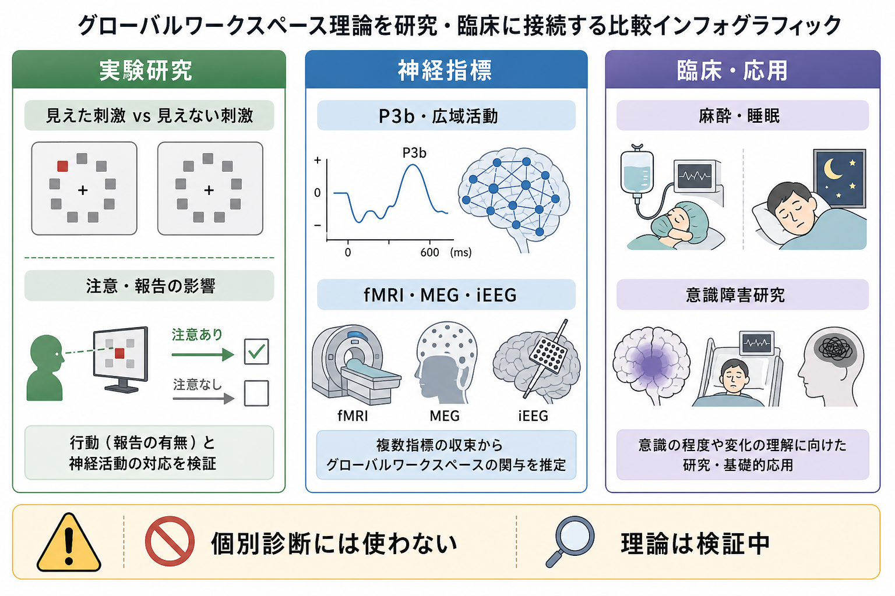
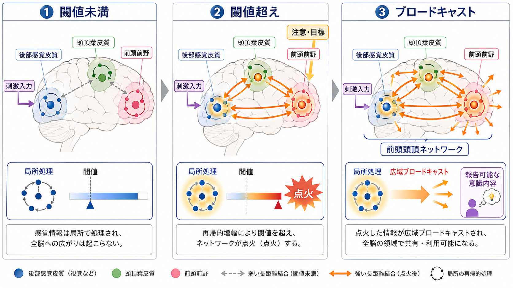
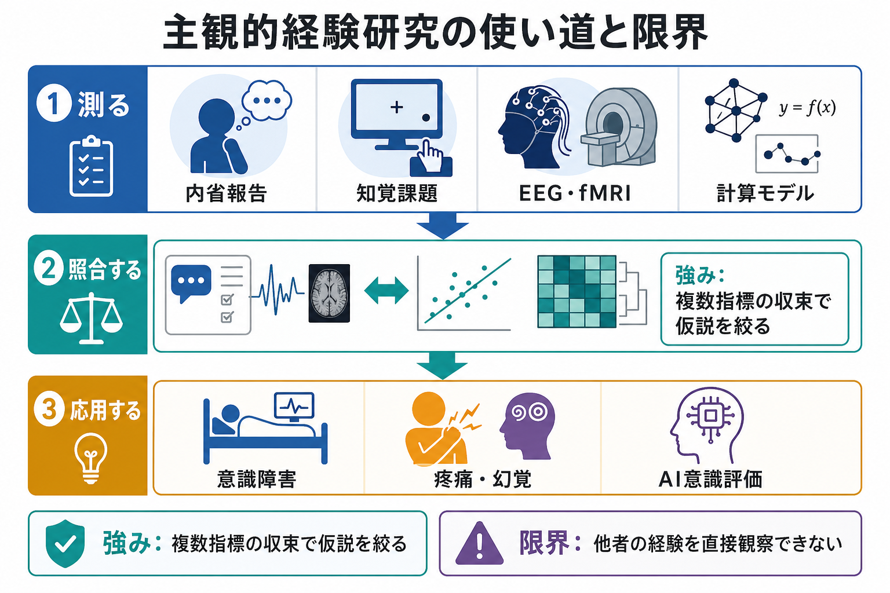

# グローバルワークスペース理論とは何か

## 要点

- グローバルワークスペース理論は、意識内容を「脳内の限られた作業場に入った情報が、広範なシステムへ共有される状態」として捉える理論である [1][2]。
- 局所的な知覚処理、記憶、情動、行動計画は無意識的にも進むが、それらが競合を勝ち抜き、報告・記憶更新・意思決定に使える形で共有されると、意識アクセスが成立すると考える [2][3]。
- 神経科学版であるグローバル・ニューロナル・ワークスペース理論は、前頭頭頂ネットワーク、感覚皮質、長距離結合、再帰的増幅、急峻な「点火」を重視する [3][6]。
- この理論は、[[注意とは何か|注意]]、報告可能性、覚醒水準を意識と同一視するものではない。これらは意識アクセスを測る手がかりであり、混同すると解釈が粗くなる [6][7]。

## この記事で答える問い

1. グローバルワークスペース理論は、意識をどのような情報処理として説明するのか。
2. 「局所処理」「意識アクセス」「ブロードキャスト」は何を意味するのか。
3. 神経科学版では、どのような脳ネットワークや実験指標が重視されるのか。
4. 注意、報告、覚醒水準、臨床応用とどう区別して読むべきか。

## まず結論

グローバルワークスペース理論の核心は、「意識は脳のどこか一か所にある物体ではなく、情報が多くのシステムから利用可能になる機能的状態である」という点にある。たとえば、視覚刺激が後頭葉で処理されるだけなら、行動に影響しても本人が「見た」と報告できない場合がある。これに対して、その刺激表象が作業記憶、言語報告、意思決定、行動制御、長期記憶更新へ同時に使えるようになると、意識内容として扱われる [2][3]。

したがって、この理論でいう「グローバル」は、全ニューロンが同時に活動するという意味ではない。課題に関係する複数の専門システムが、共通の情報にアクセスできるという意味である。劇場の舞台にスポットライトが当たる比喩が使われることもあるが、正確には「舞台」だけでなく、舞台上の情報を観客席にいる多くの専門システムへ配信する通信構造まで含めて考える必要がある [1][6]。

## 背景

意識研究では、古くから「経験そのものをどう説明するか」と「報告できる情報処理をどう説明するか」が絡み合ってきた。グローバルワークスペース理論は、後者、すなわちアクセス意識の説明に強い理論である。ここでいうアクセス意識とは、ある情報が推論、言語化、行動選択、記憶更新に使える状態を指す [2]。

Baars は、心を多数の専門処理系と、それらを結びつける共通作業場として考えた [1]。その後、Dehaene らはこの発想を神経科学に接続し、長距離皮質結合、前頭頭頂系、再帰的処理、非線形な点火を含むグローバル・ニューロナル・ワークスペース理論として発展させた [2][3][6]。

この流れは、[[ワーキングメモリとは何か|ワーキングメモリ]]、[[選択的注意はどのように働くのか|選択的注意]]、[[前頭頭頂ネットワークは認知制御をどう支えるのか|前頭頭頂ネットワーク]]、[[脳内ネットワークとは何か|脳内ネットワーク]]の理解と接続しやすい。意識を単独の部位ではなく、処理の広域共有として考えるからである。

## 基本概念

### 局所処理

局所処理とは、特定の感覚、特徴、記憶、行動傾向などを、比較的専門化されたシステムが処理する段階である。視覚皮質は形や色を処理し、聴覚系は音を処理し、情動系は価値や脅威を評価する。これらはすべて意識的である必要はない。

### 競合

脳内には同時に多くの候補表象が存在する。外界刺激、内的思考、身体状態、記憶、目標が互いに競合し、すべてが同じ強さでワークスペースに入るわけではない。注意、課題目標、刺激強度、予測、報酬価値などが、どの情報が優先されるかに影響する [3][6]。

### 意識アクセス

意識アクセスとは、ある情報が一つの局所処理に閉じず、報告、推論、記憶、意思決定、行動計画へ使える状態になることである。これは「主観的に感じること」全体を説明しきる概念ではないが、実験で測定しやすい意識の側面を整理するうえで重要である [2][7]。

### ブロードキャスト

ブロードキャストとは、ワークスペースに入った情報が広範なネットワークへ共有される過程である。共有された情報は、言語報告、選択反応、保持、誤り検出、計画変更などに利用される。GNWT では、この広域共有に長距離皮質結合と再帰的増幅が関わると考えられる [3][6]。

## 仕組み

GNWT が重視するのは、単なる入力の強さではなく、局所処理から広域共有へ移る非線形な変化である。弱い刺激やマスクされた刺激でも初期視覚処理は生じうるが、それが広域ネットワークへ入らなければ報告可能な意識内容にならない。逆に、注意や課題目標に支えられた表象は、再帰的増幅によって一定の閾値を超え、広域ネットワークで急に利用可能になると考えられる [3][4][5]。

Sergent らの時間分解能の高い研究は、意識アクセスが単なる連続的な強度上昇ではなく、ある時点で急に安定した報告可能性へ移ることを示唆した [4]。また、マスキング課題を用いた研究では、見えた刺激と見えない刺激の差が、後期の広域活動や P3b などの指標と関連することが報告された [5]。ただし、P3b は意識そのものの純粋な指標というより、報告、課題関連性、意思決定を含む可能性があり、慎重な解釈が必要である [6][7]。

この点は、[[P300とは何を反映しているのか|P300]]、[[事象関連電位ERPとは何か|ERP]]、[[fMRIは神経活動を直接測っているのか|fMRI]]、[[神経同期とは何か|神経同期]]の読み方とも関係する。単一指標だけで「意識がある」と結論するのではなく、行動報告、主観報告、EEG/MEG、fMRI、計算モデルを照合する必要がある。

## 図解

図1は、GWT/GNWT を実験研究、神経指標、臨床・応用へつなぐ見取り図である。見えた刺激と見えない刺激の比較、注意や報告の影響、P3b・広域活動、fMRI・MEG・iEEG などを組み合わせて、理論とデータの対応を検討する。

図2は、閾値未満の局所処理、閾値超えの再帰的増幅、前頭頭頂ネットワークを含む広域ブロードキャストという GNWT の中心的メカニズムを示している。

図3は、主観経験研究を読むときの補助図である。GWT そのものの図ではないが、内省報告、知覚課題、EEG・fMRI、計算モデルを照合し、意識障害や痛み・幻覚などの応用に向かう際には、複数指標の収束と限界の確認が必要であることを示している。

## 臨床・研究との接続

### 麻酔・睡眠・意識障害

麻酔、睡眠、意識障害では、単に反応が弱くなるだけでなく、広域ネットワークの結合、前頭頭頂系の相互作用、皮質視床系の状態が変化する。GNWT は、こうした状態変化を「情報が広く共有されにくくなる」という観点から整理できる [6]。関連する回路背景は [[皮質視床ループは意識や注意にどう関わるのか]] と接続して読むとよい。

ただし、この理論だけで個別患者の意識状態を診断したり、治療方針を決めたりすることはできない。臨床では、神経学的診察、行動評価、画像、脳波、薬剤、代謝、全身状態、リハビリテーション評価を組み合わせる必要がある。

### 精神医学・心理学

幻覚、解離、注意障害、メタ認知の問題を考えるとき、GWT は「どの表象が共有され、どの表象が行動や報告を支配するのか」という語彙を与える。しかし、精神症状をそのまま「ワークスペースの異常」と断定するのは粗い。症状には、感覚予測、情動、記憶、身体感覚、社会的文脈、薬理状態が関わるためである。

### AI・計算モデル

GWT は、AI の認知アーキテクチャにも影響を与えてきた。複数の専門モジュールがあり、限られた共通表象を通じて情報を共有するという発想は、注意機構、作業記憶、マルチモーダル統合、エージェント設計と相性がよい。ただし、AI システムにワークスペース様構造があることと、意識経験があることは同義ではない [7]。

## よくある誤解

### 誤解1: グローバルワークスペースは脳の特定部位である

ワークスペースは解剖学的な一部位ではなく、機能的なネットワーク状態である。前頭前野や頭頂葉は重要候補だが、感覚皮質、皮質視床系、長距離結合、課題条件によって寄与は変わる [6]。

### 誤解2: 注意が向けば必ず意識化する

注意は意識アクセスを助けるが、注意と意識は同じではない。注意がなくても処理される情報があり、注意を向けても報告可能な意識内容にならない場合がある [6][7]。

### 誤解3: 報告できることが意識のすべてである

報告可能性は実験上の重要な手がかりだが、報告には言語、記憶、意思決定、運動出力が混ざる。したがって、報告の有無だけで意識内容を単純に決めるのは危険である [7]。

### 誤解4: GNWT はすでに意識問題を解決した

GNWT は強力な研究プログラムだが、意識の理論は現在も競合している。統合情報理論、高次思考理論、再帰処理理論、予測処理系の説明などと比較しながら、どの予測がデータで支持されるかを検証する必要がある [7][8]。

## 関連ノート

- [[注意とは何か]]
- [[選択的注意はどのように働くのか]]
- [[ワーキングメモリとは何か]]
- [[前頭頭頂ネットワークは認知制御をどう支えるのか]]
- [[脳内ネットワークとは何か]]
- [[皮質視床ループは意識や注意にどう関わるのか]]
- [[P300とは何を反映しているのか]]
- [[事象関連電位ERPとは何か]]
- [[fMRIは神経活動を直接測っているのか]]
- [[神経同期とは何か]]

今後の作成候補:

- 注意と意識は同じものなのか
- アクセス意識と現象意識は何が違うのか
- 統合情報理論とは何か
- 高次思考理論とは何か
- 意識障害の神経指標とは何か

## 理解チェック

1. グローバルワークスペース理論でいう「グローバル」とは何を意味するか。
2. 局所処理だけでは、なぜ報告可能な意識内容にならないことがあるのか。
3. GNWT における「点火」と「ブロードキャスト」はどう違うか。
4. 注意、報告可能性、覚醒水準を意識と同一視すると、どのような誤解が生じるか。
5. P3b や fMRI の広域活動を、なぜ単独の意識指標として扱いにくいのか。

## 未解決問題

- 報告を必要としない課題で、意識アクセスをどこまで測定できるのか。
- 前頭前野の活動は、意識内容そのものに必要なのか、それとも報告・課題制御を反映するのか。
- 感覚モダリティ、内受容感覚、自己意識、感情経験に対して、同じワークスペース機構がどこまで一般化できるのか。
- 意識障害、麻酔、睡眠、精神症状で見られるネットワーク変化を、個人レベルの予後や介入選択にどう接続できるのか。

## 参考文献

[1] Baars, B. J. (2005). Global workspace theory of consciousness: Toward a cognitive neuroscience of human experience. *Progress in Brain Research, 150*, 45-53. https://doi.org/10.1016/S0079-6123(05)50004-9

[2] Dehaene, S., & Naccache, L. (2001). Towards a cognitive neuroscience of consciousness: Basic evidence and a workspace framework. *Cognition, 79*(1-2), 1-37. https://doi.org/10.1016/S0010-0277(00)00123-2

[3] Dehaene, S., Changeux, J.-P., Naccache, L., Sackur, J., & Sergent, C. (2006). Conscious, preconscious, and subliminal processing: A testable taxonomy. *Trends in Cognitive Sciences, 10*(5), 204-211. https://doi.org/10.1016/j.tics.2006.03.007

[4] Sergent, C., Baillet, S., & Dehaene, S. (2005). Timing of the brain events underlying access to consciousness during the attentional blink. *Nature Neuroscience, 8*, 1391-1400. https://doi.org/10.1038/nn1549

[5] Del Cul, A., Baillet, S., & Dehaene, S. (2007). Brain dynamics underlying the nonlinear threshold for access to consciousness. *PLoS Biology, 5*(10), e260. https://doi.org/10.1371/journal.pbio.0050260

[6] Mashour, G. A., Roelfsema, P., Changeux, J.-P., & Dehaene, S. (2020). Conscious processing and the global neuronal workspace hypothesis. *Neuron, 105*(5), 776-798. https://doi.org/10.1016/j.neuron.2020.01.026

[7] Seth, A. K., & Bayne, T. (2022). Theories of consciousness. *Nature Reviews Neuroscience, 23*, 439-452. https://doi.org/10.1038/s41583-022-00587-4

[8] Melloni, L., Mudrik, L., Pitts, M., & Koch, C. (2021). Making the hard problem of consciousness easier. *Science, 372*(6545), 911-912. https://doi.org/10.1126/science.abj3259
