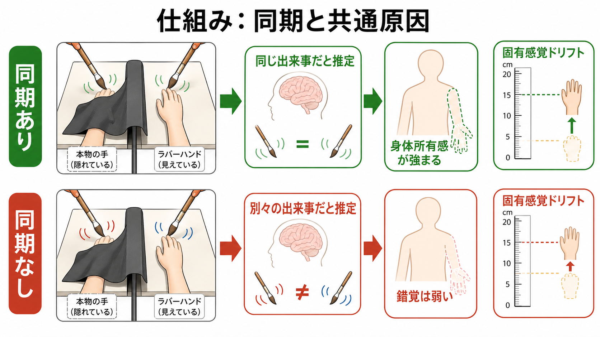
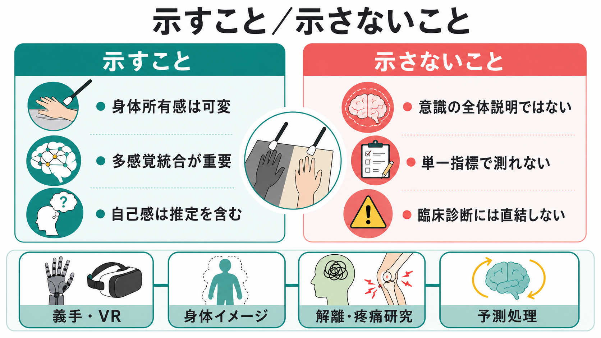

# ラバーハンド錯覚は何を示しているのか

## 要点

- ラバーハンド錯覚は、隠した自分の手と見えているゴム製の手を同期してなでると、ゴムの手が「自分の手のように感じられる」現象である[1]。
- この錯覚は、身体所有感が固定的な内的事実ではなく、視覚、触覚、固有感覚、姿勢、空間配置を統合して作られる推定であることを示す[1][2][5]。
- 代表的な指標には、主観的な所有感評定と、見えない本物の手の位置がゴムの手側へずれて感じられる固有感覚ドリフトがある。ただし、この二つは常に同じものを測っているわけではない[6]。
- 神経科学的には、腹側運動前野、頭頂葉、体性感覚系、身体近傍空間の表象が関わると考えられている[3][4]。
- 臨床や応用では、義手、VR、身体イメージ、疼痛、解離、身体症状の研究と接続するが、ラバーハンド錯覚だけで個別診断や治療方針を決めることはできない。

## この記事で答える問い

1. ラバーハンド錯覚では、何がどのように操作されているのか。
2. 視覚・触覚・固有感覚の統合は、身体所有感をどう変えるのか。
3. 主観的な「自分の手だ」という感覚と、手の位置感覚のずれは同じものなのか。
4. この錯覚は、[[意識とは何か|意識]]、[[主観的経験は科学的に扱えるのか|主観的経験]]、[[知覚とは何か|知覚]]、身体性研究に何を教えるのか。

## まず結論

ラバーハンド錯覚が示す最も重要な点は、**身体所有感は、身体の中に最初から固定されているラベルではなく、複数の感覚情報が「同じ出来事を指している」と解釈されたときに成立しやすい推定である**ということである。

自分の手は、ふつうは見える。触れられれば皮膚感覚が生じる。目を閉じても、手がどこにあるかは固有感覚でおおよそ分かる。日常ではこれらがよく一致するため、「この手は自分のものだ」という感覚は当然に思える。しかし実験では、視覚と触覚を同期させ、固有感覚と視覚の位置を少しずらすことで、所有感の帰属を一時的に外部のゴムの手へ引き寄せられる[1][2]。

ただし、この錯覚は「自己は幻想である」と単純に示すものではない。むしろ、自己や身体所有感が、環境との相互作用の中で安定化される精密な推定過程であることを示す。

## 背景

Botvinick と Cohen の古典的実験では、参加者の本物の手を見えない位置に隠し、その近くにゴム製の手を置く。実験者は、本物の手とゴムの手を絵筆で同時に同じようになでる。すると多くの参加者は、触れられているのは本物の手であるにもかかわらず、見えているゴムの手に触覚が生じているように感じ、ゴムの手が自分の手であるような感覚を報告する[1]。

この効果は、非同期になでる条件では弱くなる。つまり、ゴムの手が視野にあるだけでは十分ではない。視覚的に見える接触と、実際に皮膚で感じる接触が時間的に合っていることが重要である[1][2]。

ラバーハンド錯覚が注目された理由は、身体所有感という一人称的経験を、実験条件、質問紙、位置判断、神経画像などで扱える形にした点にある。これは、[[主観的経験は科学的に扱えるのか]]という問いに対して、主観報告を捨てるのではなく、実験操作と行動指標で囲い込む一つの方法を示している。

## 基本概念

### 身体所有感

身体所有感とは、「この身体、またはこの身体部位は自分のものだ」と感じる感覚である。手を見たときに「これは自分の手だ」とすぐ分かること、目を閉じても自分の腕がどこにあるかを自分の身体として感じることが含まれる。

ここで大切なのは、身体所有感が単なる知識ではないことである。「これは私の手である」と言葉で判断する以前に、身体の一部として感じられる前反省的な側面がある。ラバーハンド錯覚は、この前反省的な所有感が、条件によって一時的に変化することを示す[1][7]。

### 固有感覚

固有感覚とは、筋、腱、関節などから得られる、身体部位の位置や運動についての感覚である。目を閉じていても手の位置が分かるのは、固有感覚が働いているからである。ラバーハンド錯覚では、参加者が見えない本物の手の位置を、ゴムの手側へずれて報告することがあり、これを固有感覚ドリフトと呼ぶ[1][6]。

### 多感覚統合

多感覚統合とは、視覚、触覚、聴覚、固有感覚などの複数の入力を、同じ対象や出来事についての情報としてまとめる過程である。[[知覚とは何か|知覚]]は単一感覚の受動的な写しではなく、複数の手がかりを組み合わせて、何がどこで起きているのかを推定する過程である。ラバーハンド錯覚は、この統合過程が身体そのものの知覚にも関わることを示している。

## 仕組み

### 1. 視覚が強い手がかりになる

参加者は、ゴムの手がなでられているのを見る。視覚は空間的に明瞭で、どこに手があり、どこに筆が触れているかを強く示す。視覚情報は、本物の手から来る固有感覚と競合しながら、手の位置推定をゴムの手側へ引き寄せる[1][4]。

### 2. 触覚の同期が「同じ出来事」らしさを高める

本物の手に触れられたタイミングと、ゴムの手に筆が触れる視覚的タイミングが一致すると、脳は「これは同じ原因から生じた出来事かもしれない」と推定しやすくなる。非同期条件では、この共通原因の推定が弱まり、身体所有感も弱くなる[2][5]。

この見方は、ベイズ的感覚推論としても定式化される。Samad らは、ラバーハンド錯覚における身体所有感を、視覚、触覚、固有感覚の空間的・時間的一致に基づく確率的推定としてモデル化した[5]。ここで重要なのは、脳が単に最も強い感覚を採用するのではなく、複数の情報源が同じ原因を持つかどうかを推定している点である。

### 3. 身体らしさと姿勢の制約がある

ゴムの手なら何でもよいわけではない。手の向き、身体からの距離、解剖学的にありうる姿勢などが重要になる。Tsakiris と Haggard は、ラバーハンド錯覚には視触覚同期だけでなく、自己身体として帰属しうる形や配置の制約があることを示した[2]。

つまり、錯覚は「視覚が触覚に勝つ」だけではない。脳は、見えている対象が自分の身体部位としてありうるかどうかも評価している。

### 4. 神経基盤は単一部位ではない

Ehrsson らの fMRI 研究では、ラバーハンド錯覚中の身体所有感が腹側運動前野の活動と関係することが示された[3]。この領域は、視覚、触覚、身体近傍空間、行為準備を結びつける候補として考えられる。

一方で、ラバーハンド錯覚を一つの「所有感中枢」に還元するのは不適切である。身体近傍空間、頭頂葉、運動前野、[[体性感覚ネットワークは身体情報をどう表現するのか|体性感覚ネットワーク]]が、視覚・触覚・固有感覚を状況に応じて統合するネットワークとして見る方がよい[4][7]。

## 図解

ラバーハンド錯覚は、次のように整理できる。

| 観点 | 実験で操作されること | 何を示すか |
|---|---|---|
| 視覚 | ゴムの手が見える | 見える身体部位が所有感に影響する |
| 触覚 | 本物の手がなでられる | 実際の皮膚入力が必要になる |
| 時間同期 | 視覚的接触と触覚が同時 | 同じ出来事として統合されやすい |
| 固有感覚 | 本物の手の位置は見えない | 位置感覚が視覚側へ再較正される |
| 身体制約 | 手らしい形・姿勢・距離 | 身体所有感には意味的・解剖学的制約がある |

## 臨床・研究との接続

### 義手・VR・身体拡張

義手やVRアバターを「自分の身体の一部」として感じられるかどうかは、視覚、触覚、運動、時間遅延、身体らしさの統合に左右される。ラバーハンド錯覚は、人工物や仮想身体がどの条件で身体化されるかを調べる基礎パラダイムになっている[7]。

### 疼痛・身体イメージ・解離

身体所有感の変化は、疼痛、身体イメージの変容、解離、幻肢、身体症状の研究とも接続しうる。ただし、ラバーハンド錯覚で錯覚が強いからといって、特定の疾患や症状があると判断することはできない。臨床的には、本人の苦痛、生活機能、神経学的所見、心理社会的文脈を含めて評価する必要がある。

### 意識研究との接続

ラバーハンド錯覚は、[[意識とは何か|意識]]の全体理論ではない。しかし、「何かが自分の身体として経験される」とはどういうことかを調べる優れた窓である。主観報告、行動指標、神経活動を組み合わせることで、身体化された自己感を実験的に扱えるようにする。

## よくある誤解

### 誤解1: ラバーハンド錯覚は「自己は幻想だ」と証明する

そうではない。錯覚は、自己感が存在しないことではなく、自己感が複数の手がかりに基づいて安定化されることを示す。ふだんの身体所有感は、視覚、触覚、固有感覚、運動、記憶、身体図式がよく一致するため、非常に安定している。

### 誤解2: 固有感覚ドリフトが大きいほど所有感も強い

古典的研究では両者の関連が示されたが、その後の研究では、主観的所有感と固有感覚ドリフトが解離する場合があることも示された[6]。したがって、ドリフトだけを身体所有感の完全な代理指標として使うのは危険である。

### 誤解3: 視覚だけで身体所有感が決まる

視覚は強い手がかりだが、視覚だけでは十分ではない。触覚の同期、手の姿勢、身体との距離、対象の身体らしさ、課題文脈が関わる[2][7]。ラバーハンド錯覚は視覚優位の実験ではなく、多感覚統合の実験である。

### 誤解4: 臨床診断に直接使える

ラバーハンド錯覚は研究パラダイムであり、個人の診断法ではない。精神医学・神経心理学との接続は重要だが、個別診断や治療指示として用いるには、標準化、信頼性、妥当性、臨床的有用性を別途検証する必要がある。

## 関連ノート

### 既存ノート

- [[意識とは何か]]
- [[主観的経験は科学的に扱えるのか]]
- [[知覚とは何か]]
- [[体性感覚ネットワークは身体情報をどう表現するのか]]
- [[サリエンスネットワークとは何か]]
- [[脳内ネットワークとは何か]]

### 今後の作成候補

- 身体所有感とは何か
- 固有感覚とは何か
- 多感覚統合とは何か
- 身体近傍空間とは何か
- 予測処理は身体所有感をどう説明するのか
- VRにおける身体化とは何か

### MOC 更新候補

- `content/00_MOC/MOC｜認知科学・心理学.md` の「意識・自己・身体性」または「自己感・身体所有感」付近に追加候補。
- `content/00_MOC/MOC｜脳・神経科学.md` の体性感覚・身体表象・多感覚統合に関する項目が整備された場合の追加候補。

## 理解チェック

1. ラバーハンド錯覚で、同期条件と非同期条件を比較する理由を説明できるか。
2. 身体所有感と固有感覚ドリフトの違いを説明できるか。
3. 視覚、触覚、固有感覚が「同じ出来事」として統合されるとはどういうことか。
4. ラバーハンド錯覚から、なぜ「自己は単なる錯覚である」とは結論できないのか。
5. 義手やVR研究とラバーハンド錯覚がつながる理由を説明できるか。

## 参考文献

[1] Botvinick, M., & Cohen, J. (1998). Rubber hands 'feel' touch that eyes see. *Nature*, 391, 756. https://doi.org/10.1038/35784

[2] Tsakiris, M., & Haggard, P. (2005). The rubber hand illusion revisited: visuotactile integration and self-attribution. *Journal of Experimental Psychology: Human Perception and Performance*, 31(1), 80-91. https://doi.org/10.1037/0096-1523.31.1.80

[3] Ehrsson, H. H., Spence, C., & Passingham, R. E. (2004). That's my hand! Activity in premotor cortex reflects feeling of ownership of a limb. *Science*, 305(5685), 875-877. https://doi.org/10.1126/science.1097011

[4] Makin, T. R., Holmes, N. P., & Ehrsson, H. H. (2008). On the other hand: dummy hands and peripersonal space. *Behavioural Brain Research*, 191(1), 1-10. https://doi.org/10.1016/j.bbr.2008.02.041

[5] Samad, M., Chung, A. J., & Shams, L. (2015). Perception of body ownership is driven by Bayesian sensory inference. *PLOS ONE*, 10(2), e0117178. https://doi.org/10.1371/journal.pone.0117178

[6] Rohde, M., Di Luca, M., & Ernst, M. O. (2011). The rubber hand illusion: feeling of ownership and proprioceptive drift do not go hand in hand. *PLOS ONE*, 6(6), e21659. https://doi.org/10.1371/journal.pone.0021659

[7] Kilteni, K., Maselli, A., Kording, K. P., & Slater, M. (2015). Over my fake body: body ownership illusions for studying the multisensory basis of own-body perception. *Frontiers in Human Neuroscience*, 9, 141. https://doi.org/10.3389/fnhum.2015.00141

[8] Chancel, M., & Ehrsson, H. H. (2020). Which hand is mine? Discriminating body ownership perception in a two-alternative forced-choice task. *Attention, Perception, & Psychophysics*, 82, 4058-4083. https://doi.org/10.3758/s13414-020-02107-x

## 未解決問題

- 主観的所有感、固有感覚ドリフト、皮膚温、皮膚コンダクタンス、神経活動は、それぞれ身体所有感のどの側面を測っているのか。
- 予測処理やベイズ的因果推論モデルは、身体所有感の個人差や臨床症状をどこまで説明できるのか。
- 義手、VR、身体拡張技術では、所有感、操作感、倫理的責任感をどのように分けて評価すべきか。
- 身体所有感の可塑性は、疼痛、解離、身体イメージの治療的介入にどこまで応用できるのか。
