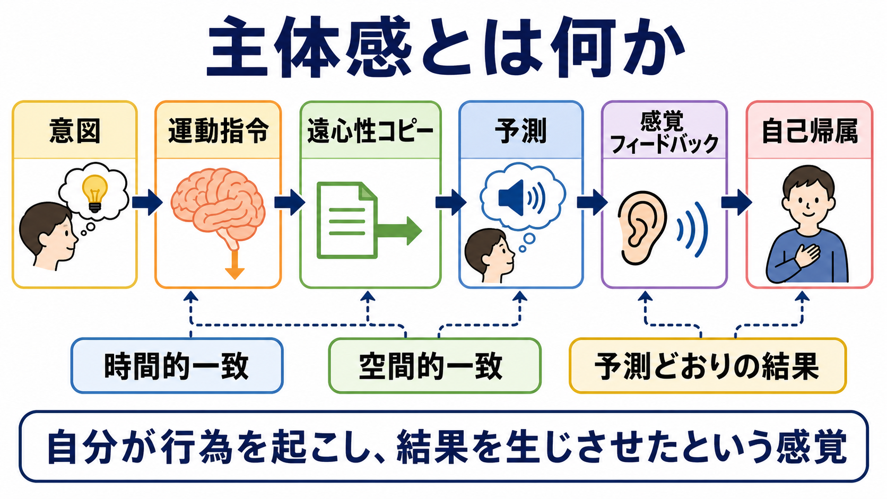
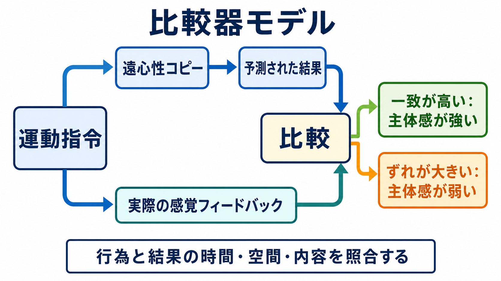
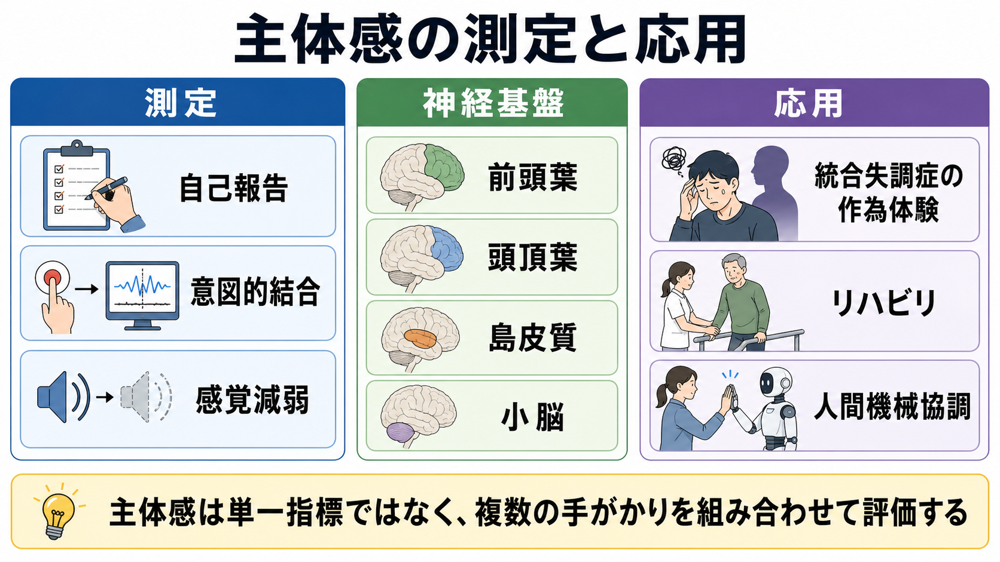

# 主体感とは何か

## 要点

- 主体感とは、「この行為を自分が起こし、その結果を自分が生じさせた」という感覚である。身体が自分のものだという[[体性感覚ネットワークは身体情報をどう表現するのか|身体情報]]や所有感と重なるが、同一ではない[1][6]。
- 典型的には、意図、運動指令、遠心性コピー、予測された感覚結果、実際の感覚フィードバックの一致から主体感が支えられる[1][2]。
- ただし主体感は比較器モデルだけで決まる単純な信号ではない。行為前の意図、行為後の結果、文脈、信念、外的手がかりを統合する推論過程としても理解される[3][6]。
- 実験では、自己報告、意図的結合、感覚減弱、行為結果の遅延・変換課題などで測定される[4][5][8]。
- 臨床的には、統合失調症の作為体験、身体症状、リハビリテーション、人間機械協調などと接続する。ただし個別診断や治療指示としてではなく、研究上の理解枠組みとして扱う。

## この記事で答える問い

1. 主体感は、身体所有感や意図と何が違うのか。
2. 運動予測と結果フィードバックは、どのように「自分がやった」という感覚を作るのか。
3. 主体感は、どのような実験指標で測られるのか。
4. 統合失調症の作為体験や人間機械協調と、主体感研究はどう接続するのか。

## まず結論

主体感は、行為の前にある意図だけでも、行為後の結果だけでも説明できない。脳は、これから起こる感覚結果を運動指令から予測し、実際の感覚フィードバックと照合する。予測と結果が時間的・空間的・内容的に合うほど、「自分が起こした」という感覚は強まりやすい[1][2]。

しかし、主体感は機械的な一致判定だけではない。行為の意味、課題文脈、外的手がかり、過去経験、他者の存在も影響する。たとえば、ボタンを押した直後に音が鳴ると主体感は強くなりやすいが、音が予期せず遅れる、別の場所から鳴る、他者も同時に操作していると、自己帰属は弱まったり曖昧になったりする。

## 背景

日常生活では、コップを取る、文章を入力する、声を出す、画面上のカーソルを動かすといった行為に、自然に「自分がやっている」という感覚が伴う。この感覚があるため、私たちは行為の結果を学習し、責任を引き受け、道具や機械を自分の行為の延長として使うことができる。

主体感は、[[意識とは何か|意識]]や[[主観的経験は科学的に扱えるのか|主観的経験]]の研究にとって重要である。なぜなら、主体感は単なる運動制御ではなく、「経験の中で自分が原因として現れる」現象だからである。同時に、主体感は[[運動ネットワークは随意運動をどう生み出すのか|随意運動]]、[[知覚とは何か|知覚]]、[[メタ認知とは何か|メタ認知]]、[[時間認知とは何か|時間認知]]を結ぶ接点でもある。

## 基本概念

### 主体感

主体感 sense of agency は、自分の意図や行為が外界や身体内の変化を引き起こしているという感覚である[1]。たとえば「自分が手を上げた」「自分がこの音を鳴らした」「自分が画面上のカーソルを動かした」と感じることがこれに当たる。

### 身体所有感との違い

身体所有感 body ownership は、「この身体や身体部位は自分のものだ」という感覚である。一方、主体感は「この行為を自分が起こした」という感覚である[6]。ラバーハンド錯覚のように、見える手を自分の手のように感じても、その手を自分が能動的に動かしているとは限らない。逆に、道具やカーソルを自分の行為で動かしていると感じても、それを自分の身体そのものだと感じるとは限らない。

### 遠心性コピー

遠心性コピーとは、運動指令の写しである。脳は筋へ運動指令を送るだけでなく、その指令のコピーを使って、これから生じる感覚結果を予測する。これにより、自分でくすぐったときの感覚が他者にくすぐられたときより弱く感じられるような、自己生成感覚の減弱が説明される[2][8]。

### 意図的結合

意図的結合 intentional binding は、自由意志的な行為とその結果が、主観的時間の中で互いに近づいて感じられる現象である。たとえば、ボタン押しと音の発生の時間間隔が、実際より短く感じられる。この現象は、暗黙的な主体感指標として使われてきた[4]。

## 仕組み

### 1. 比較器モデル

比較器モデルでは、主体感は「予測された結果」と「実際の結果」の照合から生じると考える。運動指令が出ると、その遠心性コピーに基づいて感覚結果が予測される。実際の視覚・聴覚・触覚・固有感覚フィードバックが予測とよく一致すると、その結果は自分の行為に帰属されやすい[1][2]。

この仕組みは、速い運動制御にも合理的である。感覚フィードバックには遅れがあるため、行為の途中で常に結果を待っていては制御が間に合わない。そこで脳は、[[小脳回路は予測と誤差学習にどう関わるのか|小脳]]などを含む運動予測系を使い、身体と環境の変化を先回りして推定する。

### 2. 予測が合うと自己生成感覚は弱まる

自分で生じさせた感覚は、しばしば外部から与えられた同じ感覚より弱く感じられる。これは感覚減弱 sensory attenuation と呼ばれる。古典的研究では、自己生成された触覚刺激は外部生成刺激より弱く評価されやすく、運動予測が感覚処理を抑制する可能性が示された[2][8]。

この現象は、「自分がやったことは、驚きが少ない」という形で理解できる。予測どおりの結果は処理上の新規性が低く、外部原因を探す必要も小さい。逆に、予測とずれた感覚結果は、環境変化、他者の介入、道具の誤作動、身体状態の変化を示す手がかりになりうる。

### 3. 行為後の推論も主体感を作る

比較器モデルは重要だが、主体感をすべて説明するわけではない。行為の結果を見た後に、「この結果は自分が起こしたのだろうか」と推論する過程も働く。Synofzik らは、低次の感覚運動処理だけでなく、高次の判断や信念を含めて主体感を理解する枠組みを提案した[6]。

たとえば、ある結果が自分の行為直後に起こり、空間的にも自分の操作対象と近く、他に明らかな原因がなければ、主体感は強まりやすい。逆に、他者が同時に操作している、結果が予期したものと違う、遅延がある、道具の応答が不安定である場合、主体感は弱まる。

### 4. 神経基盤

主体感の神経基盤は単一部位ではなく、前頭葉、頭頂葉、島皮質、小脳、感覚運動ネットワークの相互作用として研究されている。行為の意図や選択には前頭葉、身体状態と行為結果の照合には頭頂葉や島皮質、予測誤差と運動学習には小脳が関わると考えられる[1][7]。

Farrer と Frith の研究は、自分と他者のどちらが行為結果の原因かを判定する課題で、頭頂葉を含むネットワークが自己他者の原因帰属に関与することを示した[7]。ただし、脳領域名を一対一対応で暗記するより、行為選択、予測、感覚照合、自己他者推論が分散的に結びつくと考える方がよい。

## 図解

この記事の図は、次の 3 水準を分けて読むと整理しやすい。

| 図 | 主題 | 読み方 |
|---|---|---|
| 図1 | 主体感の概念地図 | 意図、運動指令、予測、感覚フィードバック、自己帰属が直線ではなく連鎖として働く。 |
| 図2 | 比較器モデル | 遠心性コピーによる予測と実際の感覚フィードバックの一致・不一致を見る。 |
| 図3 | 測定と応用 | 主体感は自己報告だけでなく、意図的結合、感覚減弱、臨床・技術応用からも調べられる。 |

## 臨床・研究との接続

主体感研究は、統合失調症の作為体験 delusions of control を理解する一つの枠組みを与える。作為体験とは、自分の思考や行為が外部の力によって操られているように感じられる体験である。Frith らの理論では、自己生成行為の予測やモニタリングの異常が、自己行為の外部帰属に関わる可能性が論じられた[2]。これは研究上の説明であり、個別症状の診断や原因を断定するものではない。

主体感はリハビリテーションにも関係する。運動麻痺、失行、道具使用、義手やロボット支援では、「自分が動かしている」と感じられるかどうかが、学習、動機づけ、操作の自然さに影響しうる。人間機械協調や AI 支援システムでも、遅延、予測可能性、操作結果の透明性が主体感に影響する[3]。

研究方法としては、明示的な自己報告だけに依存しないことが重要である。主体感は、本人が「自分がやった」と報告する水準と、行為結果の時間知覚や感覚減弱として現れる暗黙的水準がずれる場合がある[4][5]。このずれは、[[メタ認知とは何か|メタ認知]]や自己評価の研究とも接続する。

## よくある誤解

### 誤解1: 主体感は意図があれば必ず生じる

意図は重要だが、それだけでは不十分である。意図してボタンを押しても、結果が大きく遅れる、予想外の音が鳴る、他者も同じ装置を操作している場合には、主体感は弱まりうる[1][3]。

### 誤解2: 主体感は結果が一致すれば必ず生じる

結果の一致も重要だが、文脈や信念が関与する。偶然に自分の行為直後に結果が起こると、実際には自分が原因でなくても主体感が生じることがある。主体感は、感覚運動予測と因果推論の組み合わせとして理解する必要がある[6]。

### 誤解3: 身体所有感と主体感は同じである

身体所有感は「これは私の身体だ」という感覚、主体感は「これは私が起こした行為だ」という感覚である。両者は日常では重なるが、実験的には分離できる[6]。

### 誤解4: 主体感は主観的すぎて科学的に扱えない

主体感は主観的経験だが、自己報告、意図的結合、感覚減弱、行為結果の遅延操作、神経活動計測を組み合わせることで研究できる[4][5][7]。ただし、どれか一つの指標を主体感そのものと同一視しない注意が必要である。

## 関連ノート

### 既存ノート

- [[意識とは何か]]
- [[主観的経験は科学的に扱えるのか]]
- [[知覚とは何か]]
- [[メタ認知とは何か]]
- [[時間認知とは何か]]
- [[運動ネットワークは随意運動をどう生み出すのか]]
- [[小脳回路は予測と誤差学習にどう関わるのか]]
- [[体性感覚ネットワークは身体情報をどう表現するのか]]
- [[妄想は予測誤差処理の異常として説明できるのか]]

### 関連ノート候補

- 身体所有感とは何か
- 遠心性コピーとは何か
- 意図的結合とは何か
- 感覚減弱とは何か
- 作為体験とは何か
- 人間機械協調と主体感

### MOC更新候補

- `content/00_MOC/MOC｜認知科学・心理学.md`
- `content/00_MOC/MOC｜脳・神経科学.md`
- `content/00_MOC/MOC｜精神医学.md`

並列ジョブとの衝突を避けるため、本記事作成時点では MOC 本体は更新しない。

## 理解チェック

1. 主体感と身体所有感は、どの点で似ていて、どの点で違うか。
2. 遠心性コピーは、なぜ自己生成感覚の減弱に関係するのか。
3. 比較器モデルだけでは、主体感を説明しきれないのはなぜか。
4. 意図的結合は、主体感のどの側面を測る指標として使われるか。
5. 人間機械協調で、遅延や予測可能性が主体感に影響するのはなぜか。

## 未解決問題

- 主体感の明示的判断と暗黙的指標がずれたとき、どちらをどのように重視すべきかは議論が続いている。
- 比較器モデル、因果推論モデル、社会的・文脈的説明を、単一の計算モデルとして統合できるかは未解決である。
- 統合失調症の作為体験を、主体感異常だけで説明できるかは慎重に扱う必要がある。妄想、知覚、自己モニタリング、社会的推論など複数要因の関与が考えられる。

## 参考文献

[1] Haggard, P. (2017). Sense of agency in the human brain. *Nature Reviews Neuroscience*, 18, 196-207. https://doi.org/10.1038/nrn.2017.14

[2] Blakemore, S.-J., Wolpert, D. M., & Frith, C. D. (2002). Abnormalities in the awareness of action. *Trends in Cognitive Sciences*, 6(6), 237-242. https://doi.org/10.1016/S1364-6613(02)01907-1

[3] Wen, W., & Imamizu, H. (2022). The sense of agency in perception, behaviour and human-machine interactions. *Nature Reviews Psychology*, 1, 211-222. https://doi.org/10.1038/s44159-022-00030-6

[4] Haggard, P., Clark, S., & Kalogeras, J. (2002). Voluntary action and conscious awareness. *Nature Neuroscience*, 5, 382-385. https://doi.org/10.1038/nn827

[5] Moore, J. W. (2016). What is the sense of agency and why does it matter? *Frontiers in Psychology*, 7, 1272. https://doi.org/10.3389/fpsyg.2016.01272

[6] Synofzik, M., Vosgerau, G., & Newen, A. (2008). I move, therefore I am: A new theoretical framework to investigate agency and ownership. *Consciousness and Cognition*, 17(2), 411-424. https://doi.org/10.1016/j.concog.2008.03.008

[7] Farrer, C., & Frith, C. D. (2002). Experiencing oneself vs another person as being the cause of an action: The neural correlates of the experience of agency. *NeuroImage*, 15(3), 596-603. https://doi.org/10.1006/nimg.2001.1009

[8] Bays, P. M., Flanagan, J. R., & Wolpert, D. M. (2006). Attenuation of self-generated tactile sensations is predictive, not postdictive. *PLoS Biology*, 4(2), e28. https://doi.org/10.1371/journal.pbio.0040028
