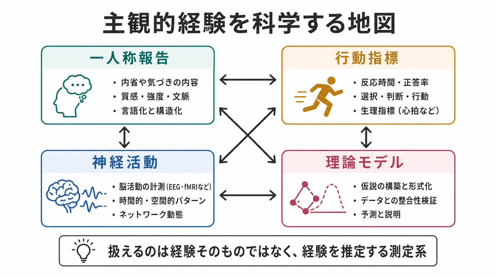
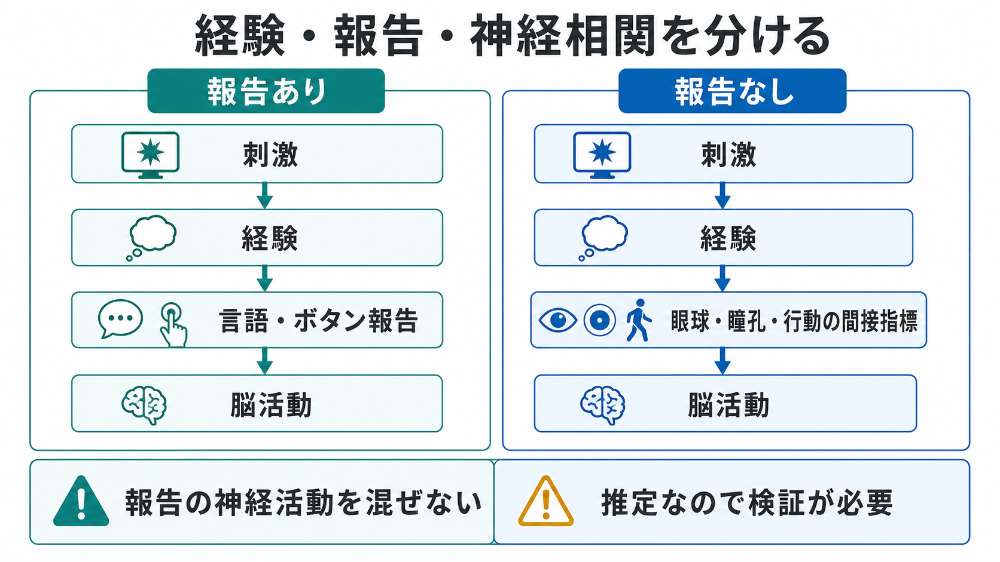

# 主観的経験は科学的に扱えるのか

## 要点

- 主観的経験そのものは第三者が直接観察できないが、報告、行動、神経活動、理論モデルを組み合わせれば、経験に関する仮説を科学的に制約できる。
- 「見えた」「痛い」「鮮明だった」といった一人称報告は不可欠なデータだが、記憶、注意、言語化、反応準備の影響を受ける。
- 近年の意識研究では、報告を使う研究と、眼球運動・瞳孔・行動などから経験を推定する「非報告パラダイム」を組み合わせ、経験そのものと報告過程を分けようとしている。
- 限界は残る。クオリアを完全に三人称データへ還元できたわけではなく、測定法や理論の選び方が結論を左右する。

## この記事で答える問い

1. クオリアや一人称経験は、科学の対象になりうるのか。
2. 実験心理学と神経科学は、主観的経験をどのように測っているのか。
3. 測定可能な部分と、なお残る哲学的・方法論的限界は何か。

## まず結論

主観的経験は、**直接観察できる物体のようには扱えないが、科学的研究の対象にはできる**。科学が扱うのは、経験そのものをのぞき込むことではなく、経験についての報告、刺激条件、判断の正確さ、反応時間、視線・瞳孔・皮膚反応、EEGやfMRIなどの神経指標、そしてそれらを結ぶ理論モデルである。

したがって「主観的経験は科学では扱えない」という言い方は強すぎる。一方で「脳活動を測ればクオリアがそのまま読める」という言い方も強すぎる。妥当な立場は、主観的経験を**複数の測定系から推定される構成概念**として扱い、測定法ごとのバイアスを明示することである [2][7]。

## 背景

主観的経験の問題は、古典的には「ある生物であるとはどのようなことか」という問いとして定式化された。Nagelの有名な議論は、客観的な物理記述だけでは、その生物にとっての経験のあり方を取り逃がすのではないか、という問題を示した [1]。この論点は、クオリア、現象意識、一人称性の議論につながる。

しかし、そこから「経験は科学の外にある」と結論する必要はない。心理物理学は、刺激強度と知覚報告の関係を測ってきた。認知心理学は、マスキング、両眼視野闘争、注意課題、信頼度評定を使って、見える/見えない、確信がある/ない、鮮明/不鮮明といった経験の変化を調べてきた。神経科学は、[[脳波EEGは何を測っているのか|EEG]]、[[fMRIは神経活動を直接測っているのか|fMRI]]、単一ユニット記録、脳刺激などを使い、経験内容と神経活動の対応を探ってきた [2][6]。

重要なのは、主観的経験を「直接測れるか」ではなく、「どの仮定のもとで、どの指標が、どの経験を、どの程度よく追跡するか」と問うことである。

## 基本概念

### 主観的経験

主観的経験とは、外から観察される行動ではなく、当人にとって「何かが感じられている」側面を指す。赤の見え、痛みの質、音楽の響き、身体が自分のものだという感覚、夢の中での鮮明さなどが含まれる。

### クオリア

クオリアは、経験の質的な感じを指す哲学的用語である。科学研究では、クオリアという語を広く使うよりも、「視覚刺激がどの程度鮮明に見えたか」「痛みの強度と不快感をどう評価したか」「自分の判断にどの程度自信があるか」のように、操作可能な問いへ分解することが多い。

### 現象意識とアクセス意識

現象意識は「感じられていること」そのものに近い概念であり、アクセス意識は報告、推論、記憶、意思決定に利用できることを指す。実験では両者が混ざりやすい。たとえば「見えた」とボタンで答えるとき、実験者が測るのは視覚経験だけでなく、判断、注意、記憶、運動反応も含んだ過程である [5][6]。

### 測定問題

意識研究の中心的な難しさは、意識の有無や内容をどう測るかという測定問題である。Sethらは、行動指標と神経指標は理論なしに中立的な「意識計」になるわけではなく、どの理論を前提にするかで解釈が変わると整理している [2]。

## 仕組み

### 1. 一人称報告を構造化する

もっとも直接的な方法は、参加者に経験を報告してもらうことである。単純な「見えた/見えない」だけでなく、Perceptual Awareness Scaleのように、経験の鮮明さを段階評定させる方法が用いられる [3]。Sandbergらは、マスクされた視覚刺激を用いて、知覚的気づきの評定、信頼度評定、賭けを比較し、測定法によって意識と成績の関係が異なることを示した [4]。

この方法の強みは、研究対象である経験に近いデータを得られる点である。弱みは、内省能力、言語化、課題理解、社会的期待、反応基準に左右される点である。したがって、報告は「主観的だからだめ」なのではなく、**測定器としての癖を持つデータ**として扱う必要がある。

### 2. 行動指標と心理物理学を組み合わせる

経験の有無は、正答率、反応時間、検出感度、信頼度、メタ認知感度などとも照合できる。たとえば、ある刺激を「見えなかった」と報告しても、強制選択課題では偶然以上に当てられることがある。この場合、「無意識処理があった」のか、「弱い経験が報告基準に達しなかった」のか、「参加者が保守的に答えた」のかを区別する必要がある。

ここで重要になるのが、信号検出理論やメタ認知指標である。主観報告と課題成績を分けることで、知覚能力、判断基準、自信、内省精度をある程度切り分けられる。

### 3. 神経相関を探す

意識の神経相関、すなわちNCCは、ある特定の意識経験に十分な最小限の神経機構を探す研究プログラムである [6]。視覚マスキング、両眼視野闘争、夢、麻酔、意識障害などの研究では、刺激入力が似ていても経験が変わる条件を作り、経験の変化と神経活動の変化を対応づける。

ただし、[[BOLD信号とは何か|BOLD信号]]やERP成分が経験そのものを直接表すわけではない。P3bのような信号は、意識経験よりも課題関連処理や報告に近い可能性が議論されている [6]。そのため、[[脳画像とは何を見ているのか|脳画像]]や[[P300とは何を反映しているのか|P300]]の結果を読むときは、経験、注意、記憶、反応準備を分けて考える必要がある。

### 4. 非報告パラダイムで報告過程を減らす

報告を求めると、報告のための神経活動が混ざる。そこで、非報告パラダイムでは、明示的なボタン押しや言語報告を減らし、眼球運動、瞳孔、注視パターン、自律神経指標、課題に直接関係しない行動から、参加者が何を経験しているかを推定する [5]。

この方法は、経験と報告を分けるうえで有用である。一方で、非報告パラダイムも万能ではない。間接指標が本当に経験を反映しているのか、それとも注意や覚醒、刺激処理を反映しているのかを検証しなければならない。結局、報告あり研究と非報告研究は対立物ではなく、互いの弱点を補う関係にある。

### 5. 理論モデルでデータを束ねる

意識研究には、グローバル・ワークスペース理論、再帰処理理論、統合情報理論、高次表象理論、予測処理系の説明など、複数の理論がある。SethとBayneは、理論が実験デザインと解釈を導く一方で、現在の理論同士をどこまで経験的に区別できるかはなお課題だと整理している [7]。

理論モデルは、単なる説明の飾りではない。どの神経活動を意識に近いと見るか、どの指標を背景条件や報告過程と見るかを決めるための地図である。ただし、地図が複数ある以上、ある単一の実験結果から「意識の正体が分かった」と結論するのは早い。

## 図解

主観的経験研究は、次のような三段階で理解すると整理しやすい。

| 段階 | 研究で行うこと | 強み | 限界 |
|---|---|---|---|
| 測る | 内省報告、知覚課題、信頼度、EEG、fMRIを集める | 経験に関係する多面的データが得られる | 各指標に固有のバイアスがある |
| 照合する | 報告、行動、神経活動、モデルの対応を調べる | 複数指標の収束で仮説を絞れる | 収束しないときの解釈が難しい |
| 応用する | 意識障害、疼痛、幻覚、AI評価に接続する | 臨床・倫理的判断を支える可能性がある | 個別判断や存在証明には慎重さが必要 |

## 臨床・研究との接続

### 意識障害

意識障害では、行動反応が乏しい患者に意識経験があるかどうかが大きな問題になる。Owenらは、植物状態と診断された患者に「テニスをする」「家の中を歩く」といった心的イメージ課題を行わせ、健常者と似たfMRI活動パターンを示す例を報告した [8]。これは、主観的経験を直接観察したわけではないが、指示理解と意図的な心的活動を神経活動から推定する試みである。

この領域では、神経指標が倫理的・臨床的判断に関わるため、過剰な断定は避けなければならない。研究で示されるのは、特定条件下での意識関連反応であり、個別の診断や治療方針を単独で決めるものではない。

### 疼痛・幻覚・解離

疼痛や幻覚は、主観的経験を科学的に扱う必要性が特に高い領域である。痛みは本人の報告なしに完全には評価できないが、脳活動、行動、文脈、既往、心理状態を統合することで理解が進む。幻覚も、外界刺激の有無だけではなく、知覚、予測、信念、情動、神経ネットワークの相互作用として検討される。関連して、[[幻覚は脳内でどのように生じるのか]]、[[疼痛と精神疾患は脳内でどうつながるのか]]、[[解離症状は脳ネットワークでどう説明できるのか]]を参照できる。

### AI意識評価

AIに意識があるかという議論では、人間の意識研究で発展した測定問題がそのまま難問として現れる。言語報告が流暢でも、それが経験を伴う証拠になるとは限らない。逆に、報告できないシステムに経験がないとも直ちには言えない。ここでも必要なのは、単一のふるまいではなく、構造、機能、学習、統合、自己モデル、環境との相互作用を含む多面的評価である。

## よくある誤解

### 誤解1: 主観的なら科学では扱えない

科学は、直接観察できないものを扱ってきた。電子、遺伝子、潜在変数、認知過程も、観察可能な指標と理論から推定される。主観的経験も同じく、直接観察できないから排除するのではなく、推定の根拠と限界を明示して扱う。

### 誤解2: 脳活動が分かれば経験は完全に読める

脳活動は強力な手がかりだが、それだけで経験の質を完全に読み出せるわけではない。神経活動は刺激、注意、課題、記憶、報告、覚醒、個人差の影響を受ける。[[機能的結合解析とは何か|機能的結合解析]]なども、経験そのものの写真ではなく、モデルに基づく推定である。

### 誤解3: 一人称報告は信用できないので捨てるべき

一人称報告には限界があるが、経験を研究するうえで最重要のデータ源でもある。問題は、報告を絶対視することでも、完全に排除することでもない。報告、行動、神経指標が一致する条件とずれる条件を調べることが、むしろ意識研究の進展につながる。

### 誤解4: クオリアの哲学問題は実験で解決済み

実験研究は、経験がどの条件で生じ、どの神経活動と対応し、どの測定法で追跡できるかを明らかにする。しかし、なぜ物理過程が主観的な感じを伴うのかという説明ギャップが完全に閉じたわけではない。科学的進展と哲学的未解決問題は、同時に存在しうる。

## 関連ノート

- [[MOC｜認知科学・心理学]]
- [[脳画像とは何を見ているのか]]
- [[fMRIは神経活動を直接測っているのか]]
- [[脳波EEGは何を測っているのか]]
- [[BOLD信号とは何か]]
- [[P300とは何を反映しているのか]]
- [[機能的結合解析とは何か]]
- [[幻覚は脳内でどのように生じるのか]]
- [[疼痛と精神疾患は脳内でどうつながるのか]]
- [[解離症状は脳ネットワークでどう説明できるのか]]

## MOC更新候補

- `content/00_MOC/MOC｜認知科学・心理学.md` の「意識・自己・身体性」または「今後追加する代表テーマ」に、本記事 `[[主観的経験は科学的に扱えるのか]]` を追加する候補。
- 並列ジョブとの競合を避けるため、この作業ではMOC本文は更新していない。

## 理解チェック

1. 主観的経験を科学的に扱うとき、なぜ単一の自己報告だけでは不十分なのか。
2. 報告ありパラダイムと非報告パラダイムは、それぞれ何を得意とし、何を苦手とするか。
3. NCC研究で、経験そのものと報告・注意・反応準備を分ける必要があるのはなぜか。
4. 「脳活動を測ればクオリアが読める」という主張のどこに注意が必要か。

## 未解決問題

- 意識の有無を、報告能力のない乳児、動物、重度意識障害患者、AIにどこまで拡張して評価できるか。
- 現象意識とアクセス意識を、実験的にどこまで分離できるか。
- 複数の意識理論を、同じデータセットでどこまで厳密に比較できるか。
- 主観的経験の質的差異を、どの粒度の神経・計算モデルで説明すべきか。

## 参考文献

[1] Nagel, T. (1974). What is it like to be a bat? *The Philosophical Review*, 83(4), 435-450. https://doi.org/10.2307/2183914

[2] Seth, A. K., Dienes, Z., Cleeremans, A., Overgaard, M., & Pessoa, L. (2008). Measuring consciousness: relating behavioural and neurophysiological approaches. *Trends in Cognitive Sciences*, 12(8), 314-321. https://doi.org/10.1016/j.tics.2008.04.008

[3] Ramsøy, T. Z., & Overgaard, M. (2004). Introspection and subliminal perception. *Phenomenology and the Cognitive Sciences*, 3(1), 1-23. https://doi.org/10.1023/B:PHEN.0000041900.30172.e8

[4] Sandberg, K., Timmermans, B., Overgaard, M., & Cleeremans, A. (2010). Measuring consciousness: is one measure better than the other? *Consciousness and Cognition*, 19(4), 1069-1078. https://doi.org/10.1016/j.concog.2009.12.013

[5] Tsuchiya, N., Wilke, M., Frässle, S., & Lamme, V. A. F. (2015). No-report paradigms: extracting the true neural correlates of consciousness. *Trends in Cognitive Sciences*, 19(12), 757-770. https://doi.org/10.1016/j.tics.2015.10.002

[6] Koch, C., Massimini, M., Boly, M., & Tononi, G. (2016). Neural correlates of consciousness: progress and problems. *Nature Reviews Neuroscience*, 17, 307-321. https://doi.org/10.1038/nrn.2016.22

[7] Seth, A. K., & Bayne, T. (2022). Theories of consciousness. *Nature Reviews Neuroscience*, 23, 439-452. https://doi.org/10.1038/s41583-022-00587-4

[8] Owen, A. M., Coleman, M. R., Boly, M., Davis, M. H., Laureys, S., & Pickard, J. D. (2006). Detecting awareness in the vegetative state. *Science*, 313(5792), 1402. https://doi.org/10.1126/science.1130197
