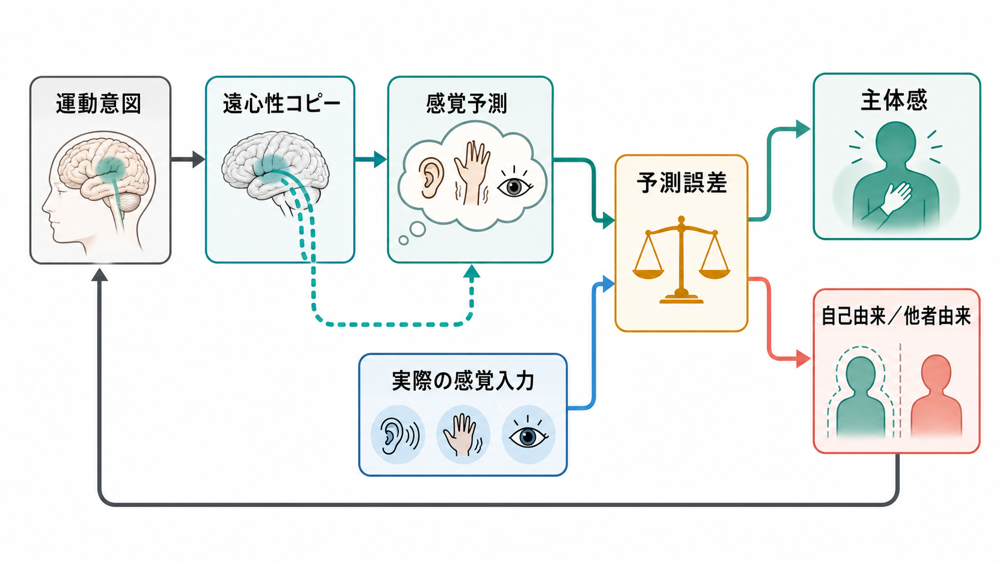

# 内受容感覚とは何か

## 要点

- 内受容感覚とは、心拍、呼吸、胃腸、体温、痛み、疲労、空腹、尿意など、身体内部状態に由来する信号を神経系が感知・解釈・統合する働きである [1][5]。
- これは「身体の内側を正確に感じる能力」だけではない。多くの内受容信号は意識に上らず、恒常性維持、情動、意思決定、注意、自己感覚を支える背景条件として働く [1][6]。
- 島皮質、前帯状皮質、脳幹、視床、自律神経系は、内受容感覚と感情経験をつなぐ主要な回路として研究されてきた [2][3]。
- 近年は、身体信号が下から脳へ上がるだけでなく、脳が身体状態を予測し、予測誤差を用いて身体調整と主観的感情を更新する、という[[予測処理とは何か|予測処理]]の観点が重要になっている [4][7]。
- 臨床研究では、不安、身体症状、摂食、慢性痛、抑うつ、PTSDなどとの関連が調べられている。ただし、内受容感覚の高さが常に健康に良いわけではなく、「何を、どれくらい、どの文脈で、どう解釈するか」が重要である [5]。

## この記事で答える問い

1. 内受容感覚は、五感や体性感覚と何が違うのか。
2. 心拍、呼吸、胃腸感覚などの信号は、どのように感情や自己感覚へ結びつくのか。
3. 島皮質や前帯状皮質は、内受容感覚の中でどのような役割をもつのか。
4. 内受容感覚を測る研究では、何を「よく感じている」とみなしているのか。
5. 臨床・精神医学研究で、内受容感覚を扱うときの注意点は何か。

## まず結論

内受容感覚は、「身体の内部を感じる第六感」のように説明されることがある。しかし、より正確には、身体内部の生理状態を神経系が予測し、検出し、解釈し、身体調整と主観的経験へ結びつける過程である。

たとえば、心臓が速く打っているとき、私たちはそれを「緊張している」「危険が近い」「運動したから当然だ」「理由はないが不安だ」と、文脈に応じて異なる意味として経験する。ここで重要なのは、身体信号そのものと、その信号に対する解釈が同じではないという点である。内受容感覚は、身体から脳へ届く信号だけでなく、脳が身体の状態をどう予測し、どの信号に注意を向け、どの意味づけを与えるかを含む [4][7]。

このため内受容感覚は、[[情動と認知は分けられるのか|情動と認知]]、[[最小自己とは何か|最小自己]]、[[意識とは何か|意識]]、[[身体症状症は脳の予測処理で説明できるのか|身体症状]]、[[摂食障害は脳の報酬系や身体感覚とどう関わるのか|摂食]]の問題と深く接続する。身体の内側をどう感じるかは、単なる感覚の問題ではなく、「いまの自分がどのような状態にあるか」という自己経験の基礎に関わる。

## 背景

古典的な感覚分類では、視覚、聴覚、嗅覚、味覚、触覚のように、外界の情報を受け取る感覚が中心に置かれてきた。これに対して内受容感覚は、身体内部の状態を知らせる感覚である。Craig は、内受容感覚を「身体の生理的状態の感覚」として整理し、痛み、温度、かゆみ、筋活動、内臓状態などが、身体の恒常性と主観的感情をつなぐ基盤になると論じた [1]。

この見方が重要なのは、感情を「頭の中だけの評価」でも「身体反応の単純な反映」でもなく、身体調整と主観的経験の結びつきとして扱えるからである。心拍の増加、呼吸の浅さ、胃の収縮、発汗、筋緊張は、それだけでは「不安」「怒り」「期待」「疲労」を一対一に決めない。けれども、それらは感情経験の材料として使われる。つまり、感情は身体状態と文脈解釈の統合として生じる。

内受容感覚の研究は、神経科学だけでなく、心理学、精神医学、心身医学、瞑想・マインドフルネス研究、計算論的精神医学に広がっている。なぜなら、同じ身体信号でも、人によって気づきやすさ、解釈、苦痛度、行動への影響が大きく異なるからである [5][8]。

## 基本概念

### 外受容・固有受容・内受容

感覚は大まかに、外界を知る外受容、身体の姿勢や運動を知る固有受容、身体内部状態を知る内受容に分けられる。

| 区分 | 主な対象 | 例 | 関連ノート |
|---|---|---|---|
| 外受容 | 外界の対象や出来事 | 光、音、匂い、外部の接触 | [[知覚とは何か]] |
| 固有受容 | 身体部位の位置と運動 | 関節角度、筋の伸張、姿勢 | [[体性感覚ネットワークは身体情報をどう表現するのか]] |
| 内受容 | 身体内部の生理状態 | 心拍、呼吸、胃腸、体温、空腹、痛み、疲労 | 本記事 |

ただし、この三分法は便利な整理であって、実際の経験では互いに混ざる。たとえば「息苦しい」は呼吸運動、血中二酸化炭素、胸郭感覚、注意、恐怖予測が統合された経験である。「空腹」も胃の収縮だけでなく、血糖、ホルモン、食物記憶、環境の匂いや時間帯に影響される。

### 内受容感覚は「正確さ」だけではない

内受容感覚を測る研究では、しばしば心拍検出課題が使われる。参加者が自分の心拍をどれくらい正確に数えられるか、または心拍と外部刺激の同期をどれくらい識別できるかを見る課題である。しかし Garfinkel らは、内受容感覚を一枚岩の能力として扱うのではなく、少なくとも次のように区別すべきだと論じた [3]。

| 側面 | 意味 | 例 |
|---|---|---|
| 内受容正確性 | 客観的課題で身体信号をどれだけ正確に検出できるか | 心拍検出課題の成績 |
| 内受容感受性 | 自分は身体感覚に敏感だとどれくらい感じているか | 質問紙での自己評価 |
| 内受容気づき | 正確性と自己評価がどれくらい一致しているか | 「自信があるときほど実際に正確」か |

この区別は臨床的にも重要である。ある人は、身体信号を客観的にはあまり正確に検出していなくても、「自分は心拍に非常に敏感だ」と感じているかもしれない。別の人は、身体信号をよく検出しているが、それを脅威として解釈しないかもしれない。したがって、「内受容感覚が高い・低い」だけでは不十分で、正確性、注意、信念、解釈、苦痛度を分けて考える必要がある。

### 内受容感覚と自己感覚

内受容感覚は、[[最小自己とは何か|最小自己]]に関わる。心拍、呼吸、体温、疲労、空腹、痛みなどは、「この身体がいまここで生きている」という感覚を支える。Quigley らは、内受容処理がエネルギー調整、記憶、情動経験、自己感覚にまたがる機能をもつと整理している [6]。

ここでの自己感覚は、履歴書に書けるような物語的自己ではない。もっと基礎的な、「いまここで経験している主体が自分である」という感じである。呼吸が乱れ、心拍が高まり、胃が縮むとき、私たちは世界の見え方だけでなく、自分自身の状態を変化したものとして感じる。この意味で、内受容感覚は[[主観的経験は科学的に扱えるのか|主観的経験]]の研究にも接続する。

## 仕組み

### 身体から脳へ上がる経路

内受容信号は、単一の「内受容神経」から送られるわけではない。心臓、肺、消化管、血管、筋、皮膚、免疫・内分泌系などに由来する多様な信号が、迷走神経、脊髄、脳幹、視床、島皮質、前帯状皮質などの経路で統合される [1][2]。

大まかには、次のような流れで理解できる。

1. 身体内部の受容器が、圧、伸展、化学状態、温度、炎症、エネルギー状態などを検出する。
2. 迷走神経や脊髄経路を通じて、脳幹や視床へ信号が届く。
3. 島皮質、前帯状皮質、体性感覚皮質、扁桃体、前頭前野などが、身体信号を情動、注意、行動選択と結びつける。
4. 自律神経系、内分泌系、行動を通じて、身体状態が再び調整される。

Critchley らの fMRI 研究では、心拍に注意を向ける課題で、島皮質、体性感覚運動領域、帯状皮質の活動が観察され、内受容正確性や主観的な情動経験との関連が示された [2]。この研究は、内受容感覚が単なる末梢感覚ではなく、脳内の身体表象と情動経験に関わることを示す代表的な出発点になった。

### 島皮質と前帯状皮質

島皮質は、内受容感覚の研究で最も頻繁に言及される領域の一つである。後部島皮質は比較的原初的な身体信号に関わり、前部島皮質はそれらを注意、情動、主観的気づきと結びつける領域として論じられてきた [1][2]。

前帯状皮質は、身体状態に基づく行動調整、努力、痛み、葛藤、動機づけに関わる。内受容感覚が重要なのは、身体状態を「感じる」だけでなく、それに応じて行動を変える必要があるからである。疲れているなら休む、空腹なら食べる、息苦しいなら呼吸を整える、危険を感じるなら逃げる。内受容感覚は、感情と行動の接点にある。

### 予測処理としての内受容感覚

近年の重要な観点は、内受容感覚を[[予測処理とは何か|予測処理]]として捉えることである。Barrett と Simmons は、内受容経験は、身体から上がる感覚だけでなく、脳が予測する身体状態によって強く形づくられると論じた [4]。Seth も、情動や身体化された自己を、内受容信号の原因についての推論として理解する枠組みを提示している [7]。

この考え方では、脳は身体状態を受動的に観察しているのではない。むしろ、次に必要になるエネルギー、酸素、血流、姿勢、行動を予測し、身体を先回りして調整する。予測と実際の信号がずれたとき、そのずれが予測誤差として扱われる。

たとえば、人前で発表する直前に心拍が上がる場合、脳は「これから負荷が高い状況が来る」と予測し、身体を準備しているとも考えられる。この心拍上昇は、文脈によって「不安」「集中」「興奮」「危険」のいずれにも解釈されうる。内受容感覚は、身体信号そのものではなく、身体信号と予測モデルの照合から生じる。

## 図解

| 図 | 読み方 | 対応する本文 |
|---|---|---|
| 概念地図 | 内受容感覚を、身体内部状態、神経回路、感情、自己感覚、臨床研究へ広げて読む | 要点、背景、基本概念 |
| メカニズム図 | 身体信号が脳幹・視床・島皮質・前帯状皮質を通じて予測誤差、感情、行動調整へつながる流れを見る | 仕組み |
| 応用接続図 | 測定法、個人差、臨床研究、介入研究の区別を見る | 臨床・研究との接続 |

図は概念整理のための模式図であり、特定の診断や治療法を指示するものではない。とくに臨床領域では、内受容感覚は疾患の単独原因ではなく、注意、信念、学習歴、身体疾患、社会的文脈と相互作用する要因として扱う必要がある。

## 臨床・研究との接続

### 不安と身体信号

不安では、心拍、息苦しさ、胸部圧迫感、発汗、胃腸不快感などが強く意識されることがある。重要なのは、これらの信号が「危険の証拠」として解釈されると、不安がさらに増幅しうる点である。これは[[ノルアドレナリン系は不安と覚醒にどう関わるのか|覚醒]]や[[扁桃体過活動は不安症やPTSDにどう関わるのか|脅威処理]]とも関係する。

ただし、「内受容感覚が鋭いから不安になる」と単純化してはいけない。正確に感じているのか、過剰に注意を向けているのか、脅威として解釈しているのか、身体疾患があるのかは別問題である。Khalsa らは、内受容感覚とメンタルヘルスを結ぶ研究では、疾患横断的な測定、神経回路、行動指標、介入研究を統合する必要があると整理している [5]。

### 摂食、空腹、満腹

摂食行動では、空腹、満腹、胃の伸展、血糖、ホルモン、報酬、食物記憶、社会的文脈が絡む。内受容感覚は「身体が何を必要としているか」を知らせるが、その信号は食物の視覚・匂い、過去の学習、感情状態によって解釈が変わる。したがって、[[摂食障害は脳の報酬系や身体感覚とどう関わるのか|摂食障害]]との関連を考えるときも、内受容感覚を単独の原因としてではなく、報酬、身体イメージ、自己評価、習慣、社会文化的要因と合わせて理解する必要がある [5][6]。

### 身体症状と予測誤差

身体症状が強く苦痛をもたらす場合、身体信号、注意、予測、解釈が互いに増幅しあうことがある。たとえば軽い心拍変化が「危険な異常」と解釈されると、注意が心拍に固定され、さらに心拍が高まり、症状への確信が強まる可能性がある。このような見方は、[[身体症状症は脳の予測処理で説明できるのか|身体症状症と予測処理]]の議論とつながる。

ここでも、教育・研究目的の説明と個別診断は分ける必要がある。実際の身体症状には医学的評価が必要な場合があり、内受容感覚や予測処理だけで説明してよいわけではない。

### マインドフルネスと身体気づき

呼吸、姿勢、身体感覚へ注意を向ける実践は、内受容感覚の気づきを高める方法として研究されている。Mehling らの MAIA は、身体感覚への気づきを多次元的に測る質問紙として開発された [8]。そこでは、単に身体感覚に気づくことだけでなく、注意制御、情動反応、自己調整、身体への信頼などが区別される。

この点は実践上も重要である。身体に注意を向ければ常に良いとは限らない。人によっては、身体感覚への注意が不安や苦痛を強めることもある。研究上は、どの対象に、どの方法で、どの程度の期間、どのアウトカムを見ているのかを慎重に区別する必要がある。

## よくある誤解

### 誤解1: 内受容感覚は「心拍を当てる能力」のこと

心拍検出課題は代表的な測定法だが、内受容感覚全体を代表するわけではない。呼吸、胃腸、痛み、温度、疲労、空腹、尿意、炎症、ホルモン状態など、多くの内受容領域がある。心拍に敏感でも胃腸感覚に鈍い、あるいはその逆もありうる。

### 誤解2: 身体の声を聞けば正しい答えがわかる

身体信号は重要な情報源だが、常に正しい意味をもつわけではない。心拍上昇は危険、運動、カフェイン、睡眠不足、期待、薬剤、発熱など多くの原因で起こる。内受容感覚は、身体信号を文脈の中で解釈する過程であり、「身体の声」をそのまま信じればよいという話ではない。

### 誤解3: 内受容感覚が高いほど健康である

内受容感覚には複数の側面がある。正確性、自己評価、注意、解釈、苦痛度、調整能力は同じではない [3][8]。過度の身体注意が不安を強める場合もあれば、適切な身体気づきが感情調整を助ける場合もある。重要なのは、身体信号への気づきを、柔軟な解釈と行動調整につなげられるかである。

### 誤解4: 内受容感覚は脳の中だけで決まる

内受容感覚は脳だけでなく、心臓、肺、消化管、筋、免疫、内分泌、生活習慣、睡眠、運動、社会的文脈に支えられている。脳は身体を解釈するが、身体そのものの状態もまた脳の予測や感情を変える。内受容感覚は、脳と身体の循環的な調整過程である。

## 関連ノート

- [[予測処理とは何か]]
- [[情動と認知は分けられるのか]]
- [[最小自己とは何か]]
- [[意識とは何か]]
- [[主観的経験は科学的に扱えるのか]]
- [[体性感覚ネットワークは身体情報をどう表現するのか]]
- [[身体症状症は脳の予測処理で説明できるのか]]
- [[摂食障害は脳の報酬系や身体感覚とどう関わるのか]]
- [[ノルアドレナリン系は不安と覚醒にどう関わるのか]]
- [[扁桃体過活動は不安症やPTSDにどう関わるのか]]

### MOC更新候補

- `content/00_MOC/MOC｜認知科学・心理学.md`
- 必要に応じて、意識・自己・身体性、情動、予測処理、精神医学系MOCへの追加候補。

## 理解チェック

1. 内受容感覚と外受容、固有受容の違いを、それぞれ一例ずつ挙げて説明できるか。
2. 「心拍が速い」という身体信号が、なぜ常に「不安」を意味するわけではないのか説明できるか。
3. 内受容正確性、内受容感受性、内受容気づきの違いを説明できるか。
4. 島皮質と前帯状皮質が、内受容感覚と感情・行動調整を結ぶうえで重要とされる理由を説明できるか。
5. 内受容感覚を臨床研究で扱うとき、なぜ「高いほどよい」と単純化できないのか説明できるか。

## 未解決問題

- 心拍、呼吸、胃腸、痛み、免疫・炎症など、異なる内受容領域を統一的に測る方法はまだ限られている。
- 心拍検出課題の成績が、日常生活での身体気づきや感情調整をどこまで代表するかは慎重に扱う必要がある。
- 内受容感覚の変化が精神症状の原因なのか、結果なのか、補償的反応なのかを区別するには、縦断研究や介入研究が必要である。
- 予測処理モデルは強力な枠組みだが、具体的にどの神経回路、どの時間スケール、どの生理指標に対応するのかは、まだ検証が進行中である。

## 参考文献

[1] Craig, A. D. (2002). How do you feel? Interoception: the sense of the physiological condition of the body. *Nature Reviews Neuroscience*, 3, 655-666. https://doi.org/10.1038/nrn894

[2] Critchley, H. D., Wiens, S., Rotshtein, P., Ohman, A., & Dolan, R. J. (2004). Neural systems supporting interoceptive awareness. *Nature Neuroscience*, 7, 189-195. https://doi.org/10.1038/nn1176

[3] Garfinkel, S. N., Seth, A. K., Barrett, A. B., Suzuki, K., & Critchley, H. D. (2015). Knowing your own heart: distinguishing interoceptive accuracy from interoceptive awareness. *Biological Psychology*, 104, 65-74. https://doi.org/10.1016/j.biopsycho.2014.11.004

[4] Barrett, L. F., & Simmons, W. K. (2015). Interoceptive predictions in the brain. *Nature Reviews Neuroscience*, 16, 419-429. https://doi.org/10.1038/nrn3950

[5] Khalsa, S. S., Adolphs, R., Cameron, O. G., Critchley, H. D., Davenport, P. W., Feinstein, J. S., Feusner, J. D., Garfinkel, S. N., Lane, R. D., Mehling, W. E., Meuret, A. E., Nemeroff, C. B., Oppenheimer, S., Petzschner, F. H., Pollatos, O., Rhudy, J. L., Schramm, L. P., Simmons, W. K., Stein, M. B., Stephan, K. E., Van den Bergh, O., Van Diest, I., von Leupoldt, A., & Paulus, M. P. (2018). Interoception and mental health: a roadmap. *Biological Psychiatry: Cognitive Neuroscience and Neuroimaging*, 3(6), 501-513. https://doi.org/10.1016/j.bpsc.2017.12.004

[6] Quigley, K. S., Kanoski, S., Grill, W. M., Barrett, L. F., & Tsakiris, M. (2021). Functions of interoception: from energy regulation to experience of the self. *Trends in Neurosciences*, 44(1), 29-38. https://doi.org/10.1016/j.tins.2020.09.008

[7] Seth, A. K. (2013). Interoceptive inference, emotion, and the embodied self. *Trends in Cognitive Sciences*, 17(11), 565-573. https://doi.org/10.1016/j.tics.2013.09.007

[8] Mehling, W. E., Price, C., Daubenmier, J. J., Acree, M., Bartmess, E., & Stewart, A. (2012). The Multidimensional Assessment of Interoceptive Awareness (MAIA). *PLOS ONE*, 7(11), e48230. https://doi.org/10.1371/journal.pone.0048230
