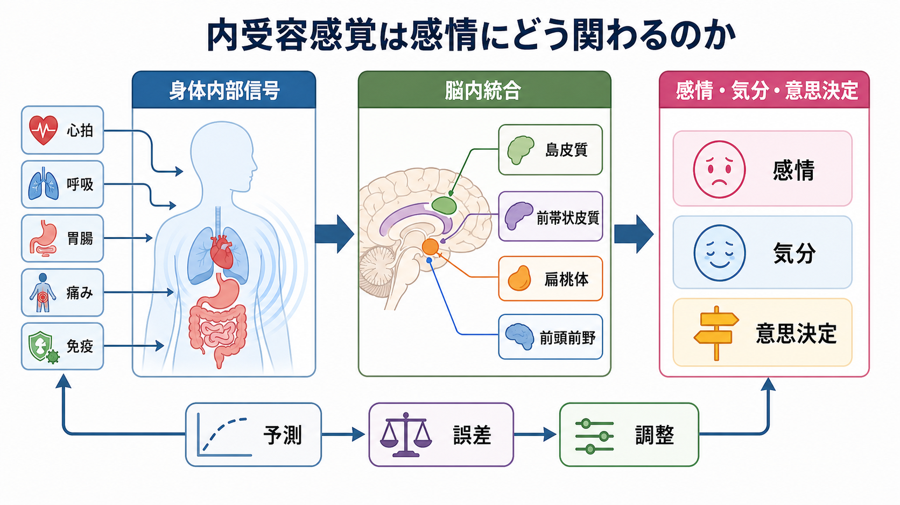
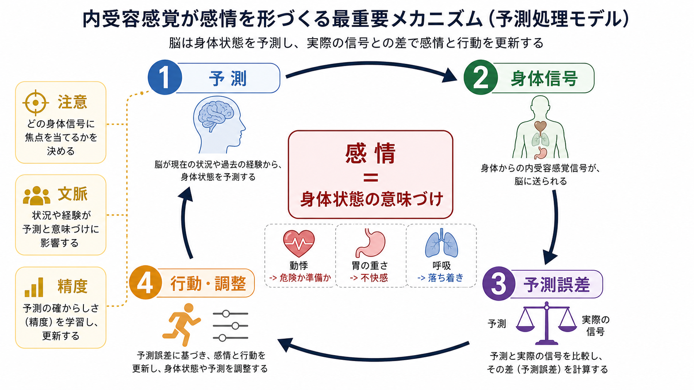
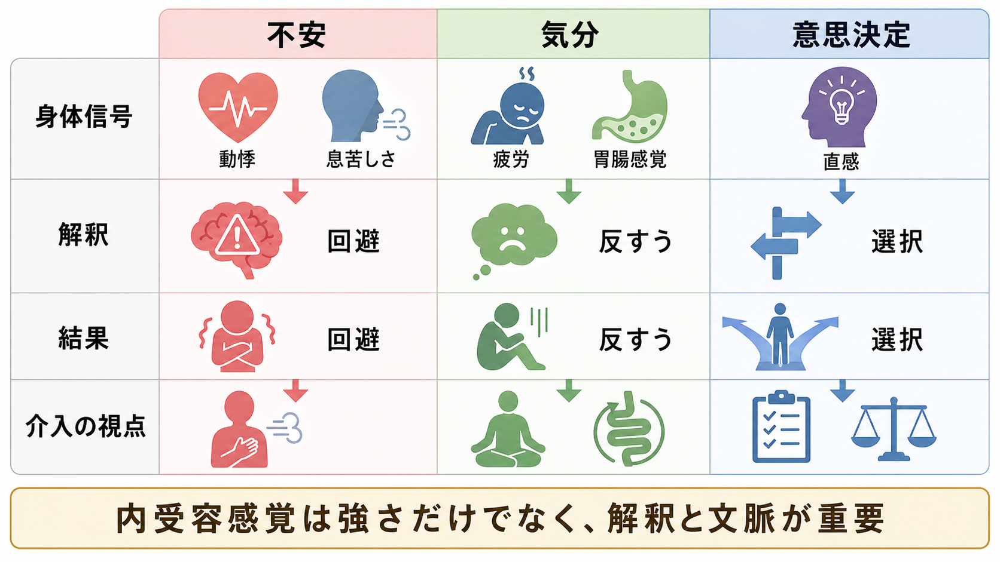

# 内受容感覚は感情にどう関わるのか

## 要点

- 内受容感覚とは、心拍、呼吸、胃腸、体温、痛み、疲労、免疫・炎症など、身体内部から来る信号を神経系が感知し、解釈し、統合する働きである [1]。
- 感情は、身体信号そのものだけで決まるのではなく、脳が「いま身体はどういう状態にあるはずか」を予測し、実際の信号と照合し、文脈に応じて意味づける過程で形づくられる [2][3]。
- 内受容感覚は、不安、気分、意思決定に関わる。ただし「内受容が鋭いほどよい」と単純には言えず、信号の正確さ、注意の向け方、解釈、文脈、調整可能性を分けて考える必要がある [4][5]。
- 臨床的には、不安症、うつ、摂食症、依存、身体症状症などで内受容の変化が報告されるが、個別診断や治療指示ではなく、研究上の説明枠組みとして扱う必要がある [1][6]。

## この記事で答える問い

このノートでは、[[意識とは何か]]や[[主観的経験は科学的に扱えるのか]]に関わる問題として、次の問いを整理する。

- なぜ心拍や呼吸の変化が「怖い」「落ち着かない」「なんとなく嫌だ」という感情に変わるのか。
- なぜ同じ動悸でも、運動後には自然に感じられ、会議前には不安に感じられるのか。
- 内受容感覚は、不安、気分、意思決定をどのように変えるのか。
- 内受容感覚を「鍛えればよい」という説明は、どこまで正しいのか。

## まず結論

内受容感覚は、感情の「材料」であり、同時に感情の「制御対象」でもある。身体から上がってくる心拍・呼吸・胃腸・痛み・疲労の信号は、島皮質、前帯状皮質、扁桃体、前頭前野などのネットワークで統合される [7]。しかし、主観的感情は身体信号のコピーではない。脳は過去経験、現在の文脈、注意、期待にもとづいて身体状態を予測し、予測と入力のずれを使って「危険」「疲労」「準備」「安心」といった意味を与える [2][3]。

そのため、内受容感覚と感情の関係は次のように考えるとわかりやすい。

| 観点 | 何を見るか | 感情への関わり |
|---|---|---|
| 身体信号 | 心拍、呼吸、胃腸、痛み、体温、疲労 | 感情の生理的材料になる |
| 注意 | どの信号に目立ちやすさを与えるか | 不安や反すうを増幅することがある |
| 予測 | 脳が身体状態をどう見積もるか | 「危険」「準備」「休息不足」などの意味づけを作る |
| 精度 | 信号をどれほど信頼するか | 誤った確信や過小評価を生むことがある |
| 調整 | 呼吸、行動、環境変更、休息 | 感情を変える入口になる |

## 背景

感情の古典的な考え方には、身体反応が感情経験の重要な構成要素だとする系譜がある。たとえば、恐怖を感じると心拍が上がるだけでなく、心拍や筋緊張の変化を知覚することが「怖い」という経験そのものに関わる、という発想である。現代の研究はこの直観をそのまま採用するのではなく、身体信号、脳内表象、予測、文脈、行動調整の相互作用として扱う [2][3][8]。

ここで重要なのは、内受容感覚が「身体の正確な読み取り」だけを意味しない点である。内受容は、意識に上る感覚だけでなく、自律神経系や内分泌系を介した非意識的な調整も含む。つまり、私たちは身体状態を感じてから反応するだけでなく、感じる前から身体状態を予測し、調整している [1][2]。

## 基本概念

### 内受容感覚

内受容感覚は、身体内部の状態に関する信号を扱う広い概念である。心拍や呼吸の知覚が代表例として使われるが、実際には胃腸感覚、膀胱感覚、体温、痛み、空腹、渇き、疲労、免疫・炎症関連の信号も含まれる [1]。

### 内受容の測定は一枚岩ではない

内受容感覚を測るときには、少なくとも次の側面を区別する必要がある [4]。

| 側面 | 例 | 注意点 |
|---|---|---|
| 内受容正確性 | 心拍検出課題で実際の心拍をどれだけ正しく捉えるか | 課題特異性が高く、心拍だけで全身の内受容を代表できない |
| 内受容感受性 | 自分は身体感覚に敏感だとどれだけ感じているか | 自己報告であり、不安や信念の影響を受ける |
| 内受容気づき | 正確性への自信が実際の成績とどれだけ対応するか | 「鋭いと思っている」と「実際に正確」は別である |

この区別は臨床的にも重要である。たとえば、身体感覚に強く注意が向いていても、それが正確な読み取りとは限らない。むしろ、不確実な信号を危険として解釈しやすい場合、不安が増幅される可能性がある [5][6]。

## 仕組み

### 1. 身体信号は感情の材料になる

心拍上昇、呼吸の浅さ、胃の重さ、筋緊張、発汗、疲労感は、それだけではまだ「感情」ではない。しかし、これらの信号は感情経験の材料になる。fMRI研究では、心拍への注意や内受容課題の遂行に、島皮質、体性感覚・運動関連領域、帯状皮質などが関与することが示されている [7]。前部島皮質は、身体内部状態を主観的な「いまの感じ」として再表象する領域として議論されてきた [8]。

### 2. 脳は身体状態を予測する

予測処理の観点では、脳は身体からの信号をただ受け取るだけではない。脳は「この文脈なら心拍は上がるはずだ」「この疲労感は休息不足を示すはずだ」といった予測を作り、その予測と実際の内受容入力との差を小さくしようとする [2][3]。

この枠組みでは、感情は次のような循環で生じる。

1. 脳が身体状態を予測する。
2. 身体内部から信号が上がる。
3. 予測と入力のずれが評価される。
4. 文脈や注意に応じて、信号に意味が与えられる。
5. 行動、呼吸、自律神経、環境調整によって身体状態が更新される。

### 3. 同じ身体信号でも、文脈で意味が変わる

同じ動悸でも、運動中であれば「身体が活動に備えている」と解釈されやすく、人前で話す直前であれば「失敗するかもしれない」という不安に結びつきやすい。これは、身体信号が単独で感情名を決めるのではなく、状況、記憶、信念、注意、行動可能性と組み合わさって意味づけられるためである [2][5]。

### 4. 意思決定では「身体の手がかり」が役立つことも、邪魔になることもある

内受容感覚は直感的意思決定にも関わる。Dunnらの研究では、心拍をより正確に捉えられる人ほど、情動画像に対する身体反応と主観的覚醒の結びつきが強く、さらに直感的意思決定では、予期的な身体信号が有利な選択を支持する場合には助けになり、不利な選択を支持する場合には妨げにもなりうることが示された [5]。

つまり、「身体の声に従う」は常に正しいわけではない。身体信号が、環境の規則や長期的利益をよく反映している場面では役立つ。一方、過去の失敗、慢性的ストレス、誤った危険予測が身体信号に混ざる場面では、回避や過剰警戒を強めることがある。

## 図解

内受容感覚は、不安、気分、意思決定にそれぞれ異なる入口をもつ。

| 領域 | 内受容感覚の関わり | 典型的なリスク | 研究・実践上の視点 |
|---|---|---|---|
| 不安 | 動悸、息苦しさ、胃の違和感が危険予測と結びつく | 身体感覚への過注意、破局的解釈、回避 | 信号そのもの、注意、解釈、行動を分けて評価する |
| 気分 | 疲労、重さ、睡眠不足、炎症関連信号が自己評価に影響する | 「自分はだめだ」という自己関連信念と結びつく | 身体状態と自己評価を区別する |
| 意思決定 | 予期的な身体反応が選択の手がかりになる | 誤った警戒信号に従う、短期回避を選ぶ | 身体信号が何を予測しているかを検討する |

## 臨床・研究との接続

内受容感覚の異常は、不安症、うつ、摂食症、依存、身体症状症など幅広い精神健康問題と関連づけられている [1]。ただし、内受容の変化が原因なのか、結果なのか、維持要因なのかは疾患や個人によって異なる。したがって、「この症状は内受容の問題である」と一括りにするよりも、どの内受容過程が変化しているのかを分けて考えるほうが有用である。

不安とうつに関するレビューでは、内受容入力が強い、またはノイズが多いだけでなく、自己関連信念やトップダウン予測が身体信号の解釈を変える可能性が論じられている [6]。たとえば、動悸そのものよりも「この動悸は危険な兆候だ」という予測が不安を強める場合がある。うつでは、疲労や身体の重さが「自分は何もできない」という信念と結びつくことで、気分と行動の低下が維持される可能性がある。

研究上は、内受容を単一指標で測ることの限界が大きい。心拍検出課題、呼吸負荷、胃腸感覚、自己報告尺度、神経画像、自律神経指標は、それぞれ異なる過程を見ている。今後は、内受容正確性、主観的感受性、気づき、予測、行動調整を組み合わせた研究が必要になる [1][4]。

## よくある誤解

### 誤解1: 内受容感覚が鋭いほどメンタルヘルスによい

必ずしもそうではない。身体信号をよく拾えることが、情動理解や意思決定を助ける場面はある [5]。しかし、身体感覚への過注意や危険解釈が強い場合、信号への敏感さは不安を増幅することがある [6]。重要なのは、強く感じることではなく、文脈に応じて正確に解釈し、必要な調整につなげられることである。

### 誤解2: 感情は身体反応だけで説明できる

身体反応は重要だが、それだけでは感情名も意味も決まらない。同じ心拍上昇が、恐怖、怒り、運動後の高揚、恋愛の緊張として経験されうる。感情には、身体信号に加えて、予測、文脈、記憶、社会的意味づけが関わる [2][3]。

### 誤解3: 内受容感覚は心拍を感じる能力のことだけである

心拍は研究しやすいため代表例として使われるが、内受容は呼吸、胃腸、痛み、体温、空腹、疲労、免疫関連信号を含む広い概念である [1]。心拍課題の成績だけから、内受容全体を評価するのは慎重であるべきである [4]。

### 誤解4: 身体感覚に気づけば、感情は自動的に改善する

身体感覚への気づきは入口になりうるが、気づき方によっては反すうや過警戒を増やすこともある。研究・臨床の文脈では、感覚への注意、解釈、行動選択、環境調整を分けて扱う必要がある。個別の症状や治療については専門家の評価が必要であり、このノートは教育・研究目的の整理である。

## 関連ノート

既存ノート:

- [[意識とは何か]]
- [[主観的経験は科学的に扱えるのか]]
- [[サリエンスネットワークとは何か]]
- [[セロトニンは気分だけに関わるのか]]
- [[ノルアドレナリンは覚醒とストレスにどう関わるのか]]

今後の作成候補:

- 内受容感覚とは何か
- 島皮質は主観的感情にどう関わるのか
- 予測処理から見た感情
- 不安症における身体感覚の過注意
- 身体化と予測処理
- ソマティックマーカー仮説とは何か

MOC更新候補:

- `content/00_MOC/MOC｜認知科学・心理学.md`
- `content/00_MOC/MOC｜計算論的精神医学.md`
- `content/00_MOC/MOC｜脳・神経科学.md` が存在する場合は追加候補

## 理解チェック

1. 内受容感覚は、外界の視覚や聴覚と何が違うか。
2. 「内受容正確性」と「内受容感受性」はなぜ区別する必要があるか。
3. 同じ動悸が、運動後と発表前で異なる感情に結びつくのはなぜか。
4. 不安において、身体信号そのものと身体信号の解釈を分けると何が見えやすくなるか。
5. 意思決定で身体信号が役立つ条件と、妨げになる条件は何か。

## 未解決問題

- 心拍、呼吸、胃腸、痛み、疲労など、異なる内受容チャネルを共通の尺度で比較できるのか。
- 内受容感覚の変化は、精神疾患の原因、結果、維持要因のどれとして働くのか。
- 内受容への注意を高める介入は、どの個人・症状では有益で、どの個人・症状では過警戒を強めるのか。
- 予測処理モデルを、臨床で使える評価指標や介入選択にどう接続できるのか。

## 参考文献

[1] Khalsa, S. S., Adolphs, R., Cameron, O. G., Critchley, H. D., Davenport, P. W., Feinstein, J. S., et al. (2018). Interoception and mental health: A roadmap. *Biological Psychiatry: Cognitive Neuroscience and Neuroimaging*, 3(6), 501-513. https://doi.org/10.1016/j.bpsc.2017.12.004

[2] Barrett, L. F., & Simmons, W. K. (2015). Interoceptive predictions in the brain. *Nature Reviews Neuroscience*, 16, 419-429. https://doi.org/10.1038/nrn3950

[3] Seth, A. K. (2013). Interoceptive inference, emotion, and the embodied self. *Trends in Cognitive Sciences*, 17(11), 565-573. https://doi.org/10.1016/j.tics.2013.09.007

[4] Garfinkel, S. N., Seth, A. K., Barrett, A. B., Suzuki, K., & Critchley, H. D. (2015). Knowing your own heart: Distinguishing interoceptive accuracy from interoceptive awareness. *Biological Psychology*, 104, 65-74. https://doi.org/10.1016/j.biopsycho.2014.11.004

[5] Dunn, B. D., Galton, H. C., Morgan, R., Evans, D., Oliver, C., Meyer, M., Cusack, R., Lawrence, A. D., & Dalgleish, T. (2010). Listening to your heart: How interoception shapes emotion experience and intuitive decision making. *Psychological Science*, 21(12), 1835-1844. https://doi.org/10.1177/0956797610389191

[6] Paulus, M. P., & Stein, M. B. (2010). Interoception in anxiety and depression. *Brain Structure and Function*, 214, 451-463. https://doi.org/10.1007/s00429-010-0258-9

[7] Critchley, H. D., Wiens, S., Rotshtein, P., Öhman, A., & Dolan, R. J. (2004). Neural systems supporting interoceptive awareness. *Nature Neuroscience*, 7, 189-195. https://doi.org/10.1038/nn1176

[8] Craig, A. D. (2009). How do you feel - now? The anterior insula and human awareness. *Nature Reviews Neuroscience*, 10, 59-70. https://doi.org/10.1038/nrn2555
