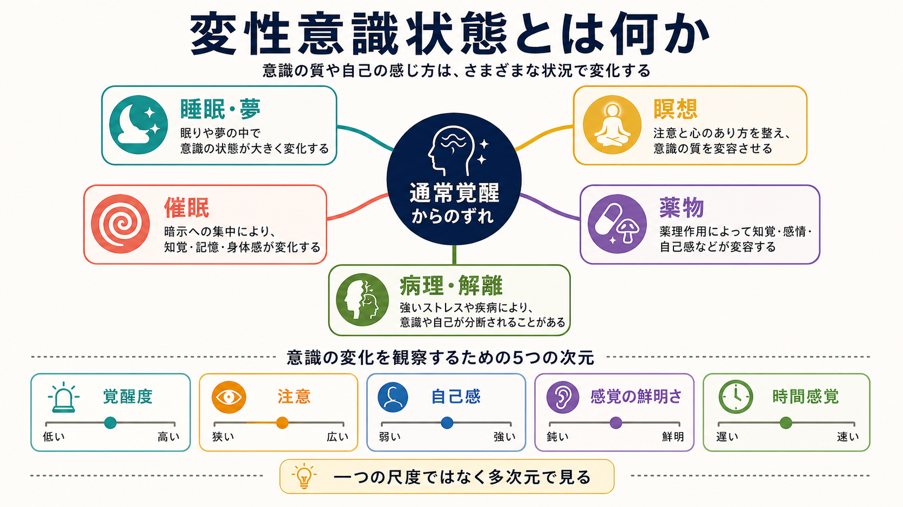
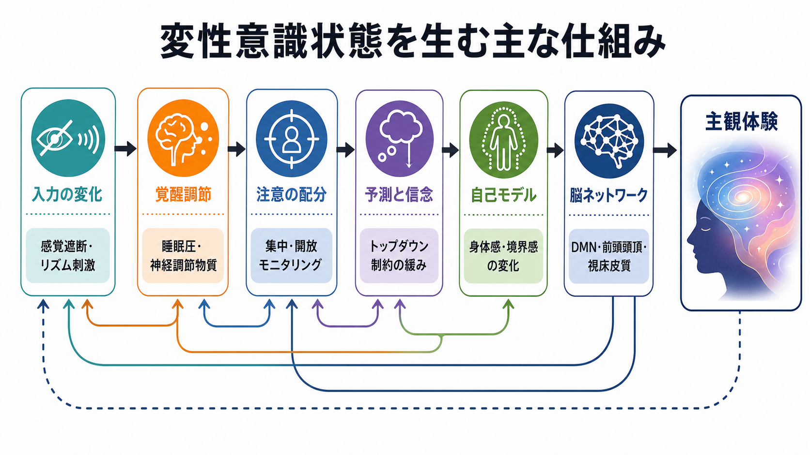

# 変性意識状態とは何か

## 要点

- 変性意識状態とは、通常の覚醒時と比べて、覚醒度、注意、知覚、自己感、時間感覚、情動、意味づけなどがまとまって変化した状態である。
- 睡眠・夢、瞑想、催眠、サイケデリックを含む薬物作用、病理的解離やせん妄などは、すべて同じ「深さ」の違いではなく、複数の次元で異なる変化を示す [1][2]。
- 重要なのは、珍しい体験を特別視することではなく、どの誘因が、どの神経・認知過程を通じて、どのような主観体験と行動上の変化を生むかを分けて考えることである。
- 臨床的には、変性意識状態そのものが病気というより、苦痛、機能障害、現実検討、危険行動、物質使用、身体疾患との関係を評価する必要がある。

## この記事で答える問い

1. 変性意識状態とは何を指すのか。
2. 睡眠、瞑想、催眠、薬物、解離はどのように違うのか。
3. 変性意識状態を「意識の深さ」だけで説明できないのはなぜか。
4. 脳ネットワーク、予測、自己感、注意はどのように関わるのか。
5. 研究や臨床で扱うとき、何に注意すべきか。

## まず結論

変性意識状態は、[[意識とは何か]]で扱う通常覚醒の意識を基準にした「例外状態」ではあるが、単に意識が高い・低いという一次元の変化ではない。たとえば、夢では外界への応答性は低いが、内的な知覚世界や情動は豊かになりうる。瞑想では覚醒は保たれたまま、[[注意とは何か|注意]]や自己への関わり方が変化する。催眠では暗示への反応性や行為主体感が変わる。サイケデリックでは知覚、自己境界、意味づけ、情動が大きく変わることがある [1][5][6]。

したがって、変性意識状態は「通常覚醒からのずれ」を、覚醒度、外界応答性、内的体験の鮮明さ、自己感、時間感覚、制御感、記憶、現実検討などの組み合わせとして読むのがよい。

## 背景

意識研究では、覚醒しているかどうか、何かを経験しているかどうか、その経験を報告できるかどうかがしばしば区別される [2][3]。変性意識状態は、この区別が必要であることをよく示す。眠っている人は外界には反応しにくいが、夢の中では視覚的・情動的経験を持つことがある。催眠下の人は覚醒しているが、暗示によって痛み、記憶、運動感、自己の制御感が変わることがある。瞑想者は目を閉じて静かに座っていても、注意、身体感覚、自己への同一化が大きく変わることがある。

このため、変性意識状態の研究は、[[知覚とは何か|知覚]]、注意、[[メタ認知とは何か|メタ認知]]、自己感、情動、記憶、脳ネットワークを横断する領域になっている。

## 基本概念

### 定義

変性意識状態とは、通常の覚醒時に比べて、主観体験と情報処理のパターンが一時的または反復的に変化した状態である。Vaitlらは、変性意識状態を、感覚入力、覚醒、注意、情動、記憶、自己境界、時間感覚などの変化を含む広い現象群として整理した [1]。

ここでの「変性」は、異常、優越、病理を意味しない。日常的な睡眠や夢も含まれるし、訓練としての瞑想、実験的な催眠、医療で用いられる鎮静や麻酔、物質による変化、解離症状のような臨床的現象も含まれる。

### 分類

| 種類 | 主な誘因 | 目立つ変化 | 注意点 |
|---|---|---|---|
| 睡眠・夢 | 概日リズム、睡眠圧、REM/NREM睡眠 | 外界応答性の低下、内的イメージ、奇妙な物語性 | 覚醒度と体験の豊かさは一致しない [4] |
| 瞑想 | 注意訓練、身体観察、開放モニタリング | 注意の安定化、自己関連思考の変化、情動調整 | 技法ごとにメカニズムが異なる [5] |
| 催眠 | 暗示、期待、対人文脈 | 暗示反応性、痛みや記憶の変化、行為主体感の変化 | 「眠り」ではなく、覚醒下の認知変化として扱う [6] |
| 薬物 | 神経伝達物質系への作用 | 知覚、情動、自己境界、意味づけの変化 | 用量、セット、セッティング、安全管理が重要 [7] |
| 病理・解離 | 強いストレス、疾患、睡眠不足、物質、神経疾患 | 現実感、自己感、記憶、注意の断片化 | 苦痛と機能障害、身体疾患、リスク評価が必要 |

## 仕組み

### 多次元の変化として見る

変性意識状態を「意識レベルの上下」とだけ見ると、重要な違いを見落とす。Bayneらは、意識を単一のレベルとして並べるよりも、覚醒、内容、統合、反応性、自己関連性など複数の特徴の組み合わせとして扱う必要を論じている [2]。夢、瞑想、催眠、薬物体験は、それぞれ異なる次元で通常覚醒からずれる。

たとえば、夢では外界への反応性が下がる一方で、内的な知覚内容は豊かになる。瞑想では覚醒と外界認識が保たれたまま、注意の焦点や自己関連処理が変わる。催眠では覚醒したまま、特定の暗示に沿って痛み、記憶、運動感が変わる。サイケデリックでは、知覚の鮮明さ、意味づけ、自己境界、時間感覚が同時に変化しうる [5][6][7]。

### 入力、覚醒、注意

第一の入口は、感覚入力と覚醒調節である。暗闇、単調な音、リズム刺激、感覚遮断、睡眠不足、疲労、薬物、呼吸法などは、脳に入る情報量や覚醒系の状態を変える。[[脳波EEGは何を測っているのか|脳波EEG]]や[[神経振動とは何か|神経振動]]の変化は、睡眠、瞑想、催眠、薬物状態の研究でよく使われる指標である。

第二の入口は、注意の配分である。集中瞑想では対象に注意を戻し続ける訓練が中心になる。開放モニタリングでは、経験を特定の対象に固定せず、現れては消えるものとして観察する。こうした実践は、自己関連思考や情動反応の変化と結びつく [5]。

### 予測と自己モデル

変性意識状態では、外界や身体についての予測、意味づけ、自己モデルが変わることが多い。通常、脳は感覚入力をただ受け取るだけでなく、過去経験や文脈にもとづいて「何が起きているか」を推定する。サイケデリック体験では、こうした高次の制約が緩み、知覚や意味づけが流動化するという説明が提案されている [7]。

自己感も重要である。瞑想では、思考や感情を「自分そのもの」と同一視する度合いが変わることがある。催眠では「自分が動かしている」という行為主体感が弱まることがある。解離では、身体、記憶、感情、現実感が分断されたように感じられることがある。ここでは[[解離症状は脳ネットワークでどう説明できるのか]]との接続が重要になる。

### 脳ネットワーク

変性意識状態は、単一の脳部位ではなく、複数のネットワークの再構成として理解される。[[デフォルトモードネットワークとは何か|デフォルトモードネットワーク]]は自己関連思考や内的な物語性と関わり、前頭頭頂ネットワークは課題制御や報告可能性に関わる。[[皮質視床ループは意識や注意にどう関わるのか|皮質視床ループ]]は覚醒、感覚統合、意識内容の維持に関わる。

ただし、特定のネットワーク活動だけで体験の質を断定することはできない。主観報告、行動、神経計測、文脈を組み合わせて読む必要がある [3]。

## 図解

この記事の3枚の図は、次の順に読むと理解しやすい。

| 図 | 読み方 |
|---|---|
| 概念地図 | 変性意識状態を「睡眠・夢、瞑想、催眠、薬物、病理・解離」として分類し、覚醒度・注意・自己感などの次元で見る |
| メカニズム図 | 入力、覚醒調節、注意、予測、自己モデル、脳ネットワークが、主観体験の変化へつながる流れを見る |
| 比較図 | 各状態の誘因、目立つ変化、研究・臨床での注意点を比較する |

## 臨床・研究との接続

研究では、変性意識状態は意識の仕組みを調べる自然実験のような役割を持つ。睡眠と夢は、外界応答性が低い状態でも豊かな主観体験が成立しうることを示す [4]。瞑想は、注意訓練と自己関連処理の変化を調べる入口になる [5]。催眠は、期待、暗示、行為主体感、痛み調整を研究する道具になる [6]。サイケデリック研究は、知覚、意味づけ、自己境界、神経ネットワークの柔軟性を検討する場になっている [7]。主観体験の測定では、Altered States of Consciousness Rating Scale のような質問紙を用いて、体験を複数次元に分けて扱う試みもある [8]。

臨床では、変性意識状態をただ「不思議な体験」として扱うのは不十分である。重要なのは、本人が苦痛を感じているか、生活機能が障害されているか、現実検討が保たれているか、身体疾患や物質使用が関わるか、自傷他害や事故のリスクがあるかである。たとえば、瞑想中の一過性の身体感覚変化と、持続的な離人感・現実感喪失による苦痛は同じ扱いにできない。

医療・精神医学に関する判断では、この記事は教育・研究目的の整理であり、個別診断や治療指示ではない。急な意識変容、見当識障害、けいれん、せん妄、物質使用後の混乱、自傷リスクが疑われる場合は、専門的評価が必要である。

## よくある誤解

### 誤解1: 変性意識状態はすべて病的である

病的とは限らない。睡眠、夢、集中、瞑想、音楽没入、フロー体験の一部は日常にもある。病的かどうかは、体験の珍しさだけでなく、苦痛、機能障害、危険性、文脈、持続性で判断する。

### 誤解2: 変性意識状態は意識が高い状態である

「高い」「低い」だけでは説明できない。夢は外界応答性が低いが内的体験は豊かである。瞑想は覚醒が保たれるが自己関連思考が変わる。催眠は覚醒下で暗示反応性が変わる。多次元で見る必要がある [2]。

### 誤解3: サイケデリック体験は必ず治療的である

研究上の治療効果が検討されている物質やプロトコルはあるが、体験の強さだけで治療的価値や安全性は決まらない。用量、文脈、心理的準備、身体・精神状態、専門的支援が大きく関わる [7]。

### 誤解4: 催眠は眠って操られる状態である

催眠は通常、覚醒下での暗示反応性や注意・期待の変化として研究される。本人の意図や文脈と無関係に完全に操られる状態として理解するのは不正確である [6]。

## 関連ノート

### 既存ノート

- [[意識とは何か]]
- [[注意とは何か]]
- [[知覚とは何か]]
- [[メタ認知とは何か]]
- [[デフォルトモードネットワークとは何か]]
- [[皮質視床ループは意識や注意にどう関わるのか]]
- [[脳波EEGは何を測っているのか]]
- [[神経振動とは何か]]
- [[睡眠障害は脳機能にどのような影響を与えるのか]]
- [[薬物療法は神経回路にどう作用するのか]]
- [[解離症状は脳ネットワークでどう説明できるのか]]

### 今後の作成候補

- 夢と意識はどう関係するのか
- 瞑想は注意と自己感をどう変えるのか
- 催眠とは何か
- サイケデリックは脳ネットワークをどう変えるのか
- 離人感・現実感喪失とは何か
- せん妄と意識障害は何が違うのか

### MOC更新候補

- `content/00_MOC/MOC｜認知科学・心理学.md`
- `content/00_MOC/MOC｜脳・神経科学.md`
- 意識・自己・身体性カテゴリの将来MOC

## 理解チェック

1. 変性意識状態を「意識レベルの上下」だけで説明しにくい理由は何か。
2. 夢、瞑想、催眠、サイケデリックでは、覚醒度、注意、自己感、外界応答性がどのように違うか。
3. 催眠を「眠り」と同一視すると、どの点を見落とすか。
4. サイケデリック体験の臨床的意味を判断するとき、体験の強さ以外に何を見るべきか。
5. 解離的な体験を研究上の変性意識状態として扱う場合、臨床的リスク評価とどのように区別する必要があるか。

## 未解決問題

- 変性意識状態の分類は、主観報告にもとづく分類と神経指標にもとづく分類をどこまで対応づけられるのか。
- 瞑想、催眠、サイケデリック、解離で共通する自己感の変化は、同じメカニズムなのか、似た現象に見える別メカニズムなのか。
- 体験の強度、洞察感、臨床的改善、安全性の関係を、どのような研究デザインで分離できるのか。
- 文化、期待、儀式、対人文脈は、変性意識状態の内容と意味づけをどの程度決めるのか。

## 参考文献

[1] Vaitl, D., Birbaumer, N., Gruzelier, J., Jamieson, G. A., Kotchoubey, B., Kubler, A., Lehmann, D., Miltner, W. H. R., Ott, U., Putz, P., Sammer, G., Strauch, I., Strehl, U., Wackermann, J., & Weiss, T. (2005). Psychobiology of altered states of consciousness. *Psychological Bulletin*, 131(1), 98-127. https://doi.org/10.1037/0033-2909.131.1.98

[2] Bayne, T., Hohwy, J., & Owen, A. M. (2016). Are there levels of consciousness? *Trends in Cognitive Sciences*, 20(6), 405-413. https://doi.org/10.1016/j.tics.2016.03.009

[3] Seth, A. K., & Bayne, T. (2022). Theories of consciousness. *Nature Reviews Neuroscience*, 23, 439-452. https://doi.org/10.1038/s41583-022-00587-4

[4] Nir, Y., & Tononi, G. (2010). Dreaming and the brain: from phenomenology to neurophysiology. *Trends in Cognitive Sciences*, 14(2), 88-100. https://doi.org/10.1016/j.tics.2009.12.001

[5] Lutz, A., Slagter, H. A., Dunne, J. D., & Davidson, R. J. (2008). Attention regulation and monitoring in meditation. *Trends in Cognitive Sciences*, 12(4), 163-169. https://doi.org/10.1016/j.tics.2008.01.005

[6] Oakley, D. A., & Halligan, P. W. (2013). Hypnotic suggestion: opportunities for cognitive neuroscience. *Nature Reviews Neuroscience*, 14, 565-576. https://doi.org/10.1038/nrn3538

[7] Carhart-Harris, R. L., & Friston, K. J. (2019). REBUS and the anarchic brain: toward a unified model of the brain action of psychedelics. *Pharmacological Reviews*, 71(3), 316-344. https://doi.org/10.1124/pr.118.017160

[8] Studerus, E., Gamma, A., & Vollenweider, F. X. (2010). Psychometric evaluation of the altered states of consciousness rating scale (OAV). *PLOS ONE*, 5(8), e12412. https://doi.org/10.1371/journal.pone.0012412
