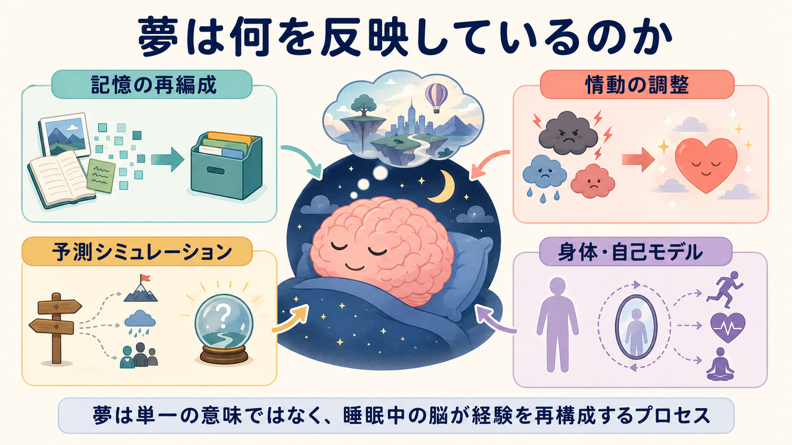
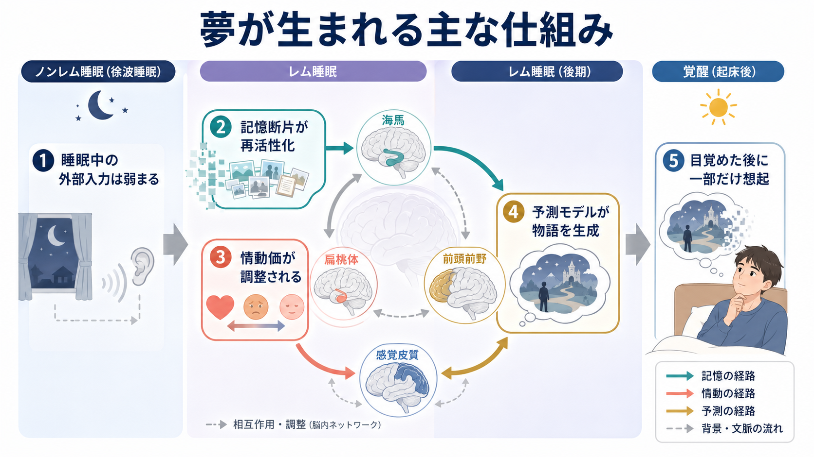

# 夢は何を反映しているのか

## 要点

- 夢は「隠された本心の直訳」ではなく、睡眠中の脳が、記憶、情動、身体感覚、予測モデルを再構成する過程として理解できる。
- REM睡眠だけでなくNREM睡眠でも夢様体験は報告される。したがって夢はREM睡眠に限った現象ではなく、[[覚醒と意識内容は何が違うのか|覚醒水準]]と[[意識とは何か|意識内容]]の組み合わせとして捉える必要がある [1]。
- 夢の内容は日中の経験や未解決の関心に影響されるが、すべての夢が記憶固定化や情動調整に役立つとは限らない [3][4]。
- 悪夢や外傷後の反復夢は、[[PTSDでは恐怖記憶ネットワークに何が起きているのか|恐怖記憶]]、睡眠の質、日中機能と接続して考える必要がある。ただし夢内容だけから個別診断を行うことはできない [8]。

## この記事で答える問い

このノートでは、「夢は何を反映しているのか」という問いを、次の4つに分けて整理する。

1. 夢は、最近の経験や[[記憶の固定化とは何か|記憶の固定化]]をどの程度反映するのか。
2. 夢は、恐怖、不安、報酬、喪失などの[[情動と認知は分けられるのか|情動処理]]をどの程度反映するのか。
3. 夢は、世界や自己についての[[予測処理とは何か|予測モデル]]をシミュレートしているのか。
4. 夢を臨床・研究で扱うとき、どこまで言えて、どこからは言い過ぎなのか。

## まず結論

夢は、単一の機能に還元しにくい。現在の妥当な見方は、「夢は、睡眠中に外部入力が弱まり、内的に再活性化された記憶・情動・身体信号を、脳が物語的な経験としてまとめる現象である」というものだ。神経生理学的には、脳幹、視床、感覚皮質、海馬、扁桃体、前頭前野などの状態変化が関与する [1][2]。認知科学的には、夢は[[無意識処理とは何か|無意識的処理]]と意識的経験の境界にあり、[[物語的自己とは何か|物語的自己]]がゆるく再構成される場でもある。

ただし、夢を「記憶の整理」「感情の消化」「未来予測」のどれか一つとして断定するのは粗い。夢には、意味のある再構成もあれば、断片的で機能がはっきりしない内容もある。重要なのは、夢を「何かを象徴する暗号」として読むよりも、どのプロセスがどの程度反映されているかを層別することである。

## 背景

古典的な夢解釈は、夢を無意識的願望や象徴として読むことが多かった。一方、20世紀後半以降の睡眠研究は、夢を脳状態の変化と結びつけた。HobsonとMcCarleyの活性化合成仮説は、REM睡眠中の脳幹由来の活性化を前脳が意味ある経験として合成する、という神経生理学的説明を提案した [2]。この仮説は、夢を単なる心理的象徴から、測定可能な脳状態へ引き戻した点で重要だった。

その後、夢研究はより統合的になった。夢は外部環境から相対的に切り離された状態で、脳が意識的世界を生成できることを示す自然実験であり、[[主観的経験は科学的に扱えるのか|主観的経験の科学]]にとっても重要な対象である [1]。

## 基本概念

### REM睡眠とNREM睡眠

REM睡眠では急速眼球運動、筋緊張低下、鮮明な視覚イメージ、強い情動を伴う夢が報告されやすい。一方、NREM睡眠でも思考様・断片的な夢様体験は起こる [1]。したがって「夢=REM睡眠」と単純化するより、睡眠段階ごとに経験の鮮明さ、物語性、想起されやすさが変わると見るほうがよい。

### 記憶断片

夢は日中の出来事をそのまま再生するよりも、断片を組み替えることが多い。[[エピソード記憶とは何か|エピソード記憶]]、[[意味記憶とは何か|意味記憶]]、身体感覚、情動的な印象が混ざり、目覚めた後には一部だけが想起される。睡眠が記憶固定化に関与することは強く支持されているが、個々の夢内容がそのまま固定化の記録であるとは限らない [3]。

### 情動価

夢には恐怖、不安、恥、喜び、喪失感などの情動価が強く反映されることがある。REM睡眠は情動記憶の再処理と関連すると考えられ、睡眠が翌日の情動反応を調整する可能性が議論されている [5]。ただし、悪夢が常に「治癒的な処理」を意味するわけではない。

### 予測モデル

[[予測処理とは何か|予測処理]]の観点では、脳は外界からの入力を受動的に写す装置ではなく、入力の原因を推定する生成モデルとして働く。夢は、外部入力が弱まった状態で、脳内モデルが自律的に世界を生成する現象として読める [7]。この見方では、夢は過去の再生であると同時に、ありうる状況のシミュレーションでもある。

## 仕組み

夢が生まれる過程は、次のような流れとして整理できる。

1. 睡眠中は外部入力と運動出力が制限される。
2. 記憶断片、身体信号、情動反応が部分的に再活性化する。
3. 前頭前野の監視・検証機能は覚醒時と同じではなく、矛盾や飛躍が受け入れられやすい。
4. 脳は再活性化された素材を、状況、人物、身体、行為を含む経験世界としてまとめる。
5. 起床後、夢の一部だけが言語的に想起され、報告可能な「夢」になる。

この流れは、夢の奇妙さを説明する。夢では、感覚イメージは鮮明でも、現実検討や時間順序は緩みやすい。[[身体所有感とは何か|身体所有感]]や[[最小自己とは何か|最小自己]]は保たれることが多いが、視点、場所、人物関係は急に変わる。つまり夢は、完全なランダムノイズではなく、しかし覚醒時の現実認識ほど制約されてもいない。

## 図解

夢の理論は、互いに排他的というより、異なる層を見ている。

| 見方 | 夢が反映するもの | 強み | 注意点 |
|---|---|---|---|
| 活性化合成 | 睡眠中の神経活性と記憶素材の合成 | 夢の奇妙さ、鮮明な感覚イメージ、想起困難を説明しやすい [2] | 夢内容の選択性や個人的意味を過小評価しやすい |
| 記憶処理 | 日中経験、学習課題、記憶断片の再編成 | 睡眠と学習の関係に強い根拠がある [3][4] | 夢を見れば必ず記憶が改善するわけではない |
| 情動処理 | 恐怖、不安、喪失、対人葛藤などの情動価 | 悪夢、PTSD、翌日の情動反応と接続しやすい [5][8] | 悪夢を常に適応的処理とみなすのは危険 |
| 脅威シミュレーション | 危険の検出と回避行動のリハーサル | 悪夢や反復夢の一部を説明しやすい [6] | 進化的機能としての証明は難しく、反証可能性に注意が必要 |
| 予測シミュレーション | 世界・身体・自己についての生成モデル | 知覚、想像、夢を連続的に説明できる [7] | 理論的魅力は高いが、個別夢内容への直接適用は慎重に行う |

## 臨床・研究との接続

研究では、夢報告、睡眠ポリグラフ、覚醒直後のインタビュー、脳波、神経画像、夢日誌などが使われる。夢報告は主観的データであり、想起バイアスと言語化の影響を受ける。そのため、夢内容だけを単独で読むのではなく、睡眠段階、覚醒直後の状態、日中のストレス、気分、薬物、生活リズムと合わせて解釈する必要がある。

臨床的には、反復する悪夢は睡眠の質、日中の不安、外傷体験、PTSD症状と関連しうる。AASMの成人悪夢障害に関するポジションペーパーは、悪夢障害が成人の一部にみられ、PTSDなどと併存しうること、心理的・行動的介入や薬物療法のエビデンスを区別して評価する必要があることを示している [8]。ただし、このノートは教育・研究目的であり、個別の診断や治療方針を示すものではない。

夢日誌は、診断ではなく、パターンを観察する道具として有用である。たとえば、夢の頻度、悪夢の反復性、睡眠時間、覚醒時の情動、ストレスイベントを並べて記録すると、「夢の意味」を断定するよりも、生活・睡眠・情動の関係を検討しやすい。

## よくある誤解

### 夢は必ず深層心理を表す

夢は個人的関心や情動を反映することがあるが、すべての夢が一貫した隠れた意味を持つとは限らない。記憶断片、身体信号、偶発的な連想、睡眠段階の影響も混ざる。

### 夢は単なるノイズで意味がない

活性化合成仮説は夢の神経生理を重視したが、夢が完全に無意味だと主張する必要はない。睡眠中の脳が記憶や情動素材を使って経験世界を生成するなら、夢は「ランダム」と「意味」の中間にある [2]。

### 悪夢は感情処理が進んでいる証拠である

悪夢が情動記憶と関係する可能性はあるが、反復し苦痛や睡眠障害をもたらす場合、それ自体が臨床的問題になりうる [8]。悪夢を本人の努力不足や単なる象徴として扱うべきではない。

### 夢を分析すれば診断できる

夢内容は心理状態の手がかりにはなりうるが、夢だけで精神疾患や神経疾患を診断することはできない。臨床判断には、症状、経過、機能障害、睡眠、身体状態、薬物、生活背景などの総合評価が必要である。

## 関連ノート

- [[睡眠障害は脳機能にどのような影響を与えるのか]]
- [[記憶の固定化とは何か]]
- [[エピソード記憶とは何か]]
- [[情動と認知は分けられるのか]]
- [[予測処理とは何か]]
- [[感情は身体感覚の予測なのか]]
- [[無意識処理とは何か]]
- [[物語的自己とは何か]]
- [[PTSDでは恐怖記憶ネットワークに何が起きているのか]]

今後の作成候補: 睡眠中の意識はどう理解できるのか

MOC更新候補: `content/00_MOC/` 配下の認知科学・意識・睡眠関連MOCに、バッチ統合時に追加する。

## 理解チェック

1. 夢を「記憶の再生」とだけ呼ぶと、どの点が抜け落ちるか。
2. REM睡眠と夢を同一視できない理由は何か。
3. 悪夢を情動処理として理解する場合、どのような臨床的注意が必要か。
4. 予測処理の観点では、夢はなぜ「外界なしの世界生成」として捉えられるのか。

## 未解決問題

- 個々の夢内容が、どの種類の記憶固定化や情動調整に対応するのかは、まだ十分に特定できない。
- 夢の機能を進化的適応として説明する理論は魅力的だが、直接検証が難しい。
- 夢報告は起床後の言語化に依存するため、睡眠中の経験そのものと報告された夢をどのように分けるかが課題である。
- 予測処理や自由エネルギー原理による夢の説明は統合的だが、実験的に区別可能な予測をさらに明確にする必要がある。

## 参考文献

[1] Nir, Y., & Tononi, G. (2010). Dreaming and the brain: From phenomenology to neurophysiology. *Trends in Cognitive Sciences, 14*(2), 88-100. https://doi.org/10.1016/j.tics.2009.12.001

[2] Hobson, J. A., & McCarley, R. W. (1977). The brain as a dream state generator: An activation-synthesis hypothesis of the dream process. *American Journal of Psychiatry, 134*(12), 1335-1348. https://doi.org/10.1176/ajp.134.12.1335

[3] Stickgold, R. (2005). Sleep-dependent memory consolidation. *Nature, 437*, 1272-1278. https://doi.org/10.1038/nature04286

[4] Wamsley, E. J., Tucker, M., Payne, J. D., Benavides, J. A., & Stickgold, R. (2010). Dreaming of a learning task is associated with enhanced sleep-dependent memory consolidation. *Current Biology, 20*(9), 850-855. https://doi.org/10.1016/j.cub.2010.03.027

[5] Walker, M. P., & van der Helm, E. (2009). Overnight therapy? The role of sleep in emotional brain processing. *Psychological Bulletin, 135*(5), 731-748. https://doi.org/10.1037/a0016570

[6] Revonsuo, A. (2000). The reinterpretation of dreams: An evolutionary hypothesis of the function of dreaming. *Behavioral and Brain Sciences, 23*(6), 877-901. https://doi.org/10.1017/S0140525X00004015

[7] Hobson, J. A., Hong, C. C.-H., & Friston, K. J. (2014). Virtual reality and consciousness inference in dreaming. *Frontiers in Psychology, 5*, 1133. https://doi.org/10.3389/fpsyg.2014.01133

[8] Morgenthaler, T. I., Auerbach, S., Casey, K. R., Kristo, D., Maganti, R., Ramar, K., Zak, R., & Kartje, R. (2018). Position paper for the treatment of nightmare disorder in adults: An American Academy of Sleep Medicine position paper. *Journal of Clinical Sleep Medicine, 14*(6), 1041-1055. https://doi.org/10.5664/jcsm.7178
