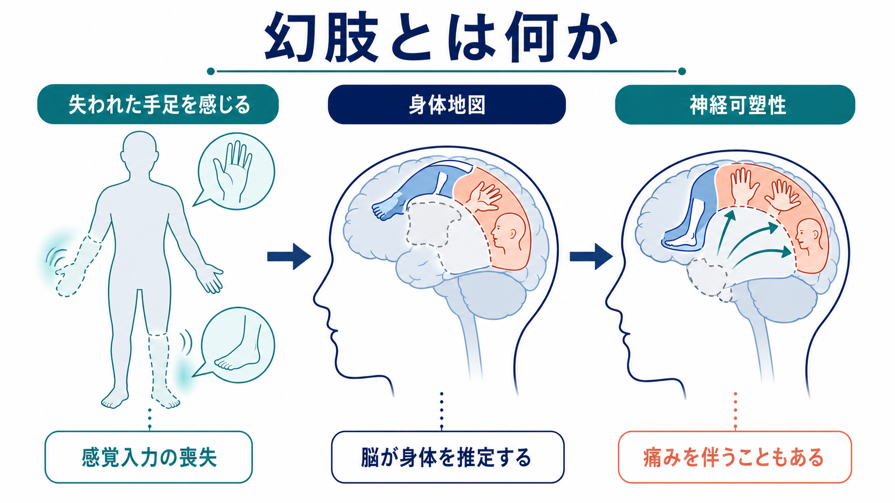
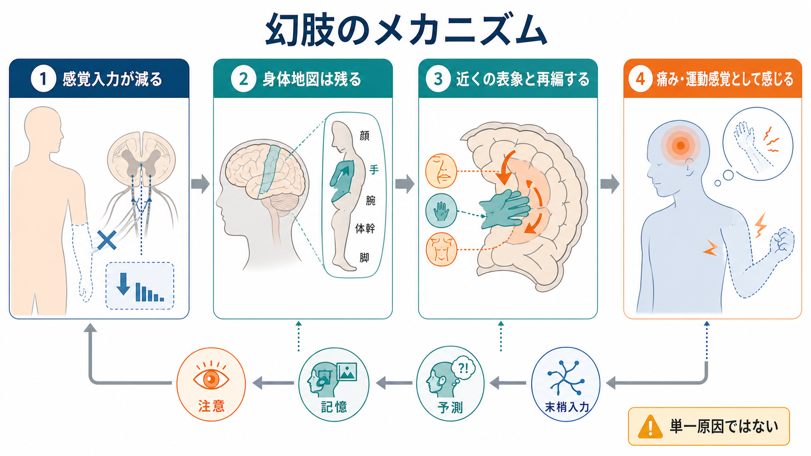
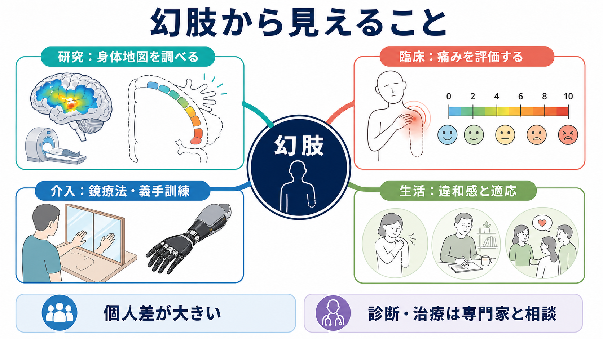

# 幻肢とは何か

## 要点

- 幻肢とは、切断や神経遮断などで身体部位が失われた後も、その部位がまだ存在するように感じられる現象である。
- 幻肢は「気のせい」ではなく、[[体性感覚ネットワークは身体情報をどう表現するのか|体性感覚ネットワーク]]、運動系、記憶、注意、情動、痛み処理が関わる身体経験である。
- 中心になる考え方は、脳が身体からの入力を受動的に読むだけでなく、身体についての地図や予測を使って「いま自分の身体はどうなっているか」を推定している、という点である。
- 幻肢痛は幻肢の一部であり、すべての幻肢が痛いわけではない。痛みがある場合も、末梢神経、脊髄、脳内表象、心理社会的要因が重なるため、単一原因に還元しにくい。

## この記事で答える問い

1. 幻肢とは、どのような主観的経験なのか。
2. なぜ、存在しない身体部位を感じることがあるのか。
3. 身体地図と神経可塑性は、幻肢をどう説明するのか。
4. 幻肢痛、鏡療法、義手訓練などは研究・臨床とどうつながるのか。

## まず結論

幻肢は、失われた身体部位の「感覚入力」が消えても、身体についての脳内表象がすぐには消えないことから生じる。脳には、皮膚、筋、関節、視覚、運動指令、過去の経験を統合して身体を表す仕組みがある。四肢が失われると、末梢からの入力は大きく変化するが、身体地図、運動指令、痛み記憶、注意、情動は残る。その不一致が、存在しない手足の位置、姿勢、動き、しびれ、かゆみ、締めつけ、痛みとして経験されることがある [1][2]。

ただし、「幻肢痛 = 体性感覚皮質の再編だけ」とは言えない。1990年代には、切断後の一次体性感覚野の再編成が幻肢痛の強さと関連するという重要な知見が報告された [3]。一方で近年は、痛みが強い人ほど失われた手の表象が保たれているという報告もあり、幻肢痛は「地図が消える」だけでなく、「失われた部位の表象が孤立して保たれる」「長距離結合が変わる」「末梢・脊髄・脳の複数階層が変化する」現象として再検討されている [5][6]。

## 背景

幻肢は、切断後の人だけに起こる特殊な錯覚として片づけるより、身体がどのように「自分の身体」として経験されるかを示す窓として理解すると見通しがよい。普段、私たちは手足の位置を逐一考えなくても、手を伸ばし、歩き、物をつかむことができる。これは[[身体図式とは何か|身体図式]]や[[身体所有感とは何か|身体所有感]]が、視覚、触覚、固有受容、運動予測を統合しているためである。

幻肢が重要なのは、身体経験が末梢からの入力だけで決まらないことを示すからである。切断により身体部位からの感覚入力は失われるが、「その部位が自分の身体の一部であった」という表象や、動かそうとする運動指令は残りうる。Ramachandran と Hirstein は、幻肢を成人脳の神経可塑性と身体イメージの関係を調べる重要な現象として整理した [2]。

## 基本概念

### 幻肢

幻肢とは、失われた身体部位がまだ存在するように感じられる経験である。手や足だけでなく、指、乳房、歯、眼など、さまざまな身体部位で報告される。経験の内容は、そこにある感じ、姿勢、長さ、動き、温度、しびれ、かゆみ、圧迫感、痛みなど多様である。

### 幻肢感覚と幻肢痛

幻肢感覚は、痛みを伴わない幻肢の感覚を含む。たとえば「足先が曲がっている」「指が動く感じがする」「手が短くなったように感じる」といった経験である。幻肢痛は、失われた身体部位に痛みを感じる場合を指す。レビューでは、幻肢痛は切断後の人のかなりの割合に生じるが、重症度、頻度、持続は個人差が大きいとされる [1][4]。

### 身体地図

身体地図とは、身体部位の位置や感覚を脳内で表す仕組みの比喩である。一次体性感覚野には、手、顔、足などの表象が一定の順序で並ぶ体部位再現がある。ただし実際の身体表象は、単一の地図ではなく、体性感覚野、運動野、頭頂葉、島皮質、前頭前野などに分散したネットワークとして働く。

### 神経可塑性

[[神経可塑性は発達と学習をどう支えるのか|神経可塑性]]とは、経験、損傷、学習、使用、不使用に応じて神経系の構造や機能が変化する性質である。切断後には、末梢神経の過敏化、脊髄レベルの感作、体性感覚皮質や運動皮質の再編、注意や情動に関わるネットワークの変化が重なりうる [4]。

## 仕組み

幻肢の仕組みは、次のように段階的に考えると理解しやすい。

1. 切断や神経損傷により、身体部位からの感覚入力が大きく減る。
2. しかし、脳内の身体地図、運動指令、過去の身体経験はすぐには消えない。
3. 入力が失われた領域は、近接する身体部位の表象、残存肢の入力、視覚、記憶、注意の影響を受けやすくなる。
4. その結果、失われた部位が「ある」「動く」「痛む」といった経験が生じることがある。

### 皮質再編モデル

Flor らは、腕切断後の人で、一次体性感覚野の再編成の大きさと幻肢痛の強さが強く関連することを報告した [3]。この研究は、幻肢痛を「末梢の傷だけ」ではなく、中枢神経系の可塑的変化として扱う流れを作った。

このモデルでは、たとえば手の入力が失われると、体性感覚地図で手の近くにある顔や腕の表象が、旧手領域へ入り込むように解釈される。顔への触刺激が幻肢の手に感じられるような「投射感覚」は、この地図再編のわかりやすい例として議論されてきた [2]。

### 保存された表象モデル

一方で、近年の fMRI 研究は、慢性幻肢痛が強い人ほど、旧手領域に失われた手の構造的・機能的表象が保たれている可能性を示した [5]。Kikkert らも、慢性幻肢痛と失われた手の表象維持との関連を再検討している [6]。

この見方では、幻肢痛は「身体地図が崩れたから痛い」という単純な話ではない。むしろ、失われた手の表象が主観的経験として強く残り、他の身体部位や両半球との結合が変化することで、痛みや違和感が維持される可能性がある。したがって、再編モデルと保存モデルは完全な二者択一ではなく、測定対象、切断後の期間、痛みの性質、義手使用、訓練経験によって見え方が変わる。

### 予測処理として見る

[[予測処理とは何か|予測処理]]の観点では、脳は身体から来る入力を待つだけでなく、「この身体はここにあり、このように動くはずだ」という予測を作る。切断後には、運動指令や身体地図の予測と、実際の感覚入力とのずれが大きくなる。このずれが、幻肢の位置、運動感、痛みとして経験されることがある。

この見方は、幻肢を「錯覚」ではなく、身体を推定する通常の仕組みが、入力の急激な変化に直面した状態として理解する。[[知覚とは何か|知覚]]が単なる外界の写しではないように、身体感覚も末梢入力の写しではなく、脳と身体と環境の相互作用として成立する。

## 図解

この記事の3枚の図は、幻肢を次のレベルで整理している。

| 図 | 主な役割 | 読むポイント |
|---|---|---|
| 1枚目 | 全体像 | 失われた手足を感じる現象を、身体地図と神経可塑性に結びつける |
| 2枚目 | 仕組み | 感覚入力の減少、身体地図の残存、再編、痛み・運動感覚への流れを見る |
| 3枚目 | 研究・臨床との接続 | 脳画像、鏡療法、義手訓練、痛み評価、生活適応を一つの枠組みに置く |

## 臨床・研究との接続

幻肢は、身体所有感、体性感覚皮質、運動皮質、痛み、リハビリテーション、義手インターフェースをつなぐ研究対象である。臨床的には、幻肢感覚そのものよりも、幻肢痛、睡眠障害、気分への影響、義肢使用への支障が問題になることが多い。ここで重要なのは、幻肢痛を「心理的なもの」と決めつけないことである。末梢神経の異常活動、脊髄感作、中枢再編、注意、情動、生活上のストレスが重なるため、評価も介入も多面的になる [4]。

鏡療法は、鏡に映った健側肢を失われた肢のように見せ、視覚フィードバックを通じて幻肢の動きや痛みに働きかける方法である。2021年のランダム化比較試験を対象にした系統的レビュー・メタ解析では、鏡療法が幻肢痛を軽減する可能性が示され、エビデンスの質は fair と評価された [7]。ただし、研究間の異質性は大きく、すべての人に同じ効果があると断定してはいけない。

義手や筋電義手の使用も、身体地図と幻肢痛に関係する。Lotze らは、筋電義手の使用が多い人ほど幻肢痛と皮質再編が少ない可能性を報告した [8]。これは、運動意図と感覚・視覚フィードバックを再び結びつけることが、身体表象の安定化に関わる可能性を示す。ただし、義手使用の効果は個人差が大きく、使用時間、適合、訓練、痛み、生活環境に左右される。

医療・リハビリテーション上の判断は、個別の状態を評価した専門家と相談して行う必要がある。本記事は教育・研究目的の概説であり、個別の診断や治療指示ではない。

## よくある誤解

### 誤解1: 幻肢は想像や思い込みである

幻肢は、想像だけで作られる現象ではない。身体地図、体性感覚皮質、運動皮質、末梢神経、脊髄、痛みネットワークが関わる身体経験である [2][4]。

### 誤解2: 幻肢は必ず痛い

幻肢には、痛みを伴わない感覚も多い。幻肢痛は重要だが、幻肢全体の一部である。痛みの有無、強さ、頻度、質は個人差が大きい [1]。

### 誤解3: 脳地図が再編すれば必ず痛みが出る

皮質再編と幻肢痛の関連は重要な知見だが、近年は保存された旧手表象や機能的結合の変化も注目されている [3][5][6]。したがって、幻肢痛を一つの地図変化だけで説明するのは不十分である。

### 誤解4: 鏡療法は誰にでも確実に効く

鏡療法には有望なエビデンスがあるが、効果の大きさや持続は人によって異なる。痛みの原因や生活状況が多様であるため、単独の万能介入としてではなく、評価とリハビリテーションの一部として位置づける必要がある [7]。

## 関連ノート

- [[身体所有感とは何か]]
- [[身体図式とは何か]]
- [[体性感覚ネットワークは身体情報をどう表現するのか]]
- [[神経可塑性は発達と学習をどう支えるのか]]
- [[予測処理とは何か]]
- [[疼痛と精神疾患は脳内でどうつながるのか]]
- [[知覚とは何か]]

### 関連ノート候補

- 幻肢痛とは何か
- 鏡療法とは何か
- 体部位再現とは何か
- 義手と身体所有感
- 神経障害性疼痛とは何か

### MOC更新候補

- `content/00_MOC/MOC｜認知科学・心理学.md`
- `content/00_MOC/MOC｜脳・神経科学.md`

並列ジョブとの衝突を避けるため、本記事作成時点では MOC 本体は更新しない。

## 理解チェック

1. 幻肢感覚と幻肢痛は、どの点で同じで、どの点で違うか。
2. 身体地図という比喩は、幻肢を理解するうえで何を説明し、何を説明しきれないか。
3. 皮質再編モデルと保存された表象モデルは、どのように対立し、どのように両立しうるか。
4. 鏡療法が効く可能性を、予測処理と感覚フィードバックの観点から説明できるか。

## 未解決問題

- 幻肢痛において、末梢神経、脊髄、皮質再編、保存された身体表象、情動・注意の寄与を個人ごとにどう分けて評価するか。
- 幻肢痛の強さと身体地図の変化の関係は、切断後の時間、義手使用、訓練、痛みの質によってどう変わるか。
- 鏡療法、VR、義手訓練、脳刺激、薬物療法を、どの順序・組み合わせで用いるとよいか。
- 幻肢を、[[身体所有感とは何か|身体所有感]]や[[身体図式とは何か|身体図式]]の一般理論へどこまで組み込めるか。

## 参考文献

[1] Nikolajsen, L., & Jensen, T. S. (2001). Phantom limb pain. *British Journal of Anaesthesia*, 87(1), 107-116. https://doi.org/10.1093/bja/87.1.107

[2] Ramachandran, V. S., & Hirstein, W. (1998). The perception of phantom limbs. The D. O. Hebb lecture. *Brain*, 121(9), 1603-1630. https://doi.org/10.1093/brain/121.9.1603

[3] Flor, H., Elbert, T., Knecht, S., Wienbruch, C., Pantev, C., Birbaumer, N., Larbig, W., & Taub, E. (1995). Phantom-limb pain as a perceptual correlate of cortical reorganization following arm amputation. *Nature*, 375, 482-484. https://doi.org/10.1038/375482a0

[4] Flor, H., Nikolajsen, L., & Staehelin Jensen, T. (2006). Phantom limb pain: a case of maladaptive CNS plasticity? *Nature Reviews Neuroscience*, 7, 873-881. https://doi.org/10.1038/nrn1991

[5] Makin, T. R., Scholz, J., Filippini, N., Henderson Slater, D., Tracey, I., & Johansen-Berg, H. (2013). Phantom pain is associated with preserved structure and function in the former hand area. *Nature Communications*, 4, 1570. https://doi.org/10.1038/ncomms2571

[6] Kikkert, S., Johansen-Berg, H., Tracey, I., & Makin, T. R. (2018). Reaffirming the link between chronic phantom limb pain and maintained missing hand representation. *Cortex*, 106, 174-184. https://doi.org/10.1016/j.cortex.2018.05.013

[7] Wang, F., Zhang, R., Zhang, J., Li, D., Wang, Y., Yang, Y. H., & Wei, Q. (2021). Effects of mirror therapy on phantom limb sensation and phantom limb pain in amputees: A systematic review and meta-analysis of randomized controlled trials. *Clinical Rehabilitation*, 35(12), 1710-1721. https://doi.org/10.1177/02692155211027332

[8] Lotze, M., Grodd, W., Birbaumer, N., Erb, M., Huse, E., & Flor, H. (1999). Does use of a myoelectric prosthesis prevent cortical reorganization and phantom limb pain? *Nature Neuroscience*, 2, 501-502. https://doi.org/10.1038/9145
